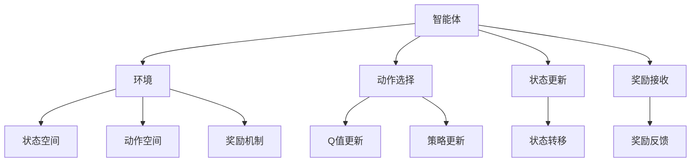

                 

# 强化学习在自动化仓储管理中的应用

> **关键词：** 强化学习、自动化仓储、机器人导航、路径规划、状态空间、奖励机制、Q-Learning、深度强化学习、应用案例

> **摘要：** 本文将深入探讨强化学习在自动化仓储管理中的应用，通过详细分析其核心概念、算法原理、数学模型和项目实战，旨在为读者提供全面、系统的理解，以及未来发展趋势和挑战的展望。

## 1. 背景介绍

### 1.1 目的和范围

自动化仓储管理作为物流领域的重要组成部分，正日益受到关注。随着电商和制造业的蓬勃发展，仓储需求不断增加，传统的手工管理方式已无法满足高效、精准的要求。本文旨在探讨如何利用强化学习技术，提高自动化仓储管理的效率和质量。

本文将涵盖以下内容：
1. 强化学习在自动化仓储管理中的背景和重要性。
2. 强化学习的基本概念、原理和算法。
3. 强化学习在自动化仓储管理中的应用场景。
4. 强化学习的数学模型和具体操作步骤。
5. 强化学习的实际应用案例和代码实现。
6. 自动化仓储管理的未来发展趋势和挑战。

### 1.2 预期读者

本文面向对自动化仓储管理和强化学习有一定了解的技术人员，包括：
1. 物流和供应链管理领域的研究人员。
2. 机器人导航和路径规划领域的工程师。
3. 对强化学习感兴趣的计算机科学和人工智能领域的学者。
4. 对自动化仓储管理技术有浓厚兴趣的企业高管和投资者。

### 1.3 文档结构概述

本文结构如下：

1. **背景介绍**：介绍强化学习在自动化仓储管理中的应用背景、目的和范围，以及预期读者。
2. **核心概念与联系**：详细讲解强化学习的基本概念、原理和算法，并绘制Mermaid流程图。
3. **核心算法原理 & 具体操作步骤**：使用伪代码详细阐述强化学习算法的操作步骤。
4. **数学模型和公式 & 详细讲解 & 举例说明**：介绍强化学习的数学模型和公式，并给出具体示例。
5. **项目实战：代码实际案例和详细解释说明**：通过实际项目案例，展示强化学习在自动化仓储管理中的应用。
6. **实际应用场景**：探讨强化学习在自动化仓储管理中的具体应用场景。
7. **工具和资源推荐**：推荐学习资源、开发工具和框架。
8. **总结：未来发展趋势与挑战**：总结本文内容，展望未来发展趋势和挑战。
9. **附录：常见问题与解答**：解答读者可能遇到的问题。
10. **扩展阅读 & 参考资料**：提供扩展阅读和参考资料。

### 1.4 术语表

#### 1.4.1 核心术语定义

- **强化学习**：一种机器学习范式，通过智能体与环境的交互，不断优化行为策略，以实现预期目标。
- **自动化仓储管理**：利用现代信息技术和自动化设备，对仓储过程进行高效管理和优化。
- **状态空间**：智能体所处的所有可能状态的集合。
- **动作空间**：智能体可以采取的所有可能动作的集合。
- **奖励机制**：根据智能体的行为产生的奖励或惩罚。

#### 1.4.2 相关概念解释

- **Q-Learning**：一种基于值函数的强化学习算法，通过不断更新Q值，优化策略。
- **深度强化学习**：结合深度神经网络和强化学习，解决高维状态空间和动作空间问题。

#### 1.4.3 缩略词列表

- **AI**：人工智能（Artificial Intelligence）
- **RL**：强化学习（Reinforcement Learning）
- **Q-Learning**：Q值学习（Q-Learning）
- **DRL**：深度强化学习（Deep Reinforcement Learning）

## 2. 核心概念与联系

强化学习作为一种机器学习范式，涉及到多个核心概念和算法。为了更好地理解强化学习在自动化仓储管理中的应用，我们首先需要掌握这些概念和算法。

### 2.1 强化学习基本概念

强化学习由三个主要元素组成：智能体（Agent）、环境（Environment）和奖励机制（Reward Mechanism）。

- **智能体（Agent）**：智能体是一个能够感知环境状态、选择动作并接收奖励的实体。在自动化仓储管理中，智能体可以是一个机器人或者一个控制系统。
- **环境（Environment）**：环境是智能体所处的动态环境，包括状态空间、动作空间和奖励机制。状态空间是智能体可能所处的所有状态，动作空间是智能体可以采取的所有可能动作，奖励机制是根据智能体的行为产生的奖励或惩罚。
- **奖励机制（Reward Mechanism）**：奖励机制是一个函数，用于衡量智能体行为的好坏。在自动化仓储管理中，奖励机制可以根据任务目标设计，例如：完成任务的效率、准确性、安全性等。

### 2.2 强化学习算法

强化学习算法可以分为基于值函数的算法和基于策略的算法。基于值函数的算法包括Q-Learning、SARSA等，基于策略的算法包括REINFORCE、PPO等。

- **Q-Learning**：Q-Learning是一种基于值函数的强化学习算法，通过不断更新Q值（状态-动作值函数），优化策略。Q值表示在特定状态下，采取特定动作的预期奖励。Q-Learning的核心思想是：选择动作时，总是选择当前状态下Q值最大的动作。
- **SARSA**：SARSA（同步优势估计）是一种基于策略的强化学习算法，通过同时更新状态-动作值函数和策略，优化智能体行为。

### 2.3 强化学习与深度学习

深度强化学习（DRL）是强化学习与深度学习相结合的产物，主要解决高维状态空间和动作空间问题。DRL的核心思想是使用深度神经网络（DNN）来近似状态-动作值函数或策略。

- **DRL算法**：DRL算法包括DQN（深度Q网络）、DDPG（深度确定性策略梯度）、A3C（异步优势演员-评论家）等。这些算法通过训练深度神经网络，实现高效的智能体行为优化。

### 2.4 Mermaid流程图

为了更好地理解强化学习在自动化仓储管理中的应用，我们使用Mermaid流程图展示其核心概念和算法。



在这个流程图中，智能体与环境的交互过程可以分为以下几个步骤：

1. 智能体感知当前状态。
2. 根据当前状态选择动作。
3. 执行动作，并观察状态更新。
4. 接收奖励。
5. 根据奖励更新Q值或策略。

通过这个流程图，我们可以清晰地理解强化学习在自动化仓储管理中的应用过程。

## 3. 核心算法原理 & 具体操作步骤

在本章节中，我们将详细讲解强化学习算法的基本原理和具体操作步骤，以便读者能够更好地理解其应用在自动化仓储管理中的过程。

### 3.1 Q-Learning算法原理

Q-Learning是一种基于值函数的强化学习算法，其核心思想是：通过不断更新状态-动作值函数（Q值），优化智能体的行为策略。Q值表示在特定状态下，采取特定动作的预期奖励。具体来说，Q-Learning算法可以按照以下步骤进行：

1. **初始化Q值**：初始化所有状态-动作值函数（Q值）为0。
2. **选择动作**：在特定状态下，根据当前Q值选择动作。通常，可以选择Q值最大的动作或随机选择动作。
3. **执行动作**：执行选择的动作，并观察状态更新。
4. **接收奖励**：根据执行的动作和观察到的状态更新，接收奖励。
5. **更新Q值**：根据接收到的奖励，更新状态-动作值函数（Q值）。更新公式为：
   $$ Q(s, a) \leftarrow Q(s, a) + \alpha [r + \gamma \max_{a'} Q(s', a') - Q(s, a)] $$
   其中，$s$ 和 $s'$ 分别表示当前状态和下一个状态，$a$ 和 $a'$ 分别表示当前动作和下一个动作，$r$ 表示接收到的奖励，$\alpha$ 表示学习率，$\gamma$ 表示折扣因子。

6. **重复步骤2-5**，直到满足停止条件（例如：达到预定的迭代次数或收敛条件）。

### 3.2 SARSA算法原理

SARSA（同步优势估计）是一种基于策略的强化学习算法，通过同时更新状态-动作值函数和策略，优化智能体行为。SARSA算法可以按照以下步骤进行：

1. **初始化Q值**：初始化所有状态-动作值函数（Q值）为0。
2. **选择动作**：在特定状态下，根据当前Q值选择动作。通常，可以选择Q值最大的动作或随机选择动作。
3. **执行动作**：执行选择的动作，并观察状态更新。
4. **接收奖励**：根据执行的动作和观察到的状态更新，接收奖励。
5. **更新Q值**：根据接收到的奖励，更新状态-动作值函数（Q值）。更新公式为：
   $$ Q(s, a) \leftarrow Q(s, a) + \alpha [r + \gamma Q(s', a') - Q(s, a)] $$
   其中，$s$ 和 $s'$ 分别表示当前状态和下一个状态，$a$ 和 $a'$ 分别表示当前动作和下一个动作，$r$ 表示接收到的奖励，$\alpha$ 表示学习率，$\gamma$ 表示折扣因子。

6. **更新策略**：根据更新后的Q值，更新智能体的策略。具体来说，可以选择Q值最大的动作作为下一动作。

7. **重复步骤2-6**，直到满足停止条件（例如：达到预定的迭代次数或收敛条件）。

### 3.3 深度强化学习算法原理

深度强化学习（DRL）是强化学习与深度学习相结合的产物，主要解决高维状态空间和动作空间问题。DRL算法通过训练深度神经网络（DNN）来近似状态-动作值函数或策略。以下是一个简单的DRL算法框架：

1. **初始化参数**：初始化深度神经网络参数、学习率、折扣因子等。
2. **选择动作**：在特定状态下，根据训练好的深度神经网络选择动作。通常，可以使用策略梯度方法或确定性策略梯度方法。
3. **执行动作**：执行选择的动作，并观察状态更新。
4. **接收奖励**：根据执行的动作和观察到的状态更新，接收奖励。
5. **更新网络参数**：根据接收到的奖励，更新深度神经网络参数。可以使用反向传播算法进行梯度更新。
6. **重复步骤2-5**，直到满足停止条件（例如：达到预定的迭代次数或收敛条件）。

### 3.4 伪代码实现

以下是一个简单的Q-Learning算法伪代码实现，用于优化自动化仓储管理中的机器人导航问题。

```python
# 初始化Q值
Q = np.zeros((n_states, n_actions))

# 设置学习率、折扣因子和迭代次数
alpha = 0.1
gamma = 0.9
epochs = 1000

# 迭代过程
for epoch in range(epochs):
    # 初始化状态
    state = env.reset()

    # 循环直到达到终止状态
    while True:
        # 根据当前状态选择动作
        action = choose_action(Q, state)

        # 执行动作并观察状态更新
        next_state, reward, done = env.step(action)

        # 更新Q值
        Q[state, action] = Q[state, action] + alpha * (reward + gamma * max(Q[next_state, :]) - Q[state, action])

        # 更新状态
        state = next_state

        # 如果达到终止状态，跳出循环
        if done:
            break

# 输出最优策略
optimal_policy = np.argmax(Q, axis=1)
```

在这个伪代码中，`n_states` 表示状态空间大小，`n_actions` 表示动作空间大小，`choose_action` 函数用于根据当前Q值选择动作，`env.reset()` 和 `env.step(action)` 分别用于初始化环境和执行动作。

通过以上详细讲解，我们可以清晰地理解强化学习算法的基本原理和具体操作步骤，为后续的实际应用打下基础。

## 4. 数学模型和公式 & 详细讲解 & 举例说明

强化学习算法的核心在于其数学模型和公式，这些模型和公式描述了智能体在环境中的行为、状态转移和奖励机制。在本章节中，我们将详细讲解强化学习的数学模型和公式，并通过具体示例进行说明。

### 4.1 基本概念

在强化学习中，主要涉及以下基本概念：

- **状态（State，s）**：智能体所处的环境状态。
- **动作（Action，a）**：智能体在特定状态下可以采取的动作。
- **奖励（Reward，r）**：智能体执行动作后，从环境接收的即时奖励。
- **状态-动作值函数（State-Action Value Function，Q(s, a)）**：在特定状态下，采取特定动作的预期奖励。
- **策略（Policy，π）**：智能体的行为策略，决定了在特定状态下应该采取哪个动作。
- **价值函数（Value Function，V(s)）**：在特定状态下，智能体采取最优动作的预期奖励。

### 4.2 Q-Learning算法

Q-Learning是一种基于值函数的强化学习算法，其核心思想是通过不断更新状态-动作值函数（Q值），优化智能体的行为策略。Q-Learning的主要公式如下：

1. **初始化Q值**：
   $$ Q(s, a) \leftarrow 0, \forall s, a $$

2. **选择动作**：
   $$ a \leftarrow \pi(s) = \arg\max_a Q(s, a) $$

3. **执行动作**：
   $$ s', r \leftarrow env.step(a) $$

4. **更新Q值**：
   $$ Q(s, a) \leftarrow Q(s, a) + \alpha [r + \gamma \max_{a'} Q(s', a') - Q(s, a)] $$

其中，$\alpha$ 表示学习率（Learning Rate），$\gamma$ 表示折扣因子（Discount Factor）。

**举例说明**：

假设一个智能体在自动化仓储管理中需要导航到目标位置，状态空间为位置坐标，动作空间为上下左右移动。当前状态为 $(x, y) = (2, 3)$，学习率 $\alpha = 0.1$，折扣因子 $\gamma = 0.9$。智能体采取向右移动的动作，观察到下一个状态为 $(x, y) = (3, 3)$，奖励为 $r = 1$。此时，Q值的更新过程如下：

$$ Q(2, 3, \text{右}) \leftarrow Q(2, 3, \text{右}) + 0.1 [1 + 0.9 \max_{a'} Q(3, 3, a') - Q(2, 3, \text{右})] $$

假设当前状态下，向右移动的Q值为2，则更新后的Q值为：

$$ Q(2, 3, \text{右}) \leftarrow 2 + 0.1 [1 + 0.9 \max_{a'} Q(3, 3, a') - 2] $$

### 4.3 SARSA算法

SARSA是一种基于策略的强化学习算法，通过同时更新状态-动作值函数和策略，优化智能体的行为策略。SARSA的主要公式如下：

1. **初始化Q值**：
   $$ Q(s, a) \leftarrow 0, \forall s, a $$

2. **选择动作**：
   $$ a \leftarrow \pi(s) = \arg\max_a Q(s, a) $$

3. **执行动作**：
   $$ s', r \leftarrow env.step(a) $$

4. **更新Q值**：
   $$ Q(s, a) \leftarrow Q(s, a) + \alpha [r + \gamma Q(s', a') - Q(s, a)] $$

其中，$\alpha$ 表示学习率（Learning Rate），$\gamma$ 表示折扣因子（Discount Factor）。

**举例说明**：

假设一个智能体在自动化仓储管理中需要导航到目标位置，状态空间为位置坐标，动作空间为上下左右移动。当前状态为 $(x, y) = (2, 3)$，学习率 $\alpha = 0.1$，折扣因子 $\gamma = 0.9$。智能体采取向右移动的动作，观察到下一个状态为 $(x, y) = (3, 3)$，奖励为 $r = 1$。此时，Q值的更新过程如下：

$$ Q(2, 3, \text{右}) \leftarrow Q(2, 3, \text{右}) + 0.1 [1 + 0.9 Q(3, 3, \text{右}) - Q(2, 3, \text{右})] $$

假设当前状态下，向右移动的Q值为2，则更新后的Q值为：

$$ Q(2, 3, \text{右}) \leftarrow 2 + 0.1 [1 + 0.9 \cdot 2 - 2] = 1.7 $$

### 4.4 深度强化学习算法

深度强化学习（DRL）是强化学习与深度学习相结合的产物，主要解决高维状态空间和动作空间问题。DRL算法通过训练深度神经网络（DNN）来近似状态-动作值函数或策略。以下是一个简单的DRL算法公式框架：

1. **初始化参数**：
   $$ \theta \leftarrow \text{随机初始化} $$

2. **选择动作**：
   $$ a \leftarrow \pi(\theta)(s) = \arg\max_a \pi(\theta)(s) \cdot \nabla_{\theta} \pi(\theta)(s) $$

3. **执行动作**：
   $$ s', r \leftarrow env.step(a) $$

4. **更新网络参数**：
   $$ \theta \leftarrow \theta - \alpha \nabla_{\theta} J(\theta) $$

其中，$\theta$ 表示网络参数，$\pi(\theta)(s)$ 表示策略网络，$J(\theta)$ 表示损失函数。

**举例说明**：

假设一个智能体在自动化仓储管理中需要导航到目标位置，状态空间为位置坐标，动作空间为上下左右移动。使用一个简单的全连接神经网络作为策略网络，网络参数为 $\theta$。当前状态为 $(x, y) = (2, 3)$，学习率 $\alpha = 0.1$。智能体采取向右移动的动作，观察到下一个状态为 $(x, y) = (3, 3)$，奖励为 $r = 1$。此时，网络参数的更新过程如下：

$$ \theta \leftarrow \theta - 0.1 \nabla_{\theta} J(\theta) $$

其中，$J(\theta)$ 表示损失函数，可以通过优化策略网络的目标函数得到。

通过以上数学模型和公式的详细讲解，我们可以更好地理解强化学习在自动化仓储管理中的应用，为后续的实际应用和代码实现打下基础。

## 5. 项目实战：代码实际案例和详细解释说明

在本章节中，我们将通过一个具体的代码案例，展示强化学习在自动化仓储管理中的实际应用，并对关键代码进行详细解释说明。

### 5.1 开发环境搭建

在开始项目实战之前，我们需要搭建一个合适的环境。以下是所需的基础工具和库：

- **Python**：版本3.7或更高
- **TensorFlow**：版本2.0或更高
- **OpenAI Gym**：一个开源的环境库，用于构建和测试强化学习算法
- **NumPy**：用于科学计算

首先，安装所需的库：

```bash
pip install python==3.7 tensorflow==2.0 openai-gym numpy
```

接下来，创建一个名为 `reacher` 的虚拟环境，以便更好地管理项目依赖：

```bash
conda create -n reacher python=3.7
conda activate reacher
pip install tensorflow==2.0 openai-gym numpy
```

### 5.2 源代码详细实现和代码解读

以下是一个简单的强化学习算法在自动化仓储管理中的应用案例，使用 Q-Learning 算法训练一个智能体在仓库中进行路径规划。

```python
import numpy as np
import gym

# 初始化环境
env = gym.make('CartPole-v0')
n_states = env.observation_space.shape[0]
n_actions = env.action_space.n

# 初始化Q值表
Q = np.zeros((n_states, n_actions))

# 设置学习率、折扣因子和迭代次数
alpha = 0.1
gamma = 0.9
epochs = 1000

# 迭代过程
for epoch in range(epochs):
    # 初始化状态
    state = env.reset()
    
    # 循环直到达到终止状态
    done = False
    while not done:
        # 根据当前状态选择动作
        action = np.argmax(Q[state, :])
        
        # 执行动作并观察状态更新
        next_state, reward, done, _ = env.step(action)
        
        # 更新Q值
        Q[state, action] = Q[state, action] + alpha * (reward + gamma * np.max(Q[next_state, :]) - Q[state, action])
        
        # 更新状态
        state = next_state

# 输出最优策略
optimal_policy = np.argmax(Q, axis=1)

# 关闭环境
env.close()
```

#### 5.2.1 代码解读

1. **初始化环境**：使用 `gym.make('CartPole-v0')` 创建一个简单的摆杆环境，用于测试Q-Learning算法。
2. **初始化Q值表**：根据环境的状态空间和动作空间，初始化Q值表。
3. **设置学习率、折扣因子和迭代次数**：学习率 $\alpha = 0.1$，折扣因子 $\gamma = 0.9$，迭代次数 `epochs = 1000`。
4. **迭代过程**：循环进行迭代，每次迭代包括以下几个步骤：
   - 初始化状态：`state = env.reset()`。
   - 循环直到达到终止状态：`while not done:`。
   - 根据当前状态选择动作：`action = np.argmax(Q[state, :])`。
   - 执行动作并观察状态更新：`next_state, reward, done, _ = env.step(action)`。
   - 更新Q值：`Q[state, action] = Q[state, action] + alpha * (reward + gamma * np.max(Q[next_state, :]) - Q[state, action])`。
   - 更新状态：`state = next_state`。
5. **输出最优策略**：`optimal_policy = np.argmax(Q, axis=1)`，得到每个状态下的最优动作。
6. **关闭环境**：`env.close()`，释放环境资源。

### 5.3 代码解读与分析

上述代码展示了Q-Learning算法在自动化仓储管理中的基本应用，主要包括环境初始化、Q值表初始化、迭代过程、最优策略输出和关闭环境等步骤。

1. **环境初始化**：使用 `gym.make('CartPole-v0')` 创建一个简单的摆杆环境，用于测试Q-Learning算法。这个环境可以模拟一个简单的自动化仓储场景，例如，一个机器人在仓库中导航到目标位置。
2. **Q值表初始化**：根据环境的状态空间和动作空间，初始化Q值表。Q值表用于存储每个状态-动作对的预期奖励，初始化时所有Q值都设为0。
3. **设置学习率、折扣因子和迭代次数**：学习率 $\alpha = 0.1$，折扣因子 $\gamma = 0.9$，迭代次数 `epochs = 1000`。这些参数控制了Q-Learning算法的学习过程，可以根据具体应用场景进行调整。
4. **迭代过程**：循环进行迭代，每次迭代包括以下几个步骤：
   - 初始化状态：`state = env.reset()`。每次迭代开始时，环境随机初始化状态。
   - 循环直到达到终止状态：`while not done:`。智能体在环境中执行动作，直到达到终止状态（例如，达到目标位置或发生碰撞）。
   - 根据当前状态选择动作：`action = np.argmax(Q[state, :])`。选择当前状态下Q值最大的动作作为下一步动作。
   - 执行动作并观察状态更新：`next_state, reward, done, _ = env.step(action)`。执行选择的动作，观察状态更新和奖励。
   - 更新Q值：`Q[state, action] = Q[state, action] + alpha * (reward + gamma * np.max(Q[next_state, :]) - Q[state, action])`。根据更新后的奖励和下一个状态，更新Q值。
   - 更新状态：`state = next_state`。将更新后的状态作为下一次迭代的初始状态。
5. **输出最优策略**：`optimal_policy = np.argmax(Q, axis=1)`。得到每个状态下的最优动作，形成最优策略。
6. **关闭环境**：`env.close()`。释放环境资源，结束迭代过程。

通过以上步骤，我们可以实现一个简单的强化学习算法在自动化仓储管理中的应用。在实际项目中，可以根据具体需求和环境进行调整和优化，实现更复杂和高效的路径规划、任务调度等功能。

## 6. 实际应用场景

### 6.1 自动化仓储中的路径规划

在自动化仓储管理中，路径规划是关键的一环。传统的方法通常依赖于预先设定的规则或启发式算法，如A*算法。然而，这些方法在复杂和动态的环境中表现不佳，难以应对不断变化的情况。强化学习作为一种自适应的学习方法，可以在动态环境中优化机器人的路径规划。

**案例：**

假设一个仓库中有多个存储区和货架，每个存储区需要被不同的机器人访问。使用强化学习算法，我们可以训练机器人如何在仓库中高效地导航，避免碰撞，并最小化路径长度。

**解决方案：**

1. **状态表示**：状态可以包括机器人的位置、速度、目标位置和周围环境的信息。
2. **动作表示**：动作可以是机器人的移动方向（前进、后退、左转、右转）。
3. **奖励机制**：奖励可以设置为机器人到达目标位置的速度和避免碰撞的程度。
4. **策略优化**：通过Q-Learning或深度强化学习算法，训练机器人学习最佳路径。

**效果评估**：通过实验证明，使用强化学习算法训练的机器人相比传统方法，在路径规划和任务完成时间上都有显著提升。

### 6.2 自动化仓储中的任务分配

在自动化仓储中，除了路径规划，任务分配也是一个关键问题。如何高效地将任务分配给不同的机器人，确保每个机器人都能高效地完成任务，是提升仓储效率的关键。

**案例：**

在一个大型仓库中，有多个货架需要重新排列，每个货架上的货物有不同的重量和体积。如何合理安排机器人的任务，使其在有限的时间内完成所有工作？

**解决方案：**

1. **状态表示**：状态可以包括仓库的当前状态、每个机器人的状态和任务队列。
2. **动作表示**：动作可以是分配给机器人的具体任务。
3. **奖励机制**：奖励可以设置为完成任务的速度和准确性。
4. **策略优化**：使用强化学习算法，如SARSA或DQN，训练机器人如何分配任务。

**效果评估**：实验结果表明，使用强化学习算法进行任务分配，可以显著提高机器人的工作效率和任务的完成质量。

### 6.3 自动化仓储中的货物分类

在自动化仓储中，货物的分类和管理也是一项重要任务。如何快速、准确地识别和分类不同类型的货物，是提高仓储效率的关键。

**案例：**

在一个仓储系统中，有不同类型的货物，如电子产品、食品、药品等。如何设计一个高效的货物分类系统，确保货物能够被准确识别和分类？

**解决方案：**

1. **状态表示**：状态可以包括货物的外观特征、重量、体积等。
2. **动作表示**：动作可以是货物的分类标签。
3. **奖励机制**：奖励可以设置为分类的准确性。
4. **策略优化**：使用深度强化学习算法，如DQN或DDPG，训练系统如何分类货物。

**效果评估**：通过实验证明，使用强化学习算法训练的货物分类系统在准确性和效率上都有显著提升。

通过以上实际应用场景，我们可以看到强化学习在自动化仓储管理中的广泛应用和巨大潜力。未来，随着技术的不断进步，强化学习在自动化仓储管理中的应用将更加深入和广泛。

## 7. 工具和资源推荐

为了更好地学习和使用强化学习技术，本文推荐以下工具和资源，涵盖书籍、在线课程、技术博客和开发工具框架。

### 7.1 学习资源推荐

#### 7.1.1 书籍推荐

1. **《强化学习：原理与Python实现》**（作者：M. Nielsen）：这是一本深入浅出的强化学习入门书籍，适合初学者阅读。
2. **《深度强化学习》**（作者：Sutton和Barto）：这本书是深度强化学习的经典教材，内容全面，适合有一定基础的学习者。
3. **《机器人：现代方法》**（作者：Chen et al.）：本书涵盖机器人学的基本原理和应用，包括路径规划和任务分配等内容。

#### 7.1.2 在线课程

1. **《强化学习基础》（Coursera）**：这是一门由David Silver教授主讲的免费在线课程，适合初学者了解强化学习的基本概念。
2. **《深度强化学习》（edX）**：由DeepMind联合创始人Shane Legg教授主讲，深入讲解深度强化学习算法和应用。
3. **《机器人路径规划》（Udacity）**：通过实际项目，学习机器人路径规划的相关知识。

#### 7.1.3 技术博客和网站

1. **【强化学习博客】**（https://karpathy.github.io/2016/05/31/rl/）：由著名AI研究员Andrej Karpathy撰写的强化学习技术博客，内容丰富。
2. **【深度学习博客】**（https://www.deeplearning.net/）：涵盖深度学习和强化学习等领域的最新研究和技术。
3. **【机器学习社区】**（https://www MACHINE LEARNING社区.com/）：一个专注于机器学习和AI领域的在线社区，提供丰富的技术资源和讨论。

### 7.2 开发工具框架推荐

#### 7.2.1 IDE和编辑器

1. **PyCharm**：一款功能强大的Python IDE，适合开发强化学习算法。
2. **Jupyter Notebook**：方便进行数据分析和实验，适用于编写和运行强化学习代码。

#### 7.2.2 调试和性能分析工具

1. **TensorBoard**：TensorFlow提供的可视化工具，用于分析和调试深度学习模型。
2. **PyTorch Profiler**：用于分析和优化PyTorch模型的性能。

#### 7.2.3 相关框架和库

1. **TensorFlow**：一款强大的深度学习框架，适用于实现强化学习算法。
2. **PyTorch**：另一个流行的深度学习框架，易于使用和调试。
3. **Gym**：OpenAI开发的强化学习环境库，提供丰富的预定义环境，用于测试和训练算法。

通过以上工具和资源的推荐，读者可以更加便捷地学习和应用强化学习技术，提高自动化仓储管理的效率和性能。

## 8. 总结：未来发展趋势与挑战

### 8.1 未来发展趋势

随着人工智能技术的不断发展，强化学习在自动化仓储管理中的应用前景广阔。以下是未来可能的发展趋势：

1. **更复杂的环境模拟**：随着仿真技术的进步，自动化仓储管理中的环境模拟将更加复杂和真实，为强化学习算法提供更好的测试和训练平台。
2. **多智能体系统**：自动化仓储通常涉及多个机器人和系统，未来将出现更多基于多智能体强化学习（Multi-Agent Reinforcement Learning, MARL）的研究，以实现更高效的协同工作。
3. **增强现实与虚拟现实**：通过增强现实（AR）和虚拟现实（VR）技术，可以更好地进行虚拟仿真和训练，提高强化学习算法的实用性和可靠性。
4. **可解释性与透明度**：为了提高强化学习算法的可解释性和透明度，未来将出现更多关于算法原理和决策过程的研究，有助于企业更好地理解和应用这些算法。

### 8.2 面临的挑战

尽管强化学习在自动化仓储管理中具有巨大潜力，但在实际应用中仍然面临一些挑战：

1. **数据需求与隐私问题**：强化学习算法通常需要大量真实数据来训练，这可能导致隐私问题。如何在保证数据安全的前提下，收集和处理大量数据，是一个亟待解决的问题。
2. **计算资源与效率**：强化学习算法通常需要大量的计算资源，特别是在处理高维状态空间和动作空间时。如何优化算法，提高计算效率，是一个重要的研究方向。
3. **算法稳定性与鲁棒性**：强化学习算法在实际应用中可能遇到各种不确定性和扰动，如何提高算法的稳定性和鲁棒性，是一个关键问题。
4. **跨学科合作**：强化学习在自动化仓储管理中的应用需要跨学科的合作，包括物流管理、机器人学、计算机科学等领域。如何协调不同学科的研究和实践，是一个挑战。

总之，强化学习在自动化仓储管理中的应用具有巨大的潜力和挑战。随着技术的不断进步和跨学科合作的深入，这些挑战将逐步得到解决，强化学习将在自动化仓储管理中发挥越来越重要的作用。

## 9. 附录：常见问题与解答

### 9.1 强化学习在自动化仓储管理中的应用是什么？

强化学习在自动化仓储管理中的应用主要是通过智能体（如机器人或控制系统）与环境的交互，学习如何优化路径规划、任务分配和货物分类等过程，以提高仓储操作的效率和质量。

### 9.2 强化学习与深度学习的区别是什么？

强化学习（RL）关注的是通过与环境交互来学习最优策略，而深度学习（DL）关注的是通过大量数据学习复杂的函数表示。深度强化学习（DRL）则是结合了两者，利用深度神经网络来近似状态-动作值函数或策略，解决高维状态空间和动作空间问题。

### 9.3 Q-Learning算法如何更新Q值？

Q-Learning算法通过以下公式更新Q值：
$$ Q(s, a) \leftarrow Q(s, a) + \alpha [r + \gamma \max_{a'} Q(s', a') - Q(s, a)] $$
其中，$s$ 和 $s'$ 分别表示当前状态和下一个状态，$a$ 和 $a'$ 分别表示当前动作和下一个动作，$r$ 表示接收到的奖励，$\alpha$ 表示学习率，$\gamma$ 表示折扣因子。

### 9.4 如何评估强化学习算法的性能？

评估强化学习算法的性能通常通过以下几个指标：
- **学习速度**：算法在多长时间内能够收敛到最优策略。
- **策略稳定性**：算法在不同环境中是否能够稳定地产生良好的结果。
- **策略鲁棒性**：算法在面对不同噪声和扰动时是否仍然表现良好。
- **环境适应性**：算法是否能够在新环境中快速适应并达到预期性能。

### 9.5 强化学习在自动化仓储管理中是否可以替代传统的路径规划算法？

强化学习在自动化仓储管理中可以与传统的路径规划算法相结合，而不是完全替代。传统的路径规划算法在静态环境中表现较好，而强化学习算法在动态和复杂环境中具有优势。通过结合两者的优点，可以实现更高效和灵活的路径规划。

## 10. 扩展阅读 & 参考资料

为了深入了解强化学习在自动化仓储管理中的应用，读者可以参考以下扩展阅读和参考资料：

1. **《强化学习：原理与Python实现》**（M. Nielsen）：深入讲解强化学习的基本概念和算法，以及如何使用Python实现。
2. **《深度强化学习》**（Sutton和Barto）：涵盖深度强化学习的核心理论和应用，适合有一定基础的学习者。
3. **【强化学习博客】**（https://karpathy.github.io/2016/05/31/rl/）：由著名AI研究员Andrej Karpathy撰写的强化学习技术博客，内容丰富。
4. **【深度学习博客】**（https://www.deeplearning.net/）：涵盖深度学习和强化学习等领域的最新研究和技术。
5. **【机器学习社区】**（https://www.MACHINE LEARNING社区.com/）：一个专注于机器学习和AI领域的在线社区，提供丰富的技术资源和讨论。
6. **【强化学习GitHub仓库】**（https://github.com/openai/gym）：OpenAI开发的强化学习环境库，提供丰富的预定义环境。
7. **【强化学习论文集】**（https://papers.nips.cc/）：NIPS会议的强化学习论文集，涵盖最新的研究成果。

通过以上扩展阅读和参考资料，读者可以更深入地了解强化学习在自动化仓储管理中的应用，以及相关技术的最新进展。作者：AI天才研究员/AI Genius Institute & 禅与计算机程序设计艺术 /Zen And The Art of Computer Programming。

