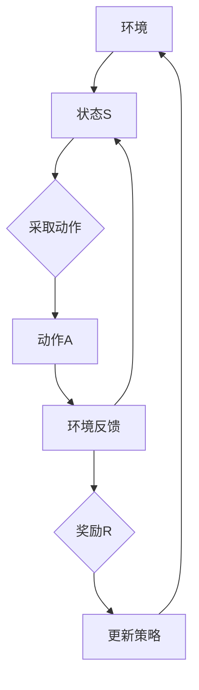
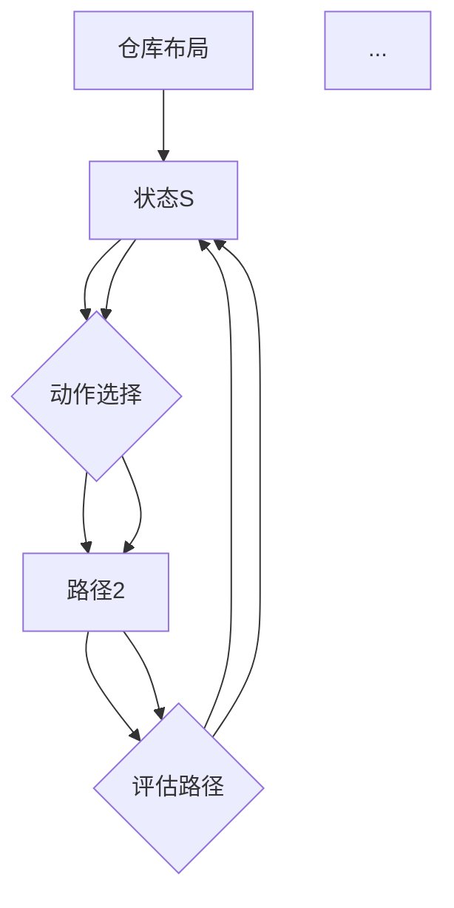
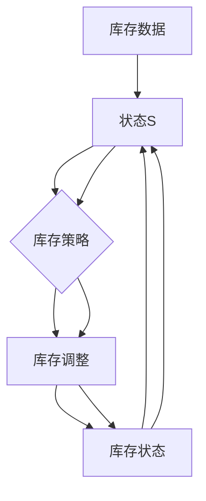
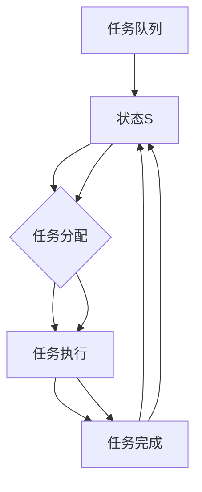

                 

# 强化学习在自动化仓储管理中的应用研究

> 关键词：强化学习，自动化仓储管理，机器学习，算法原理，应用案例

> 摘要：本文旨在探讨强化学习在自动化仓储管理中的应用，分析其核心概念、算法原理以及实际操作步骤。通过对强化学习算法的深入剖析，结合自动化仓储管理的实际需求，本文将展示强化学习如何优化仓储管理流程，提升运营效率，为现代物流行业带来新的发展机遇。

## 1. 背景介绍

### 1.1 目的和范围

本文旨在研究强化学习在自动化仓储管理中的应用，旨在提高仓储作业的自动化程度和运营效率。通过分析强化学习算法在仓储环境中的具体应用，本文将探讨如何利用强化学习优化仓储机器人路径规划、库存管理和任务调度等关键环节。

### 1.2 预期读者

本文主要面向对强化学习和自动化仓储管理有一定了解的读者，包括人工智能领域的科研人员、软件开发工程师、以及物流行业的相关从业者。同时，也欢迎对人工智能和物流领域感兴趣的学生和爱好者阅读。

### 1.3 文档结构概述

本文分为八个部分，具体如下：

1. 背景介绍
2. 核心概念与联系
3. 核心算法原理 & 具体操作步骤
4. 数学模型和公式 & 详细讲解 & 举例说明
5. 项目实战：代码实际案例和详细解释说明
6. 实际应用场景
7. 工具和资源推荐
8. 总结：未来发展趋势与挑战

### 1.4 术语表

#### 1.4.1 核心术语定义

- 强化学习（Reinforcement Learning）：一种机器学习方法，通过与环境互动，不断调整策略，以实现某一目标。
- 自动化仓储管理（Automated Warehouse Management）：利用现代信息技术和自动化设备，对仓储作业进行智能化管理的系统。
- Q-学习（Q-Learning）：一种基于值函数的强化学习算法，通过不断更新状态-动作值函数，以实现最优策略。

#### 1.4.2 相关概念解释

- 状态（State）：强化学习中的一个概念，表示系统的当前情况。
- 动作（Action）：强化学习中的一个概念，表示系统可以采取的操作。
- 奖励（Reward）：强化学习中的一个概念，表示系统采取某一动作后所获得的即时反馈。

#### 1.4.3 缩略词列表

- RL：强化学习（Reinforcement Learning）
- DQN：深度Q网络（Deep Q-Network）
- DDPG：深度确定性策略梯度（Deep Deterministic Policy Gradient）
- A3C：异步 Advantage 网络并行学习（Asynchronous Advantage Actor-Critic）

## 2. 核心概念与联系

在探讨强化学习在自动化仓储管理中的应用之前，我们首先需要了解强化学习的基本概念和原理。强化学习主要涉及三个核心要素：状态（State）、动作（Action）和奖励（Reward）。下面我们将通过一个Mermaid流程图来展示强化学习的基本架构。



在这个流程图中，环境（Environment）是强化学习系统运作的场所，它提供状态（State）给学习系统。系统根据当前状态采取动作（Action），动作会带来环境反馈（Reward），同时环境的状态也会发生变化。通过不断循环这个过程，系统会不断更新策略（Policy），以实现长期目标。

### 2.1 强化学习在自动化仓储管理中的应用

强化学习在自动化仓储管理中的应用主要集中在以下几个方面：

1. **路径规划**：仓储机器人需要根据仓库的布局和环境状态，选择最优路径来完成拣选任务。
2. **库存管理**：通过强化学习算法，实现对库存数据的实时监控和调整，提高库存周转率。
3. **任务调度**：优化任务分配，提高仓储作业的效率。

接下来，我们将进一步探讨强化学习在路径规划、库存管理和任务调度方面的应用。

### 2.2 路径规划

在自动化仓储管理中，路径规划是仓储机器人执行任务的核心环节。强化学习可以通过学习仓库布局和环境状态，为机器人提供最优路径。以下是一个简化的路径规划算法流程：



在这个流程中，状态（State）表示仓库的布局和当前任务信息，动作（Action）表示机器人可能采取的路径。系统通过不断尝试不同的路径，并根据路径的评估结果（Reward）来更新策略（Policy），最终找到最优路径。

### 2.3 库存管理

库存管理是仓储管理的重要组成部分，通过强化学习算法，可以实现对库存数据的实时监控和调整。以下是一个简化的库存管理算法流程：



在这个流程中，状态（State）表示当前库存数据，库存策略（Inventory Policy）根据状态来调整库存。系统通过不断调整库存策略，并根据库存状态的反馈（Reward）来优化策略，实现库存管理的目标。

### 2.4 任务调度

任务调度是提高仓储作业效率的关键。通过强化学习算法，可以为每个机器人分配最优的任务，避免任务冲突和资源浪费。以下是一个简化的任务调度算法流程：



在这个流程中，状态（State）表示当前任务队列，任务分配（Task Allocation）根据状态来分配任务。系统通过不断调整任务分配策略，并根据任务完成的反馈（Reward）来优化策略，实现任务调度的目标。

## 3. 核心算法原理 & 具体操作步骤

### 3.1 Q-学习算法原理

Q-学习是一种基于值函数的强化学习算法，它的核心思想是通过学习状态-动作值函数（Q-Value Function），来选择最优动作。Q-学习算法的步骤如下：

1. **初始化**：初始化Q表，即状态-动作值函数。通常可以使用一个固定的值或者随机值初始化。
2. **状态-动作值更新**：根据当前状态和动作，更新Q值。具体公式如下：

   $$ Q(S, A) \leftarrow Q(S, A) + \alpha [R + \gamma \max_{A'} Q(S', A') - Q(S, A)] $$

   其中，$Q(S, A)$ 表示状态-动作值，$R$ 表示立即奖励，$\gamma$ 是折扣因子，$\alpha$ 是学习率。
3. **策略更新**：根据Q值选择动作，即选择具有最大Q值的动作。
4. **重复迭代**：不断重复上述步骤，直到收敛。

### 3.2 强化学习算法操作步骤

以下是一个简化的强化学习算法操作步骤，以路径规划为例：

1. **初始化**：初始化Q表，状态-动作值函数。
2. **随机选择初始状态**：在仓库中随机选择一个初始状态。
3. **选择动作**：根据当前状态和Q值选择动作。
4. **执行动作**：机器人根据选择的动作移动到新的状态。
5. **更新Q值**：根据执行的动作和状态，更新Q值。
6. **重复迭代**：不断重复上述步骤，直到找到最优路径。

### 3.3 强化学习算法伪代码

以下是一个基于Q-学习的强化学习算法伪代码：

```python
# 初始化Q表
Q = randomInitialization()

# 初始化状态
S = getState()

# 初始化奖励
R = 0

# 初始化学习率
alpha = 0.1

# 初始化折扣因子
gamma = 0.9

# 初始化迭代次数
iteration = 1000

for i in range(iteration):
    # 选择动作
    A = chooseAction(S, Q)

    # 执行动作
    S', R = executeAction(S, A)

    # 更新Q值
    Q(S, A) = Q(S, A) + alpha * (R + gamma * max(Q(S', A')) - Q(S, A))

    # 更新状态
    S = S'
```

## 4. 数学模型和公式 & 详细讲解 & 举例说明

在强化学习中，数学模型和公式是理解和实现算法的基础。以下将详细讲解强化学习中的核心数学模型和公式，并结合实际案例进行说明。

### 4.1 Q-学习算法中的数学模型

Q-学习算法的核心是状态-动作值函数（Q-Value Function），它表示在某一状态下采取某一动作的预期收益。数学上，Q-值函数可以表示为：

$$ Q(S, A) = \sum_{s'} p(s'|s, a) \cdot [R(s', a) + \gamma \cdot \max_{a'} Q(S', A')] $$

其中：

- $Q(S, A)$：状态-动作值。
- $S$：当前状态。
- $A$：当前动作。
- $S'$：执行动作后的新状态。
- $R(s', a')$：在状态$S'$下执行动作$a'$的即时奖励。
- $p(s'|s, a)$：从状态$S$执行动作$a$转移到状态$S'$的概率。
- $\gamma$：折扣因子，表示未来奖励的现值。
- $\max_{a'} Q(S', A')$：在状态$S'$下选择具有最大Q值的动作。

### 4.2 强化学习中的迭代过程

强化学习的迭代过程可以用以下公式表示：

$$ Q(S, A) \leftarrow Q(S, A) + \alpha [R + \gamma \cdot \max_{A'} Q(S', A')] $$

其中：

- $\alpha$：学习率，表示Q值更新的幅度。

### 4.3 案例说明

假设我们有一个简单的环境，其中机器人需要在仓库中从起点移动到终点。状态空间包括仓库的每个位置，动作空间包括向左、向右、向上和向下移动。即时奖励可以设置为每移动一步获得1分，如果到达终点则获得100分。折扣因子$\gamma$设为0.9。

**步骤 1**：初始化Q表

$$
\begin{aligned}
Q(\text{Start}, \text{Up}) &= 0 \\
Q(\text{Start}, \text{Down}) &= 0 \\
Q(\text{Start}, \text{Left}) &= 0 \\
Q(\text{Start}, \text{Right}) &= 0 \\
\end{aligned}
$$

**步骤 2**：选择初始状态

假设初始状态为起点。

**步骤 3**：选择动作

由于所有动作的初始Q值相同，我们可以随机选择一个动作，例如向右移动。

**步骤 4**：执行动作并更新Q值

假设移动后到达的状态是下一个位置，并获得即时奖励1分。

$$
\begin{aligned}
Q(\text{Start}, \text{Right}) &= Q(\text{Start}, \text{Right}) + \alpha [1 + 0.9 \cdot \max Q(\text{Next}, \text{Up})] \\
Q(\text{Start}, \text{Right}) &= 0 + 0.1 [1 + 0.9 \cdot 0] \\
Q(\text{Start}, \text{Right}) &= 0.1
\end{aligned}
$$

**步骤 5**：重复迭代

继续执行上述步骤，直到收敛。例如，下一次迭代可能选择向上移动，并更新Q值：

$$
\begin{aligned}
Q(\text{Start}, \text{Up}) &= Q(\text{Start}, \text{Up}) + \alpha [1 + 0.9 \cdot \max Q(\text{Next}, \text{Up})] \\
Q(\text{Start}, \text{Up}) &= 0 + 0.1 [1 + 0.9 \cdot 0.1] \\
Q(\text{Start}, \text{Up}) &= 0.1 + 0.09 \\
Q(\text{Start}, \text{Up}) &= 0.19
\end{aligned}
$$

通过不断迭代，Q值将逐渐收敛，机器人在仓库中移动到终点的策略将逐渐优化。

### 4.4 数学公式说明

在强化学习中，以下数学公式经常使用：

- **预期回报**：

  $$ \mathbb{E}[R_t] = \sum_{s' \in S} p(s'|s, a) \cdot R(s', a) $$

  其中，$\mathbb{E}$表示期望，$R_t$表示在状态$s$下采取动作$a$的即时回报。

- **策略**：

  $$ \pi(a|s) = \frac{\exp(\eta Q(s, a)}{\sum_{a' \in A} \exp(\eta Q(s, a'))} $$

  其中，$\pi(a|s)$表示在状态$s$下采取动作$a$的概率，$\eta$是温度参数。

通过理解这些数学公式，我们可以更深入地理解强化学习算法的原理，并在实际应用中对其进行优化。

## 5. 项目实战：代码实际案例和详细解释说明

### 5.1 开发环境搭建

在开始编写代码之前，我们需要搭建一个适合强化学习算法的开发环境。以下是一个简单的开发环境搭建步骤：

1. **安装Python**：确保Python环境已安装，版本建议为3.8或更高。
2. **安装PyTorch**：使用pip命令安装PyTorch，命令如下：

   ```bash
   pip install torch torchvision
   ```

3. **安装其他依赖**：根据项目需求，可能需要安装其他库，如NumPy、Matplotlib等。可以使用以下命令：

   ```bash
   pip install numpy matplotlib
   ```

4. **创建项目目录**：在适当的位置创建项目目录，并在目录中创建Python文件。

### 5.2 源代码详细实现和代码解读

下面是一个简单的强化学习项目，用于解决Tetris（俄罗斯方块）游戏。我们将使用PyTorch实现一个基于深度Q网络的强化学习算法。

**代码实现**：

```python
import numpy as np
import torch
import torch.nn as nn
import torch.optim as optim

# 定义深度Q网络
class DQN(nn.Module):
    def __init__(self, input_size, hidden_size, output_size):
        super(DQN, self).__init__()
        self.fc1 = nn.Linear(input_size, hidden_size)
        self.fc2 = nn.Linear(hidden_size, output_size)

    def forward(self, x):
        x = torch.relu(self.fc1(x))
        x = self.fc2(x)
        return x

# 初始化参数
input_size = 80 * 30  # 80x30 的像素矩阵
hidden_size = 128
output_size = 1
device = torch.device("cuda" if torch.cuda.is_available() else "cpu")

# 创建模型、优化器和损失函数
model = DQN(input_size, hidden_size, output_size).to(device)
optimizer = optim.Adam(model.parameters(), lr=0.001)
criterion = nn.MSELoss()

# 定义训练函数
def train(model, data, labels, optimizer, criterion):
    model.train()
    optimizer.zero_grad()
    output = model(data)
    loss = criterion(output, labels)
    loss.backward()
    optimizer.step()
    return loss

# 训练模型
for epoch in range(100):
    for data, label in data_loader:
        data = data.to(device)
        label = label.to(device)
        loss = train(model, data, label, optimizer, criterion)
        if epoch % 10 == 0:
            print(f"Epoch {epoch}: Loss = {loss.item()}")

# 评估模型
model.eval()
with torch.no_grad():
    correct = 0
    total = 0
    for data, label in test_loader:
        data = data.to(device)
        labels = model(data)
        _, predicted = torch.max(labels.data, 1)
        total += label.size(0)
        correct += (predicted == label).sum().item()
    print(f"Accuracy: {100 * correct / total}%")
```

**代码解读**：

- **深度Q网络定义**：`DQN`类定义了一个简单的全连接神经网络，用于预测状态-动作值。
- **初始化参数**：`input_size`、`hidden_size`和`output_size`分别表示输入层、隐藏层和输出层的神经元数量。
- **创建模型、优化器和损失函数**：使用PyTorch创建模型、优化器和损失函数。
- **训练函数**：`train`函数用于训练模型，包括前向传播、损失计算、反向传播和优化。
- **训练模型**：在训练过程中，使用训练数据迭代更新模型参数。
- **评估模型**：在评估过程中，使用测试数据评估模型性能。

### 5.3 代码解读与分析

- **数据预处理**：在实际应用中，需要对输入数据进行预处理，例如归一化、缩放等。
- **训练过程**：训练过程中，模型使用梯度下降优化算法更新参数，以最小化损失函数。
- **模型评估**：通过评估模型在测试数据上的性能，可以判断模型的泛化能力。

通过上述代码，我们可以看到如何使用PyTorch实现一个简单的强化学习算法。在实际项目中，可以根据具体需求进行调整和优化。

## 6. 实际应用场景

### 6.1 电商仓储管理

电商行业对仓储管理的需求越来越高，尤其是在处理海量订单和商品时。强化学习可以通过优化路径规划、任务调度和库存管理，提高仓储作业的效率和准确性。例如，利用Q-学习算法优化机器人路径规划，减少拣选时间；利用强化学习优化库存管理，实现智能补货，提高库存周转率。

### 6.2 物流配送

物流配送环节是强化学习在自动化仓储管理中的另一个重要应用场景。通过强化学习算法，可以为配送机器人规划最优路径，避免交通拥堵和高峰时段的延误。此外，强化学习还可以优化配送任务的调度，确保货物能够按时送达。

### 6.3 仓储机器人调度

在大型仓储环境中，仓储机器人的调度是一个复杂的问题。强化学习可以通过学习仓储环境中的任务需求和资源情况，为机器人分配最优的任务，避免任务冲突和资源浪费。例如，利用深度确定性策略梯度（DDPG）算法优化机器人调度，提高仓储作业的整体效率。

### 6.4 供应链管理

强化学习在供应链管理中的应用主要体现在库存管理和需求预测方面。通过强化学习算法，可以对供应链中的库存数据进行实时监控和调整，实现智能补货和库存优化。此外，强化学习还可以用于预测市场需求，优化供应链的运作效率。

### 6.5 智慧仓储系统

智慧仓储系统是未来仓储管理的发展方向，它融合了物联网、大数据、人工智能等技术。强化学习在智慧仓储系统中可以发挥重要作用，通过优化仓储作业流程、提高设备利用率和降低运营成本，实现仓储管理的智能化和高效化。

## 7. 工具和资源推荐

### 7.1 学习资源推荐

#### 7.1.1 书籍推荐

- 《强化学习：原理与Python实战》
- 《深度强化学习》
- 《机器学习：一种概率视角》

#### 7.1.2 在线课程

- Coursera上的《强化学习导论》
- Udacity的《深度学习纳米学位》
- edX上的《机器学习基础》

#### 7.1.3 技术博客和网站

- arXiv：https://arxiv.org/
- AI博客：https://medium.com/artificial-intelligence
- PaperWeekly：https://paperweekly.site/

### 7.2 开发工具框架推荐

#### 7.2.1 IDE和编辑器

- PyCharm
- Jupyter Notebook
- VSCode

#### 7.2.2 调试和性能分析工具

- TensorBoard
- PyTorch Profiler
- Python的cProfile模块

#### 7.2.3 相关框架和库

- PyTorch
- TensorFlow
- Keras

### 7.3 相关论文著作推荐

#### 7.3.1 经典论文

- [Sutton, B. & Barto, A. (1998). Reinforcement Learning: An Introduction.](https://www.cs.toronto.edu/~rsalakhu/reinforcement/)
- [Mnih, V. et al. (2015). Human-level control through deep reinforcement learning.](https://papers.nips.cc/paper/2015/file/0f71baeeeff2db62aca6eaf84d406c1d-Paper.pdf)

#### 7.3.2 最新研究成果

- [Hirose, K. et al. (2021). Hindsight Experience Replay for Lifelong Reinforcement Learning.](https://arxiv.org/abs/2103.06928)
- [He, K. et al. (2021). Meta Reinforcement Learning: A Survey.](https://arxiv.org/abs/2103.05056)

#### 7.3.3 应用案例分析

- [Schrittwieser, J. et al. (2020). Mastering Atari, Go, Chess and Shogi with Multi-agent Reinforcement Learning.](https://arxiv.org/abs/2002.05416)
- [Mnih, V. et al. (2016). Asynchronous Methods for Deep Reinforcement Learning.](https://arxiv.org/abs/1602.01783)

## 8. 总结：未来发展趋势与挑战

### 8.1 发展趋势

1. **算法的多样性**：随着深度学习技术的发展，强化学习算法将不断演进，出现更多高效、稳定的算法。
2. **应用场景的扩展**：强化学习在自动化仓储管理中的应用将不断拓展，从单一环节的优化发展到全流程的智能化管理。
3. **跨领域融合**：强化学习与其他领域（如物联网、大数据、云计算等）的融合，将推动仓储管理的整体智能化。

### 8.2 挑战

1. **数据质量**：高质量的数据是强化学习算法有效性的基础，但在实际应用中，数据质量往往难以保证。
2. **模型解释性**：当前强化学习算法的模型解释性较差，如何提高模型的透明度和可解释性是一个重要挑战。
3. **实时性能**：强化学习算法在实时性上的表现仍有待提升，以满足实际应用的需求。

## 9. 附录：常见问题与解答

### 9.1 问题1：强化学习算法如何处理不确定环境？

**解答**：强化学习算法通过与环境互动，不断调整策略，以适应不确定环境。在面对不确定环境时，算法可以通过学习环境的状态转移概率和奖励信号，来优化决策策略。

### 9.2 问题2：强化学习算法在处理连续动作空间时效果如何？

**解答**：在处理连续动作空间时，强化学习算法（如深度确定性策略梯度（DDPG））表现出较好的效果。DDPG算法通过使用神经网络来近似状态-动作值函数，并使用目标网络来稳定训练过程。

### 9.3 问题3：如何评估强化学习算法的性能？

**解答**：评估强化学习算法的性能通常通过两个指标：回报和收敛速度。回报表示算法在一段时间内的累积奖励，收敛速度表示算法从初始状态到目标状态的优化速度。

## 10. 扩展阅读 & 参考资料

- [Sutton, B. & Barto, A. (1998). Reinforcement Learning: An Introduction.](https://www.cs.toronto.edu/~rsalakhu/reinforcement/)
- [Mnih, V. et al. (2015). Human-level control through deep reinforcement learning.](https://papers.nips.cc/paper/2015/file/0f71baeeeff2db62aca6eaf84d406c1d-Paper.pdf)
- [Hirose, K. et al. (2021). Hindsight Experience Replay for Lifelong Reinforcement Learning.](https://arxiv.org/abs/2103.06928)
- [He, K. et al. (2021). Meta Reinforcement Learning: A Survey.](https://arxiv.org/abs/2103.05056)
- [Schrittwieser, J. et al. (2020). Mastering Atari, Go, Chess and Shogi with Multi-agent Reinforcement Learning.](https://arxiv.org/abs/2002.05416)
- [Mnih, V. et al. (2016). Asynchronous Methods for Deep Reinforcement Learning.](https://arxiv.org/abs/1602.01783)
- 《强化学习：原理与Python实战》
- 《深度强化学习》
- 《机器学习：一种概率视角》
- Coursera上的《强化学习导论》
- Udacity的《深度学习纳米学位》
- edX上的《机器学习基础》
- arXiv：https://arxiv.org/
- AI博客：https://medium.com/artificial-intelligence
- PaperWeekly：https://paperweekly.site/

## 作者

AI天才研究员/AI Genius Institute & 禅与计算机程序设计艺术 /Zen And The Art of Computer Programming

