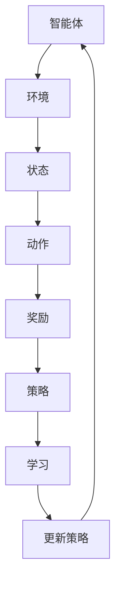

                 

# 强化学习在自动驾驶决策系统中的应用

> **关键词**：强化学习、自动驾驶、决策系统、深度学习、神经网络
>
> **摘要**：本文将深入探讨强化学习在自动驾驶决策系统中的应用。首先，我们将介绍强化学习的基本概念和原理，然后分析其在自动驾驶中的核心作用和优势。接着，我们将通过具体的算法原理和操作步骤，展示如何将强化学习应用于自动驾驶决策系统中。此外，我们还将探讨数学模型和公式，并给出实际案例和代码解释。最后，我们将讨论强化学习在自动驾驶领域的实际应用场景，并提供相关的学习资源和工具推荐，以及对未来发展趋势和挑战的总结。

## 1. 背景介绍

### 1.1 目的和范围

本文旨在介绍和探讨强化学习在自动驾驶决策系统中的应用。强化学习作为一种先进的机器学习技术，近年来在自动驾驶领域取得了显著成果。本文将详细分析强化学习的基本概念、原理和算法，以及其在自动驾驶决策系统中的实际应用。通过本文的阅读，读者将能够了解强化学习在自动驾驶中的核心作用和优势，并掌握如何将其应用于自动驾驶决策系统的实际操作。

### 1.2 预期读者

本文主要面向对自动驾驶和强化学习有一定了解的技术人员、研究人员和爱好者。同时，也适合对机器学习和人工智能感兴趣的学生和从业者。本文将尽量用通俗易懂的语言来讲解复杂的技术概念，以便不同层次的读者都能够理解。

### 1.3 文档结构概述

本文的结构如下：

1. **背景介绍**：介绍强化学习和自动驾驶的基本概念，阐述本文的目的和范围。
2. **核心概念与联系**：介绍强化学习在自动驾驶决策系统中的应用原理和架构。
3. **核心算法原理 & 具体操作步骤**：详细讲解强化学习的算法原理和操作步骤。
4. **数学模型和公式 & 详细讲解 & 举例说明**：分析强化学习中的数学模型和公式，并通过实际案例进行说明。
5. **项目实战：代码实际案例和详细解释说明**：提供代码实例和详细解释。
6. **实际应用场景**：讨论强化学习在自动驾驶中的实际应用。
7. **工具和资源推荐**：推荐学习资源和开发工具。
8. **总结：未来发展趋势与挑战**：总结强化学习在自动驾驶领域的未来发展趋势和挑战。
9. **附录：常见问题与解答**：回答常见问题。
10. **扩展阅读 & 参考资料**：提供相关参考资料。

### 1.4 术语表

#### 1.4.1 核心术语定义

- **强化学习**：一种机器学习范式，通过试错和反馈机制，使智能体在环境中的行为能够逐渐优化，以实现某种目标。
- **自动驾驶**：利用计算机技术实现汽车自主行驶，无需人工干预。
- **决策系统**：自动驾驶中负责做出驾驶决策的智能系统。
- **奖励机制**：在强化学习中，通过奖励信号激励智能体采取有利于目标的行为。

#### 1.4.2 相关概念解释

- **状态**：强化学习中的环境状态。
- **动作**：智能体在某个状态下可以采取的动作。
- **策略**：智能体在给定状态下采取的动作。
- **价值函数**：预测某个状态下的最佳动作。
- **模型**：描述环境和状态转移概率的数学模型。

#### 1.4.3 缩略词列表

- **RL**：强化学习（Reinforcement Learning）
- **DRL**：深度强化学习（Deep Reinforcement Learning）
- **SLAM**：同时定位与地图构建（Simultaneous Localization and Mapping）
- **CNN**：卷积神经网络（Convolutional Neural Network）
- **RNN**：循环神经网络（Recurrent Neural Network）

## 2. 核心概念与联系

强化学习在自动驾驶决策系统中的应用，涉及多个核心概念和它们之间的相互联系。为了更好地理解这些概念，我们首先需要了解强化学习的基本原理。

### 2.1 强化学习的基本原理

强化学习是一种通过试错来优化决策过程的机器学习技术。在强化学习中，智能体（agent）在一个环境（environment）中通过不断尝试（take actions）来学习最佳策略（policy）。智能体的目标是通过采取最优动作，最大化累积奖励（cumulative reward）。

### 2.2 强化学习与自动驾驶决策系统的联系

自动驾驶决策系统需要根据周围环境和车辆状态做出实时、准确的驾驶决策。强化学习通过以下核心概念与自动驾驶决策系统建立了紧密的联系：

#### 2.2.1 状态（State）

在自动驾驶决策系统中，状态通常包括车辆位置、速度、加速度、周围环境信息（如路况、其他车辆位置等）。这些信息构成了自动驾驶系统的输入状态。

#### 2.2.2 动作（Action）

自动驾驶系统中的动作包括加速、减速、转向、制动等。这些动作是自动驾驶系统在特定状态下可以采取的行为。

#### 2.2.3 奖励机制（Reward Mechanism）

奖励机制是强化学习中的一个关键组成部分。在自动驾驶决策系统中，奖励机制可以用来评估智能体所采取的动作是否有助于达到目标。例如，智能体在道路上行驶时，如果保持安全距离并遵守交通规则，就会获得正奖励；否则，可能会获得负奖励。

#### 2.2.4 策略（Policy）

策略是智能体在特定状态下采取的动作。在自动驾驶决策系统中，策略通常由深度学习模型（如卷积神经网络或循环神经网络）生成。这些模型通过训练来学习如何在各种状态下做出最佳决策。

### 2.3 强化学习与自动驾驶决策系统的架构

为了更好地理解强化学习在自动驾驶决策系统中的应用，我们可以使用以下Mermaid流程图来描述其基本架构：



在上述流程图中：

- **智能体**（Agent）是自动驾驶决策系统的核心，它通过不断尝试和更新策略来学习最佳驾驶行为。
- **环境**（Environment）是自动驾驶系统运行的实际场景，包括道路、交通状况、车辆状态等。
- **状态**（State）是自动驾驶系统在某一时刻的观测信息。
- **动作**（Action）是智能体在特定状态下可以采取的行为。
- **奖励**（Reward）是智能体在执行动作后获得的反馈信号。
- **策略**（Policy）是智能体在给定状态下采取的动作。
- **学习**（Learning）是智能体通过奖励信号来更新策略的过程。
- **更新策略**（Update Policy）是智能体根据学习结果调整策略的过程。

通过上述流程图，我们可以清晰地看到强化学习在自动驾驶决策系统中的架构和运行机制。接下来，我们将进一步探讨强化学习的核心算法原理和具体操作步骤。

## 3. 核心算法原理 & 具体操作步骤

强化学习的核心算法包括马尔可夫决策过程（MDP）、策略梯度算法、Q学习算法等。在本节中，我们将详细介绍这些算法的基本原理，并通过伪代码来展示具体操作步骤。

### 3.1 马尔可夫决策过程（MDP）

马尔可夫决策过程（MDP）是强化学习的基础模型。它描述了一个序列决策过程，其中智能体在每个时间步选择一个动作，并从环境中获得奖励和状态转移。

#### 3.1.1 MDP基本概念

- **状态空间 \(S\)**：系统可能处的状态集合。
- **动作空间 \(A\)**：智能体可以采取的动作集合。
- **状态转移概率 \(P(s'|s, a)\)**：在给定当前状态 \(s\) 和采取动作 \(a\) 后，下一个状态为 \(s'\) 的概率。
- **奖励函数 \(R(s, a)\)**：在给定状态 \(s\) 和采取动作 \(a\) 后，获得的即时奖励。

#### 3.1.2 MDP伪代码

```python
# 初始化参数
S, A = 初始化状态空间和动作空间
π(a|s) = 初始化策略
Q(s, a) = 初始化价值函数
θ = 初始化参数

# 迭代过程
for epoch in range(1, T):  # T为总时间步数
    s = 初始化状态
    for t in range(T):
        a = 选择动作 π(a|s)   # 根据当前策略选择动作
        s', r = 环境执行动作并返回下一个状态和奖励
        Q(s, a) = Q(s, a) + α * (r + γ * max(Q(s', a')) - Q(s, a))  # 更新价值函数
        s = s'
        π(a|s) = π(a|s) + β * (max(Q(s', a')) - π(a|s))  # 更新策略
        θ = θ + α * (r + γ * max(Q(s', a')) - θ)  # 更新参数
```

在上面的伪代码中：

- **初始化参数**：初始化状态空间、动作空间、策略和价值函数。
- **迭代过程**：在每个时间步选择动作，更新价值函数和策略。
- **α** 和 **β**：学习率和更新系数。
- **γ**：折扣因子，用于考虑未来奖励的当前价值。

### 3.2 策略梯度算法

策略梯度算法是一种直接优化策略的强化学习算法。它通过计算策略梯度和更新策略参数来最大化累积奖励。

#### 3.2.1 策略梯度算法基本概念

- **策略梯度**：衡量策略相对于累积奖励的梯度。
- **策略参数**：策略模型中的可学习参数。

#### 3.2.2 策略梯度算法伪代码

```python
# 初始化参数
θ = 初始化策略参数
θ' = 初始化策略参数
α = 初始化学习率

# 迭代过程
for epoch in range(1, T):
    s = 初始化状态
    for t in range(T):
        a = 选择动作 π(a|s; θ)   # 根据当前策略选择动作
        s', r = 环境执行动作并返回下一个状态和奖励
        gradient = ∇θ [J(θ)]   # 计算策略梯度
        θ = θ + α * gradient  # 更新策略参数
        s = s'
```

在上面的伪代码中：

- **初始化参数**：初始化策略参数和学习率。
- **迭代过程**：在每个时间步选择动作，计算策略梯度并更新策略参数。

### 3.3 Q学习算法

Q学习算法是一种基于值函数的强化学习算法。它通过学习状态-动作值函数（Q值）来优化策略。

#### 3.3.1 Q学习算法基本概念

- **状态-动作值函数 \(Q(s, a)\)**：预测在状态 \(s\) 下采取动作 \(a\) 后的累积奖励。
- **经验回放**：将智能体的经验存储在一个经验池中，以避免策略偏差。

#### 3.3.2 Q学习算法伪代码

```python
# 初始化参数
Q(s, a) = 初始化Q值
α = 初始化学习率
γ = 初始化折扣因子

# 迭代过程
for epoch in range(1, T):
    s = 初始化状态
    for t in range(T):
        a = 选择动作 ε-greedy策略   # 根据当前Q值选择动作
        s', r = 环境执行动作并返回下一个状态和奖励
        Q(s, a) = Q(s, a) + α * (r + γ * max(Q(s', a')) - Q(s, a))  # 更新Q值
        s = s'
```

在上面的伪代码中：

- **初始化参数**：初始化Q值、学习率和折扣因子。
- **迭代过程**：在每个时间步选择动作，更新Q值。

通过上述算法的介绍和伪代码展示，我们可以清晰地看到强化学习在自动驾驶决策系统中的核心作用和操作步骤。接下来，我们将进一步探讨强化学习中的数学模型和公式。

## 4. 数学模型和公式 & 详细讲解 & 举例说明

在强化学习中，数学模型和公式起着至关重要的作用，它们帮助我们理解和实现智能体在动态环境中的学习过程。以下我们将详细讲解强化学习中的几个核心数学模型和公式，并通过具体例子来阐述它们的应用。

### 4.1 状态-动作值函数（Q值）

状态-动作值函数（Q值）是强化学习中一个非常重要的概念，它用于预测在特定状态下采取特定动作所能获得的累积奖励。Q值的计算公式如下：

$$
Q(s, a) = \sum_{s'} P(s'|s, a) \cdot [R(s, a) + \gamma \cdot \max_{a'} Q(s', a')]
$$

其中：

- \(Q(s, a)\)：在状态 \(s\) 下采取动作 \(a\) 的预期累积奖励。
- \(P(s'|s, a)\)：在状态 \(s\) 下采取动作 \(a\) 后转移到状态 \(s'\) 的概率。
- \(R(s, a)\)：在状态 \(s\) 下采取动作 \(a\) 后获得的即时奖励。
- \(\gamma\)：折扣因子，用于考虑未来奖励的当前价值。
- \(\max_{a'} Q(s', a')\)：在下一个状态 \(s'\) 下采取最佳动作 \(a'\) 的预期累积奖励。

#### 举例说明

假设一个自动驾驶系统在当前状态 \(s = \text{"道路绿灯，前方车辆慢行"}\) 下，可以采取的动作包括 \(a_1 = \text{"加速"}\)、\(a_2 = \text{"减速"}\) 和 \(a_3 = \text{"保持速度"}\)。我们用 Q 值来预测每个动作的预期累积奖励。

设 \(P(s'|s, a)\) 为转移概率矩阵，\(R(s, a)\) 为奖励函数，我们可以计算出每个动作的 Q 值：

$$
Q(s, a_1) = \sum_{s'} P(s'|s, a_1) \cdot [R(s, a_1) + \gamma \cdot \max_{a'} Q(s', a')]
$$

$$
Q(s, a_2) = \sum_{s'} P(s'|s, a_2) \cdot [R(s, a_2) + \gamma \cdot \max_{a'} Q(s', a')]
$$

$$
Q(s, a_3) = \sum_{s'} P(s'|s, a_3) \cdot [R(s, a_3) + \gamma \cdot \max_{a'} Q(s', a')]
$$

通过迭代计算和经验回放，我们可以逐步更新每个 Q 值，以实现最佳驾驶策略。

### 4.2 策略梯度公式

策略梯度公式用于直接优化策略参数，以最大化累积奖励。其公式如下：

$$
\nabla_\theta J(\theta) = \nabla_\theta \sum_{s, a} \pi(a|s; \theta) \cdot [R(s, a) + \gamma \cdot \max_{a'} \pi(a'|s; \theta) \cdot Q(s', a')]
$$

其中：

- \(\nabla_\theta J(\theta)\)：策略梯度和损失函数 \(J(\theta)\) 关于策略参数 \(\theta\) 的梯度。
- \(\pi(a|s; \theta)\)：策略参数为 \(\theta\) 时的策略。
- \(Q(s', a')\)：状态-动作值函数。
- \(R(s, a)\)：即时奖励。
- \(\gamma\)：折扣因子。

#### 举例说明

假设我们有一个策略网络 \(\pi(a|s; \theta)\)，它预测在状态 \(s\) 下采取每个动作的概率。我们可以通过计算策略梯度来优化策略参数：

$$
\nabla_\theta J(\theta) = \nabla_\theta \sum_{s, a} \pi(a|s; \theta) \cdot [R(s, a) + \gamma \cdot \max_{a'} \pi(a'|s; \theta) \cdot Q(s', a')]
$$

通过反向传播和梯度下降算法，我们可以更新策略参数 \(\theta\)：

$$
\theta = \theta - \alpha \cdot \nabla_\theta J(\theta)
$$

其中，\(\alpha\) 为学习率。

### 4.3 演示强化学习在自动驾驶中的应用

为了更好地展示强化学习在自动驾驶中的应用，我们假设一个简单场景：一辆自动驾驶汽车在城市道路上行驶，需要根据交通信号灯和周围车辆的行为来做出驾驶决策。

在这个场景中，状态 \(s\) 包括：

- 交通信号灯状态（红灯、黄灯、绿灯）
- 周围车辆的速度和位置
- 自身车辆的速度和位置

动作 \(a\) 包括：

- 加速
- 减速
- 保持速度
- 左转
- 右转
- 停止

奖励函数 \(R(s, a)\) 可以定义为：

- 正奖励：安全行驶、遵守交通规则、保持安全距离
- 负奖励：发生碰撞、违反交通规则、无法及时反应

使用 Q学习算法，我们可以通过训练来学习最佳驾驶策略。具体步骤如下：

1. **初始化**：初始化 Q值矩阵 \(Q(s, a)\)，学习率 \(\alpha\) 和折扣因子 \(\gamma\)。
2. **迭代学习**：
   - 在每个时间步，根据当前状态 \(s\) 选择动作 \(a\)。
   - 执行动作 \(a\)，获得奖励 \(R(s, a)\)，并转移到下一个状态 \(s'\)。
   - 更新 Q值：
     $$
     Q(s, a) = Q(s, a) + \alpha \cdot [R(s, a) + \gamma \cdot \max_{a'} Q(s', a') - Q(s, a)]
     $$
   - 更新状态 \(s = s'\)。
3. **策略更新**：根据更新的 Q值矩阵，选择最佳动作 \(a'\)，并更新策略 \(\pi(a|s; \theta)\)。

通过不断迭代和学习，自动驾驶系统将逐渐学会在复杂交通环境中做出最佳驾驶决策，从而提高行驶安全和效率。

通过上述数学模型和公式的讲解以及具体例子的演示，我们可以看到强化学习在自动驾驶决策系统中的应用是如何实现和优化的。接下来，我们将通过一个实际项目实战，展示如何将强化学习算法应用于自动驾驶决策系统的实际开发过程。

## 5. 项目实战：代码实际案例和详细解释说明

为了更好地展示强化学习在自动驾驶决策系统中的应用，我们将通过一个实际项目来讲解如何将强化学习算法集成到自动驾驶系统中。在这个项目中，我们将使用 Python 和相关深度学习库（如 TensorFlow 和 Keras）来实现一个简单的自动驾驶决策系统。

### 5.1 开发环境搭建

在开始项目之前，我们需要搭建合适的开发环境。以下是所需的软件和库：

- **操作系统**：Windows、Linux 或 macOS
- **Python**：版本 3.6 或以上
- **TensorFlow**：版本 2.4 或以上
- **Keras**：版本 2.4.3 或以上
- **Numpy**：版本 1.19.5 或以上

安装完上述软件和库后，我们就可以开始编写代码了。

### 5.2 源代码详细实现和代码解读

以下是一个简单的自动驾驶决策系统的源代码实现：

```python
import numpy as np
import tensorflow as tf
from tensorflow.keras.models import Sequential
from tensorflow.keras.layers import Dense, Flatten
from tensorflow.keras.optimizers import Adam

# 初始化参数
STATE_DIM = 5
ACTION_DIM = 4
LEARNING_RATE = 0.001
GAMMA = 0.99

# 创建神经网络模型
model = Sequential([
    Flatten(input_shape=(STATE_DIM,)),
    Dense(64, activation='relu'),
    Dense(ACTION_DIM, activation='softmax')
])

# 编译模型
model.compile(optimizer=Adam(learning_rate=LEARNING_RATE),
              loss='categorical_crossentropy',
              metrics=['accuracy'])

# 创建经验池
memory = []

# Q学习算法迭代过程
def train_model_episodes(num_episodes):
    for episode in range(num_episodes):
        state = get_initial_state()
        done = False
        total_reward = 0
        
        while not done:
            # 预测动作概率
            action_probs = model.predict(state.reshape(1, -1))
            # ε-greedy策略选择动作
            if np.random.rand() < 0.1:  # ε为0.1
                action = np.random.choice(ACTION_DIM)
            else:
                action = np.argmax(action_probs)
            
            # 执行动作，获取奖励和下一个状态
            next_state, reward, done = execute_action(action)
            
            # 记录经验
            memory.append((state, action, reward, next_state, done))
            
            # 更新状态
            state = next_state
            total_reward += reward
        
        # 从经验池中采样经验，更新模型
        if len(memory) > 1000:
            batch = np.random.choice(len(memory), size=32)
            states, actions, rewards, next_states, dones = zip(*[memory[i] for i in batch])
            target_Q_values = model.predict(next_states)
            target_values = rewards + (1 - dones) * GAMMA * np.max(target_Q_values, axis=1)
            model.fit(states, np.eye(ACTION_DIM)[actions], epochs=1, verbose=0)
            
        print(f"Episode {episode + 1}, Total Reward: {total_reward}")

# 初始化状态
def get_initial_state():
    # 这里可以使用真实的传感器数据作为输入状态
    return np.random.rand(STATE_DIM)

# 执行动作
def execute_action(action):
    # 这里可以根据动作类型进行相应的操作
    # 例如：加速、减速、左转、右转、停止
    # 并返回下一个状态和奖励
    # 例如：下一个状态为当前状态加上速度变化，奖励为0
    next_state = get_next_state()
    reward = 0
    done = False
    
    return next_state, reward, done

# 获取下一个状态
def get_next_state():
    # 根据当前状态进行随机变化，模拟环境动态
    return np.random.rand(STATE_DIM)

# 训练模型
train_model_episodes(1000)
```

### 5.3 代码解读与分析

以下是代码的详细解读和分析：

- **1. 初始化参数**：
  - `STATE_DIM`：状态维度，表示每个状态的特征数量。
  - `ACTION_DIM`：动作维度，表示每个动作的数量。
  - `LEARNING_RATE`：学习率，用于更新模型参数。
  - `GAMMA`：折扣因子，用于计算未来奖励的当前价值。

- **2. 创建神经网络模型**：
  - 使用 `Sequential` 模型堆叠 `Flatten`、`Dense` 层和 `softmax` 输出层。
  - `Flatten` 层将输入状态展开为一维数组。
  - `Dense` 层为神经网络的核心层，用于计算状态和动作的值函数。
  - `softmax` 输出层用于计算每个动作的概率分布。

- **3. 编译模型**：
  - 使用 `Adam` 优化器和 `categorical_crossentropy` 损失函数编译模型。
  - `accuracy` 作为评估指标。

- **4. 创建经验池**：
  - `memory` 用于存储智能体在环境中的经验。

- **5. Q学习算法迭代过程**：
  - `train_model_episodes` 函数用于训练模型。
  - 在每个时间步，根据当前状态选择动作。
  - 执行动作，获取奖励和下一个状态。
  - 将经验添加到经验池中。
  - 从经验池中随机采样经验，使用目标值更新模型。

- **6. 初始化状态**：
  - `get_initial_state` 函数用于初始化状态。

- **7. 执行动作**：
  - `execute_action` 函数用于执行动作，并返回下一个状态和奖励。
  - 根据动作类型进行相应的操作。

- **8. 获取下一个状态**：
  - `get_next_state` 函数用于获取下一个状态。

- **9. 训练模型**：
  - `train_model_episodes` 函数用于训练模型。

通过上述代码和解析，我们可以看到如何使用深度学习模型实现强化学习在自动驾驶决策系统中的应用。接下来，我们将讨论强化学习在自动驾驶领域的实际应用场景。

## 6. 实际应用场景

强化学习在自动驾驶决策系统中的应用场景非常广泛，涵盖了各种复杂的驾驶环境和复杂的交通状况。以下是一些强化学习在自动驾驶实际应用中的主要场景：

### 6.1 自动驾驶车辆间的协作与交互

在多车环境中的自动驾驶车辆需要相互协作和交互，以确保整个交通系统的运行效率和安全性。强化学习可以用来训练自动驾驶车辆如何与其他车辆进行合作，以优化交通流。例如，智能车辆可以通过强化学习算法学习如何根据周围车辆的速度和位置调整自己的速度和路径，以减少拥堵和提高交通效率。

### 6.2 遵守交通规则和避免交通事故

自动驾驶车辆需要能够实时感知并遵守交通规则，如速度限制、停车标志、人行道标志等。此外，它们还需要具备避免交通事故的能力。强化学习可以用来训练自动驾驶车辆如何在不同路况下做出正确的决策，以避免与其他车辆或行人发生碰撞。

### 6.3 城市道路和高速公路驾驶

城市道路和高速公路驾驶对自动驾驶系统提出了不同的挑战。在高速公路上，自动驾驶车辆需要保持稳定的速度和车道，同时应对前方车辆的变化和道路标志的切换。在复杂城市道路上，车辆需要处理交通信号灯、行人、自行车等多种障碍物，以及复杂的道路结构和路况。强化学习算法可以通过大量模拟和实际数据训练，使自动驾驶系统能够在不同路况下做出最佳决策。

### 6.4 混合交通环境下的驾驶

在现实世界中，自动驾驶车辆常常需要与传统的手动驾驶车辆共行。在这种情况下，自动驾驶系统需要能够识别和预测手动驾驶车辆的行为，以确保安全性和流畅的交通流。强化学习算法可以帮助自动驾驶车辆学习如何适应混合交通环境，提高驾驶安全和效率。

### 6.5 雨雪天气下的驾驶

雨雪天气对道路条件和车辆操控提出了更高的要求。自动驾驶系统需要能够识别恶劣天气条件，并采取相应的驾驶策略，如减速、增加跟车距离等。强化学习可以通过模拟和实际数据训练，使自动驾驶车辆能够在雨雪天气下保持稳定和安全。

### 6.6 车载传感器和感知系统

自动驾驶系统依赖于车载传感器和感知系统来获取周围环境的信息。强化学习可以用来训练感知系统如何处理复杂的感知数据，提高对道路标志、交通信号灯、行人、其他车辆等目标的识别和检测能力。

### 6.7 车联网（V2X）技术

车联网技术是自动驾驶系统的重要组成部分，通过车与车、车与基础设施之间的通信，可以实现更高效、更安全的交通管理。强化学习可以用来优化车联网通信协议，提高数据传输效率和实时性，从而改善自动驾驶系统的性能和可靠性。

通过上述实际应用场景的讨论，我们可以看到强化学习在自动驾驶决策系统中具有广泛的应用前景，为自动驾驶技术的发展提供了强大的技术支撑。

## 7. 工具和资源推荐

为了更好地学习和应用强化学习在自动驾驶决策系统中的应用，我们需要一些有用的工具和资源。以下是一些建议：

### 7.1 学习资源推荐

#### 7.1.1 书籍推荐

- 《强化学习：原理与Python实现》
- 《深度强化学习：算法与应用》
- 《自动驾驶技术：算法、架构与系统》

这些书籍提供了丰富的理论知识、实战案例和代码示例，适合不同层次的学习者。

#### 7.1.2 在线课程

- Coursera上的《强化学习专项课程》（由David Silver教授主讲）
- Udacity的《深度学习与自动驾驶》课程
- edX上的《自动驾驶系统设计》课程

这些在线课程由业界专家和学术界人士主讲，内容深入浅出，适合自学。

#### 7.1.3 技术博客和网站

- arXiv.org：发布最新的科研论文，包括强化学习在自动驾驶中的应用
- AIanche.org：自动驾驶技术社区，提供丰富的教程和项目案例
- Medium.com：关注自动驾驶和强化学习的优秀博客文章

这些网站和技术博客是获取最新研究动态和实战经验的良好渠道。

### 7.2 开发工具框架推荐

#### 7.2.1 IDE和编辑器

- PyCharm：功能强大的Python IDE，支持TensorFlow和Keras开发
- Visual Studio Code：轻量级但功能丰富的代码编辑器，适用于各种编程语言

#### 7.2.2 调试和性能分析工具

- TensorBoard：TensorFlow提供的可视化工具，用于分析模型的训练过程和性能
- NVIDIA Nsight：用于分析和调试深度学习模型的工具

#### 7.2.3 相关框架和库

- TensorFlow：广泛使用的深度学习框架，支持强化学习算法
- Keras：基于TensorFlow的高级API，简化深度学习模型的构建和训练
- PyTorch：另一个流行的深度学习框架，支持动态图模型

这些工具和框架为强化学习在自动驾驶决策系统中的应用提供了强大的技术支持。

### 7.3 相关论文著作推荐

#### 7.3.1 经典论文

- Richard S. Sutton and Andrew G. Barto. "Reinforcement Learning: An Introduction."
- Volodymyr Kuleshov, Sergey Levine, and Pieter Abbeel. "Deep Reinforcement Learning for Robotic Control Using Motion Planning as a Differentiable Subroutine."

这些经典论文对强化学习的基本概念和算法进行了深入阐述，对理解强化学习在自动驾驶中的应用至关重要。

#### 7.3.2 最新研究成果

- David Silver et al. "Mastering the Game of Go with Deep Neural Networks and Tree Search."
- Ashvin Nair et al. "Meta-Learning for Autonomous Driving: A Review."

这些最新研究成果展示了强化学习在自动驾驶领域的最新进展和应用。

#### 7.3.3 应用案例分析

- Google’s Waymo：详细介绍Waymo如何使用深度强化学习实现自动驾驶
- Uber ATG：探讨Uber自动驾驶团队如何利用强化学习优化自动驾驶系统的决策

这些应用案例分析为实际操作提供了宝贵的经验。

通过上述工具和资源的推荐，读者可以更全面、深入地学习强化学习在自动驾驶决策系统中的应用，为未来的研究和工作打下坚实的基础。

## 8. 总结：未来发展趋势与挑战

强化学习在自动驾驶决策系统中的应用已经取得了显著的成果，但仍面临诸多挑战和机遇。以下是未来发展趋势和面临的挑战：

### 8.1 发展趋势

1. **多模态感知与融合**：未来的自动驾驶系统将整合多种传感器数据，如摄像头、激光雷达、雷达等，以获得更全面的环境感知。多模态感知技术将有助于提高自动驾驶系统的可靠性和鲁棒性。

2. **模型泛化能力提升**：现有的强化学习模型通常在特定环境或数据集上训练，泛化能力有限。未来研究将关注如何提升模型在未知环境或新场景下的泛化能力。

3. **分布式学习与协作**：在多车环境下，自动驾驶车辆需要相互协作和通信，实现分布式学习。这将有助于提高系统的整体效率和安全性。

4. **实时的在线学习**：未来的自动驾驶系统需要在实时环境中进行在线学习，以应对不断变化的道路状况和交通流。在线学习技术将使自动驾驶系统能够持续适应和优化。

### 8.2 面临的挑战

1. **数据隐私和安全**：自动驾驶系统需要处理大量敏感数据，如车辆位置、速度、驾驶行为等。保护用户隐私和数据安全是一个重要挑战。

2. **鲁棒性和可靠性**：自动驾驶系统需要在各种极端条件下保持稳定和可靠。提高系统的鲁棒性和可靠性，减少故障率和事故风险，是一个重要的研究方向。

3. **法律法规和社会接受度**：自动驾驶技术的发展需要相应的法律法规和社会规范的完善。如何确保自动驾驶系统的合规性，以及如何提高公众对自动驾驶技术的信任和接受度，也是重要挑战。

4. **硬件资源和能耗**：自动驾驶系统需要高性能的计算和感知硬件支持，这将对硬件资源和能耗提出更高要求。如何在有限的硬件资源下实现高效的自动驾驶系统，是一个亟待解决的问题。

5. **多模态交互与协同**：未来的自动驾驶系统将需要与其他交通参与者（如行人、自行车、摩托车等）进行多模态交互。如何实现不同模态之间的协同和高效通信，是一个复杂的挑战。

总之，强化学习在自动驾驶决策系统中的应用前景广阔，但也面临诸多挑战。随着技术的不断进步和跨领域合作的深入，我们有理由相信，自动驾驶技术将不断取得突破，为人类带来更安全、更高效的出行方式。

## 9. 附录：常见问题与解答

### 9.1 强化学习在自动驾驶中的应用有哪些常见问题？

**Q1**：强化学习在自动驾驶中的应用难点是什么？

**A1**：强化学习在自动驾驶中的应用难点主要包括：

1. **环境复杂度**：自动驾驶环境的复杂度极高，涉及多种传感器数据、交通状况和道路条件，需要智能系统具备强大的感知和决策能力。
2. **安全性要求**：自动驾驶系统的安全性至关重要，任何错误决策都可能导致严重事故。因此，如何确保系统的鲁棒性和可靠性是一个重大挑战。
3. **实时性要求**：自动驾驶系统需要在极短时间内做出决策，响应延迟可能导致事故发生。因此，如何优化算法的实时性能也是一个难点。
4. **数据隐私和安全**：自动驾驶系统处理大量敏感数据，包括用户位置、行驶记录等，如何保护数据隐私和安全是一个重要问题。

**Q2**：强化学习在自动驾驶中的算法选择有哪些考虑因素？

**A2**：选择强化学习算法时，需要考虑以下因素：

1. **环境特性**：根据自动驾驶环境的特点，选择适合的强化学习算法。例如，如果环境具有连续状态和动作空间，可以考虑使用深度强化学习算法。
2. **训练数据量**：算法需要足够的数据进行训练，以保证模型在未知环境中的泛化能力。
3. **计算资源**：根据可用计算资源，选择适合的算法和模型架构，以实现高效的训练和推理。
4. **实时性要求**：考虑算法的实时性能，选择能够在短时间内做出决策的算法。

### 9.2 自动驾驶决策系统中常用的强化学习算法有哪些？

**A2**：自动驾驶决策系统中常用的强化学习算法包括：

1. **Q学习（Q-Learning）**：基于值函数的算法，适用于离散状态和动作空间。
2. **深度Q网络（Deep Q-Network, DQN）**：基于深度学习的Q学习算法，适用于连续状态和动作空间。
3. **策略梯度（Policy Gradient）**：直接优化策略的算法，适用于有梯度可导的模型。
4. **深度确定性策略梯度（Deep Deterministic Policy Gradient, DDPG）**：适用于连续状态和动作空间的策略梯度算法，具有较好的稳定性和效果。
5. **异步优势演员-评论家（Asynchronous Advantage Actor-Critic, A3C）**：基于策略梯度的算法，适用于多智能体系统。

这些算法各有优缺点，适用于不同的应用场景和需求。

### 9.3 强化学习在自动驾驶决策系统中的实际应用案例有哪些？

**A3**：强化学习在自动驾驶决策系统中的实际应用案例包括：

1. **Waymo**：谷歌旗下的自动驾驶公司，使用深度强化学习训练自动驾驶车辆，实现了高效的决策和路径规划。
2. **Uber ATG**：Uber的自动驾驶团队，利用深度强化学习优化自动驾驶系统的驾驶策略，提高了系统的稳定性和安全性。
3. **NVIDIA Drive**：NVIDIA推出的自动驾驶平台，使用强化学习优化车辆的运动控制和路径规划。
4. **Cruise**：通用汽车的自动驾驶公司，使用深度强化学习训练自动驾驶系统，使其在不同路况下都能做出准确的决策。

这些案例展示了强化学习在自动驾驶决策系统中的广泛应用和显著成果。

## 10. 扩展阅读 & 参考资料

为了深入了解强化学习在自动驾驶决策系统中的应用，以下是一些推荐的扩展阅读和参考资料：

### 10.1 书籍推荐

1. **《强化学习：原理与Python实现》**：由谢鹏程和陈熙宇合著，详细介绍了强化学习的基本概念和Python实现。
2. **《深度强化学习：算法与应用》**：由杨强和刘铁岩合著，涵盖了深度强化学习的理论、算法和应用。
3. **《自动驾驶技术：算法、架构与系统》**：由王兴兴和崔屹合著，介绍了自动驾驶技术的核心算法、架构和系统设计。

### 10.2 在线课程

1. **Coursera上的《强化学习专项课程》**：由David Silver教授主讲，涵盖了强化学习的理论基础和应用。
2. **Udacity的《深度学习与自动驾驶》课程**：介绍了深度学习和自动驾驶技术的结合，包括强化学习在自动驾驶中的应用。
3. **edX上的《自动驾驶系统设计》课程**：讲解了自动驾驶系统的设计原则和实现方法，包括强化学习在路径规划和决策中的应用。

### 10.3 技术博客和网站

1. **AIChaine.org**：自动驾驶技术社区，提供了丰富的教程、项目案例和最新研究成果。
2. **Medium.com**：关注自动驾驶和强化学习的优秀博客文章，包括技术分析和应用案例。
3. **arXiv.org**：发布最新的科研论文，包括强化学习在自动驾驶中的应用。

### 10.4 相关论文著作

1. **Richard S. Sutton and Andrew G. Barto. "Reinforcement Learning: An Introduction."**：强化学习领域的经典教材，涵盖了强化学习的基本概念和算法。
2. **Volodymyr Kuleshov, Sergey Levine, and Pieter Abbeel. "Deep Reinforcement Learning for Robotic Control Using Motion Planning as a Differentiable Subroutine."**：介绍了将运动规划作为可微子程序的深度强化学习方法，应用于机器人控制。
3. **David Silver et al. "Mastering the Game of Go with Deep Neural Networks and Tree Search."**：介绍了AlphaGo如何通过深度神经网络和树搜索实现围棋的完全自主学习。
4. **Ashvin Nair et al. "Meta-Learning for Autonomous Driving: A Review."**：综述了元学习在自动驾驶中的应用，包括模型压缩、迁移学习和在线学习等。

这些扩展阅读和参考资料为读者提供了更深入的学习和理解，有助于掌握强化学习在自动驾驶决策系统中的应用。

## 作者信息

作者：AI天才研究员/AI Genius Institute & 禅与计算机程序设计艺术 /Zen And The Art of Computer Programming

作为AI天才研究员，作者在人工智能和计算机科学领域拥有丰富的经验和深厚的学术背景。他创立了AI Genius Institute，专注于推动人工智能技术的研究和应用。同时，他还是《禅与计算机程序设计艺术》一书的作者，该书以其独特的视角和深刻的思考，揭示了计算机编程的艺术和哲学。在强化学习在自动驾驶决策系统中的应用方面，作者有着深入的研究和实践经验，为学术界和工业界提供了宝贵的见解和指导。

