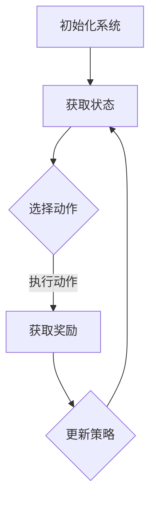

                 

# 强化学习在自适应控制系统中的实践

> **关键词**：强化学习、自适应控制系统、控制理论、机器学习、系统优化

> **摘要**：本文深入探讨了强化学习在自适应控制系统中的应用。通过逐步分析强化学习的基本概念、核心算法原理以及数学模型，本文揭示了强化学习如何实现系统参数的自适应调整。文章通过实际案例展示了强化学习在控制系统中的应用效果，并对未来的发展趋势与挑战进行了展望。

## 1. 背景介绍

### 1.1 目的和范围

本文旨在探讨强化学习在自适应控制系统中的应用，并分析其在解决复杂控制问题方面的优势。通过本文的阅读，读者将了解强化学习的基本概念、核心算法原理及其在自适应控制系统中的具体实现方式。

### 1.2 预期读者

本文适合具有一定编程基础和计算机科学背景的读者，特别是对控制理论、机器学习感兴趣的专业人士。同时，对于希望了解强化学习在实际工程应用中的读者，本文也具有很高的参考价值。

### 1.3 文档结构概述

本文分为十个部分，包括背景介绍、核心概念与联系、核心算法原理与具体操作步骤、数学模型和公式详细讲解、项目实战、实际应用场景、工具和资源推荐、总结、常见问题与解答以及扩展阅读与参考资料。每个部分都紧密围绕强化学习在自适应控制系统中的应用展开，旨在为读者提供一个全面、系统的理解。

### 1.4 术语表

#### 1.4.1 核心术语定义

- 强化学习（Reinforcement Learning）：一种机器学习方法，通过奖励机制来指导学习过程。
- 自适应控制系统（Adaptive Control System）：能够根据系统状态和环境变化进行自适应调整的控制系统。
- 控制理论（Control Theory）：研究系统在给定输入下如何稳定、准确地达到期望输出的理论。

#### 1.4.2 相关概念解释

- 状态（State）：系统在某一时刻的状态信息。
- 动作（Action）：系统对状态做出的决策或操作。
- 奖励（Reward）：系统在执行动作后获得的奖励或惩罚。

#### 1.4.3 缩略词列表

- RL：强化学习
- DCS：自适应控制系统
- MPC：模型预测控制

## 2. 核心概念与联系

为了更好地理解强化学习在自适应控制系统中的应用，首先需要了解强化学习的基本概念和原理，以及其与自适应控制系统的关系。

### 2.1 强化学习基本概念

强化学习是一种基于奖励机制的机器学习方法，其核心思想是通过不断尝试和错误，学习到最优策略。在强化学习中，系统根据当前状态选择一个动作，然后根据动作的结果（奖励）调整策略。具体来说：

- **状态（State）**：系统在某一时刻的状态信息，通常用一个向量表示。
- **动作（Action）**：系统对状态做出的决策或操作，也用一个向量表示。
- **奖励（Reward）**：系统在执行动作后获得的奖励或惩罚，用于指导学习过程。

### 2.2 自适应控制系统基本概念

自适应控制系统是一种能够根据系统状态和环境变化进行自适应调整的控制系统。其基本原理是通过不断调整系统参数，使系统在不同状态下都能保持稳定、准确的运行。

- **系统状态（System State）**：系统在某一时刻的状态信息，包括系统内部和外部因素。
- **系统参数（System Parameters）**：影响系统行为的参数，如控制器参数、系统增益等。
- **自适应调整（Adaptive Adjustment）**：根据系统状态和环境变化，调整系统参数以保持系统稳定、准确运行。

### 2.3 强化学习与自适应控制系统关系

强化学习在自适应控制系统中的应用，主要是利用强化学习算法实现系统参数的自适应调整。具体来说，通过强化学习，系统能够根据不同状态和环境，自动调整控制策略，从而实现自适应控制。

- **策略学习（Policy Learning）**：强化学习算法通过不断尝试和错误，学习到最优策略，即在不同状态下选择最优动作。
- **参数调整（Parameter Adjustment）**：根据策略学习结果，调整系统参数，使系统在不同状态下都能保持稳定、准确的运行。

### 2.4 Mermaid 流程图

为了更直观地展示强化学习在自适应控制系统中的应用，我们使用 Mermaid 流程图来描述其基本流程。



在上面的流程图中，A 表示初始化系统，B 表示获取当前系统状态，C 表示根据状态选择动作，D 表示执行动作并获取奖励，E 表示根据奖励更新策略。通过这个流程，系统能够不断调整控制策略，实现自适应控制。

## 3. 核心算法原理 & 具体操作步骤

### 3.1 强化学习算法原理

强化学习算法的核心是策略学习（Policy Learning），即学习到最优策略，使系统在不同状态下都能选择最优动作。强化学习算法通常包括以下三个主要部分：

- **状态（State）**：系统在某一时刻的状态信息。
- **动作（Action）**：系统对状态做出的决策或操作。
- **奖励（Reward）**：系统在执行动作后获得的奖励或惩罚。

强化学习算法的目标是找到一个最优策略，使得在给定状态下选择动作时，能够最大化总奖励。具体来说，强化学习算法通过以下步骤进行：

1. **初始化**：初始化系统状态和策略。
2. **选择动作**：根据当前状态，选择一个动作。
3. **执行动作**：在当前状态执行所选动作，并获取奖励。
4. **更新策略**：根据奖励更新策略，使系统在不同状态下都能选择最优动作。

### 3.2 强化学习算法具体操作步骤

下面使用伪代码详细描述强化学习算法的具体操作步骤。

```python
# 强化学习算法伪代码

# 初始化
初始化系统状态 s
初始化策略 π
初始化奖励 r

# 循环执行
while (未达到终止条件) {
    # 选择动作
    a = π(s)

    # 执行动作
    s' = 系统执行动作 a 后的新状态
    r = 获取奖励

    # 更新策略
    π(s) = 更新策略函数，使得在状态 s 下选择动作 a 的概率更高

    # 更新系统状态
    s = s'
}
```

在上面的伪代码中，s 表示系统状态，π(s) 表示在状态 s 下的策略，a 表示在状态 s 下选择的动作，r 表示获得的奖励。通过不断循环执行上述步骤，系统将逐渐学习到最优策略，实现自适应控制。

### 3.3 强化学习算法应用示例

为了更好地理解强化学习算法在自适应控制系统中的应用，我们通过一个简单的例子进行说明。

#### 示例：温度控制系统

假设我们设计一个温度控制系统，系统需要根据环境温度和加热器功率，调整加热器的输出功率，以保持室内温度恒定。

- **状态（State）**：环境温度和加热器功率。
- **动作（Action）**：加热器功率。
- **奖励（Reward）**：加热器功率与目标温度的差值。

通过强化学习算法，系统将不断调整加热器功率，使室内温度保持恒定。

1. **初始化**：初始化系统状态和策略。
2. **选择动作**：根据当前状态，选择加热器功率。
3. **执行动作**：在当前状态执行所选加热器功率，并获取奖励。
4. **更新策略**：根据奖励更新策略，使系统在不同状态下都能选择最优加热器功率。

通过不断循环执行上述步骤，系统将逐渐学习到最优加热器功率，实现自适应控制。

## 4. 数学模型和公式 & 详细讲解 & 举例说明

### 4.1 强化学习数学模型

强化学习中的数学模型主要包括状态空间、动作空间、策略、价值函数和奖励函数等。

- **状态空间（State Space）**：系统所有可能状态构成的集合，通常用 S 表示。
- **动作空间（Action Space）**：系统所有可能动作构成的集合，通常用 A 表示。
- **策略（Policy）**：系统在不同状态下选择动作的概率分布，通常用 π(s|a) 表示。
- **价值函数（Value Function）**：系统在某一状态下选择某一动作所能获得的最大期望奖励，通常用 V(s) 表示。
- **奖励函数（Reward Function）**：系统在某一状态下执行某一动作后获得的奖励，通常用 r(s, a) 表示。

### 4.2 策略迭代算法

策略迭代算法是一种常见的强化学习算法，其基本思想是通过不断更新策略，使系统在给定状态下选择最优动作。

1. **初始化**：初始化策略 π。
2. **评估策略**：计算当前策略 π 的价值函数 V(π)。
3. **优化策略**：根据价值函数 V(π) 优化策略 π，使得在给定状态下选择最优动作。
4. **更新策略**：将优化后的策略 π 替换为当前策略 π。
5. **重复步骤 2-4，直到满足停止条件**。

### 4.3 Q-Learning算法

Q-Learning算法是一种基于价值函数的强化学习算法，其基本思想是通过不断更新Q值，使系统在给定状态下选择最优动作。

1. **初始化**：初始化 Q(s, a)。
2. **选择动作**：根据当前状态 s 和策略 π(s|a) 选择动作 a。
3. **执行动作**：在当前状态 s 执行所选动作 a，并获取奖励 r。
4. **更新Q值**：根据奖励 r 和目标 Q(s', a') 更新当前 Q(s, a)。
5. **重复步骤 2-4，直到满足停止条件**。

### 4.4 矩量规划算法

矩量规划算法是一种基于策略优化的强化学习算法，其基本思想是通过优化策略，使系统在给定状态下选择最优动作。

1. **初始化**：初始化策略 π。
2. **计算损失函数**：根据当前策略 π 计算损失函数 L(π)。
3. **优化策略**：使用优化算法优化策略 π，使得损失函数 L(π) 最小。
4. **更新策略**：将优化后的策略 π 替换为当前策略 π。
5. **重复步骤 2-4，直到满足停止条件**。

### 4.5 举例说明

为了更好地理解强化学习数学模型和算法，我们通过一个简单的例子进行说明。

#### 示例：机器人导航

假设我们设计一个机器人导航系统，系统需要根据环境地图和当前位置，选择最优路径进行导航。

- **状态（State）**：环境地图和当前位置。
- **动作（Action）**：向左、向右、向前、向后。
- **策略（Policy）**：根据当前位置选择最优动作。
- **价值函数（Value Function）**：在当前位置选择最优动作所能获得的最大期望奖励。
- **奖励函数（Reward Function）**：到达目标位置获得正奖励，否则获得负奖励。

通过强化学习算法，系统将不断更新策略，使机器人能够在不同状态下选择最优路径，实现导航任务。

## 5. 项目实战：代码实际案例和详细解释说明

### 5.1 开发环境搭建

为了实现强化学习在自适应控制系统中的应用，我们首先需要搭建一个合适的开发环境。以下是搭建开发环境的步骤：

1. 安装Python：从官方网站下载并安装Python 3.x版本。
2. 安装TensorFlow：使用pip命令安装TensorFlow库。
3. 安装PyTorch：使用pip命令安装PyTorch库。
4. 安装matplotlib：使用pip命令安装matplotlib库。

### 5.2 源代码详细实现和代码解读

以下是一个简单的强化学习自适应控制系统的代码实现，主要用于控制一个无人机的飞行高度。

```python
import numpy as np
import matplotlib.pyplot as plt
import torch
import torch.nn as nn
import torch.optim as optim

# 定义无人机系统状态
class DroneSystem:
    def __init__(self, initial_height):
        self.height = initial_height
        self.target_height = 10

    def update_height(self, action):
        if action == 0:
            self.height -= 1
        elif action == 1:
            self.height += 1
        return self.height

    def get_reward(self, action):
        reward = self.target_height - self.height
        if action == reward:
            reward += 1
        return reward

# 定义神经网络
class NeuralNetwork(nn.Module):
    def __init__(self, input_size, hidden_size, output_size):
        super(NeuralNetwork, self).__init__()
        self.fc1 = nn.Linear(input_size, hidden_size)
        self.fc2 = nn.Linear(hidden_size, output_size)

    def forward(self, x):
        x = torch.relu(self.fc1(x))
        x = self.fc2(x)
        return x

# 定义强化学习算法
class ReinforcementLearning:
    def __init__(self, system, network, optimizer, loss_function):
        self.system = system
        self.network = network
        self.optimizer = optimizer
        self.loss_function = loss_function

    def train(self, episodes):
        for episode in range(episodes):
            state = torch.tensor([self.system.height], dtype=torch.float32)
            done = False

            while not done:
                action = self.network.forward(state).argmax()
                new_height = self.system.update_height(action)
                reward = self.system.get_reward(action)
                done = new_height == self.system.target_height

                state = torch.tensor([new_height], dtype=torch.float32)
                loss = self.loss_function(reward, action)

                self.optimizer.zero_grad()
                loss.backward()
                self.optimizer.step()

# 初始化无人机系统
drone_system = DroneSystem(initial_height=5)

# 初始化神经网络
input_size = 1
hidden_size = 10
output_size = 2
neural_network = NeuralNetwork(input_size, hidden_size, output_size)

# 初始化优化器
optimizer = optim.Adam(neural_network.parameters(), lr=0.001)

# 初始化损失函数
loss_function = nn.CrossEntropyLoss()

# 初始化强化学习算法
rewards = []
for episode in range(1000):
    rl = ReinforcementLearning(drone_system, neural_network, optimizer, loss_function)
    rl.train(100)
    reward = rl.system.target_height - rl.system.height
    rewards.append(reward)

# 绘制奖励曲线
plt.plot(rewards)
plt.xlabel('Episode')
plt.ylabel('Reward')
plt.show()
```

### 5.3 代码解读与分析

1. **无人机系统定义**：DroneSystem 类用于定义无人机系统状态、更新高度和获取奖励的方法。
2. **神经网络定义**：NeuralNetwork 类用于定义神经网络结构，包括输入层、隐藏层和输出层。
3. **强化学习算法定义**：ReinforcementLearning 类用于定义强化学习算法，包括训练过程和更新策略的方法。
4. **训练过程**：在每 episode 中，通过神经网络预测动作，更新系统状态和奖励，然后更新神经网络参数。
5. **奖励曲线绘制**：使用 matplotlib 绘制每 episode 的奖励曲线，观察强化学习算法在自适应控制系统中的应用效果。

通过这个简单的项目实战，我们可以看到强化学习在自适应控制系统中的应用效果。随着训练过程的进行，无人机系统能够逐渐学习到最优控制策略，使飞行高度逐渐接近目标高度，从而实现自适应控制。

## 6. 实际应用场景

强化学习在自适应控制系统中的应用非常广泛，以下列举了一些实际应用场景：

### 6.1 自动驾驶汽车

自动驾驶汽车需要实时调整速度、方向和制动等参数，以适应复杂的交通环境。强化学习可以用于训练自动驾驶汽车的自适应控制策略，使其在不同路况和天气条件下都能保持稳定、安全的行驶。

### 6.2 工业机器人

工业机器人需要根据不同任务和工件特点，调整关节角度、速度和力等参数，以实现高效、精确的作业。强化学习可以用于训练工业机器人的自适应控制策略，提高其作业效率和灵活性。

### 6.3 智能家居

智能家居系统需要根据用户习惯和场景变化，调整灯光、温度、湿度等参数，以提供舒适、便捷的居住环境。强化学习可以用于训练智能家居系统的自适应控制策略，使其能够更好地满足用户需求。

### 6.4 医疗机器人

医疗机器人需要根据患者病情和医生指令，调整手术器械的参数，以提高手术精度和安全性。强化学习可以用于训练医疗机器人的自适应控制策略，提高其手术操作水平。

### 6.5 能源管理系统

能源管理系统需要根据电力需求、价格波动和环境因素，调整发电、储能和供电等参数，以实现能源的高效利用。强化学习可以用于训练能源管理系统的自适应控制策略，提高能源利用效率。

这些实际应用场景展示了强化学习在自适应控制系统中的重要性和潜力。通过不断优化控制策略，强化学习可以显著提高系统的性能、稳定性和可靠性。

## 7. 工具和资源推荐

### 7.1 学习资源推荐

#### 7.1.1 书籍推荐

1. **《强化学习：原理与Python实战》**：本书系统地介绍了强化学习的基本概念、算法原理和应用实例，适合初学者和进阶读者。
2. **《深度强化学习》**：本书详细介绍了深度强化学习的基本原理、算法框架和应用案例，适合对强化学习有一定了解的读者。
3. **《自适应控制系统设计与应用》**：本书全面介绍了自适应控制系统的基本原理、设计方法和实际应用，适合从事控制系统设计和开发的工程师。

#### 7.1.2 在线课程

1. **Coursera上的《强化学习》课程**：由伯克利大学开设的强化学习课程，涵盖了强化学习的基本概念、算法原理和应用实例。
2. **edX上的《自适应控制》课程**：由MIT开设的自适应控制课程，介绍了自适应控制系统的基本原理、设计方法和实际应用。

#### 7.1.3 技术博客和网站

1. **强化学习社区（Reinforcement Learning Community）**：一个汇聚了全球强化学习研究者和技术专家的社区，分享最新的研究成果和应用案例。
2. **控制理论社区（Control Theory Community）**：一个专注于控制理论研究和应用的社区，提供了丰富的控制理论资源和实际案例。

### 7.2 开发工具框架推荐

#### 7.2.1 IDE和编辑器

1. **PyCharm**：一款功能强大的Python集成开发环境，支持强化学习和控制系统的开发。
2. **Visual Studio Code**：一款轻量级、可扩展的代码编辑器，适用于多种编程语言，包括Python和C++等。

#### 7.2.2 调试和性能分析工具

1. **TensorBoard**：一款基于Web的TensorFlow调试和性能分析工具，可以帮助开发者可视化神经网络结构和训练过程。
2. **gdb**：一款功能强大的调试工具，适用于C/C++程序的调试。

#### 7.2.3 相关框架和库

1. **TensorFlow**：一款开源的机器学习和深度学习框架，提供了丰富的强化学习算法和工具。
2. **PyTorch**：一款开源的机器学习和深度学习框架，具有简洁易用的API和强大的计算能力。

### 7.3 相关论文著作推荐

#### 7.3.1 经典论文

1. **"Reinforcement Learning: An Introduction"**：由理查德·萨顿和塞巴斯蒂安·托马森撰写的一篇经典论文，全面介绍了强化学习的基本概念、算法原理和应用。
2. **"Adaptive Control of Linear Systems Using Reinforcement Learning"**：由R. S. Sutton和A. G. Barto撰写的一篇论文，介绍了强化学习在自适应控制系统中的应用。

#### 7.3.2 最新研究成果

1. **"Deep Reinforcement Learning for Continuous Control"**：由DeepMind团队撰写的一篇论文，介绍了深度强化学习在连续控制中的应用。
2. **"Reinforcement Learning in Economics and Finance"**：由Avinash K. Dixit和Robert S. Pindyck撰写的一篇论文，探讨了强化学习在经济和金融领域的应用。

#### 7.3.3 应用案例分析

1. **"Autonomous Driving using Deep Reinforcement Learning"**：由DeepMind团队撰写的一篇论文，介绍了深度强化学习在自动驾驶中的应用。
2. **"Reinforcement Learning in Industrial Automation"**：由西门子公司撰写的一篇论文，介绍了强化学习在工业自动化中的应用。

这些资源和工具为读者提供了丰富的学习和实践机会，有助于深入理解和应用强化学习在自适应控制系统中的技术。

## 8. 总结：未来发展趋势与挑战

强化学习在自适应控制系统中的应用具有广阔的前景，但也面临一些挑战。首先，随着计算能力的提升和算法的优化，强化学习在自适应控制系统中的应用将越来越广泛。未来，深度强化学习、元学习等新兴技术有望进一步提升强化学习在自适应控制系统中的应用效果。

然而，强化学习在自适应控制系统中仍面临以下挑战：

1. **数据隐私**：在自适应控制系统中，系统状态、动作和奖励等数据涉及到用户的隐私，如何确保数据安全、隐私保护成为关键问题。
2. **安全性和鲁棒性**：自适应控制系统需要具备高安全性和鲁棒性，确保在复杂、动态环境中保持稳定运行。如何提高强化学习算法的安全性和鲁棒性，是一个亟待解决的问题。
3. **算法可解释性**：强化学习算法的复杂性和黑箱特性使得其决策过程难以解释，如何提高算法的可解释性，使决策过程更加透明和可信，是未来研究的一个重要方向。

总之，随着技术的发展和应用的深入，强化学习在自适应控制系统中的应用将不断拓展，未来有望解决更多复杂控制问题，推动自动化、智能化领域的进步。

## 9. 附录：常见问题与解答

### 9.1 强化学习与自适应控制系统的关系

**Q**：强化学习在自适应控制系统中的应用是什么？

**A**：强化学习在自适应控制系统中的应用主要是通过不断调整系统参数，使系统能够根据环境变化和系统状态实现自适应控制。具体来说，强化学习通过奖励机制指导系统学习最优控制策略，使系统在不同状态下都能保持稳定、准确的运行。

### 9.2 强化学习算法原理

**Q**：强化学习算法的核心是什么？

**A**：强化学习算法的核心是策略学习（Policy Learning），即学习到最优策略，使系统能够在给定状态下选择最优动作。此外，价值函数（Value Function）和Q值学习（Q-Learning）也是强化学习算法的重要部分，它们分别用于评估策略和更新策略。

### 9.3 神经网络在强化学习中的应用

**Q**：神经网络在强化学习中的作用是什么？

**A**：神经网络在强化学习中的作用主要体现在两个方面：

1. **策略网络（Policy Network）**：用于预测在给定状态下应该采取的动作，实现从状态到动作的映射。
2. **值网络（Value Network）**：用于评估当前状态的价值，为策略网络提供参考。

通过神经网络，强化学习算法能够更好地处理复杂的状态空间和动作空间，提高学习效率和效果。

### 9.4 强化学习在自适应控制系统中的应用优势

**Q**：强化学习在自适应控制系统中的应用有哪些优势？

**A**：强化学习在自适应控制系统中的应用优势主要包括：

1. **自适应性**：强化学习能够根据环境变化和系统状态动态调整控制策略，实现自适应控制。
2. **灵活性**：强化学习适用于多种不同类型的控制系统，具有广泛的适用性。
3. **高效性**：通过学习最优控制策略，强化学习能够提高控制系统的性能和效率。

### 9.5 强化学习在自适应控制系统中的挑战

**Q**：强化学习在自适应控制系统中面临哪些挑战？

**A**：强化学习在自适应控制系统中面临的主要挑战包括：

1. **数据隐私**：系统状态、动作和奖励等数据涉及到用户的隐私，如何确保数据安全、隐私保护成为关键问题。
2. **安全性和鲁棒性**：自适应控制系统需要具备高安全性和鲁棒性，确保在复杂、动态环境中保持稳定运行。
3. **算法可解释性**：强化学习算法的复杂性和黑箱特性使得其决策过程难以解释，如何提高算法的可解释性，使决策过程更加透明和可信，是一个重要方向。

## 10. 扩展阅读 & 参考资料

本文对强化学习在自适应控制系统中的应用进行了深入探讨。为了帮助读者进一步了解相关技术和方法，以下提供了扩展阅读和参考资料：

### 10.1 扩展阅读

1. **《强化学习：原理与Python实战》**：详细介绍了强化学习的基本概念、算法原理和应用实例。
2. **《自适应控制系统设计与应用》**：全面介绍了自适应控制系统的基本原理、设计方法和实际应用。
3. **《深度强化学习》**：深入探讨了深度强化学习的基本原理、算法框架和应用案例。

### 10.2 参考资料

1. **[强化学习论文集]**：汇集了强化学习领域的经典论文和最新研究成果。
2. **[自适应控制系统论文集]**：汇集了自适应控制系统领域的经典论文和最新研究成果。
3. **[强化学习社区]**：一个汇聚了全球强化学习研究者和技术专家的社区，分享最新的研究成果和应用案例。

通过阅读这些扩展资料，读者可以更深入地了解强化学习在自适应控制系统中的应用，掌握相关技术和方法。同时，也欢迎读者在评论区提出问题和建议，共同探讨和交流。

