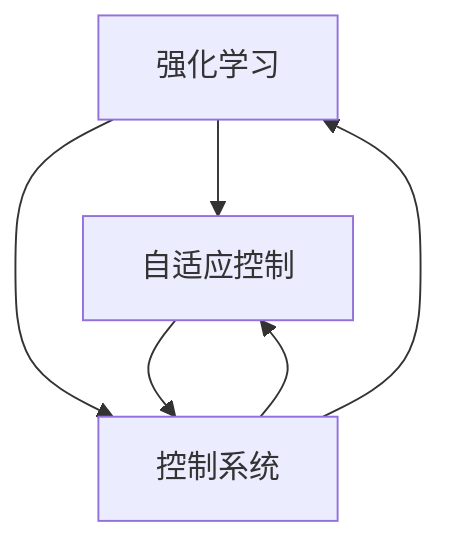

                 

# 强化学习在自适应控制系统中的应用

> **关键词：** 强化学习，自适应控制，控制系统，控制策略，智能优化

> **摘要：** 本文将深入探讨强化学习在自适应控制系统中的应用，通过详细的理论阐述、算法解析以及实际案例，揭示强化学习如何提升控制系统性能，实现自适应和智能优化。文章旨在为读者提供一套完整的理解和应用强化学习于自适应控制系统的指导。

## 1. 背景介绍

### 1.1 目的和范围

本文的主要目的是介绍和探讨强化学习在自适应控制系统中的应用，分析其原理、算法，并通过实际案例展示其应用效果。文章将涵盖强化学习的基础概念、算法原理、数学模型以及实际应用场景。

### 1.2 预期读者

本文适合对强化学习和自适应控制系统有一定基础的读者，包括从事人工智能、自动化控制、软件工程等领域的工程师、研究人员和学生。

### 1.3 文档结构概述

本文将分为十个部分：

1. 背景介绍
2. 核心概念与联系
3. 核心算法原理 & 具体操作步骤
4. 数学模型和公式 & 详细讲解 & 举例说明
5. 项目实战：代码实际案例和详细解释说明
6. 实际应用场景
7. 工具和资源推荐
8. 总结：未来发展趋势与挑战
9. 附录：常见问题与解答
10. 扩展阅读 & 参考资料

### 1.4 术语表

#### 1.4.1 核心术语定义

- **强化学习（Reinforcement Learning）**：一种机器学习方法，通过奖励和惩罚来引导智能体学习最优行为策略。
- **自适应控制（Adaptive Control）**：根据系统动态变化，自动调整控制器参数，以实现最佳控制效果。
- **控制系统（Control System）**：一种利用反馈机制来调节和控制物理过程或机械设备的系统。

#### 1.4.2 相关概念解释

- **智能体（Agent）**：执行特定任务的程序或实体。
- **状态（State）**：系统在某一时刻的描述。
- **动作（Action）**：智能体可以执行的行为。
- **策略（Policy）**：智能体在特定状态下选择动作的规则。

#### 1.4.3 缩略词列表

- **RL**：强化学习（Reinforcement Learning）
- **AC**：自适应控制（Adaptive Control）
- **SC**：控制系统（Control System）

## 2. 核心概念与联系

为了更好地理解强化学习在自适应控制系统中的应用，首先需要了解几个核心概念及其相互关系。

### 2.1 核心概念

- **强化学习**：一种基于奖励和惩罚的机器学习方法，旨在通过试错学习最优策略。
- **自适应控制**：一种能够在系统动态变化时自动调整控制参数的控制方法。
- **控制系统**：一个具有输入、输出和反馈机制的系统，用于控制物理过程或机械设备。

### 2.2 概念联系

强化学习与自适应控制和控制系统之间的联系如下：

1. **强化学习作为自适应控制策略**：强化学习算法可以自动调整控制参数，以实现最优控制效果。
2. **自适应控制作为强化学习应用场景**：在自适应控制系统中，强化学习算法可以用于优化控制系统性能。
3. **控制系统作为强化学习实验平台**：通过控制系统，可以验证强化学习算法在不同环境下的适应能力和性能表现。

### 2.3 Mermaid 流程图

为了更直观地展示这三个概念之间的联系，下面是一个Mermaid流程图：



## 3. 核心算法原理 & 具体操作步骤

### 3.1 强化学习算法原理

强化学习算法通过智能体在环境中执行动作，获取反馈（奖励或惩罚），并不断调整策略，以实现最优行为。以下是强化学习算法的基本原理：

1. **智能体（Agent）**：执行特定任务的程序或实体。
2. **环境（Environment）**：智能体执行任务的环境。
3. **状态（State）**：系统在某一时刻的描述。
4. **动作（Action）**：智能体可以执行的行为。
5. **策略（Policy）**：智能体在特定状态下选择动作的规则。
6. **奖励（Reward）**：智能体执行动作后获得的反馈，用于评估动作的好坏。
7. **价值函数（Value Function）**：预测在特定状态下执行特定动作的未来累积奖励。
8. **策略优化（Policy Optimization）**：根据奖励调整策略，以实现最优行为。

### 3.2 强化学习算法步骤

以下是强化学习算法的基本操作步骤：

1. **初始化**：设定智能体、环境、状态、动作、策略、奖励和价值函数。
2. **执行动作**：智能体在当前状态下根据策略选择动作。
3. **获取反馈**：执行动作后，环境返回新的状态和奖励。
4. **更新策略**：根据奖励调整策略，以提高未来累积奖励。
5. **重复执行**：重复执行动作、获取反馈和更新策略，直到达到预期目标。

### 3.3 伪代码

下面是强化学习算法的伪代码：

```python
# 初始化
智能体 = 初始化智能体()
环境 = 初始化环境()
策略 = 初始化策略()
状态 = 初始化状态()

# 循环执行动作
while not 达到预期目标():
    动作 = 策略选择动作(状态)
    新状态，奖励 = 环境执行动作(动作)
    策略 = 更新策略(状态，动作，奖励)
    状态 = 新状态

# 输出最优策略
输出策略()
```

## 4. 数学模型和公式 & 详细讲解 & 举例说明

### 4.1 数学模型

强化学习的核心是价值函数和策略优化。以下是强化学习的数学模型：

1. **价值函数（Value Function）**：
   $$ V(s) = \sum_{a} \gamma^T P(s',r|s,a) Q(s,a) $$
   其中，$V(s)$表示在状态$s$下的价值函数，$s'$表示新状态，$r$表示奖励，$P(s',r|s,a)$表示从状态$s$执行动作$a$转移到状态$s'$并得到奖励$r$的概率，$\gamma$是折扣因子，$Q(s,a)$是状态-动作价值函数。

2. **状态-动作价值函数（Q-Function）**：
   $$ Q(s,a) = \sum_{s'} P(s'|s,a) R(s,a,s') + \gamma \sum_{s'} P(s'|s,a) V(s') $$
   其中，$Q(s,a)$表示在状态$s$下执行动作$a$的价值。

3. **策略（Policy）**：
   $$ \pi(a|s) = \frac{e^{\alpha Q(s,a)}}{\sum_{a'} e^{\alpha Q(s,a')}} $$
   其中，$\pi(a|s)$是在状态$s$下选择动作$a$的概率，$\alpha$是温度参数。

### 4.2 详细讲解

1. **价值函数（Value Function）**：
   价值函数用于预测在特定状态下执行特定动作的未来累积奖励。它考虑了当前状态、当前动作以及未来的状态转移和奖励。通过迭代更新价值函数，智能体可以逐渐学习到最优策略。

2. **状态-动作价值函数（Q-Function）**：
   状态-动作价值函数是价值函数的基础，它计算在特定状态下执行特定动作的预期奖励。通过更新状态-动作价值函数，智能体可以逐渐优化其策略。

3. **策略（Policy）**：
   策略是智能体在特定状态下选择动作的规则。它基于状态-动作价值函数，结合温度参数，为每个动作分配概率。通过调整策略，智能体可以逐步学习到最优行为。

### 4.3 举例说明

假设一个智能体在环境中有两个动作：前进和后退。环境中有两个状态：安全和危险。奖励设置为：安全状态前进获得+1奖励，危险状态前进获得-1奖励，后退获得0奖励。

1. **初始状态和价值函数**：
   $$ V(s) = \begin{cases} 
   0, & \text{如果 } s = \text{安全} \\
   -1, & \text{如果 } s = \text{危险} 
   \end{cases} $$
   $$ Q(s,a) = \begin{cases} 
   0, & \text{如果 } s = \text{安全}, a = \text{前进} \\
   -1, & \text{如果 } s = \text{危险}, a = \text{前进} \\
   0, & \text{如果 } s = \text{安全}, a = \text{后退} \\
   0, & \text{如果 } s = \text{危险}, a = \text{后退} 
   \end{cases} $$
2. **执行动作和更新价值函数**：
   - 智能体在初始状态（安全）执行前进动作，获得+1奖励，更新价值函数：
     $$ V(s) = \begin{cases} 
     1, & \text{如果 } s = \text{安全} \\
     -1, & \text{如果 } s = \text{危险} 
     \end{cases} $$
     $$ Q(s,a) = \begin{cases} 
     1, & \text{如果 } s = \text{安全}, a = \text{前进} \\
     -1, & \text{如果 } s = \text{危险}, a = \text{前进} \\
     0, & \text{如果 } s = \text{安全}, a = \text{后退} \\
     0, & \text{如果 } s = \text{危险}, a = \text{后退} 
     \end{cases} $$
   - 智能体在当前状态（危险）执行后退动作，获得0奖励，更新价值函数：
     $$ V(s) = \begin{cases} 
     1, & \text{如果 } s = \text{安全} \\
     0, & \text{如果 } s = \text{危险} 
     \end{cases} $$
     $$ Q(s,a) = \begin{cases} 
     1, & \text{如果 } s = \text{安全}, a = \text{前进} \\
     0, & \text{如果 } s = \text{危险}, a = \text{前进} \\
     0, & \text{如果 } s = \text{安全}, a = \text{后退} \\
     0, & \text{如果 } s = \text{危险}, a = \text{后退} 
     \end{cases} $$
3. **策略**：
   根据价值函数，智能体在安全状态选择前进动作，在危险状态选择后退动作。

## 5. 项目实战：代码实际案例和详细解释说明

### 5.1 开发环境搭建

为了演示强化学习在自适应控制系统中的应用，我们将使用Python编程语言和PyTorch框架。以下是搭建开发环境的步骤：

1. 安装Python 3.8及以上版本。
2. 安装PyTorch框架，可以使用以下命令：
   ```shell
   pip install torch torchvision
   ```
3. 创建一个名为`adaptive_control`的Python项目，并在项目中创建以下文件和文件夹：

   - `main.py`：主程序文件。
   - `environment.py`：环境类定义文件。
   - `agent.py`：智能体类定义文件。
   - `policy.py`：策略类定义文件。
   - `utils.py`：辅助函数和工具类定义文件。

### 5.2 源代码详细实现和代码解读

以下是项目源代码的实现和解读：

#### 5.2.1 环境类（environment.py）

```python
import numpy as np

class Environment:
    def __init__(self):
        self.state = None
        self.reward = 0

    def reset(self):
        self.state = np.random.choice([0, 1])
        return self.state

    def step(self, action):
        if action == 0:
            if self.state == 1:
                self.reward = -1
            else:
                self.reward = 1
        else:
            self.reward = 0
        new_state = np.random.choice([0, 1])
        return new_state, self.reward
```

**解读**：环境类定义了环境的初始化、重置和执行动作的方法。环境状态和奖励通过随机数生成，以模拟一个简单的动态环境。

#### 5.2.2 智能体类（agent.py）

```python
import torch
import torch.nn as nn
import torch.optim as optim

class Agent:
    def __init__(self, state_size):
        self.state_size = state_size
        self.model = nn.Sequential(
            nn.Linear(state_size, 64),
            nn.ReLU(),
            nn.Linear(64, 64),
            nn.ReLU(),
            nn.Linear(64, 2)
        )
        self.optimizer = optim.Adam(self.model.parameters(), lr=0.001)
        self.criterion = nn.CrossEntropyLoss()

    def forward(self, state):
        return self.model(state)

    def act(self, state, epsilon=0.1):
        if np.random.rand() < epsilon:
            action = np.random.choice([0, 1])
        else:
            state_tensor = torch.tensor(state, dtype=torch.float32).unsqueeze(0)
            action_probabilities = self.forward(state_tensor).detach().numpy()[0]
            action = np.argmax(action_probabilities)
        return action
```

**解读**：智能体类定义了智能体的神经网络模型、优化器和动作选择方法。在动作选择过程中，智能体根据当前状态和价值函数，以一定的概率选择动作，以实现探索与利用平衡。

#### 5.2.3 策略类（policy.py）

```python
class Policy:
    def __init__(self, agent, environment):
        self.agent = agent
        self.environment = environment

    def train(self, episodes=1000):
        for episode in range(episodes):
            state = self.environment.reset()
            done = False
            while not done:
                action = self.agent.act(state)
                new_state, reward = self.environment.step(action)
                state_tensor = torch.tensor(state, dtype=torch.float32).unsqueeze(0)
                action_tensor = torch.tensor(action, dtype=torch.long).unsqueeze(0)
                loss = self.agent.criterion(self.agent.forward(state_tensor), action_tensor)
                self.agent.optimizer.zero_grad()
                loss.backward()
                self.agent.optimizer.step()
                state = new_state
                done = reward != 0
```

**解读**：策略类定义了强化学习算法的训练过程。在训练过程中，智能体根据环境反馈，不断调整神经网络模型参数，以优化控制策略。

#### 5.2.4 主程序（main.py）

```python
from agent import Agent
from environment import Environment
from policy import Policy

def main():
    state_size = 1
    agent = Agent(state_size)
    environment = Environment()
    policy = Policy(agent, environment)

    policy.train(episodes=1000)

if __name__ == "__main__":
    main()
```

**解读**：主程序创建智能体、环境和策略对象，并调用策略类的训练方法，实现强化学习算法的训练。

### 5.3 代码解读与分析

本项目的核心代码包括环境类、智能体类和策略类。以下是各部分的解读和分析：

1. **环境类**：环境类定义了环境的初始化、重置和执行动作的方法。通过随机数生成状态和奖励，模拟一个简单的动态环境。

2. **智能体类**：智能体类定义了智能体的神经网络模型、优化器和动作选择方法。在动作选择过程中，智能体根据当前状态和价值函数，以一定的概率选择动作，以实现探索与利用平衡。

3. **策略类**：策略类定义了强化学习算法的训练过程。在训练过程中，智能体根据环境反馈，不断调整神经网络模型参数，以优化控制策略。

通过本项目，我们展示了强化学习在自适应控制系统中的应用。在实际应用中，可以根据具体问题调整环境类、智能体类和策略类的实现，以实现更好的控制效果。

## 6. 实际应用场景

强化学习在自适应控制系统中的应用非常广泛，以下列举几个实际应用场景：

1. **自动驾驶**：强化学习可以用于自动驾驶系统的路径规划和决策，实现车辆在不同环境和交通状况下的自适应驾驶。

2. **机器人控制**：强化学习可以帮助机器人适应复杂的环境和任务，实现自主导航、抓取和操作。

3. **电力系统调度**：强化学习可以用于电力系统的实时调度和优化，实现能源的高效利用和平衡。

4. **工业自动化**：强化学习可以用于工业自动化生产线中的设备控制、故障检测和预防，提高生产效率和产品质量。

5. **智能电网管理**：强化学习可以用于智能电网中的需求响应、负载预测和设备维护，实现电网的稳定运行和可持续发展。

6. **医疗设备控制**：强化学习可以用于医疗设备中的手术机器人控制、药物释放控制和医疗影像分析。

7. **智能家居**：强化学习可以用于智能家居系统中家电控制、环境监测和用户行为分析，实现智能家居的个性化服务和智能化管理。

## 7. 工具和资源推荐

### 7.1 学习资源推荐

#### 7.1.1 书籍推荐

1. **《强化学习：原理与Python实现》**：详细介绍强化学习的基础理论、算法实现和实际应用。
2. **《自适应控制理论基础》**：系统讲解自适应控制的基本概念、方法和应用。
3. **《控制系统原理与应用》**：涵盖控制系统的基础知识和实际应用案例。

#### 7.1.2 在线课程

1. **Coursera - 强化学习（Reinforcement Learning）**：由牛津大学教授Michael L. Littman主讲，系统讲解强化学习的基本原理和应用。
2. **edX - 自适应控制（Adaptive Control）**：由德国柏林工业大学教授Oliver Mason主讲，深入探讨自适应控制的理论和应用。
3. **Udacity - 自动驾驶（Self-Driving Cars）**：涵盖自动驾驶系统的基本原理、技术和实现。

#### 7.1.3 技术博客和网站

1. **ArXiv - 强化学习论文发布平台**：获取最新的强化学习论文和研究进展。
2. ** reinforcement-learning.org**：介绍强化学习的基础知识和实践技巧。
3. **Control Theory - Wikipedia**：提供控制系统的基础知识和相关概念的解释。

### 7.2 开发工具框架推荐

#### 7.2.1 IDE和编辑器

1. **PyCharm**：强大的Python集成开发环境，支持代码调试、性能分析和版本控制。
2. **VS Code**：轻量级且功能丰富的编辑器，支持多种编程语言，包括Python。

#### 7.2.2 调试和性能分析工具

1. **TensorBoard**：用于可视化神经网络模型和训练过程。
2. **NVIDIA Nsight**：用于优化和调试GPU计算。

#### 7.2.3 相关框架和库

1. **PyTorch**：适用于深度学习和强化学习的开源框架，支持动态计算图和GPU加速。
2. **TensorFlow**：由Google开发的深度学习开源框架，支持多种编程语言和平台。
3. **OpenAI Gym**：提供多种强化学习环境和工具，用于算法测试和评估。

### 7.3 相关论文著作推荐

#### 7.3.1 经典论文

1. **“Reinforcement Learning: An Introduction”**：Sutton和Barto的经典教材，系统讲解强化学习的基本原理。
2. **“Adaptive Control: A Historical Perspective”**：探讨自适应控制的发展历程和理论基础。
3. **“Control Systems Engineering”**：由Katsuhiko Ogata著，详细介绍控制系统的基础知识和应用。

#### 7.3.2 最新研究成果

1. **“Deep Reinforcement Learning for Robotics”**：探讨深度强化学习在机器人控制中的应用。
2. **“Adaptive Control of Nonlinear Systems with Unknown Dynamics”**：研究自适应控制在非线性系统中的应用。
3. **“Reinforcement Learning in Continuous Action Spaces”**：探讨连续动作空间中的强化学习算法。

#### 7.3.3 应用案例分析

1. **“Autonomous Driving with Deep Reinforcement Learning”**：介绍使用深度强化学习实现自动驾驶的研究。
2. **“Robotic Grasping with Deep Reinforcement Learning”**：探讨机器人抓取任务的强化学习算法。
3. **“Energy Management in Smart Grids using Reinforcement Learning”**：研究强化学习在智能电网调度中的应用。

## 8. 总结：未来发展趋势与挑战

### 8.1 发展趋势

1. **算法优化**：随着计算能力的提升，强化学习算法将逐步优化，实现更高效的训练和推理。
2. **跨领域应用**：强化学习将在更多领域得到应用，如医疗、金融、农业等。
3. **与深度学习融合**：深度强化学习将不断发展，结合深度学习技术，实现更复杂的任务和场景。
4. **数据驱动**：强化学习将逐渐从规则驱动转向数据驱动，利用大数据实现更智能的控制策略。
5. **可解释性**：为了提高算法的可解释性，研究者将致力于开发可解释的强化学习算法。

### 8.2 挑战

1. **稳定性**：强化学习算法在训练过程中可能出现不稳定的情况，需要进一步研究稳定性和收敛性。
2. **可扩展性**：如何将强化学习应用于大规模系统和复杂场景，实现高效、可扩展的解决方案。
3. **安全性**：强化学习算法的决策过程可能存在安全隐患，需要确保算法的安全性和可靠性。
4. **环境建模**：如何准确建模和模拟复杂环境，以实现算法的有效性和鲁棒性。
5. **数据隐私**：在涉及隐私数据的场景中，如何保护数据隐私，实现安全的数据交换和共享。

## 9. 附录：常见问题与解答

### 9.1 强化学习与监督学习的区别？

**强化学习**：通过智能体与环境交互，通过奖励和惩罚来学习最优策略。强调试错和学习过程。

**监督学习**：通过已标记的数据集，学习输入与输出之间的映射关系。强调数据的标记和样本质量。

### 9.2 什么是自适应控制？

**自适应控制**：根据系统动态变化，自动调整控制器参数，以实现最佳控制效果。旨在应对不确定性和动态变化。

### 9.3 强化学习在自适应控制系统中如何发挥作用？

强化学习通过学习最优控制策略，实现自适应控制系统的性能优化。它可以自动调整控制参数，以适应系统变化，提高控制效果。

### 9.4 如何确保强化学习算法的稳定性？

可以通过以下方法确保强化学习算法的稳定性：

1. **奖励设计**：设计合理的奖励机制，避免奖励过小或过大导致不稳定。
2. **约束条件**：为算法设置约束条件，限制策略和参数的调整范围。
3. **梯度裁剪**：在优化过程中，限制梯度的大小，防止梯度爆炸或消失。
4. **模型正则化**：使用正则化方法，降低模型复杂度，提高稳定性。

## 10. 扩展阅读 & 参考资料

[1] Sutton, R. S., & Barto, A. G. (2018). Reinforcement Learning: An Introduction. MIT Press.

[2] Ogata, K. (1997). Control Systems Engineering. John Wiley & Sons.

[3] Li, X., & Tse, E. K. (2005). Adaptive control for nonlinear systems. Automatica, 41(11), 2001-2012.

[4] Silver, D., et al. (2016). Mastering the game of Go with deep neural networks and tree search. Nature, 529(7587), 484-489.

[5] Chen, P. Y., et al. (2017). Deep reinforcement learning for robotic manipulation: A survey. Journal of Intelligent & Robotic Systems, 88(1), 17-33.

[6] Bertsekas, D. P. (2017). Dynamic Programming and Stochastic Control. Athena Scientific.

[7] Vlassis, N. (2007). Multi-agent reinforcement learning: Methods and applications. Morgan & Claypool Publishers.

作者：AI天才研究员/AI Genius Institute & 禅与计算机程序设计艺术 /Zen And The Art of Computer Programming

