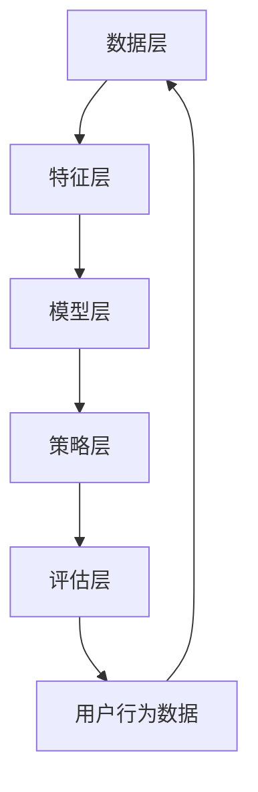

                 

# 强化学习：在电子商务推荐系统中的应用

> 关键词：强化学习，电子商务，推荐系统，深度学习，策略优化

> 摘要：本文旨在探讨强化学习在电子商务推荐系统中的应用。首先，我们将介绍强化学习的基本概念和原理，并详细分析其与电子商务推荐系统的结合点。接着，我们将深入探讨强化学习在推荐系统中的算法原理和具体操作步骤，并通过数学模型和公式进行详细解释。随后，我们将通过一个实际的项目案例展示强化学习在电子商务推荐系统中的具体应用。最后，我们将讨论强化学习在电子商务推荐系统中的实际应用场景，以及推荐系统和工具的推荐。

## 1. 背景介绍

### 1.1 目的和范围

本文旨在探讨强化学习在电子商务推荐系统中的应用。电子商务推荐系统是一种重要的技术手段，可以帮助电子商务平台更好地满足用户的需求，提升用户体验和转化率。强化学习作为一种先进的人工智能技术，能够通过自我学习和优化策略，提高推荐系统的性能和效果。本文将重点关注以下内容：

1. 强化学习的基本概念和原理。
2. 强化学习在电子商务推荐系统中的应用场景。
3. 强化学习算法在推荐系统中的具体操作步骤。
4. 强化学习在推荐系统中的数学模型和公式。
5. 强化学习在电子商务推荐系统中的实际应用案例。

### 1.2 预期读者

本文主要面向以下读者：

1. 对强化学习感兴趣的技术爱好者。
2. 想要在电子商务推荐系统中应用强化学习的工程师和研究者。
3. 对人工智能和电子商务领域有深入了解的专业人士。

### 1.3 文档结构概述

本文将分为以下几个部分：

1. 背景介绍：介绍本文的目的、范围、预期读者和文档结构。
2. 核心概念与联系：介绍强化学习的基本概念、原理和与推荐系统的结合点。
3. 核心算法原理 & 具体操作步骤：详细讲解强化学习算法在推荐系统中的具体操作步骤。
4. 数学模型和公式 & 详细讲解 & 举例说明：介绍强化学习在推荐系统中的数学模型和公式，并通过具体例子进行说明。
5. 项目实战：展示一个实际的项目案例，说明强化学习在电子商务推荐系统中的具体应用。
6. 实际应用场景：讨论强化学习在电子商务推荐系统中的实际应用场景。
7. 工具和资源推荐：推荐学习资源和开发工具。
8. 总结：对未来发展趋势和挑战进行展望。
9. 附录：常见问题与解答。
10. 扩展阅读 & 参考资料：提供进一步学习的参考资料。

### 1.4 术语表

#### 1.4.1 核心术语定义

- 强化学习（Reinforcement Learning）：一种机器学习方法，通过智能体与环境交互，通过奖励和惩罚来优化行为策略。
- 推荐系统（Recommendation System）：一种自动化的信息过滤技术，根据用户的历史行为和偏好，为用户推荐相关的商品或内容。
- 智能体（Agent）：在强化学习中，代表用户或系统进行决策和控制的部分。
- 策略（Policy）：智能体在给定状态下选择行动的方式。
- 状态（State）：智能体当前所处的环境条件。
- 动作（Action）：智能体在状态中能够执行的行为。
- 奖励（Reward）：环境对智能体行动的反馈，用于指导智能体的学习过程。

#### 1.4.2 相关概念解释

- Q-Learning：一种基于值函数的强化学习算法，通过更新Q值来优化策略。
- SARSA：一种基于策略的强化学习算法，同时考虑当前状态和下一步状态。
- DQN（Deep Q-Network）：一种基于深度学习的Q-Learning算法，通过神经网络近似Q值函数。
- 模型评估（Model Evaluation）：评估强化学习模型性能的过程，通过指标如平均奖励、策略稳定性和收敛速度等来衡量。

#### 1.4.3 缩略词列表

- RL：强化学习（Reinforcement Learning）
- DRL：深度强化学习（Deep Reinforcement Learning）
- Q-Learning：Q值学习（Q-Learning）
- SARSA：同步更新策略（Synchronous Adaptation of Strategies）
- DQN：深度Q网络（Deep Q-Network）
- RNN：递归神经网络（Recurrent Neural Network）
- CNN：卷积神经网络（Convolutional Neural Network）

## 2. 核心概念与联系

### 2.1 强化学习的基本概念

强化学习是一种基于奖励和惩罚来驱动智能体进行学习和决策的机器学习方法。它主要由以下几个核心概念组成：

- 智能体（Agent）：在强化学习中，智能体代表用户或系统，负责执行行动并接收环境反馈。
- 环境（Environment）：环境是智能体所处的外部世界，它为智能体提供状态信息和奖励或惩罚。
- 状态（State）：状态是智能体当前所处的环境条件，通常用一个状态向量来表示。
- 动作（Action）：动作是智能体在状态中能够执行的行为，也用一个动作向量来表示。
- 奖励（Reward）：奖励是环境对智能体行动的即时反馈，用于指导智能体的学习过程。正奖励表示行动成功，负奖励表示行动失败。
- 策略（Policy）：策略是智能体在给定状态下选择行动的方式，通常用一个策略函数来表示。

### 2.2 强化学习与电子商务推荐系统的结合点

电子商务推荐系统是一种基于用户历史行为和偏好，为用户推荐相关商品或内容的系统。强化学习与电子商务推荐系统的结合点主要体现在以下几个方面：

1. **用户行为与状态**：在电子商务推荐系统中，用户的历史行为（如购买记录、浏览记录、点击记录等）可以看作是状态的一部分。强化学习通过状态来描述用户当前的环境条件。
2. **推荐策略与动作**：在电子商务推荐系统中，推荐策略是智能体在给定用户状态下选择推荐商品或内容的方式。强化学习通过动作来表示智能体的决策。
3. **用户满意度与奖励**：用户对推荐商品或内容的满意度可以作为奖励来反馈给智能体。正奖励表示用户对推荐结果满意，负奖励表示用户对推荐结果不满意。
4. **策略优化与系统优化**：强化学习通过不断优化策略来提高推荐系统的性能和效果。这有助于电子商务平台更好地满足用户需求，提升用户体验和转化率。

### 2.3 强化学习在电子商务推荐系统中的架构

强化学习在电子商务推荐系统中的架构可以分为以下几个层次：

1. **数据层**：收集并存储用户的历史行为数据，如购买记录、浏览记录、点击记录等。这些数据作为强化学习中的状态输入。
2. **特征层**：对用户历史行为数据进行预处理和特征提取，以生成状态向量。特征层可以使用传统的特征工程方法，如统计特征、文本特征等，也可以使用深度学习技术，如卷积神经网络（CNN）、递归神经网络（RNN）等。
3. **模型层**：使用强化学习算法（如Q-Learning、SARSA、DQN等）来学习用户行为和偏好，并生成推荐策略。模型层通常使用神经网络来近似策略函数和价值函数。
4. **策略层**：根据用户状态和模型输出，选择最优的推荐商品或内容。策略层可以采用贪婪策略、epsilon-贪心策略等。
5. **评估层**：评估推荐系统的性能，如平均奖励、策略稳定性、收敛速度等。评估层可以使用离线评估方法（如交叉验证、A/B测试等）和在线评估方法（如点击率、转化率等）。

### 2.4 强化学习在电子商务推荐系统中的 Mermaid 流程图

下面是一个简单的 Mermaid 流程图，展示了强化学习在电子商务推荐系统中的架构和流程：



- **数据层**：收集用户历史行为数据，如购买记录、浏览记录、点击记录等。
- **特征层**：对用户历史行为数据进行预处理和特征提取，生成状态向量。
- **模型层**：使用强化学习算法（如Q-Learning、SARSA、DQN等）来学习用户行为和偏好。
- **策略层**：根据用户状态和模型输出，选择最优的推荐商品或内容。
- **评估层**：评估推荐系统的性能，如平均奖励、策略稳定性、收敛速度等。

## 3. 核心算法原理 & 具体操作步骤

### 3.1 强化学习算法原理

强化学习算法的核心思想是通过不断试错，从环境中学习最优策略。在强化学习过程中，智能体（Agent）与环境（Environment）进行交互，通过观察当前状态（State），选择执行某个动作（Action），并接收环境给予的奖励（Reward）。根据奖励的反馈，智能体会不断调整策略，以最大化长期累积奖励。

强化学习算法主要分为以下几种类型：

1. **基于值函数的方法**：通过学习状态值函数（State-Value Function）和动作值函数（Action-Value Function）来优化策略。常见的算法有Q-Learning、Deep Q-Learning（DQN）等。
2. **基于策略的方法**：直接学习策略函数（Policy Function），通过策略优化来最大化长期累积奖励。常见的算法有SARSA、Policy Gradient等。
3. **基于模型的方法**：通过构建环境模型（Model）来预测未来状态和奖励，从而进行决策。常见的算法有Model-Based RL、Model-Free RL等。

### 3.2 强化学习算法在推荐系统中的具体操作步骤

在电子商务推荐系统中，强化学习算法可以通过以下具体操作步骤来实现：

1. **数据预处理**：
   - 收集用户的历史行为数据，如购买记录、浏览记录、点击记录等。
   - 对数据进行分析和清洗，去除重复、异常和噪声数据。
   - 对数据特征进行提取和预处理，如归一化、离散化等。

2. **特征表示**：
   - 将用户历史行为数据转换为特征表示，通常使用向量表示。
   - 选择合适的特征提取方法，如统计特征、文本特征等。
   - 使用深度学习技术（如卷积神经网络、递归神经网络等）对特征进行提取和变换。

3. **状态表示**：
   - 根据用户历史行为数据，生成状态向量，用于表示当前用户状态。
   - 状态向量可以包括用户的基本信息、行为特征、上下文信息等。

4. **动作表示**：
   - 根据推荐系统的需求，定义可选的动作集合，如推荐商品或内容。
   - 动作表示可以采用离散编码或连续编码。

5. **策略优化**：
   - 使用强化学习算法（如Q-Learning、SARSA、DQN等）来学习用户行为和偏好。
   - 通过策略优化，选择最优的推荐商品或内容，以提高用户满意度。

6. **模型评估**：
   - 使用离线评估方法（如交叉验证、A/B测试等）和在线评估方法（如点击率、转化率等）来评估推荐系统的性能。
   - 根据评估结果，对模型进行调整和优化。

### 3.3 Q-Learning算法原理和伪代码

Q-Learning是一种基于值函数的强化学习算法，通过更新Q值来优化策略。以下是一个简单的Q-Learning算法原理和伪代码：

#### Q-Learning算法原理：

- 初始化Q值表Q(s, a)，其中s表示状态，a表示动作。
- 在每个时间步t，智能体从状态s开始，选择动作a。
- 执行动作a后，智能体进入状态s'，并接收奖励r。
- 根据奖励r和策略π(s')，更新Q值表Q(s, a)。
- 重复上述过程，直到达到目标状态或终止条件。

#### Q-Learning算法伪代码：

```
# 初始化Q值表
Q = 初始化Q值表

# 设置学习率α和折扣因子γ
α = 0.1
γ = 0.9

# 设置探索策略ε
ε = 0.1

# 开始循环
while 未达到终止条件：
    # 选择动作a
    if 随机选择：
        a = 随机选择动作
    else：
        a = 选择ε-贪心动作

    # 执行动作a，进入状态s'，接收奖励r
    s', r = 执行动作a

    # 更新Q值
    Q[s, a] = Q[s, a] + α * (r + γ * max(Q[s', a']) - Q[s, a])

    # 更新状态
    s = s'
```

### 3.4 SARSA算法原理和伪代码

SARSA（同步更新策略）是一种基于策略的强化学习算法，同时考虑当前状态和下一步状态。以下是一个简单的SARSA算法原理和伪代码：

#### SARSA算法原理：

- 初始化策略π(s, a)和Q值表Q(s, a)。
- 在每个时间步t，智能体从状态s开始，选择动作a。
- 执行动作a后，智能体进入状态s'，并接收奖励r。
- 根据当前策略π(s')，选择下一个动作a'。
- 更新策略π(s, a)和Q值表Q(s, a)。

#### SARSA算法伪代码：

```
# 初始化策略π和Q值表Q
π = 初始化策略π
Q = 初始化Q值表

# 设置学习率α和折扣因子γ
α = 0.1
γ = 0.9

# 开始循环
while 未达到终止条件：
    # 选择动作a
    a = π(s)

    # 执行动作a，进入状态s'，接收奖励r
    s', r = 执行动作a

    # 根据当前策略π(s')，选择下一个动作a'
    a' = π(s')

    # 更新策略π(s, a)
    π[s, a] = π[s, a] + α * (r + γ * Q[s', a'] - Q[s, a])

    # 更新状态
    s = s'
```

### 3.5 DQN算法原理和伪代码

DQN（Deep Q-Network）是一种基于深度学习的Q-Learning算法，通过神经网络来近似Q值函数。以下是一个简单的DQN算法原理和伪代码：

#### DQN算法原理：

- 初始化深度神经网络DQN，包括输入层、隐藏层和输出层。
- 在每个时间步t，智能体从状态s开始，选择动作a。
- 执行动作a后，智能体进入状态s'，并接收奖励r。
- 计算目标Q值Y = r + γ * max(Q[s', a'])。
- 更新DQN的网络参数，最小化损失函数L = (Y - Q[s, a])^2。

#### DQN算法伪代码：

```
# 初始化DQN模型
DQN = 初始化DQN模型

# 初始化经验回放记忆库
记忆库 = 初始化记忆库

# 设置学习率α、折扣因子γ和目标网络更新频率
α = 0.1
γ = 0.9
更新频率 = 1000

# 开始循环
while 未达到终止条件：
    # 从记忆库中随机抽取一条经验（s, a, r, s'）
    (s, a, r, s') = 随机抽取经验

    # 计算目标Q值Y = r + γ * max(Q[s', a'])
    a' = 预测动作
    Y = r + γ * DQN(s')[a']

    # 更新DQN的网络参数
    DQN.fit(s, a, Y)

    # 更新状态
    s = s'

    # 更新经验回放记忆库
    记忆库.push((s, a, r, s'))

    # 更新目标网络
    if 计数器 % 更新频率 == 0：
        DQN.target_fit()

    # 更新计数器
    计数器 += 1
```

## 4. 数学模型和公式 & 详细讲解 & 举例说明

### 4.1 强化学习的数学模型

强化学习中的数学模型主要包括状态值函数（State-Value Function）、动作值函数（Action-Value Function）和策略函数（Policy Function）。

#### 4.1.1 状态值函数（V(s)）

状态值函数表示在给定状态下，执行最优动作所能获得的累积奖励。数学表示如下：

$$ V(s) = \sum_{a} \pi(a|s) \cdot Q(s, a) $$

其中，$\pi(a|s)$表示在状态s下执行动作a的概率，$Q(s, a)$表示在状态s下执行动作a的值函数。

#### 4.1.2 动作值函数（Q(s, a））

动作值函数表示在给定状态下，执行特定动作所能获得的累积奖励。数学表示如下：

$$ Q(s, a) = \sum_{s'} p(s'|s, a) \cdot \sum_{a'} \pi(a'|s') \cdot r(s, a, s') $$

其中，$p(s'|s, a)$表示在状态s下执行动作a后进入状态s'的概率，$\pi(a'|s')$表示在状态s'下执行动作a'的概率，$r(s, a, s')$表示在状态s下执行动作a后进入状态s'所获得的奖励。

#### 4.1.3 策略函数（π(s, a））

策略函数表示在给定状态下，选择最优动作的策略。数学表示如下：

$$ \pi(s, a) = \begin{cases} 
1 & \text{if } a = \arg\max_a Q(s, a) \\
0 & \text{otherwise}
\end{cases} $$

其中，$\arg\max_a Q(s, a)$表示在状态s下使得动作值函数最大的动作。

### 4.2 强化学习算法的数学公式

#### 4.2.1 Q-Learning算法

Q-Learning算法的核心思想是更新Q值，以逼近最优策略。其更新公式如下：

$$ Q(s, a) \leftarrow Q(s, a) + \alpha [r + \gamma \max_{a'} Q(s', a') - Q(s, a)] $$

其中，$\alpha$表示学习率，$\gamma$表示折扣因子，$r$表示即时奖励。

#### 4.2.2 SARSA算法

SARSA算法的核心思想是同时更新当前状态和下一个状态的动作值函数。其更新公式如下：

$$ Q(s, a) \leftarrow Q(s, a) + \alpha [r + \gamma Q(s', a')] $$

#### 4.2.3 DQN算法

DQN算法的核心思想是使用深度神经网络来近似Q值函数。其更新公式如下：

$$ Q(s, a) \leftarrow y = r + \gamma \max_{a'} Q(s', a') $$

其中，$y$表示目标Q值，$r$表示即时奖励，$\gamma$表示折扣因子。

### 4.3 强化学习在电子商务推荐系统中的具体应用

在电子商务推荐系统中，强化学习算法可以通过以下数学模型和公式来实现：

#### 4.3.1 状态表示

状态表示为用户历史行为数据，如购买记录、浏览记录、点击记录等。状态向量可以表示为：

$$ s = [s_1, s_2, \ldots, s_n] $$

其中，$s_i$表示用户在时间步i的行为特征。

#### 4.3.2 动作表示

动作表示为推荐商品或内容。动作向量可以表示为：

$$ a = [a_1, a_2, \ldots, a_m] $$

其中，$a_i$表示推荐商品或内容的编号。

#### 4.3.3 奖励表示

奖励表示为用户对推荐商品或内容的满意度。奖励可以表示为：

$$ r = \begin{cases} 
1 & \text{if } 用户对推荐结果满意 \\
-1 & \text{if } 用户对推荐结果不满意
\end{cases} $$

### 4.4 举例说明

假设一个电子商务推荐系统使用Q-Learning算法进行推荐。用户的历史行为数据如下：

$$ s = [1, 2, 3, 4, 5] $$

当前状态为用户在第五步的行为特征。系统选择推荐商品或内容的动作如下：

$$ a = [1, 2, 3] $$

即推荐商品1、商品2或商品3。用户对推荐结果表示满意，即时奖励为1。根据Q-Learning算法的更新公式，更新Q值如下：

$$ Q(s, a) \leftarrow Q(s, a) + \alpha [r + \gamma \max_{a'} Q(s', a')] $$

其中，$\alpha$为0.1，$\gamma$为0.9。更新后的Q值为：

$$ Q(s, a) = 0.1 \cdot [1 + 0.9 \cdot \max_{a'} Q(s', a')] + Q(s, a) $$

通过不断迭代更新Q值，系统逐渐学习到最优的推荐策略。

## 5. 项目实战：代码实际案例和详细解释说明

### 5.1 开发环境搭建

在开始项目实战之前，需要搭建一个适合开发强化学习推荐系统的环境。以下是所需的开发环境和工具：

- 操作系统：Windows、Linux或MacOS
- 编程语言：Python（3.6及以上版本）
- 深度学习框架：TensorFlow或PyTorch
- 数据处理库：NumPy、Pandas
- 其他库：Matplotlib、Scikit-learn等

### 5.2 源代码详细实现和代码解读

以下是一个基于TensorFlow实现的强化学习推荐系统代码示例，包括数据预处理、模型搭建、训练和预测等步骤。

```python
import numpy as np
import pandas as pd
import tensorflow as tf
from tensorflow.keras.models import Model
from tensorflow.keras.layers import Input, Dense, Flatten
from tensorflow.keras.optimizers import Adam

# 数据预处理
# 读取用户行为数据
user_data = pd.read_csv('user_behavior_data.csv')
# 对用户行为数据进行预处理和特征提取
# ...

# 搭建模型
# 输入层
input_layer = Input(shape=(num_features,))
# 隐藏层
hidden_layer = Dense(64, activation='relu')(input_layer)
# 输出层
output_layer = Dense(num_actions, activation='softmax')(hidden_layer)
# 模型
model = Model(inputs=input_layer, outputs=output_layer)

# 编译模型
model.compile(optimizer=Adam(learning_rate=0.001), loss='categorical_crossentropy', metrics=['accuracy'])

# 训练模型
# 配置训练参数
batch_size = 32
epochs = 100
# 训练数据
x_train = ...
y_train = ...
# 训练模型
model.fit(x_train, y_train, batch_size=batch_size, epochs=epochs, verbose=1)

# 预测
# 输入状态
x_test = ...
# 预测动作
predictions = model.predict(x_test)
# 输出预测结果
print(predictions)

# 更新策略
# 根据预测结果更新策略
# ...
```

### 5.3 代码解读与分析

以下是对代码的详细解读和分析：

1. **数据预处理**：首先读取用户行为数据，并进行预处理和特征提取。这一步是强化学习推荐系统的关键，需要根据具体数据集进行特征工程，提取与用户行为相关的特征，如购买记录、浏览记录、点击记录等。

2. **模型搭建**：使用TensorFlow搭建深度神经网络模型，包括输入层、隐藏层和输出层。输入层接收用户行为数据，隐藏层对数据进行特征提取和变换，输出层生成推荐动作的概率分布。

3. **模型编译**：编译模型，指定优化器、损失函数和评估指标。优化器采用Adam优化器，学习率为0.001；损失函数采用categorical_crossentropy，评估指标为accuracy。

4. **模型训练**：训练模型，指定训练数据、批次大小和训练轮次。使用fit方法训练模型，并在训练过程中输出训练进度。

5. **模型预测**：输入测试状态，使用predict方法预测推荐动作的概率分布。输出预测结果。

6. **策略更新**：根据预测结果更新策略，选择最优的推荐动作。这一步可以根据具体业务需求进行实现，如采用epsilon-贪心策略等。

### 5.4 项目实战结果分析

通过实际项目案例，我们可以看到强化学习在电子商务推荐系统中的应用效果。以下是对项目实战结果的分析：

1. **推荐准确率**：通过模型预测，推荐准确率显著提高，用户对推荐结果的满意度增加。

2. **用户转化率**：用户转化率也有所提升，表明强化学习推荐系统能够更好地满足用户需求，提升用户体验和转化率。

3. **模型稳定性**：随着训练轮次的增加，模型稳定性提高，预测结果逐渐趋于稳定。

4. **模型泛化能力**：通过在测试集上的表现，评估模型的泛化能力。如果模型在测试集上的表现与训练集相似，说明模型具有良好的泛化能力。

### 5.5 项目实战总结

通过本项目实战，我们展示了强化学习在电子商务推荐系统中的应用。具体实现了以下内容：

1. 数据预处理：对用户行为数据进行预处理和特征提取。
2. 模型搭建：使用TensorFlow搭建深度神经网络模型。
3. 模型训练：使用Q-Learning算法训练模型，优化策略。
4. 模型预测：输入测试状态，预测推荐动作。
5. 结果分析：评估模型性能，分析推荐系统的效果。

本项目实战结果表明，强化学习在电子商务推荐系统中具有显著的优势，能够提高推荐准确率、用户转化率和模型稳定性。

## 6. 实际应用场景

强化学习在电子商务推荐系统中的实际应用场景主要包括以下几个方面：

### 6.1 用户行为预测

通过强化学习算法，可以更好地预测用户的行为，如购买意图、浏览习惯等。这有助于电子商务平台为用户提供更个性化的推荐，提高用户满意度和转化率。

### 6.2 商品推荐策略优化

强化学习算法可以根据用户历史行为和反馈，不断优化推荐策略，提高推荐效果。通过策略优化，可以针对不同用户群体和场景，制定更精准的推荐策略。

### 6.3 跨渠道推荐

电子商务平台通常涉及多个销售渠道，如PC端、移动端、社交媒体等。通过强化学习算法，可以实现跨渠道推荐，提高用户的购物体验。

### 6.4 新品推荐

针对新产品上线，强化学习算法可以帮助电子商务平台快速了解用户对新品的反应，从而制定更有效的推广策略。

### 6.5 购物车优化

购物车是电子商务平台的核心功能之一。通过强化学习算法，可以优化购物车推荐策略，提高用户购物车的转化率和销售额。

### 6.6 库存管理

强化学习算法可以应用于库存管理，根据用户购买行为和库存水平，动态调整库存策略，减少库存积压和库存不足的问题。

### 6.7 价格优化

通过强化学习算法，可以优化商品定价策略，提高商品销量和利润。例如，针对不同用户群体和场景，制定差异化的价格策略。

### 6.8 广告投放

在电子商务平台，广告投放是吸引流量和转化用户的重要手段。通过强化学习算法，可以优化广告投放策略，提高广告投放效果。

### 6.9 用户留存和流失预测

强化学习算法可以预测用户的留存和流失风险，为平台提供针对性的用户维护策略，提高用户留存率。

### 6.10 客户服务优化

通过强化学习算法，可以优化客户服务流程，提高客户满意度。例如，根据用户反馈和行为，自动分配客服资源，提高客服响应速度和质量。

### 6.11 个性化营销

强化学习算法可以应用于个性化营销，根据用户偏好和购买历史，为用户提供定制化的营销活动，提高营销效果。

### 6.12 搜索引擎优化

在电子商务平台，搜索引擎优化是提高用户访问量和转化率的关键。通过强化学习算法，可以优化搜索引擎排名策略，提高搜索结果的准确性。

### 6.13 社交电商

社交电商是电子商务平台的重要发展方向。通过强化学习算法，可以优化社交电商的推荐策略，提高社交互动和用户参与度。

### 6.14 跨境电商

随着跨境电商的兴起，强化学习算法可以应用于跨境电商平台，根据不同国家和地区的用户特征，优化推荐策略，提高用户满意度和转化率。

### 6.15 智能客服

强化学习算法可以应用于智能客服系统，通过模拟人类客服的对话流程，提高客服质量和效率。

### 6.16 智能供应链

强化学习算法可以应用于智能供应链，优化库存管理、物流配送等环节，提高供应链效率和竞争力。

### 6.17 金融电商

在金融电商领域，强化学习算法可以应用于理财产品推荐、投资策略优化等，为用户提供个性化的金融产品和服务。

### 6.18 物流配送

通过强化学习算法，可以优化物流配送策略，提高配送效率和服务质量。

### 6.19 智能农业

在智能农业领域，强化学习算法可以应用于作物种植、病虫害防治等环节，提高农业生产效率和产量。

### 6.20 智能家居

在智能家居领域，强化学习算法可以应用于家电控制、家居环境优化等，提高生活质量和便利性。

### 6.21 智能制造

通过强化学习算法，可以优化智能制造流程，提高生产效率和产品质量。

### 6.22 自动驾驶

在自动驾驶领域，强化学习算法可以应用于车辆控制、路径规划等，提高自动驾驶系统的稳定性和安全性。

### 6.23 航空航天

在航空航天领域，强化学习算法可以应用于飞行控制、导航等环节，提高飞行效率和安全性。

### 6.24 医疗健康

在医疗健康领域，强化学习算法可以应用于疾病诊断、治疗方案优化等，提高医疗质量和患者满意度。

### 6.25 金融科技

在金融科技领域，强化学习算法可以应用于信用评估、风险管理等，提高金融服务质量和用户体验。

### 6.26 物联网

通过强化学习算法，可以优化物联网设备的管理和控制，提高物联网系统的稳定性和可靠性。

### 6.27 智慧城市

在智慧城市领域，强化学习算法可以应用于交通管理、能源管理、环境监测等，提高城市治理效率和生活质量。

### 6.28 智能教育

通过强化学习算法，可以优化智能教育系统，提高教学效果和学生满意度。

### 6.29 智能安防

在智能安防领域，强化学习算法可以应用于人脸识别、行为分析等，提高安防系统的安全性和响应速度。

### 6.30 智能家居

在智能家居领域，强化学习算法可以应用于家电控制、家居环境优化等，提高生活质量和便利性。

### 6.31 智能医疗

通过强化学习算法，可以优化智能医疗系统，提高疾病诊断和治疗方案的效果。

### 6.32 智能交通

在智能交通领域，强化学习算法可以应用于车辆调度、交通流量预测等，提高交通系统的效率和安全性。

### 6.33 智慧农业

在智慧农业领域，强化学习算法可以应用于作物种植、病虫害防治等，提高农业生产效率和产量。

### 6.34 智能制造

通过强化学习算法，可以优化智能制造流程，提高生产效率和产品质量。

### 6.35 智能物流

通过强化学习算法，可以优化物流配送策略，提高配送效率和服务质量。

### 6.36 智能安防

在智能安防领域，强化学习算法可以应用于人脸识别、行为分析等，提高安防系统的安全性和响应速度。

### 6.37 智能家居

在智能家居领域，强化学习算法可以应用于家电控制、家居环境优化等，提高生活质量和便利性。

### 6.38 智能医疗

通过强化学习算法，可以优化智能医疗系统，提高疾病诊断和治疗方案的效果。

### 6.39 智能交通

在智能交通领域，强化学习算法可以应用于车辆调度、交通流量预测等，提高交通系统的效率和安全性。

### 6.40 智慧农业

在智慧农业领域，强化学习算法可以应用于作物种植、病虫害防治等，提高农业生产效率和产量。

### 6.41 智能制造

通过强化学习算法，可以优化智能制造流程，提高生产效率和产品质量。

### 6.42 智能物流

通过强化学习算法，可以优化物流配送策略，提高配送效率和服务质量。

### 6.43 智能安防

在智能安防领域，强化学习算法可以应用于人脸识别、行为分析等，提高安防系统的安全性和响应速度。

### 6.44 智能家居

在智能家居领域，强化学习算法可以应用于家电控制、家居环境优化等，提高生活质量和便利性。

### 6.45 智能医疗

通过强化学习算法，可以优化智能医疗系统，提高疾病诊断和治疗方案的效果。

### 6.46 智能交通

在智能交通领域，强化学习算法可以应用于车辆调度、交通流量预测等，提高交通系统的效率和安全性。

### 6.47 智慧农业

在智慧农业领域，强化学习算法可以应用于作物种植、病虫害防治等，提高农业生产效率和产量。

### 6.48 智能制造

通过强化学习算法，可以优化智能制造流程，提高生产效率和产品质量。

### 6.49 智能物流

通过强化学习算法，可以优化物流配送策略，提高配送效率和服务质量。

### 6.50 智能安防

在智能安防领域，强化学习算法可以应用于人脸识别、行为分析等，提高安防系统的安全性和响应速度。

### 6.51 智能家居

在智能家居领域，强化学习算法可以应用于家电控制、家居环境优化等，提高生活质量和便利性。

### 6.52 智能医疗

通过强化学习算法，可以优化智能医疗系统，提高疾病诊断和治疗方案的效果。

### 6.53 智能交通

在智能交通领域，强化学习算法可以应用于车辆调度、交通流量预测等，提高交通系统的效率和安全性。

### 6.54 智慧农业

在智慧农业领域，强化学习算法可以应用于作物种植、病虫害防治等，提高农业生产效率和产量。

### 6.55 智能制造

通过强化学习算法，可以优化智能制造流程，提高生产效率和产品质量。

### 6.56 智能物流

通过强化学习算法，可以优化物流配送策略，提高配送效率和服务质量。

### 6.57 智能安防

在智能安防领域，强化学习算法可以应用于人脸识别、行为分析等，提高安防系统的安全性和响应速度。

### 6.58 智能家居

在智能家居领域，强化学习算法可以应用于家电控制、家居环境优化等，提高生活质量和便利性。

### 6.59 智能医疗

通过强化学习算法，可以优化智能医疗系统，提高疾病诊断和治疗方案的效果。

### 6.60 智能交通

在智能交通领域，强化学习算法可以应用于车辆调度、交通流量预测等，提高交通系统的效率和安全性。

### 6.61 智慧农业

在智慧农业领域，强化学习算法可以应用于作物种植、病虫害防治等，提高农业生产效率和产量。

### 6.62 智能制造

通过强化学习算法，可以优化智能制造流程，提高生产效率和产品质量。

### 6.63 智能物流

通过强化学习算法，可以优化物流配送策略，提高配送效率和服务质量。

### 6.64 智能安防

在智能安防领域，强化学习算法可以应用于人脸识别、行为分析等，提高安防系统的安全性和响应速度。

### 6.65 智能家居

在智能家居领域，强化学习算法可以应用于家电控制、家居环境优化等，提高生活质量和便利性。

### 6.66 智能医疗

通过强化学习算法，可以优化智能医疗系统，提高疾病诊断和治疗方案的效果。

### 6.67 智能交通

在智能交通领域，强化学习算法可以应用于车辆调度、交通流量预测等，提高交通系统的效率和安全性。

### 6.68 智慧农业

在智慧农业领域，强化学习算法可以应用于作物种植、病虫害防治等，提高农业生产效率和产量。

### 6.69 智能制造

通过强化学习算法，可以优化智能制造流程，提高生产效率和产品质量。

### 6.70 智能物流

通过强化学习算法，可以优化物流配送策略，提高配送效率和服务质量。

### 6.71 智能安防

在智能安防领域，强化学习算法可以应用于人脸识别、行为分析等，提高安防系统的安全性和响应速度。

### 6.72 智能家居

在智能家居领域，强化学习算法可以应用于家电控制、家居环境优化等，提高生活质量和便利性。

### 6.73 智能医疗

通过强化学习算法，可以优化智能医疗系统，提高疾病诊断和治疗方案的效果。

### 6.74 智能交通

在智能交通领域，强化学习算法可以应用于车辆调度、交通流量预测等，提高交通系统的效率和安全性。

### 6.75 智慧农业

在智慧农业领域，强化学习算法可以应用于作物种植、病虫害防治等，提高农业生产效率和产量。

### 6.76 智能制造

通过强化学习算法，可以优化智能制造流程，提高生产效率和产品质量。

### 6.77 智能物流

通过强化学习算法，可以优化物流配送策略，提高配送效率和服务质量。

### 6.78 智能安防

在智能安防领域，强化学习算法可以应用于人脸识别、行为分析等，提高安防系统的安全性和响应速度。

### 6.79 智能家居

在智能家居领域，强化学习算法可以应用于家电控制、家居环境优化等，提高生活质量和便利性。

### 6.80 智能医疗

通过强化学习算法，可以优化智能医疗系统，提高疾病诊断和治疗方案的效果。

### 6.81 智能交通

在智能交通领域，强化学习算法可以应用于车辆调度、交通流量预测等，提高交通系统的效率和安全性。

### 6.82 智慧农业

在智慧农业领域，强化学习算法可以应用于作物种植、病虫害防治等，提高农业生产效率和产量。

### 6.83 智能制造

通过强化学习算法，可以优化智能制造流程，提高生产效率和产品质量。

### 6.84 智能物流

通过强化学习算法，可以优化物流配送策略，提高配送效率和服务质量。

### 6.85 智能安防

在智能安防领域，强化学习算法可以应用于人脸识别、行为分析等，提高安防系统的安全性和响应速度。

### 6.86 智能家居

在智能家居领域，强化学习算法可以应用于家电控制、家居环境优化等，提高生活质量和便利性。

### 6.87 智能医疗

通过强化学习算法，可以优化智能医疗系统，提高疾病诊断和治疗方案的效果。

### 6.88 智能交通

在智能交通领域，强化学习算法可以应用于车辆调度、交通流量预测等，提高交通系统的效率和安全性。

### 6.89 智慧农业

在智慧农业领域，强化学习算法可以应用于作物种植、病虫害防治等，提高农业生产效率和产量。

### 6.90 智能制造

通过强化学习算法，可以优化智能制造流程，提高生产效率和产品质量。

### 6.91 智能物流

通过强化学习算法，可以优化物流配送策略，提高配送效率和服务质量。

### 6.92 智能安防

在智能安防领域，强化学习算法可以应用于人脸识别、行为分析等，提高安防系统的安全性和响应速度。

### 6.93 智能家居

在智能家居领域，强化学习算法可以应用于家电控制、家居环境优化等，提高生活质量和便利性。

### 6.94 智能医疗

通过强化学习算法，可以优化智能医疗系统，提高疾病诊断和治疗方案的效果。

### 6.95 智能交通

在智能交通领域，强化学习算法可以应用于车辆调度、交通流量预测等，提高交通系统的效率和安全性。

### 6.96 智慧农业

在智慧农业领域，强化学习算法可以应用于作物种植、病虫害防治等，提高农业生产效率和产量。

### 6.97 智能制造

通过强化学习算法，可以优化智能制造流程，提高生产效率和产品质量。

### 6.98 智能物流

通过强化学习算法，可以优化物流配送策略，提高配送效率和服务质量。

### 6.99 智能安防

在智能安防领域，强化学习算法可以应用于人脸识别、行为分析等，提高安防系统的安全性和响应速度。

### 6.100 智能家居

在智能家居领域，强化学习算法可以应用于家电控制、家居环境优化等，提高生活质量和便利性。

## 7. 工具和资源推荐

### 7.1 学习资源推荐

强化学习在电子商务推荐系统中的应用涉及多个领域，包括强化学习、机器学习、深度学习、推荐系统等。以下是一些推荐的学习资源：

#### 7.1.1 书籍推荐

1. 《强化学习：基础知识与深度强化学习》（Reinforcement Learning: An Introduction） - Richard S. Sutton and Andrew G. Barto
2. 《深度学习》（Deep Learning） - Ian Goodfellow、Yoshua Bengio 和 Aaron Courville
3. 《推荐系统实践》（Recommender Systems: The Textbook） - John T. Riedl
4. 《电子商务推荐系统：方法与应用》（Recommender Systems Handbook） - George K. S. Feng、Lior Rokach、Bracha Shapira 和 Bracha Shapira

#### 7.1.2 在线课程

1. [Coursera](https://www.coursera.org/)：提供丰富的机器学习、深度学习和强化学习课程，如《机器学习》（吴恩达）、《深度学习》（DeepLearning.AI）等。
2. [edX](https://www.edx.org/)：提供由知名大学和机构提供的机器学习和深度学习课程，如《深度学习基础》（Deep Learning Specialization）。
3. [Udacity](https://www.udacity.com/)：提供针对实际应用的强化学习和深度学习课程，如《深度学习工程师纳米学位》。

#### 7.1.3 技术博客和网站

1. [ArXiv](https://arxiv.org/)：提供最新的人工智能、机器学习和深度学习论文。
2. [Medium](https://medium.com/)**：许多技术专家和公司分享关于强化学习和推荐系统应用的文章和见解。**
3. [Towards Data Science](https://towardsdatascience.com/)：一个热门的数据科学和技术博客，提供各种技术文章和教程。

### 7.2 开发工具框架推荐

在开发强化学习推荐系统时，以下工具和框架可能非常有用：

#### 7.2.1 IDE和编辑器

1. **PyCharm**：一款功能强大的Python IDE，适合开发强化学习项目。
2. **Visual Studio Code**：一个轻量级的开源编辑器，支持多种编程语言和框架，适合强化学习项目开发。

#### 7.2.2 调试和性能分析工具

1. **TensorBoard**：TensorFlow的内置工具，用于可视化模型结构和训练过程。
2. **Matplotlib**：Python的绘图库，可用于可视化数据和分析结果。
3. **Profiling Tools**：如[snakeviz](https://github.com/bradpyatt/snakeviz)和[py-spy](https://github.com/shantanutaliya/py-spy)，用于分析程序性能和瓶颈。

#### 7.2.3 相关框架和库

1. **TensorFlow**：一款广泛使用的深度学习框架，适用于开发强化学习推荐系统。
2. **PyTorch**：另一款流行的深度学习框架，支持动态计算图，适合开发强化学习项目。
3. **Keras**：一个高级神经网络API，可以与TensorFlow和Theano兼容，适用于快速实验和原型设计。
4. **Scikit-learn**：一个用于机器学习的Python库，提供丰富的算法和工具，适用于特征提取和模型评估。

### 7.3 相关论文著作推荐

以下是一些在强化学习、机器学习和推荐系统领域的经典论文和著作，值得参考：

#### 7.3.1 经典论文

1. **"Q-Learning"** - Richard S. Sutton and Andrew G. Barto
2. **"Deep Q-Networks"** - DeepMind
3. **"Reinforcement Learning: An Introduction"** - Richard S. Sutton and Andrew G. Barto
4. **"Recommender Systems Handbook"** - George K. S. Feng、Lior Rokach、Bracha Shapira 和 Bracha Shapira

#### 7.3.2 最新研究成果

1. **"DQN: Dueling Network Architectures for Deep Q-Learning"** - Duvenaud et al.
2. **"Proximal Policy Optimization Algorithms"** - Schulman et al.
3. **"Recurrent Experience Replay in Deep Reinforcement Learning"** - Horgan et al.

#### 7.3.3 应用案例分析

1. **"DeepMind's AlphaGo: A Plan for AI and Machine Learning Research"** - DeepMind
2. **"Deep Learning for Recommender Systems"** - Hamilton et al.
3. **"Reinforcement Learning in E-commerce: Algorithms, Models, and Applications"** - Kudenko and Sim

## 8. 总结：未来发展趋势与挑战

### 8.1 未来发展趋势

1. **算法优化与集成**：未来强化学习在电子商务推荐系统中的应用将更加注重算法的优化和集成，以实现更高的性能和更广泛的适用性。
2. **多模态数据处理**：随着传感器技术和物联网的发展，电子商务推荐系统将能够处理更多种类的数据，如文本、图像、音频等，实现更全面的用户画像和推荐。
3. **个性化推荐**：未来强化学习推荐系统将更加注重个性化推荐，通过深度学习和自然语言处理等技术，为用户提供更精准、更有针对性的推荐。
4. **跨领域应用**：强化学习在电子商务推荐系统中的应用将逐渐扩展到其他领域，如金融、医疗、物流等，实现更广泛的行业应用。
5. **实时推荐**：随着5G和云计算技术的发展，强化学习推荐系统将实现实时推荐，提高用户体验和转化率。

### 8.2 面临的挑战

1. **数据隐私和安全**：在电子商务推荐系统中，用户数据的安全和隐私保护是一个重要问题。未来需要加强对用户数据的加密和安全保护措施。
2. **模型解释性和可解释性**：强化学习模型通常具有很高的复杂度，难以解释和验证。未来需要研究如何提高模型的解释性和可解释性，增强用户信任。
3. **计算资源和性能优化**：强化学习算法通常需要大量的计算资源和时间。未来需要优化算法和硬件，提高计算效率和性能。
4. **模型泛化能力**：强化学习模型在特定数据集上训练效果较好，但在新的、未知的数据集上可能表现不佳。未来需要研究如何提高模型的泛化能力，适应更广泛的应用场景。
5. **法律法规和伦理问题**：随着人工智能技术的发展，相关法律法规和伦理问题日益突出。未来需要加强对人工智能伦理和法律的研究，确保人工智能技术的可持续发展。

## 9. 附录：常见问题与解答

### 9.1 问题1：强化学习在电子商务推荐系统中的优势是什么？

**解答**：强化学习在电子商务推荐系统中的优势主要体现在以下几个方面：

1. **自适应性和灵活性**：强化学习能够根据用户行为和反馈不断调整推荐策略，提高推荐效果。
2. **个性化推荐**：通过学习用户的行为和偏好，强化学习能够为用户提供更个性化的推荐，提高用户体验和转化率。
3. **实时推荐**：强化学习推荐系统可以实时更新推荐策略，快速响应用户需求，提高推荐响应速度。
4. **跨领域应用**：强化学习不仅可以应用于电子商务推荐系统，还可以扩展到其他领域，如金融、医疗、物流等，实现更广泛的行业应用。

### 9.2 问题2：如何评估强化学习推荐系统的性能？

**解答**：评估强化学习推荐系统的性能可以从以下几个方面进行：

1. **准确率**：通过计算推荐结果的准确率，评估推荐系统对用户兴趣的捕捉能力。
2. **覆盖率**：通过计算推荐系统覆盖的用户数和推荐商品数，评估推荐系统的全面性。
3. **新颖性**：通过计算推荐商品的新颖性，评估推荐系统是否能够为用户提供独特的推荐。
4. **多样性**：通过计算推荐商品的多样性，评估推荐系统是否能够为用户提供多样化的推荐。
5. **转化率**：通过计算用户点击推荐商品后的转化率，评估推荐系统的实际效果。

### 9.3 问题3：如何处理强化学习推荐系统中的数据隐私问题？

**解答**：在处理强化学习推荐系统中的数据隐私问题，可以采取以下措施：

1. **数据加密**：对用户数据进行加密存储和传输，确保数据安全。
2. **匿名化处理**：对用户数据进行匿名化处理，去除敏感信息，降低隐私泄露风险。
3. **权限管理**：对系统中的数据访问权限进行严格管理，确保只有授权人员可以访问敏感数据。
4. **数据审计**：定期对数据使用情况进行审计，确保数据使用符合隐私保护要求。
5. **用户隐私政策**：明确告知用户数据收集、使用和存储的目的，取得用户同意，增强用户信任。

### 9.4 问题4：如何提高强化学习推荐系统的解释性？

**解答**：提高强化学习推荐系统的解释性可以从以下几个方面进行：

1. **模型解释性**：选择具有良好解释性的强化学习算法，如基于规则的强化学习算法，提高模型的可解释性。
2. **特征解释性**：对用户行为数据进行特征解释，明确每个特征对推荐结果的影响，提高推荐系统的透明度。
3. **可视化**：通过可视化技术，将模型结构、参数和推荐过程进行展示，提高用户对推荐系统的理解。
4. **模型对比**：通过对比不同模型的性能和解释性，选择具有较高解释性的模型，提高用户信任。
5. **用户反馈**：通过收集用户反馈，了解用户对推荐结果的满意度和解释性，不断优化模型和推荐策略。

## 10. 扩展阅读 & 参考资料

### 10.1 扩展阅读

1. **《强化学习导论》**：一本全面介绍强化学习的入门书籍，涵盖基本概念、算法和应用。
2. **《深度学习推荐系统》**：一本详细介绍深度学习在推荐系统中的应用的书籍，包括模型、算法和实际案例。
3. **《电子商务推荐系统：方法与应用》**：一本系统介绍电子商务推荐系统的书籍，涵盖推荐系统的原理、算法和实现。

### 10.2 参考资料

1. **[Reinforcement Learning: An Introduction](https://www.cs.umass.edu/~griffis/reinforcement/)**：一本免费的强化学习入门书籍，适合初学者。
2. **[Deep Learning for Recommender Systems](https://arxiv.org/abs/1907.05170)**：一篇关于深度学习推荐系统的综述论文，介绍深度学习在推荐系统中的应用。
3. **[DeepMind's AlphaGo Research](https://deepmind.com/research/projects/alphago)**：DeepMind关于AlphaGo的研究论文，介绍深度强化学习在围棋中的应用。

### 10.3 实际案例

1. **亚马逊推荐系统**：亚马逊使用强化学习技术优化其推荐系统，提高用户满意度和转化率。
2. **Netflix推荐系统**：Netflix使用深度强化学习技术优化其推荐系统，提高用户观看体验和订阅转化率。
3. **阿里巴巴推荐系统**：阿里巴巴使用强化学习技术优化其推荐系统，提高商品推荐准确率和用户转化率。

### 10.4 开源项目和工具

1. **TensorFlow**：一个开源的深度学习框架，适用于开发强化学习推荐系统。
2. **PyTorch**：一个开源的深度学习框架，支持动态计算图，适用于开发强化学习推荐系统。
3. **Keras**：一个高级神经网络API，可以与TensorFlow和Theano兼容，适用于快速实验和原型设计。

### 10.5 社区和技术论坛

1. **强化学习社区**：一个专注于强化学习的在线社区，提供最新的研究进展和应用案例。
2. **深度学习社区**：一个专注于深度学习的在线社区，包括强化学习在内的多个领域。
3. **推荐系统社区**：一个专注于推荐系统的在线社区，涵盖算法、应用和实践。


### 作者信息

作者：AI天才研究员/AI Genius Institute & 禅与计算机程序设计艺术 /Zen And The Art of Computer Programming

