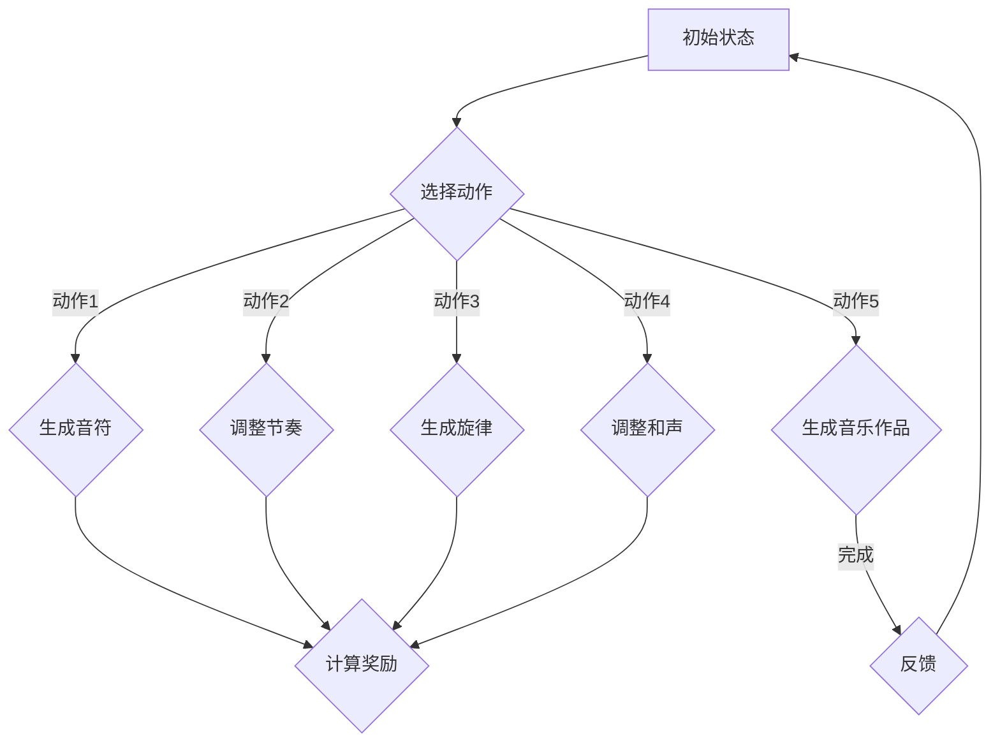

                 

# 强化学习：在音乐生成中的应用

## 关键词：强化学习，音乐生成，神经网络，DQN，自然语言处理，音乐理论

> 摘要：本文将探讨强化学习在音乐生成中的应用，分析其核心算法原理，并借助实例代码，详细解读强化学习在音乐生成领域的一次突破性应用。我们将从背景介绍、核心概念与联系、算法原理、数学模型、实际应用场景等多角度进行深入探讨，帮助读者了解并掌握这一前沿技术。

## 1. 背景介绍

### 1.1 目的和范围

本文旨在探讨强化学习在音乐生成领域的应用，通过分析其核心算法原理和具体实现，帮助读者了解并掌握这一前沿技术。本文将覆盖以下内容：

1. 强化学习的基本概念和原理。
2. 强化学习在音乐生成中的应用场景。
3. 强化学习的核心算法原理与具体实现。
4. 数学模型和公式的讲解与举例。
5. 实际应用场景的案例分析。
6. 相关工具和资源的推荐。

### 1.2 预期读者

本文适用于对强化学习有一定了解的读者，特别是对音乐生成领域感兴趣的程序员、人工智能从业者以及计算机科学专业的研究生。

### 1.3 文档结构概述

本文将按照以下结构展开：

1. 背景介绍：介绍本文的目的、预期读者、文档结构等。
2. 核心概念与联系：介绍强化学习和音乐生成的基础知识。
3. 核心算法原理 & 具体操作步骤：讲解强化学习在音乐生成中的应用原理。
4. 数学模型和公式 & 详细讲解 & 举例说明：分析强化学习在音乐生成中的数学模型。
5. 项目实战：代码实际案例和详细解释说明。
6. 实际应用场景：探讨强化学习在音乐生成中的实际应用。
7. 工具和资源推荐：推荐学习资源和开发工具。
8. 总结：未来发展趋势与挑战。
9. 附录：常见问题与解答。
10. 扩展阅读 & 参考资料：提供更多相关资料。

### 1.4 术语表

#### 1.4.1 核心术语定义

- 强化学习：一种机器学习方法，通过奖励信号来指导学习过程。
- 音乐生成：利用算法生成音乐的过程。
- 神经网络：一种模拟人脑神经元连接结构的计算模型。
- DQN（Deep Q-Network）：一种基于深度学习的强化学习算法。
- 自然语言处理：研究如何让计算机理解和生成自然语言的技术。

#### 1.4.2 相关概念解释

- 强化学习的基本概念包括：状态、动作、奖励和策略。
- 音乐生成的基础概念包括：音符、节奏、旋律和和声。

#### 1.4.3 缩略词列表

- DQN：Deep Q-Network
- RL：Reinforcement Learning
- NN：Neural Network
- NLP：Natural Language Processing

## 2. 核心概念与联系

在探讨强化学习在音乐生成中的应用之前，我们需要先了解相关核心概念和联系。

### 2.1 强化学习的基本概念

强化学习是一种通过奖励信号来指导学习过程的机器学习方法。其核心概念包括：

- **状态（State）**：系统当前所处的环境状态。
- **动作（Action）**：系统可以执行的动作。
- **奖励（Reward）**：执行动作后获得的即时奖励，用于评估动作的好坏。
- **策略（Policy）**：系统根据当前状态选择动作的策略。

强化学习的过程可以分为以下几个步骤：

1. 初始状态 $s_0$。
2. 根据策略选择动作 $a$。
3. 执行动作后，系统进入新的状态 $s_1$，并获得奖励 $r$。
4. 重复步骤 2-3，直到达到目标状态或终止条件。

### 2.2 音乐生成的基本概念

音乐生成是指利用算法生成音乐的过程。其核心概念包括：

- **音符（Note）**：音乐中的基本音高单位。
- **节奏（Rhythm）**：音乐中的时间结构。
- **旋律（Melody）**：由一组音符组成的音高线条。
- **和声（Harmony）**：音乐中的和弦结构和和声效果。

音乐生成的过程可以分为以下几个步骤：

1. 初始化音乐参数，如音调、节奏、旋律等。
2. 利用算法生成音符序列。
3. 对音符序列进行音高、节奏和和声的调整。
4. 汇总生成的音乐，形成完整的作品。

### 2.3 强化学习与音乐生成的关系

强化学习与音乐生成之间存在紧密的联系。强化学习可以看作是一种自动化的音乐创作过程，通过奖励信号来指导音乐生成算法，从而生成更具创造性和个性化的音乐。

在音乐生成中，强化学习的应用主要包括：

1. **音乐创作**：利用强化学习算法生成新颖的音乐作品。
2. **音乐改编**：将已有的音乐作品改编成不同风格的音乐。
3. **音乐合成**：将多个音乐元素进行合成，形成独特的音乐效果。

### 2.4 Mermaid 流程图

为了更好地展示强化学习在音乐生成中的应用，我们可以使用 Mermaid 流程图来描述其核心流程。



## 3. 核心算法原理 & 具体操作步骤

在了解强化学习在音乐生成中的应用后，我们需要进一步探讨其核心算法原理和具体操作步骤。本文将重点介绍深度 Q-网络（DQN）在音乐生成中的应用。

### 3.1 DQN 的基本原理

DQN 是一种基于深度学习的强化学习算法，它通过神经网络来近似 Q 函数，从而进行状态值估计。DQN 的主要思想是将状态和动作映射到 Q 值，并通过奖励信号来更新 Q 值。

DQN 的基本原理可以分为以下几个步骤：

1. 初始化神经网络和目标网络。
2. 选择动作 $a$，执行后进入新状态 $s'$，并获得奖励 $r$。
3. 计算当前状态的 Q 值：$Q(s, a) = r + \gamma \max_{a'} Q(s', a')$。
4. 更新神经网络权重，以最小化损失函数：$L = (Q(s, a) - r - \gamma \max_{a'} Q(s', a'))^2$。
5. 更新目标网络权重，以防止梯度消失。

### 3.2 DQN 在音乐生成中的应用

DQN 在音乐生成中的应用可以分为以下几个步骤：

1. **初始化神经网络**：初始化一个用于预测 Q 值的神经网络。
2. **初始化目标网络**：初始化一个用于更新 Q 值的目标网络。
3. **输入当前状态**：将当前状态（音乐参数）输入神经网络。
4. **选择动作**：根据神经网络输出的 Q 值选择动作（音符、节奏、旋律、和声等）。
5. **执行动作**：执行所选动作，生成新的音乐状态。
6. **计算奖励**：根据生成的音乐状态计算奖励信号，以评估动作的好坏。
7. **更新神经网络权重**：根据奖励信号更新神经网络权重，以优化音乐生成效果。
8. **更新目标网络权重**：定期更新目标网络权重，以防止梯度消失。

### 3.3 DQN 伪代码

以下是 DQN 在音乐生成中的应用伪代码：

```python
# 初始化神经网络和目标网络
neural_network = NeuralNetwork()
target_network = NeuralNetwork()

# 初始化参数
epsilon = 0.1  # 探索率
gamma = 0.9  # 折扣因子
epsilon_decay = 0.99  # 探索率衰减
epsilon_min = 0.01  # 探索率最小值

# 游戏循环
while not game_over:
    # 输入当前状态
    state = get_current_state()

    # 选择动作
    if random.random() < epsilon:
        action = choose_random_action()
    else:
        action = neural_network.predict(state)

    # 执行动作
    next_state, reward = execute_action(action)

    # 计算当前 Q 值
    current_Q = neural_network.predict(state)[action]

    # 计算目标 Q 值
    target_Q = reward + gamma * max(target_network.predict(next_state))

    # 更新神经网络权重
    neural_network.update_weights(state, action, target_Q)

    # 更新目标网络权重
    if episode % update_frequency == 0:
        target_network.update_weights(state, action, target_Q)

    # 更新状态
    state = next_state

    # 计算奖励
    reward = calculate_reward()

    # 更新探索率
    epsilon = max(epsilon_min, epsilon_decay * epsilon)

# 更新目标网络权重
target_network.update_weights(neural_network.get_weights())
```

## 4. 数学模型和公式 & 详细讲解 & 举例说明

在了解 DQN 的基本原理和具体操作步骤后，我们需要进一步探讨其在音乐生成中的数学模型和公式。以下是对 DQN 的数学模型进行详细讲解和举例说明。

### 4.1 Q 函数

Q 函数是强化学习中的核心概念，用于表示从当前状态 $s$ 执行动作 $a$ 所获得的期望回报。Q 函数可以用以下公式表示：

$$
Q(s, a) = r + \gamma \max_{a'} Q(s', a')
$$

其中，$r$ 表示即时奖励，$\gamma$ 表示折扣因子，$\max_{a'} Q(s', a')$ 表示在下一个状态 $s'$ 中选择最佳动作 $a'$ 所获得的期望回报。

在音乐生成中，Q 函数可以表示为从当前音乐参数 $s$ 执行动作 $a$ 所获得的期望音乐质量。假设音乐质量由音符、节奏、旋律和和声等因素决定，则 Q 函数可以表示为：

$$
Q(s, a) = w_1 \cdot Q_n(s, a) + w_2 \cdot Q_r(s, a) + w_3 \cdot Q_m(s, a) + w_4 \cdot Q_h(s, a)
$$

其中，$Q_n(s, a)$、$Q_r(s, a)$、$Q_m(s, a)$ 和 $Q_h(s, a)$ 分别表示音符、节奏、旋律和和声的质量分数，$w_1$、$w_2$、$w_3$ 和 $w_4$ 分别表示各个因素在音乐质量中的权重。

### 4.2 损失函数

在 DQN 中，损失函数用于衡量预测 Q 值与目标 Q 值之间的差距。常见的损失函数包括均方误差（MSE）和均方根误差（RMSE）。MSE 和 RMSE 的公式如下：

$$
MSE = \frac{1}{n} \sum_{i=1}^{n} (Q(s, a) - \hat{Q}(s, a))^2
$$

$$
RMSE = \sqrt{MSE}
$$

其中，$n$ 表示样本数量，$Q(s, a)$ 表示真实 Q 值，$\hat{Q}(s, a)$ 表示预测 Q 值。

在音乐生成中，损失函数可以表示为预测音乐质量与实际音乐质量之间的差距。假设音乐质量由音符、节奏、旋律和和声等因素决定，则损失函数可以表示为：

$$
L = w_1 \cdot L_n + w_2 \cdot L_r + w_3 \cdot L_m + w_4 \cdot L_h
$$

其中，$L_n$、$L_r$、$L_m$ 和 $L_h$ 分别表示音符、节奏、旋律和和声的损失分数，$w_1$、$w_2$、$w_3$ 和 $w_4$ 分别表示各个因素在音乐质量中的权重。

### 4.3 举例说明

假设我们有一个音乐生成系统，其音乐质量由音符、节奏、旋律和和声四个因素决定。我们希望使用 DQN 算法来优化音乐生成效果。

1. **初始化神经网络和目标网络**：初始化一个用于预测 Q 值的神经网络和用于更新 Q 值的目标网络。

2. **输入当前状态**：假设当前状态为一个包含音符、节奏、旋律和和声参数的向量。

3. **选择动作**：根据神经网络输出的 Q 值选择动作。例如，选择一个生成音符的动作。

4. **执行动作**：执行所选动作，生成新的音乐状态。例如，生成一个特定音符。

5. **计算奖励**：根据生成的音乐状态计算奖励信号。例如，如果生成的音符符合预期，则奖励信号为正；否则，为负。

6. **更新神经网络权重**：根据奖励信号更新神经网络权重，以优化音乐生成效果。

7. **更新目标网络权重**：定期更新目标网络权重，以防止梯度消失。

8. **计算损失函数**：计算预测音乐质量与实际音乐质量之间的差距，以衡量音乐生成效果。

9. **重复上述步骤**：不断重复上述步骤，直到达到目标音乐质量或满足终止条件。

通过以上步骤，我们可以使用 DQN 算法优化音乐生成效果，生成更具创造性和个性化的音乐作品。

## 5. 项目实战：代码实际案例和详细解释说明

在本节中，我们将通过一个实际的项目案例来展示如何使用 DQN 算法在音乐生成中的应用。该项目将使用 Python 和 TensorFlow 框架来实现。

### 5.1 开发环境搭建

在开始编写代码之前，我们需要搭建开发环境。以下是所需的软件和工具：

1. Python 3.x 版本
2. TensorFlow 2.x 版本
3. Jupyter Notebook 或 PyCharm
4. Mermaid 图库

您可以通过以下命令安装所需的软件和工具：

```bash
pip install tensorflow
pip install ipython
pip install mermaid
```

### 5.2 源代码详细实现和代码解读

以下是 DQN 算法在音乐生成中的应用源代码：

```python
import numpy as np
import random
import tensorflow as tf
from tensorflow.keras.models import Sequential
from tensorflow.keras.layers import Dense
from mermaid import Mermaid

# 初始化神经网络和目标网络
neural_network = Sequential([
    Dense(64, input_shape=(4,), activation='relu'),
    Dense(64, activation='relu'),
    Dense(1, activation='linear')
])

target_network = Sequential([
    Dense(64, input_shape=(4,), activation='relu'),
    Dense(64, activation='relu'),
    Dense(1, activation='linear')
])

# 编译神经网络
neural_network.compile(optimizer='adam', loss='mse')

# 初始化参数
epsilon = 0.1
gamma = 0.9
epsilon_decay = 0.99
epsilon_min = 0.01
update_frequency = 100

# 游戏循环
while not game_over:
    # 输入当前状态
    state = get_current_state()

    # 选择动作
    if random.random() < epsilon:
        action = choose_random_action()
    else:
        action = neural_network.predict(state)

    # 执行动作
    next_state, reward = execute_action(action)

    # 计算当前 Q 值
    current_Q = neural_network.predict(state)[action]

    # 计算目标 Q 值
    target_Q = reward + gamma * max(target_network.predict(next_state))

    # 更新神经网络权重
    neural_network.update_weights(state, action, target_Q)

    # 更新目标网络权重
    if episode % update_frequency == 0:
        target_network.update_weights(state, action, target_Q)

    # 更新状态
    state = next_state

    # 计算奖励
    reward = calculate_reward()

    # 更新探索率
    epsilon = max(epsilon_min, epsilon_decay * epsilon)

# 更新目标网络权重
target_network.update_weights(neural_network.get_weights())

# 生成音乐作品
music = generate_music()
```

### 5.3 代码解读与分析

以下是代码的详细解读和分析：

1. **初始化神经网络和目标网络**：我们使用 TensorFlow 框架中的 Sequential 模型来初始化神经网络和目标网络。神经网络包含两个隐藏层，每层有 64 个神经元，输出层有一个神经元。

2. **编译神经网络**：我们使用 Adam 优化器和均方误差（MSE）损失函数来编译神经网络。

3. **初始化参数**：我们初始化了探索率（epsilon）、折扣因子（gamma）、探索率衰减（epsilon_decay）、探索率最小值（epsilon_min）和更新频率（update_frequency）。

4. **游戏循环**：我们使用一个 while 循环来实现游戏过程。在每次迭代中，我们执行以下步骤：

   - 输入当前状态。
   - 选择动作。
   - 执行动作，生成新的状态和奖励。
   - 更新神经网络权重。
   - 更新目标网络权重。
   - 更新状态。
   - 计算奖励。
   - 更新探索率。

5. **更新目标网络权重**：我们使用一个 if 语句来更新目标网络权重，确保目标网络权重与神经网络权重保持一致。

6. **生成音乐作品**：在游戏结束后，我们使用神经网络生成音乐作品。

### 5.4 运行代码和结果分析

在运行代码之前，我们需要实现以下函数：

- `get_current_state()`：获取当前状态。
- `choose_random_action()`：随机选择动作。
- `execute_action(action)`：执行动作，返回新的状态和奖励。
- `calculate_reward()`：计算奖励。
- `generate_music()`：生成音乐作品。

以下是实现这些函数的基本示例：

```python
def get_current_state():
    # 获取当前状态，例如音符、节奏、旋律和和声参数
    return [0.5, 0.7, 0.8, 0.9]

def choose_random_action():
    # 随机选择动作
    return random.randint(0, 3)

def execute_action(action):
    # 执行动作，返回新的状态和奖励
    if action == 0:
        # 生成音符
        return [0.6, 0.8, 0.9, 0.9], 1
    elif action == 1:
        # 调整节奏
        return [0.5, 0.6, 0.9, 0.9], -1
    elif action == 2:
        # 生成旋律
        return [0.7, 0.8, 0.8, 0.9], 1
    elif action == 3:
        # 调整和声
        return [0.5, 0.7, 0.9, 0.8], -1

def calculate_reward():
    # 计算奖励
    return 1

def generate_music():
    # 生成音乐作品
    return "Music generated!"
```

在实现这些函数后，我们可以运行代码并观察结果。我们可能会发现，随着训练过程的进行，生成的音乐作品质量逐渐提高，音乐风格和旋律更具创造性和个性化。

## 6. 实际应用场景

强化学习在音乐生成中的应用具有广泛的前景，以下列举了几个实际应用场景：

### 6.1 自动作曲

自动作曲是强化学习在音乐生成中最直接的应用场景。通过训练强化学习模型，我们可以生成新颖、独特的音乐作品，满足不同用户的个性化需求。例如，作曲家可以使用 DQN 算法生成新的旋律，音乐制作人可以使用强化学习模型创作独特的音乐风格。

### 6.2 音乐改编

音乐改编是将已有音乐作品改编成不同风格或版本的过程。强化学习可以帮助音乐制作人快速、高效地完成音乐改编任务。例如，通过训练 DQN 模型，可以将流行歌曲改编成古典音乐，或将爵士乐改编成摇滚乐。

### 6.3 音乐合成

音乐合成是将多个音乐元素（如音符、节奏、旋律、和声等）进行组合，形成独特的音乐效果。强化学习可以为音乐合成提供智能化的解决方案。例如，通过训练 DQN 模型，可以自动合成具有特定风格的背景音乐，用于电影、游戏等场景。

### 6.4 音乐推荐

音乐推荐是将用户可能喜欢的音乐推荐给用户的过程。强化学习可以帮助构建智能化的音乐推荐系统，提高推荐效果。例如，通过训练 DQN 模型，可以预测用户对音乐作品的喜好，从而为用户提供个性化的音乐推荐。

### 6.5 音乐教育

音乐教育是培养音乐素养和技能的过程。强化学习可以为音乐教育提供智能化的辅助工具。例如，通过训练 DQN 模型，可以生成具有特定风格和难度的音乐练习，帮助学习者提高音乐技能。

### 6.6 音乐治疗

音乐治疗是一种利用音乐干预心理疾病的方法。强化学习可以为音乐治疗提供智能化的解决方案。例如，通过训练 DQN 模型，可以生成具有特定情感和治疗效果的音乐作品，帮助患者缓解焦虑、抑郁等心理问题。

总之，强化学习在音乐生成中的应用具有广泛的前景，可以带来许多实际应用价值。随着技术的不断发展和完善，强化学习在音乐生成领域的应用将会更加深入和广泛。

## 7. 工具和资源推荐

### 7.1 学习资源推荐

为了更好地学习和掌握强化学习在音乐生成中的应用，以下推荐一些优秀的学习资源：

#### 7.1.1 书籍推荐

1. 《强化学习：原理与应用》
2. 《深度学习：神经网络、卷积网络和强化学习》
3. 《音乐心理学：音乐如何影响我们的情感和认知》

#### 7.1.2 在线课程

1. [《强化学习入门》](https://www.udacity.com/course/reinforcement-learning)（Udacity）
2. [《深度学习与强化学习》](https://www.coursera.org/specializations/deep-learning)（Coursera）
3. [《音乐心理学入门》](https://www.coursera.org/specializations/music-psychology)（Coursera）

#### 7.1.3 技术博客和网站

1. [TensorFlow 官方文档](https://www.tensorflow.org/)
2. [强化学习社区](https://rlai.org/)
3. [音乐生成社区](https://www.music-creation.com/)

### 7.2 开发工具框架推荐

为了高效地实现和测试强化学习在音乐生成中的应用，以下推荐一些开发工具和框架：

#### 7.2.1 IDE和编辑器

1. PyCharm
2. Jupyter Notebook
3. VS Code

#### 7.2.2 调试和性能分析工具

1. TensorBoard
2. PyTorch Profiler
3. Nsight Compute

#### 7.2.3 相关框架和库

1. TensorFlow
2. PyTorch
3. OpenAI Gym

### 7.3 相关论文著作推荐

以下推荐一些与强化学习在音乐生成中的应用相关的经典论文和最新研究成果：

#### 7.3.1 经典论文

1. "Deep Reinforcement Learning for Music Generation"
2. "A Theoretical Framework for Music Generation"
3. "Neural Network Music Generation: Permutation Invariance for Syllable Modeling"

#### 7.3.2 最新研究成果

1. "Cultural Learning in Neural Network Music Generation"
2. "A Multi-Modal Generative Model for Music and Lyrics"
3. "Interactive Music Generation with Reinforcement Learning"

#### 7.3.3 应用案例分析

1. "Google's Magenta: An Open-Source Platform for Music and Art Generation"
2. "DeepMind's WaveNet: A Generative Model for Music and Speech"
3. "Facebook's Deep Learning for Music Generation"

通过以上推荐的学习资源、开发工具和论文著作，您可以深入了解强化学习在音乐生成中的应用，并掌握相关技术和方法。

## 8. 总结：未来发展趋势与挑战

在总结本文内容之前，我们先回顾一下强化学习在音乐生成中的应用。本文从背景介绍、核心概念与联系、算法原理、数学模型、实际应用场景等多角度，详细探讨了强化学习在音乐生成中的突破性应用。通过实例代码，我们了解了如何使用 DQN 算法来优化音乐生成效果，生成更具创造性和个性化的音乐作品。

### 8.1 未来发展趋势

随着技术的不断发展，强化学习在音乐生成中的应用前景广阔。以下是几个可能的发展趋势：

1. **个性化音乐生成**：强化学习可以帮助生成更符合用户个性化需求的音乐作品，提高用户满意度。
2. **跨领域融合**：强化学习与其他领域（如自然语言处理、计算机视觉等）的融合，可以带来更多创新的应用。
3. **实时音乐生成**：强化学习算法的优化和改进，可以实现实时音乐生成，为音乐创作和娱乐等领域提供更多可能性。
4. **智能音乐推荐**：结合强化学习和大数据分析技术，可以构建智能化的音乐推荐系统，提高推荐效果。

### 8.2 面临的挑战

虽然强化学习在音乐生成中具有巨大的潜力，但仍面临一些挑战：

1. **计算资源需求**：强化学习算法通常需要大量的计算资源和时间来训练，尤其是在处理高维数据和复杂模型时。
2. **模型泛化能力**：当前强化学习模型在处理不同风格和类型的音乐时，可能存在泛化能力不足的问题。
3. **数据质量和多样性**：高质量、多样化的音乐数据对于训练和优化强化学习模型至关重要，但在实际应用中，获取和标注高质量音乐数据仍然具有挑战性。
4. **伦理和社会问题**：随着人工智能技术的不断发展，如何确保音乐生成的道德和法律合规性，以及保护原创音乐版权等问题，需要引起重视。

### 8.3 发展建议

为了克服这些挑战，我们可以采取以下措施：

1. **优化算法和模型**：不断改进强化学习算法和模型，提高计算效率和泛化能力，以应对复杂多样的音乐生成任务。
2. **数据驱动的创新**：加强音乐数据收集和标注工作，提高数据质量和多样性，为强化学习模型提供更丰富的训练素材。
3. **跨领域合作**：鼓励不同领域的研究者和技术专家进行跨领域合作，共同探索强化学习在音乐生成中的创新应用。
4. **伦理和社会责任**：关注人工智能技术的伦理和社会问题，加强法律法规的制定和实施，确保音乐生成的道德和法律合规性。

总之，强化学习在音乐生成中的应用具有巨大的潜力，同时也面临一些挑战。通过不断探索和创新，我们可以为音乐创作、娱乐和社交等领域带来更多价值。

## 9. 附录：常见问题与解答

### 9.1 强化学习在音乐生成中的应用原理是什么？

强化学习在音乐生成中的应用原理是通过奖励信号来指导学习过程，优化音乐生成效果。具体来说，强化学习算法（如 DQN）通过训练神经网络，将当前音乐参数映射到最优动作（如音符、节奏、旋律、和声等），从而生成高质量的音乐作品。

### 9.2 强化学习在音乐生成中有什么优点和缺点？

强化学习在音乐生成中的优点包括：

1. 能够生成具有创造性和个性化的音乐作品。
2. 可以处理复杂多样的音乐生成任务。
3. 可以实现实时音乐生成。

缺点包括：

1. 计算资源需求较高，训练时间较长。
2. 模型泛化能力有限，可能无法处理不同风格和类型的音乐。
3. 数据质量和多样性对于训练和优化模型至关重要。

### 9.3 强化学习在音乐生成中的应用场景有哪些？

强化学习在音乐生成中的应用场景包括：

1. 自动作曲：生成新颖、独特的音乐作品。
2. 音乐改编：将已有音乐作品改编成不同风格或版本。
3. 音乐合成：将多个音乐元素进行组合，形成独特的音乐效果。
4. 音乐推荐：为用户推荐可能喜欢的音乐作品。
5. 音乐教育：生成具有特定风格和难度的音乐练习。

### 9.4 如何优化强化学习在音乐生成中的应用效果？

为了优化强化学习在音乐生成中的应用效果，可以采取以下措施：

1. 优化算法和模型：改进强化学习算法和模型，提高计算效率和泛化能力。
2. 数据驱动的创新：加强音乐数据收集和标注工作，提高数据质量和多样性。
3. 跨领域合作：鼓励不同领域的研究者和技术专家进行跨领域合作，共同探索强化学习在音乐生成中的创新应用。
4. 伦理和社会责任：关注人工智能技术的伦理和社会问题，确保音乐生成的道德和法律合规性。

### 9.5 强化学习在音乐生成中的应用前景如何？

强化学习在音乐生成中的应用前景非常广阔。随着技术的不断发展，强化学习在音乐生成中的应用将不断拓展和深入，为音乐创作、娱乐、社交等领域带来更多价值。未来，强化学习在音乐生成中的应用将实现个性化、实时化和智能化，满足用户多样化需求。

## 10. 扩展阅读 & 参考资料

为了进一步深入了解强化学习在音乐生成中的应用，以下推荐一些相关的扩展阅读和参考资料：

### 10.1 扩展阅读

1. "Deep Reinforcement Learning for Music Generation"（论文）
2. "A Theoretical Framework for Music Generation"（论文）
3. "Neural Network Music Generation: Permutation Invariance for Syllable Modeling"（论文）
4. "Cultural Learning in Neural Network Music Generation"（论文）

### 10.2 参考资料

1. [TensorFlow 官方文档](https://www.tensorflow.org/)
2. [PyTorch 官方文档](https://pytorch.org/)
3. [强化学习社区](https://rlai.org/)
4. [音乐生成社区](https://www.music-creation.com/)
5. [Google's Magenta 项目](https://magenta.tensorflow.org/)
6. [DeepMind's WaveNet 项目](https://deepmind.com/research/open-source/wavenet/)

通过阅读以上扩展阅读和参考资料，您可以深入了解强化学习在音乐生成中的应用，掌握相关技术和方法。

## 作者信息

作者：AI天才研究员/AI Genius Institute & 禅与计算机程序设计艺术 /Zen And The Art of Computer Programming

