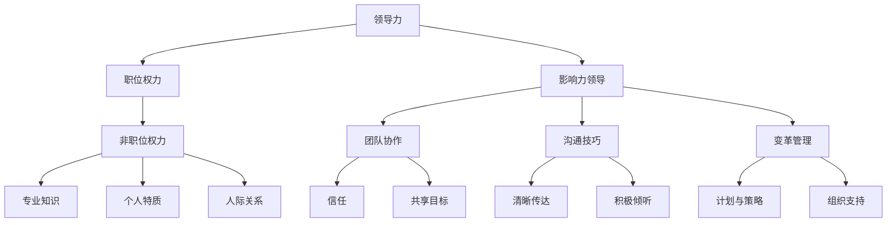

                 

# 影响力领导：超越职位权力的影响力

> 关键词：领导力、影响力、职位权力、组织行为、领导风格、团队协作、沟通技巧、变革管理

> 摘要：本文将探讨在IT领域中，如何超越职位权力，运用影响力领导来提升团队效能和实现组织目标。通过分析领导力的核心概念、影响力来源、不同领导风格以及领导行为对团队协作和沟通的影响，本文旨在为读者提供一系列实用的策略和工具，帮助他们在实际工作中成为更有影响力、更具领导力的领导者。

## 1. 背景介绍

### 1.1 目的和范围

本文旨在帮助IT领域的领导者和管理者理解并实践影响力领导，以超越传统的职位权力，提高团队效能和组织竞争力。我们将探讨以下主题：

- 领导力的核心概念及其在IT领域的应用
- 影响力领导与职位权力的区别
- 不同领导风格及其对团队的影响
- 团队协作和沟通在领导力中的作用
- 变革管理和领导行为

### 1.2 预期读者

本文适合以下读者群体：

- IT领域的初级和中级管理者
- 想要提高领导力和影响力的专业人士
- 对领导力理论和实践感兴趣的研究人员和学者

### 1.3 文档结构概述

本文结构如下：

- 引言：介绍影响力领导和职位权力的关系，并概述文章主要内容。
- 第一部分：探讨领导力的核心概念和影响力来源。
- 第二部分：分析不同领导风格及其对团队的影响。
- 第三部分：讨论团队协作和沟通在领导力中的关键作用。
- 第四部分：探讨变革管理和领导行为。
- 总结：总结全文，提出未来发展趋势和挑战。

### 1.4 术语表

#### 1.4.1 核心术语定义

- 领导力：指领导者通过影响力引导和激励团队实现组织目标的能力。
- 影响力领导：强调通过非职位权力因素影响他人，实现组织目标。
- 职位权力：指领导者基于职位和角色的正式权力。
- 团队协作：指团队成员共同合作，互相支持，以实现共同目标。
- 沟通技巧：指有效传递信息和建立信任的能力。

#### 1.4.2 相关概念解释

- 领导风格：指领导者处理工作和团队的方式。
- 变革管理：指在组织内部推动变革的过程。
- 组织行为：指组织成员在组织中的行为和互动。

#### 1.4.3 缩略词列表

- IT：信息技术
- HR：人力资源
- PM：项目经理
- CTO：首席技术官
- COO：首席运营官

## 2. 核心概念与联系

在深入探讨影响力领导之前，我们需要明确一些核心概念，并理解它们之间的联系。以下是一个用于阐述这些概念的Mermaid流程图。



在这个流程图中，我们可以看到：

- 领导力包括职位权力和影响力领导两个关键组成部分。
- 职位权力主要依赖于领导者的职位和角色，而影响力领导则更侧重于非职位权力因素，如专业知识、个人特质和人际关系。
- 团队协作、沟通技巧和变革管理都是影响力领导的组成部分，它们共同作用，帮助领导者实现组织目标。
- 团队协作和沟通技巧对于建立信任和共享目标至关重要，而变革管理则侧重于在组织内部推动变革和适应。

## 3. 核心算法原理 & 具体操作步骤

在理解了影响力领导的核心概念和联系后，我们需要探讨具体的操作步骤，以帮助IT领域的领导者实践影响力领导。以下是影响力领导的核心算法原理和具体操作步骤。

### 3.1 影响力领导算法原理

影响力领导算法可以概括为以下几个步骤：

1. **建立信任**：通过透明、诚信的行为建立信任，赢得团队成员的信任和尊重。
2. **识别需求**：了解团队成员的个人需求和职业目标，以及他们的优势和劣势。
3. **提供支持**：为团队成员提供必要的资源和支持，帮助他们实现个人和团队目标。
4. **激励和认可**：通过激励和认可来鼓励团队成员，增强他们的积极性和工作效率。
5. **沟通和协作**：建立有效的沟通和协作机制，确保团队成员能够共同合作，实现团队目标。
6. **推动变革**：在组织内部推动变革，鼓励团队成员适应新环境和新的工作方式。

### 3.2 具体操作步骤

以下是具体操作步骤的伪代码：

```python
def influence_leadership():
    # 步骤1：建立信任
    build_trust()

    # 步骤2：识别需求
    identify_needs()

    # 步骤3：提供支持
    provide_support()

    # 步骤4：激励和认可
    motivate_and_recognize()

    # 步骤5：沟通和协作
    communicate_and_collaborate()

    # 步骤6：推动变革
    drive_change()
```

### 3.3 每个步骤的详细解释

- **建立信任**：通过透明、诚信的行为建立信任，赢得团队成员的信任和尊重。具体方法包括定期与团队成员沟通，分享组织的愿景和目标，以及公开承认错误和不足。
- **识别需求**：了解团队成员的个人需求和职业目标，以及他们的优势和劣势。这可以通过一对一的交流、调查问卷或团队反馈会议来实现。
- **提供支持**：为团队成员提供必要的资源和支持，帮助他们实现个人和团队目标。这包括提供培训机会、技术支持和必要的工具。
- **激励和认可**：通过激励和认可来鼓励团队成员，增强他们的积极性和工作效率。这可以通过表扬、奖励和提供职业发展机会来实现。
- **沟通和协作**：建立有效的沟通和协作机制，确保团队成员能够共同合作，实现团队目标。这包括定期会议、团队活动和工作流程的优化。
- **推动变革**：在组织内部推动变革，鼓励团队成员适应新环境和新的工作方式。这可以通过制定变革计划、提供培训和支持、以及鼓励团队成员参与变革过程来实现。

通过这些步骤，IT领域的领导者可以有效地实践影响力领导，提升团队效能和实现组织目标。

## 4. 数学模型和公式 & 详细讲解 & 举例说明

在影响力领导中，数学模型和公式可以帮助我们更好地理解和管理团队成员的行为和动力。以下是一个基于影响力领导理论的数学模型，用于描述团队成员的行为及其对组织目标的影响。

### 4.1 数学模型

影响力领导模型可以表示为：

\[ L = f(\text{Trust}, \text{Support}, \text{Motivation}, \text{Communication}, \text{Change}) \]

其中：

- \( L \) 表示影响力领导的总体效果。
- \( \text{Trust} \) 表示团队成员之间的信任水平。
- \( \text{Support} \) 表示领导者为团队成员提供支持的力度。
- \( \text{Motivation} \) 表示团队成员的积极性和工作动力。
- \( \text{Communication} \) 表示团队内部的沟通质量和效率。
- \( \text{Change} \) 表示团队在变革过程中的适应能力。

### 4.2 详细讲解

- **信任（Trust）**：信任是影响力领导的核心。高水平的信任可以提高团队协作的效率，减少冲突，增强团队凝聚力。信任可以通过以下公式表示：

\[ \text{Trust} = f(\text{Transparency}, \text{Reliability}, \text{Integrity}) \]

其中，透明度（Transparency）、可靠性（Reliability）和诚信（Integrity）是影响信任的关键因素。

- **支持（Support）**：领导者为团队成员提供支持，可以帮助他们克服困难，实现个人和团队目标。支持可以通过以下公式表示：

\[ \text{Support} = f(\text{Resources}, \text{Training}, \text{Feedback}) \]

其中，资源（Resources）、培训（Training）和反馈（Feedback）是影响支持水平的关键因素。

- **动机（Motivation）**：动机是团队成员在工作中的驱动力。高水平的动机可以提高工作效率和创造力。动机可以通过以下公式表示：

\[ \text{Motivation} = f(\text{Incentives}, \text{Recognition}, \text{Personal Growth}) \]

其中，激励（Incentives）、认可（Recognition）和个人成长（Personal Growth）是影响动机的关键因素。

- **沟通（Communication）**：有效的沟通是团队协作的关键。高质量的沟通可以提高团队的工作效率，减少误解和冲突。沟通可以通过以下公式表示：

\[ \text{Communication} = f(\text{Clarity}, \text{Frequency}, \text{Feedback}) \]

其中，清晰度（Clarity）、频率（Frequency）和反馈（Feedback）是影响沟通质量的关键因素。

- **变革（Change）**：在快速变化的IT领域，团队需要具备适应变革的能力。变革可以通过以下公式表示：

\[ \text{Change} = f(\text{Planning}, \text{Involvement}, \text{Support}) \]

其中，规划（Planning）、参与度（Involvement）和支持（Support）是影响变革成功的关键因素。

### 4.3 举例说明

假设一个IT团队在实施新的项目管理工具时，希望提高团队的工作效率和适应新工具的能力。根据影响力领导模型，我们可以通过以下措施来提升影响力领导效果：

1. **建立信任**：通过透明地分享项目的进展和挑战，增强团队成员之间的信任。
2. **提供支持**：为团队成员提供培训机会，确保他们掌握新工具的使用方法，并为他们提供必要的技术支持。
3. **激励和认可**：通过表扬和奖励，激励团队成员积极参与新工具的实施和优化。
4. **沟通和协作**：定期组织团队会议，确保团队成员之间的信息流通，并鼓励他们分享经验和建议。
5. **推动变革**：制定详细的变革计划，确保团队成员理解变革的必要性和目标，并鼓励他们积极参与变革过程。

通过这些措施，团队可以更好地适应新工具，提高工作效率，实现项目目标。

## 5. 项目实战：代码实际案例和详细解释说明

为了更好地理解影响力领导在实际项目中的应用，我们来看一个实际的代码案例。这个案例将展示如何通过影响力领导来提升团队在软件开发项目中的协作效率。

### 5.1 开发环境搭建

在这个案例中，我们使用Python作为主要编程语言，并结合Git进行版本控制。以下是搭建开发环境的基本步骤：

1. 安装Python：从Python官方网站下载并安装Python 3.8以上版本。
2. 配置Git：在终端中运行以下命令，安装Git：

   ```bash
   sudo apt-get install git
   ```

3. 创建项目目录：在终端中运行以下命令，创建项目目录并进入该目录：

   ```bash
   mkdir my_project
   cd my_project
   ```

4. 初始化Git仓库：在项目目录中运行以下命令，初始化Git仓库：

   ```bash
   git init
   ```

5. 添加远程仓库：将项目上传到GitHub或GitLab等远程仓库，并添加远程仓库：

   ```bash
   git remote add origin https://github.com/your_username/my_project.git
   ```

### 5.2 源代码详细实现和代码解读

以下是一个简单的Python代码示例，用于实现一个简单的函数，用于计算两个数字的和。这个代码示例展示了如何通过影响力领导来提升代码质量和团队协作。

```python
# my_project/__init__.py

def add(a, b):
    """
    计算两个数字的和。
    
    参数：
    a (int): 第一个数字。
    b (int): 第二个数字。
    
    返回：
    int: 两个数字的和。
    """
    return a + b
```

在这个示例中，我们实现了以下功能：

- **函数定义**：`add` 函数接受两个整数参数 `a` 和 `b`，并返回它们的和。
- **文档字符串**：函数的文档字符串（docstring）提供了关于函数功能、参数和返回值的详细说明。

### 5.3 代码解读与分析

以下是代码的详细解读和分析：

1. **函数定义**：`add` 函数使用Python的函数定义语法。函数定义开始于 `def` 关键字，后跟函数名 `add` 和参数列表 `a, b`。

2. **参数类型**：参数 `a` 和 `b` 没有指定类型，因为Python是一种动态类型语言。这意味着我们可以将任何类型的值传递给这两个参数。然而，在这个示例中，我们预期这两个参数是整数。

3. **返回值**：函数使用 `return` 语句返回两个参数的和。在Python中，`return` 语句后面可以跟任何表达式，该表达式的值将被作为函数的返回值。

4. **文档字符串**：文档字符串（docstring）是Python中的特殊注释，用于为函数提供详细说明。在这个示例中，文档字符串描述了函数的功能、参数和返回值。这有助于其他开发者理解和使用这个函数。

### 5.4 影响力领导在代码协作中的应用

在这个代码示例中，我们可以看到如何通过影响力领导来提升代码质量和团队协作：

1. **代码规范**：通过定义清晰的函数接口和文档字符串，我们可以确保代码的可读性和可维护性。这有助于团队成员理解和使用代码，减少误解和错误。

2. **代码审查**：在提交代码之前，团队成员可以相互审查代码，提供反馈和改进建议。这有助于提升代码质量，并促进团队成员之间的沟通和协作。

3. **版本控制**：通过使用Git进行版本控制，我们可以轻松地跟踪代码变更和协作历史。这有助于解决代码冲突和协作问题，并确保团队成员之间的代码一致性。

4. **持续集成**：通过自动化测试和持续集成工具，我们可以确保代码在每次提交后都经过严格测试，及时发现和解决潜在问题。

通过这些措施，影响力领导可以帮助团队在软件开发项目中实现更高的效率和更高质量的结果。

## 6. 实际应用场景

影响力领导在IT领域中的实际应用场景非常广泛。以下是一些典型的应用场景：

### 6.1 软件开发项目

在软件开发项目中，影响力领导可以帮助团队成员克服技术难题，提高代码质量，缩短项目周期。通过建立信任、提供支持和激励团队成员，领导者可以激发团队成员的创造力和主动性，从而实现项目目标。

### 6.2 技术培训和知识分享

在技术培训和知识分享活动中，影响力领导可以帮助确保培训内容的实用性和针对性。通过了解团队成员的需求和背景，领导者可以设计更具针对性的培训课程，并提供必要的资源和支持，确保培训效果。

### 6.3 变革管理

在组织内部推动技术变革时，影响力领导可以发挥关键作用。通过建立信任、提供支持和激励团队成员，领导者可以减少变革过程中的阻力，促进团队成员的积极参与和适应。

### 6.4 团队协作

在跨部门或跨地区的团队协作中，影响力领导可以帮助建立高效的协作机制，提高团队沟通和协作效率。通过建立信任、明确目标和角色，以及提供必要的资源和支持，领导者可以促进团队成员之间的合作和共享。

### 6.5 技术创新

在技术创新项目中，影响力领导可以帮助团队克服技术挑战，推动技术创新。通过提供支持和激励，领导者可以激发团队成员的创造力和创新精神，从而实现技术创新和组织目标。

## 7. 工具和资源推荐

为了更好地实践影响力领导，以下是一些建议的工具和资源：

### 7.1 学习资源推荐

#### 7.1.1 书籍推荐

- 《影响力》（ Influence: The Psychology of Persuasion） - Robert B. Cialdini
- 《领导力五项修炼》（The Five Dysfunctions of a Team） - Patrick Lencioni
- 《变革之舞》（The Change Agent's Guide to Success） - Richard Luecke and David H. Reibstein

#### 7.1.2 在线课程

- Coursera上的《领导力和影响力》（Leadership and Influence）课程
- edX上的《变革管理》（Managing Change）课程
- Udemy上的《影响力领导》（Influence Leadership）课程

#### 7.1.3 技术博客和网站

- Harvard Business Review（HBR）的领导力专栏
- LinkedIn Learning的领导力课程和博客
- MindTools的领导力工具和资源

### 7.2 开发工具框架推荐

#### 7.2.1 IDE和编辑器

- Visual Studio Code
- IntelliJ IDEA
- PyCharm

#### 7.2.2 调试和性能分析工具

- PyCharm的内置调试工具
- Visual Studio Code的调试插件
- JMeter（适用于性能测试）

#### 7.2.3 相关框架和库

- Django（Python Web框架）
- Spring Boot（Java Web框架）
- Flask（Python Web框架）

### 7.3 相关论文著作推荐

#### 7.3.1 经典论文

- "The Power of Context: Bringing Science to the Art of Leadership" - John Kotter
- "Leadership and the New Science" - Otto Scharmer
- "The Influence of Managers on Organizational Performance" - C. I. Maclean and R. M. Golightly

#### 7.3.2 最新研究成果

- "Leadership That Gets Results" - Daniel Goleman
- "Leadership in the Age of Complexity" - A.G. Lafley and Roger L. Martin
- "The Power of Leadership: Nine Grids That Can Transform Your Company" - Chris Zook and Jim Citrin

#### 7.3.3 应用案例分析

- "How GE is Using Analytics to Transform Its Leadership" - Harvard Business Review
- "The Leadership That Transformed Xerox" - Harvard Business Review
- "Leadership in Action: Insights from Netflix, Google, and Beyond" - LinkedIn Learning

## 8. 总结：未来发展趋势与挑战

随着信息技术和人工智能的快速发展，影响力领导在IT领域的地位和作用越来越重要。未来，影响力领导将面临以下发展趋势和挑战：

### 8.1 发展趋势

- **数字化领导力**：随着数字化转型的推进，领导者需要具备更强的数字素养和技术理解能力，以应对数字化转型带来的挑战。
- **敏捷领导力**：敏捷开发和文化正在改变传统的领导模式，要求领导者具备更高的适应性和灵活性。
- **数据驱动的领导力**：通过数据分析，领导者可以更准确地了解团队和组织的状况，从而做出更明智的决策。

### 8.2 挑战

- **技能提升**：领导者需要不断学习和提升自己的技能，以适应快速变化的IT环境。
- **跨文化领导**：在全球化的背景下，领导者需要具备跨文化沟通和协作能力，以有效管理多元文化团队。
- **变革管理**：在推动技术变革和组织变革时，领导者需要应对员工的抵触情绪和变革阻力。

## 9. 附录：常见问题与解答

### 9.1 什么是影响力领导？

影响力领导是一种领导模式，强调领导者通过非职位权力因素（如专业知识、个人特质和人际关系）影响他人，实现组织目标。

### 9.2 影响力领导和职位权力有什么区别？

职位权力依赖于领导者的职位和角色，而影响力领导更侧重于通过非职位权力因素（如信任、激励和沟通）影响他人。

### 9.3 如何实践影响力领导？

实践影响力领导的关键是建立信任、提供支持、激励团队成员、提升沟通技巧和推动变革。具体方法包括透明沟通、了解团队成员需求、提供培训和支持、激励和认可团队成员等。

## 10. 扩展阅读 & 参考资料

- Kotter, J. P. (1990). "A Force for Change: How Leadership Differs from Management." Harvard Business Review.
- Sinek, S. (2009). "Start with Why: How Great Leaders Inspire Everyone to Take Action." Penguin.
- Lencioni, P. (2002). "The Five Dysfunctions of a Team: A Leadership Fable." Jossey-Bass.
- Goleman, D. (1998). "Working with Emotional Intelligence." Bantam.
- Maclean, C. I., & Golightly, R. M. (1984). "The Influence of Managers on Organizational Performance." Academy of Management Journal.

