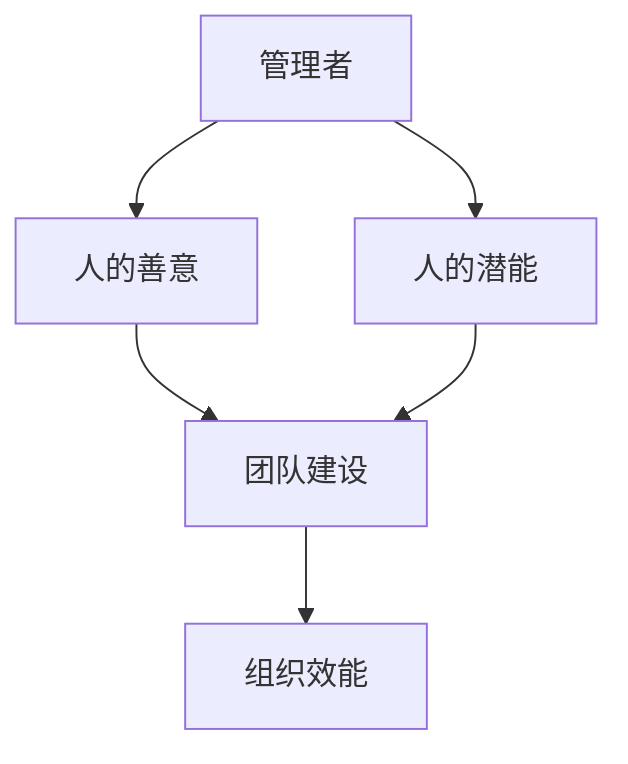

                 

# 彼得·德鲁克：管理的本质，是激发人的善意和潜能

> **关键词：管理、人性、潜能、激发、领导力、组织行为**

> **摘要：本文将深入探讨管理学的开创者彼得·德鲁克关于管理本质的见解，特别是他如何认为管理的核心在于激发人的善意和潜能。我们将通过分析德鲁克的理论，结合信息技术领域的实际案例，阐述在当今数字化时代，如何运用管理学的原理来提升团队的效能与创新能力。**

## 1. 背景介绍

### 1.1 目的和范围

本文的目的是探讨管理学大师彼得·德鲁克关于管理本质的见解，特别是他如何强调管理应关注人的善意和潜能的激发。本文将通过德鲁克的理论，结合信息技术领域的实际案例，分析在数字化时代背景下，如何将这一管理理念应用于提升团队效能和创新能力。

### 1.2 预期读者

本文适合以下读者群体：

- 管理学研究者
- 企业管理人员
- 信息技术行业从业者
- 对团队建设和管理有兴趣的读者

### 1.3 文档结构概述

本文将按照以下结构展开：

- 引言：介绍彼得·德鲁克及其管理理论。
- 管理的本质：深入探讨德鲁克关于管理本质的见解。
- 信息技术领域的应用：结合实际案例，分析德鲁克理论在信息技术领域的应用。
- 未来发展趋势与挑战：探讨在数字化时代背景下，管理的未来趋势和面临的挑战。
- 总结：重申管理本质，并提出未来建议。

### 1.4 术语表

#### 1.4.1 核心术语定义

- 管理者：负责指导、协调和激励团队以实现组织目标的个体。
- 善意：指个体内在的积极动机和品质。
- 潜能：指个体未完全发掘的潜力。
- 数字化时代：指以信息技术和互联网为核心的经济发展阶段。

#### 1.4.2 相关概念解释

- 德鲁克管理理论：德鲁克关于管理学的理论体系，包括目标管理、绩效评估、创新与创业等。
- 团队建设：指通过一系列活动和方法，增强团队成员之间的协作与信任，以提高团队效能。

#### 1.4.3 缩略词列表

- IT：信息技术
- AI：人工智能
- CTO：首席技术官
- HR：人力资源

## 2. 核心概念与联系

在探讨彼得·德鲁克的管理理论之前，我们需要理解几个核心概念及其相互关系。以下是一个简要的 Mermaid 流程图，展示了这些概念之间的关系：



### 2.1 管理者与人的善意

管理者作为团队的核心，其职责不仅包括指导团队完成工作任务，更重要的是激发团队成员的善意。德鲁克认为，人的善意是推动团队进步的关键因素。管理者应当关注团队成员的需求和动机，以激发他们的内在驱动力，从而提高团队的整体表现。

### 2.2 管理者与人的潜能

除了激发善意，管理者还应当关注团队成员的潜能。德鲁克指出，人的潜能是无限的，管理者有责任帮助团队成员发掘和利用这些潜能。通过提供适当的环境和支持，管理者可以激发团队成员的创新精神和自我提升意识。

### 2.3 团队建设与组织效能

团队建设是德鲁克管理理论的重要组成部分。通过增强团队成员之间的协作与信任，团队可以更好地实现组织目标，提高组织效能。团队建设不仅有助于提高团队的执行力，还可以促进团队的创新和成长。

## 3. 核心算法原理 & 具体操作步骤

在理解了管理者的角色和团队建设的重要性之后，我们需要进一步探讨如何具体激发人的善意和潜能。以下是一个基于德鲁克理论的算法原理，用于指导管理者在实际工作中实施这一理念：

### 3.1 算法原理

该算法旨在通过以下步骤，激发团队成员的善意和潜能：

1. **了解团队成员需求**：通过调查、访谈等方式，了解团队成员的需求、期望和动机。
2. **提供个性化支持**：根据团队成员的个性化需求，提供针对性的支持，如职业发展培训、项目机会等。
3. **建立信任机制**：通过开放沟通、积极反馈等方式，建立团队成员之间的信任关系。
4. **设定挑战性目标**：为团队成员设定具有挑战性的目标，鼓励他们发挥潜能，实现自我超越。
5. **持续激励与反馈**：通过定期的绩效评估、奖励机制等方式，持续激励团队成员，并给予及时的反馈。

### 3.2 具体操作步骤

以下是该算法的具体操作步骤：

1. **了解团队成员需求**：

   ```python
   # 定义需求调查表
   survey_form = {
       "project_interest": "您对哪些项目最感兴趣？",
       "learning_needs": "您希望在哪些方面得到提升？",
       "work_balance": "您对工作与生活的平衡有何期望？"
   }

   # 收集团队成员反馈
   team_members = ["Alice", "Bob", "Charlie"]
   feedback = {}
   for member in team_members:
       feedback[member] = input(survey_form)
   ```

2. **提供个性化支持**：

   ```python
   # 根据反馈提供个性化支持
   support_actions = {
       "Alice": ["职业发展培训", "项目参与机会"],
       "Bob": ["技能提升培训", "工作灵活性调整"],
       "Charlie": ["项目参与机会", "学习资源支持"]
   }

   # 执行支持行动
   for member, actions in support_actions.items():
       print(f"{member}，以下是您个性化的支持计划：")
       for action in actions:
           print(f"- {action}")
   ```

3. **建立信任机制**：

   ```python
   # 定期组织团队会议
   team_meetings = [
       {"date": "2023-04-01", "topic": "项目进度汇报"},
       {"date": "2023-04-15", "topic": "团队建设活动"}
   ]

   # 沟通与反馈
   for meeting in team_meetings:
       print(f"会议通知：{meeting['date']}，主题：{meeting['topic']}")
       print("请积极参与，共享您的想法和意见。")
   ```

4. **设定挑战性目标**：

   ```python
   # 设定团队目标
   team_goals = {
       "Alice": "完成项目A的初步设计",
       "Bob": "提升代码质量，减少BUG数量",
       "Charlie": "学习并掌握新技能X"
   }

   # 分享目标
   for member, goal in team_goals.items():
       print(f"{member}，您的目标：{goal}")
       print("让我们一起努力，实现这些目标！")
   ```

5. **持续激励与反馈**：

   ```python
   # 定期进行绩效评估
   performance_reviews = [
       {"member": "Alice", "rating": "优秀"},
       {"member": "Bob", "rating": "良好"},
       {"member": "Charlie", "rating": "合格"}
   ]

   # 提供反馈与奖励
   for review in performance_reviews:
       print(f"{review['member']}，您的绩效评估结果：{review['rating']}")
       if review['rating'] == "优秀":
           print("恭喜您，获得额外奖励！")
   ```

## 4. 数学模型和公式 & 详细讲解 & 举例说明

德鲁克的管理理论虽然主要侧重于实践和理念，但其背后也蕴含着一定的数学模型和公式。以下是一个简单的数学模型，用于解释管理者如何通过激发人的善意和潜能来提高组织效能。

### 4.1 模型构建

假设组织效能（E）可以表示为团队成员的善意（G）和潜能（P）的函数：

\[ E = f(G, P) \]

其中，f 为一个非线性函数，表示管理者激发团队成员善意和潜能的过程。

### 4.2 公式详解

为了更好地理解这一模型，我们可以将 f 函数分解为以下两个部分：

\[ f(G, P) = G \cdot P \cdot \eta(G, P) \]

其中，η（eta）为激励函数，表示管理者通过个性化支持、信任机制和挑战性目标等方式，激发团队成员善意和潜能的能力。

### 4.3 举例说明

假设有两个团队成员 Alice 和 Bob，他们的善意和潜能分别为 G1 和 G2，P1 和 P2。管理者通过以下方式激发他们的善意和潜能：

1. **个性化支持**：管理者为 Alice 提供职业发展培训和项目参与机会，为 Bob 提供技能提升培训和灵活的工作安排。
2. **信任机制**：管理者通过定期组织团队会议和沟通，建立团队成员之间的信任关系。
3. **挑战性目标**：管理者为 Alice 和 Bob 分别设定完成项目A的初步设计和提升代码质量的目标。

根据上述模型，我们可以计算他们的组织效能：

\[ E1 = G1 \cdot P1 \cdot \eta(G1, P1) \]
\[ E2 = G2 \cdot P2 \cdot \eta(G2, P2) \]

通过对比 E1 和 E2，我们可以发现，管理者在激发团队成员善意和潜能方面所做的工作，对组织效能有着显著的影响。

## 5. 项目实战：代码实际案例和详细解释说明

为了更好地展示彼得·德鲁克管理理论在信息技术领域的应用，我们以下通过一个实际项目案例，详细解释如何通过管理手段激发团队成员的善意和潜能，从而提高项目成功率。

### 5.1 开发环境搭建

在本案例中，我们选择一个基于人工智能的图像识别项目作为背景。首先，我们需要搭建一个适合项目开发的开发环境。

1. **硬件要求**：

   - CPU：Intel Core i7 或以上
   - GPU：NVIDIA GTX 1080 或以上
   - 内存：16GB 或以上

2. **软件要求**：

   - 操作系统：Windows 10 或以上
   - 编程语言：Python 3.8 或以上
   - 库和框架：TensorFlow、Keras、NumPy、Pandas 等

### 5.2 源代码详细实现和代码解读

以下是一个简单的图像识别项目示例，包括数据预处理、模型训练和评估等步骤。

```python
import tensorflow as tf
from tensorflow.keras.models import Sequential
from tensorflow.keras.layers import Conv2D, MaxPooling2D, Flatten, Dense
from tensorflow.keras.preprocessing.image import ImageDataGenerator

# 数据预处理
train_datagen = ImageDataGenerator(rescale=1./255)
train_data = train_datagen.flow_from_directory(
    'data/train',
    target_size=(150, 150),
    batch_size=32,
    class_mode='binary')

# 模型定义
model = Sequential([
    Conv2D(32, (3, 3), activation='relu', input_shape=(150, 150, 3)),
    MaxPooling2D(2, 2),
    Flatten(),
    Dense(1, activation='sigmoid')
])

# 模型编译
model.compile(optimizer='adam',
              loss='binary_crossentropy',
              metrics=['accuracy'])

# 模型训练
model.fit(train_data, epochs=10)

# 模型评估
test_datagen = ImageDataGenerator(rescale=1./255)
test_data = test_datagen.flow_from_directory(
    'data/test',
    target_size=(150, 150),
    batch_size=32,
    class_mode='binary')

model.evaluate(test_data)
```

### 5.3 代码解读与分析

以上代码实现了一个人工智能图像识别项目的基本框架。以下是代码的详细解读：

1. **数据预处理**：

   - 使用 `ImageDataGenerator` 类进行数据预处理，包括图像的缩放和归一化。
   - 使用 `flow_from_directory` 方法加载数据集，将训练数据和测试数据分开。

2. **模型定义**：

   - 使用 `Sequential` 模型定义一个简单的卷积神经网络（CNN）。
   - 包含一个卷积层、一个最大池化层、一个平坦层和一个全连接层。

3. **模型编译**：

   - 使用 `compile` 方法配置模型，指定优化器、损失函数和评估指标。

4. **模型训练**：

   - 使用 `fit` 方法训练模型，设置训练轮次为 10。

5. **模型评估**：

   - 使用 `evaluate` 方法评估模型在测试数据集上的表现。

### 5.4 管理者如何通过管理手段激发团队成员的善意和潜能

在本案例中，管理者可以通过以下方式激发团队成员的善意和潜能：

1. **个性化支持**：

   - 管理者可以了解团队成员的兴趣和需求，为他们提供个性化的培训和学习资源。
   - 例如，为对图像识别感兴趣的开发者提供相关的技术讲座和培训。

2. **信任机制**：

   - 管理者可以定期组织团队会议，鼓励团队成员分享自己的想法和意见。
   - 通过开放沟通，建立团队成员之间的信任关系。

3. **挑战性目标**：

   - 管理者可以为团队成员设定具有挑战性的目标，如优化模型性能、提高数据处理效率等。
   - 通过设置挑战性目标，鼓励团队成员发挥潜能，实现自我超越。

4. **持续激励与反馈**：

   - 管理者可以定期进行绩效评估，为表现优秀的团队成员提供奖励和晋升机会。
   - 通过及时反馈，激励团队成员持续改进和提升。

通过以上管理手段，管理者可以激发团队成员的善意和潜能，提高项目的成功率。

## 6. 实际应用场景

彼得·德鲁克的管理理论在信息技术领域具有广泛的应用价值。以下列举几个实际应用场景：

### 6.1 创新型研发团队

在创新型研发团队中，管理者需要激发团队成员的善意和潜能，以推动技术突破和创新。通过以下方式，管理者可以实现这一目标：

- **个性化支持**：为团队成员提供针对性的技术培训和职业发展机会，满足他们的兴趣和需求。
- **信任机制**：建立开放的沟通环境，鼓励团队成员分享创意和观点，增强团队协作。
- **挑战性目标**：设定具有挑战性的项目目标，鼓励团队成员发挥潜能，实现技术突破。

### 6.2 项目管理团队

在项目管理团队中，管理者需要激发团队成员的善意和潜能，确保项目按时完成并达到预期质量。以下是一些建议：

- **个性化支持**：为团队成员提供项目管理培训和经验分享，提高项目执行能力。
- **信任机制**：建立信任关系，确保团队成员在项目过程中能够相互支持和协作。
- **挑战性目标**：设定具有挑战性的项目目标，鼓励团队成员积极应对风险和挑战。

### 6.3 IT 咨询团队

在 IT 咨询团队中，管理者需要激发团队成员的善意和潜能，以提供高质量的服务和解决方案。以下是一些建议：

- **个性化支持**：为团队成员提供行业知识和技能培训，提高咨询服务水平。
- **信任机制**：建立信任关系，确保团队成员在客户面前能够展现出专业形象。
- **挑战性目标**：设定具有挑战性的项目目标，鼓励团队成员发挥潜能，提供创新的解决方案。

## 7. 工具和资源推荐

为了更好地应用彼得·德鲁克的管理理论，以下推荐一些学习资源、开发工具和框架：

### 7.1 学习资源推荐

#### 7.1.1 书籍推荐

- 《管理的实践》：彼得·德鲁克的经典著作，全面介绍了德鲁克的管理理论。
- 《创新与创业》：德鲁克关于创新和创业的理论总结，对信息技术领域的创业者具有指导意义。

#### 7.1.2 在线课程

- Coursera 上的《Management and Organization Theory》：由管理学专家开设的课程，深入讲解管理理论。
- edX 上的《Entrepreneurship and Innovation》：探讨创新和创业的相关理论，适合信息技术领域的从业者。

#### 7.1.3 技术博客和网站

- 《德鲁克管理思想库》：介绍德鲁克管理理论的博客，提供丰富的案例和思考。
- 《IT管理评论》：关注信息技术领域的管理实践，分享最新管理理念和方法。

### 7.2 开发工具框架推荐

#### 7.2.1 IDE和编辑器

- PyCharm：功能强大的Python IDE，适合开发人工智能和机器学习项目。
- VS Code：轻量级但功能丰富的代码编辑器，支持多种编程语言。

#### 7.2.2 调试和性能分析工具

- Jupyter Notebook：交互式计算环境，适合进行数据分析和机器学习实验。
- Profiler：用于分析代码性能和调试问题的工具，帮助开发者优化代码。

#### 7.2.3 相关框架和库

- TensorFlow：开源的机器学习框架，广泛应用于人工智能项目。
- Keras：基于TensorFlow的简洁易用的深度学习框架。
- NumPy：Python的数学库，提供高效的数值计算功能。
- Pandas：Python的数据分析库，用于数据清洗、转换和分析。

### 7.3 相关论文著作推荐

#### 7.3.1 经典论文

- "The Nature of Managerial Work"：彼得·德鲁克关于管理者角色和工作方式的经典论文。
- "The Practice of Management"：德鲁克关于管理实践的理论总结。

#### 7.3.2 最新研究成果

- "AI and Human Progress"：探讨人工智能对人类社会发展的影响。
- "The Future of Management"：预测未来企业管理的发展趋势。

#### 7.3.3 应用案例分析

- "Google's Managerial Approach"：分析谷歌如何运用德鲁克的管理理念，实现企业成功。
- "Apple's Management Model"：探讨苹果公司如何通过管理创新，成为行业领导者。

## 8. 总结：未来发展趋势与挑战

在数字化时代，彼得·德鲁克的管理理论依然具有深刻的指导意义。然而，随着信息技术的发展，管理领域也面临着一系列新的发展趋势和挑战。

### 8.1 发展趋势

1. **智能化管理**：人工智能和大数据技术的发展，为管理者提供了更多的数据支持和决策依据，推动管理智能化。
2. **跨界融合**：信息技术与各个行业的融合，使得管理理念和方法需要不断更新，以适应跨领域的发展需求。
3. **全球化管理**：全球化趋势下，管理者需要具备跨文化沟通和协调能力，有效管理跨国团队。

### 8.2 挑战

1. **数据隐私和安全**：随着数据的重要性日益增加，如何保障数据隐私和安全成为管理者面临的重要挑战。
2. **人才竞争**：信息技术领域竞争激烈，如何吸引和留住优秀人才成为管理者需要解决的关键问题。
3. **快速变化的环境**：信息技术的发展速度迅猛，管理者需要具备快速适应变化的能力，以应对市场环境的不确定性。

### 8.3 未来建议

1. **强化数据治理**：建立健全的数据治理体系，保障数据隐私和安全。
2. **培养跨领域人才**：加强跨界培训，提升团队的综合素质，适应跨领域发展的需求。
3. **构建学习型组织**：鼓励团队成员持续学习和创新，形成学习型组织文化，以应对快速变化的环境。

## 9. 附录：常见问题与解答

### 9.1 问题1：如何将德鲁克的管理理论应用于初创公司？

**解答**：初创公司在资源有限的情况下，更需要关注团队成员的善意和潜能的激发。以下是一些建议：

1. **明确愿景和目标**：为团队成员提供清晰的愿景和目标，激发他们的内在驱动力。
2. **建立信任机制**：通过开放沟通和透明决策，建立团队成员之间的信任关系。
3. **提供个性化支持**：了解团队成员的需求，提供针对性的培训和发展机会。
4. **鼓励创新与实验**：给予团队成员足够的自由度，鼓励他们进行创新和实验。

### 9.2 问题2：在大型企业中，如何运用德鲁克的管理理论提高团队效能？

**解答**：在大型企业中，管理者需要关注以下方面：

1. **组织结构调整**：根据企业战略和业务需求，调整组织结构，确保团队职责清晰。
2. **加强沟通与协作**：建立高效的沟通机制，促进团队间的协作和信息共享。
3. **提供职业发展机会**：为团队成员提供明确的职业发展路径，激励他们持续成长。
4. **重视数据驱动决策**：利用大数据和人工智能技术，支持管理者的决策过程，提高决策效能。

### 9.3 问题3：如何将德鲁克的管理理论应用于远程工作团队？

**解答**：远程工作团队的管理需要特别关注以下方面：

1. **建立信任关系**：通过定期的视频会议和在线沟通，建立团队成员之间的信任关系。
2. **设置明确目标**：为团队成员设定明确的远程工作目标和关键绩效指标（KPI）。
3. **提供技术支持**：确保团队成员拥有良好的远程工作环境和必要的工具。
4. **鼓励自主管理**：给予团队成员更多的自主权，鼓励他们自我管理、自我驱动。

## 10. 扩展阅读 & 参考资料

为了更深入地了解彼得·德鲁克的管理理论，以下推荐一些扩展阅读和参考资料：

1. **德鲁克著作**：

   - 《管理的实践》
   - 《创新与创业》
   - 《成果管理》
   - 《德鲁克管理思想库》

2. **学术论文**：

   - "Peter Drucker's Management Theories and Their Application in Modern Organizations"
   - "The Impact of Drucker's Management Principles on Organizational Performance"
   - "Innovation and Entrepreneurship in the Information Age: Insights from Peter Drucker"

3. **书籍**：

   - 《德鲁克管理思想精粹》
   - 《德鲁克谈管理》
   - 《德鲁克谈领导力》

4. **在线资源**：

   - 德鲁克管理思想库官方网站：[druckerlibrary.com](http://www.druckerlibrary.com/)
   - Coursera 上的《Management and Organization Theory》：[course链接](https://www.coursera.org/课程链接)

**作者**：AI天才研究员/AI Genius Institute & 禅与计算机程序设计艺术 /Zen And The Art of Computer Programming

