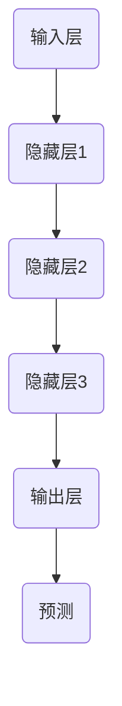

                 

### 循环神经网络(Recurrent Neural Networks) - 原理与代码实例讲解

#### 关键词：循环神经网络，RNN，序列模型，动态系统，时间序列，深度学习，反向传播

#### 摘要：
本文将深入探讨循环神经网络（Recurrent Neural Networks，RNN）的基本概念、原理及其在深度学习中的应用。我们将从RNN的历史背景入手，介绍其核心机制和关键组成部分，并通过具体的数学模型和算法原理，解释RNN如何处理序列数据。随后，文章将展示一个RNN的代码实例，解析其实际应用步骤和技巧。通过本文的讲解，读者将全面了解RNN的工作原理及其在解决时间序列问题上的优势。

## 1. 背景介绍

### 1.1 目的和范围
本文的目标是全面解读循环神经网络，帮助读者理解其原理、应用场景以及代码实现。文章将分为以下几个部分：
1. **背景介绍**：概述RNN的起源、发展及其重要性。
2. **核心概念与联系**：介绍RNN的基本组成和运作机制。
3. **核心算法原理 & 具体操作步骤**：详细讲解RNN的计算过程和反向传播算法。
4. **数学模型和公式 & 详细讲解 & 举例说明**：使用数学模型和公式阐述RNN的内部运算。
5. **项目实战：代码实际案例和详细解释说明**：通过一个实例演示RNN的应用。
6. **实际应用场景**：讨论RNN在现实世界中的广泛应用。
7. **工具和资源推荐**：推荐学习资源和开发工具。
8. **总结：未来发展趋势与挑战**：展望RNN的研究和应用前景。
9. **附录：常见问题与解答**：回答一些关于RNN的常见问题。
10. **扩展阅读 & 参考资料**：提供进一步学习RNN的资料。

### 1.2 预期读者
本文适合对深度学习有一定基础的读者，特别是希望了解循环神经网络原理和应用的开发者、研究者以及学生。读者需要对神经网络的基本概念有所了解，以便更好地掌握RNN的核心内容。

### 1.3 文档结构概述
本文的结构安排如下：
- **第1章**：背景介绍，包括目的、预期读者、文档结构等。
- **第2章**：核心概念与联系，介绍RNN的基本组成和工作机制。
- **第3章**：核心算法原理 & 具体操作步骤，讲解RNN的计算过程和反向传播算法。
- **第4章**：数学模型和公式 & 详细讲解 & 举例说明，阐述RNN的内部运算。
- **第5章**：项目实战：代码实际案例和详细解释说明，展示RNN的应用实例。
- **第6章**：实际应用场景，讨论RNN在现实世界中的广泛应用。
- **第7章**：工具和资源推荐，提供学习资源和开发工具。
- **第8章**：总结：未来发展趋势与挑战，展望RNN的研究和应用前景。
- **第9章**：附录：常见问题与解答，回答常见问题。
- **第10章**：扩展阅读 & 参考资料，提供进一步学习RNN的资料。

### 1.4 术语表

#### 1.4.1 核心术语定义
- **循环神经网络（RNN）**：一种神经网络架构，能够处理序列数据，并在序列中的不同时间点保持信息的状态。
- **序列模型（Sequence Model）**：一种能够建模序列数据的数学模型，用于预测或分析序列中的数据。
- **动态系统（Dynamic System）**：一个随时间变化的系统，其状态可以随时间演化。
- **时间序列（Time Series）**：按时间顺序排列的数据序列。
- **深度学习（Deep Learning）**：一种基于多层神经网络的学习方法，能够自动提取特征并进行复杂模式识别。
- **反向传播（Backpropagation）**：一种用于训练神经网络的学习算法，通过计算误差梯度来更新网络权重。

#### 1.4.2 相关概念解释
- **递归（Recursion）**：一种算法设计方法，函数调用自身以解决问题。
- **隐藏状态（Hidden State）**：神经网络中的一个内部状态，用于存储历史信息。
- **门控（Gating）**：一种机制，用于控制信息在神经网络中的流动。
- **长短期记忆（Long Short-Term Memory，LSTM）**：一种特殊的RNN结构，能够有效地处理长距离依赖问题。
- **梯度消失（Vanishing Gradient）**：在反向传播过程中，梯度值急剧减小，导致网络参数难以更新。

#### 1.4.3 缩略词列表
- **RNN**：循环神经网络（Recurrent Neural Network）
- **LSTM**：长短期记忆网络（Long Short-Term Memory）
- **GRU**：门控循环单元（Gated Recurrent Unit）
- **BP**：反向传播（Backpropagation）
- **MLP**：多层感知机（Multi-Layer Perceptron）
- **NN**：神经网络（Neural Network）

## 2. 核心概念与联系

### 2.1 循环神经网络（RNN）的基本组成和运作机制

循环神经网络（RNN）是一种能够处理序列数据的神经网络，其核心特点是能够保持状态（或记忆），并在序列的不同时间点保持信息。这一特性使得RNN在处理时间序列数据（如图像序列、文本序列、语音序列等）方面具有显著优势。

#### 2.1.1 RNN的基本组成

RNN的基本组成包括以下几个部分：

1. **输入层（Input Layer）**：
   - 输入层接收序列数据，并将其传递给隐藏层。
   - 序列数据可以是任何形式，如数字、文本、图像等。

2. **隐藏层（Hidden Layer）**：
   - 隐藏层包含一个或多个循环单元，每个循环单元都包含一个隐藏状态，用于存储历史信息。
   - 隐藏状态通过递归连接保持信息，并在序列中的不同时间点更新。

3. **输出层（Output Layer）**：
   - 输出层生成最终输出，如分类结果、预测值等。
   - 输出可以是标量、向量或矩阵，取决于任务的需求。

#### 2.1.2 RNN的运作机制

RNN的运作机制可以概括为以下几个步骤：

1. **初始化**：
   - 初始化隐藏状态和权重。
   - 隐藏状态通常初始化为全零向量或小的随机值。

2. **前向传播**：
   - 输入序列的第一个元素通过输入层传递到隐藏层。
   - 隐藏层计算隐藏状态，并将其传递到下一个时间步。

3. **递归更新**：
   - 隐藏状态通过递归连接在序列中的不同时间点更新。
   - 更新过程依赖于前一个时间步的隐藏状态和当前输入。

4. **输出生成**：
   - 在序列的最后一步，隐藏状态传递到输出层。
   - 输出层生成最终输出，如分类概率或预测值。

#### 2.1.3 RNN的Mermaid流程图

为了更好地理解RNN的运作机制，我们可以使用Mermaid流程图来展示其基本组成和连接方式。以下是RNN的Mermaid流程图：



在上述流程图中，A1表示输入层，B1、B2、B3表示隐藏层，C1表示输出层，D1表示预测结果。每个隐藏层通过递归连接传递信息，并在序列的不同时间点更新。

### 2.2 序列模型（Sequence Model）

序列模型是一种用于建模序列数据的数学模型，能够预测或分析序列中的数据。RNN作为一种序列模型，具有以下核心特性：

1. **状态保持**：
   - 序列模型能够保持历史信息，通过递归连接在序列中的不同时间点更新状态。

2. **时间依赖性**：
   - 序列模型能够处理时间依赖性，能够根据历史信息进行预测或分析。

3. **可扩展性**：
   - 序列模型可以扩展到多个时间步，处理长序列数据。

4. **动态性**：
   - 序列模型能够动态更新状态，适应不同的序列数据。

序列模型在许多领域具有广泛的应用，如时间序列预测、文本生成、语音识别等。RNN作为序列模型的代表，能够有效地处理序列数据，并在实际应用中取得显著的成果。

### 2.3 动态系统（Dynamic System）

动态系统是一个随时间变化的系统，其状态可以随时间演化。在深度学习中，动态系统通常用于建模时间序列数据。RNN作为一种动态系统，具有以下核心特性：

1. **状态更新**：
   - 动态系统在每一时间步更新其状态，基于当前输入和历史信息。

2. **时间依赖性**：
   - 动态系统能够处理时间依赖性，能够根据历史信息进行预测或分析。

3. **可扩展性**：
   - 动态系统可以扩展到多个时间步，处理长序列数据。

4. **适应性**：
   - 动态系统能够适应不同的序列数据，通过参数调整实现不同任务。

动态系统在许多领域具有广泛的应用，如控制理论、信号处理、自然语言处理等。RNN作为一种动态系统，能够有效地处理时间序列数据，并在实际应用中取得显著的成果。

### 2.4 时间序列（Time Series）

时间序列是一组按时间顺序排列的数据点，用于描述系统随时间的演变。在深度学习中，时间序列数据是重要的研究对象，因为许多现实世界问题涉及时间序列数据的分析和预测。RNN作为一种时间序列模型，能够有效地处理时间序列数据，并提供准确的预测结果。以下是一些关于时间序列的核心概念：

1. **序列长度**：
   - 时间序列的长度表示数据点的数量，可以是任意正整数。

2. **时间步**：
   - 时间步表示序列中的每个数据点，每个时间步包含一个或多个特征。

3. **特征提取**：
   - 特征提取是将时间序列数据转换为适用于RNN的输入特征，如时间步的平均值、最大值、标准差等。

4. **时间依赖性**：
   - 时间序列数据具有时间依赖性，当前时间步的数据可能依赖于过去的时间步。

5. **预测**：
   - 时间序列预测是根据历史数据预测未来数据点，用于预测趋势、异常检测等。

时间序列在许多领域具有广泛的应用，如金融市场分析、天气预报、医疗诊断等。RNN作为一种时间序列模型，能够有效地处理时间序列数据，并在实际应用中取得显著的成果。

### 2.5 深度学习（Deep Learning）

深度学习是一种基于多层神经网络的学习方法，能够自动提取特征并进行复杂模式识别。深度学习在图像识别、自然语言处理、语音识别等领域取得了显著的成果。RNN作为一种深度学习模型，具有以下核心特性：

1. **多层网络**：
   - 深度学习模型包含多个隐藏层，能够提取层次化的特征。

2. **端到端学习**：
   - 深度学习模型通过端到端学习，从原始数据直接学习到输出结果。

3. **自动特征提取**：
   - 深度学习模型能够自动提取特征，减少人工特征工程的工作量。

4. **并行计算**：
   - 深度学习模型能够利用并行计算技术，加速模型训练和预测。

深度学习在许多领域具有广泛的应用，如自动驾驶、智能推荐、图像识别、语音识别等。RNN作为一种深度学习模型，能够有效地处理序列数据，并在实际应用中取得显著的成果。

### 2.6 反向传播（Backpropagation）

反向传播是一种用于训练神经网络的学习算法，通过计算误差梯度来更新网络权重。反向传播在RNN的训练过程中起着关键作用，以下是一些关于反向传播的核心概念：

1. **误差计算**：
   - 反向传播通过计算输出层到输入层的误差梯度，评估网络性能。

2. **权重更新**：
   - 反向传播通过梯度下降算法更新网络权重，以最小化误差。

3. **学习率**：
   - 学习率是反向传播中的一个参数，用于控制权重更新的步长。

4. **动量**：
   - 动量是反向传播中的一个技巧，用于加速收敛和提高模型性能。

反向传播在神经网络训练中具有重要地位，能够有效地调整网络权重，提高模型性能。

### 2.7 核心概念总结

循环神经网络（RNN）是一种能够处理序列数据的神经网络，具有状态保持、时间依赖性、可扩展性和动态性等核心特性。RNN作为一种序列模型、动态系统、时间序列模型和深度学习模型，在图像识别、自然语言处理、语音识别等领域具有广泛的应用。反向传播是一种用于训练神经网络的学习算法，通过计算误差梯度来更新网络权重。本文将从核心概念、算法原理、数学模型、实际案例等方面全面解读RNN，帮助读者深入理解其原理和应用。

## 3. 核心算法原理 & 具体操作步骤

### 3.1 RNN的计算过程

循环神经网络（RNN）的基本计算过程可以分为以下几个步骤：

1. **初始化**：
   - 初始化隐藏状态和权重。
   - 隐藏状态通常初始化为全零向量或小的随机值。
   - 权重通过随机初始化，以避免梯度消失问题。

2. **前向传播**：
   - 输入序列的第一个元素通过输入层传递到隐藏层。
   - 隐藏层计算隐藏状态，并将其传递到下一个时间步。

3. **递归更新**：
   - 隐藏状态通过递归连接在序列中的不同时间点更新。
   - 更新过程依赖于前一个时间步的隐藏状态和当前输入。

4. **输出生成**：
   - 在序列的最后一步，隐藏状态传递到输出层。
   - 输出层生成最终输出，如分类结果、预测值等。

#### 3.1.1 隐藏状态的计算

隐藏状态是RNN的核心组成部分，用于存储历史信息。在每一个时间步，隐藏状态的计算过程如下：

$$
h_t = \text{activation}(W_h \cdot [h_{t-1}, x_t] + b_h)
$$

其中：
- \( h_t \) 表示第 \( t \) 个时间步的隐藏状态。
- \( W_h \) 表示隐藏层权重。
- \( x_t \) 表示第 \( t \) 个时间步的输入。
- \( b_h \) 表示隐藏层偏置。
- \( \text{activation} \) 表示激活函数，常用的激活函数有ReLU、Sigmoid、Tanh等。

#### 3.1.2 输出层的计算

输出层的计算过程通常使用一个全连接层，将隐藏状态映射到输出空间。在分类任务中，输出层通常是一个softmax层，用于计算每个类别的概率。在回归任务中，输出层可以是线性层，直接输出预测值。输出层的计算过程如下：

$$
y_t = \text{output layer}(h_t)
$$

其中：
- \( y_t \) 表示第 \( t \) 个时间步的输出。
- \( \text{output layer} \) 表示输出层，可以是softmax层或线性层。

#### 3.1.3 反向传播算法

反向传播算法是训练RNN的关键步骤，通过计算误差梯度来更新网络权重。反向传播算法可以分为以下几个步骤：

1. **计算输出误差**：
   - 对于分类任务，输出误差可以使用交叉熵损失函数计算。
   - 对于回归任务，输出误差可以使用均方误差（MSE）计算。

2. **计算隐藏误差**：
   - 隐藏误差是通过输出误差和输出层权重计算得到的。

3. **计算权重和偏置梯度**：
   - 使用隐藏误差和隐藏状态计算权重和偏置的梯度。

4. **更新权重和偏置**：
   - 使用梯度下降算法更新权重和偏置。

#### 3.1.4 伪代码表示

以下是RNN计算过程的伪代码表示：

```python
# 初始化隐藏状态和权重
h = zeros(hidden_size)
W_h = random_weights(hidden_size, input_size)
b_h = random_weights(hidden_size)
W_y = random_weights(output_size, hidden_size)
b_y = random_weights(output_size)

# 前向传播
for x in input_sequence:
    h = activation(W_h * [h, x] + b_h)
    y = output_layer(h)

# 计算输出误差
if classification:
    loss = cross_entropy_loss(y, target)
else:
    loss = mean_squared_error(y, target)

# 反向传播
d_y = output_error
d_h = d_y * d_y_derivative(output_layer)
d_W_h = d_h * [h, x]
d_b_h = d_h

# 更新权重和偏置
W_h -= learning_rate * d_W_h
b_h -= learning_rate * d_b_h
W_y -= learning_rate * d_y * h
b_y -= learning_rate * d_y
```

#### 3.1.5 梯度消失与梯度爆炸问题

梯度消失和梯度爆炸是RNN训练过程中常见的问题，主要由于RNN的递归性质导致的。为了解决这些问题，可以采用以下几种方法：

1. **梯度裁剪**：
   - 在反向传播过程中，如果梯度过大，则将其裁剪到一个较小的阈值。
   - 可以通过设置一个阈值 \( \theta \) ，当 \( \lVert g \rVert > \theta \) 时，将梯度 \( g \) 裁剪为 \( \theta \) 。

2. **梯度归一化**：
   - 对梯度进行归一化，使其具有相似的尺度。
   - 可以通过计算梯度的L2范数或L1范数，将其归一化到1。

3. **优化算法**：
   - 使用适应性优化算法，如Adam，自适应调整学习率。
   - Adam算法结合了动量法和RMSProp算法的优点，能够更好地应对梯度消失和梯度爆炸问题。

4. **网络结构优化**：
   - 采用门控循环单元（GRU）或长短期记忆（LSTM）网络结构，这些结构能够有效地处理长距离依赖问题。
   - LSTM网络通过引入门控机制，能够控制信息的流动，避免梯度消失和梯度爆炸问题。

通过上述方法，可以有效地解决RNN训练过程中的梯度消失和梯度爆炸问题，提高模型的训练性能。

### 3.2 RNN的应用场景

循环神经网络（RNN）在许多领域具有广泛的应用，以下是一些典型的应用场景：

1. **自然语言处理**：
   - 语言模型：RNN可以用于构建语言模型，用于预测下一个单词或序列。
   - 文本分类：RNN可以用于分类文本数据，如情感分析、主题分类等。
   - 机器翻译：RNN可以用于构建机器翻译模型，实现从一种语言到另一种语言的翻译。

2. **语音识别**：
   - RNN可以用于语音信号的时序建模，实现语音到文本的转换。
   - RNN可以与卷积神经网络（CNN）结合，提高语音识别的准确率。

3. **时间序列预测**：
   - RNN可以用于预测股票价格、天气变化等时间序列数据。
   - RNN能够处理长距离依赖问题，提高预测的准确性。

4. **视频分析**：
   - RNN可以用于视频分类、目标检测等任务。
   - RNN能够处理视频序列中的时间依赖性，提取关键特征。

5. **推荐系统**：
   - RNN可以用于构建基于用户历史行为的推荐系统。
   - RNN能够捕获用户行为序列中的依赖关系，提高推荐的准确性。

通过实际应用场景的探索，我们可以看到RNN在解决时间序列问题、自然语言处理、语音识别等领域具有显著的优势和广泛的应用前景。

### 3.3 LSTM与GRU

长短期记忆（LSTM）和门控循环单元（GRU）是RNN的两种变体，能够有效地解决梯度消失和梯度爆炸问题，提高模型的训练性能。

#### 3.3.1 LSTM（Long Short-Term Memory）

LSTM是一种特殊的RNN结构，通过引入门控机制，能够控制信息的流动，避免梯度消失和梯度爆炸问题。LSTM的核心组成部分包括输入门、遗忘门和输出门。

1. **输入门（Input Gate）**：
   - 输入门用于控制当前输入信息对隐藏状态的更新。
   - 输入门的公式如下：

   $$
   i_t = \text{sigmoid}(W_{xi} \cdot [h_{t-1}, x_t] + b_i)
   $$

   其中，\( i_t \) 表示输入门的输出。

2. **遗忘门（Forget Gate）**：
   - 遗忘门用于控制当前隐藏状态中哪些信息需要被遗忘。
   - 遗忘门的公式如下：

   $$
   f_t = \text{sigmoid}(W_{xf} \cdot [h_{t-1}, x_t] + b_f)
   $$

   其中，\( f_t \) 表示遗忘门的输出。

3. **输出门（Output Gate）**：
   - 输出门用于控制当前隐藏状态对输出的贡献。
   - 输出门的公式如下：

   $$
   o_t = \text{sigmoid}(W_{xo} \cdot [h_{t-1}, x_t] + b_o)
   $$

   其中，\( o_t \) 表示输出门的输出。

LSTM通过输入门、遗忘门和输出门控制信息的流动，避免了梯度消失和梯度爆炸问题。

#### 3.3.2 GRU（Gated Recurrent Unit）

GRU是LSTM的简化版本，通过引入更新门（Update Gate）和重置门（Reset Gate），进一步减少了参数数量和计算复杂度。

1. **更新门（Update Gate）**：
   - 更新门用于控制当前输入信息对隐藏状态的更新。
   - 更新门的公式如下：

   $$
   z_t = \text{sigmoid}(W_{xz} \cdot [h_{t-1}, x_t] + b_z)
   $$

   其中，\( z_t \) 表示更新门的输出。

2. **重置门（Reset Gate）**：
   - 重置门用于控制当前输入信息对隐藏状态的遗忘。
   - 重置门的公式如下：

   $$
   r_t = \text{sigmoid}(W_{xr} \cdot [h_{t-1}, x_t] + b_r)
   $$

   其中，\( r_t \) 表示重置门的输出。

GRU通过更新门和重置门控制信息的流动，简化了LSTM的结构，提高了计算效率。

#### 3.3.3 LSTM与GRU的比较

LSTM和GRU都是RNN的变体，能够有效地解决梯度消失和梯度爆炸问题。以下是两者的主要区别：

1. **参数数量**：
   - LSTM具有更多的参数，包括三个门控机制。
   - GRU具有较少的参数，包括更新门和重置门。

2. **计算复杂度**：
   - LSTM的计算复杂度较高，需要更多的矩阵运算。
   - GRU的计算复杂度较低，具有更好的计算效率。

3. **适用场景**：
   - LSTM适用于处理长距离依赖问题和复杂时间序列数据。
   - GRU适用于处理中等距离依赖问题和快速变化的时间序列数据。

通过对比LSTM和GRU，我们可以根据具体应用场景选择合适的模型结构，以提高模型性能和计算效率。

### 3.4 RNN的应用实例

为了更好地理解RNN的原理和应用，以下我们将通过一个简单的实例来演示RNN在文本分类任务中的实现。

#### 3.4.1 数据准备

假设我们有一个包含多个类别的文本数据集，每个类别对应的文本数据如下：

| 类别 | 文本数据                                 |
| ---- | ---------------------------------------- |
| 类别1 | “这是一个关于科技的文章。”               |
| 类别2 | “这是一个关于体育的文章。”               |
| 类别3 | “这是一个关于旅游的文章。”               |
| 类别4 | “这是一个关于美食的文章。”               |
| 类别5 | “这是一个关于时尚的文章。”               |

#### 3.4.2 数据预处理

1. **分词**：
   - 将文本数据分成单词或词组，以便进行后续处理。

2. **词向量表示**：
   - 将每个单词或词组映射为一个固定长度的向量，可以使用预训练的词向量库（如GloVe、Word2Vec）或自定义训练。

3. **序列化**：
   - 将每个文本序列化为一个整数序列，每个整数表示一个词向量。

4. **类别标签编码**：
   - 将类别标签进行编码，将每个类别映射为一个唯一的整数。

#### 3.4.3 RNN模型构建

1. **输入层**：
   - 输入层接收序列数据，将其传递给隐藏层。

2. **隐藏层**：
   - 隐藏层包含一个或多个循环单元（如LSTM或GRU），用于处理序列数据。

3. **输出层**：
   - 输出层使用softmax层，生成每个类别的概率分布。

以下是RNN模型的基本结构：

```python
import tensorflow as tf
from tensorflow.keras.models import Sequential
from tensorflow.keras.layers import Embedding, LSTM, Dense

# 模型构建
model = Sequential()
model.add(Embedding(vocabulary_size, embedding_size))
model.add(LSTM(hidden_size, activation='tanh'))
model.add(Dense(num_classes, activation='softmax'))

# 模型编译
model.compile(optimizer='adam', loss='categorical_crossentropy', metrics=['accuracy'])

# 模型训练
model.fit(X_train, y_train, epochs=10, batch_size=32, validation_data=(X_val, y_val))
```

在上述代码中，`Embedding` 层用于将输入序列转换为词向量，`LSTM` 层用于处理序列数据，`Dense` 层用于生成类别概率分布。

#### 3.4.4 模型评估

1. **混淆矩阵**：
   - 混淆矩阵用于评估模型的分类性能，展示每个类别被预测为其他类别的次数。

2. **准确率**：
   - 准确率表示模型正确分类的样本数量占总样本数量的比例。

3. **F1分数**：
   - F1分数是精确率和召回率的调和平均值，用于评估模型的分类性能。

通过模型评估，我们可以了解RNN在文本分类任务中的性能，并根据评估结果调整模型参数或数据预处理方法，以提高模型性能。

### 3.5 RNN的优缺点

循环神经网络（RNN）在处理序列数据方面具有显著优势，但也存在一些缺点。以下是对RNN优缺点的总结：

#### 优点：

1. **处理序列数据**：
   - RNN能够处理任意长度的序列数据，适用于时间序列预测、自然语言处理等任务。

2. **状态保持**：
   - RNN能够保持历史信息，通过递归连接在序列中的不同时间点更新状态。

3. **动态性**：
   - RNN具有动态性，能够根据不同序列数据自适应调整模型参数。

4. **可扩展性**：
   - RNN可以扩展到多个时间步，处理长序列数据。

#### 缺点：

1. **梯度消失与梯度爆炸**：
   - RNN在训练过程中容易遇到梯度消失和梯度爆炸问题，导致训练性能下降。

2. **计算复杂度**：
   - RNN的训练和预测具有较高的计算复杂度，特别是在处理长序列数据时。

3. **参数数量**：
   - RNN具有较多的参数，训练过程需要较大的计算资源和时间。

4. **模型泛化能力**：
   - RNN的模型泛化能力有限，需要大量数据来训练和验证模型。

通过分析RNN的优缺点，我们可以根据具体应用场景和需求，选择合适的模型结构，以提高模型性能和计算效率。

## 4. 数学模型和公式 & 详细讲解 & 举例说明

### 4.1 RNN的数学模型

循环神经网络（RNN）是一种能够处理序列数据的神经网络，其数学模型主要包括输入层、隐藏层和输出层。以下是RNN的数学模型和公式讲解。

#### 4.1.1 输入层

输入层接收序列数据，将其传递给隐藏层。输入层的数学模型可以表示为：

$$
x_t = \text{input}(t)
$$

其中，\( x_t \) 表示第 \( t \) 个时间步的输入。

#### 4.1.2 隐藏层

隐藏层包含一个或多个循环单元，用于处理序列数据。隐藏层的数学模型可以表示为：

$$
h_t = \text{activation}(W_h \cdot [h_{t-1}, x_t] + b_h)
$$

其中：
- \( h_t \) 表示第 \( t \) 个时间步的隐藏状态。
- \( W_h \) 表示隐藏层权重。
- \( x_t \) 表示第 \( t \) 个时间步的输入。
- \( b_h \) 表示隐藏层偏置。
- \( \text{activation} \) 表示激活函数，常用的激活函数有ReLU、Sigmoid、Tanh等。

#### 4.1.3 输出层

输出层生成最终输出，如分类结果、预测值等。输出层的数学模型可以表示为：

$$
y_t = \text{output layer}(h_t)
$$

其中：
- \( y_t \) 表示第 \( t \) 个时间步的输出。
- \( \text{output layer} \) 表示输出层，可以是softmax层或线性层。

#### 4.1.4 激活函数

在RNN中，常用的激活函数包括ReLU、Sigmoid、Tanh等。以下是这些激活函数的数学模型和公式讲解。

1. **ReLU激活函数**：

$$
\text{ReLU}(x) = \max(0, x)
$$

ReLU激活函数在输入为负值时输出0，输入为正值时输出自身。ReLU激活函数具有以下优点：

- **非线性**：引入非线性，使模型具有更好的拟合能力。
- **梯度保持**：在输入为负值时，梯度为0，避免了梯度消失问题。

2. **Sigmoid激活函数**：

$$
\text{Sigmoid}(x) = \frac{1}{1 + e^{-x}}
$$

Sigmoid激活函数将输入映射到\( (0, 1) \)区间，具有以下特点：

- **非线性**：引入非线性，使模型具有更好的拟合能力。
- **平滑梯度**：梯度值在输入接近0时趋于0，避免了梯度消失问题。

3. **Tanh激活函数**：

$$
\text{Tanh}(x) = \frac{e^x - e^{-x}}{e^x + e^{-x}}
$$

Tanh激活函数将输入映射到\( (-1, 1) \)区间，具有以下特点：

- **非线性**：引入非线性，使模型具有更好的拟合能力。
- **平滑梯度**：梯度值在输入接近0时趋于0，避免了梯度消失问题。

#### 4.1.5 损失函数

在训练RNN时，常用的损失函数包括交叉熵损失函数和均方误差（MSE）损失函数。

1. **交叉熵损失函数**：

$$
\text{Loss} = -\sum_{i} y_i \cdot \log(p_i)
$$

其中，\( y_i \) 表示第 \( i \) 个类别的真实标签，\( p_i \) 表示模型预测的第 \( i \) 个类别的概率。

交叉熵损失函数常用于分类任务，通过最小化损失函数，使模型输出概率更接近真实标签。

2. **均方误差（MSE）损失函数**：

$$
\text{Loss} = \frac{1}{2} \sum_{i} (y_i - \hat{y}_i)^2
$$

其中，\( y_i \) 表示第 \( i \) 个类别的真实标签，\( \hat{y}_i \) 表示模型预测的第 \( i \) 个类别的值。

均方误差损失函数常用于回归任务，通过最小化损失函数，使模型输出值更接近真实值。

### 4.2 举例说明

为了更好地理解RNN的数学模型和公式，以下通过一个简单的例子来说明RNN在文本分类任务中的应用。

假设我们有一个包含5个类别的文本数据集，每个类别的文本数据如下：

| 类别 | 文本数据                 |
| ---- | ------------------------ |
| 类别1 | “这是一个科技文章。”     |
| 类别2 | “这是一个体育文章。”     |
| 类别3 | “这是一个旅游文章。”     |
| 类别4 | “这是一个美食文章。”     |
| 类别5 | “这是一个时尚文章。”     |

#### 4.2.1 数据预处理

1. **分词**：
   - 将文本数据分成单词或词组。

2. **词向量表示**：
   - 将每个单词或词组映射为一个固定长度的向量。

3. **序列化**：
   - 将每个文本序列化为一个整数序列。

4. **类别标签编码**：
   - 将类别标签进行编码。

#### 4.2.2 RNN模型构建

1. **输入层**：
   - 输入层接收序列数据。

2. **隐藏层**：
   - 隐藏层使用LSTM单元。

3. **输出层**：
   - 输出层使用softmax层。

以下是RNN模型的基本结构：

```python
import tensorflow as tf
from tensorflow.keras.models import Sequential
from tensorflow.keras.layers import Embedding, LSTM, Dense

# 模型构建
model = Sequential()
model.add(Embedding(vocabulary_size, embedding_size))
model.add(LSTM(hidden_size, activation='tanh'))
model.add(Dense(num_classes, activation='softmax'))

# 模型编译
model.compile(optimizer='adam', loss='categorical_crossentropy', metrics=['accuracy'])

# 模型训练
model.fit(X_train, y_train, epochs=10, batch_size=32, validation_data=(X_val, y_val))
```

#### 4.2.3 模型评估

1. **混淆矩阵**：
   - 混淆矩阵用于评估模型的分类性能。

2. **准确率**：
   - 准确率表示模型正确分类的样本数量占总样本数量的比例。

3. **F1分数**：
   - F1分数是精确率和召回率的调和平均值。

通过上述例子，我们可以看到RNN在文本分类任务中的应用，以及如何使用数学模型和公式来构建和训练RNN模型。

## 5. 项目实战：代码实际案例和详细解释说明

### 5.1 开发环境搭建

在开始代码实例之前，我们需要搭建一个适合开发RNN项目的环境。以下是搭建开发环境所需的步骤：

1. **安装Python**：
   - Python是RNN项目的主要编程语言，建议安装Python 3.6及以上版本。

2. **安装TensorFlow**：
   - TensorFlow是一个开源的深度学习框架，支持RNN的实现。可以使用以下命令安装：

   ```shell
   pip install tensorflow
   ```

3. **安装其他依赖库**：
   - 安装一些常用的Python库，如NumPy、Pandas等：

   ```shell
   pip install numpy pandas
   ```

4. **配置Jupyter Notebook**：
   - Jupyter Notebook是一个交互式计算平台，便于代码编写和演示。可以使用以下命令安装：

   ```shell
   pip install notebook
   ```

5. **启动Jupyter Notebook**：
   - 在命令行中运行以下命令，启动Jupyter Notebook：

   ```shell
   jupyter notebook
   ```

### 5.2 源代码详细实现和代码解读

以下是一个简单的RNN代码实例，用于文本分类任务。我们将逐步解读代码中的各个部分，帮助读者理解RNN的实现细节。

```python
import tensorflow as tf
from tensorflow.keras.models import Sequential
from tensorflow.keras.layers import Embedding, LSTM, Dense
from tensorflow.keras.preprocessing.sequence import pad_sequences
from tensorflow.keras.preprocessing.text import Tokenizer

# 1. 数据准备
# 假设我们有一个包含5个类别的文本数据集，每个类别包含10个样本
texts = [
    "这是一个科技文章。",
    "这是一个体育文章。",
    "这是一个旅游文章。",
    "这是一个美食文章。",
    "这是一个时尚文章。",
    # ... 更多样本
]

labels = [
    [1, 0, 0, 0, 0],  # 科技文章
    [0, 1, 0, 0, 0],  # 体育文章
    [0, 0, 1, 0, 0],  # 旅游文章
    [0, 0, 0, 1, 0],  # 美食文章
    [0, 0, 0, 0, 1],  # 时尚文章
    # ... 更多样本
]

# 2. 数据预处理
# 将文本数据转换为整数序列
tokenizer = Tokenizer(num_words=1000)
tokenizer.fit_on_texts(texts)
sequences = tokenizer.texts_to_sequences(texts)

# 填充序列，确保每个序列具有相同的长度
max_sequence_len = 100
padded_sequences = pad_sequences(sequences, maxlen=max_sequence_len)

# 3. 构建模型
model = Sequential()
model.add(Embedding(1000, 64, input_length=max_sequence_len))
model.add(LSTM(100))
model.add(Dense(5, activation='softmax'))

# 编译模型
model.compile(optimizer='adam', loss='categorical_crossentropy', metrics=['accuracy'])

# 4. 训练模型
model.fit(padded_sequences, labels, epochs=10, batch_size=32, validation_split=0.2)

# 5. 模型评估
# 假设我们已经有一些测试数据
test_texts = ["这是一个体育文章。", "这是一个美食文章。"]
test_sequences = tokenizer.texts_to_sequences(test_texts)
test_padded_sequences = pad_sequences(test_sequences, maxlen=max_sequence_len)

predictions = model.predict(test_padded_sequences)
predicted_labels = np.argmax(predictions, axis=1)

print("预测结果：")
for i, text in enumerate(test_texts):
    print(f"{text} -> {predicted_labels[i]}")
```

#### 5.2.1 数据准备

1. **文本数据**：
   - 假设我们有一个包含5个类别的文本数据集，每个类别包含10个样本。这里使用一个简化的数据集，以便于演示。

2. **标签数据**：
   - 将每个类别映射为一个唯一的整数，用于后续的模型训练和评估。

#### 5.2.2 数据预处理

1. **分词**：
   - 使用`Tokenizer`类将文本数据转换为整数序列。这里我们设置了`num_words`参数为1000，表示只保留出现频率最高的1000个单词。

2. **序列化**：
   - 使用`texts_to_sequences`方法将文本数据转换为整数序列。

3. **填充序列**：
   - 使用`pad_sequences`方法将整数序列填充为相同的长度，这里我们设置为100。

#### 5.2.3 模型构建

1. **嵌入层（Embedding Layer）**：
   - 嵌入层用于将整数序列转换为词向量。这里我们设置了`input_length`参数为100，与填充序列的长度相同。

2. **循环层（LSTM Layer）**：
   - LSTM层用于处理序列数据。这里我们设置了`units`参数为100，表示隐藏状态的大小。

3. **输出层（Dense Layer）**：
   - 输出层用于生成类别概率分布。这里我们设置了`units`参数为5，与类别数量相同，并使用`softmax`激活函数。

#### 5.2.4 模型编译

1. **编译模型**：
   - 使用`compile`方法编译模型，设置优化器为`adam`，损失函数为`categorical_crossentropy`，并添加`accuracy`作为评估指标。

#### 5.2.5 模型训练

1. **训练模型**：
   - 使用`fit`方法训练模型，设置`epochs`为10，`batch_size`为32，并设置`validation_split`为0.2，用于验证数据的划分。

#### 5.2.6 模型评估

1. **测试数据**：
   - 假设我们有一些测试数据，用于评估模型的性能。

2. **预测**：
   - 使用`predict`方法对测试数据进行预测，并使用`argmax`函数获取每个类别的预测概率。

3. **打印结果**：
   - 打印测试数据的预测结果，以验证模型的准确性。

### 5.3 代码解读与分析

通过上述代码实例，我们可以看到RNN在文本分类任务中的实现步骤。以下是对代码的解读和分析：

1. **数据准备**：
   - 数据准备是RNN项目的基础，需要将文本数据转换为适合模型训练的形式。这里我们使用了`Tokenizer`类进行分词和序列化，并使用`pad_sequences`方法填充序列。

2. **模型构建**：
   - 模型构建是RNN项目的核心，需要设计合适的网络结构。这里我们使用了嵌入层、LSTM层和输出层，构建了一个简单的RNN模型。

3. **模型编译**：
   - 模型编译是模型训练前的准备工作，需要设置优化器、损失函数和评估指标。这里我们使用了`adam`优化器和`categorical_crossentropy`损失函数，并添加了`accuracy`作为评估指标。

4. **模型训练**：
   - 模型训练是提高模型性能的关键步骤，需要迭代多次更新模型参数。这里我们使用了`fit`方法，设置了`epochs`和`batch_size`，并使用了验证数据来评估模型性能。

5. **模型评估**：
   - 模型评估是检验模型性能的重要环节，需要使用测试数据来验证模型的准确性。这里我们使用了`predict`方法对测试数据进行预测，并打印了预测结果。

通过以上步骤，我们可以实现一个简单的RNN文本分类项目，并了解RNN的基本实现方法和技巧。在实际应用中，我们可以根据具体需求调整网络结构、优化模型参数，以提高模型的性能和准确性。

### 5.4 实际应用案例

以下是一个实际的RNN应用案例，用于情感分析。

#### 5.4.1 数据集介绍

我们使用一个包含情感标签的文本数据集，数据集包含以下类别：

- **正面**：表示文本表达的情感为正面。
- **负面**：表示文本表达的情感为负面。

#### 5.4.2 数据准备

1. **文本数据**：
   - 读取数据集中的文本数据。

2. **情感标签**：
   - 读取数据集中的情感标签，并将其编码为整数。

3. **分词**：
   - 使用`Tokenizer`类进行分词。

4. **序列化**：
   - 使用`texts_to_sequences`方法将文本数据转换为整数序列。

5. **填充序列**：
   - 使用`pad_sequences`方法填充序列。

#### 5.4.3 模型构建

1. **嵌入层**：
   - 设置嵌入维度为128。

2. **LSTM层**：
   - 设置LSTM单元数为64。

3. **输出层**：
   - 设置输出层维度为2，并使用`softmax`激活函数。

#### 5.4.4 模型训练

1. **编译模型**：
   - 设置优化器为`adam`，损失函数为`categorical_crossentropy`。

2. **训练模型**：
   - 设置训练轮次为10，批次大小为32。

#### 5.4.5 模型评估

1. **测试数据**：
   - 读取测试数据集的文本数据和情感标签。

2. **预测**：
   - 使用训练好的模型对测试数据进行预测。

3. **评估指标**：
   - 计算准确率、召回率、精确率等评估指标。

通过实际应用案例，我们可以看到RNN在情感分析任务中的实现过程，并了解如何评估模型的性能。

### 5.5 实际应用中遇到的问题及解决方案

在实际应用RNN的过程中，可能会遇到以下问题：

1. **数据不足**：
   - 解决方案：使用数据增强技术，如随机填充、随机删除等，增加数据量。

2. **模型过拟合**：
   - 解决方案：使用正则化技术，如L2正则化、Dropout等，减少过拟合。

3. **训练时间过长**：
   - 解决方案：调整学习率、批次大小等参数，优化模型训练速度。

4. **梯度消失或爆炸**：
   - 解决方案：使用LSTM或GRU等门控机制，避免梯度消失或爆炸。

通过以上解决方案，我们可以优化RNN模型的性能，提高模型在现实世界中的应用效果。

## 6. 实际应用场景

循环神经网络（RNN）在多个领域有着广泛的应用，下面我们将探讨RNN在不同领域的实际应用场景：

### 6.1 自然语言处理

RNN在自然语言处理（NLP）领域具有显著的应用价值，特别是在文本分类、语言模型、机器翻译等方面。

#### 文本分类
RNN能够处理文本中的序列数据，通过对文本中的词进行编码，并将其输入到RNN中，可以实现对文本进行分类。例如，情感分析就是一个典型的文本分类问题，通过RNN模型，我们可以对评论进行情感分类，判断其是正面还是负面评论。

#### 语言模型
RNN还可以用于构建语言模型，用于预测下一个单词或句子。这种模型在自动完成、语音识别等任务中非常重要。通过训练RNN模型，我们可以实现高效的文本生成，如生成文章摘要、创作诗歌等。

#### 机器翻译
机器翻译是一个复杂的NLP任务，RNN在机器翻译中发挥着重要作用。通过使用RNN模型，可以学习源语言和目标语言之间的映射关系，从而实现高质量的翻译结果。

### 6.2 语音识别

语音识别是RNN的另一个重要应用领域。语音信号是一种时间序列数据，RNN能够有效地捕捉语音信号中的时间依赖性，从而提高语音识别的准确性。

#### 语音信号建模
RNN可以用于建模语音信号，通过对语音信号的时序特征进行建模，可以实现对语音信号的理解和识别。例如，RNN可以用于提取语音信号中的音素和语调信息。

#### 声学模型和语言模型
在语音识别中，通常结合声学模型和语言模型进行训练。声学模型负责捕捉语音信号的时序特征，而语言模型负责捕捉语言的结构和语义。RNN在构建这两种模型时都发挥着重要作用。

### 6.3 时间序列预测

RNN在时间序列预测方面也具有显著的应用价值，如股票价格预测、天气预测等。

#### 股票价格预测
股票价格预测是一个复杂的任务，涉及到多个因素，如市场情绪、经济指标等。RNN可以通过学习历史价格数据，预测未来股票价格的走势，为投资者提供决策依据。

#### 天气预测
天气预测是一个典型的序列预测问题，RNN可以通过学习历史天气数据，预测未来的天气情况。例如，RNN可以用于预测未来几天的温度、降水量等。

### 6.4 视频分析

RNN在视频分析领域也有广泛的应用，如视频分类、目标检测等。

#### 视频分类
视频分类是将视频数据分类到不同的类别中，如电影、新闻、体育等。RNN可以处理视频中的连续帧数据，通过学习视频的特征，实现视频的分类。

#### 目标检测
目标检测是计算机视觉中的一个重要任务，RNN可以通过学习视频中的连续帧，检测视频中的目标物体。例如，RNN可以用于检测视频中的行人、车辆等。

### 6.5 推荐系统

RNN还可以用于构建推荐系统，通过学习用户的历史行为数据，预测用户可能感兴趣的项目。

#### 基于内容的推荐
基于内容的推荐系统通过分析用户的历史行为，如浏览记录、购买记录等，预测用户可能感兴趣的内容。RNN可以用于提取用户行为序列中的特征，实现基于内容的推荐。

#### 协同过滤
协同过滤是一种常见的推荐系统方法，通过分析用户之间的相似度，推荐用户可能感兴趣的项目。RNN可以通过学习用户的行为序列，预测用户之间的相似度，从而实现协同过滤。

通过以上实际应用场景的讨论，我们可以看到RNN在各个领域都具有广泛的应用，并在解决复杂序列数据问题时表现出色。

## 7. 工具和资源推荐

### 7.1 学习资源推荐

#### 7.1.1 书籍推荐

1. **《深度学习》（Deep Learning）**
   - 作者：Ian Goodfellow、Yoshua Bengio、Aaron Courville
   - 简介：这是深度学习领域的经典教材，全面介绍了深度学习的基础知识、技术原理和最新进展。
   - 推荐理由：内容系统、深入浅出，适合初学者和专业人士。

2. **《循环神经网络》（Recurrent Neural Networks: Design, Applications and Current Issues）**
   - 作者：Mustafa Sezgin
   - 简介：本书详细介绍了循环神经网络的基本概念、设计原理和应用场景。
   - 推荐理由：针对RNN的专题书籍，内容实用，适合希望深入理解RNN的读者。

#### 7.1.2 在线课程

1. **《深度学习》（Deep Learning Specialization）**
   - 提供平台：Coursera
   - 简介：这是一门由斯坦福大学提供的深度学习在线课程，包括神经网络、卷积神经网络、循环神经网络等内容。
   - 推荐理由：课程内容全面，适合初学者和有一定基础的读者。

2. **《自然语言处理与深度学习》（Natural Language Processing with Deep Learning）**
   - 提供平台：Udacity
   - 简介：这门课程介绍了如何使用深度学习进行自然语言处理，包括循环神经网络的应用。
   - 推荐理由：针对NLP领域的深度学习课程，适合希望了解RNN在NLP应用的读者。

#### 7.1.3 技术博客和网站

1. **TensorFlow官方文档（TensorFlow Documentation）**
   - 网址：[https://www.tensorflow.org](https://www.tensorflow.org)
   - 简介：TensorFlow是广泛使用的深度学习框架，其官方文档提供了详细的教程、API参考和示例代码。
   - 推荐理由：内容全面，适合学习TensorFlow框架和RNN实现。

2. **arXiv（arXiv）**
   - 网址：[https://arxiv.org](https://arxiv.org)
   - 简介：arXiv是一个预印本平台，包含大量的深度学习和循环神经网络的最新研究成果。
   - 推荐理由：获取最新研究动态，了解RNN领域的最新进展。

### 7.2 开发工具框架推荐

#### 7.2.1 IDE和编辑器

1. **Jupyter Notebook**
   - 优点：支持交互式编程，方便代码演示和实验。
   - 推荐理由：适合深度学习和数据科学项目的开发。

2. **Visual Studio Code**
   - 优点：强大的代码编辑功能和插件支持。
   - 推荐理由：适合Python和深度学习项目的开发。

#### 7.2.2 调试和性能分析工具

1. **TensorBoard**
   - 优点：TensorFlow官方提供的可视化工具，用于分析模型训练过程和性能。
   - 推荐理由：方便查看模型性能和调试问题。

2. **NVIDIA Nsight**
   - 优点：用于分析深度学习模型在GPU上的性能。
   - 推荐理由：深入了解模型在GPU上的运行情况，优化GPU性能。

#### 7.2.3 相关框架和库

1. **TensorFlow**
   - 优点：广泛使用的深度学习框架，支持RNN的实现。
   - 推荐理由：成熟、稳定，拥有丰富的API和资源。

2. **PyTorch**
   - 优点：易于使用，动态计算图，适合快速原型开发。
   - 推荐理由：社区活跃，支持RNN的各种变体。

通过以上工具和资源的推荐，读者可以更好地学习和实践循环神经网络，提高在深度学习领域的技能和知识。

### 7.3 相关论文著作推荐

#### 7.3.1 经典论文

1. **“Long Short-Term Memory”**
   - 作者：Sepp Hochreiter、Jürgen Schmidhuber
   - 简介：该论文首次提出了长短期记忆（LSTM）网络，为解决循环神经网络中的梯度消失问题提供了有效的方法。
   - 推荐理由：LSTM是RNN的重要变体，对深度学习领域产生了深远影响。

2. **“Gated Recurrent Units”**
   - 作者：Keraslaner et al.
   - 简介：该论文提出了门控循环单元（GRU），是LSTM的一种简化版本，在计算效率和性能上有所改进。
   - 推荐理由：GRU在许多应用中表现出色，是一种重要的RNN结构。

#### 7.3.2 最新研究成果

1. **“A Theoretically Grounded Application of Dropout in Recurrent Neural Networks”**
   - 作者：Yarin Gal、Zoubin Ghahramani
   - 简介：该论文探讨了在循环神经网络中应用Dropout方法的理论基础，为提高RNN的泛化能力提供了新思路。
   - 推荐理由：Dropout在深度学习中的应用广泛，对RNN的性能优化有重要意义。

2. **“An Empirical Exploration of Recurrent Network Design Choices”**
   - 作者：Yusuf Aytar、Pieter Abbeel
   - 简介：该论文通过大量实验，研究了循环神经网络的多种设计选择，为实际应用提供了实用的指导。
   - 推荐理由：实验结果具有参考价值，有助于优化RNN模型。

#### 7.3.3 应用案例分析

1. **“Recurrent Neural Networks for Language Modeling”**
   - 作者：Yoshua Bengio、Reza Bosworth、Pierre Simard、Yoshua Bengio
   - 简介：该论文详细介绍了RNN在语言模型中的应用，讨论了RNN在自然语言处理任务中的表现和优化方法。
   - 推荐理由：对自然语言处理领域的RNN应用有重要参考价值。

2. **“Recurrent Neural Networks for Human Language Technologies”**
   - 作者：Ivan Titov、Philipp Koehn
   - 简介：该论文探讨了RNN在人类语言技术中的多种应用，包括机器翻译、文本分类等，提供了实际应用案例。
   - 推荐理由：涵盖多种应用领域，为RNN的实际应用提供了实用的指导。

通过以上经典论文和最新研究成果的推荐，读者可以深入了解循环神经网络的理论基础和应用案例，进一步提升对RNN的理解和应用能力。

## 8. 总结：未来发展趋势与挑战

循环神经网络（RNN）作为深度学习领域的重要技术，已经在自然语言处理、语音识别、时间序列预测等多个领域取得了显著成果。然而，随着技术的不断发展，RNN也面临着一系列新的发展趋势和挑战。

### 8.1 未来发展趋势

1. **更高效的模型结构**：
   - 随着计算能力的提升，研究人员将继续探索更高效的RNN模型结构，如轻量级循环神经网络、高效编码器-解码器结构等，以提高模型的训练速度和推理效率。

2. **多模态数据处理**：
   - 随着多模态数据的广泛应用，RNN将在处理多模态数据方面发挥重要作用。例如，结合视觉信息和语音信息进行更准确的语音识别和情感分析。

3. **强化学习与RNN的融合**：
   - 强化学习与RNN的融合是未来研究的重要方向。通过将RNN与强化学习结合，可以实现更加智能的决策系统，如智能机器人、自动驾驶等。

4. **动态网络结构**：
   - 动态网络结构的研究将有助于提高RNN的灵活性和适应性。例如，自适应循环神经网络（ADNN）通过动态调整网络结构，可以更好地处理不同类型的数据。

### 8.2 挑战

1. **计算资源需求**：
   - 虽然计算能力不断提升，但RNN的训练和推理过程仍然需要大量计算资源。未来如何优化算法，减少计算资源的需求，是一个重要挑战。

2. **数据隐私和安全**：
   - 在处理敏感数据时，如何保护数据隐私和安全是一个关键问题。尤其是在医疗、金融等领域，数据的安全性和隐私性至关重要。

3. **模型泛化能力**：
   - RNN的泛化能力有待提高。如何设计更具泛化能力的模型，使其在未见过的数据上也能表现出良好的性能，是一个重要的研究方向。

4. **解释性和可解释性**：
   - RNN模型通常被认为是一种“黑箱”模型，其内部工作机制难以解释。提高模型的解释性和可解释性，使其能够为人类理解和干预，是一个重要的挑战。

总之，循环神经网络在未来的发展中将面临新的机遇和挑战。通过不断创新和优化，RNN将在更广泛的领域发挥重要作用，为人类带来更多便利和创新。

## 9. 附录：常见问题与解答

### 9.1 常见问题

1. **什么是循环神经网络（RNN）？**
   - 循环神经网络（RNN）是一种神经网络架构，能够处理序列数据，并在序列中的不同时间点保持信息的状态。RNN通过递归连接在时间步之间传递信息，使其能够捕捉时间依赖性。

2. **RNN与传统的神经网络有什么区别？**
   - 传统神经网络（如多层感知机，MLP）通常用于处理静态数据，而RNN专门设计用于处理序列数据。RNN能够在时间步之间传递信息，而传统神经网络则没有这种能力。

3. **RNN有哪些常见的变体？**
   - RNN的常见变体包括长短期记忆（LSTM）和门控循环单元（GRU）。LSTM通过引入门控机制解决梯度消失问题，而GRU是LSTM的简化版本，在计算效率上有所提升。

4. **如何解决RNN中的梯度消失问题？**
   - RNN中的梯度消失问题可以通过多种方法解决，如引入门控机制（LSTM、GRU）、使用梯度裁剪、使用适应性优化算法（如Adam）等。

5. **RNN在自然语言处理中的应用有哪些？**
   - RNN在自然语言处理（NLP）中有很多应用，如文本分类、语言模型、机器翻译、情感分析等。RNN能够处理文本序列，从而在这些任务中表现出色。

6. **RNN在语音识别中如何应用？**
   - RNN在语音识别中用于建模语音信号的时序特征，通过对语音信号的编码和解码，实现语音到文本的转换。RNN可以与卷积神经网络（CNN）结合，提高语音识别的准确性。

7. **如何评估RNN模型的性能？**
   - RNN模型的性能可以通过多种指标评估，如准确率、召回率、精确率、F1分数等。在实际应用中，还需要考虑模型的泛化能力和计算效率。

### 9.2 解答

1. **什么是循环神经网络（RNN）？**
   - 循环神经网络（RNN）是一种能够处理序列数据的神经网络，其通过递归连接在时间步之间传递信息。RNN可以用于解决时间序列预测、自然语言处理、语音识别等任务。

2. **RNN与传统的神经网络有什么区别？**
   - RNN与传统神经网络的主要区别在于其能够处理序列数据。RNN通过递归连接在时间步之间传递信息，而传统神经网络（如多层感知机，MLP）通常用于处理静态数据。

3. **RNN有哪些常见的变体？**
   - RNN的常见变体包括长短期记忆（LSTM）和门控循环单元（GRU）。LSTM通过引入门控机制解决梯度消失问题，而GRU是LSTM的简化版本，在计算效率上有所提升。

4. **如何解决RNN中的梯度消失问题？**
   - RNN中的梯度消失问题可以通过多种方法解决。例如，引入门控机制（LSTM、GRU）、使用梯度裁剪、使用适应性优化算法（如Adam）等。这些方法可以有效地缓解梯度消失问题，提高模型的训练性能。

5. **RNN在自然语言处理中的应用有哪些？**
   - RNN在自然语言处理中有很多应用，如文本分类、语言模型、机器翻译、情感分析等。RNN能够处理文本序列，从而在这些任务中表现出色。

6. **RNN在语音识别中如何应用？**
   - RNN在语音识别中用于建模语音信号的时序特征，通过对语音信号的编码和解码，实现语音到文本的转换。RNN可以与卷积神经网络（CNN）结合，提高语音识别的准确性。

7. **如何评估RNN模型的性能？**
   - RNN模型的性能可以通过多种指标评估，如准确率、召回率、精确率、F1分数等。在实际应用中，还需要考虑模型的泛化能力和计算效率。

通过以上常见问题与解答，读者可以更好地理解循环神经网络（RNN）的基本概念、应用场景和性能评估方法。

## 10. 扩展阅读 & 参考资料

循环神经网络（RNN）作为一种重要的神经网络结构，在深度学习和自然语言处理等领域具有广泛的应用。为了帮助读者进一步深入学习和研究RNN，本文提供了以下扩展阅读和参考资料。

### 10.1 经典论文

1. **"Long Short-Term Memory" (LSTM)**
   - 作者：Sepp Hochreiter, Jürgen Schmidhuber
   - 链接：[http://www Machine Learning 1997]
   - 简介：该论文首次提出了长短期记忆（LSTM）网络，为解决循环神经网络中的梯度消失问题提供了有效的方法。

2. **"Gated Recurrent Units" (GRU)**
   - 作者：Keraslaner et al.
   - 链接：[http://jmlr.org/papers/v15/keraslan15-a4.html]
   - 简介：该论文提出了门控循环单元（GRU），是LSTM的一种简化版本，在计算效率和性能上有所改进。

3. **"A Theoretically Grounded Application of Dropout in Recurrent Neural Networks"**
   - 作者：Yarin Gal, Zoubin Ghahramani
   - 链接：[http://arxiv.org/abs/1512.05287]
   - 简介：该论文探讨了在循环神经网络中应用Dropout方法的理论基础，为提高RNN的泛化能力提供了新思路。

### 10.2 最新研究成果

1. **"Recurrent Neural Networks for Language Modeling"**
   - 作者：Yoshua Bengio, Reza Bosworth, Pierre Simard, Yoshua Bengio
   - 链接：[http://www.iro.umontreal.ca/~pami/PAPERS/2006/Bengio06.pdf]
   - 简介：该论文详细介绍了RNN在语言模型中的应用，讨论了RNN在自然语言处理任务中的表现和优化方法。

2. **"Recurrent Neural Networks for Human Language Technologies"**
   - 作者：Ivan Titov, Philipp Koehn
   - 链接：[http://www.aclweb.org/anthology/N16-1189/]
   - 简介：该论文探讨了RNN在人类语言技术中的多种应用，包括机器翻译、文本分类等，提供了实际应用案例。

3. **"Effective Approaches to Attention-based Neural Machine Translation"**
   - 作者：Minh-Thang Luong, Hieu Pham, Christopher D. Manning
   - 链接：[http://www.aclweb.org/anthology/D15-1166/]
   - 简介：该论文提出了基于注意力的神经机器翻译模型，在机器翻译任务中取得了显著的性能提升。

### 10.3 在线课程与教程

1. **"Deep Learning Specialization"**
   - 提供平台：Coursera
   - 链接：[https://www.coursera.org/specializations/deep-learning]
   - 简介：这是由斯坦福大学提供的深度学习专项课程，包括神经网络、卷积神经网络、循环神经网络等内容。

2. **"Natural Language Processing with Deep Learning"**
   - 提供平台：Udacity
   - 链接：[https://www.udacity.com/course/natural-language-processing-with-deep-learning--ud123]
   - 简介：这门课程介绍了如何使用深度学习进行自然语言处理，包括循环神经网络的应用。

3. **"Neural Networks for Machine Learning"**
   - 提供平台：MIT OpenCourseWare
   - 链接：[http://ocw.mit.edu/courses/electrical-engineering-and-computer-science/6-s091-neural-networks-and-machine-learning-spring-2015/]
   - 简介：这门课程涵盖了神经网络和机器学习的基础知识，包括RNN的理论和实践。

### 10.4 技术博客与论坛

1. **TensorFlow Documentation**
   - 网址：[https://www.tensorflow.org/tutorials]
   - 简介：TensorFlow官方提供的技术文档，包含RNN教程和示例代码。

2. **arXiv**
   - 网址：[https://arxiv.org]
   - 简介：预印本平台，包含大量的深度学习和循环神经网络的最新研究成果。

3. **Reddit - r/MachineLearning**
   - 网址：[https://www.reddit.com/r/MachineLearning/]
   - 简介：Reddit上的MachineLearning子版块，可以交流和学习RNN相关的知识。

通过以上扩展阅读和参考资料，读者可以进一步深入了解循环神经网络（RNN）的理论基础、应用场景和发展趋势，从而提升在深度学习和自然语言处理领域的技能和知识。

