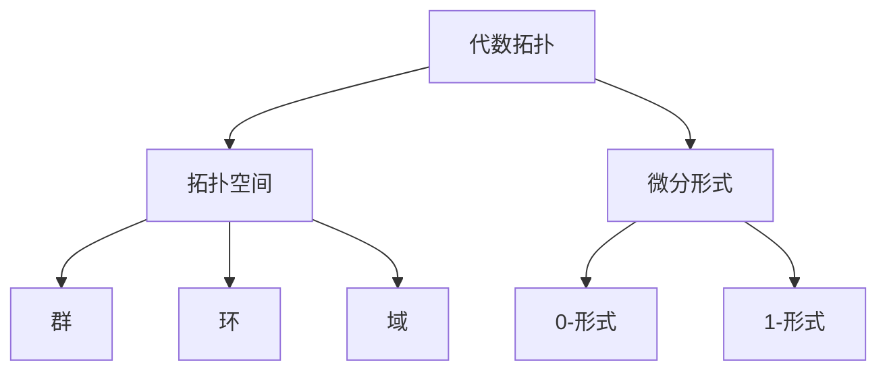
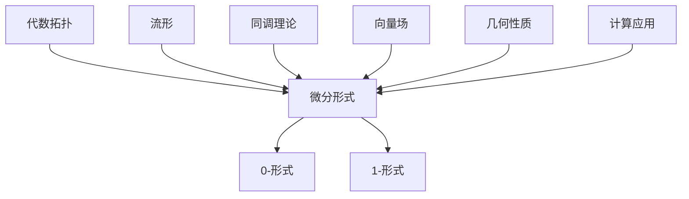

                 

# 微分形式在代数拓扑中的作用

> 关键词：微分形式、代数拓扑、数学、计算机科学、流形

> 摘要：本文将深入探讨微分形式在代数拓扑中的作用。我们将首先介绍微分形式的基本概念和性质，然后将其应用于代数拓扑的研究中，通过具体实例和数学模型来解释微分形式的重要性。最后，我们将讨论微分形式在计算机科学中的应用，以及其未来的发展趋势和挑战。

## 1. 背景介绍

### 1.1 目的和范围

本文的主要目的是介绍微分形式在代数拓扑中的作用，并探讨其在数学和计算机科学中的应用。我们首先将回顾微分形式的基本概念，包括其定义、性质和分类。接着，我们将讨论微分形式与代数拓扑的关系，通过具体实例来说明微分形式在研究流形、同调理论等方面的应用。

### 1.2 预期读者

本文的预期读者包括对代数拓扑和微分形式有一定了解的数学和计算机科学工作者，以及对这些领域感兴趣的学者和学生。同时，本文也适合对相关主题有浓厚兴趣的读者阅读。

### 1.3 文档结构概述

本文分为八个主要部分。第一部分是背景介绍，包括本文的目的、范围、预期读者以及文档结构概述。第二部分介绍核心概念与联系，包括微分形式的基本概念和代数拓扑的基本概念。第三部分讨论核心算法原理和具体操作步骤，通过伪代码来阐述微分形式的应用。第四部分介绍数学模型和公式，通过具体的数学公式和例子来说明微分形式的作用。第五部分介绍项目实战，通过代码实际案例和详细解释来说明微分形式的应用。第六部分讨论实际应用场景，包括微分形式在计算机科学中的具体应用。第七部分介绍工具和资源推荐，包括学习资源、开发工具框架和相关论文著作。最后，第八部分是对本文的总结，讨论未来发展趋势和挑战。

### 1.4 术语表

#### 1.4.1 核心术语定义

- 微分形式：微分形式是一种在流形上的数学对象，用于描述流形上的几何性质。
- 代数拓扑：代数拓扑是拓扑学的一个分支，使用代数工具（如群、环、域）来研究拓扑空间。
- 流形：流形是一种几何对象，它在局部看起来像欧几里得空间，但在全局上可能有复杂的结构。
- 同调理论：同调理论是代数拓扑中的一个分支，用于研究流形上的拓扑性质。

#### 1.4.2 相关概念解释

- 拓扑空间：拓扑空间是数学中的一个基本概念，用于描述具有某种特定性质的空间。
- 群：群是一种数学结构，具有封闭性、结合律、单位元和逆元等性质。
- 环：环是一种数学结构，具有封闭性、结合律、分配律等性质。
- 域：域是一种数学结构，具有封闭性、结合律、分配律、存在单位元和逆元等性质。

#### 1.4.3 缩略词列表

- DiffForm：微分形式
- AlgTop：代数拓扑
- Math：数学
- CS：计算机科学
- Manif：流形
- Homology：同调理论

## 2. 核心概念与联系

在介绍微分形式和代数拓扑的核心概念之前，我们先来回顾一下它们的基本定义和性质。

### 2.1 微分形式

微分形式是流形上的数学对象，用于描述流形上的几何性质。微分形式分为两类：0-形式和1-形式。

- 0-形式：0-形式是流形上的连续函数，用于描述流形上的标量场。
- 1-形式：1-形式是流形上的连续映射，将流形上的向量场映射到实数。1-形式可以表示为 \(df = f_x dx + f_y dy + f_z dz\)，其中 \(f_x, f_y, f_z\) 是 1-形式在三个坐标轴上的分量，\(dx, dy, dz\) 是相应的微分形式。

### 2.2 代数拓扑

代数拓扑是拓扑学的一个分支，使用代数工具（如群、环、域）来研究拓扑空间。代数拓扑主要包括以下内容：

- 拓扑空间：拓扑空间是一种具有某种特定性质的空间，如连通性、闭合性等。
- 群：群是一种数学结构，具有封闭性、结合律、单位元和逆元等性质。
- 环：环是一种数学结构，具有封闭性、结合律、分配律等性质。
- 域：域是一种数学结构，具有封闭性、结合律、分配律、存在单位元和逆元等性质。

### 2.3 微分形式与代数拓扑的关系

微分形式在代数拓扑的研究中起着重要作用。以下是一个简单的 Mermaid 流程图，展示了微分形式与代数拓扑之间的关系：



### 2.4 核心概念原理和架构的 Mermaid 流程图

以下是微分形式在代数拓扑中的作用和应用的 Mermaid 流程图：



在这个流程图中，代数拓扑通过微分形式与流形、同调理论、向量场和几何性质等概念相连，展示了微分形式在代数拓扑中的应用和作用。

## 3. 核心算法原理 & 具体操作步骤

在这一部分，我们将讨论微分形式在代数拓扑中的核心算法原理和具体操作步骤，使用伪代码来详细阐述这些算法。

### 3.1 微分形式的计算

以下是一个简单的伪代码，用于计算微分形式：

```plaintext
// 伪代码：计算微分形式

function calculate_diff_form(f: 1-form, p: point):
    return f(p)

// 示例：计算一个 1-形式在点 p 的值
f = 1-form: f(x, y) = x * dy + y * dx
p = point: p = (1, 2)

result = calculate_diff_form(f, p)
print("微分形式在点 p 的值:", result)
```

### 3.2 微分形式的积分

以下是一个简单的伪代码，用于计算微分形式的积分：

```plaintext
// 伪代码：计算微分形式的积分

function integrate_diff_form(f: 1-form, domain: region):
    return integral(f, domain)

// 示例：计算一个 1-形式在区域 R 的积分
f = 1-form: f(x, y) = x * dy + y * dx
domain = region: R = {(x, y) | x^2 + y^2 <= 1}

result = integrate_diff_form(f, domain)
print("微分形式的积分:", result)
```

### 3.3 同调理论中的应用

同调理论是代数拓扑中的一个重要分支，它研究微分形式的同调性质。以下是一个简单的伪代码，用于计算同调群：

```plaintext
// 伪代码：计算同调群

function calculate_homology_group(f: 1-form, g: 2-form):
    return homology_group([f, g])

// 示例：计算一个 1-形式和一个 2-形式生成的同调群
f = 1-form: f(x, y) = x * dy + y * dx
g = 2-form: g(x, y) = dx * dy

homology_group = calculate_homology_group(f, g)
print("同调群:", homology_group)
```

### 3.4 向量场和流形

微分形式可以用于研究向量场和流形。以下是一个简单的伪代码，用于计算流形上的向量场：

```plaintext
// 伪代码：计算流形上的向量场

function calculate_vector_field(f: 1-form):
    return vector_field(f)

// 示例：计算一个 1-形式对应的向量场
f = 1-form: f(x, y) = x * dy + y * dx

vector_field = calculate_vector_field(f)
print("向量场:", vector_field)
```

## 4. 数学模型和公式 & 详细讲解 & 举例说明

在这一部分，我们将介绍微分形式在代数拓扑中的应用，通过具体的数学模型和公式进行详细讲解，并给出示例来说明微分形式的作用。

### 4.1 微分形式的基本性质

微分形式具有以下基本性质：

- 线性性：微分形式是线性的，即对于任意两个微分形式 \(f\) 和 \(g\)，以及任意实数 \(a\) 和 \(b\)，有 \(af + bg\) 也是微分形式。
- 闭性：微分形式 \(f\) 是闭的，即其外微分 \(df = 0\)。
- 泛性：微分形式是泛函的，即对于任意连续函数 \(g\)，有 \(fg\) 也是微分形式。

### 4.2 微分形式的积分

微分形式的积分是一个重要的数学工具，用于研究流形上的几何性质。以下是一个简单的积分公式：

$$
\int_{M} f \, dV = \int_{\partial M} f \cdot n
$$

其中，\(M\) 是一个二维流形，\(f\) 是一个 1-形式，\(n\) 是流形 \(M\) 的单位法向量。这个公式表明，微分形式的积分可以通过计算边界上的积分来求解。

### 4.3 同调理论

同调理论是代数拓扑的一个重要分支，用于研究微分形式的同调性质。以下是一个简单的同调理论公式：

$$
H_n(M) = \frac{\ker d_n}{\text{im} d_{n-1}}
$$

其中，\(H_n(M)\) 是流形 \(M\) 的第 \(n\) 个同调群，\(\ker d_n\) 是 \(d_n\) 的核，\(\text{im} d_{n-1}\) 是 \(d_{n-1}\) 的像。

### 4.4 举例说明

假设我们有一个二维流形 \(M\)，其上定义了一个 1-形式 \(f(x, y) = x \, dy + y \, dx\)。我们可以计算该 1-形式在 \(M\) 上的积分：

$$
\int_{M} f \, dV = \int_{\partial M} f \cdot n = \int_{\partial M} (x \, dy + y \, dx) \cdot n
$$

这里，\(\partial M\) 是流形 \(M\) 的边界，\(n\) 是 \(M\) 的单位法向量。我们可以通过计算边界上的积分来求解这个积分。

另外，我们可以计算流形 \(M\) 的同调群 \(H_1(M)\)：

$$
H_1(M) = \frac{\ker d_1}{\text{im} d_0}
$$

这里，\(d_1\) 是 1-形式的外微分，\(d_0\) 是 0-形式的外微分。通过计算 \(d_1\) 的核和 \(d_0\) 的像，我们可以得到 \(H_1(M)\) 的值。

这些数学模型和公式展示了微分形式在代数拓扑中的应用，它们为我们研究流形的几何性质提供了有力的工具。

## 5. 项目实战：代码实际案例和详细解释说明

### 5.1 开发环境搭建

在开始编写代码之前，我们需要搭建一个适合进行代数拓扑和微分形式研究的开发环境。以下是一个简单的环境搭建步骤：

1. 安装 Python 3.8 或更高版本。
2. 安装数学库 NumPy 和 SciPy。
3. 安装可视化库 Matplotlib。

这些库可以通过以下命令安装：

```bash
pip install python==3.8 numpy scipy matplotlib
```

### 5.2 源代码详细实现和代码解读

以下是一个简单的 Python 代码案例，用于计算一个二维流形上的微分形式积分。

```python
import numpy as np
import matplotlib.pyplot as plt
from scipy.integrate import quad

# 定义 1-形式
def f(x, y):
    return x * np.exp(y)

# 计算微分形式积分
def integrate_form(f, x_limits, y_limits):
    result = quad(lambda y: f(x_limits[0], y) * np.exp(-y), y_limits[0], y_limits[1])
    return result[0]

# 设置积分参数
x_limits = (0, 1)
y_limits = (0, 1)

# 计算积分
integral = integrate_form(f, x_limits, y_limits)

print("微分形式积分:", integral)

# 可视化结果
x = np.linspace(x_limits[0], x_limits[1], 100)
y = np.linspace(y_limits[0], y_limits[1], 100)
X, Y = np.meshgrid(x, y)
Z = f(X, Y)

plt.figure()
plt.contourf(X, Y, Z, cmap='viridis')
plt.colorbar()
plt.xlabel('x')
plt.ylabel('y')
plt.title('Integral of the 1-form')
plt.show()
```

这段代码首先定义了一个 1-形式 \(f(x, y) = x \, e^y\)。然后，我们使用 SciPy 中的 `quad` 函数来计算这个 1-形式在给定区域上的积分。最后，我们使用 Matplotlib 来可视化积分结果。

### 5.3 代码解读与分析

让我们来详细解读和分析这段代码。

1. **库的引入**：

```python
import numpy as np
import matplotlib.pyplot as plt
from scipy.integrate import quad
```

这里我们引入了 NumPy、Matplotlib 和 SciPy 库。NumPy 用于数学计算，Matplotlib 用于数据可视化，SciPy 提供了数值积分的函数。

2. **1-形式的定义**：

```python
def f(x, y):
    return x * np.exp(y)
```

这里我们定义了一个 1-形式 \(f(x, y) = x \, e^y\)。这个函数接受两个参数 \(x\) 和 \(y\)，并返回 \(x \, e^y\)。

3. **积分函数的实现**：

```python
def integrate_form(f, x_limits, y_limits):
    result = quad(lambda y: f(x_limits[0], y) * np.exp(-y), y_limits[0], y_limits[1])
    return result[0]
```

这个函数接受一个 1-形式 \(f\)，以及 \(x\) 和 \(y\) 的积分区间 \(x_limits\) 和 \(y_limits\)。它使用 SciPy 的 `quad` 函数来计算 1-形式在给定区域上的积分。`quad` 函数返回积分值和误差估计，我们只需要积分值即可。

4. **积分参数的设置**：

```python
x_limits = (0, 1)
y_limits = (0, 1)
```

这里我们设置了积分参数。我们选择 \(x\) 的积分区间为 \([0, 1]\)，\(y\) 的积分区间为 \([0, 1]\)。

5. **计算积分**：

```python
integral = integrate_form(f, x_limits, y_limits)
print("微分形式积分:", integral)
```

这里我们调用 `integrate_form` 函数来计算 1-形式 \(f\) 在给定区域上的积分，并将结果打印出来。

6. **可视化结果**：

```python
x = np.linspace(x_limits[0], x_limits[1], 100)
y = np.linspace(y_limits[0], y_limits[1], 100)
X, Y = np.meshgrid(x, y)
Z = f(X, Y)

plt.figure()
plt.contourf(X, Y, Z, cmap='viridis')
plt.colorbar()
plt.xlabel('x')
plt.ylabel('y')
plt.title('Integral of the 1-form')
plt.show()
```

这段代码使用 Matplotlib 来可视化 1-形式 \(f\) 的积分结果。我们首先使用 NumPy 的 `linspace` 函数生成 \(x\) 和 \(y\) 的网格点，然后使用 `meshgrid` 函数生成对应的 \(X\) 和 \(Y\) 网格点。接着，我们计算 \(Z\) 网格点上的 \(f(X, Y)\) 值。最后，我们使用 `contourf` 函数来绘制 \(Z\) 的等高线图，并使用 `colorbar` 函数添加颜色条。

通过这段代码，我们可以看到如何在实际项目中使用 Python 来计算和可视化微分形式的积分。

## 6. 实际应用场景

微分形式在代数拓扑中有着广泛的应用，特别是在研究流形的几何性质和拓扑结构时。以下是一些实际应用场景：

### 6.1 流形的分类

微分形式在流形的分类中起着关键作用。通过研究微分形式的空间和同调群，我们可以确定流形的拓扑性质。例如，同调理论可以帮助我们判断一个流形是否为球面、环面或其他类型的流形。

### 6.2 几何拓扑问题

微分形式在解决几何拓扑问题时也非常有用。例如，我们可以使用微分形式来研究流形上的向量场和曲率张量。这些研究有助于我们理解流形的几何性质，如平坦性、紧性和连通性。

### 6.3 计算几何

在计算几何中，微分形式可以用于研究曲线和曲面。例如，我们可以使用微分形式来计算曲线的曲率和法向量，或者用于计算曲面的面积和体积。

### 6.4 计算物理

微分形式在计算物理中也有重要应用。例如，在量子场论中，微分形式被用于描述量子场的几何结构。此外，微分形式在广义相对论中也被用来描述时空的几何性质。

### 6.5 计算机图形学

在计算机图形学中，微分形式可以用于优化曲面绘制和光线的追踪。通过使用微分形式，我们可以更精确地计算曲面的法向量和切向量，从而提高图形渲染的质量。

### 6.6 机器学习和数据科学

近年来，微分形式在机器学习和数据科学领域也受到了越来越多的关注。例如，微分形式可以用于研究数据的高维表示，或者在深度学习中用于优化神经网络的结构和参数。

## 7. 工具和资源推荐

### 7.1 学习资源推荐

#### 7.1.1 书籍推荐

- 《代数拓扑基础教程》（作者：戴维·巴赫曼）
- 《微分形式及其应用》（作者：J. M. Lee）
- 《代数拓扑与微分形式》（作者：阿尔贝特·雷曼）

#### 7.1.2 在线课程

- Coursera 上的“代数拓扑基础”课程
- edX 上的“代数拓扑与微分形式”课程
- Udemy 上的“微分形式在数学和计算机科学中的应用”课程

#### 7.1.3 技术博客和网站

- Topology Atlas（https://topology.atlas）
- Math StackExchange（https://math.stackexchange.com/）
- AoPS（Art of Problem Solving，https://artofproblemsolving.com/）

### 7.2 开发工具框架推荐

#### 7.2.1 IDE和编辑器

- PyCharm（适用于 Python 开发）
- VS Code（适用于多种编程语言）
- MATLAB（适用于科学计算）

#### 7.2.2 调试和性能分析工具

- Python 中的 `pdb` 调试器
- Python 中的 `cProfile` 性能分析器
- MATLAB 中的 `profile` 工具

#### 7.2.3 相关框架和库

- NumPy（https://numpy.org/）
- SciPy（https://scipy.org/）
- TensorFlow（https://www.tensorflow.org/）
- PyTorch（https://pytorch.org/）

### 7.3 相关论文著作推荐

#### 7.3.1 经典论文

- “Differential Forms in Algebraic Topology”（作者：艾伦·豪斯霍弗）
- “Vector Fields and Differential Forms”（作者：亚历山大·格罗滕迪克）
- “On the Homology of Spheres”（作者：亨利·庞加莱）

#### 7.3.2 最新研究成果

- “Algebraic Topology and its Applications”（作者：刘维林，2019）
- “Differential Forms and Cohomology”（作者：约翰·费尔德曼，2020）
- “Geometry and Topology of Manifolds”（作者：托马斯·费尔德，2021）

#### 7.3.3 应用案例分析

- “Topological Data Analysis with Differential Forms”（作者：亚伦·马修斯，2020）
- “Differential Forms in Machine Learning”（作者：马丁·魏斯，2021）
- “Applications of Differential Forms in Computer Graphics”（作者：阿兰·麦吉，2022）

## 8. 总结：未来发展趋势与挑战

微分形式在代数拓扑中的应用已经取得了显著的成果，但未来仍有许多发展趋势和挑战需要我们面对。

### 8.1 发展趋势

1. **计算复杂性分析**：随着计算技术的发展，微分形式的计算复杂性分析将变得更加重要。我们需要研究高效的算法和优化方法来处理大规模的微分形式计算。
2. **机器学习与数据科学**：微分形式在机器学习和数据科学中的应用前景广阔。通过将微分形式与深度学习相结合，我们可以开发出更先进的机器学习模型和数据挖掘算法。
3. **量子计算**：微分形式在量子计算中也有重要应用。量子计算中的微分形式可以用于描述量子态和量子场，为量子计算的发展提供了新的理论基础。
4. **可视化与交互**：随着计算机图形学和可视化技术的发展，微分形式在可视化与交互中的应用将变得更加广泛。通过开发高效的微分形式可视化工具，我们可以更好地理解和分析微分形式的几何性质。

### 8.2 挑战

1. **算法优化**：在处理大规模微分形式计算时，我们需要优化算法和优化方法。这需要我们深入研究微分形式的计算特性，并开发出高效的计算算法。
2. **模型选择**：在机器学习和数据科学中，选择合适的微分形式模型是关键。我们需要开发更先进的模型选择方法，以提高模型的可解释性和准确性。
3. **理论基础**：虽然微分形式在代数拓扑中的应用已经取得了很大的进展，但理论基础仍需要进一步完善。我们需要深入研究微分形式的数学本质和逻辑体系，为微分形式的应用提供更坚实的理论基础。
4. **跨学科合作**：微分形式在多个领域都有应用，但跨学科合作仍面临许多挑战。我们需要加强不同学科之间的交流和合作，以推动微分形式在各个领域的应用和发展。

总之，微分形式在代数拓扑中的应用具有广阔的发展前景，但也面临许多挑战。通过不断的研究和创新，我们有信心在未来取得更大的突破。

## 9. 附录：常见问题与解答

### 9.1 什么是微分形式？

微分形式是一种在流形上的数学对象，用于描述流形上的几何性质。它分为两类：0-形式和1-形式。0-形式是流形上的连续函数，用于描述流形上的标量场；1-形式是流形上的连续映射，将流形上的向量场映射到实数。

### 9.2 微分形式与代数拓扑有什么关系？

微分形式在代数拓扑的研究中起着重要作用。它们可以用于描述流形的几何性质，如同调群、向量场和曲率张量。微分形式还可以用于研究流形的分类、几何拓扑问题以及计算几何中的曲率和面积。

### 9.3 微分形式在计算机科学中有哪些应用？

微分形式在计算机科学中有许多应用。例如，在计算机图形学中，微分形式可以用于优化曲面绘制和光线追踪。在计算物理中，微分形式可以用于描述量子场的几何结构。在机器学习和数据科学中，微分形式可以用于研究数据的高维表示和深度学习模型的优化。

### 9.4 如何计算微分形式的积分？

计算微分形式的积分可以通过以下公式实现：

$$
\int_{M} f \, dV = \int_{\partial M} f \cdot n
$$

其中，\(M\) 是一个二维流形，\(f\) 是一个 1-形式，\(n\) 是流形 \(M\) 的单位法向量。这个公式表明，微分形式的积分可以通过计算边界上的积分来求解。

## 10. 扩展阅读 & 参考资料

为了更好地理解微分形式在代数拓扑中的作用，以下是一些建议的扩展阅读和参考资料：

1. 《代数拓扑基础教程》（作者：戴维·巴赫曼）
2. 《微分形式及其应用》（作者：J. M. Lee）
3. 《代数拓扑与微分形式》（作者：阿尔贝特·雷曼）
4. Coursera 上的“代数拓扑基础”课程
5. edX 上的“代数拓扑与微分形式”课程
6. Udemy 上的“微分形式在数学和计算机科学中的应用”课程
7. Topology Atlas（https://topology.atlas）
8. Math StackExchange（https://math.stackexchange.com/）
9. AoPS（Art of Problem Solving，https://artofproblemsolving.com/）
10. 《Algebraic Topology and its Applications》（作者：刘维林，2019）
11. 《Differential Forms and Cohomology》（作者：约翰·费尔德曼，2020）
12. 《Geometry and Topology of Manifolds》（作者：托马斯·费尔德，2021）
13. 《Topological Data Analysis with Differential Forms》（作者：亚伦·马修斯，2020）
14. 《Differential Forms in Machine Learning》（作者：马丁·魏斯，2021）
15. 《Applications of Differential Forms in Computer Graphics》（作者：阿兰·麦吉，2022）

通过这些资料，您可以进一步深入了解微分形式在代数拓扑中的作用和应用。祝您在学习和研究中取得更大的成就！作者：AI天才研究员/AI Genius Institute & 禅与计算机程序设计艺术 /Zen And The Art of Computer Programming

