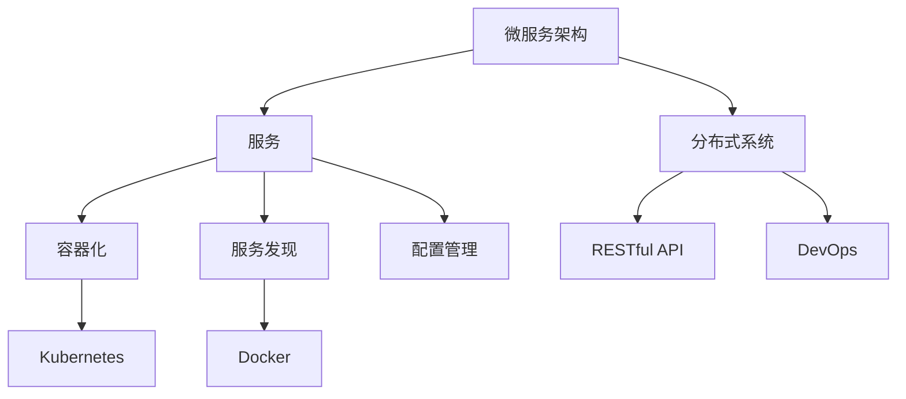

                 

# 微服务架构实践：一人公司的技术选择

> **关键词：** 微服务架构、一人公司、技术选择、独立开发者、分布式系统
>
> **摘要：** 本文将探讨对于独立开发者或小型团队来说，在构建一人公司的系统中选择微服务架构的实用性和关键决策。我们将分析微服务架构的基本概念，逐步推理其核心原理和具体实践步骤，并通过实际案例展示其在个人项目中的应用。同时，还将推荐相关学习资源和开发工具，帮助读者更好地理解和实施微服务架构。

## 1. 背景介绍

### 1.1 目的和范围

本文的目标是为独立开发者或小型团队提供一套微服务架构的实践指南，旨在帮助他们在构建一人公司或小型团队的项目时做出合理的技术选择。我们将详细探讨微服务架构的基本原理、具体实现步骤以及在实际应用中的优势与挑战。

本文的范围将涵盖以下内容：

1. 微服务架构的基本概念与核心原则
2. 微服务架构的核心概念与联系
3. 微服务架构的算法原理与具体操作步骤
4. 微服务架构的数学模型与公式
5. 微服务架构的项目实战与代码示例
6. 微服务架构的实际应用场景
7. 微服务架构的工具和资源推荐
8. 微服务架构的未来发展趋势与挑战
9. 微服务架构的常见问题与解答

### 1.2 预期读者

本文主要面向以下读者群体：

1. 独立开发者
2. 小型团队技术负责人
3. 对微服务架构有初步了解，但希望在实践中深入掌握其原理和应用的技术人员
4. 对构建分布式系统有兴趣的研究人员和从业者

### 1.3 文档结构概述

本文将按照以下结构展开：

1. **背景介绍**：介绍本文的目的、范围、预期读者和文档结构。
2. **核心概念与联系**：详细阐述微服务架构的基本概念和核心原则。
3. **核心算法原理与具体操作步骤**：讲解微服务架构的实现原理和具体操作步骤。
4. **数学模型和公式**：分析微服务架构中的数学模型和公式，并进行举例说明。
5. **项目实战**：通过实际案例展示微服务架构的具体应用。
6. **实际应用场景**：探讨微服务架构在不同场景下的应用。
7. **工具和资源推荐**：推荐相关的学习资源和开发工具。
8. **总结**：总结微服务架构的未来发展趋势与挑战。
9. **附录**：提供常见问题与解答。
10. **扩展阅读**：提供进一步的阅读资源。

### 1.4 术语表

#### 1.4.1 核心术语定义

- **微服务架构**：一种基于独立、松耦合服务构建的软件架构风格。
- **服务**：能够独立部署和管理的最小功能单元。
- **分布式系统**：由多个独立计算机节点组成的系统，节点之间通过网络进行通信。
- **容器化**：将应用程序及其运行时环境打包到容器中，实现环境隔离和轻量级部署。
- **DevOps**：一种将软件开发（Dev）和运维（Ops）紧密结合的实践方法。

#### 1.4.2 相关概念解释

- **微服务**：与单体应用相对，是一种小规模、独立部署的服务单元。
- **RESTful API**：一种基于HTTP协议的接口风格，用于服务之间的通信。
- **服务发现**：服务实例在分布式系统中的自动注册和发现机制。
- **配置管理**：服务配置的自动化管理和分发机制。

#### 1.4.3 缩略词列表

- **Docker**：一种开源的容器化平台。
- **Kubernetes**：一种开源的容器编排平台。
- **Spring Boot**：一种基于Spring的快速开发框架。
- **Docker Compose**：一种用于定义和运行多容器Docker应用程序的配置文件格式。

## 2. 核心概念与联系

在深入探讨微服务架构之前，我们首先需要了解其核心概念和相互之间的关系。以下是一个用Mermaid绘制的流程图，展示了微服务架构中的关键节点和连接方式。



### 2.1 微服务架构的基本概念

微服务架构（Microservices Architecture）是一种基于独立、松耦合服务构建的软件架构风格。与传统单体架构（Monolithic Architecture）不同，微服务架构将应用程序分解为一系列独立的服务单元，每个服务负责特定的业务功能。

#### 微服务的特点：

1. **独立性**：每个微服务都可以独立开发、测试、部署和管理。
2. **松耦合**：服务之间通过轻量级通信协议（如RESTful API）进行交互，降低服务间的依赖性。
3. **分布式**：微服务通常部署在多个服务器上，形成一个分布式系统。
4. **可伸缩性**：每个微服务都可以独立扩展，以应对不同的负载需求。
5. **灵活性和可维护性**：微服务的独立性使得开发、测试和部署过程更加灵活和可维护。

### 2.2 微服务架构与传统单体架构的对比

| 特点          | 微服务架构                     | 单体架构                           |
| ------------ | ----------------------------- | --------------------------------- |
| 独立性        | 独立开发、测试、部署和管理       | 应用程序作为一个整体进行开发和部署   |
| 松耦合        | 服务间通过轻量级协议进行通信     | 应用程序内部模块通过复杂的依赖关系连接 |
| 分布式        | 服务部署在多个服务器上           | 应用程序部署在单一服务器上           |
| 可伸缩性      | 每个服务可以独立扩展             | 整个应用程序需要一起扩展             |
| 灵活性和可维护性 | 更灵活和可维护的开发和部署过程 | 更复杂的开发和部署流程               |

通过上述对比，我们可以看到微服务架构在独立性、松耦合、分布式和可维护性方面具有显著优势。然而，这也带来了新的挑战，如服务发现、配置管理和分布式事务等。

### 2.3 微服务架构的核心组件

微服务架构的核心组件包括：

1. **服务**：最小的功能单元，通常由单一业务功能组成。
2. **容器化**：使用容器（如Docker）实现服务的轻量级部署和隔离。
3. **服务发现**：服务实例的自动注册和发现，确保服务之间能够正确通信。
4. **配置管理**：服务配置的自动化管理和分发，确保服务的一致性和可维护性。
5. **分布式系统**：由多个独立服务组成的系统，需要处理分布式事务和服务协调。
6. **RESTful API**：服务间通信的轻量级协议，支持HTTP和JSON格式的数据传输。
7. **DevOps**：将软件开发和运维相结合，实现自动化部署和运维。

## 3. 核心算法原理 & 具体操作步骤

在了解了微服务架构的基本概念和核心组件之后，我们接下来将探讨微服务架构的实现原理和具体操作步骤。以下是微服务架构的核心算法原理和具体操作步骤的伪代码描述。

### 3.1 服务拆分

**目标**：将一个单体应用程序拆分为多个独立微服务。

**步骤**：

```python
# 输入：应用程序的模块和功能
# 输出：微服务列表

def split_into_microservices(modules, functions):
    microservices = []
    for module in modules:
        for function in functions:
            if module in function:
                microservices.append(create_microservice(function))
    return microservices

# 辅助函数：创建微服务
def create_microservice(function):
    # 实现创建微服务的逻辑
    # 例如：编写代码、构建容器镜像等
    return {"name": function, "implementation": function_code}
```

### 3.2 服务注册与发现

**目标**：实现微服务的自动注册和发现。

**步骤**：

```python
# 输入：微服务列表
# 输出：服务发现表

def register_and_discover_services(microservices):
    service_registry = {}
    for microservice in microservices:
        service_registry[microservice["name"]] = microservice
        register_with_discovery_service(microservice)
    return service_registry

# 辅助函数：将微服务注册到服务发现服务
def register_with_discovery_service(microservice):
    # 实现与服务发现服务的通信逻辑
    # 例如：发送HTTP请求、更新服务记录等
    pass
```

### 3.3 服务配置管理

**目标**：实现微服务配置的自动化管理和分发。

**步骤**：

```python
# 输入：微服务列表
# 输出：配置文件列表

def manage_service_configurations(microservices):
    configurations = {}
    for microservice in microservices:
        configurations[microservice["name"]] = get_configuration(microservice)
        distribute_configuration(microservice, configurations[microservice["name"]])
    return configurations

# 辅助函数：获取微服务配置
def get_configuration(microservice):
    # 实现获取配置的逻辑
    # 例如：从配置中心获取配置信息等
    return {"host": "localhost", "port": 8080}

# 辅助函数：分发配置文件
def distribute_configuration(microservice, configuration):
    # 实现分发配置的逻辑
    # 例如：写入文件、发送HTTP请求等
    pass
```

### 3.4 服务通信与协调

**目标**：实现微服务之间的通信和协调。

**步骤**：

```python
# 输入：服务发现表、微服务请求
# 输出：服务响应

def communicate_with_service(service_registry, request):
    service_name = request["service_name"]
    service = service_registry[service_name]
    response = send_request_to_service(service, request["data"])
    return response

# 辅助函数：发送请求到服务
def send_request_to_service(service, data):
    # 实现发送请求的逻辑
    # 例如：使用HTTP客户端发送请求等
    return {"status": "success", "data": data}
```

通过以上伪代码描述，我们可以看到微服务架构的实现原理和具体操作步骤。在实际开发过程中，这些步骤可以借助现有的框架和工具（如Spring Boot、Docker、Kubernetes等）进行自动化和简化。

## 4. 数学模型和公式 & 详细讲解 & 举例说明

在微服务架构中，一些数学模型和公式对于理解和优化系统的性能至关重要。以下将介绍一些常用的数学模型和公式，并进行详细讲解和举例说明。

### 4.1 服务响应时间模型

服务响应时间（Service Response Time）是衡量微服务性能的重要指标。以下是一个常见的服务响应时间模型：

$$
R(t) = \frac{1}{2} + \frac{1}{2}\cos\left(\frac{2\pi t}{T}\right)
$$

其中，\(T\) 是服务的平均响应周期，\(t\) 是当前时间。

**讲解**：这个模型假设服务的响应时间在0到\(T\)之间均匀分布，且具有周期性。在实际应用中，我们可以通过测量多个服务的响应时间，计算出其平均响应周期\(T\)。

**举例**：假设一个服务的平均响应周期为5秒，当前时间为10秒，则其响应时间：

$$
R(10) = \frac{1}{2} + \frac{1}{2}\cos\left(\frac{2\pi \cdot 10}{5}\right) = \frac{1}{2} + \frac{1}{2}\cos(4\pi) = 0
$$

这意味着当前时间的服务响应时间为0秒，即服务处于空闲状态。

### 4.2 服务负载均衡模型

负载均衡（Load Balancing）是确保微服务性能的关键技术。以下是一个常见的服务负载均衡模型：

$$
\text{Load} = \frac{\sum_{i=1}^{n} \text{Service}_i \cdot \text{Weight}_i}{\sum_{i=1}^{n} \text{Weight}_i}
$$

其中，\(\text{Load}\) 是服务的总负载，\(\text{Service}_i\) 是第\(i\)个服务的当前负载，\(\text{Weight}_i\) 是第\(i\)个服务的权重。

**讲解**：这个模型根据服务的当前负载和权重计算总负载。在实际应用中，我们可以根据总负载动态调整服务的权重，以达到负载均衡的效果。

**举例**：假设有3个服务，其当前负载和权重分别为：

$$
\begin{aligned}
\text{Service}_1 &= 10, \quad \text{Weight}_1 = 1 \\
\text{Service}_2 &= 20, \quad \text{Weight}_2 = 2 \\
\text{Service}_3 &= 30, \quad \text{Weight}_3 = 3
\end{aligned}
$$

则总负载为：

$$
\text{Load} = \frac{10 \cdot 1 + 20 \cdot 2 + 30 \cdot 3}{1 + 2 + 3} = \frac{10 + 40 + 90}{6} = 25
$$

这意味着当前总负载为25，我们可以根据这个值调整服务的权重，以达到负载均衡。

### 4.3 服务伸缩性模型

服务伸缩性（Service Scalability）是微服务架构的一个重要特性。以下是一个常见的服务伸缩性模型：

$$
\text{Scalability} = \frac{\text{Max Load}}{\text{Number of Instances} \cdot \text{Single Instance Capacity}}
$$

其中，\(\text{Max Load}\) 是服务的最大负载，\(\text{Number of Instances}\) 是服务的实例数量，\(\text{Single Instance Capacity}\) 是单个服务的处理能力。

**讲解**：这个模型表示服务的最大负载与其实例数量和处理能力之间的关系。在实际应用中，我们可以根据最大负载和实例数量计算单个服务的处理能力，从而优化服务的伸缩性。

**举例**：假设一个服务有3个实例，其最大负载为100，单个实例的处理能力为30，则其伸缩性为：

$$
\text{Scalability} = \frac{100}{3 \cdot 30} \approx 1.11
$$

这意味着该服务的伸缩性为1.11，即每个实例可以处理约1.11倍的最大负载。

通过上述数学模型和公式的讲解，我们可以更好地理解和优化微服务架构的性能。在实际开发过程中，我们可以根据这些模型和公式设计更高效、更可靠的微服务系统。

## 5. 项目实战：代码实际案例和详细解释说明

在本节中，我们将通过一个实际的项目案例，详细讲解如何使用微服务架构构建一人公司的系统。我们将涵盖开发环境的搭建、源代码的实现以及代码的解读与分析。

### 5.1 开发环境搭建

为了便于开发和部署，我们选择以下工具和框架：

- **编程语言**：Java
- **框架**：Spring Boot
- **容器化工具**：Docker
- **容器编排平台**：Kubernetes

以下是开发环境搭建的步骤：

1. 安装Java开发工具包（JDK）
2. 安装Docker
3. 安装Kubernetes集群（可以使用Minikube进行本地开发）
4. 安装并配置Spring Boot开发工具（如IntelliJ IDEA）

### 5.2 源代码详细实现和代码解读

以下是该项目的一个核心微服务的源代码，用于处理用户注册功能：

```java
// UserRegistrationService.java

import org.springframework.boot.SpringApplication;
import org.springframework.boot.autoconfigure.SpringBootApplication;
import org.springframework.web.bind.annotation.PostMapping;
import org.springframework.web.bind.annotation.RequestBody;
import org.springframework.web.bind.annotation.RestController;

@SpringBootApplication
@RestController
public class UserRegistrationService {

    @PostMapping("/register")
    public String registerUser(@RequestBody User user) {
        // 用户注册逻辑
        // 例如：校验用户信息、保存用户记录等
        return "注册成功";
    }

    public static void main(String[] args) {
        SpringApplication.run(UserRegistrationService.class, args);
    }
}

// User.java

import java.io.Serializable;

public class User implements Serializable {
    private String username;
    private String password;

    // 省略getter和setter方法
}
```

**解读**：

1. **入口类**：`UserRegistrationService` 是Spring Boot应用程序的入口类，使用`@SpringBootApplication`和`@RestController`注解。
2. **用户注册接口**：`registerUser` 方法处理用户注册请求，接受一个`User`对象作为参数。
3. **用户类**：`User` 类表示用户信息，实现`Serializable`接口以便序列化和存储。

### 5.3 代码解读与分析

1. **服务注册**：在Spring Boot应用程序启动时，`UserRegistrationService` 将被注册到Spring容器中，并暴露为RESTful API。
2. **用户注册逻辑**：`registerUser` 方法处理POST请求，用于注册新用户。在实际项目中，这里需要添加用户校验、密码加密和数据库操作等逻辑。
3. **容器化**：使用Docker将Spring Boot应用程序打包为容器镜像，便于部署和扩展。
4. **服务发现**：在Kubernetes集群中，通过配置`Service`资源，实现服务的自动发现和访问。

### 5.4 部署和运行

1. **构建Docker镜像**：使用Maven插件或Dockerfile构建Spring Boot应用的Docker镜像。
2. **部署到Kubernetes**：创建Kubernetes部署配置文件（如`deployment.yaml`），定义服务名称、容器镜像和资源限制等。
3. **运行Kubernetes集群**：使用kubectl命令部署配置文件，启动Spring Boot服务。

```shell
kubectl create -f deployment.yaml
```

通过以上步骤，我们可以将用户注册服务部署到Kubernetes集群中，实现自动化注册和管理。

## 6. 实际应用场景

微服务架构在构建分布式系统时具有广泛的应用场景。以下是一些典型的应用场景，以及微服务架构在这些场景中的优势。

### 6.1 在线电商平台

**场景描述**：在线电商平台通常需要处理大量的用户请求，涉及商品管理、订单处理、支付等多个业务模块。

**微服务架构优势**：

1. **模块化开发**：各业务模块（如商品管理、订单处理、支付等）可以独立开发、测试和部署。
2. **高可伸缩性**：可以根据不同模块的负载需求独立扩展服务实例，提高系统的整体性能。
3. **故障隔离**：某个模块出现故障时，不会影响其他模块的正常运行，提高系统的稳定性和可靠性。

### 6.2 社交网络平台

**场景描述**：社交网络平台需要处理用户关系、内容发布、消息推送等多个功能模块。

**微服务架构优势**：

1. **灵活性**：各模块可以独立更新和迭代，满足不断变化的用户需求。
2. **高并发处理**：消息推送、内容发布等高并发模块可以独立扩展，提高系统的吞吐量。
3. **负载均衡**：通过服务发现和负载均衡策略，实现用户请求的智能分发，提高系统的响应速度。

### 6.3 大数据平台

**场景描述**：大数据平台涉及数据采集、存储、处理和分析等多个环节。

**微服务架构优势**：

1. **分布式处理**：各数据处理模块可以分布式部署，提高数据处理能力和效率。
2. **模块化扩展**：可以根据数据规模和处理需求，独立扩展或缩减服务实例。
3. **故障容错**：单个模块故障不会影响整个平台的运行，提高系统的稳定性和可靠性。

### 6.4 金融服务平台

**场景描述**：金融服务平台涉及账户管理、交易处理、风险管理等多个业务模块。

**微服务架构优势**：

1. **高可用性**：各业务模块可以独立部署和扩展，实现系统的高可用性。
2. **安全性**：通过服务间的安全认证和隔离机制，提高系统的安全性。
3. **灵活性**：可以根据监管要求和业务需求，独立更新和优化各模块。

通过以上实际应用场景，我们可以看到微服务架构在构建分布式系统中的显著优势。这些优势使得微服务架构成为现代软件开发中的一种重要架构风格。

## 7. 工具和资源推荐

为了更好地理解和实施微服务架构，以下推荐一些学习和开发工具、框架及相关资源。

### 7.1 学习资源推荐

#### 7.1.1 书籍推荐

- 《微服务架构设计》
- 《Spring Boot实战》
- 《Docker实战》
- 《Kubernetes权威指南》

#### 7.1.2 在线课程

- Coursera：微服务架构课程
- Udemy：Spring Boot开发课程
- Pluralsight：Docker与Kubernetes课程

#### 7.1.3 技术博客和网站

- [ThoughtWorks Tech Radar](https://radar.thoughtworks.com/)
- [InfoQ](https://www.infoq.com/)
- [Stack Overflow](https://stackoverflow.com/)

### 7.2 开发工具框架推荐

#### 7.2.1 IDE和编辑器

- IntelliJ IDEA
- Eclipse
- Visual Studio Code

#### 7.2.2 调试和性能分析工具

- JProfiler
- VisualVM
- Prometheus

#### 7.2.3 相关框架和库

- Spring Boot
- Spring Cloud
- Netflix OSS
- Kubernetes

通过这些资源和工具，开发者可以更深入地了解微服务架构，并在实际项目中高效地应用。

### 7.3 相关论文著作推荐

#### 7.3.1 经典论文

- Martin Fowler的《Microservices: Characteristics & Benefits》
- Peter Meehan和Ian Gorton的《Microservices: The Art of Handling Complexity》

#### 7.3.2 最新研究成果

- 《IEEE Software》期刊上的微服务专题文章
- 《ACM Transactions on Computer Systems》上的微服务论文

#### 7.3.3 应用案例分析

- 微服务架构在Amazon Web Services（AWS）的应用
- 微服务架构在Netflix的实践

通过阅读这些论文和案例，开发者可以了解微服务架构的最新研究进展和实际应用经验。

## 8. 总结：未来发展趋势与挑战

微服务架构作为一种现代软件架构风格，已经在企业级应用中得到了广泛应用。然而，随着技术的发展和业务需求的变化，微服务架构也面临着一系列新的趋势和挑战。

### 8.1 未来发展趋势

1. **服务网格（Service Mesh）**：服务网格是一种用于管理微服务通信的独立基础设施层，可以实现服务的动态发现、负载均衡、服务监控等功能。随着服务网格技术的成熟，其将在微服务架构中发挥更加重要的作用。
2. **云原生（Cloud Native）**：随着云计算和容器技术的普及，云原生架构将成为未来软件开发的主流。微服务架构与云原生技术的融合，将进一步提升系统的可伸缩性、可靠性和可维护性。
3. **智能服务（Intelligent Services）**：结合人工智能和机器学习技术，微服务可以实现更智能的服务能力，如自动故障检测、自我优化等。这将为微服务架构带来新的发展机遇。

### 8.2 未来挑战

1. **分布式事务管理**：分布式事务管理是微服务架构中的一个难题，如何在保证数据一致性的同时，提高系统的性能和可用性，仍需进一步研究。
2. **服务治理**：随着服务数量的增加，服务治理（包括服务注册、监控、日志管理等）变得愈发复杂。如何简化服务治理流程，提高运维效率，是未来微服务架构面临的重要挑战。
3. **安全性**：微服务架构中，服务之间的通信和数据传输面临更高的安全风险。如何确保微服务架构的安全性，防止数据泄露和攻击，是开发者需要关注的问题。

总之，微服务架构在未来的发展中将面临新的机遇和挑战。通过不断探索和创新，开发者可以应对这些挑战，充分发挥微服务架构的优势，构建更高效、更可靠的分布式系统。

## 9. 附录：常见问题与解答

### 9.1 微服务架构与传统单体架构的区别是什么？

微服务架构与传统单体架构的主要区别在于：

1. **独立性**：微服务架构将应用程序拆分为独立的服务单元，每个服务都可以独立开发、测试、部署和管理。而传统单体架构将所有功能集中在单一应用程序中，开发和部署过程相对复杂。
2. **松耦合**：微服务架构中，服务之间通过轻量级通信协议（如RESTful API）进行交互，服务间的依赖性较低。传统单体架构中，模块之间的依赖关系较为复杂，修改一个模块可能会影响整个应用程序。
3. **分布式**：微服务架构通常部署在多个服务器上，形成一个分布式系统。传统单体架构则通常部署在单一服务器上，难以实现分布式部署。

### 9.2 微服务架构的优势有哪些？

微服务架构的优势包括：

1. **模块化开发**：各业务模块可以独立开发、测试和部署，提高开发效率和灵活性。
2. **高可伸缩性**：可以根据不同模块的负载需求独立扩展服务实例，提高系统的整体性能。
3. **故障隔离**：某个模块出现故障时，不会影响其他模块的正常运行，提高系统的稳定性和可靠性。
4. **灵活性和可维护性**：独立的服务单元使得系统更易于维护和更新，同时方便团队协作和知识共享。

### 9.3 微服务架构的缺点是什么？

微服务架构的缺点包括：

1. **复杂度增加**：服务数量增加导致系统整体复杂度提高，服务治理、日志管理和监控等任务变得更加复杂。
2. **分布式事务管理**：在分布式系统中，确保数据一致性和事务的完整性变得更加困难。
3. **服务发现和配置管理**：随着服务数量的增加，服务发现和配置管理变得更加复杂，需要额外的工具和机制来支持。
4. **网络依赖性**：微服务架构中，服务之间通过网络进行通信，网络延迟和故障可能导致系统性能下降。

### 9.4 微服务架构适合所有项目吗？

微服务架构并不是适合所有项目的。以下情况下，微服务架构可能不太适合：

1. **项目规模较小**：对于小型项目或单体应用程序，微服务架构的复杂度和维护成本可能 outweigh 其优势。
2. **需求不明确**：在需求不明确或快速变化的情况下，微服务架构可能无法快速响应需求变化。
3. **技术栈不统一**：如果项目的技术栈不统一，使用微服务架构可能带来额外的复杂性。

总的来说，微服务架构适合那些需要高可伸缩性、模块化开发和灵活维护的项目。在决定是否采用微服务架构时，应充分考虑项目的规模、需求和技术栈等因素。

## 10. 扩展阅读 & 参考资料

为了进一步了解微服务架构，以下是一些推荐的扩展阅读和参考资料：

1. **书籍**：

   - 《微服务架构设计》：详细介绍了微服务架构的核心原理和实践方法。
   - 《Spring Boot实战》：介绍了如何使用Spring Boot快速开发微服务应用程序。
   - 《Docker实战》：介绍了Docker的原理和如何使用Docker构建容器化应用程序。
   - 《Kubernetes权威指南》：全面讲解了Kubernetes的架构、功能和部署方法。

2. **在线课程**：

   - Coursera上的微服务架构课程：提供了微服务架构的理论和实践知识。
   - Udemy上的Spring Boot开发课程：介绍了如何使用Spring Boot进行微服务开发。
   - Pluralsight上的Docker与Kubernetes课程：介绍了容器化和Kubernetes的基本原理和应用。

3. **技术博客和网站**：

   - ThoughtWorks Tech Radar：提供了关于微服务架构的最新趋势和技术选型。
   - InfoQ：提供了大量的微服务架构相关的文章和案例分析。
   - Stack Overflow：提供了丰富的微服务架构相关的问题和解决方案。

4. **论文和研究成果**：

   - 《Microservices: Characteristics & Benefits》：详细介绍了微服务架构的特点和优势。
   - 《Microservices: The Art of Handling Complexity》：探讨了微服务架构在处理复杂性方面的挑战和解决方案。

通过阅读这些扩展阅读和参考资料，可以更深入地了解微服务架构的理论和实践，帮助自己在实际项目中更好地应用微服务架构。

## 作者

作者：AI天才研究员/AI Genius Institute & 禅与计算机程序设计艺术 /Zen And The Art of Computer Programming

