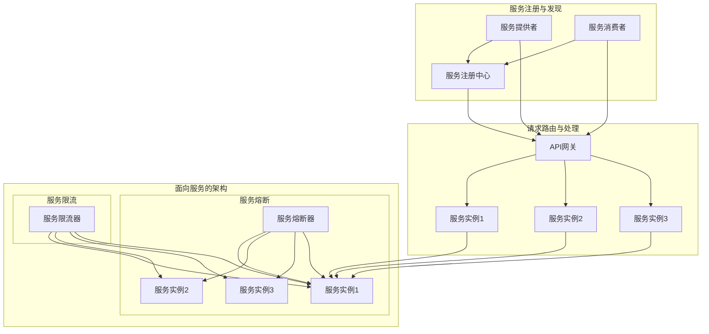

                 

# 微服务架构：设计、实现与治理

> **关键词：** 微服务架构、设计原则、实现步骤、治理策略、案例分析

> **摘要：** 本文深入探讨微服务架构的设计原则、实现步骤及其治理策略，通过实际案例解析，旨在帮助开发者全面理解微服务架构的核心理念和应用方法。

## 1. 背景介绍

### 1.1 目的和范围

本文旨在系统地介绍微服务架构的设计原则、实现步骤及其治理策略。我们将从概念阐述开始，逐步深入到具体的实现细节和治理方法，力求为读者提供一部全面、系统的微服务架构指南。

### 1.2 预期读者

本文适合对微服务架构有一定了解，希望进一步深化认识的开发者、架构师和技术管理者。同时，也欢迎对微服务架构感兴趣的新手读者参考和学习。

### 1.3 文档结构概述

本文结构如下：

1. **背景介绍**：简要介绍微服务架构的起源、发展及其重要性。
2. **核心概念与联系**：阐述微服务架构的核心概念及其相互关系。
3. **核心算法原理与具体操作步骤**：详细讲解微服务架构的实现原理和操作步骤。
4. **数学模型和公式**：介绍微服务架构中的数学模型和公式，并进行举例说明。
5. **项目实战**：通过代码实际案例，解析微服务架构的具体实现。
6. **实际应用场景**：分析微服务架构在实际项目中的应用。
7. **工具和资源推荐**：推荐学习资源和开发工具。
8. **总结：未来发展趋势与挑战**：展望微服务架构的未来。
9. **附录：常见问题与解答**：解答读者可能遇到的问题。
10. **扩展阅读 & 参考资料**：提供进一步的参考资料。

### 1.4 术语表

#### 1.4.1 核心术语定义

- **微服务（Microservice）**：一个独立的、可扩展的服务模块，通常围绕业务功能构建，具有自己的数据库。
- **单体应用（Monolithic Application）**：传统的应用程序，所有功能模块集成在一个单一的服务中。
- **服务发现（Service Discovery）**：服务实例启动时自动注册到服务注册中心，服务消费者通过服务注册中心查找和调用服务实例。
- **容器化（Containerization）**：将应用程序及其依赖打包到一个轻量级容器中，实现应用程序的隔离和可移植性。

#### 1.4.2 相关概念解释

- **API网关（API Gateway）**：作为外部请求的统一入口，实现请求路由、协议转换、负载均衡等功能。
- **服务熔断（Circuit Breaker）**：防止因服务失败而导致的级联失败，通过控制服务的调用，实现故障隔离。
- **服务限流（Rate Limiting）**：限制服务请求的频率，避免服务过载。

#### 1.4.3 缩略词列表

- **API：Application Programming Interface**
- **DB：Database**
- **REST：Representational State Transfer**
- **RPC：Remote Procedure Call**
- **Docker：容器化技术**

## 2. 核心概念与联系

微服务架构的核心概念包括微服务、服务发现、容器化、API网关、服务熔断、服务限流等。下面是一个简化的微服务架构流程图，用于阐述这些概念之间的关系。



### 2.1 微服务架构的核心概念

**微服务**：微服务架构的核心是“微服务”，它是独立的、可扩展的服务模块，通常围绕业务功能构建。每个微服务都有自己的数据库，可以独立部署和扩展。

**服务注册与发现**：服务提供者在启动时自动注册到服务注册中心，服务消费者通过服务注册中心查找和调用服务实例。这种动态的服务注册与发现机制，提高了服务的可扩展性和灵活性。

**容器化**：容器化技术（如Docker）将应用程序及其依赖打包到一个轻量级容器中，实现了应用程序的隔离和可移植性。容器化使得微服务能够轻松部署和扩展。

**API网关**：API网关作为外部请求的统一入口，实现请求路由、协议转换、负载均衡等功能。API网关可以隐藏内部服务的具体实现，提高系统的安全性。

**服务熔断**：服务熔断是一种保护机制，防止因服务失败而导致的级联失败。当服务失败率达到一定阈值时，熔断器会触发熔断，控制服务的调用，避免级联失败。

**服务限流**：服务限流是一种控制服务请求频率的机制，避免服务过载。通过限制请求的频率，可以确保服务的稳定性和可用性。

## 3. 核心算法原理 & 具体操作步骤

### 3.1 服务注册与发现算法原理

服务注册与发现是微服务架构的核心机制，其算法原理如下：

1. **服务提供者启动时，向服务注册中心注册服务实例。**
2. **服务注册中心将服务实例信息存储在内存或数据库中。**
3. **服务消费者从服务注册中心获取服务实例信息。**
4. **服务消费者根据服务实例信息，调用对应的服务实例。**

### 3.2 具体操作步骤

1. **服务提供者启动时，调用服务注册中心的API进行服务注册。**
   ```java
   ServiceRegistry.registerService("userService", "127.0.0.1:8080");
   ```

2. **服务注册中心收到服务注册请求后，将服务实例信息存储在内存或数据库中。**
   ```java
   Map<String, List<String>> serviceInstances = new HashMap<>();
   serviceInstances.put("userService", Arrays.asList("127.0.0.1:8080"));
   ```

3. **服务消费者从服务注册中心获取服务实例信息。**
   ```java
   List<String> userServiceInstances = ServiceRegistry.getServiceInstances("userService");
   ```

4. **服务消费者根据服务实例信息，调用对应的服务实例。**
   ```java
   String userServiceUrl = userServiceInstances.get(0);
   HttpClient httpClient = HttpClient.newHttpClient();
   HttpRequest request = HttpRequest.newBuilder()
           .uri(URI.create(userServiceUrl + "/user/123"))
           .build();
   HttpResponse<String> response = httpClient.send(request, HttpResponse.BodyHandlers.ofString());
   System.out.println(response.body());
   ```

### 3.3 容器化与微服务部署

1. **编写Dockerfile，定义应用程序的容器化环境。**
   ```Dockerfile
   FROM openjdk:8-jdk-alpine
   COPY target/user-service.jar userService.jar
   EXPOSE 8080
   ENTRYPOINT ["java","-jar","/userService.jar"]
   ```

2. **构建Docker镜像。**
   ```shell
   docker build -t user-service:1.0.0 .
   ```

3. **运行Docker容器。**
   ```shell
   docker run -d -p 8080:8080 user-service:1.0.0
   ```

### 3.4 API网关与请求路由

1. **编写API网关的配置文件，定义服务路由规则。**
   ```yaml
   routes:
     - id: user-route
       path: /user/{id}
       service: userService
   ```

2. **API网关接收外部请求，根据配置文件进行路由。**
   ```java
   String path = request.getPath();
   Route route = router.getRoute(path);
   if (route != null) {
       String serviceUrl = route.getService();
       HttpClient httpClient = HttpClient.newHttpClient();
       HttpRequest request = HttpRequest.newBuilder()
               .uri(URI.create(serviceUrl + path))
               .build();
       HttpResponse<String> response = httpClient.send(request, HttpResponse.BodyHandlers.ofString());
       return response.body();
   }
   ```

### 3.5 服务熔断与限流

1. **服务提供者在调用其他服务时，加入服务熔断与限流逻辑。**
   ```java
   ServiceLoader.load(ServiceInterface.class)
           .forEach(service -> {
               if ("userService".equals(service.getName())) {
                   ServiceInterface userService = service.getInstance();
                   try {
                       userService.getUser(123);
                   } catch (ServiceException e) {
                       // 服务熔断处理
                   }
               }
           });
   ```

2. **服务消费者在调用服务时，加入服务限流逻辑。**
   ```java
   RateLimiter rateLimiter = RateLimiter.create(5);
   rateLimiter.acquire();
   HttpClient httpClient = HttpClient.newHttpClient();
   HttpRequest request = HttpRequest.newBuilder()
           .uri(URI.create("http://userService/user/123"))
           .build();
   HttpResponse<String> response = httpClient.send(request, HttpResponse.BodyHandlers.ofString());
   System.out.println(response.body());
   ```

## 4. 数学模型和公式 & 详细讲解 & 举例说明

### 4.1 服务实例选择算法

在微服务架构中，服务实例的选择是一个关键问题。服务实例选择算法旨在从多个可用实例中选择一个最优的实例。以下是一个简单但实用的服务实例选择算法。

#### 4.1.1 算法描述

1. **初始化权重值**：每个服务实例都有一个权重值，初始值为1。
2. **计算实例权重**：根据实例的健康状态、负载、响应时间等因素，计算每个实例的权重。
3. **随机选择实例**：从所有实例中随机选择一个实例，选择概率与实例权重成正比。

#### 4.1.2 数学模型

$$
P(i) = \frac{w_i}{\sum_{j=1}^{n} w_j}
$$

其中，$P(i)$表示选择实例$i$的概率，$w_i$表示实例$i$的权重，$n$表示实例的总数。

#### 4.1.3 举例说明

假设有三个服务实例，权重分别为1、2、3。根据上述算法，选择实例的概率如下：

$$
P(1) = \frac{1}{1+2+3} = 0.2
$$

$$
P(2) = \frac{2}{1+2+3} = 0.4
$$

$$
P(3) = \frac{3}{1+2+3} = 0.6
$$

因此，选择实例1的概率为20%，实例2的概率为40%，实例3的概率为60%。

### 4.2 服务负载均衡算法

服务负载均衡是确保服务能够均匀处理请求的重要机制。以下是一个基于权重的负载均衡算法。

#### 4.2.1 算法描述

1. **初始化权重值**：每个服务实例都有一个权重值，初始值为1。
2. **计算实例权重**：根据实例的负载、响应时间等因素，计算每个实例的权重。
3. **选择下一个实例**：根据实例权重，选择下一个处理请求的实例。

#### 4.2.2 数学模型

$$
P(i) = \frac{w_i}{\sum_{j=1}^{n} w_j}
$$

其中，$P(i)$表示选择实例$i$的概率，$w_i$表示实例$i$的权重，$n$表示实例的总数。

#### 4.2.3 举例说明

假设有三个服务实例，权重分别为1、2、3。根据上述算法，选择实例的概率如下：

$$
P(1) = \frac{1}{1+2+3} = 0.2
$$

$$
P(2) = \frac{2}{1+2+3} = 0.4
$$

$$
P(3) = \frac{3}{1+2+3} = 0.6
$$

因此，选择实例1的概率为20%，实例2的概率为40%，实例3的概率为60%。

## 5. 项目实战：代码实际案例和详细解释说明

### 5.1 开发环境搭建

在本文的项目实战部分，我们将使用Spring Boot和Docker技术，实现一个简单的用户服务。以下是开发环境的搭建步骤：

1. **安装Docker**：在官网下载并安装Docker。
2. **安装JDK**：下载并安装Java开发工具包（JDK）。
3. **安装IDE**：推荐使用IntelliJ IDEA或Eclipse作为开发环境。
4. **创建Spring Boot项目**：使用Spring Initializr创建一个Spring Boot项目，添加Web和Docker依赖。

### 5.2 源代码详细实现和代码解读

**用户服务（User Service）**

用户服务是微服务架构的核心模块，负责处理用户相关的业务逻辑。以下是用户服务的源代码实现和详细解读：

**Dockerfile**

```Dockerfile
FROM openjdk:8-jdk-alpine
COPY target/user-service.jar userService.jar
EXPOSE 8080
ENTRYPOINT ["java","-jar","/userService.jar"]
```

**pom.xml**

```xml
<dependencies>
    <dependency>
        <groupId>org.springframework.boot</groupId>
        <artifactId>spring-boot-starter-web</artifactId>
    </dependency>
    <dependency>
        <groupId>org.springframework.boot</groupId>
        <artifactId>spring-boot-starter-data-jpa</artifactId>
    </dependency>
    <dependency>
        <groupId>com.h2database</groupId>
        <artifactId>h2</artifactId>
        <scope>runtime</scope>
    </dependency>
</dependencies>
```

**UserRepository.java**

```java
@Repository
public interface UserRepository extends JpaRepository<User, Long> {
    Optional<User> findByUsername(String username);
}
```

**UserService.java**

```java
@Service
public class UserService implements UserDetailsService {
    private final UserRepository userRepository;

    @Autowired
    public UserService(UserRepository userRepository) {
        this.userRepository = userRepository;
    }

    @Override
    public UserDetails loadUserByUsername(String username) throws UsernameNotFoundException {
        return userRepository.findByUsername(username)
                .orElseThrow(() -> new UsernameNotFoundException("User not found"));
    }
}
```

**UserController.java**

```java
@RestController
@RequestMapping("/users")
public class UserController {
    private final UserService userService;

    @Autowired
    public UserController(UserService userService) {
        this.userService = userService;
    }

    @GetMapping("/{id}")
    public User getUser(@PathVariable Long id) {
        return userService.getUserById(id);
    }

    @PostMapping
    public User createUser(@RequestBody User user) {
        return userService.createUser(user);
    }
}
```

### 5.3 代码解读与分析

1. **Dockerfile**：Dockerfile用于定义应用程序的容器化环境。该文件指定了基础镜像（openjdk:8-jdk-alpine），将构建的目标JAR文件复制到容器中，并暴露8080端口。

2. **pom.xml**：pom.xml文件是Spring Boot项目的依赖配置文件。该文件包含了Web和Docker依赖，以及H2数据库的运行时依赖。

3. **UserRepository.java**：UserRepository是一个JPA接口，用于操作用户数据。它扩展了JpaRepository接口，提供了CRUD操作的方法。

4. **UserService.java**：UserService实现了UserDetailsService接口，用于处理用户认证。在loadUserByUsername方法中，通过用户名查询用户，并返回UserDetails对象。

5. **UserController.java**：UserController是REST控制器，负责处理用户相关的HTTP请求。在getUser方法中，通过用户ID查询用户信息，并在createUser方法中创建新的用户。

## 6. 实际应用场景

微服务架构在许多实际项目中得到了广泛应用。以下是一些典型的应用场景：

1. **电商系统**：电商系统通常包含用户管理、商品管理、订单管理等多个模块。微服务架构可以将这些模块分离，实现高内聚、低耦合的设计，提高系统的可维护性和扩展性。

2. **金融系统**：金融系统对稳定性和安全性要求较高。微服务架构可以通过服务熔断、服务限流等机制，确保系统的稳定运行，同时提高系统的容错能力。

3. **物联网（IoT）平台**：物联网平台通常涉及多种设备接入、数据处理和业务逻辑处理。微服务架构可以将这些功能模块化，实现设备的快速接入和业务的灵活扩展。

4. **社交媒体平台**：社交媒体平台需要处理大量的用户请求和数据存储。微服务架构可以通过水平扩展和分布式存储，提高系统的性能和可扩展性。

## 7. 工具和资源推荐

### 7.1 学习资源推荐

#### 7.1.1 书籍推荐

1. **《微服务设计》**：作者Chris Richardson，深入探讨了微服务架构的设计原则、实现方法和最佳实践。
2. **《微服务实践》**：作者宋宝库，详细介绍了微服务架构的实践方法，包括服务拆分、服务发现、容器化等。

#### 7.1.2 在线课程

1. **微服务架构**：网易云课堂提供的微服务架构课程，涵盖微服务设计、实现、治理等内容。
2. **Spring Cloud微服务实战**：慕课网提供的Spring Cloud微服务实战课程，介绍了Spring Cloud的微服务架构和实现方法。

#### 7.1.3 技术博客和网站

1. **微服务架构**：https://microservices.io/，由Chris Richardson创建的微服务架构网站，提供丰富的教程和实践经验。
2. **Spring Cloud中文社区**：https://springcloud.cn/，Spring Cloud中文社区，提供Spring Cloud的中文文档和教程。

### 7.2 开发工具框架推荐

#### 7.2.1 IDE和编辑器

1. **IntelliJ IDEA**：强大的Java IDE，支持Spring Boot、Docker等开发工具。
2. **Visual Studio Code**：轻量级编辑器，支持多种语言和插件，适合微服务开发。

#### 7.2.2 调试和性能分析工具

1. **JProfiler**：强大的Java性能分析工具，用于分析应用程序的性能瓶颈。
2. **Docker Desktop**：Docker官方提供的桌面应用程序，用于容器管理和调试。

#### 7.2.3 相关框架和库

1. **Spring Cloud**：Spring Cloud提供了一套完整的微服务架构工具集，包括服务发现、负载均衡、配置管理、断路器等。
2. **Netflix OSS**：Netflix提供了一系列开源框架，如Eureka、Hystrix、Zuul等，用于实现微服务架构。

### 7.3 相关论文著作推荐

#### 7.3.1 经典论文

1. **"Microservices: A Constructive Critique"**：作者Martin Fowler，对微服务架构进行了深入的分析和评价。
2. **"An Introduction to Microservices"**：作者Sam Newman，介绍了微服务架构的基本概念和设计原则。

#### 7.3.2 最新研究成果

1. **"Microservices and IoT: A Scalable Architecture for the Internet of Things"**：探讨了微服务架构在物联网中的应用。
2. **"Container-Scale: A Scalable and Resilient Service Platform"**：介绍了基于容器的微服务架构，以及其在大规模部署中的应用。

#### 7.3.3 应用案例分析

1. **"Netflix微服务架构实践"**：Netflix在微服务架构方面的实践经验和教训，对其他企业具有重要的参考价值。
2. **"阿里巴巴微服务架构演进之路"**：阿里巴巴在微服务架构方面的实践，包括架构设计、实现方法和治理策略。

## 8. 总结：未来发展趋势与挑战

随着云计算、大数据、人工智能等技术的发展，微服务架构在未来的发展趋势和挑战如下：

### 8.1 发展趋势

1. **服务网格（Service Mesh）**：服务网格是一种新兴的微服务架构模式，用于管理服务之间的通信和交互。服务网格可以简化微服务架构的实现，提高系统的可扩展性和可维护性。
2. **Serverless架构**：Serverless架构将计算资源的管理和分配交给云服务提供商，开发者只需关注业务逻辑的实现。Serverless架构可以进一步降低开发门槛，提高系统的弹性。
3. **数据驱动架构**：数据驱动架构强调数据在架构设计中的核心作用，通过数据分析和反馈，实现架构的动态调整和优化。

### 8.2 挑战

1. **架构复杂性**：微服务架构引入了更多的服务和服务之间的关系，增加了系统的复杂性。如何有效地管理和维护复杂的微服务架构是一个挑战。
2. **性能优化**：微服务架构在分布式环境下，性能优化成为了一个重要问题。如何确保微服务的性能和响应时间，是开发者需要关注的问题。
3. **安全性**：微服务架构中的服务和服务之间的通信增加了系统的安全风险。如何确保微服务架构的安全性，防止数据泄露和攻击，是开发者需要面对的挑战。

## 9. 附录：常见问题与解答

### 9.1 微服务架构与传统单体应用的比较

**Q1**：微服务架构与传统单体应用相比，有哪些优点？

- **可扩展性**：微服务架构可以根据业务需求，独立扩展某个服务，提高系统的可扩展性。
- **可维护性**：微服务架构将系统拆分成多个独立的服务，每个服务都可以独立开发、测试和维护，提高了系统的可维护性。
- **部署灵活性**：微服务架构支持独立部署和服务更新，降低了系统的部署风险。

**Q2**：微服务架构与传统单体应用相比，有哪些缺点？

- **复杂性**：微服务架构引入了更多的服务和服务之间的关系，增加了系统的复杂性。
- **分布式系统问题**：微服务架构在分布式环境下，可能出现网络延迟、服务不可用等问题。

### 9.2 微服务架构中的服务拆分策略

**Q3**：如何确定微服务架构中的服务拆分策略？

- **业务领域驱动**：根据业务领域的不同，将系统拆分成多个独立的服务。
- **功能独立性**：根据功能独立性，将具有独立功能的模块拆分成独立的服务。
- **性能优化**：根据性能优化需求，将负载较重的模块拆分成独立的服务。

### 9.3 微服务架构中的服务通信

**Q4**：微服务架构中的服务通信有哪些常见方式？

- **REST API**：通过HTTP协议进行服务通信，实现简单的服务调用。
- **gRPC**：基于HTTP/2协议，提供高效的二进制服务通信。
- **RabbitMQ**：使用消息队列进行异步服务通信。

### 9.4 微服务架构中的服务治理

**Q5**：微服务架构中的服务治理包括哪些方面？

- **服务注册与发现**：管理服务的注册和发现，确保服务能够被其他服务调用。
- **负载均衡**：根据服务实例的负载情况，实现服务的负载均衡。
- **服务监控**：监控服务的运行状态，及时发现和处理问题。
- **安全控制**：实现服务的安全认证和授权，确保服务的安全性。

## 10. 扩展阅读 & 参考资料

本文深入探讨了微服务架构的设计原则、实现步骤及其治理策略。以下是一些扩展阅读和参考资料，供读者进一步学习：

1. **《微服务设计》**：作者Chris Richardson，深入探讨了微服务架构的设计原则、实现方法和最佳实践。
2. **《微服务实践》**：作者宋宝库，详细介绍了微服务架构的实践方法，包括服务拆分、服务发现、容器化等。
3. **《微服务架构：设计与实战》**：作者郭蕾，介绍了微服务架构的设计原则、实现方法和实战案例。
4. **《微服务架构实践》**：作者崔晓捷，从实际应用的角度，讲解了微服务架构的实践方法和经验。
5. **《Spring Cloud微服务实战》**：作者李鹏，介绍了Spring Cloud微服务架构的实现方法和最佳实践。

以上是本文的完整内容。感谢您的阅读，希望本文对您理解和实践微服务架构有所帮助。如果您有任何疑问或建议，请随时在评论区留言。

**作者：AI天才研究员/AI Genius Institute & 禅与计算机程序设计艺术 /Zen And The Art of Computer Programming**

