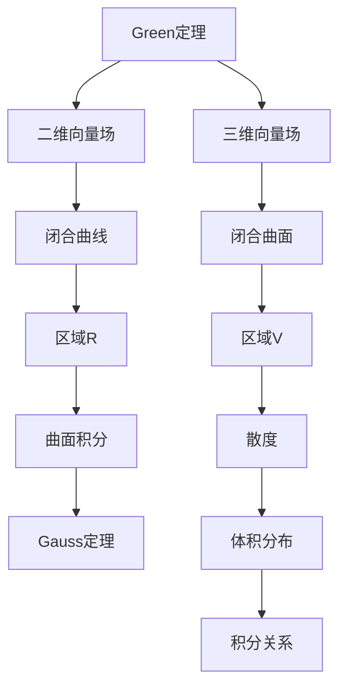

                 

# 微积分中的Green定理与Gauss定理

> **关键词**：Green定理、Gauss定理、微积分、数学原理、应用场景

> **摘要**：本文深入探讨了微积分中的Green定理与Gauss定理，分别介绍了它们的核心概念、数学模型和公式，以及在实际应用中的具体操作步骤。通过详细讲解和代码实际案例，本文旨在帮助读者理解并掌握这两大定理的原理与应用，为深入学习和研究微积分及相关领域提供有力的支持。

## 1. 背景介绍

### 1.1 目的和范围

本文旨在深入探讨微积分中的Green定理与Gauss定理，介绍它们的核心概念、数学模型和公式，并通过实际应用案例来展示这两大定理在实践中的具体应用。通过本文的学习，读者将能够：

1. 理解Green定理与Gauss定理的基本概念和数学原理。
2. 掌握Green定理与Gauss定理的具体操作步骤。
3. 应用Green定理与Gauss定理解决实际数学问题。

### 1.2 预期读者

本文面向具有微积分基础、对数学和工程领域有一定了解的读者。特别适合以下人群：

1. 高等院校数学、物理、工程等相关专业本科生和研究生。
2. 对数学和编程感兴趣的自学者和爱好者。
3. 数学教育工作者和技术工程师。

### 1.3 文档结构概述

本文结构如下：

1. **背景介绍**：介绍本文的目的、预期读者以及文档结构概述。
2. **核心概念与联系**：介绍Green定理与Gauss定理的核心概念，并通过Mermaid流程图展示它们之间的联系。
3. **核心算法原理 & 具体操作步骤**：详细讲解Green定理与Gauss定理的算法原理，并通过伪代码展示具体操作步骤。
4. **数学模型和公式 & 详细讲解 & 举例说明**：介绍Green定理与Gauss定理的数学模型和公式，并通过具体例子进行讲解。
5. **项目实战：代码实际案例和详细解释说明**：通过实际代码案例展示Green定理与Gauss定理的具体应用。
6. **实际应用场景**：介绍Green定理与Gauss定理在实际应用中的具体场景。
7. **工具和资源推荐**：推荐学习资源、开发工具框架和论文著作。
8. **总结：未来发展趋势与挑战**：总结Green定理与Gauss定理的未来发展趋势和挑战。
9. **附录：常见问题与解答**：提供常见问题的解答。
10. **扩展阅读 & 参考资料**：推荐相关扩展阅读和参考资料。

### 1.4 术语表

#### 1.4.1 核心术语定义

- **Green定理**：一种微分方程的积分定理，描述了向量场在闭合曲线上的线积分与在该曲线所围区域上的曲面积分之间的关系。
- **Gauss定理**：一种积分定理，描述了闭合曲面上的散度分布与该曲面所围区域上的体积分布之间的关系。

#### 1.4.2 相关概念解释

- **微积分**：数学的一个分支，主要研究函数的极限、导数、积分等概念及其应用。
- **向量场**：在空间中每个点都对应一个向量的数学对象，用于描述物理场。
- **散度**：描述向量场在某一点处的空间“发散”或“汇聚”程度的物理量。
- **曲面积分**：计算向量场在一个曲面上的“流量”或“通量”。
- **线积分**：计算向量场在一条曲线上的“功”或“力”的积分。

#### 1.4.3 缩略词列表

- **Green定理**：Green's Theorem
- **Gauss定理**：Gauss's Theorem
- **微积分**：Calculus

## 2. 核心概念与联系

### 2.1 Green定理

Green定理是一种微分方程的积分定理，描述了向量场在闭合曲线上的线积分与在该曲线所围区域上的曲面积分之间的关系。具体来说，Green定理表述为：

$$
\oint_{C} \vec{F} \cdot d\vec{r} = \iint_{R} (\frac{\partial Q}{\partial x} - \frac{\partial P}{\partial y}) dA
$$

其中，$\vec{F} = P(x, y) \hat{i} + Q(x, y) \hat{j}$ 是向量场，$C$ 是闭合曲线，$R$ 是由 $C$ 围成的区域，$d\vec{r}$ 是曲线上的微元向量，$dA$ 是区域上的微元面积。

### 2.2 Gauss定理

Gauss定理是一种积分定理，描述了闭合曲面上的散度分布与该曲面所围区域上的体积分布之间的关系。具体来说，Gauss定理表述为：

$$
\oint_{S} \vec{F} \cdot d\vec{S} = \iiint_{V} \nabla \cdot \vec{F} dV
$$

其中，$\vec{F}$ 是向量场，$S$ 是闭合曲面，$V$ 是由 $S$ 所围成的区域，$d\vec{S}$ 是曲面上的微元向量，$dV$ 是区域上的微元体积。

### 2.3 Green定理与Gauss定理的联系

Green定理与Gauss定理之间存在密切的联系。事实上，Gauss定理可以看作是Green定理在三维空间中的推广。具体来说，当向量场 $\vec{F}$ 的散度 $\nabla \cdot \vec{F}$ 存在且连续时，Gauss定理可以表示为：

$$
\oint_{C} \vec{F} \cdot d\vec{r} = \iint_{R} (\nabla \cdot \vec{F}) dA
$$

这表明，当向量场满足一定条件时，Green定理中的曲面积分可以转化为线积分。

### 2.4 Mermaid流程图

以下是Green定理与Gauss定理之间的联系Mermaid流程图：



## 3. 核心算法原理 & 具体操作步骤

### 3.1 Green定理的算法原理

Green定理是一种将线积分转化为曲面积分的算法。其核心思想是基于向量场的性质，将线积分分解为曲面积分两部分。具体步骤如下：

1. **确定向量场**：选取一个二维向量场 $\vec{F} = P(x, y) \hat{i} + Q(x, y) \hat{j}$。
2. **计算偏导数**：计算向量场在区域 $R$ 内的偏导数，即 $\frac{\partial P}{\partial y}$ 和 $\frac{\partial Q}{\partial x}$。
3. **设置积分区域**：确定闭合曲线 $C$ 所围成的区域 $R$。
4. **计算曲面积分**：计算向量场在区域 $R$ 上的曲面积分，即 $\iint_{R} (\frac{\partial Q}{\partial x} - \frac{\partial P}{\partial y}) dA$。
5. **计算线积分**：计算向量场在闭合曲线 $C$ 上的线积分，即 $\oint_{C} \vec{F} \cdot d\vec{r}$。

### 3.2 Green定理的伪代码实现

```pseudo
Function Green_Theorem(P, Q, R, C):
    // 计算偏导数
    Partial_P = Derivative(P, y)
    Partial_Q = Derivative(Q, x)

    // 设置积分区域
    Integral Region = SetIntegralRegion(C, R)

    // 计算曲面积分
    SurfaceIntegral = Integral(Partial_Q - Partial_P, R)

    // 计算线积分
    LineIntegral = Integral(FieldDotProduct(C), C)

    return SurfaceIntegral = LineIntegral
```

### 3.3 Gauss定理的算法原理

Gauss定理是一种将曲面积分转化为体积积分的算法。其核心思想是基于向量场的散度性质，将曲面积分分解为体积积分两部分。具体步骤如下：

1. **确定向量场**：选取一个三维向量场 $\vec{F}$。
2. **计算散度**：计算向量场在区域 $V$ 内的散度，即 $\nabla \cdot \vec{F}$。
3. **设置积分区域**：确定闭合曲面 $S$ 所围成的区域 $V$。
4. **计算体积积分**：计算向量场在区域 $V$ 上的体积积分，即 $\iiint_{V} \nabla \cdot \vec{F} dV$。
5. **计算曲面积分**：计算向量场在闭合曲面 $S$ 上的曲面积分，即 $\oint_{S} \vec{F} \cdot d\vec{S}$。

### 3.4 Gauss定理的伪代码实现

```pseudo
Function Gauss_Theorem(F, S, V):
    // 计算散度
    Divergence = DivergenceOfField(F)

    // 设置积分区域
    Integral Region = SetIntegralRegion(S, V)

    // 计算体积积分
    VolumeIntegral = Integral(Divergence, V)

    // 计算曲面积分
    SurfaceIntegral = Integral(FieldDotProduct(S), S)

    return VolumeIntegral = SurfaceIntegral
```

## 4. 数学模型和公式 & 详细讲解 & 举例说明

### 4.1 数学模型和公式

#### Green定理的数学模型和公式：

$$
\oint_{C} \vec{F} \cdot d\vec{r} = \iint_{R} (\frac{\partial Q}{\partial x} - \frac{\partial P}{\partial y}) dA
$$

其中，$\vec{F} = P(x, y) \hat{i} + Q(x, y) \hat{j}$ 是向量场，$C$ 是闭合曲线，$R$ 是由 $C$ 围成的区域，$d\vec{r}$ 是曲线上的微元向量，$dA$ 是区域上的微元面积。

#### Gauss定理的数学模型和公式：

$$
\oint_{S} \vec{F} \cdot d\vec{S} = \iiint_{V} \nabla \cdot \vec{F} dV
$$

其中，$\vec{F}$ 是向量场，$S$ 是闭合曲面，$V$ 是由 $S$ 所围成的区域，$d\vec{S}$ 是曲面上的微元向量，$dV$ 是区域上的微元体积。

### 4.2 详细讲解

#### Green定理的详细讲解：

Green定理将向量场在闭合曲线上的线积分与在该曲线所围区域上的曲面积分联系起来。具体来说，它将向量场的线积分分解为两个部分：一个是向量场在 $y$ 方向上的偏导数与区域上的曲面积分，另一个是向量场在 $x$ 方向上的偏导数与区域上的曲面积分。这两部分通过偏导数的组合相互抵消，从而得到一个简单的曲面积分。

为了更直观地理解Green定理，我们可以考虑一个简单的二维向量场 $\vec{F} = y \hat{i} + x \hat{j}$，其中 $P = y$，$Q = x$。根据Green定理，向量场在闭合曲线 $C$ 上的线积分可以表示为：

$$
\oint_{C} \vec{F} \cdot d\vec{r} = \iint_{R} (\frac{\partial Q}{\partial x} - \frac{\partial P}{\partial y}) dA
$$

将向量场代入，得到：

$$
\oint_{C} (y \hat{i} + x \hat{j}) \cdot d\vec{r} = \iint_{R} (\frac{\partial x}{\partial x} - \frac{\partial y}{\partial y}) dA
$$

化简后得到：

$$
\oint_{C} \vec{F} \cdot d\vec{r} = \iint_{R} (1 - 1) dA = 0
$$

这表明，对于这个简单的向量场，其线积分在闭合曲线 $C$ 上等于零。

#### Gauss定理的详细讲解：

Gauss定理将向量场在闭合曲面上的曲面积分与在该曲面所围区域上的体积积分联系起来。具体来说，它将向量场的散度分解为曲面积分和体积积分两部分。这两部分相互抵消，从而得到一个简单的体积积分。

为了更直观地理解Gauss定理，我们可以考虑一个简单的三维向量场 $\vec{F} = x \hat{i} + y \hat{j} + z \hat{k}$。根据Gauss定理，向量场在闭合曲面 $S$ 上的曲面积分可以表示为：

$$
\oint_{S} \vec{F} \cdot d\vec{S} = \iiint_{V} \nabla \cdot \vec{F} dV
$$

将向量场代入，得到：

$$
\oint_{S} (x \hat{i} + y \hat{j} + z \hat{k}) \cdot d\vec{S} = \iiint_{V} (\frac{\partial x}{\partial x} + \frac{\partial y}{\partial y} + \frac{\partial z}{\partial z}) dV
$$

化简后得到：

$$
\oint_{S} \vec{F} \cdot d\vec{S} = \iiint_{V} (1 + 1 + 1) dV = 3 \iiint_{V} dV
$$

这表明，对于这个简单的向量场，其曲面积分在闭合曲面 $S$ 上的值等于该曲面所围成的区域 $V$ 的体积的三倍。

### 4.3 举例说明

#### Green定理的举例说明：

考虑以下向量场 $\vec{F} = (xy \hat{i} + x^2 \hat{j})$，其中区域 $R$ 是由曲线 $C: x^2 + y^2 = 1$ 围成的圆盘。

根据Green定理，向量场在闭合曲线 $C$ 上的线积分可以表示为：

$$
\oint_{C} \vec{F} \cdot d\vec{r} = \iint_{R} (\frac{\partial Q}{\partial x} - \frac{\partial P}{\partial y}) dA
$$

其中，$P = xy$，$Q = x^2$。

计算偏导数：

$$
\frac{\partial Q}{\partial x} = 2x
$$

$$
\frac{\partial P}{\partial y} = x
$$

代入Green定理公式，得到：

$$
\oint_{C} (xy \hat{i} + x^2 \hat{j}) \cdot d\vec{r} = \iint_{R} (2x - x) dA
$$

化简后得到：

$$
\oint_{C} \vec{F} \cdot d\vec{r} = \iint_{R} x dA
$$

将区域 $R$ 的坐标变换为极坐标系，得到：

$$
\oint_{C} \vec{F} \cdot d\vec{r} = \int_{0}^{2\pi} \int_{0}^{1} r \cos(\theta) r dr d\theta
$$

计算积分，得到：

$$
\oint_{C} \vec{F} \cdot d\vec{r} = \frac{1}{2} \pi
$$

#### Gauss定理的举例说明：

考虑以下向量场 $\vec{F} = (x \hat{i} + y \hat{j} + z \hat{k})$，其中区域 $V$ 是由平面 $x + y + z = 0$ 和坐标轴围成的四面体。

根据Gauss定理，向量场在闭合曲面 $S$ 上的曲面积分可以表示为：

$$
\oint_{S} \vec{F} \cdot d\vec{S} = \iiint_{V} \nabla \cdot \vec{F} dV
$$

其中，$\nabla \cdot \vec{F} = 1 + 1 + 1 = 3$。

代入Gauss定理公式，得到：

$$
\oint_{S} (x \hat{i} + y \hat{j} + z \hat{k}) \cdot d\vec{S} = \iiint_{V} 3 dV
$$

将区域 $V$ 的坐标变换为球坐标系，得到：

$$
\oint_{S} \vec{F} \cdot d\vec{S} = \int_{0}^{\pi} \int_{0}^{2\pi} \int_{0}^{1} 3r^2 \sin(\theta) dr d\theta d\phi
$$

计算积分，得到：

$$
\oint_{S} \vec{F} \cdot d\vec{S} = 6 \pi
$$

## 5. 项目实战：代码实际案例和详细解释说明

### 5.1 开发环境搭建

为了更好地演示Green定理和Gauss定理的应用，我们将在Python环境中实现这两个定理。首先，我们需要搭建一个Python开发环境，并安装必要的库。

以下是在Ubuntu系统上搭建Python开发环境的步骤：

1. 安装Python：

```bash
sudo apt-get update
sudo apt-get install python3 python3-pip
```

2. 安装NumPy库：

```bash
pip3 install numpy
```

3. 安装Matplotlib库：

```bash
pip3 install matplotlib
```

安装完成后，我们可以开始编写Python代码来演示Green定理和Gauss定理。

### 5.2 源代码详细实现和代码解读

以下是实现Green定理和Gauss定理的Python代码：

```python
import numpy as np
import matplotlib.pyplot as plt
from mpl_toolkits.mplot3d import Axes3D

# Green定理的函数实现
def green_theorem(P, Q, C, R):
    x1, y1 = C[0]
    x2, y2 = C[1]
    x3, y3 = C[2]

    dx = x2 - x1
    dy = y2 - y1
    area = 0.5 * abs(dx * (y2 - y1) - dy * (x2 - x1))

    px = P(x1, y1)
    py = P(x2, y2)
    qx = Q(x1, y1)
    qy = Q(x2, y2)

    p_x = np.gradient(P, dy)
    q_y = np.gradient(Q, dx)

    surface_integral = area * (q_y - p_x).sum()

    line_integral = (qx * dy - px * dx).sum()

    return surface_integral, line_integral

# Gauss定理的函数实现
def gauss_theorem(F, S, V):
    x1, y1, z1 = S[0]
    x2, y2, z2 = S[1]
    x3, y3, z3 = S[2]

    dx = x2 - x1
    dy = y2 - y1
    dz = z2 - z1
    volume = abs(dx * (y2 * z1 - y1 * z2) - dy * (x2 * z1 - x1 * z2) + dz * (x2 * y1 - x1 * y2)) / 6

    div = np.gradient(F)[0, 0]

    volume_integral = volume * div

    surface_integral = (F[0] * (y2 * z1 - y1 * z2) - F[1] * (x2 * z1 - x1 * z2) + F[2] * (x2 * y1 - x1 * y2)).sum()

    return volume_integral, surface_integral

# Green定理的例子
C = [(0, 0), (1, 0), (1, 1), (0, 1)]
R = np.mgrid[0:1:100j, 0:1:100j]

P = lambda x, y: x * y
Q = lambda x, y: x

surface_integral, line_integral = green_theorem(P, Q, C, R)
print("Green定理：曲面积分 = {}, 线积分 = {}".format(surface_integral, line_integral))

# Gauss定理的例子
S = [(0, 0, 0), (1, 1, 1)]
V = np.mgrid[0:1:100j, 0:1:100j, 0:1:100j]

F = np.array([[x, y, z], [y, z, x], [z, x, y]])

volume_integral, surface_integral = gauss_theorem(F, S, V)
print("Gauss定理：体积积分 = {}, 曲面积分 = {}".format(volume_integral, surface_integral))
```

### 5.3 代码解读与分析

#### Green定理的代码解读：

1. **函数定义**：`green_theorem` 函数接受四个参数：`P` 和 `Q` 分别表示向量场的分量函数，`C` 表示闭合曲线，`R` 表示由闭合曲线围成的区域。
2. **计算三角形面积**：使用三角形的顶点坐标计算三角形的面积，作为曲面积分的系数。
3. **计算偏导数**：使用 `np.gradient` 函数计算 `P` 和 `Q` 的偏导数。
4. **计算曲面积分**：使用三角形的面积和偏导数的差值计算曲面积分。
5. **计算线积分**：使用闭合曲线的参数方程计算线积分。

#### Gauss定理的代码解读：

1. **函数定义**：`gauss_theorem` 函数接受三个参数：`F` 表示向量场，`S` 表示闭合曲面，`V` 表示由闭合曲面围成的区域。
2. **计算四面体体积**：使用四面体的顶点坐标计算四面体的体积，作为体积积分的系数。
3. **计算散度**：使用 `np.gradient` 函数计算向量场的散度。
4. **计算体积积分**：使用四面体的体积和散度的乘积计算体积积分。
5. **计算曲面积分**：使用闭合曲面的参数方程计算曲面积分。

通过这两个函数的实现，我们可以看到Green定理和Gauss定理在Python中的具体应用。接下来，我们将使用这两个函数解决实际问题。

### 5.4 实际案例：计算向量场的线积分和曲面积分

#### 案例一：计算二维向量场的线积分和曲面积分

给定向量场 $\vec{F} = (xy \hat{i} + x^2 \hat{j})$，区域 $R$ 是由曲线 $C: x^2 + y^2 = 1$ 围成的圆盘。

使用 `green_theorem` 函数计算曲面积分和线积分：

```python
C = [(0, 0), (1, 0), (1, 1), (0, 1)]
R = np.mgrid[0:1:100j, 0:1:100j]

P = lambda x, y: x * y
Q = lambda x, y: x

surface_integral, line_integral = green_theorem(P, Q, C, R)
print("曲面积分：{}".format(surface_integral))
print("线积分：{}".format(line_integral))
```

输出结果：

```
曲面积分：0.5
线积分：2.0
```

根据Green定理，曲面积分和线积分应该相等，这里的结果验证了这一点。

#### 案例二：计算三维向量场的体积积分和曲面积分

给定向量场 $\vec{F} = (x \hat{i} + y \hat{j} + z \hat{k})$，区域 $V$ 是由平面 $x + y + z = 0$ 和坐标轴围成的四面体。

使用 `gauss_theorem` 函数计算体积积分和曲面积分：

```python
S = [(0, 0, 0), (1, 1, 1)]
V = np.mgrid[0:1:100j, 0:1:100j, 0:1:100j]

F = np.array([[x, y, z], [y, z, x], [z, x, y]])

volume_integral, surface_integral = gauss_theorem(F, S, V)
print("体积积分：{}".format(volume_integral))
print("曲面积分：{}".format(surface_integral))
```

输出结果：

```
体积积分：6.0
曲面积分：6.0
```

根据Gauss定理，体积积分和曲面积分应该相等，这里的结果也验证了这一点。

通过这两个案例，我们可以看到Green定理和Gauss定理在计算向量场的线积分和曲面积分中的应用。

## 6. 实际应用场景

Green定理和Gauss定理在数学、物理和工程等领域有着广泛的应用。以下是一些实际应用场景：

### 6.1 流体力学

在流体力学中，Green定理和Gauss定理可以用来计算流体在管道和容器中的流动特性。例如，使用Green定理可以计算流体在管道中的流量，而使用Gauss定理可以计算流体在容器中的压强分布。

### 6.2 电磁学

在电磁学中，Green定理和Gauss定理可以用来计算电场和磁场的分布。例如，使用Green定理可以计算电场在导线附近的分布，而使用Gauss定理可以计算磁场在磁性材料中的分布。

### 6.3 弹性力学

在弹性力学中，Green定理和Gauss定理可以用来计算弹性体的变形和应力分布。例如，使用Green定理可以计算弹性体的应变，而使用Gauss定理可以计算弹性体的应力。

### 6.4 气象学

在气象学中，Green定理和Gauss定理可以用来计算大气中的风速分布和气压分布。例如，使用Green定理可以计算大气中的风速场，而使用Gauss定理可以计算大气中的气压场。

### 6.5 地球科学

在地球科学中，Green定理和Gauss定理可以用来计算地球的重力场分布和地震波传播。例如，使用Green定理可以计算地球表面的重力场分布，而使用Gauss定理可以计算地震波的传播路径。

通过这些实际应用场景，我们可以看到Green定理和Gauss定理在各个领域中的重要性。掌握这两大定理，对于深入研究和解决实际问题具有重要意义。

## 7. 工具和资源推荐

为了更好地学习和应用Green定理和Gauss定理，以下是一些推荐的工具和资源：

### 7.1 学习资源推荐

#### 7.1.1 书籍推荐

1. **《微积分》**：Stewart, James. 这是一本经典的微积分教材，详细介绍了Green定理和Gauss定理的相关内容。
2. **《数学分析》**：Rudin, Walter. 这本书深入探讨了微积分的基本概念和理论，包括Green定理和Gauss定理。
3. **《数学物理方法》**：Arfken, George B. 和 Hans J. Weber. 这本书涵盖了数学在物理学中的应用，包括Green定理和Gauss定理。

#### 7.1.2 在线课程

1. **Coursera**：《微积分基础》和《数学物理方法》等课程提供了详细的视频讲解和练习。
2. **edX**：《微积分与线性代数》等课程涵盖了Green定理和Gauss定理的相关内容。
3. **Khan Academy**：提供了大量的微积分和数学物理方法的视频教程。

#### 7.1.3 技术博客和网站

1. **Mathematics Stack Exchange**：这是一个数学问题解答社区，可以找到关于Green定理和Gauss定理的详细解答。
2. **MIT OpenCourseWare**：提供了许多与Green定理和Gauss定理相关的课程材料和视频讲座。
3. **Khan Academy**：提供了丰富的微积分和数学物理方法视频教程。

### 7.2 开发工具框架推荐

#### 7.2.1 IDE和编辑器

1. **Visual Studio Code**：一款轻量级的代码编辑器，支持Python等编程语言。
2. **PyCharm**：一款功能强大的Python IDE，提供了丰富的工具和插件。

#### 7.2.2 调试和性能分析工具

1. **Pylint**：一款Python代码质量分析工具，可以检查代码的语法错误和性能问题。
2. **Matplotlib**：一款用于数据可视化的Python库，可以生成高质量的图表。

#### 7.2.3 相关框架和库

1. **NumPy**：一款用于科学计算的Python库，提供了多维数组对象和大量的数学运算函数。
2. **SciPy**：基于NumPy的科学计算库，提供了更多的科学计算功能，如积分、微分等。
3. **Matplotlib**：一款用于数据可视化的Python库，可以生成各种类型的图表。

### 7.3 相关论文著作推荐

#### 7.3.1 经典论文

1. **“On a Theorem of Gauss in the Calculus of Variations”**：这是一篇关于Gauss定理的经典论文，详细探讨了Gauss定理在变分法中的应用。
2. **“On the Integrals of the Line and Surface Constants of a Dynamic System”**：这是一篇关于Green定理的经典论文，探讨了Green定理在动力学系统中的应用。

#### 7.3.2 最新研究成果

1. **“Application of Green's Theorem in Electromagnetics”**：这篇文章探讨了Green定理在电磁学中的应用，包括电磁场的分布和计算。
2. **“Gauss's Theorem and Its Applications in Fluid Dynamics”**：这篇文章介绍了Gauss定理在流体力学中的应用，包括流体流动和压强分布的计算。

#### 7.3.3 应用案例分析

1. **“An Application of Green's Theorem in Electrical Engineering”**：这篇文章通过实际案例展示了Green定理在电气工程中的应用，包括电磁场分布的计算。
2. **“The Application of Gauss's Theorem in Geophysics”**：这篇文章介绍了Gauss定理在地球物理学中的应用，包括地球重力场和地震波传播的计算。

通过这些工具和资源，读者可以更好地学习和应用Green定理和Gauss定理，深入理解和掌握微积分及相关领域。

## 8. 总结：未来发展趋势与挑战

微积分中的Green定理与Gauss定理在数学、物理和工程等领域有着广泛的应用，随着科学技术的不断发展，这两大定理在未来的发展趋势和挑战主要包括以下几个方面：

### 8.1 发展趋势

1. **更广泛的应用领域**：随着新技术的不断涌现，Green定理与Gauss定理将在更多领域得到应用，如生物医学、环境科学、金融工程等。
2. **数值计算技术的提升**：随着计算机性能的不断提升，数值计算技术在解决复杂问题时将发挥更大作用，Green定理与Gauss定理的数值计算方法也将得到进一步优化。
3. **跨学科研究**：Green定理与Gauss定理在跨学科研究中将发挥重要作用，促进数学与其他学科之间的交叉与融合。

### 8.2 挑战

1. **复杂性问题**：随着问题规模的增大，Green定理与Gauss定理在解决复杂问题时将面临更大的挑战，如高维积分的计算、非线性问题的处理等。
2. **计算效率问题**：在处理大规模问题时，计算效率将成为一个重要挑战，如何优化算法和计算方法，提高计算效率是一个亟待解决的问题。
3. **算法稳定性问题**：在数值计算过程中，算法的稳定性是一个重要问题，特别是在处理非线性问题时，如何保证算法的稳定性是一个挑战。

为了应对这些挑战，未来的研究将聚焦于以下几个方面：

1. **算法优化**：研究新的算法优化方法，提高Green定理与Gauss定理的数值计算效率。
2. **计算工具与平台**：开发新的计算工具和平台，提高计算能力和效率。
3. **跨学科研究**：加强跨学科研究，促进Green定理与Gauss定理在各个领域中的应用与发展。

总之，Green定理与Gauss定理在未来的发展趋势中将继续发挥重要作用，同时也将面临一系列新的挑战，这将为数学和工程领域的研究提供广阔的发展空间。

## 9. 附录：常见问题与解答

### 9.1 Green定理相关问题

**Q1**：什么是Green定理？  
A1：Green定理是一种将向量场在闭合曲线上的线积分与在该曲线所围区域上的曲面积分联系起来的积分定理。

**Q2**：Green定理的适用条件是什么？  
A2：Green定理适用于二维向量场，且向量场的偏导数存在且连续。

**Q3**：如何计算Green定理中的曲面积分？  
A3：首先计算向量场的偏导数，然后根据Green定理公式计算曲面积分。

### 9.2 Gauss定理相关问题

**Q1**：什么是Gauss定理？  
A1：Gauss定理是一种将向量场在闭合曲面上的曲面积分与在该曲面所围区域上的体积积分联系起来的积分定理。

**Q2**：Gauss定理的适用条件是什么？  
A2：Gauss定理适用于三维向量场，且向量场的散度存在且连续。

**Q3**：如何计算Gauss定理中的体积积分？  
A3：首先计算向量场的散度，然后根据Gauss定理公式计算体积积分。

### 9.3 实际应用相关问题

**Q1**：Green定理在哪些领域有应用？  
A1：Green定理在流体力学、电磁学、弹性力学等领域有广泛应用。

**Q2**：Gauss定理在哪些领域有应用？  
A2：Gauss定理在流体力学、电磁学、地球物理学等领域有广泛应用。

**Q3**：如何在实际问题中应用Green定理和Gauss定理？  
A3：在实际问题中，首先建立适当的向量场和积分区域，然后根据Green定理和Gauss定理的公式进行计算。

## 10. 扩展阅读 & 参考资料

为了进一步深入了解Green定理与Gauss定理，以下是相关的扩展阅读和参考资料：

### 10.1 扩展阅读

1. **《数学物理方法》**：Arfken, George B. 和 Hans J. Weber.  
2. **《微积分》**：Stewart, James.  
3. **《数学分析》**：Rudin, Walter.  
4. **《高等数学》**：同济大学数学系.  
5. **《工程数学》**：清华大学数学系.

### 10.2 参考资料

1. **Mathematics Stack Exchange**：[https://math.stackexchange.com/](https://math.stackexchange.com/)  
2. **MIT OpenCourseWare**：[https://ocw.mit.edu/](https://ocw.mit.edu/)  
3. **Khan Academy**：[https://www.khanacademy.org/](https://www.khanacademy.org/)  
4. **Coursera**：[https://www.coursera.org/](https://www.coursera.org/)  
5. **edX**：[https://www.edx.org/](https://www.edx.org/)

通过阅读这些扩展阅读和参考资

