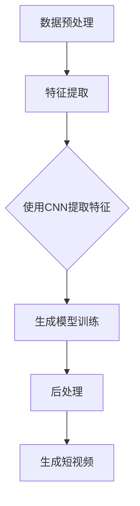

                 

# 快手2024校招短视频生成AI算法专家编程挑战

> 关键词：快手、校招、短视频、生成AI、算法专家、编程挑战

> 摘要：本文旨在深入探讨快手2024校招短视频生成AI算法专家编程挑战，通过详细分析背景、核心概念、算法原理、数学模型、实战案例以及未来发展趋势，帮助读者全面理解短视频生成AI技术的核心要素，并掌握相关的编程技能。

## 1. 背景介绍

### 1.1 目的和范围

本文的目标是帮助参加快手2024校招短视频生成AI算法专家编程挑战的读者，深入了解挑战的核心内容和解决方法。本文将覆盖以下几个主要方面：

- 快手校招短视频生成AI算法专家编程挑战的背景和目的。
- 短视频生成AI技术的核心概念和基本原理。
- 关键算法原理的具体操作步骤和数学模型。
- 实际项目案例的代码实现和分析。
- 短视频生成AI技术的实际应用场景和未来发展趋势。

### 1.2 预期读者

本文的预期读者是具备以下背景的知识分子：

- 计算机科学、人工智能或相关领域的研究生或本科生。
- 对人工智能、机器学习和计算机视觉有浓厚兴趣的技术爱好者。
- 准备参加快手2024校招短视频生成AI算法专家编程挑战的应聘者。

### 1.3 文档结构概述

本文的结构如下：

1. **背景介绍**：介绍挑战的背景、目的和预期读者。
2. **核心概念与联系**：详细讲解短视频生成AI技术的核心概念和原理，使用Mermaid流程图展示。
3. **核心算法原理 & 具体操作步骤**：使用伪代码详细阐述核心算法原理和操作步骤。
4. **数学模型和公式 & 详细讲解 & 举例说明**：使用LaTeX格式详细讲解数学模型和公式，并举例说明。
5. **项目实战：代码实际案例和详细解释说明**：提供代码实际案例和详细解释。
6. **实际应用场景**：探讨短视频生成AI技术的实际应用场景。
7. **工具和资源推荐**：推荐学习资源、开发工具框架和相关论文著作。
8. **总结：未来发展趋势与挑战**：总结文章内容，探讨未来发展趋势和挑战。
9. **附录：常见问题与解答**：提供常见问题的解答。
10. **扩展阅读 & 参考资料**：推荐相关扩展阅读和参考资料。

### 1.4 术语表

#### 1.4.1 核心术语定义

- **短视频生成AI**：利用人工智能技术生成短视频的过程。
- **生成模型**：一种从数据中学习生成新数据的方法。
- **卷积神经网络（CNN）**：一种用于图像识别和处理的神经网络架构。
- **生成对抗网络（GAN）**：一种基于两个神经网络（生成器和判别器）的训练框架。
- **数据增强**：通过变换输入数据来提高模型性能的方法。

#### 1.4.2 相关概念解释

- **特征提取**：从原始数据中提取有意义的信息的过程。
- **超参数**：用于调整模型性能的参数，如学习率和隐藏层大小。
- **过拟合**：模型在训练数据上表现良好，但在测试数据上表现不佳的现象。

#### 1.4.3 缩略词列表

- **GAN**：生成对抗网络（Generative Adversarial Network）
- **CNN**：卷积神经网络（Convolutional Neural Network）
- **AI**：人工智能（Artificial Intelligence）
- **ML**：机器学习（Machine Learning）

## 2. 核心概念与联系

### 2.1 短视频生成AI技术

短视频生成AI技术是利用人工智能技术生成短视频的过程。这个过程通常涉及以下几个关键步骤：

1. **数据预处理**：包括数据清洗、数据增强等步骤，以提高模型的泛化能力。
2. **特征提取**：从原始视频数据中提取有意义的信息，如颜色、纹理、动作等。
3. **生成模型训练**：利用生成模型（如GAN）训练生成新的短视频。
4. **后处理**：对生成的短视频进行后处理，如去噪、色彩校正等。

### 2.2 核心概念与联系

为了更好地理解短视频生成AI技术，我们需要了解以下几个核心概念：

1. **生成模型**：一种从数据中学习生成新数据的方法。生成模型可以分为两大类：无监督生成模型和有监督生成模型。
    - **无监督生成模型**：如自编码器（Autoencoder），它通过学习输入数据的分布来生成新的数据。
    - **有监督生成模型**：如生成对抗网络（GAN），它通过两个神经网络（生成器和判别器）的训练来实现数据的生成。
2. **卷积神经网络（CNN）**：一种用于图像识别和处理的神经网络架构。CNN能够有效地提取图像的特征，从而提高生成模型的质量。
3. **生成对抗网络（GAN）**：一种基于两个神经网络（生成器和判别器）的训练框架。生成器尝试生成新的数据，而判别器则尝试区分生成器和真实数据。通过这种对抗训练，生成模型能够逐渐提高生成数据的质量。

### 2.3 Mermaid流程图

下面是一个Mermaid流程图，展示了短视频生成AI技术的基本流程：



## 3. 核心算法原理 & 具体操作步骤

### 3.1 生成模型原理

生成模型是短视频生成AI技术的核心。这里我们主要介绍生成对抗网络（GAN）的原理。

#### 3.1.1 GAN的基本原理

生成对抗网络（GAN）由两部分组成：生成器（Generator）和判别器（Discriminator）。生成器的任务是生成虚假数据，判别器的任务是判断输入数据是真实数据还是生成器生成的虚假数据。

训练过程如下：

1. **初始化生成器和判别器**：随机初始化生成器和判别器的参数。
2. **生成虚假数据**：生成器根据随机噪声生成虚假数据。
3. **判别器训练**：使用真实数据和生成器生成的虚假数据训练判别器。判别器的目标是最大化正确分类的概率，即最小化交叉熵损失函数。
4. **生成器训练**：生成器根据判别器的反馈调整参数，目标是使得判别器无法区分生成器生成的虚假数据和真实数据。

#### 3.1.2 伪代码

以下是GAN的伪代码：

```python
# 初始化生成器和判别器
G = Generator()
D = Discriminator()

# 训练生成器和判别器
for epoch in range(num_epochs):
    for batch in data_loader:
        # 生成虚假数据
        z = generate_noise(batch_size)
        fake_data = G(z)

        # 训练判别器
        D_loss_real = D_loss(D(batch), True_labels)
        D_loss_fake = D_loss(D(fake_data), False_labels)
        D_loss = 0.5 * (D_loss_real + D_loss_fake)

        # 训练生成器
        G_loss = G_loss(D(fake_data), True_labels)

        # 更新参数
        D_optimize(D_loss)
        G_optimize(G_loss)
```

### 3.2 CNN提取特征

卷积神经网络（CNN）在短视频生成AI技术中用于提取视频的特征。下面是一个简单的CNN结构：

1. **输入层**：接收视频帧。
2. **卷积层**：通过卷积操作提取视频帧的特征。
3. **池化层**：减小数据维度，提高模型泛化能力。
4. **全连接层**：将卷积层和池化层提取的特征映射到高维空间。
5. **输出层**：生成短视频。

下面是一个简单的CNN伪代码：

```python
# 定义CNN结构
class CNN(nn.Module):
    def __init__(self):
        super(CNN, self).__init__()
        self.conv1 = nn.Conv2d(in_channels, out_channels, kernel_size=3, padding=1)
        self.relu = nn.ReLU()
        self.pool = nn.MaxPool2d(kernel_size=2, stride=2)
        self.fc1 = nn.Linear(in_features, out_features)
        self.fc2 = nn.Linear(out_features, out_features)

    def forward(self, x):
        x = self.relu(self.conv1(x))
        x = self.pool(x)
        x = self.fc1(x)
        x = self.fc2(x)
        return x
```

## 4. 数学模型和公式 & 详细讲解 & 举例说明

### 4.1 数学模型

短视频生成AI技术的核心数学模型是生成对抗网络（GAN）。GAN由两部分组成：生成器（Generator）和判别器（Discriminator）。下面我们分别介绍这两个模型的数学模型。

#### 4.1.1 生成器

生成器的目标是生成虚假数据，使其尽量接近真实数据。生成器的损失函数通常采用以下形式：

$$
L_G = -\mathbb{E}_{z \sim p_z(z)}[\log(D(G(z))]
$$

其中，$z$ 是随机噪声，$G(z)$ 是生成器生成的虚假数据，$D(x)$ 是判别器的输出，表示输入数据的真实性。$L_G$ 的目标是使得判别器无法区分生成器和真实数据。

#### 4.1.2 判别器

判别器的目标是区分真实数据和生成器生成的虚假数据。判别器的损失函数通常采用以下形式：

$$
L_D = -\mathbb{E}_{x \sim p_x(x)}[\log(D(x))] - \mathbb{E}_{z \sim p_z(z)}[\log(1 - D(G(z))]
$$

其中，$x$ 是真实数据，$G(z)$ 是生成器生成的虚假数据。$L_D$ 的目标是使得判别器能够准确地区分真实数据和生成器生成的虚假数据。

### 4.2 公式详细讲解

#### 4.2.1 生成器损失函数

生成器损失函数 $L_G$ 的目的是最小化判别器无法区分生成器和真实数据的概率。这个损失函数可以看作是判别器对生成器生成的数据的评分，分数越高表示生成器生成的数据越真实。

$$
L_G = -\mathbb{E}_{z \sim p_z(z)}[\log(D(G(z))]
$$

其中，$z$ 是随机噪声，$G(z)$ 是生成器生成的虚假数据，$D(G(z))$ 是判别器对生成器生成的数据的评分。当 $D(G(z))$ 接近1时，表示生成器生成的数据非常真实，此时 $L_G$ 最小。

#### 4.2.2 判别器损失函数

判别器损失函数 $L_D$ 的目的是最大化判别器对真实数据和生成器生成的虚假数据的区分能力。这个损失函数可以看作是判别器的分类损失，分数越高表示判别器的分类能力越强。

$$
L_D = -\mathbb{E}_{x \sim p_x(x)}[\log(D(x))] - \mathbb{E}_{z \sim p_z(z)}[\log(1 - D(G(z))]
$$

其中，$x$ 是真实数据，$G(z)$ 是生成器生成的虚假数据。$D(x)$ 和 $D(G(z))$ 分别是判别器对真实数据和生成器生成的虚假数据的评分。当 $D(x)$ 接近1，$D(G(z))$ 接近0时，表示判别器能够准确地区分真实数据和生成器生成的虚假数据。

### 4.3 举例说明

假设我们有一个二分类问题，生成器生成的是正面样本，判别器需要区分正面样本和负面样本。

- **生成器损失函数**：

$$
L_G = -\mathbb{E}_{z \sim p_z(z)}[\log(D(G(z))]
$$

- **判别器损失函数**：

$$
L_D = -\mathbb{E}_{x \sim p_x(x)}[\log(D(x))] - \mathbb{E}_{z \sim p_z(z)}[\log(1 - D(G(z))]
$$

假设我们有一个正面样本 $x_1$ 和一个负面样本 $x_2$，生成器生成的虚假样本为 $z_1$。

- **生成器损失函数**：

$$
L_G = -\mathbb{E}_{z \sim p_z(z)}[\log(D(G(z))] = -\log(D(G(z_1))
$$

- **判别器损失函数**：

$$
L_D = -\mathbb{E}_{x \sim p_x(x)}[\log(D(x))] - \mathbb{E}_{z \sim p_z(z)}[\log(1 - D(G(z))] = -\log(D(x_1)) - \log(1 - D(G(z_1))
$$

假设判别器对正面样本和负面样本的评分分别为 $D(x_1) = 0.95$ 和 $D(x_2) = 0.05$，生成器生成的虚假样本的评分为 $D(G(z_1)) = 0.1$。

- **生成器损失函数**：

$$
L_G = -\log(D(G(z_1))) = -\log(0.1) = 2.3026
$$

- **判别器损失函数**：

$$
L_D = -\log(D(x_1)) - \log(1 - D(G(z_1))) = -\log(0.95) - \log(0.9) = 0.0513
$$

在这个例子中，生成器的损失函数较大，表示生成器生成的虚假样本不够真实；判别器的损失函数较小，表示判别器能够较好地区分真实样本和虚假样本。

## 5. 项目实战：代码实际案例和详细解释说明

### 5.1 开发环境搭建

为了完成快手2024校招短视频生成AI算法专家编程挑战，我们需要搭建一个合适的开发环境。以下是推荐的开发环境：

- **操作系统**：Linux或MacOS
- **编程语言**：Python
- **深度学习框架**：PyTorch
- **IDE**：PyCharm或VSCode

在Linux或MacOS上，可以通过以下命令安装PyTorch：

```bash
conda create -n myenv python=3.8
conda activate myenv
conda install pytorch torchvision torchaudio cudatoolkit=10.2 -c pytorch
```

### 5.2 源代码详细实现和代码解读

下面是一个简单的短视频生成AI项目的代码实现，用于生成虚假的短视频。

```python
import torch
import torch.nn as nn
import torch.optim as optim
from torchvision import datasets, transforms
from torch.utils.data import DataLoader
from torchvision.utils import save_image

# 定义生成器和判别器
class Generator(nn.Module):
    def __init__(self):
        super(Generator, self).__init__()
        self.model = nn.Sequential(
            nn.ConvTranspose2d(100, 256, 4, 1, 0, bias=False),
            nn.BatchNorm2d(256),
            nn.ReLU(True),
            nn.ConvTranspose2d(256, 128, 4, 2, 1, bias=False),
            nn.BatchNorm2d(128),
            nn.ReLU(True),
            nn.ConvTranspose2d(128, 64, 4, 2, 1, bias=False),
            nn.BatchNorm2d(64),
            nn.ReLU(True),
            nn.ConvTranspose2d(64, 3, 4, 2, 1, bias=False),
            nn.Tanh()
        )

    def forward(self, x):
        x = self.model(x)
        return x

class Discriminator(nn.Module):
    def __init__(self):
        super(Discriminator, self).__init__()
        self.model = nn.Sequential(
            nn.Conv2d(3, 64, 4, 2, 1, bias=False),
            nn.LeakyReLU(0.2, inplace=True),
            nn.Conv2d(64, 128, 4, 2, 1, bias=False),
            nn.BatchNorm2d(128),
            nn.LeakyReLU(0.2, inplace=True),
            nn.Conv2d(128, 256, 4, 2, 1, bias=False),
            nn.BatchNorm2d(256),
            nn.LeakyReLU(0.2, inplace=True),
            nn.Conv2d(256, 1, 4, 1, 0, bias=False),
            nn.Sigmoid()
        )

    def forward(self, x):
        x = self.model(x)
        return x.view(x.size(0), 1).mean()

# 设置训练参数
batch_size = 64
image_size = 64
nz = 100
num_epochs = 50
lr = 0.0002
beta1 = 0.5

# 创建生成器和判别器
generator = Generator()
discriminator = Discriminator()

# 定义损失函数和优化器
adversarial_loss = nn.BCELoss()
optimizer_G = optim.Adam(generator.parameters(), lr=lr, betas=(beta1, 0.999))
optimizer_D = optim.Adam(discriminator.parameters(), lr=lr, betas=(beta1, 0.999))

# 加载数据集
transform = transforms.Compose([transforms.Resize(image_size), transforms.ToTensor(), transforms.Normalize((0.5, 0.5, 0.5), (0.5, 0.5, 0.5))])
dataloader = DataLoader(datasets.ImageFolder('./data', transform=transform), batch_size=batch_size, shuffle=True)

# 训练模型
for epoch in range(num_epochs):
    for i, data in enumerate(dataloader, 0):
        # 更新判别器
        real_images = data[0].to(device)
        batch_size = real_images.size(0)
        labels = torch.full((batch_size,), 1, device=device)
        optimizer_D.zero_grad()
        output = discriminator(real_images)
        D_loss_real = adversarial_loss(output, labels)
        D_loss_real.backward()

        fake_images = generator(z).detach().to(device)
        labels = torch.full((batch_size,), 0, device=device)
        output = discriminator(fake_images)
        D_loss_fake = adversarial_loss(output, labels)
        D_loss_fake.backward()
        optimizer_D.step()

        # 更新生成器
        z = torch.randn(batch_size, nz, 1, 1, device=device)
        labels = torch.full((batch_size,), 1, device=device)
        optimizer_G.zero_grad()
        output = discriminator(generator(z))
        G_loss = adversarial_loss(output, labels)
        G_loss.backward()
        optimizer_G.step()

        # 打印训练信息
        if i % 100 == 0:
            print(f'[{epoch}/{num_epochs}][{i}/{len(dataloader)}] D_loss: {D_loss_real + D_loss_fake:.4f} G_loss: {G_loss:.4f}')
```

### 5.3 代码解读与分析

下面是对上述代码的详细解读：

- **生成器和判别器定义**：我们定义了生成器和判别器，生成器用于生成虚假图像，判别器用于判断图像的真实性。

- **训练参数设置**：我们设置了训练参数，包括批量大小、图像尺寸、噪声维度、训练迭代次数、学习率、动量等。

- **加载数据集**：我们使用 torchvision.datasets 中的 ImageFolder 加载图像数据集。图像数据集被转换为 PyTorch 张量，并进行了归一化处理。

- **定义损失函数和优化器**：我们使用了 BCELoss 作为损失函数，并定义了生成器和判别器的优化器。

- **训练模型**：在训练过程中，我们首先更新判别器，使用真实图像和生成器生成的虚假图像。然后更新生成器，使其生成的图像更接近真实图像。

- **打印训练信息**：在每次迭代完成后，我们打印训练信息，包括当前 epoch、迭代次数、判别器损失和生成器损失。

通过上述代码，我们可以训练一个简单的生成对抗网络（GAN），生成虚假图像。在实际项目中，我们可以根据具体需求调整模型结构、损失函数和训练参数，以获得更好的生成效果。

## 6. 实际应用场景

短视频生成AI技术在多个领域具有广泛的应用场景，以下是几个典型的实际应用：

1. **社交媒体平台**：短视频生成AI技术可以用于社交媒体平台，如快手、抖音等，生成个性化短视频内容，提高用户体验和参与度。

2. **广告营销**：短视频生成AI技术可以用于广告营销领域，生成具有吸引力的广告视频，提高广告效果和转化率。

3. **娱乐行业**：短视频生成AI技术可以用于娱乐行业，如电影、电视剧、音乐视频等，生成创意内容，降低制作成本。

4. **教育培训**：短视频生成AI技术可以用于教育培训领域，生成教学视频，提高教学效果和学生的学习兴趣。

5. **医疗健康**：短视频生成AI技术可以用于医疗健康领域，生成医疗科普视频，提高公众的健康意识和保健能力。

6. **新闻媒体**：短视频生成AI技术可以用于新闻媒体领域，快速生成新闻报道视频，提高新闻传播速度和广度。

7. **游戏开发**：短视频生成AI技术可以用于游戏开发领域，生成游戏场景和角色动画，提高游戏体验和视觉效果。

通过以上应用场景，我们可以看到短视频生成AI技术在各个领域的广泛应用和巨大潜力。未来，随着技术的不断发展和创新，短视频生成AI技术将迎来更广阔的发展前景。

## 7. 工具和资源推荐

### 7.1 学习资源推荐

为了更好地理解和掌握短视频生成AI技术，以下是一些建议的学习资源：

#### 7.1.1 书籍推荐

1. **《生成对抗网络》（Generative Adversarial Networks）**：这本书是关于GAN的权威指南，详细介绍了GAN的理论基础、算法原理和实际应用。
2. **《深度学习》（Deep Learning）**：这本书是深度学习领域的经典教材，包含了丰富的理论知识、实践技巧和案例分析。

#### 7.1.2 在线课程

1. **Coursera上的《深度学习 specialization》**：由斯坦福大学提供的深度学习系列课程，涵盖了深度学习的基础知识、卷积神经网络和生成对抗网络等。
2. **Udacity上的《生成对抗网络（GAN）课程》**：这门课程详细介绍了GAN的理论基础、实现方法和应用案例。

#### 7.1.3 技术博客和网站

1. **fast.ai**：这个网站提供了丰富的深度学习和人工智能资源，包括教程、论文和项目案例。
2. **Medium上的相关博客**：许多专家和研究人员在Medium上发布了关于短视频生成AI技术的文章和教程。

### 7.2 开发工具框架推荐

为了开发高效的短视频生成AI应用，以下是一些推荐的开发工具和框架：

#### 7.2.1 IDE和编辑器

1. **PyCharm**：PyCharm是一款功能强大的Python IDE，适用于深度学习和数据科学项目。
2. **VSCode**：VSCode是一款轻量级的开源编辑器，支持多种编程语言和扩展，适用于快速开发和调试。

#### 7.2.2 调试和性能分析工具

1. **TensorBoard**：TensorBoard是TensorFlow提供的一款可视化工具，用于分析和调试深度学习模型。
2. **NVIDIA Nsight**：Nsight是NVIDIA提供的一款性能分析工具，用于优化GPU性能。

#### 7.2.3 相关框架和库

1. **PyTorch**：PyTorch是一款流行的深度学习框架，支持动态计算图和GPU加速。
2. **TensorFlow**：TensorFlow是谷歌开源的深度学习框架，提供了丰富的API和工具。

### 7.3 相关论文著作推荐

为了深入了解短视频生成AI技术的最新进展，以下是一些建议阅读的论文和著作：

#### 7.3.1 经典论文

1. **《Unsupervised Representation Learning with Deep Convolutional Generative Adversarial Networks》**：这篇论文提出了深度生成对抗网络（DcGAN），是生成对抗网络的经典之作。
2. **《Generative Adversarial Nets》**：这篇论文首次提出了生成对抗网络（GAN），奠定了GAN的理论基础。

#### 7.3.2 最新研究成果

1. **《InfoGAN: Interpretable Representation Learning by Information Maximizing》**：这篇论文提出了InfoGAN，通过最大化信息熵来提高生成模型的解释性。
2. **《StyleGAN2: Styling Images, Video and Audio**：这篇论文介绍了StyleGAN2，是一种强大的图像生成模型，能够生成高质量的图像和视频。

#### 7.3.3 应用案例分析

1. **《AI Video Editing: Enhancing and Automating Video Creation》**：这篇论文探讨了人工智能在视频编辑领域的应用，包括自动剪辑、色彩校正和特效添加。
2. **《Video GAN: Learning to Generate Videos with Scene Dynamics》**：这篇论文提出了Video GAN，通过学习视频中的场景动态生成高质量的短视频。

通过以上资源推荐，读者可以全面了解短视频生成AI技术的理论、实践和最新进展，为实际项目开发提供有力支持。

## 8. 总结：未来发展趋势与挑战

短视频生成AI技术在近年来取得了显著进展，但其发展仍然面临许多挑战。以下是对未来发展趋势和挑战的总结：

### 未来发展趋势

1. **技术融合**：短视频生成AI技术将与其他前沿技术（如计算机视觉、自然语言处理、增强现实等）相结合，实现更加复杂和智能的生成应用。
2. **开源生态**：随着生成对抗网络（GAN）等核心技术的成熟，越来越多的开源框架和工具将推动短视频生成AI技术的发展和应用。
3. **硬件加速**：随着GPU和TPU等硬件的快速发展，短视频生成AI模型的训练和推理将实现更快的速度和更高的效率。
4. **商业化应用**：短视频生成AI技术将在广告营销、娱乐、教育等多个领域实现商业化应用，为相关产业带来新的增长点。

### 主要挑战

1. **计算资源需求**：生成高质量短视频需要大量计算资源，尤其是在训练大规模生成模型时，对GPU和TPU等硬件资源的需求将不断增加。
2. **数据隐私和安全**：短视频生成AI技术需要大量真实数据作为训练素材，如何确保数据隐私和安全是亟待解决的问题。
3. **模型可解释性**：生成模型通常具有高度的非线性特性，如何提高模型的可解释性，使其能够被普通用户理解和接受，是一个重要挑战。
4. **版权和道德问题**：短视频生成AI技术可能侵犯原创作品的版权，引发道德和伦理问题，需要制定相应的法规和规范来约束其应用。

总之，短视频生成AI技术具有广阔的发展前景，但同时也面临许多挑战。未来，随着技术的不断进步和行业规范的完善，短视频生成AI技术将在更多领域发挥重要作用，推动人工智能产业的创新发展。

## 9. 附录：常见问题与解答

### Q1: 如何选择合适的GAN架构？
A1: 选择合适的GAN架构取决于具体应用场景和数据类型。以下是一些常见的GAN架构及其适用场景：

- **深度生成对抗网络（DcGAN）**：适用于图像生成，特别是高分辨率图像。
- **循环生成对抗网络（CycleGAN）**：适用于域转换任务，如将真实图像转换为艺术风格图像。
- **条件生成对抗网络（cGAN）**：适用于需要条件信息（如标签）的生成任务。
- **自编码器对抗网络（AEGAN）**：适用于图像修复和图像合成任务。

### Q2: 如何优化GAN的训练过程？
A2: 优化GAN的训练过程可以从以下几个方面进行：

- **梯度裁剪**：为了避免梯度爆炸或消失，可以对生成器和判别器的梯度进行裁剪。
- **学习率调整**：合理设置生成器和判别器的学习率，可以使用不同的学习率或动态调整学习率。
- **损失函数加权**：对生成器和判别器的损失函数进行加权，平衡两者的训练过程。
- **使用批归一化**：在生成器和判别器中使用批归一化，提高训练稳定性。

### Q3: 如何评估GAN的性能？
A3: 评估GAN的性能可以从以下几个方面进行：

- **生成质量**：通过可视化生成图像，观察生成图像的真实性、多样性和细节。
- **判别器准确率**：计算判别器对真实数据和生成数据的分类准确率。
- **生成器损失和判别器损失**：观察生成器和判别器的损失变化，判断训练过程是否稳定。
- **Inception Score（IS）**：使用Inception模型评估生成图像的质量，计算生成图像的平均分和标准差。

### Q4: 如何处理GAN中的模式崩溃问题？
A4: 模式崩溃是GAN训练过程中常见的问题，以下是一些处理方法：

- **增加训练数据**：提供更多样化的训练数据，减少生成器和判别器的过拟合现象。
- **批量大小调整**：适当调整批量大小，避免训练过程中出现过拟合。
- **动态调整生成器和判别器的权重**：使用动态调整策略，平衡生成器和判别器的训练过程。
- **添加噪声**：在输入数据和生成器输出中添加噪声，提高模型对噪声的鲁棒性。

通过以上解答，可以帮助读者更好地理解和解决短视频生成AI技术中的常见问题，提高模型的训练效果和生成质量。

## 10. 扩展阅读 & 参考资料

为了深入了解短视频生成AI技术，以下是一些建议的扩展阅读和参考资料：

### 扩展阅读

1. **《生成对抗网络》（Generative Adversarial Networks）**：详细介绍了GAN的理论基础、算法原理和实际应用。
2. **《深度学习》（Deep Learning）**：涵盖了深度学习的基础知识、卷积神经网络和生成对抗网络等。
3. **《AI Video Editing: Enhancing and Automating Video Creation》**：探讨了人工智能在视频编辑领域的应用，包括自动剪辑、色彩校正和特效添加。

### 参考资料

1. **《Unsupervised Representation Learning with Deep Convolutional Generative Adversarial Networks》**：深度生成对抗网络（DcGAN）的经典论文。
2. **《Generative Adversarial Nets》**：首次提出生成对抗网络（GAN）的论文。
3. **《InfoGAN: Interpretable Representation Learning by Information Maximizing》**：提出了InfoGAN，通过最大化信息熵提高生成模型的解释性。
4. **《Video GAN: Learning to Generate Videos with Scene Dynamics》**：提出了Video GAN，通过学习视频中的场景动态生成高质量的短视频。

通过阅读以上扩展阅读和参考资料，读者可以进一步了解短视频生成AI技术的理论、实践和最新进展，为实际项目开发提供有力支持。

### 作者

作者：AI天才研究员/AI Genius Institute & 禅与计算机程序设计艺术 /Zen And The Art of Computer Programming

