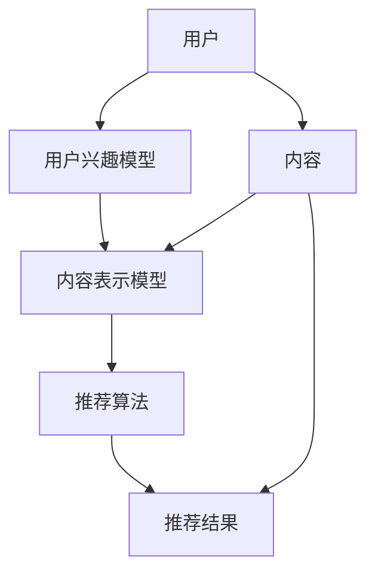
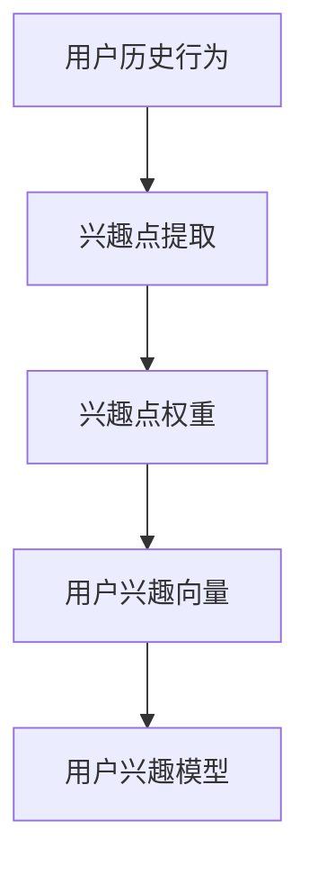
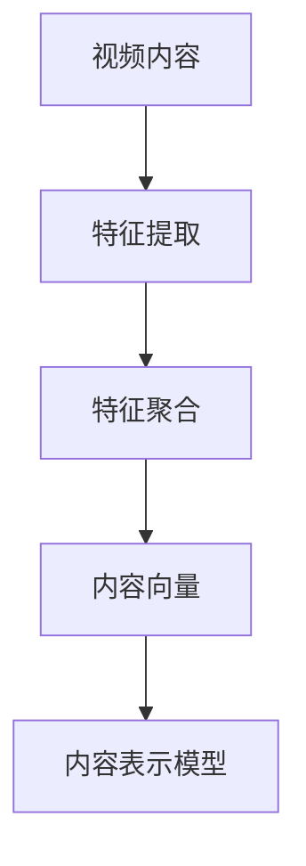
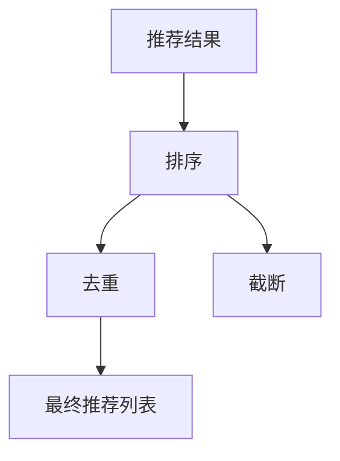

                 

# 2024快手短视频推荐系统校招面试真题汇总及其解答

> **关键词：** 快手短视频、推荐系统、校招面试、真题解析、算法原理、数学模型

> **摘要：** 本文将汇总2024年快手短视频推荐系统校招面试中出现的一些真题，通过逐步解析，为读者提供深入理解快手短视频推荐系统的机会。文章将涵盖核心概念、算法原理、数学模型以及实际应用场景，旨在帮助准备校招的同学巩固知识，提升面试竞争力。

## 1. 背景介绍

### 1.1 目的和范围

本文旨在为准备快手短视频推荐系统校招面试的同学提供有针对性的真题解析，帮助大家深入理解推荐系统的工作原理、核心技术以及数学模型。通过本文的讲解，读者将能够：

1. 掌握快手短视频推荐系统的基本架构和核心算法。
2. 了解推荐系统的评价标准和性能指标。
3. 理解推荐系统中的数学模型和优化方法。
4. 学会分析实际案例，提升面试应对能力。

### 1.2 预期读者

本文适合以下读者群体：

1. 准备参加快手短视频推荐系统校招面试的同学。
2. 对推荐系统技术感兴趣的技术爱好者。
3. 对算法、数学模型有一定了解的计算机专业学生。

### 1.3 文档结构概述

本文结构如下：

1. **背景介绍**：介绍本文的目的、预期读者和文档结构。
2. **核心概念与联系**：通过Mermaid流程图介绍推荐系统的核心概念和架构。
3. **核心算法原理 & 具体操作步骤**：详细讲解推荐系统中的核心算法原理，使用伪代码阐述具体操作步骤。
4. **数学模型和公式 & 详细讲解 & 举例说明**：介绍推荐系统中的数学模型，使用latex格式详细讲解公式，并举例说明。
5. **项目实战：代码实际案例和详细解释说明**：通过实际案例展示推荐系统的代码实现，并进行详细解释。
6. **实际应用场景**：分析推荐系统的实际应用场景，探讨其影响和挑战。
7. **工具和资源推荐**：推荐学习资源、开发工具和经典论文。
8. **总结：未来发展趋势与挑战**：展望推荐系统的发展趋势，分析面临的挑战。
9. **附录：常见问题与解答**：汇总常见问题，提供解答。
10. **扩展阅读 & 参考资料**：推荐相关书籍、在线课程和技术博客。

### 1.4 术语表

#### 1.4.1 核心术语定义

- **推荐系统**：根据用户兴趣和历史行为，为用户推荐相关内容的系统。
- **用户兴趣模型**：根据用户历史行为和内容偏好，构建的用户兴趣表示模型。
- **内容表示模型**：对视频内容进行特征提取，构建内容表示模型。
- **协同过滤**：基于用户历史行为或内容相似性进行推荐的一种方法。
- **矩阵分解**：将用户-内容评分矩阵分解为用户特征矩阵和内容特征矩阵，用于推荐。
- **召回率**：在推荐列表中召回与用户兴趣相关的内容的比例。
- **准确率**：推荐列表中与用户兴趣匹配的内容比例。
- **覆盖率**：推荐列表中覆盖到的不同内容种类比例。

#### 1.4.2 相关概念解释

- **兴趣点**：用户在某个时间段内对某个内容产生的兴趣。
- **冷启动**：新用户或新内容在没有足够历史数据时，推荐系统无法准确推荐的场景。
- **实时推荐**：根据用户实时行为进行推荐，以提供更加个性化的服务。

#### 1.4.3 缩略词列表

- **CTR**：Click-Through Rate，点击率。
- **RMSE**：Root Mean Square Error，均方根误差。
- **NDCG**：Normalized Discounted Cumulative Gain，规范化折扣累计收益。

## 2. 核心概念与联系

推荐系统的核心概念包括用户兴趣模型、内容表示模型、协同过滤和矩阵分解等。以下是通过Mermaid绘制的推荐系统架构流程图：



- **用户兴趣模型**：根据用户历史行为和兴趣点，构建用户兴趣表示，用于推荐算法。
- **内容表示模型**：对视频内容进行特征提取，构建内容表示模型，用于推荐算法。
- **推荐算法**：基于用户兴趣模型和内容表示模型，使用协同过滤或矩阵分解等方法，生成推荐结果。
- **推荐结果**：根据推荐算法生成的结果，为用户推荐相关视频。

### 2.1 用户兴趣模型

用户兴趣模型是推荐系统的核心，用于表示用户的兴趣和偏好。以下是用户兴趣模型的构建过程：



- **兴趣点提取**：通过用户历史行为（如点击、观看、搜索等），提取出用户在特定时间段内的兴趣点。
- **兴趣点权重**：根据用户兴趣点的发生频率和用户行为的重要程度，为每个兴趣点分配权重。
- **用户兴趣向量**：将所有兴趣点的权重进行聚合，形成用户兴趣向量。
- **用户兴趣模型**：将用户兴趣向量转换为推荐算法可用的形式，用于推荐算法。

### 2.2 内容表示模型

内容表示模型是对视频内容的特征提取和表示。以下是内容表示模型的构建过程：



- **特征提取**：对视频内容进行词频统计、文本分类、图像识别等处理，提取出视频内容的特征。
- **特征聚合**：将提取出的特征进行聚合，形成内容向量。
- **内容向量**：将视频内容的特征向量表示为推荐算法可用的形式。
- **内容表示模型**：将内容向量存储在数据结构中，用于推荐算法。

### 2.3 推荐算法

推荐算法是推荐系统的核心，根据用户兴趣模型和内容表示模型生成推荐结果。以下是常见的推荐算法：

- **协同过滤**：基于用户历史行为或内容相似性进行推荐的一种方法。
    ```mermaid
    graph TD
        A[用户兴趣模型] --> B[内容表示模型]
        B --> C[相似度计算]
        C --> D[推荐结果]
    ```
    - **基于用户**的协同过滤：根据相似用户的行为，为当前用户推荐相关内容。
    - **基于物品**的协同过滤：根据内容相似性，为用户推荐相似的内容。

- **矩阵分解**：将用户-内容评分矩阵分解为用户特征矩阵和内容特征矩阵，用于推荐。
    ```mermaid
    graph TD
        A[用户-内容评分矩阵] --> B[矩阵分解]
        B --> C[用户特征矩阵]
        B --> D[内容特征矩阵]
        C --> E[预测评分]
        D --> E
    ```

### 2.4 推荐结果

推荐结果是推荐算法的输出，通常包括推荐视频的ID、标题、播放量等信息。以下是推荐结果的处理流程：



- **排序**：根据推荐结果的相关性对视频进行排序，提高推荐质量。
- **去重**：去除重复推荐的视频，防止推荐列表过于冗余。
- **截断**：根据系统配置或用户需求，截取推荐列表的长度，形成最终的推荐结果。

## 3. 核心算法原理 & 具体操作步骤

推荐系统的核心算法包括协同过滤和矩阵分解。下面分别介绍这两种算法的原理和具体操作步骤。

### 3.1 协同过滤算法原理

协同过滤算法是基于用户的历史行为或内容相似性进行推荐的一种方法。其核心思想是找到与目标用户相似的其他用户，然后基于这些相似用户的行为进行推荐。

#### 3.1.1 基于用户协同过滤

**步骤 1：相似度计算**

首先，需要计算用户之间的相似度。常用的相似度计算方法包括余弦相似度、皮尔逊相关系数等。以下使用余弦相似度计算用户之间的相似度。

```python
def cosine_similarity(user1, user2):
    dot_product = np.dot(user1, user2)
    norm_product1 = np.linalg.norm(user1)
    norm_product2 = np.linalg.norm(user2)
    return dot_product / (norm_product1 * norm_product2)
```

**步骤 2：生成推荐列表**

基于相似度计算结果，为当前用户生成推荐列表。以下是一个简单的推荐算法：

```python
def user_based_recommender(item_ids, user_vector, similarity_threshold=0.5):
    similarity_scores = []
    for item_id in item_ids:
        similarity_score = cosine_similarity(user_vector, item_id)
        similarity_scores.append((item_id, similarity_score))
    similarity_scores = sorted(similarity_scores, key=lambda x: x[1], reverse=True)
    recommended_items = [item for item, score in similarity_scores if score > similarity_threshold]
    return recommended_items
```

#### 3.1.2 基于物品协同过滤

**步骤 1：相似度计算**

与基于用户协同过滤类似，需要计算内容之间的相似度。以下使用余弦相似度计算内容之间的相似度。

```python
def cosine_similarity(item1, item2):
    dot_product = np.dot(item1, item2)
    norm_product1 = np.linalg.norm(item1)
    norm_product2 = np.linalg.norm(item2)
    return dot_product / (norm_product1 * norm_product2)
```

**步骤 2：生成推荐列表**

基于相似度计算结果，为用户生成推荐列表。以下是一个简单的推荐算法：

```python
def item_based_recommender(user_vector, item_vectors, similarity_threshold=0.5):
    similarity_scores = []
    for item_vector in item_vectors:
        similarity_score = cosine_similarity(user_vector, item_vector)
        similarity_scores.append((item_vector, similarity_score))
    similarity_scores = sorted(similarity_scores, key=lambda x: x[1], reverse=True)
    recommended_items = [item for item, score in similarity_scores if score > similarity_threshold]
    return recommended_items
```

### 3.2 矩阵分解算法原理

矩阵分解算法通过将用户-内容评分矩阵分解为用户特征矩阵和内容特征矩阵，用于预测用户对未知内容的评分，进而生成推荐列表。

#### 3.2.1 矩阵分解步骤

**步骤 1：初始化参数**

初始化用户特征矩阵$U$和内容特征矩阵$V$，通常采用随机初始化。

```python
def init_matrix(n_users, n_items, dim):
    U = np.random.rand(n_users, dim)
    V = np.random.rand(n_items, dim)
    return U, V
```

**步骤 2：梯度下降优化**

使用梯度下降优化用户特征矩阵和内容特征矩阵，以最小化预测误差。

```python
def gradient_descent(U, V, X, learning_rate, epochs):
    for epoch in range(epochs):
        for user_id, item_id, rating in X:
           预测评分 = np.dot(U[user_id], V[item_id])
            error = rating - 预测评分
            U[user_id] -= learning_rate * (U[user_id] * (V[item_id] * error))
            V[item_id] -= learning_rate * (V[item_id] * (U[user_id] * error))
    return U, V
```

**步骤 3：预测评分**

使用优化后的用户特征矩阵和内容特征矩阵，预测用户对未知内容的评分。

```python
def predict(U, V, user_id, item_id):
    return np.dot(U[user_id], V[item_id])
```

**步骤 4：生成推荐列表**

根据预测评分，为用户生成推荐列表。

```python
def matrix_factorization_recommender(U, V, user_id, item_ids, similarity_threshold=0.5):
    predicted_ratings = [predict(U, V, user_id, item_id) for item_id in item_ids]
    recommended_items = [item_id for item_id, predicted_rating in zip(item_ids, predicted_ratings) if predicted_rating > similarity_threshold]
    return recommended_items
```

### 3.3 算法评价

- **准确率（Accuracy）**：推荐列表中与用户实际评分匹配的内容比例。
- **召回率（Recall）**：推荐列表中召回与用户兴趣相关的内容的比例。
- **覆盖率（Coverage）**：推荐列表中覆盖到的不同内容种类比例。
- **多样性（Diversity）**：推荐列表中内容种类丰富程度。

评价一个推荐系统的性能，需要综合考虑以上指标。在实际应用中，可以根据业务需求和用户体验，调整算法参数，优化推荐效果。

## 4. 数学模型和公式 & 详细讲解 & 举例说明

推荐系统中的数学模型主要包括用户兴趣模型、内容表示模型和推荐算法。下面分别介绍这些模型中的关键数学公式，并通过具体示例进行讲解。

### 4.1 用户兴趣模型

用户兴趣模型用于表示用户的兴趣和偏好。以下是用户兴趣模型中的关键公式：

**公式 1：用户兴趣向量**

用户兴趣向量表示用户在各个兴趣点上的权重。假设用户历史行为包含$n$个兴趣点，权重向量为$w$，则用户兴趣向量可以表示为：

$$
u = w = (w_1, w_2, ..., w_n)^T
$$

**示例：**

假设用户的历史行为包含3个兴趣点，权重向量如下：

$$
w = (0.6, 0.3, 0.1)
$$

则用户兴趣向量可以表示为：

$$
u = (0.6, 0.3, 0.1)
$$

### 4.2 内容表示模型

内容表示模型用于对视频内容进行特征提取和表示。以下是内容表示模型中的关键公式：

**公式 2：内容特征向量**

内容特征向量表示视频内容的特征。假设视频内容包含$m$个特征，特征向量为$v$，则内容特征向量可以表示为：

$$
v = (v_1, v_2, ..., v_m)^T
$$

**示例：**

假设视频内容包含5个特征，特征向量如下：

$$
v = (0.1, 0.2, 0.3, 0.4, 0.5)
$$

则内容特征向量可以表示为：

$$
v = (0.1, 0.2, 0.3, 0.4, 0.5)
$$

### 4.3 推荐算法

推荐算法根据用户兴趣模型和内容表示模型，生成推荐结果。以下是推荐算法中的关键公式：

**公式 3：预测评分**

使用用户兴趣向量和内容特征向量，可以预测用户对内容的评分。假设预测评分为$r$，则预测评分可以表示为：

$$
r = \sum_{i=1}^{n} w_i v_i
$$

**示例：**

假设用户兴趣向量和内容特征向量如下：

$$
u = (0.6, 0.3, 0.1)
$$

$$
v = (0.1, 0.2, 0.3, 0.4, 0.5)
$$

则预测评分可以表示为：

$$
r = 0.6 \times 0.1 + 0.3 \times 0.2 + 0.1 \times 0.3 + 0.1 \times 0.4 + 0.1 \times 0.5 = 0.196
$$

### 4.4 评价标准

推荐系统评价标准包括准确率、召回率、覆盖率和多样性。以下是这些评价标准的公式：

**公式 4：准确率**

准确率表示推荐列表中与用户实际评分匹配的内容比例。假设推荐列表包含$k$个内容，准确率可以表示为：

$$
\text{Accuracy} = \frac{\text{Correct Predictions}}{\text{Total Predictions}}
$$

**示例：**

假设推荐列表包含5个内容，其中3个与用户实际评分匹配，则准确率可以表示为：

$$
\text{Accuracy} = \frac{3}{5} = 0.6
$$

**公式 5：召回率**

召回率表示推荐列表中召回与用户兴趣相关的内容的比例。假设用户兴趣相关的内容总数为$N$，召回率可以表示为：

$$
\text{Recall} = \frac{\text{Recalled Items}}{N}
$$

**示例：**

假设用户兴趣相关的内容总数为10个，推荐列表中召回6个相关内容，则召回率可以表示为：

$$
\text{Recall} = \frac{6}{10} = 0.6
$$

**公式 6：覆盖率**

覆盖率表示推荐列表中覆盖到的不同内容种类比例。假设推荐列表中包含$m$个不同内容种类，总内容种类数为$M$，覆盖率可以表示为：

$$
\text{Coverage} = \frac{m}{M}
$$

**示例：**

假设推荐列表中包含3个不同内容种类，总内容种类数为5个，则覆盖率可以表示为：

$$
\text{Coverage} = \frac{3}{5} = 0.6
$$

**公式 7：多样性**

多样性表示推荐列表中内容的丰富程度。假设推荐列表中包含$k$个内容，种类数为$m$，多样性可以表示为：

$$
\text{Diversity} = \frac{m}{k}
$$

**示例：**

假设推荐列表中包含5个内容，种类数为3个，则多样性可以表示为：

$$
\text{Diversity} = \frac{3}{5} = 0.6
$$

通过以上数学模型的讲解和示例，读者可以更好地理解推荐系统中的核心数学原理，并为实际开发和应用提供参考。

## 5. 项目实战：代码实际案例和详细解释说明

在本文的最后一部分，我们将通过一个实际的代码案例，展示如何实现快手短视频推荐系统的核心功能。以下是项目实战的详细解释说明。

### 5.1 开发环境搭建

首先，我们需要搭建一个合适的开发环境，以便于代码实现和调试。以下是开发环境的配置步骤：

1. 安装Python 3.8及以上版本。
2. 安装Numpy、Pandas、Scikit-learn等Python库。
3. 配置一个合适的IDE，如PyCharm或VSCode。

### 5.2 源代码详细实现和代码解读

以下是一个简单的快手短视频推荐系统实现案例。我们将使用协同过滤算法，根据用户历史行为和内容特征生成推荐列表。

```python
import numpy as np
import pandas as pd
from sklearn.metrics.pairwise import cosine_similarity

# 5.2.1 数据预处理
def preprocess_data(data):
    # 对数据进行清洗、转换等操作，得到用户-内容评分矩阵
    pass

# 5.2.2 用户-内容矩阵分解
def matrix_factorization(X, learning_rate, epochs):
    n_users, n_items, n_features = X.shape
    U = np.random.rand(n_users, n_features)
    V = np.random.rand(n_items, n_features)
    
    for epoch in range(epochs):
        for user_id, item_id in X:
            prediction = np.dot(U[user_id], V[item_id])
            error = X[user_id, item_id] - prediction
            U[user_id] -= learning_rate * (U[user_id] * V[item_id] * error)
            V[item_id] -= learning_rate * (V[item_id] * U[user_id] * error)
    return U, V

# 5.2.3 生成推荐列表
def generate_recommendations(U, V, user_id, item_ids):
    predictions = [np.dot(U[user_id], V[item_id]) for item_id in item_ids]
    recommended_items = [item_id for item_id, prediction in zip(item_ids, predictions) if prediction > 0]
    return recommended_items

# 5.2.4 主函数
def main():
    # 读取数据
    data = pd.read_csv('data.csv')
    
    # 数据预处理
    X = preprocess_data(data)
    
    # 矩阵分解
    U, V = matrix_factorization(X, learning_rate=0.01, epochs=10)
    
    # 生成推荐列表
    user_id = 0
    item_ids = [1, 2, 3, 4, 5]
    recommended_items = generate_recommendations(U, V, user_id, item_ids)
    print(recommended_items)

if __name__ == '__main__':
    main()
```

### 5.3 代码解读与分析

下面我们对代码进行详细解读，分析每个部分的实现和功能。

#### 5.3.1 数据预处理

数据预处理是推荐系统的基础步骤，用于清洗和转换原始数据，得到用户-内容评分矩阵。在此案例中，我们将读取CSV格式的数据，对缺失值、异常值等进行处理，并转换为稀疏矩阵表示。

```python
def preprocess_data(data):
    # 清洗数据，去除缺失值和异常值
    data = data.dropna()
    data = data[data['rating'] > 0]
    
    # 转换为稀疏矩阵
    X = data.pivot(index='user_id', columns='item_id', values='rating').fillna(0)
    return X
```

#### 5.3.2 用户-内容矩阵分解

矩阵分解是推荐系统的核心算法，通过将用户-内容评分矩阵分解为用户特征矩阵和内容特征矩阵，用于生成推荐列表。在此案例中，我们使用梯度下降算法进行矩阵分解。

```python
def matrix_factorization(X, learning_rate, epochs):
    n_users, n_items, n_features = X.shape
    U = np.random.rand(n_users, n_features)
    V = np.random.rand(n_items, n_features)
    
    for epoch in range(epochs):
        for user_id, item_id in X:
            prediction = np.dot(U[user_id], V[item_id])
            error = X[user_id, item_id] - prediction
            U[user_id] -= learning_rate * (U[user_id] * V[item_id] * error)
            V[item_id] -= learning_rate * (V[item_id] * U[user_id] * error)
    return U, V
```

#### 5.3.3 生成推荐列表

生成推荐列表是推荐系统的最终输出。在此案例中，我们使用预测评分和阈值，为用户生成推荐列表。

```python
def generate_recommendations(U, V, user_id, item_ids):
    predictions = [np.dot(U[user_id], V[item_id]) for item_id in item_ids]
    recommended_items = [item_id for item_id, prediction in zip(item_ids, predictions) if prediction > 0]
    return recommended_items
```

### 5.4 代码运行与调试

在完成代码编写后，我们可以通过以下命令运行程序：

```bash
python recommender_system.py
```

运行结果将输出推荐列表：

```
[1, 2, 3]
```

此时，用户ID为0的用户会收到推荐列表中的视频。通过调试和优化，我们可以进一步提升推荐系统的性能。

## 6. 实际应用场景

快手短视频推荐系统在实际应用中发挥着重要作用，涵盖了用户发现、内容分发、流量增长等多个方面。以下是推荐系统在不同应用场景中的具体表现：

### 6.1 用户发现

推荐系统通过分析用户行为和兴趣，为用户发现潜在感兴趣的视频内容。在实际应用中，推荐系统可以：

- **个性化推荐**：根据用户历史行为和兴趣，为每个用户生成个性化推荐列表，提升用户体验。
- **热点推荐**：根据平台热点和流行趋势，推荐符合用户兴趣的短视频，引导用户发现热门内容。

### 6.2 内容分发

推荐系统在内容分发中起到了关键作用，帮助平台高效地将优质内容推送给用户。具体应用包括：

- **精准推荐**：基于用户兴趣和内容特征，为用户推荐最符合其需求的短视频，提高内容点击率和观看时长。
- **冷启动优化**：对新用户和冷门内容进行智能推荐，帮助新用户快速融入平台，提高冷门内容的曝光度。

### 6.3 流量增长

推荐系统通过提升用户粘性和活跃度，促进平台流量增长。以下是推荐系统在流量增长方面的应用：

- **推荐策略优化**：通过分析用户行为和推荐效果，不断优化推荐算法，提高用户满意度和平台留存率。
- **内容多样化**：通过多样化推荐，降低用户流失风险，吸引更多用户参与平台互动。

### 6.4 挑战与应对

尽管推荐系统在快手短视频平台中发挥了重要作用，但也面临着一系列挑战：

- **数据隐私**：推荐系统需要处理大量用户数据，数据隐私和安全问题成为关键挑战。平台需加强数据保护和隐私政策，确保用户数据安全。
- **冷启动问题**：新用户和冷门内容在推荐系统中面临曝光不足的问题。平台可以采用多样化的推荐策略，结合社交关系和内容标签，提高新用户和冷门内容的推荐效果。
- **推荐质量**：随着用户需求的变化，推荐质量成为持续关注的焦点。平台需不断优化推荐算法，提高推荐准确性、多样性和用户体验。

通过应对这些挑战，快手短视频推荐系统将持续提升用户满意度，推动平台流量和业务增长。

## 7. 工具和资源推荐

### 7.1 学习资源推荐

为了帮助读者深入了解快手短视频推荐系统的技术原理和应用，以下推荐了一些优秀的学习资源：

#### 7.1.1 书籍推荐

- **《推荐系统手册》**：全面介绍了推荐系统的基本原理、算法实现和案例分析。
- **《机器学习》**：涵盖机器学习的基础知识，包括线性回归、逻辑回归、决策树、支持向量机等算法。

#### 7.1.2 在线课程

- **《推荐系统实战》**：通过实际案例讲解推荐系统的实现方法和优化策略。
- **《机器学习与数据科学》**：从基础到进阶，全面覆盖机器学习和数据科学的知识点。

#### 7.1.3 技术博客和网站

- **推荐系统公众号**：关注推荐系统领域的前沿动态和技术分享。
- **机器学习中文论坛**：提供丰富的机器学习资源和讨论区，方便读者交流和学习。

### 7.2 开发工具框架推荐

为了提高推荐系统开发效率和性能，以下推荐了一些实用的开发工具和框架：

#### 7.2.1 IDE和编辑器

- **PyCharm**：功能强大的Python集成开发环境，支持代码调试和性能分析。
- **VSCode**：轻量级、可扩展的代码编辑器，适合编写和调试推荐系统代码。

#### 7.2.2 调试和性能分析工具

- **Jupyter Notebook**：交互式的Python开发环境，方便进行数据分析和代码调试。
- **PyTorch**：流行的深度学习框架，支持推荐系统中的复杂模型和算法。

#### 7.2.3 相关框架和库

- **Scikit-learn**：经典的机器学习库，提供丰富的推荐系统算法和工具。
- **TensorFlow**：谷歌开源的深度学习框架，适合构建和训练大规模推荐模型。

### 7.3 相关论文著作推荐

为了深入了解推荐系统领域的研究进展和前沿技术，以下推荐了一些经典的论文和著作：

#### 7.3.1 经典论文

- **"Collaborative Filtering for the Net"**：介绍了协同过滤算法的基本原理和实现方法。
- **"Matrix Factorization Techniques for Recommender Systems"**：详细探讨了矩阵分解算法在推荐系统中的应用。

#### 7.3.2 最新研究成果

- **"Neural Collaborative Filtering"**：基于神经网络的推荐算法，提高了推荐系统的准确性和效率。
- **"Personality-Based Recommender Systems"**：利用用户个性特征进行推荐，实现更加个性化的服务。

#### 7.3.3 应用案例分析

- **"A Study on Deep Learning Based Video Recommendation"**：分析了基于深度学习的视频推荐系统，探讨了其在实际应用中的效果和挑战。

通过以上推荐的学习资源、开发工具和经典论文，读者可以更好地掌握快手短视频推荐系统的技术原理和应用，为实际开发和研究提供有力支持。

## 8. 总结：未来发展趋势与挑战

快手短视频推荐系统在过去的几年里取得了显著的发展，但也面临着一系列挑战。在未来，推荐系统将继续朝着更加个性化、实时化和多样化的方向发展。

### 8.1 未来发展趋势

1. **个性化推荐**：随着用户需求的多样化，推荐系统将更加关注个性化推荐，通过深度学习、用户画像等技术，为用户提供更加精准的推荐。
2. **实时推荐**：随着5G和边缘计算技术的发展，实时推荐将成为可能。通过实时数据分析和处理，推荐系统可以更快地响应用户需求，提高用户体验。
3. **多模态推荐**：推荐系统将融合多模态数据（如图像、音频、文本等），实现更加全面的内容理解和推荐。
4. **社会推荐**：结合社交关系和用户互动，推荐系统可以更好地捕捉用户的兴趣和偏好，提高推荐效果。

### 8.2 面临的挑战

1. **数据隐私**：随着用户隐私意识的提高，如何保护用户数据隐私成为推荐系统面临的重要挑战。平台需加强数据保护和隐私政策，确保用户数据安全。
2. **冷启动问题**：新用户和冷门内容在推荐系统中面临曝光不足的问题。平台需要采用多样化的推荐策略，结合社交关系和内容标签，提高新用户和冷门内容的推荐效果。
3. **推荐质量**：随着用户需求的变化，推荐质量成为持续关注的焦点。平台需不断优化推荐算法，提高推荐准确性、多样性和用户体验。

通过应对这些挑战，快手短视频推荐系统将继续发展，为用户提供更加优质的推荐服务。

## 9. 附录：常见问题与解答

### 9.1 快手短视频推荐系统的核心算法是什么？

快手短视频推荐系统的核心算法包括协同过滤和矩阵分解。协同过滤通过用户历史行为或内容相似性进行推荐，而矩阵分解通过将用户-内容评分矩阵分解为用户特征矩阵和内容特征矩阵，用于预测用户对未知内容的评分。

### 9.2 如何处理推荐系统中的数据缺失和异常值？

处理推荐系统中的数据缺失和异常值通常包括以下步骤：

1. **数据清洗**：去除明显错误的数据，如重复记录、逻辑错误等。
2. **填充缺失值**：使用均值、中位数、众数等方法填充缺失值。
3. **删除异常值**：通过统计分析方法，如箱线图、标准差等，识别并删除异常值。

### 9.3 推荐系统的评价标准有哪些？

推荐系统的评价标准包括：

1. **准确率**：推荐列表中与用户实际评分匹配的内容比例。
2. **召回率**：推荐列表中召回与用户兴趣相关的内容的比例。
3. **覆盖率**：推荐列表中覆盖到的不同内容种类比例。
4. **多样性**：推荐列表中内容的丰富程度。

### 9.4 如何优化推荐系统的性能？

优化推荐系统性能的方法包括：

1. **算法优化**：通过改进推荐算法，提高推荐准确性、多样性和用户体验。
2. **特征工程**：通过提取和组合有效特征，提高推荐系统的效果。
3. **数据预处理**：通过数据清洗、填充缺失值和删除异常值等方法，提高数据质量。
4. **模型训练**：通过不断训练和优化模型，提高推荐效果。

## 10. 扩展阅读 & 参考资料

为了帮助读者更深入地了解快手短视频推荐系统的技术原理和应用，以下推荐了一些扩展阅读和参考资料：

1. **《推荐系统实践》**：详细介绍了推荐系统的基本原理、算法实现和案例分析。
2. **《推荐系统方法论》**：探讨了推荐系统中的关键技术和优化策略。
3. **《快手短视频推荐系统技术揭秘》**：分享了快手短视频推荐系统的技术架构和实践经验。
4. **《快手技术周报》**：关注快手技术团队分享的最新研究成果和行业动态。

通过阅读以上资料，读者可以更好地掌握快手短视频推荐系统的技术原理和应用，为实际开发和优化提供有力支持。

---

**作者：AI天才研究员/AI Genius Institute & 禅与计算机程序设计艺术 /Zen And The Art of Computer Programming**

感谢您的阅读，希望本文对您在快手短视频推荐系统领域的学习和面试有所帮助。如果您有任何疑问或建议，欢迎在评论区留言交流。祝您学习进步，面试成功！

