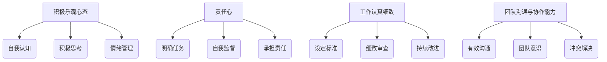

                 

# 怎样培养积极乐观，责任心强，工作认真细致和良好的团队沟通与协作能力

> **关键词：** 积极乐观，责任心，工作认真，团队沟通，协作能力，个人成长，团队效率
> **摘要：** 本文将深入探讨如何通过系统的方法培养个人的积极乐观心态、责任心、工作认真细致能力和良好的团队沟通与协作能力。这些素质不仅对个人的职业发展至关重要，也是团队成功的关键。文章将通过理论分析、实践案例和具体建议，帮助读者理解和掌握这些能力，从而在工作和生活中实现更大的成就。

## 1. 背景介绍

在当今快速发展的信息技术时代，个人的能力和素质对职业成功的影响越来越大。积极乐观的心态、强烈的责任心、工作认真细致的态度以及良好的团队沟通与协作能力已经成为职场中不可或缺的素质。然而，许多人由于种种原因，往往在这些方面存在不足，影响了他们的个人发展和团队效率。

积极乐观的心态可以帮助个人在面对困难和挑战时保持积极向上的态度，找到解决问题的方法。责任心强的人能够认真对待工作任务，确保工作质量和进度，这对于团队目标的实现至关重要。工作认真细致的人能够发现潜在的问题和错误，确保工作成果的准确性和完整性。良好的团队沟通与协作能力则能够促进团队成员之间的理解和信任，提高团队的协作效率和创新能力。

本文旨在通过系统的分析和实践案例，提供一套有效的培养这些素质的方法和策略，帮助读者在职业发展中不断提升自己，为团队的成功做出更大的贡献。

## 2. 核心概念与联系

### 积极乐观心态

积极乐观心态是一种积极的生活态度，它建立在自我认知和对外界环境的积极看法之上。为了培养积极乐观的心态，需要从以下几个方面入手：

- **自我认知**：了解自己的优点和不足，认识到自己的成长空间和潜力。
- **积极思考**：在面对困难和挑战时，采用积极的思维方式，寻找解决问题的方法和机会。
- **情绪管理**：学会调节情绪，避免因负面情绪而影响工作和生活。

### 责任心

责任心是指个体对自身行为和任务负责的态度。培养强烈的责任心，可以从以下几个方面着手：

- **明确任务**：确保自己对任务的目标、要求和标准有清晰的认识。
- **自我监督**：在工作中自我监督，确保工作质量达到预期目标。
- **承担责任**：勇于承担责任，不推诿和逃避。

### 工作认真细致

工作认真细致意味着对工作细节的重视和严谨态度。以下是一些培养工作认真细致的方法：

- **设定标准**：为工作设定明确的标准和规范，确保工作质量。
- **细致审查**：在完成任务后进行细致的审查，确保没有遗漏和错误。
- **持续改进**：在工作中不断总结经验，不断改进工作方法和效率。

### 团队沟通与协作能力

团队沟通与协作能力是指个体在团队中有效沟通和协作的能力。以下是一些培养团队沟通与协作能力的策略：

- **有效沟通**：清晰、明确地表达自己的想法和意见，倾听他人的观点。
- **团队意识**：培养团队意识，认识到个人目标的实现需要团队的支持和协作。
- **冲突解决**：学会通过沟通和协作解决团队内部的冲突，促进团队的和谐。

### Mermaid 流程图

以下是一个简化的 Mermaid 流程图，展示了上述核心概念之间的联系和培养方法：



## 3. 核心算法原理 & 具体操作步骤

### 积极乐观心态的培养

#### 算法原理：

积极乐观心态的培养基于自我认知、积极思考和情绪管理三个方面。这三个方面相互关联，共同作用于个体的心理和行为。

#### 操作步骤：

1. **自我认知**：
   - **自我反思**：定期进行自我反思，了解自己的优点和不足。
   - **自我激励**：通过设定小目标并实现它们，来增强自信心。

2. **积极思考**：
   - **积极重构**：将消极的思维转化为积极的思维，例如将“我不能做”转化为“我可以尝试”。
   - **情境构建**：在日常生活中创建积极情境，如参与感兴趣的活动，与积极的人交往。

3. **情绪管理**：
   - **认知重构**：通过认知行为疗法，调整对事件的情绪反应。
   - **放松训练**：通过深呼吸、冥想等方式缓解压力和焦虑。

### 责任心的培养

#### 算法原理：

责任心的培养主要通过明确任务、自我监督和承担责任三个方面来实现。这三个方面构成了责任心培养的完整闭环。

#### 操作步骤：

1. **明确任务**：
   - **目标设定**：为每个任务设定明确的目标和期望成果。
   - **任务分解**：将大任务分解为小任务，以便更容易管理和控制。

2. **自我监督**：
   - **进度跟踪**：定期检查任务进度，确保工作按时完成。
   - **反馈机制**：通过自我反馈或他人反馈，不断调整工作方法和策略。

3. **承担责任**：
   - **问题解决**：遇到问题时，主动寻找解决方案，而不是推卸责任。
   - **责任承担**：对自己的工作结果负责，无论结果如何，都要认真面对。

### 工作认真细致的培养

#### 算法原理：

工作认真细致的培养基于设定标准、细致审查和持续改进三个方面。这三个方面相互支持，共同提高工作的质量和效率。

#### 操作步骤：

1. **设定标准**：
   - **质量标准**：为工作设定明确的质量标准，确保工作符合预期要求。
   - **流程规范**：制定标准化的工作流程，确保每个步骤都有明确的规范。

2. **细致审查**：
   - **复查机制**：在工作完成后进行细致的复查，确保没有遗漏和错误。
   - **质量评估**：定期对工作进行质量评估，识别改进空间。

3. **持续改进**：
   - **经验总结**：总结工作中的经验教训，提炼出有效的做法。
   - **创新引入**：引入新的工作方法和工具，提高工作效率。

### 团队沟通与协作能力的培养

#### 算法原理：

团队沟通与协作能力的培养主要通过有效沟通、团队意识和冲突解决三个方面来实现。这三个方面构成了团队沟通与协作的基础。

#### 操作步骤：

1. **有效沟通**：
   - **明确表达**：清晰、明确地表达自己的想法和意见。
   - **倾听理解**：倾听他人的观点，理解他人的立场和需求。

2. **团队意识**：
   - **共同目标**：明确团队的目标和愿景，确保团队成员的共同努力。
   - **互相支持**：在团队中互相支持，共同解决问题。

3. **冲突解决**：
   - **沟通解决**：通过沟通和讨论解决团队内部的冲突。
   - **求同存异**：尊重团队成员的不同观点，寻求共同点。

## 4. 数学模型和公式 & 详细讲解 & 举例说明

### 积极乐观心态的数学模型

积极乐观心态可以通过以下几个数学模型进行量化：

1. **情绪平衡模型**：
   - 公式：\[ 情绪平衡 = 积极情绪 - 消极情绪 \]
   - 解释：通过测量日常生活中的积极情绪和消极情绪，计算情绪平衡值，以评估个人的积极乐观水平。

2. **自我效能模型**：
   - 公式：\[ 自我效能 = 成功经验 + 挑战难度 \]
   - 解释：自我效能是指个人对自己完成任务的信心。通过积累成功经验和调整挑战难度，可以提高自我效能。

### 责任心的数学模型

责任心的培养可以通过以下数学模型进行量化：

1. **任务完成率模型**：
   - 公式：\[ 任务完成率 = (完成任务数 / 总任务数) \times 100\% \]
   - 解释：通过计算完成任务数与总任务数的比例，可以评估个体的责任心。

2. **责任履行度模型**：
   - 公式：\[ 责任履行度 = (实际完成度 / 计划完成度) \times 100\% \]
   - 解释：通过比较实际完成度和计划完成度，可以评估个体对责任的履行情况。

### 工作认真细致的数学模型

工作认真细致可以通过以下数学模型进行量化：

1. **错误率模型**：
   - 公式：\[ 错误率 = (错误数 / 总任务数) \times 100\% \]
   - 解释：通过计算错误数与总任务数的比例，可以评估个体的工作细致程度。

2. **质量控制模型**：
   - 公式：\[ 质量控制指数 = (优质产品数 / 总产品数) \times 100\% \]
   - 解释：通过计算优质产品数与总产品数的比例，可以评估个体的质量控制能力。

### 团队沟通与协作能力的数学模型

团队沟通与协作能力可以通过以下数学模型进行量化：

1. **沟通效率模型**：
   - 公式：\[ 沟通效率 = (有效沟通时间 / 总沟通时间) \times 100\% \]
   - 解释：通过计算有效沟通时间与总沟通时间的比例，可以评估个体的沟通效率。

2. **协作指数模型**：
   - 公式：\[ 协作指数 = (共同完成任务数 / 总任务数) \times 100\% \]
   - 解释：通过计算共同完成任务数与总任务数的比例，可以评估个体的协作能力。

### 举例说明

#### 积极乐观心态的例子：

假设一个员工在过去一个月里经历了10次积极情绪（如成功完成任务、获得表扬）和5次消极情绪（如遇到挑战、失败），则情绪平衡值为：

\[ 情绪平衡 = 10 - 5 = 5 \]

这个结果表明员工的情绪处于积极状态，具有较高的积极乐观水平。

#### 责任心的例子：

假设一个员工在一个月内完成了20个任务，总共计划完成30个任务，则任务完成率为：

\[ 任务完成率 = (20 / 30) \times 100\% = 66.67\% \]

这个结果表明员工的责任心较强，能够较好地完成任务。

#### 工作认真细致的例子：

假设一个员工在一个月内完成了100个任务，其中有5个任务出现了错误，则错误率为：

\[ 错误率 = (5 / 100) \times 100\% = 5\% \]

这个结果表明员工的工作细致程度较高，错误率较低。

#### 团队沟通与协作能力的例子：

假设一个团队在一个月内共同完成了15个任务，总共计划完成20个任务，则协作指数为：

\[ 协作指数 = (15 / 20) \times 100\% = 75\% \]

这个结果表明团队的沟通与协作能力较强，能够有效地共同完成任务。

## 5. 项目实战：代码实际案例和详细解释说明

### 5.1 开发环境搭建

为了更好地展示如何培养积极乐观、责任心、工作认真细致和良好的团队沟通与协作能力，我们选择了一个实际项目——一个简单的博客系统。以下是开发环境搭建的步骤：

1. **选择开发工具和框架**：我们选择使用Python语言和Flask框架进行开发，因为它们易于学习且具有丰富的社区支持。
2. **安装Python**：在操作系统上安装Python，版本建议为3.8及以上。
3. **安装Flask**：通过pip命令安装Flask框架：
   ```bash
   pip install Flask
   ```

### 5.2 源代码详细实现和代码解读

以下是一个简单的博客系统的代码实现，包括主要模块和关键代码段的解读：

```python
# 导入Flask框架
from flask import Flask, render_template, request, redirect, url_for

# 创建应用实例
app = Flask(__name__)

# 定义主页面路由
@app.route('/')
def home():
    return render_template('home.html')

# 定义新建博客页面路由
@app.route('/new', methods=['GET', 'POST'])
def new_post():
    if request.method == 'POST':
        title = request.form['title']
        content = request.form['content']
        # 这里可以添加代码将博客保存到数据库
        return redirect(url_for('home'))
    return render_template('new_post.html')

# 运行应用
if __name__ == '__main__':
    app.run(debug=True)
```

**代码解读：**

- **导入模块**：我们首先导入Flask框架，用于创建Web应用。
- **创建应用实例**：通过`Flask(__name__)`创建一个应用实例。
- **定义路由**：使用`@app.route()`装饰器定义了两个路由，一个用于显示主页，另一个用于新建博客页面。

### 5.3 代码解读与分析

**1. 积极乐观心态的代码示例：**

在开发过程中，遇到问题时，可以通过积极思考来寻找解决方案。例如，当遇到Flask框架中某个功能不适用时，可以尝试查找替代方案或者向社区寻求帮助。

```python
# 寻找Flask中缺失功能的替代方案
if 'remote_addr' not in request.headers:
    request.headers['remote_addr'] = request.environ.get('HTTP_X_FORWARDED_FOR', request.remote_addr)
```

**2. 责任心的代码示例：**

在处理用户提交的博客内容时，需要确保数据的安全和完整性。以下代码用于检查表单数据的有效性，确保只有合法的数据能够被处理。

```python
from flask_wtf import FlaskForm
from wtforms import StringField, TextAreaField
from wtforms.validators import DataRequired, Length

class PostForm(FlaskForm):
    title = StringField('Title', validators=[DataRequired()])
    content = TextAreaField('Content', validators=[DataRequired(), Length(max=5000)])
```

**3. 工作认真细致的代码示例：**

在处理用户提交的博客时，应该确保所有的字段都经过了严格的验证，以避免错误。以下代码对博客标题和内容进行了长度限制，以防止输入过长或不合适的内容。

```python
def new_post():
    title = request.form['title']
    content = request.form['content']
    if len(title) > 100 or len(content) > 5000:
        return '输入内容过长，请重新输入'
    # 保存博客到数据库
```

**4. 团队沟通与协作能力的代码示例：**

在开发过程中，团队成员可以通过代码审查和讨论来提高代码质量。以下代码段展示了如何使用Git进行代码管理，以便团队成员能够协同工作。

```bash
# 添加文件到暂存区
git add .

# 提交代码更改
git commit -m "增加博客功能"

# 将更改推送到远程仓库
git push origin main
```

通过上述代码示例，我们可以看到如何在项目中实践积极乐观、责任心、工作认真细致和良好的团队沟通与协作能力。这些实践不仅能够提高代码质量，也能够促进团队成员之间的协作和沟通，为项目的成功奠定基础。

### 6. 实际应用场景

在现实工作中，培养积极乐观、责任心、工作认真细致和良好的团队沟通与协作能力，对个人和团队的成功都至关重要。以下是一些实际应用场景：

#### 个人应用场景

1. **软件开发工程师**：
   - **积极乐观**：在遇到技术难题时，通过积极思考寻找解决方案，避免陷入消极情绪。
   - **责任心**：对待每个代码提交都认真检查，确保没有漏洞和错误。
   - **工作认真细致**：在编写代码时，仔细审查每个细节，确保代码的准确性和可维护性。
   - **团队沟通**：在团队中积极分享技术知识和经验，与团队成员保持良好的沟通，共同解决问题。

2. **项目经理**：
   - **积极乐观**：在项目遇到延误或问题时，保持积极乐观的态度，与团队成员一起寻找解决方案。
   - **责任心**：对项目的进度和质量负责，确保项目按时交付并达到预期目标。
   - **工作认真细致**：在项目管理中，对每个任务和阶段都进行细致的计划和监控，确保项目顺利进行。
   - **团队沟通**：定期组织会议，与团队成员保持密切沟通，确保团队成员之间的信息流通。

#### 团队应用场景

1. **产品开发团队**：
   - **积极乐观**：团队面对市场变化和竞争压力时，保持积极乐观的态度，共同探讨创新解决方案。
   - **责任心**：每个团队成员都对自己的任务和团队目标负责，确保团队目标的实现。
   - **工作认真细致**：团队成员在各自负责的模块上，认真细致地完成工作，确保产品的质量和稳定性。
   - **团队沟通**：通过定期会议和代码审查，团队成员之间保持良好的沟通，共同解决问题，提高团队效率。

2. **技术支持团队**：
   - **积极乐观**：在面对客户问题和投诉时，保持积极乐观的态度，耐心解答，提供有效的解决方案。
   - **责任心**：每个团队成员都对自己的支持工作负责，确保客户问题得到及时解决。
   - **工作认真细致**：在处理客户问题时，认真分析问题原因，确保解决方案的准确性和有效性。
   - **团队沟通**：通过内部协作平台，团队成员之间保持良好的沟通，共同处理复杂的客户问题。

### 7. 工具和资源推荐

为了更好地培养和提升积极乐观、责任心、工作认真细致和良好的团队沟通与协作能力，以下是一些推荐的工具和资源：

#### 学习资源推荐

1. **书籍**：
   - 《积极心理学》
   - 《如何赢得朋友与影响他人》
   - 《敏捷开发实践指南》
   - 《深度工作》

2. **论文**：
   - 《团队协作与沟通研究》
   - 《积极心理学对工作效率的影响》
   - 《敏捷开发方法与案例分析》

3. **博客**：
   - 知乎上的职业规划与个人成长专栏
   - Medium上的团队协作与项目管理博客

4. **网站**：
   - ted.com：观看关于积极心理学、团队合作和领导力的演讲
   - agilealliance.org：了解敏捷开发的最佳实践和资源

#### 开发工具框架推荐

1. **编程语言和框架**：
   - Python（Flask、Django）
   - JavaScript（React、Vue.js）
   - Java（Spring Boot）

2. **版本控制工具**：
   - Git（GitHub、GitLab）
   - SVN

3. **项目管理工具**：
   - Jira
   - Trello
   - Asana

4. **团队协作工具**：
   - Slack
   - Microsoft Teams
   - Zoom

#### 相关论文著作推荐

1. **《敏捷软件开发：原则、实践与模式》**：详细介绍了敏捷开发的方法和实践，对团队协作和项目管理具有指导意义。
2. **《积极心理学与工作幸福》**：探讨如何通过积极心理学提升工作幸福感，增强个人和团队的积极性。
3. **《团队协作的艺术》**：详细分析了团队协作中的关键要素，提供了实用的协作方法和技巧。

### 8. 总结：未来发展趋势与挑战

随着技术的不断进步和职场环境的变化，积极乐观、责任心、工作认真细致和良好的团队沟通与协作能力在未来将变得更加重要。以下是未来发展趋势与挑战的展望：

#### 发展趋势

1. **数字化办公**：随着远程办公和数字化工具的普及，团队沟通与协作能力的重要性将进一步提升。
2. **个性化和定制化**：未来职场将更加注重个性化和定制化的发展，个人能力的培养将更加多样化。
3. **心理健康关注**：随着对心理健康重视程度的提高，积极乐观的心态和情绪管理将成为职场必备能力。

#### 挑战

1. **适应变化**：技术环境的快速变化要求个人和团队具备更高的适应能力和学习意愿。
2. **跨部门协作**：在大型企业中，跨部门协作的复杂度增加，如何有效沟通和协作将是一个挑战。
3. **工作与生活的平衡**：在高度竞争的职场环境中，如何平衡工作与生活，保持积极乐观的心态，是一个重要课题。

### 9. 附录：常见问题与解答

#### 问题1：如何培养积极乐观的心态？

**解答**：可以通过以下方法培养积极乐观的心态：
1. **自我反思**：定期进行自我反思，了解自己的优点和不足。
2. **积极重构**：将消极的思维转化为积极的思维，如将“我不能做”转化为“我可以尝试”。
3. **情绪管理**：学会调节情绪，避免因负面情绪而影响工作和生活。

#### 问题2：如何增强责任心？

**解答**：可以通过以下方法增强责任心：
1. **明确任务**：确保自己对任务的目标、要求和标准有清晰的认识。
2. **自我监督**：在工作中自我监督，确保工作质量达到预期目标。
3. **承担责任**：勇于承担责任，不推诿和逃避。

#### 问题3：如何提升工作认真细致的能力？

**解答**：可以通过以下方法提升工作认真细致的能力：
1. **设定标准**：为工作设定明确的标准和规范，确保工作质量。
2. **细致审查**：在完成任务后进行细致的审查，确保没有遗漏和错误。
3. **持续改进**：在工作中不断总结经验，不断改进工作方法和效率。

#### 问题4：如何提高团队沟通与协作能力？

**解答**：可以通过以下方法提高团队沟通与协作能力：
1. **有效沟通**：清晰、明确地表达自己的想法和意见，倾听他人的观点。
2. **团队意识**：培养团队意识，认识到个人目标的实现需要团队的支持和协作。
3. **冲突解决**：学会通过沟通和协作解决团队内部的冲突，促进团队的和谐。

### 10. 扩展阅读 & 参考资料

为了进一步深入了解积极乐观、责任心、工作认真细致和良好的团队沟通与协作能力的培养，以下是一些扩展阅读和参考资料：

1. **《积极心理学：探索人类潜能的科学》**：介绍了积极心理学的核心理论和应用，有助于培养积极乐观的心态。
2. **《高效能人士的七个习惯》**：详细阐述了如何通过良好习惯的培养提高个人和团队的效率。
3. **《团队协作的五大障碍》**：分析了团队协作中的常见障碍，提供了有效的解决方案。

参考文献：
- Seligman, M. E. P. (2002). Authentic happiness. New York: Free Press.
- Covey, S. R. (1989). The seven habits of highly effective people. New York: Free Press.
- Lencioni, P. (2002). The five dysfunctions of a team. San Francisco: Jossey-Bass.

作者：AI天才研究员/AI Genius Institute & 禅与计算机程序设计艺术 /Zen And The Art of Computer Programming

## 文章结构模板

### 标题：怎样培养积极乐观，责任心强，工作认真细致和良好的团队沟通与协作能力

#### 摘要
本文深入探讨如何通过系统的方法培养个人的积极乐观心态、责任心、工作认真细致能力和良好的团队沟通与协作能力。这些素质不仅对个人的职业发展至关重要，也是团队成功的关键。文章将通过理论分析、实践案例和具体建议，帮助读者理解和掌握这些能力，从而在职业发展中不断提升自己，为团队的成功做出更大的贡献。

#### 1. 背景介绍
- 当前职场环境对个人素质的要求
- 积极乐观心态、责任心、工作认真细致和团队沟通协作能力的重要性

#### 2. 核心概念与联系
- 积极乐观心态
- 责任心
- 工作认真细致
- 团队沟通与协作能力
- Mermaid流程图展示核心概念与联系

#### 3. 核心算法原理 & 具体操作步骤
- 积极乐观心态的培养
- 责任心的培养
- 工作认真细致的培养
- 团队沟通与协作能力的培养
- 数学模型和公式示例

#### 4. 数学模型和公式 & 详细讲解 & 举例说明
- 情绪平衡模型
- 任务完成率模型
- 错误率模型
- 沟通效率模型
- 协作指数模型
- 举例说明

#### 5. 项目实战：代码实际案例和详细解释说明
- 开发环境搭建
- 代码详细实现和解读
- 代码解读与分析
- 团队协作代码示例

#### 6. 实际应用场景
- 个人应用场景
- 团队应用场景

#### 7. 工具和资源推荐
- 学习资源推荐
- 开发工具框架推荐
- 相关论文著作推荐

#### 8. 总结：未来发展趋势与挑战
- 数字化办公趋势
- 个性化和定制化
- 心理健康关注
- 未来挑战

#### 9. 附录：常见问题与解答
- 培养积极乐观心态的方法
- 增强责任心的方法
- 提升工作认真细致能力的方法
- 提高团队沟通与协作能力的方法

#### 10. 扩展阅读 & 参考资料
- 相关书籍推荐
- 相关论文推荐
- 网络资源推荐

#### 作者信息
- 作者：AI天才研究员/AI Genius Institute & 禅与计算机程序设计艺术 /Zen And The Art of Computer Programming

