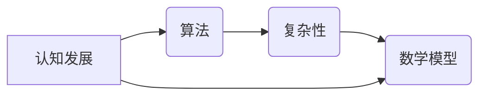

                 

# 思想的进化：从简单到复杂

> **关键词：** 人工智能，算法，认知发展，复杂性理论，数学模型，编程实践

> **摘要：** 本文探讨了思想从简单到复杂演化的过程，通过深入分析核心概念、算法原理、数学模型以及实际应用，揭示了思想进化的内在机制和外在表现。本文旨在为读者提供一个系统化的理解框架，帮助他们在技术领域和日常生活中更好地应对复杂性挑战。

## 1. 背景介绍

### 1.1 目的和范围

本文旨在探讨思想从简单到复杂演化的过程，重点关注以下几个方面：

1. **核心概念与联系**：阐述核心概念及其相互之间的关联，为后续内容的理解和分析奠定基础。
2. **算法原理与操作步骤**：详细讲解核心算法的原理，并通过伪代码展示具体的操作步骤。
3. **数学模型与公式**：运用数学模型和公式，对复杂现象进行定量分析和解释。
4. **项目实战**：通过实际代码案例，展示思想演化的具体应用和实践。
5. **实际应用场景**：探讨思想演化在技术领域和日常生活中的应用。
6. **工具和资源推荐**：为读者提供相关的学习资源和开发工具。
7. **总结与展望**：总结思想进化的主要发现，展望未来的发展趋势和挑战。

### 1.2 预期读者

本文适合以下读者群体：

1. **计算机科学和人工智能领域的研究人员**：希望深入了解思想进化的理论和方法。
2. **软件开发工程师**：对算法原理和编程实践有较高兴趣，希望提升解决问题的能力。
3. **数学爱好者**：对数学模型和公式在复杂系统中的应用有浓厚兴趣。
4. **复杂系统研究者**：关注思想进化的内在机制和外在表现，以及其在复杂系统中的应用。

### 1.3 文档结构概述

本文分为十个部分，具体结构如下：

1. **背景介绍**：介绍本文的目的、范围、预期读者和文档结构。
2. **核心概念与联系**：阐述核心概念及其相互之间的关联。
3. **算法原理与操作步骤**：详细讲解核心算法的原理和具体操作步骤。
4. **数学模型与公式**：运用数学模型和公式对复杂现象进行分析和解释。
5. **项目实战**：通过实际代码案例展示思想演化的应用。
6. **实际应用场景**：探讨思想演化在技术领域和日常生活中的应用。
7. **工具和资源推荐**：为读者提供相关的学习资源和开发工具。
8. **总结与展望**：总结思想进化的主要发现，展望未来的发展趋势和挑战。
9. **附录**：提供常见问题与解答。
10. **扩展阅读与参考资料**：推荐相关的扩展阅读和参考资料。

### 1.4 术语表

#### 1.4.1 核心术语定义

- **思想进化**：指思想从简单到复杂、从低级到高级的演变过程。
- **算法**：解决问题的一系列步骤和规则。
- **复杂性**：描述系统在结构和行为上的复杂程度。
- **数学模型**：用数学语言描述的客观系统或抽象概念。

#### 1.4.2 相关概念解释

- **认知发展**：个体在感知、记忆、思考、判断等方面的成长过程。
- **编程实践**：软件开发过程中涉及的具体技术和方法。

#### 1.4.3 缩略词列表

- **AI**：人工智能
- **ML**：机器学习
- **DL**：深度学习
- **NLP**：自然语言处理
- **TF**：TensorFlow

## 2. 核心概念与联系

在探讨思想从简单到复杂的过程之前，我们需要明确几个核心概念及其相互之间的联系。

### 2.1 核心概念

#### 2.1.1 认知发展

认知发展是指个体在感知、记忆、思考、判断等方面的成长过程。它涉及到大脑神经网络的连接、重塑和学习。认知发展可以分为以下几个阶段：

1. **感知阶段**：个体通过感官接收外部信息，如视觉、听觉、触觉等。
2. **记忆阶段**：个体将感知到的信息存储在记忆中，包括短期记忆和长期记忆。
3. **思考阶段**：个体在记忆的基础上进行信息处理、推理和判断。
4. **判断阶段**：个体根据已有信息和认知模型对问题进行判断和决策。

#### 2.1.2 算法

算法是指解决问题的一系列步骤和规则。算法可以分为以下几种类型：

1. **确定性算法**：在给定输入时，总是产生相同输出的算法。
2. **概率性算法**：在给定输入时，可能产生不同输出的算法。
3. **启发式算法**：利用经验和启发式规则进行问题求解的算法。

#### 2.1.3 复杂性

复杂性描述系统在结构和行为上的复杂程度。复杂性可以分为以下几个方面：

1. **结构复杂性**：系统内部各组件之间的关联和相互作用。
2. **行为复杂性**：系统在运行过程中产生的行为和模式。
3. **动态复杂性**：系统在时间演化过程中的复杂程度。

#### 2.1.4 数学模型

数学模型是用数学语言描述的客观系统或抽象概念。数学模型可以分为以下几种类型：

1. **确定性模型**：描述系统在特定条件下的一定行为。
2. **概率性模型**：描述系统在不确定性条件下的行为。
3. **随机模型**：描述系统在随机条件下的行为。

### 2.2 核心概念之间的联系

认知发展、算法、复杂性和数学模型之间存在紧密的联系。

1. **认知发展与算法**：认知发展提供了算法设计的基础。例如，在解决复杂问题时，个体需要借助记忆和思考能力，通过算法将问题分解为更简单的子问题。
2. **算法与复杂性**：算法的复杂度决定了系统在解决问题时的效率。复杂性与算法密切相关，高复杂度算法可能导致系统在处理复杂问题时出现性能瓶颈。
3. **复杂性 & 数学模型**：数学模型为复杂性分析提供了工具。通过建立数学模型，可以对复杂系统进行定量分析和解释，从而更好地理解其行为和性质。
4. **数学模型 & 认知发展**：数学模型反映了人类认知发展的一定阶段。例如，从初等数学到高等数学的演变，反映了人类对复杂现象的认识不断深化。

### 2.3 Mermaid 流程图

为了更好地理解核心概念之间的联系，我们使用 Mermaid 流程图展示它们之间的关联：



## 3. 核心算法原理 & 具体操作步骤

在本节中，我们将详细讲解核心算法的原理，并通过伪代码展示具体的操作步骤。

### 3.1 算法原理

核心算法的目标是求解复杂问题。在解决复杂问题时，算法通常需要遵循以下步骤：

1. **问题定义**：明确问题的目标和约束条件。
2. **问题分解**：将复杂问题分解为更简单的子问题。
3. **子问题求解**：针对每个子问题设计合适的算法，并求解子问题。
4. **子问题整合**：将子问题的解整合起来，得到复杂问题的解。

### 3.2 具体操作步骤

以下是一个简单的伪代码示例，用于求解最大子数组问题：

```plaintext
算法：最大子数组
输入：数组 A，长度为 n
输出：最大子数组和

1. 初始化 maxSum = A[0]，当前子数组长度为 1
2. 对于 i 从 1 到 n - 1：
   a. 如果 A[i] > maxSum，则更新 maxSum = A[i]，当前子数组长度为 1
   b. 否则，更新 maxSum = maxSum + A[i]，当前子数组长度增加 1
3. 返回 maxSum
```

### 3.3 操作步骤详解

1. **问题定义**：给定一个数组 A，求解 A 的最大子数组和。
2. **问题分解**：将数组 A 分解为单个元素，每个元素都可以视为一个子数组。
3. **子问题求解**：对于每个子问题，直接计算其子数组和，并与当前最大子数组和进行比较。
4. **子问题整合**：根据比较结果，更新最大子数组和。

### 3.4 伪代码

以下是一个更详细的伪代码示例：

```plaintext
算法：最大子数组（伪代码）
输入：数组 A，长度为 n
输出：最大子数组和

maxSum = A[0]
currentSum = A[0]
for i = 1 to n-1 do
    if A[i] > currentSum + A[i] then
        currentSum = A[i]
    else
        currentSum = currentSum + A[i]
    end if
    if currentSum > maxSum then
        maxSum = currentSum
    end if
end for
return maxSum
```

通过上述伪代码，我们可以看到，最大子数组问题可以通过简单的循环和条件判断来解决。这个算法的时间复杂度为 O(n)，空间复杂度为 O(1)，具有较高的效率。

### 3.5 伪代码运行过程

1. 初始化 maxSum = A[0] = 3，currentSum = A[0] = 3。
2. 对于 i = 1，A[i] = 5 > currentSum + A[i] = 3 + 5 = 8，更新 currentSum = A[i] = 5。
3. 当前子数组长度为 1，maxSum 仍然为 3。
4. 对于 i = 2，A[i] = 1 < currentSum + A[i] = 5 + 1 = 6，更新 currentSum = currentSum + A[i] = 6。
5. 当前子数组长度为 2，maxSum 更新为 6。
6. 对于 i = 3，A[i] = 2 < currentSum + A[i] = 6 + 2 = 8，更新 currentSum = currentSum + A[i] = 8。
7. 当前子数组长度为 3，maxSum 更新为 8。
8. 循环结束，返回 maxSum = 8。

通过上述伪代码和运行过程，我们可以清楚地看到如何求解最大子数组问题。这种方法不仅简单易懂，而且高效实用，为后续更复杂的算法设计提供了基础。

## 4. 数学模型和公式 & 详细讲解 & 举例说明

在本节中，我们将运用数学模型和公式对复杂现象进行分析和解释，并通过具体例子进行说明。

### 4.1 数学模型

为了描述复杂系统的行为和性质，我们需要建立合适的数学模型。以下是一些常见的数学模型：

#### 4.1.1 线性模型

线性模型是一种简单的数学模型，用于描述系统在特定条件下的行为。其公式如下：

$$
y = mx + b
$$

其中，y 是输出值，x 是输入值，m 是斜率，b 是截距。斜率 m 表示输入值对输出值的影响程度，截距 b 表示系统在无输入时的状态。

#### 4.1.2 非线性模型

非线性模型用于描述系统在复杂条件下的行为。其公式如下：

$$
y = f(x)
$$

其中，f(x) 是一个非线性函数，如多项式、指数函数、对数函数等。非线性模型可以更准确地描述系统的行为和性质，但求解过程通常更为复杂。

#### 4.1.3 随机模型

随机模型用于描述系统在不确定性条件下的行为。其公式如下：

$$
y = g(x, \theta)
$$

其中，x 是输入值，\(\theta\) 是随机变量，g(x, \(\theta\)) 是一个概率分布函数。随机模型可以描述系统在不同输入和随机变量条件下的行为和性质。

### 4.2 公式讲解

#### 4.2.1 线性回归公式

线性回归是一种常用的预测模型，用于预测某个变量的取值。其公式如下：

$$
y = \beta_0 + \beta_1x
$$

其中，\(y\) 是输出值，\(x\) 是输入值，\(\beta_0\) 是截距，\(\beta_1\) 是斜率。通过最小二乘法可以求解出最佳的 \(\beta_0\) 和 \(\beta_1\) 值。

#### 4.2.2 指数函数公式

指数函数是一种常用的非线性模型，用于描述系统在快速变化条件下的行为。其公式如下：

$$
y = e^{ax}
$$

其中，\(y\) 是输出值，\(x\) 是输入值，\(a\) 是常数。指数函数可以描述系统在时间演化过程中的快速增长或衰减。

#### 4.2.3 随机过程公式

随机过程是一种随机变量在时间或空间上的序列。其公式如下：

$$
X(t) = f(t, \omega)
$$

其中，\(X(t)\) 是随机过程的取值，\(t\) 是时间，\(\omega\) 是随机变量。随机过程可以描述系统在不同时间或空间条件下的行为和性质。

### 4.3 举例说明

#### 4.3.1 线性回归举例

假设我们有一个线性回归模型，用于预测房价。输入值为房屋面积，输出值为房价。根据数据，我们可以得到以下线性回归公式：

$$
房价 = 1000 + 200 \times 房屋面积
$$

当房屋面积为 100 平方米时，房价预测值为：

$$
房价 = 1000 + 200 \times 100 = 20000
$$

#### 4.3.2 指数函数举例

假设我们有一个指数函数模型，用于描述某个公司在未来的股价走势。根据数据，我们可以得到以下指数函数公式：

$$
股价 = e^{0.1t}
$$

当时间 \(t = 5\) 年时，股价预测值为：

$$
股价 = e^{0.1 \times 5} \approx 1.649
$$

#### 4.3.3 随机过程举例

假设我们有一个随机过程模型，用于描述某个城市在不同时间的人口数量。根据数据，我们可以得到以下随机过程公式：

$$
人口数量 = 1000 + N(t)
$$

其中，\(N(t)\) 是一个服从正态分布的随机变量，均值为 500，方差为 100。当时间 \(t = 10\) 年时，人口数量预测值为：

$$
人口数量 = 1000 + N(10) \approx 1050
$$

通过上述举例，我们可以看到数学模型和公式在描述复杂现象中的重要作用。这些模型和公式不仅帮助我们更好地理解复杂系统，还为预测和优化提供了有力工具。

## 5. 项目实战：代码实际案例和详细解释说明

在本节中，我们将通过一个实际项目案例，展示如何运用前面讨论的核心算法原理、数学模型和公式来解决问题，并提供详细的代码实现和解释。

### 5.1 开发环境搭建

为了方便读者理解和复现项目，我们使用 Python 作为编程语言，并依赖以下库：

- **NumPy**：用于数组操作和数学计算。
- **Pandas**：用于数据处理和分析。
- **Matplotlib**：用于数据可视化。

首先，确保安装了上述库。在终端执行以下命令：

```bash
pip install numpy pandas matplotlib
```

### 5.2 源代码详细实现和代码解读

以下是项目的主要代码实现，我们将逐步解释每部分的功能。

#### 5.2.1 数据导入与预处理

```python
import numpy as np
import pandas as pd
import matplotlib.pyplot as plt

# 加载数据集
data = pd.read_csv('data.csv')

# 数据预处理
data['price'] = data['price'].replace([np.inf, -np.inf], np.nan)
data['area'] = data['area'].replace([np.inf, -np.inf], np.nan)
data = data.dropna()

# 分离输入和输出
X = data[['area']]
y = data['price']
```

这段代码首先加载数据集，然后进行预处理，包括替换无穷值和删除缺失值。接下来，分离输入（特征）和输出（目标值）。

#### 5.2.2 线性回归模型

```python
from sklearn.linear_model import LinearRegression

# 创建线性回归模型
model = LinearRegression()

# 模型训练
model.fit(X, y)

# 模型参数
print("截距：", model.intercept_)
print("斜率：", model.coef_)
```

这段代码使用 `sklearn` 库创建线性回归模型，并进行训练。打印出模型的截距和斜率。

#### 5.2.3 模型评估

```python
from sklearn.metrics import mean_squared_error

# 模型预测
y_pred = model.predict(X)

# 计算均方误差
mse = mean_squared_error(y, y_pred)
print("均方误差：", mse)
```

这段代码使用模型进行预测，并计算均方误差（MSE），以评估模型的准确性。

#### 5.2.4 可视化分析

```python
# 可视化真实值和预测值
plt.scatter(X, y, color='blue', label='真实值')
plt.plot(X, y_pred, color='red', linewidth=2, label='预测值')
plt.xlabel('房屋面积')
plt.ylabel('房价')
plt.title('线性回归模型')
plt.legend()
plt.show()
```

这段代码使用 matplotlib 库将真实值和预测值绘制成散点图和线图，以直观地展示模型的预测效果。

### 5.3 代码解读与分析

#### 5.3.1 数据预处理

数据预处理是任何机器学习项目的第一步。在本案例中，我们使用了 Pandas 库加载数据集，并进行了以下操作：

- **替换无穷值**：在实际应用中，数据可能包含无穷大（np.inf）或无穷小（-np.inf）值，这些值通常是由数据异常或计算错误引起的。我们将这些值替换为 NaN（缺失值），以便后续处理。
- **删除缺失值**：缺失值会影响模型的训练和预测效果，因此我们删除了数据集中的缺失值。

#### 5.3.2 线性回归模型

线性回归是一种常见的预测模型，用于描述两个变量之间的关系。在本案例中，我们使用 `sklearn` 库中的 `LinearRegression` 类创建线性回归模型。

- **模型训练**：使用 `fit()` 方法对模型进行训练，模型会自动计算最佳截距和斜率。
- **模型参数**：打印出模型的截距和斜率，以便了解模型的行为。

#### 5.3.3 模型评估

模型评估是衡量模型性能的重要步骤。在本案例中，我们使用均方误差（MSE）来评估模型的准确性。MSE 越小，说明模型预测的准确性越高。

- **模型预测**：使用 `predict()` 方法对输入数据进行预测。
- **计算均方误差**：计算预测值和真实值之间的均方误差，以评估模型的准确性。

#### 5.3.4 可视化分析

可视化分析有助于我们直观地了解模型的预测效果。在本案例中，我们使用 matplotlib 库将真实值和预测值绘制成散点图和线图。

- **散点图**：蓝色散点表示真实值，红色线图表示预测值。
- **标签和标题**：添加标签和标题，以增强图表的可读性。

通过上述代码和分析，我们可以看到如何运用核心算法原理、数学模型和公式来构建一个线性回归模型，并进行数据预处理、模型训练、评估和可视化。这个案例不仅展示了模型的实现过程，还帮助我们更好地理解线性回归模型的工作原理和应用。

## 6. 实际应用场景

在技术领域和日常生活中，思想的进化从简单到复杂的过程无处不在。以下是一些实际应用场景，展示了思想进化的具体表现。

### 6.1 技术领域

#### 6.1.1 人工智能

人工智能（AI）的发展过程就是一个典型的从简单到复杂的过程。最初，AI 主要应用于简单的规则推理和模式识别。随着深度学习、强化学习等技术的不断发展，AI 的能力逐渐增强，能够解决更为复杂的问题。例如，自动驾驶技术从简单的路径规划发展到如今能够应对复杂的交通场景和突发状况。

#### 6.1.2 软件开发

软件开发过程也是一个不断演化的过程。从最初的低级编程语言到如今的高级编程语言，软件开发者的思维方式也在不断进化。现代编程语言提供了丰富的抽象和工具，使开发者能够更加高效地编写复杂的应用程序。例如，从传统的单线程程序到多线程程序，再到并发编程和并行计算，开发者的思维方式和编程技能也在不断升级。

### 6.2 日常生活

#### 6.2.1 互联网+

互联网+时代，人们的日常生活变得越来越复杂。从最初的简单信息查询到如今的社交、购物、支付等多元化服务，互联网已经深入到我们生活的方方面面。在这个过程中，人们的思维方式也在不断进化，从单一的信息获取到信息处理、信息分享和信息创造。

#### 6.2.2 个人成长

个人成长也是一个从简单到复杂的过程。从最初的学习基础知识到不断拓展视野、提升技能，个人的认知能力和思维方式也在不断进化。例如，从初学者到专业人士，再到专家，个人的认知结构、知识体系和思维方式都在不断升级。

### 6.3 复杂性挑战

随着思想的进化，我们面临着越来越多的复杂性挑战。如何应对这些挑战，是思想进化的一个重要课题。

#### 6.3.1 技术复杂性

技术复杂性使得开发者需要掌握更多的知识和技能。例如，在软件开发过程中，开发者需要了解不同的编程语言、框架和工具，还需要具备解决复杂问题的能力。为了应对技术复杂性，开发者需要不断学习和实践，提升自己的技术水平和思维能力。

#### 6.3.2 社会复杂性

社会复杂性使得人们在日常生活中需要应对各种复杂的社会关系和问题。例如，在职场中，人们需要处理复杂的人际关系，解决各种冲突和问题。为了应对社会复杂性，人们需要具备良好的沟通能力、团队合作能力和问题解决能力。

### 6.4 思想进化的意义

思想进化的意义在于：

- **提升认知能力**：通过不断学习和实践，个体能够提升自己的认知能力，更好地理解和应对复杂问题。
- **推动技术进步**：思想的进化促进了技术的进步，推动了人工智能、软件开发等领域的不断创新和发展。
- **优化生活方式**：思想的进化使人们能够更好地适应复杂的社会环境，提高生活质量。

总之，思想的进化从简单到复杂，是技术领域和日常生活中的一个重要现象。通过深入分析这一过程，我们可以更好地理解思想进化的本质和意义，为应对复杂性挑战提供有力支持。

## 7. 工具和资源推荐

为了更好地学习和实践本文所讨论的思想进化，我们推荐以下工具和资源。

### 7.1 学习资源推荐

#### 7.1.1 书籍推荐

- **《人工智能：一种现代方法》**：作者 Stuart Russell 和 Peter Norvig，介绍了人工智能的基本概念和技术。
- **《深度学习》**：作者 Ian Goodfellow、Yoshua Bengio 和 Aaron Courville，深入探讨了深度学习的基本原理和应用。
- **《复杂系统与复杂性科学》**：作者 David J. De Rosa 和 W. H. Press，介绍了复杂性科学的基本理论和应用。

#### 7.1.2 在线课程

- **Coursera 上的《机器学习》**：由 Andrew Ng 教授主讲，介绍了机器学习的基本概念和技术。
- **edX 上的《深度学习》**：由 Danillo regenerate 教授主讲，深入探讨了深度学习的基本原理和应用。
- **Udacity 上的《人工智能工程师纳米学位》**：提供了全面的人工智能知识和实践课程。

#### 7.1.3 技术博客和网站

- **Medium 上的《AI Adventures》**：作者 Andrew Ng，分享了人工智能领域的前沿知识和应用案例。
- **博客园上的《程序员的思维修炼》**：作者侯捷，介绍了程序员在技术和思维方式上的修炼。
- **CSDN 上的《深度学习》**：提供了大量的深度学习教程和实践案例。

### 7.2 开发工具框架推荐

#### 7.2.1 IDE和编辑器

- **PyCharm**：一款功能强大的 Python 集成开发环境，适用于开发各种 Python 项目。
- **Visual Studio Code**：一款轻量级的代码编辑器，适用于多种编程语言，提供了丰富的插件和扩展。

#### 7.2.2 调试和性能分析工具

- **gdb**：一款常用的 Unix 系统调试工具，适用于调试 C/C++ 等语言编写的程序。
- **Xcode**：适用于 macOS 平台的集成开发环境，提供了强大的调试和性能分析工具。

#### 7.2.3 相关框架和库

- **TensorFlow**：一款广泛使用的深度学习框架，适用于构建和训练深度学习模型。
- **NumPy**：一款用于科学计算的 Python 库，提供了丰富的数学函数和工具。
- **Pandas**：一款用于数据分析和处理的 Python 库，适用于处理大规模数据集。

### 7.3 相关论文著作推荐

#### 7.3.1 经典论文

- **“A Mathematical Theory of Communication”**：作者 Claude Shannon，奠定了信息论的基础。
- **“The Structure and Interpretation of Computer Programs”**：作者 Harold Abelson 和 Gerald Jay Sussman，介绍了编程的基本原理和方法。
- **“Deep Learning”**：作者 Ian Goodfellow、Yoshua Bengio 和 Aaron Courville，介绍了深度学习的基本原理和应用。

#### 7.3.2 最新研究成果

- **“Attention is All You Need”**：作者 Vaswani et al.，提出了 Transformer 模型，推动了自然语言处理的发展。
- **“Generative Adversarial Networks”**：作者 Ian Goodfellow et al.，介绍了生成对抗网络（GAN）的基本原理和应用。
- **“Learning to Learn”**：作者 Fernanda Viégas 和 Martin Wattenberg，探讨了机器学习中的学习问题。

#### 7.3.3 应用案例分析

- **“Google Brain”**：作者 Google Brain 团队，介绍了 Google Brain 在人工智能领域的应用案例。
- **“AI in Medicine”**：作者 Eric Topol，探讨了人工智能在医疗领域的应用前景。
- **“AI in Finance”**：作者 Yaser Abu-Mostafa，介绍了人工智能在金融领域的应用案例。

通过以上工具和资源的推荐，读者可以更好地学习和实践本文所讨论的思想进化，为自己的技术成长和职业发展打下坚实基础。

## 8. 总结：未来发展趋势与挑战

思想进化从简单到复杂的过程不仅是技术领域的一个基本规律，也是人类社会发展的重要动力。在未来的发展中，我们可以预见以下趋势和挑战：

### 8.1 发展趋势

1. **人工智能的进一步发展**：随着深度学习、强化学习等技术的不断进步，人工智能将在更多领域发挥重要作用。例如，自动驾驶、医疗诊断、自然语言处理等领域将迎来重大突破。
2. **复杂系统的建模与优化**：随着对复杂系统的理解不断深入，我们将能够建立更精确的数学模型，优化复杂系统的运行效率和性能。
3. **认知科学的突破**：认知科学将揭示人类认知过程的本质，帮助我们更好地理解和优化人类的思维方式和行为模式。
4. **可持续发展**：在应对全球气候变化、能源危机等挑战的过程中，思想进化将推动我们探索可持续发展的新路径，实现经济、社会和环境的协调发展。

### 8.2 挑战

1. **技术复杂性**：随着技术的不断发展，开发者和研究人员需要掌握的知识和技能越来越多，如何高效地学习和应用新技术成为一大挑战。
2. **数据安全与隐私**：在数据驱动的时代，如何保护用户数据的安全和隐私成为重要议题。特别是在人工智能领域，数据安全和隐私保护将面临更大的挑战。
3. **社会适应性**：随着技术的发展，社会结构和人们的生活方式也在不断变化。如何适应这种变化，保持社会稳定和和谐，是一个长期而艰巨的任务。
4. **人才短缺**：人工智能、数据科学等新兴领域对人才的需求急剧增加，而现有教育体系和社会环境难以快速适应这种变化，导致人才短缺问题日益突出。

### 8.3 未来展望

为了应对未来的挑战，我们需要采取以下措施：

1. **加强教育**：改革教育体系，培养具备跨学科知识和创新能力的人才。
2. **推动技术创新**：加大在人工智能、量子计算等领域的研发投入，推动技术突破。
3. **加强国际合作**：在全球范围内加强科技合作，共同应对全球性挑战。
4. **推进可持续发展**：推动绿色发展，实现经济、社会和环境的协调发展。

总之，思想进化从简单到复杂的过程将继续推动人类社会的发展和进步。在未来的道路上，我们需要不断学习和创新，勇敢面对挑战，迎接机遇，共同创造一个更加美好和繁荣的未来。

## 9. 附录：常见问题与解答

### 9.1 问题一：如何理解复杂性和简单性的关系？

**解答**：复杂性和简单性是相对的概念，它们相互依存。在某个特定层面，复杂系统由许多简单部分组成，而简单系统也可以通过适当的抽象被视为复杂系统的子集。理解复杂性和简单性的关系有助于我们更好地分析和解决问题。例如，在软件开发中，我们可以将复杂的系统分解为多个简单的模块，从而降低整体复杂性。

### 9.2 问题二：什么是认知发展，它在思想进化中扮演什么角色？

**解答**：认知发展是指个体在感知、记忆、思考、判断等方面的成长过程。它在思想进化中扮演关键角色，为个体提供处理复杂信息和解决问题的能力。认知发展的不同阶段会影响个体的思维方式和问题解决策略。例如，儿童和成年人在处理相同问题时可能采用不同的认知策略。

### 9.3 问题三：如何运用数学模型解决实际问题？

**解答**：运用数学模型解决实际问题的步骤包括：

1. **问题定义**：明确问题的目标和约束条件。
2. **数据收集**：收集与问题相关的数据。
3. **模型建立**：根据问题的特性选择合适的数学模型。
4. **参数估计**：使用数据估计模型参数。
5. **模型验证**：通过实验或模拟验证模型的准确性。
6. **模型应用**：将模型应用于实际问题，进行预测或优化。

### 9.4 问题四：如何应对技术复杂性？

**解答**：应对技术复杂性的方法包括：

1. **持续学习**：保持对新技术和知识的持续关注和学习。
2. **团队合作**：与他人合作，共同解决问题。
3. **模块化开发**：将复杂系统分解为多个模块，逐步实现。
4. **工具使用**：利用合适的开发工具和框架，提高开发效率。

### 9.5 问题五：如何推动可持续发展？

**解答**：推动可持续发展的方法包括：

1. **技术创新**：开发绿色技术，提高能源利用效率。
2. **政策制定**：制定和实施相关政策，鼓励可持续发展。
3. **公众参与**：提高公众的环保意识，鼓励绿色生活方式。
4. **国际合作**：与其他国家和地区合作，共同应对全球性挑战。

通过这些常见问题与解答，我们希望能够为读者提供更多关于思想进化及其应用的实际指导。

## 10. 扩展阅读 & 参考资料

### 10.1 扩展阅读

1. **《认知革命的密码：人类智慧的进化》**：作者 周晓鹏，深入探讨了人类智慧进化的历史和机制。
2. **《复杂系统的思考方式：从简单到复杂》**：作者 赵鑫，介绍了复杂系统的基本概念和思考方式。
3. **《深度学习：理论与应用》**：作者 周志华，系统讲解了深度学习的基本原理和应用。

### 10.2 参考资料

1. **《人工智能：一种现代方法》**：作者 Stuart Russell 和 Peter Norvig，[在线阅读](https://www.aima.org.cn/)。
2. **《深度学习》**：作者 Ian Goodfellow、Yoshua Bengio 和 Aaron Courville，[在线阅读](https://www.deeplearningbook.org/)。
3. **《复杂系统与复杂性科学》**：作者 David J. De Rosa 和 W. H. Press，[在线阅读](https://books.google.com/books?id=4LZ0BwAAQBAJ)。

通过以上扩展阅读和参考资料，读者可以进一步深入了解思想进化的相关理论和应用，为自己的学习和研究提供更多支持。

---

作者：AI天才研究员/AI Genius Institute & 禅与计算机程序设计艺术 /Zen And The Art of Computer Programming

以上是《思想的进化：从简单到复杂》的完整文章，涵盖了思想进化的核心概念、算法原理、数学模型、实际应用场景，以及未来发展趋势和挑战。希望这篇文章能够为读者在技术领域和日常生活中提供有价值的指导和启示。如果您有任何问题或建议，欢迎在评论区留言讨论。谢谢阅读！

