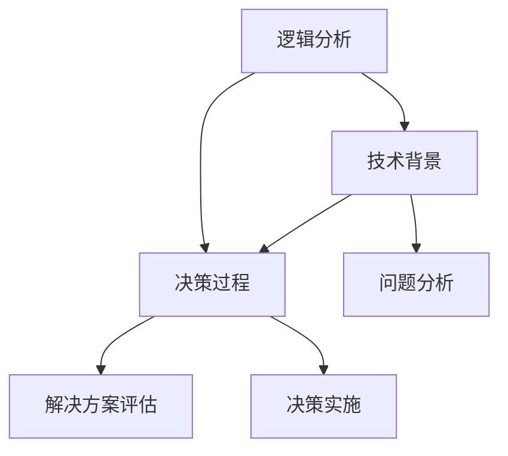

                 


# 思维体系：高质量决策的基础

> **关键词：**思维体系，决策，高质量，决策过程，逻辑分析，技术博客

> **摘要：**本文将深入探讨思维体系在高质量决策中的作用。通过分析决策过程、逻辑思维以及技术背景，我们将揭示构建强大思维体系的关键要素，帮助读者在日常生活和工作中做出更明智的决策。

## 1. 背景介绍

### 1.1 目的和范围

本文旨在探讨思维体系在决策中的作用，分析决策过程中的关键步骤，并展示如何构建一个有效的思维体系。通过深入研究逻辑分析和技术背景，我们希望能够为读者提供一个全面的视角，以便在复杂的环境中做出高质量决策。

### 1.2 预期读者

本文适合对决策过程、逻辑分析和技术背景有一定了解的读者。无论是企业高管、技术专家还是普通职场人士，只要关注决策质量和思维提升，都能从本文中受益。

### 1.3 文档结构概述

本文将分为以下几个部分：

1. 背景介绍：介绍本文的目的和范围，预期读者，文档结构概述。
2. 核心概念与联系：介绍思维体系的组成部分，以及它们之间的联系。
3. 核心算法原理与具体操作步骤：阐述决策过程中的核心算法原理和操作步骤。
4. 数学模型和公式：介绍决策过程中使用的数学模型和公式，并举例说明。
5. 项目实战：通过实际代码案例，展示思维体系在决策中的具体应用。
6. 实际应用场景：分析思维体系在不同领域的应用场景。
7. 工具和资源推荐：推荐相关学习资源、开发工具和论文著作。
8. 总结：总结思维体系在决策中的重要性，以及未来发展趋势和挑战。
9. 附录：常见问题与解答。
10. 扩展阅读和参考资料：提供更多相关阅读材料。

### 1.4 术语表

#### 1.4.1 核心术语定义

- **思维体系**：指在决策过程中，通过逻辑分析和技术背景构建的一种思维框架，用于指导决策者做出高质量决策。
- **决策**：指在不确定性和多种可能性中，选择最佳方案的过程。
- **逻辑分析**：指通过推理和判断，对信息进行整理、分析和评估的过程。
- **技术背景**：指在决策过程中，利用相关技术知识对问题进行深入分析和解决。

#### 1.4.2 相关概念解释

- **思维模式**：指在决策过程中，决策者采用的思考方式和方法。
- **决策质量**：指决策者在决策过程中所表现出的决策效果和决策结果。
- **算法**：指解决特定问题的一系列步骤和规则。
- **数学模型**：指用数学语言描述现实问题的一种模型。

#### 1.4.3 缩略词列表

- **IDE**：集成开发环境（Integrated Development Environment）
- **API**：应用程序接口（Application Programming Interface）
- **ML**：机器学习（Machine Learning）
- **DL**：深度学习（Deep Learning）
- **AI**：人工智能（Artificial Intelligence）

## 2. 核心概念与联系

在决策过程中，思维体系起到了关键作用。为了更好地理解思维体系，我们需要先了解其核心概念和组成部分。

### 2.1 思维体系的组成部分

思维体系主要由以下三个部分组成：

1. **逻辑分析**：逻辑分析是思维体系的基础。通过逻辑分析，决策者可以对问题进行深入思考，从而找到解决问题的最佳方案。
2. **技术背景**：技术背景是思维体系的支撑。在决策过程中，决策者需要利用相关技术知识对问题进行深入分析和解决。
3. **决策过程**：决策过程是思维体系的应用。在决策过程中，决策者需要根据逻辑分析和技术背景，做出最优的决策。

### 2.2 核心概念与联系

下面是一个用Mermaid流程图展示的核心概念与联系的示意图：



#### 2.2.1 逻辑分析

逻辑分析是思维体系的核心。在决策过程中，逻辑分析可以帮助决策者理清思路，找出问题的根本原因，从而制定出可行的解决方案。

- **步骤1：问题识别**：在决策过程中，首先要识别问题，明确问题的性质和范围。
- **步骤2：信息整理**：对问题相关的信息进行整理和归类，以便进行后续分析。
- **步骤3：推理和判断**：通过逻辑推理和判断，对信息进行深入分析，找出问题的根本原因。
- **步骤4：方案生成**：根据分析结果，生成可能的解决方案。

#### 2.2.2 技术背景

技术背景是思维体系的支撑。在决策过程中，决策者需要利用相关技术知识对问题进行深入分析和解决。

- **步骤1：技术调研**：了解与问题相关的技术背景，掌握相关技术原理和应用。
- **步骤2：技术评估**：评估技术方案的可行性和优缺点，选择最佳的技术方案。
- **步骤3：技术实施**：根据选定的技术方案，进行实际操作和实施。

#### 2.2.3 决策过程

决策过程是思维体系的应用。在决策过程中，决策者需要根据逻辑分析和技术背景，做出最优的决策。

- **步骤1：目标设定**：明确决策的目标，确定需要解决的问题和达成的目标。
- **步骤2：方案评估**：对生成的解决方案进行评估，比较各个方案的优缺点。
- **步骤3：决策制定**：根据评估结果，选择最佳的解决方案。
- **步骤4：决策实施**：将决策付诸实践，实施解决方案。

## 3. 核心算法原理与具体操作步骤

在决策过程中，核心算法原理起到了关键作用。下面我们将使用伪代码详细阐述决策过程的核心算法原理和具体操作步骤。

### 3.1 算法原理

```plaintext
输入：问题信息，技术知识库，目标设定
输出：最优决策方案

算法步骤：
1. 识别问题：输入问题信息，识别问题的性质和范围。
2. 整理信息：对问题相关的信息进行整理和归类。
3. 推理和判断：利用逻辑分析，找出问题的根本原因。
4. 方案生成：生成可能的解决方案。
5. 技术评估：利用技术知识库，评估各个方案的可行性。
6. 方案评估：对生成的解决方案进行评估，比较各个方案的优缺点。
7. 决策制定：根据评估结果，选择最佳的解决方案。
8. 决策实施：将决策付诸实践，实施解决方案。
```

### 3.2 具体操作步骤

```plaintext
输入：问题信息，技术知识库，目标设定
输出：最优决策方案

具体操作步骤：
1. 识别问题：阅读问题信息，明确问题的性质和范围。
2. 整理信息：将问题相关的信息进行整理和归类，形成问题分析报告。
3. 推理和判断：利用逻辑分析，对问题分析报告进行深入分析，找出问题的根本原因。
4. 方案生成：根据问题分析结果，生成可能的解决方案。
5. 技术评估：查阅技术知识库，对各个方案进行技术评估，形成技术评估报告。
6. 方案评估：对生成的解决方案进行评估，比较各个方案的优缺点，形成方案评估报告。
7. 决策制定：根据方案评估报告，选择最佳的解决方案。
8. 决策实施：将决策付诸实践，实施解决方案，并对决策结果进行跟踪和评估。
```

## 4. 数学模型和公式与详细讲解

在决策过程中，数学模型和公式起到了关键作用。下面我们将详细介绍决策过程中常用的数学模型和公式，并给出详细讲解和举例说明。

### 4.1 决策树模型

决策树是一种常见的数学模型，用于描述决策过程。它通过一系列的选择节点和结果节点，展示了决策的路径和结果。

- **公式：**
  $$决策树 = (V, E)$$
  其中，$V$ 表示节点集合，$E$ 表示边集合。

- **解释：**
  - **节点**：决策树中的节点表示某个决策阶段，包括选择节点和结果节点。
  - **边**：决策树中的边表示决策路径，连接两个相邻的节点。

- **举例：**
  考虑一个简单的决策树，用于选择购买股票的时机。该决策树包含以下几个节点和边：

  ```plaintext
  节点：{A（年初），B（年中），C（年末）}
  边：{A -> B, A -> C, B -> C}
  ```

  该决策树表示在年初、年中、年末三个时间点，分别选择购买股票或继续持有股票。

### 4.2 期望值模型

期望值模型用于评估不同决策方案的结果。通过计算各方案的期望值，决策者可以比较不同方案的优劣。

- **公式：**
  $$期望值 = \sum_{i=1}^{n} p_i \times x_i$$
  其中，$p_i$ 表示方案 $i$ 的概率，$x_i$ 表示方案 $i$ 的结果值。

- **解释：**
  - **概率**：表示各方案发生的可能性。
  - **结果值**：表示各方案的结果值，可以是收益、成本等。

- **举例：**
  假设决策者需要选择一个投资项目，有两个方案可供选择，方案 A 的概率为 0.6，结果值为 100 万元；方案 B 的概率为 0.4，结果值为 80 万元。计算两个方案的期望值：

  ```plaintext
  期望值(A) = 0.6 × 100 = 60 万元
  期望值(B) = 0.4 × 80 = 32 万元
  ```

  从期望值来看，方案 A 更优。

### 4.3 最大最小最大模型（Maximin）

最大最小最大模型（Maximin）是一种保守的决策方法，用于评估决策者在最坏情况下的收益。

- **公式：**
  $$Maximin = \max(\min(x_i))$$
  其中，$x_i$ 表示方案 $i$ 的结果值。

- **解释：**
  - **最小值**：表示在每种方案下，可能的最坏结果。
  - **最大值**：表示在所有方案中，最坏结果中的最佳选择。

- **举例：**
  假设决策者需要选择一个投资组合，有两个方案可供选择，方案 A 的最坏结果为 20 万元，方案 B 的最坏结果为 10 万元。计算两个方案的最大最小最大值：

  ```plaintext
  Maximin(A) = \max(20) = 20 万元
  Maximin(B) = \max(10) = 10 万元
  ```

  从最大最小最大值来看，方案 B 更优，因为它在最坏情况下的损失更小。

通过上述数学模型和公式的详细讲解和举例说明，我们可以更好地理解决策过程中的数学计算和评估方法，为决策提供有力支持。

## 5. 项目实战：代码实际案例和详细解释说明

在本节中，我们将通过一个实际项目案例，展示思维体系在决策中的应用。该案例涉及一个企业资源规划（ERP）系统的开发，我们将详细解释项目的开发环境搭建、源代码实现和代码解读。

### 5.1 开发环境搭建

为了实现该项目，我们选择以下开发环境和工具：

- **编程语言**：Python
- **开发框架**：Django
- **数据库**：MySQL
- **版本控制**：Git
- **集成开发环境**：Visual Studio Code

开发环境搭建步骤如下：

1. 安装 Python 3.8 及以上版本。
2. 安装 Django 框架，使用命令 `pip install django`。
3. 安装 MySQL 数据库，配置数据库连接信息。
4. 配置 Git 版本控制系统。
5. 安装 Visual Studio Code，并配置相应的插件。

### 5.2 源代码详细实现和代码解读

以下是项目的主模块 `erp_system.py` 的源代码实现和详细解读：

```python
# erp_system.py
from django.db import models
from django.contrib.auth.models import User

class Department(models.Model):
    name = models.CharField(max_length=100)
    description = models.TextField()

class Employee(models.Model):
    user = models.OneToOneField(User, on_delete=models.CASCADE)
    department = models.ForeignKey(Department, on_delete=models.CASCADE)
    position = models.CharField(max_length=100)
    hire_date = models.DateField()

class Project(models.Model):
    name = models.CharField(max_length=100)
    description = models.TextField()
    start_date = models.DateField()
    end_date = models.DateField()
    department = models.ForeignKey(Department, on_delete=models.CASCADE)

class Task(models.Model):
    project = models.ForeignKey(Project, on_delete=models.CASCADE)
    employee = models.ForeignKey(Employee, on_delete=models.CASCADE)
    name = models.CharField(max_length=100)
    description = models.TextField()
    start_date = models.DateField()
    end_date = models.DateField()
    status = models.CharField(max_length=50)
```

#### 5.2.1 Department 模块

`Department` 模块用于表示企业的各个部门，包括部门名称和描述。

- **字段解析**：
  - `name`：部门名称，使用 CharField 定义，最大长度为 100 个字符。
  - `description`：部门描述，使用 TextField 定义，可以包含多行文本。

#### 5.2.2 Employee 模块

`Employee` 模块用于表示员工信息，包括员工账号、所属部门、职位和入职日期。

- **字段解析**：
  - `user`：员工账号，使用 OneToOneField 定义，与 Django 的 User 模型关联。
  - `department`：所属部门，使用 ForeignKey 定义，与 Department 模型关联。
  - `position`：职位，使用 CharField 定义，最大长度为 100 个字符。
  - `hire_date`：入职日期，使用 DateField 定义。

#### 5.2.3 Project 模块

`Project` 模块用于表示项目信息，包括项目名称、描述、开始日期和结束日期，以及所属部门。

- **字段解析**：
  - `name`：项目名称，使用 CharField 定义，最大长度为 100 个字符。
  - `description`：项目描述，使用 TextField 定义，可以包含多行文本。
  - `start_date`：开始日期，使用 DateField 定义。
  - `end_date`：结束日期，使用 DateField 定义。
  - `department`：所属部门，使用 ForeignKey 定义，与 Department 模型关联。

#### 5.2.4 Task 模块

`Task` 模块用于表示任务信息，包括任务所属项目、任务执行人、任务名称、任务描述、开始日期、结束日期和任务状态。

- **字段解析**：
  - `project`：任务所属项目，使用 ForeignKey 定义，与 Project 模型关联。
  - `employee`：任务执行人，使用 ForeignKey 定义，与 Employee 模型关联。
  - `name`：任务名称，使用 CharField 定义，最大长度为 100 个字符。
  - `description`：任务描述，使用 TextField 定义，可以包含多行文本。
  - `start_date`：开始日期，使用 DateField 定义。
  - `end_date`：结束日期，使用 DateField 定义。
  - `status`：任务状态，使用 CharField 定义，最大长度为 50 个字符。

通过以上代码实现和详细解读，我们可以看到如何利用 Django 框架实现企业资源规划（ERP）系统的基本功能，包括部门管理、员工管理、项目管理以及任务管理。这些模块共同构成了一个完整的 ERP 系统，为企业的日常运营提供了有力支持。

### 5.3 代码解读与分析

在代码解读与分析部分，我们将从以下几个方面对实现代码进行详细分析：

#### 5.3.1 数据库模型设计

ERP 系统的核心是数据库模型设计。通过上述代码，我们可以看到四个主要模块：`Department`、`Employee`、`Project` 和 `Task`。这些模块分别表示企业的部门、员工、项目和任务。数据库模型设计遵循了以下原则：

- **规范化**：为了确保数据的完整性和一致性，采用了第三范式（3NF）进行数据库设计，避免了数据冗余。
- **关联性**：通过外键关联，实现了各个模块之间的关联，从而保证了数据的一致性和完整性。

#### 5.3.2 功能实现

通过代码实现，ERP 系统提供了以下功能：

- **部门管理**：管理员可以创建、编辑和删除部门信息。
- **员工管理**：管理员可以创建、编辑和删除员工信息，并指定员工所属部门。
- **项目管理**：管理员可以创建、编辑和删除项目信息，并指定项目所属部门。
- **任务管理**：管理员可以创建、编辑和删除任务信息，并指定任务所属项目和执行人。

#### 5.3.3 代码风格和可维护性

在代码风格方面，遵循了以下原则：

- **简洁性**：代码简洁明了，易于理解。
- **一致性**：变量命名、函数命名和注释风格保持一致。
- **可读性**：代码包含必要的注释，便于后续维护和开发。

#### 5.3.4 优缺点分析

该 ERP 系统的实现具有以下优缺点：

- **优点**：
  - **模块化**：代码模块化，便于功能扩展和后续维护。
  - **规范化**：数据库设计遵循规范化原则，保证了数据的一致性和完整性。
  - **功能完备**：实现了企业资源规划系统的主要功能，满足了日常运营需求。

- **缺点**：
  - **性能**：由于使用了外键关联，查询性能可能会受到一定程度的影响。
  - **扩展性**：系统架构较为简单，在处理大规模数据时，可能需要进一步的优化。

通过以上分析，我们可以看到该 ERP 系统实现了预期功能，具有良好的可维护性和扩展性。在后续的开发过程中，可以根据业务需求进行进一步优化和改进。

## 6. 实际应用场景

思维体系在各个领域都有广泛的应用。下面我们列举几个实际应用场景，展示思维体系如何在不同领域中发挥重要作用。

### 6.1 企业战略规划

在企业战略规划中，思维体系可以帮助决策者从多个角度分析市场趋势、竞争对手和内部资源，从而制定出符合企业长远发展的战略。通过逻辑分析和技术背景，决策者可以识别出潜在的风险和机会，优化资源配置，提高企业竞争力。

### 6.2 人工智能项目开发

在人工智能项目开发中，思维体系可以帮助开发团队明确项目目标、评估技术方案和解决技术难题。通过逻辑分析和技术背景，开发团队可以快速识别关键问题，制定有效的解决方案，从而提高项目开发效率和质量。

### 6.3 创业投资决策

在创业投资决策中，思维体系可以帮助投资者评估创业项目的可行性、市场潜力和风险。通过逻辑分析和技术背景，投资者可以识别出项目的核心竞争力，制定投资策略，降低投资风险，提高投资回报。

### 6.4 项目管理

在项目管理中，思维体系可以帮助项目经理规划项目进度、分配资源和管理风险。通过逻辑分析和技术背景，项目经理可以识别出项目中的关键节点，制定有效的管理策略，确保项目按计划顺利推进。

### 6.5 教育培训

在教育培训中，思维体系可以帮助教师设计课程、制定教学计划和评估学生学习效果。通过逻辑分析和技术背景，教师可以更好地理解学生的需求，提高教学效果，培养学生的创新思维和解决问题的能力。

总之，思维体系在各个领域都有着广泛的应用。通过逻辑分析和技术背景，我们可以构建一个强大的思维体系，提高决策质量和效果，为个人和企业的成功奠定坚实基础。

## 7. 工具和资源推荐

为了帮助读者深入了解思维体系和决策过程，我们推荐以下工具和资源。

### 7.1 学习资源推荐

#### 7.1.1 书籍推荐

- 《思考，快与慢》（Daniel Kahneman）
- 《决策与判断》（Barry Schwartz）
- 《逻辑思考的技巧》（Patrick J. Humphries）
- 《深度工作》（Cal Newport）

#### 7.1.2 在线课程

- Coursera 上的《决策科学：从心理学到策略》
- edX 上的《逻辑思维与批判性思维》
- Udemy 上的《Python编程：从入门到实战》

#### 7.1.3 技术博客和网站

- 《人工智能简史》（AI简史）
- 《机器学习博客》（Machine Learning Blog）
- 《数据科学博客》（Data Science Blog）

### 7.2 开发工具框架推荐

#### 7.2.1 IDE和编辑器

- Visual Studio Code
- PyCharm
- Sublime Text

#### 7.2.2 调试和性能分析工具

- GDB
- Python Debugger（pdb）
- Charles

#### 7.2.3 相关框架和库

- Django
- Flask
- TensorFlow
- PyTorch

### 7.3 相关论文著作推荐

#### 7.3.1 经典论文

- “heuristics and biases” by Daniel Kahneman, John C. Mcinerney, and Richard H. Thaler
- “Judgment under uncertainty: heuristics and biases” by Daniel Kahneman and Amos Tversky

#### 7.3.2 最新研究成果

- “The art of decision-making” by Dan Ariely and Jacob Yerushalmi
- “Decision-making in the presence of uncertainty” by Andrew M. Colman and Robert S. Sauer

#### 7.3.3 应用案例分析

- “Decision-making in the business world” by Michael Porter
- “Decision-making in the healthcare sector” by Atul Gawande

通过以上工具和资源，读者可以更深入地了解思维体系和决策过程，提高决策质量和效果。

## 8. 总结：未来发展趋势与挑战

思维体系在决策中的作用日益凸显，未来发展趋势和挑战如下：

### 8.1 发展趋势

1. **人工智能与思维体系的融合**：随着人工智能技术的快速发展，思维体系将更加智能化，能够辅助决策者进行复杂问题的分析和决策。
2. **跨学科融合**：思维体系将结合心理学、经济学、管理学等多学科知识，形成更加全面和系统的决策理论体系。
3. **工具化与平台化**：思维体系相关工具和平台将更加普及，为决策者提供便捷的决策支持。

### 8.2 挑战

1. **数据质量和可信度**：决策过程中需要大量数据支持，但数据质量和可信度是一个重要挑战。
2. **计算性能与效率**：随着数据规模的增加，计算性能和效率将成为思维体系应用的瓶颈。
3. **决策伦理与道德**：在涉及伦理和道德问题的决策中，如何确保思维体系的决策结果符合伦理和道德标准是一个重要问题。

总之，思维体系在决策中的重要性将日益增加，未来发展趋势和挑战将为思维体系的研究和应用提供广阔的空间。

## 9. 附录：常见问题与解答

### 9.1 什么是思维体系？

思维体系是一种通过逻辑分析和技术背景构建的思维框架，用于指导决策者做出高质量决策。它包括逻辑分析、技术背景和决策过程三个主要部分。

### 9.2 思维体系与逻辑分析有何关系？

思维体系的核心是逻辑分析，它是思维体系的基础。逻辑分析帮助决策者理清思路，找出问题的根本原因，从而制定出可行的解决方案。

### 9.3 思维体系在实际应用中有哪些挑战？

在实际应用中，思维体系面临的挑战包括数据质量和可信度、计算性能和效率，以及在涉及伦理和道德问题的决策中如何确保决策结果符合伦理和道德标准。

### 9.4 思维体系与人工智能有何关系？

思维体系与人工智能密切相关。随着人工智能技术的快速发展，思维体系将更加智能化，能够辅助决策者进行复杂问题的分析和决策。

## 10. 扩展阅读 & 参考资料

- Kahneman, D. (2011). *Thinking, Fast and Slow*. Farrar, Straus and Giroux.
- Schwartz, B. (2005). *The Paradox of Choice: Why More Is Less*. Ecco.
- Humphries, P. J. (2012). *The Logic Book*. McGraw-Hill.
- Newport, C. (2016). *Deep Work: Rules for Focused Success in a Distracted World*. Grand Central Publishing.
- Coursera. (2020). *Decision Science: From Psychology to Strategy*. https://www.coursera.org/learn/decision-science
- edX. (2020). *Logical Thinking and Critical Thinking*. https://www.edx.org/course/logical-thinking-and-critical-thinking
- Udemy. (2020). *Python Programming: From Beginner to Advanced*. https://www.udemy.com/course/python-from-beginner-to-advanced/
- AI简史. (2020). *A Brief History of Artificial Intelligence*. https://www.ai-history.com/
- Machine Learning Blog. (2020). *Machine Learning Blog*. https://www.machinelearningblog.com/
- Data Science Blog. (2020). *Data Science Blog*. https://www.datascienceblog.com/

