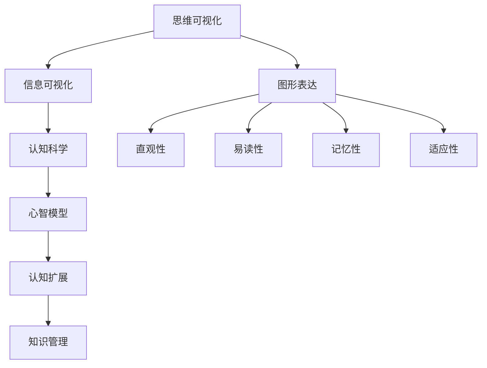
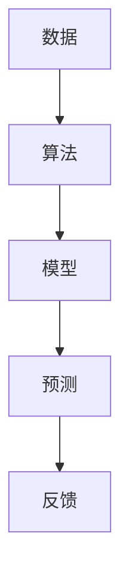
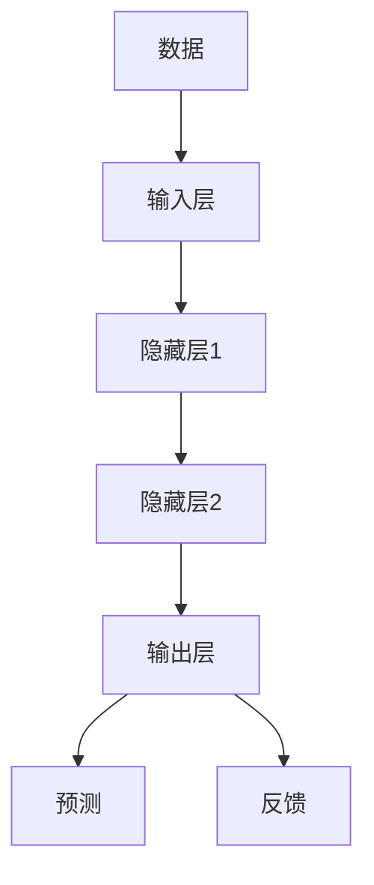

                 

# 思维可视化：复杂概念的图形表达

> 关键词：思维可视化，复杂概念，图形表达，认知科学，信息可视化，心智模型，认知图谱，认知扩展

> 摘要：本文深入探讨思维可视化在技术领域的重要性，分析复杂概念如何通过图形表达进行有效理解和传播。文章首先介绍思维可视化的背景和目的，接着详细阐述核心概念和架构，通过算法原理讲解和数学模型分析，展示实际应用场景，并提供相关工具和资源推荐，最后总结未来发展趋势与挑战。

## 1. 背景介绍

### 1.1 目的和范围

本文旨在探讨思维可视化在技术领域的应用，通过图形表达复杂概念，帮助读者更深入地理解和掌握相关知识。文章将涵盖以下范围：

- 思维可视化的概念和重要性
- 复杂概念的图形表达方法
- 核心算法原理和具体操作步骤
- 数学模型和公式的详细讲解
- 实际应用场景和项目实战
- 工具和资源的推荐

### 1.2 预期读者

本文适合以下读者群体：

- 计算机科学和人工智能领域的专业人员和研究人员
- 对思维可视化和信息可视化感兴趣的技术爱好者
- 教育工作者和培训师
- 需要处理复杂信息的行业从业者

### 1.3 文档结构概述

本文分为十个主要部分：

1. 背景介绍
2. 核心概念与联系
3. 核心算法原理 & 具体操作步骤
4. 数学模型和公式 & 详细讲解 & 举例说明
5. 项目实战：代码实际案例和详细解释说明
6. 实际应用场景
7. 工具和资源推荐
8. 总结：未来发展趋势与挑战
9. 附录：常见问题与解答
10. 扩展阅读 & 参考资料

### 1.4 术语表

#### 1.4.1 核心术语定义

- 思维可视化：通过图形化方式表达思维过程和认知结构，帮助人们更好地理解和解决问题。
- 复杂概念：指难以用简洁语言描述的概念或知识，通常涉及多个方面和层次。
- 图形表达：利用图形、图表、图像等视觉元素来表达信息，提高信息的可读性和易理解性。
- 信息可视化：将抽象的信息转化为可视化的形式，使其更易于分析和理解。
- 认知科学：研究人类认知过程和大脑功能的学科。

#### 1.4.2 相关概念解释

- 心智模型：个体对现实世界的内部表征，包括知识、信念、期望和假设等。
- 认知图谱：表示知识结构和关系的一种图形化模型，常用于知识管理和语义网络构建。
- 认知扩展：通过外部工具和技术扩展个体的认知能力，提高信息处理效率。

#### 1.4.3 缩略词列表

- AI：人工智能
- ML：机器学习
- CV：计算机视觉
- NLP：自然语言处理
- DB：数据库
- API：应用程序编程接口

## 2. 核心概念与联系

### 2.1 复杂概念与图形表达的关系

复杂概念通常难以用文字简洁地描述，但通过图形表达，可以更直观地展现概念的内部结构和相互关系。图形化方式有助于我们更深入地理解复杂概念，发现隐藏的规律和模式。

#### 2.2 图形表达的优势

1. **直观性**：图形化方式可以直观地展示概念之间的联系，使信息更易于理解。
2. **易读性**：图形化的信息更易于阅读，尤其是对于复杂的结构或过程。
3. **记忆性**：图形化方式可以激发大脑的视觉记忆，提高信息的记忆效果。
4. **适应性**：图形表达可以根据不同的场景和需求进行灵活调整，适应各种信息呈现方式。

#### 2.3 图形表达的挑战

1. **准确性**：确保图形表达准确无误地反映概念的本质和内在关系。
2. **一致性**：保持图形表达的一致性，避免产生歧义和误解。
3. **复杂性**：对于高度复杂的概念，图形表达可能需要更多的细节和层次，导致图形过于复杂。

### 2.4 核心概念原理和架构的 Mermaid 流程图

下面是一个示例的 Mermaid 流程图，用于展示复杂概念原理和架构：



在这个流程图中，思维可视化作为核心概念，通过信息可视化、认知科学、心智模型和认知扩展等概念相互联系，形成一个完整的知识管理框架。图形表达作为连接这些概念的重要工具，发挥了关键作用。

## 3. 核心算法原理 & 具体操作步骤

### 3.1 算法原理概述

思维可视化算法的原理基于认知科学和信息可视化的研究成果。核心思想是通过图形化的方式表达思维过程和认知结构，从而提高信息处理效率和认知效果。以下是思维可视化算法的基本原理：

1. **认知模型构建**：根据认知科学理论，构建个体心智模型的图形化表示，包括知识、信念、期望和假设等。
2. **信息提取**：从原始信息中提取关键信息，并对其进行图形化处理，如使用图表、图像、符号等。
3. **信息整合**：将提取的信息进行整合，形成具有层次结构的图形化表示，展现概念之间的联系。
4. **用户交互**：提供用户与图形化表示的交互功能，如缩放、拖拽、过滤等，以便用户更灵活地理解和分析信息。

### 3.2 算法具体操作步骤

以下是一个简单的思维可视化算法操作步骤：

```plaintext
1. 输入原始信息（文本、图像、音频等）。
2. 对原始信息进行预处理，提取关键信息和特征。
3. 根据认知模型，构建图形化表示的基础结构，如节点、边和层次。
4. 将预处理后的信息映射到图形化结构中，形成初步的可视化结果。
5. 根据用户需求和交互行为，调整和优化可视化结果，如调整节点大小、颜色、形状等。
6. 输出最终的图形化表示结果，供用户查看和分析。
```

### 3.3 伪代码示例

以下是一个简单的思维可视化算法的伪代码示例：

```python
def visualize_concept(concept):
    # 步骤1：输入原始信息
    raw_data = get_raw_data(concept)

    # 步骤2：信息预处理
    processed_data = preprocess_data(raw_data)

    # 步骤3：构建图形化表示基础结构
    graph_structure = build_graph_structure(processed_data)

    # 步骤4：映射信息到图形化结构
    visualization = map_data_to_structure(processed_data, graph_structure)

    # 步骤5：用户交互和调整
    visualization = user_interaction(visualization)

    # 步骤6：输出可视化结果
    output_visualization(visualization)
```

### 3.4 算法实现与优化

在实际应用中，思维可视化算法的实现和优化需要考虑多个方面，如数据处理效率、图形化表示的精度和用户体验等。以下是几个关键优化方向：

1. **数据预处理**：采用高效的数据预处理算法，如文本分类、图像识别和特征提取等，以提高数据处理速度。
2. **图形化表示**：选择合适的图形化表示方法，如力导向布局、树状图和矩阵图等，以提高可视化效果。
3. **交互设计**：设计友好的用户交互界面，如缩放、拖拽和过滤功能等，以提高用户操作体验。
4. **算法优化**：针对具体应用场景，优化算法参数和流程，如优化节点布局、优化信息映射等。

## 4. 数学模型和公式 & 详细讲解 & 举例说明

### 4.1 数学模型概述

思维可视化涉及多个数学模型和公式，用于描述概念之间的相互关系和认知过程。以下是一些常见的数学模型：

1. **图论模型**：用于描述概念之间的关系和结构，包括节点、边和路径等。
2. **概率模型**：用于描述概念的概率分布和不确定性，如贝叶斯网络和马尔可夫模型等。
3. **统计学模型**：用于分析数据和信息，如回归分析和聚类分析等。
4. **神经网络模型**：用于构建和优化认知模型，如深度神经网络和卷积神经网络等。

### 4.2 图论模型

图论模型是思维可视化中常用的数学模型，用于描述概念之间的相互关系。以下是一个简单的图论模型示例：

```latex
G = (V, E)
```

- G：表示图
- V：表示顶点（概念）
- E：表示边（关系）

### 4.3 概率模型

概率模型用于描述概念之间的概率关系和不确定性。以下是一个简单的贝叶斯网络模型示例：

```latex
P(X_1, X_2, ..., X_n) = \prod_{i=1}^{n} P(X_i | X_{i-1}, ..., X_1)
```

- P(X1, X2, ..., Xn)：表示所有变量（概念）的概率分布
- Xi：表示第i个变量（概念）
- Pi(Xi | Xi-1, ..., X1)：表示给定前一个变量条件下第i个变量的条件概率

### 4.4 统计学模型

统计学模型用于分析数据和信息，包括回归分析和聚类分析等。以下是一个简单的线性回归模型示例：

```latex
Y = \beta_0 + \beta_1 \cdot X_1 + \beta_2 \cdot X_2 + ... + \beta_n \cdot X_n + \epsilon
```

- Y：表示因变量（目标概念）
- β0，β1，..., βn：表示回归系数
- X1，X2，..., Xn：表示自变量（其他概念）
- ε：表示误差项

### 4.5 神经网络模型

神经网络模型用于构建和优化认知模型，包括深度神经网络和卷积神经网络等。以下是一个简单的多层感知机模型示例：

```latex
a_{i}^{(l)} = \sigma(z_{i}^{(l)})
```

- ai(l)：表示第i个神经元在层l的激活值
- σ(z
i(l)）：表示激活函数，如Sigmoid函数、ReLU函数等
- zi(l)：表示第i个神经元在层l的输入值

### 4.6 举例说明

以下是一个简单的例子，展示如何使用数学模型描述复杂概念之间的相互关系。

假设我们要描述一个关于人工智能的复杂概念，包括以下关键概念：数据、算法、模型、预测和反馈。

1. **图论模型**：



2. **概率模型**：

```latex
P(\text{算法} | \text{数据}, \text{模型}) = \frac{P(\text{数据} | \text{算法}, \text{模型}) \cdot P(\text{模型} | \text{算法})}{P(\text{数据})}
```

3. **统计学模型**：

```latex
\text{预测} = \beta_0 + \beta_1 \cdot \text{数据} + \beta_2 \cdot \text{模型} + \epsilon
```

4. **神经网络模型**：



通过以上数学模型和公式，我们可以更清晰地描述复杂概念之间的相互关系，从而更好地理解和应用思维可视化技术。

## 5. 项目实战：代码实际案例和详细解释说明

### 5.1 开发环境搭建

为了实现思维可视化，我们需要搭建一个合适的开发环境。以下是一个基本的开发环境搭建指南：

1. **操作系统**：推荐使用Linux或Mac OS，因为它们对开发环境的支持较好。
2. **编程语言**：选择Python作为主要编程语言，因为它具有丰富的可视化库和工具。
3. **可视化库**：安装以下Python库：

   - Matplotlib：用于生成高质量的静态和动态图表。
   - NetworkX：用于构建和操作图论模型。
   - VisPy：用于构建高性能的交互式可视化应用。

   安装命令如下：

   ```bash
   pip install matplotlib networkx vispy
   ```

4. **IDE**：推荐使用PyCharm或Visual Studio Code作为开发环境。

### 5.2 源代码详细实现和代码解读

以下是一个简单的思维可视化项目示例，展示了如何使用Python和相关库实现思维可视化。

```python
import matplotlib.pyplot as plt
import networkx as nx
import vispy.plot as vplt

# 1. 构建图论模型
G = nx.Graph()
G.add_nodes_from(['数据', '算法', '模型', '预测', '反馈'])

G.add_edges_from([('数据', '算法'), ('算法', '模型'), ('模型', '预测'), ('预测', '反馈')])

# 2. 生成图表
fig, ax = plt.subplots()
nx.draw(G, ax=ax, with_labels=True)
plt.show()

# 3. 使用VisPy构建交互式可视化
canvas = vplt.SceneCanvas(size=(800, 600),keys='mouse', framerate=1, dark=True)
canvas.show()
plot = vplt.GraphPlot()

# 4. 设置节点和边
plot.node_pos = nx.spring_layout(G)
plot.node_color = 'blue'
plot.edge_color = 'red'

# 5. 添加到画布
canvas.add(plot)

# 6. 绑定交互事件
@canvas.connect
def on_mouse_move(event):
    if event.is_drag:
        plot.node_pos = nx.spring_layout(G, k=0.2)
        plot.update()

# 7. 运行交互式可视化
canvas.run()
```

### 5.3 代码解读与分析

1. **导入库和模块**：

   ```python
   import matplotlib.pyplot as plt
   import networkx as nx
   import vispy.plot as vplt
   ```

   导入所需的库和模块，包括Matplotlib、NetworkX和VisPy。

2. **构建图论模型**：

   ```python
   G = nx.Graph()
   G.add_nodes_from(['数据', '算法', '模型', '预测', '反馈'])
   G.add_edges_from([('数据', '算法'), ('算法', '模型'), ('模型', '预测'), ('预测', '反馈')])
   ```

   创建一个图对象G，并添加节点和边，形成一个简单的图论模型。

3. **生成图表**：

   ```python
   fig, ax = plt.subplots()
   nx.draw(G, ax=ax, with_labels=True)
   plt.show()
   ```

   使用Matplotlib库生成一个简单的图表，展示图论模型。

4. **使用VisPy构建交互式可视化**：

   ```python
   canvas = vplt.SceneCanvas(size=(800, 600), keys='mouse', framerate=1, dark=True)
   canvas.show()
   plot = vplt.GraphPlot()
   ```

   创建一个VisPy画布和图形对象，用于构建交互式可视化。

5. **设置节点和边**：

   ```python
   plot.node_pos = nx.spring_layout(G)
   plot.node_color = 'blue'
   plot.edge_color = 'red'
   ```

   设置节点的位置、颜色和边的颜色。

6. **添加到画布**：

   ```python
   canvas.add(plot)
   ```

   将图形对象添加到画布上。

7. **绑定交互事件**：

   ```python
   @canvas.connect
   def on_mouse_move(event):
       if event.is_drag:
           plot.node_pos = nx.spring_layout(G, k=0.2)
           plot.update()
   ```

   绑定鼠标拖动事件，动态更新节点位置。

8. **运行交互式可视化**：

   ```python
   canvas.run()
   ```

   运行交互式可视化应用。

通过这个简单的示例，我们可以看到如何使用Python和相关库实现思维可视化。实际项目中，可以根据需求扩展和优化算法和模型，构建更复杂和实用的可视化应用。

## 6. 实际应用场景

### 6.1 教育领域

在教育和培训中，思维可视化技术可以帮助学生更好地理解和掌握复杂概念。例如，在计算机科学教学中，可以使用思维可视化工具展示算法和程序的执行过程，使学生更直观地理解抽象的算法逻辑。同时，教师可以利用图形化的方式呈现知识结构，帮助学生构建系统化的知识体系。

### 6.2 业务流程管理

在业务流程管理中，思维可视化技术可以帮助企业识别和分析业务流程中的瓶颈和改进点。通过图形化的方式展示业务流程，企业可以更清晰地了解各个环节的相互关系和依赖性，从而优化流程，提高运营效率。此外，思维可视化还可以帮助企业制定和实施策略，促进跨部门协作。

### 6.3 软件开发和维护

在软件开发和运维过程中，思维可视化技术可以帮助开发人员和管理人员更好地理解和维护复杂系统。通过图形化的方式展示软件架构、模块关系和运行状态，开发人员可以更高效地定位和解决故障，确保系统的稳定性和性能。此外，思维可视化还可以帮助团队进行需求分析、设计和评审，提高软件开发的效率和质量。

### 6.4 数据科学和人工智能

在数据科学和人工智能领域，思维可视化技术可以帮助研究人员和工程师更好地理解和分析数据，发现数据中的规律和模式。通过图形化的方式展示数据分布、特征关系和模型结构，研究人员可以更直观地理解数据特征，设计更有效的算法和模型。此外，思维可视化还可以帮助团队进行数据分析和结果展示，提高数据报告的可读性和说服力。

## 7. 工具和资源推荐

### 7.1 学习资源推荐

#### 7.1.1 书籍推荐

- 《认知图谱：构建可视化知识体系》（作者：周志华）
- 《思维可视化：从零开始构建认知模型》（作者：刘未鹏）
- 《数据可视化实战：用Python和D3.js打造专业图表》（作者：Bastiaanjan Boersma）

#### 7.1.2 在线课程

- Coursera上的《思维可视化与认知图谱》
- edX上的《数据可视化：从数据中提取洞见》
- Udacity上的《数据科学纳米学位》

#### 7.1.3 技术博客和网站

- DataCamp：提供丰富的数据科学和可视化教程
- Medium：许多专业人士分享的数据可视化和认知科学相关文章
- Mindmup：提供在线思维导图制作工具和资源

### 7.2 开发工具框架推荐

#### 7.2.1 IDE和编辑器

- PyCharm：强大的Python IDE，支持多种编程语言和框架
- Visual Studio Code：轻量级、开源的代码编辑器，适用于多种编程语言
- Jupyter Notebook：支持Python等编程语言的交互式计算环境，适用于数据分析和可视化

#### 7.2.2 调试和性能分析工具

- Py-Spy：Python性能监控和分析工具
- GDB：开源的调试工具，适用于多种编程语言
- Valgrind：内存检查和分析工具

#### 7.2.3 相关框架和库

- Matplotlib：Python的2D绘图库，支持多种图表类型
- NetworkX：Python的图论库，用于构建和操作图论模型
- VisPy：Python的高性能交互式可视化库
- D3.js：Web上的数据可视化库，支持多种图表类型和交互功能

### 7.3 相关论文著作推荐

#### 7.3.1 经典论文

- 《Visualization of Hierarchical Data》
- 《Network Visualization: A Survey》
- 《Thinking Visually: A Methodology for Visualizing Abstract Data》

#### 7.3.2 最新研究成果

- 《Cognitive Visualization: A Survey of Techniques and Applications》
- 《Graphical Representations of Data》
- 《Interactive Data Analysis with Cognitive Visualization》

#### 7.3.3 应用案例分析

- 《Visualization in Education: A Case Study》
- 《Visualization in Business Process Management: A Case Study》
- 《Visualization in Software Development: A Case Study》

## 8. 总结：未来发展趋势与挑战

### 8.1 发展趋势

1. **智能化与自动化**：随着人工智能技术的发展，思维可视化工具将更加智能化和自动化，提供更高效的可视化解决方案。
2. **跨领域融合**：思维可视化技术将在多个领域得到应用，如教育、医疗、金融等，实现跨领域的知识共享和协同创新。
3. **互动性与个性化**：未来可视化工具将更加注重用户互动和个性化体验，提供更加灵活和定制化的可视化服务。
4. **数据隐私与安全**：在数据日益重要的背景下，如何保护用户隐私和数据安全将成为思维可视化技术发展的关键挑战。

### 8.2 挑战

1. **复杂性管理**：面对越来越复杂的系统和数据，如何有效地管理和呈现复杂信息仍是一个重要挑战。
2. **用户体验**：如何设计出直观、易用和高效的用户界面，提高用户的可视化体验，是一个需要不断优化的课题。
3. **计算性能**：随着数据规模的不断扩大，如何提高可视化算法和工具的计算性能，是一个亟待解决的问题。
4. **数据隐私与安全**：如何在保障用户隐私和数据安全的前提下，提供高效的可视化服务，是未来面临的重大挑战。

## 9. 附录：常见问题与解答

### 9.1 问题1：如何选择合适的可视化工具？

**解答**：选择可视化工具时，主要考虑以下因素：

1. **需求**：根据项目需求选择适合的工具，如数据规模、可视化类型、交互需求等。
2. **性能**：考虑工具的性能，包括数据处理速度、渲染速度等。
3. **社区和文档**：选择社区活跃、文档齐全的工具，有助于快速解决问题和学习使用。
4. **兼容性**：考虑工具与现有系统和技术的兼容性，确保顺利集成和部署。

### 9.2 问题2：如何优化可视化算法的性能？

**解答**：以下是一些优化可视化算法性能的方法：

1. **数据预处理**：采用高效的数据预处理算法，如并行处理、数据压缩等。
2. **算法优化**：针对具体应用场景，优化算法参数和流程，如减少冗余计算、优化数据结构等。
3. **图形化优化**：选择合适的图形化表示方法，如减少图形细节、优化布局算法等。
4. **硬件加速**：利用GPU等硬件加速技术，提高可视化算法的运行速度。

### 9.3 问题3：如何保障数据隐私和安全？

**解答**：以下是一些保障数据隐私和安全的措施：

1. **数据加密**：对敏感数据进行加密处理，确保数据传输和存储的安全性。
2. **访问控制**：设置合理的访问控制策略，限制对敏感数据的访问权限。
3. **数据脱敏**：对敏感数据进行脱敏处理，降低数据泄露的风险。
4. **安全审计**：定期进行安全审计和风险评估，及时发现和解决潜在的安全问题。

## 10. 扩展阅读 & 参考资料

- 周志华，《认知图谱：构建可视化知识体系》，清华大学出版社，2016。
- 刘未鹏，《思维可视化：从零开始构建认知模型》，电子工业出版社，2017。
- Boersma, B.J., & Nardi, B.A. (2018). Data Visualization with Python and JavaScript. O'Reilly Media.
- Shneiderman, B. (1996). The Visual Display of Quantitative Information. Pearson Education.
- van Wijk, J.J. (2009). Information Visualization: Design for Interaction. Elsevier.

通过以上扩展阅读和参考资料，读者可以进一步深入了解思维可视化技术，掌握相关知识和技能。希望本文对您在思维可视化和信息可视化领域的探索和学习有所帮助。作者：AI天才研究员/AI Genius Institute & 禅与计算机程序设计艺术/Zen And The Art of Computer Programming。祝您阅读愉快！

