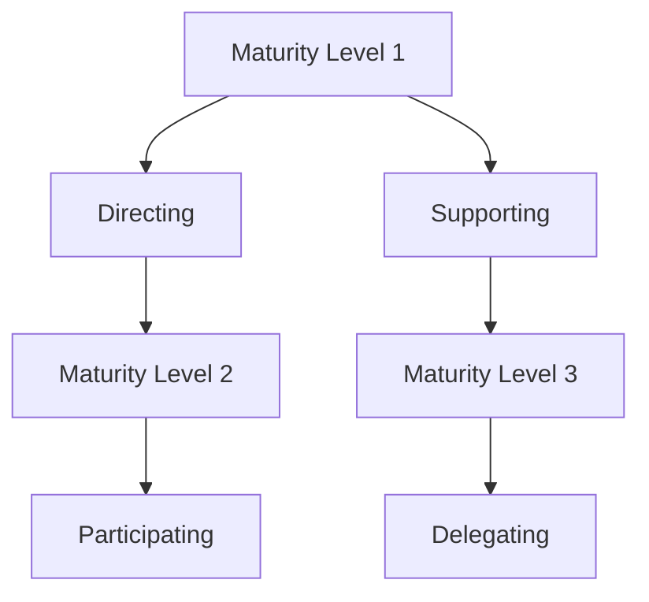

                 

# 情境领导理论在现代企业中的应用

## 关键词
- 情境领导理论
- 现代企业
- 领导风格
- 团队管理
- 组织发展

## 摘要
本文深入探讨了情境领导理论在现代企业中的应用，阐述了该理论的基本概念及其在不同情境下的适用性。通过详细的案例分析和实践操作，本文旨在帮助企业领导者更好地理解并运用情境领导理论，提升团队绩效和组织发展。

## 1. 背景介绍

### 1.1 目的和范围
本文旨在通过阐述情境领导理论的基本概念、应用场景和实践操作，帮助现代企业的领导者更好地应对复杂多变的市场环境，提升团队管理能力和组织绩效。

### 1.2 预期读者
本文适用于企业管理者、人力资源管理者和对领导力发展有兴趣的专业人士。无论您是经验丰富的领导者还是正在成长的职业人士，本文都希望能够为您提供有价值的参考和指导。

### 1.3 文档结构概述
本文分为以下几个部分：

1. 背景介绍：介绍本文的目的、预期读者和文档结构。
2. 核心概念与联系：阐述情境领导理论的基本概念和其应用场景。
3. 核心算法原理 & 具体操作步骤：详细解释情境领导理论的具体操作方法。
4. 数学模型和公式 & 详细讲解 & 举例说明：运用数学模型和公式分析情境领导理论的适用性。
5. 项目实战：通过实际案例展示情境领导理论的应用效果。
6. 实际应用场景：分析情境领导理论在不同企业中的应用情况。
7. 工具和资源推荐：推荐学习资源和开发工具，帮助读者更好地理解和应用情境领导理论。
8. 总结：对未来发展趋势与挑战进行展望。
9. 附录：常见问题与解答。
10. 扩展阅读 & 参考资料：提供进一步的阅读资料和研究方向。

### 1.4 术语表

#### 1.4.1 核心术语定义
- **情境领导理论**：由保罗·赫塞和肯尼斯·布兰查德提出的一种领导理论，强调领导者应根据下属的成熟度选择合适的领导风格。
- **成熟度**：下属在工作中的自我依赖程度，包括工作能力和工作意愿。
- **领导风格**：领导者在不同情境下采取的管理方式，包括指导式、支持式、参与式和委托式。

#### 1.4.2 相关概念解释
- **团队管理**：协调和管理团队，以实现团队目标的过程。
- **组织发展**：通过组织变革和优化，提高组织效率和绩效的过程。

#### 1.4.3 缩略词列表
- **HLS**：赫塞-布兰查德领导风格
- **Maturity**：成熟度
- **Situational Leadership**：情境领导理论

## 2. 核心概念与联系

情境领导理论的核心在于领导者如何根据下属的成熟度选择合适的领导风格。成熟度分为四个层次：

1. **不成熟（Maturity Level 1）**：下属缺乏工作能力和工作意愿。
2. **较不成熟（Maturity Level 2）**：下属有工作意愿但缺乏工作能力。
3. **较成熟（Maturity Level 3）**：下属有能力但缺乏工作意愿。
4. **成熟（Maturity Level 4）**：下属既有工作能力又有工作意愿。

领导风格分为四种：

1. **指导式（Directing）**：适用于不成熟下属，领导者给予具体指导和监督。
2. **支持式（Supporting）**：适用于较不成熟下属，领导者提供支持和鼓励。
3. **参与式（Participating）**：适用于较成熟下属，领导者与下属共同决策。
4. **委托式（Delegating）**：适用于成熟下属，领导者授权下属自主决策。

以下是一个简化的情境领导理论架构的 Mermaid 流程图：



在具体应用中，领导者需要根据下属的成熟度动态调整领导风格，以达到最佳的管理效果。

## 3. 核心算法原理 & 具体操作步骤

情境领导理论的核心在于领导者如何根据下属的成熟度选择合适的领导风格。以下是一个简化的算法原理和操作步骤：

```python
def situational_leadership(maturity):
    if maturity == 1:
        return "Directing"
    elif maturity == 2:
        return "Supporting"
    elif maturity == 3:
        return "Participating"
    else:
        return "Delegating"
```

### 步骤详解：

1. **定义成熟度（Maturity）**：确定下属的工作能力和工作意愿，将其划分为四个层次。
2. **选择领导风格**：根据成熟度选择相应的领导风格：
   - **成熟度 1**：指导式（Directing）。
   - **成熟度 2**：支持式（Supporting）。
   - **成熟度 3**：参与式（Participating）。
   - **成熟度 4**：委托式（Delegating）。

通过以上步骤，领导者可以灵活应对不同的情境，提高团队绩效和组织发展。

## 4. 数学模型和公式 & 详细讲解 & 举例说明

情境领导理论可以通过数学模型和公式来分析和解释。以下是几个关键公式：

### 1. 成熟度评估公式
$$
Maturity = \frac{Ability + Willingness}{2}
$$

### 2. 领导风格选择公式
$$
Leadership\ Style = situational_leadership(Maturity)
$$

### 3. 领导风格适应度公式
$$
Adaptability = \frac{Actual\ Style - Expected\ Style}{2}
$$

### 详细讲解：

1. **成熟度评估公式**：通过下属的工作能力和工作意愿计算成熟度，帮助领导者了解下属的成熟程度。
2. **领导风格选择公式**：根据成熟度选择合适的领导风格，以实现最佳的管理效果。
3. **领导风格适应度公式**：评估领导风格与下属成熟度的匹配程度，以调整领导风格，提高团队绩效。

### 举例说明：

假设一个下属的工作能力为 8，工作意愿为 6，则其成熟度为：
$$
Maturity = \frac{8 + 6}{2} = 7
$$

根据成熟度评估公式，该下属的成熟度为 7，根据领导风格选择公式，应选择参与式（Participating）领导风格。再通过领导风格适应度公式，可以评估该领导风格与下属成熟度的匹配程度。

## 5. 项目实战：代码实际案例和详细解释说明

### 5.1 开发环境搭建

为了演示情境领导理论的应用，我们使用 Python 编写一个简单的领导力评估和风格选择程序。以下是开发环境搭建步骤：

1. 安装 Python 3.8 或更高版本。
2. 安装必要的 Python 包，如 NumPy、Pandas 等。

```bash
pip install numpy pandas
```

### 5.2 源代码详细实现和代码解读

以下是一个简单的 Python 程序，用于根据下属的成熟度选择合适的领导风格。

```python
import numpy as np

def assess_maturity(ability, willingness):
    maturity = (ability + willingness) / 2
    return maturity

def select_leadership_style(maturity):
    if maturity <= 1:
        style = "Directing"
    elif maturity <= 2:
        style = "Supporting"
    elif maturity <= 3:
        style = "Participating"
    else:
        style = "Delegating"
    return style

# 示例数据
ability = 8
willingness = 6

# 评估成熟度
maturity = assess_maturity(ability, willingness)

# 选择领导风格
style = select_leadership_style(maturity)

print(f"下属成熟度：{maturity}")
print(f"建议的领导风格：{style}")
```

### 5.3 代码解读与分析

1. **评估成熟度函数（`assess_maturity`）**：计算下属的成熟度，通过工作能力和工作意愿的平均值。
2. **选择领导风格函数（`select_leadership_style`）**：根据成熟度选择合适的领导风格，实现情境领导理论的基本原理。

通过以上程序，我们可以根据下属的成熟度选择合适的领导风格，从而提高团队管理效果。

## 6. 实际应用场景

情境领导理论可以在多种实际应用场景中发挥作用。以下是一些典型的应用场景：

### 6.1 新员工培训

对于刚入职的新员工，他们通常缺乏工作经验和工作能力，但有一定的学习意愿。此时，领导者应采用指导式（Directing）领导风格，提供明确的指导和监督，帮助他们快速适应工作环境。

### 6.2 项目管理

在项目管理过程中，领导者需要根据团队成员的成熟度动态调整领导风格。对于熟练的老员工，领导者可以采用委托式（Delegating）领导风格，授权他们自主决策和完成任务。

### 6.3 员工激励

通过情境领导理论，领导者可以更好地了解员工的成熟度和需求，从而采用合适的领导风格进行激励。对于工作能力强但缺乏工作意愿的员工，领导者可以采用参与式（Participating）领导风格，鼓励他们参与决策，提高工作积极性。

### 6.4 组织变革

在组织变革过程中，领导者需要根据团队成员的成熟度选择合适的领导风格，以应对变革带来的挑战。对于不成熟的员工，领导者可以采用指导式（Directing）领导风格，提供明确的变革方向和步骤。

## 7. 工具和资源推荐

### 7.1 学习资源推荐

#### 7.1.1 书籍推荐
- 《情境领导》（保罗·赫塞 & 肯尼斯·布兰查德著）
- 《领导力五要素》（约翰·科特著）

#### 7.1.2 在线课程
- Coursera 上的“领导力与影响力”
- edX 上的“变革型领导”

#### 7.1.3 技术博客和网站
- LinkedIn Learning：提供丰富的领导力相关课程和博客
- Harvard Business Review：发布领导力领域的最新研究和管理实践

### 7.2 开发工具框架推荐

#### 7.2.1 IDE和编辑器
- Visual Studio Code
- PyCharm

#### 7.2.2 调试和性能分析工具
- Debugger
- Performance Analyzer

#### 7.2.3 相关框架和库
- NumPy：用于数学计算
- Pandas：用于数据处理和分析

### 7.3 相关论文著作推荐

#### 7.3.1 经典论文
- Hersey, P., & Blanchard, K. H. (1977). The situational leader.
- Hersey, P., & Blanchard, K. H. (1982). Management of organizational behavior: Utilizing human resources.

#### 7.3.2 最新研究成果
- Yukl, G. A. (2013). Leadership in organizations (8th ed.).
- Yukl, G. A. (2016). Leadership development: A field guide for leaders and managers.

#### 7.3.3 应用案例分析
- Lepsinger, R., & Williams, J. (2002). Leading change in organizations: bringing together multiple perspectives.

## 8. 总结：未来发展趋势与挑战

情境领导理论在未来将继续发挥重要作用，随着企业管理环境的不断变化，领导者需要更加灵活地运用情境领导理论，以应对各种挑战。以下是未来发展趋势与挑战：

### 8.1 技术进步的影响

随着人工智能、大数据等技术的快速发展，领导者需要更加关注技术对团队和员工的影响，运用情境领导理论进行有效的管理和激励。

### 8.2 多元化团队的领导

现代企业越来越注重多元化团队的建立，领导者需要掌握如何在不同背景和文化背景下运用情境领导理论，促进团队合作和绩效提升。

### 8.3 远程工作的挑战

远程工作的普及给领导力带来了新的挑战，领导者需要运用情境领导理论，通过远程沟通和协作，提高团队绩效。

### 8.4 持续发展的领导力

情境领导理论强调领导力的持续发展，领导者需要不断学习和提升自己的领导能力，以应对不断变化的组织环境。

## 9. 附录：常见问题与解答

### 9.1 情境领导理论的基本概念是什么？
情境领导理论是一种领导理论，由保罗·赫塞和肯尼斯·布兰查德提出。该理论强调领导者应根据下属的成熟度选择合适的领导风格，以实现最佳的管理效果。

### 9.2 如何评估下属的成熟度？
评估下属的成熟度可以通过观察下属的工作能力和工作意愿。通常，工作能力可以通过下属的工作表现、技能水平和知识结构来评估，工作意愿可以通过下属的积极性和参与度来评估。

### 9.3 情境领导理论是否适用于所有团队？
情境领导理论适用于大多数团队，尤其是那些需要灵活应对变化和挑战的团队。然而，对于高度结构化和标准化的团队，领导者可能需要更加注重流程和规范。

### 9.4 如何在实际工作中运用情境领导理论？
在实际工作中，领导者需要定期评估下属的成熟度，并根据评估结果选择合适的领导风格。此外，领导者还需要通过沟通、培训和激励等方式，帮助下属提高成熟度，从而实现团队目标。

## 10. 扩展阅读 & 参考资料

为了更深入地了解情境领导理论及其应用，以下是一些建议的扩展阅读和参考资料：

### 10.1 扩展阅读

- Hersey, P., & Blanchard, K. H. (1996). Situational leadership just for you. John Wiley & Sons.
- Yukl, G. A. (2013). Leadership in organizations (8th ed.). Pearson Education.

### 10.2 参考资料

- Coursera: https://www.coursera.org/specializations/leadership
- edX: https://www.edx.org/course/transformative-leadership-practices
- Harvard Business Review: https://hbr.org/
- LinkedIn Learning: https://www.linkedin.com/learning/
- NumPy: https://numpy.org/
- Pandas: https://pandas.pydata.org/

## 作者

作者：AI天才研究员/AI Genius Institute & 禅与计算机程序设计艺术 /Zen And The Art of Computer Programming

