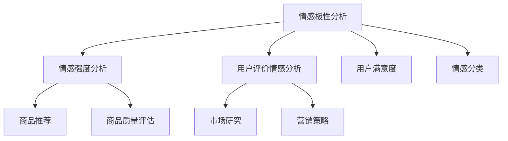

                 


# 情感分析在电商领域的应用：从用户评价到商品改进

> **关键词：** 情感分析、电商、用户评价、商品改进、文本挖掘、机器学习、自然语言处理、情感识别、分类算法、情感极性分析

> **摘要：** 本文将深入探讨情感分析技术在电商领域的应用，从用户评价中提取情感信息，并通过这些信息对商品进行改进。我们将详细讨论情感分析的基本概念、核心算法原理，以及如何在电商项目中实施和优化情感分析流程。本文旨在为从事电商技术开发的工程师提供实用指导，帮助他们更好地利用情感分析技术提升商品服务质量。

## 1. 背景介绍

### 1.1 目的和范围

本文的目的是介绍情感分析技术在电商领域的应用，帮助开发者理解如何通过分析用户评价来改进商品。我们主要关注以下范围：

1. 情感分析的基本概念和原理。
2. 情感分析技术在电商中的具体应用场景。
3. 实施情感分析流程的步骤和方法。
4. 优化情感分析结果的策略。

### 1.2 预期读者

本文适合以下读者群体：

1. 电商平台开发者和技术人员。
2. 数据科学和机器学习从业者。
3. 对情感分析和自然语言处理感兴趣的学者和研究者。

### 1.3 文档结构概述

本文分为以下几部分：

1. 背景介绍：介绍本文的目的、范围和预期读者。
2. 核心概念与联系：阐述情感分析的相关概念，并提供流程图。
3. 核心算法原理 & 具体操作步骤：讲解情感分析算法的原理和伪代码。
4. 数学模型和公式 & 详细讲解 & 举例说明：阐述情感分析中的数学模型和公式。
5. 项目实战：提供实际代码案例和详细解释。
6. 实际应用场景：讨论情感分析在电商中的实际应用。
7. 工具和资源推荐：推荐学习资源和开发工具。
8. 总结：展望情感分析技术的发展趋势和挑战。
9. 附录：常见问题与解答。
10. 扩展阅读 & 参考资料：提供进一步阅读的建议和参考资料。

### 1.4 术语表

#### 1.4.1 核心术语定义

- **情感分析**：一种自然语言处理技术，用于识别和提取文本中的情感倾向。
- **用户评价**：用户对商品或服务的主观感受和反馈。
- **文本挖掘**：从大量非结构化文本数据中提取有价值的信息。
- **机器学习**：一种通过数据驱动的方式实现自动编程的技术。
- **自然语言处理（NLP）**：研究如何让计算机理解和处理人类自然语言的技术。
- **情感识别**：从文本中识别出情感倾向，如正面、负面或中性。
- **分类算法**：用于将数据分为不同类别的算法。
- **情感极性分析**：识别文本的情感极性，如正面或负面。

#### 1.4.2 相关概念解释

- **情感极性**：文本情感的极性，通常分为正面（积极）和负面（消极）。
- **情感强度**：描述情感极性的强度，如非常正面、正面、中性、负面、非常负面。
- **文本分类**：将文本数据分为预定义的类别。
- **情感分析模型**：用于情感识别的机器学习模型。

#### 1.4.3 缩略词列表

- **NLP**：自然语言处理
- **ML**：机器学习
- **LSTM**：长短期记忆网络
- **BERT**：Bidirectional Encoder Representations from Transformers
- **CV**：计算机视觉

## 2. 核心概念与联系

在深入讨论情感分析在电商领域的应用之前，我们首先需要了解相关核心概念和它们之间的联系。以下是情感分析技术的核心概念及其在电商中的关联：

### 2.1. 情感分析的基本概念

- **情感极性分析**：识别文本的情感极性，如正面、负面或中性。
- **情感强度分析**：测量情感极性的强度，例如非常正面、正面、中性、负面、非常负面。
- **情感分类**：将文本分类为特定的情感类别，如快乐、悲伤、愤怒等。

### 2.2. 情感分析技术的应用场景

- **用户评价情感分析**：从用户评价中提取情感信息，帮助电商平台了解用户的真实感受。
- **商品推荐**：基于用户评价的情感分析结果，推荐更适合用户喜好的商品。
- **市场研究**：分析大量用户评价，了解消费者对商品的反馈，指导产品改进。

### 2.3. 情感分析在电商中的关联

- **用户满意度**：情感分析可以帮助电商平台了解用户的满意度，从而优化服务质量。
- **商品质量评估**：通过分析用户评价，评估商品的质量，有助于商品改进。
- **营销策略**：根据情感分析结果，制定更有效的营销策略。

### 2.4. 情感分析技术的核心概念原理图

以下是一个简单的 Mermaid 流程图，展示了情感分析的核心概念及其在电商中的应用：



通过这个图，我们可以看到情感分析技术的各个部分如何相互关联，以及它们在电商领域的具体应用。

### 2.5. 情感分析技术的实施流程

在电商项目中实施情感分析技术通常包括以下步骤：

1. **数据收集**：收集用户评价数据，可以是结构化数据（如数据库中的评价）或非结构化数据（如社交媒体上的评论）。
2. **数据预处理**：清洗和预处理数据，包括去除停用词、标点符号和噪声，以及进行词干提取和词形还原。
3. **特征提取**：将文本数据转换为机器学习模型可处理的特征向量。
4. **模型训练**：使用机器学习算法（如支持向量机、朴素贝叶斯、深度学习等）训练情感分析模型。
5. **模型评估**：评估模型的性能，通过交叉验证和测试集进行验证。
6. **模型部署**：将训练好的模型部署到生产环境中，实时处理用户评价数据。

### 2.6. 情感分析技术的挑战

在实施情感分析技术时，我们可能会遇到以下挑战：

1. **数据质量**：用户评价数据的质量可能参差不齐，需要进行严格的预处理和清洗。
2. **情感多样性**：用户评价中的情感表达形式多种多样，模型需要能够处理这种多样性。
3. **情感强度测量**：准确测量情感强度是一个挑战，需要考虑情感表达的细微差别。
4. **实时处理**：在大量用户评价涌入时，需要实时处理并返回结果，对系统的性能要求较高。

### 2.7. 情感分析技术的未来发展趋势

情感分析技术在电商领域的应用前景广阔，未来的发展趋势包括：

1. **多模态情感分析**：结合文本、图像和语音等多模态数据，提高情感分析的准确性。
2. **情感强度细化**：进一步细化情感强度，提供更精确的情感评估。
3. **个性化推荐**：基于用户情感分析结果，提供更个性化的商品推荐。
4. **实时情感监测**：实时监测用户情感，为营销策略提供即时反馈。

通过以上讨论，我们可以看到情感分析技术在电商领域的重要性以及其在实际应用中的关联和流程。接下来，我们将进一步探讨情感分析的核心算法原理，以及如何在电商项目中具体实施这些算法。

## 3. 核心算法原理 & 具体操作步骤

情感分析技术的核心在于从文本数据中提取情感信息，并进行分类和评估。在这一节中，我们将详细讨论情感分析的核心算法原理，并使用伪代码来阐述具体的操作步骤。

### 3.1. 情感分析算法原理

情感分析算法通常基于以下原理：

- **文本预处理**：对原始文本进行清洗、去噪、分词、词性标注等处理，提取有用的特征。
- **特征提取**：将预处理后的文本转换为机器学习模型可处理的特征向量，如词袋模型（Bag of Words, BoW）、TF-IDF（Term Frequency-Inverse Document Frequency）等。
- **分类算法**：使用分类算法对情感极性进行预测，常见的分类算法包括朴素贝叶斯（Naive Bayes）、逻辑回归（Logistic Regression）、支持向量机（Support Vector Machine, SVM）、深度学习（如卷积神经网络（CNN）、循环神经网络（RNN）等）。
- **模型训练与评估**：使用训练数据训练模型，并在测试集上评估模型性能。

### 3.2. 情感分析算法伪代码

以下是情感分析算法的伪代码，用于说明其基本操作步骤：

```plaintext
# 情感分析算法伪代码

# 步骤 1: 数据预处理
def preprocess_text(text):
    # 清洗文本
    text = clean_text(text)
    # 去停用词
    text = remove_stopwords(text)
    # 分词
    text = tokenize(text)
    # 词性标注
    text = pos_tagging(text)
    return text

# 步骤 2: 特征提取
def extract_features(preprocessed_text):
    # 使用词袋模型或TF-IDF提取特征
    features = extract_bow(preprocessed_text) or extract_tfidf(preprocessed_text)
    return features

# 步骤 3: 模型训练
def train_model(training_data):
    # 使用分类算法训练模型
    model = train_classification_model(training_data.features, training_data.labels)
    return model

# 步骤 4: 情感极性预测
def predict_polarity(test_data, trained_model):
    preprocessed_text = preprocess_text(test_data)
    features = extract_features(preprocessed_text)
    prediction = trained_model.predict(features)
    return prediction

# 步骤 5: 模型评估
def evaluate_model(test_data, trained_model):
    preprocessed_text = preprocess_text(test_data)
    features = extract_features(preprocessed_text)
    predictions = trained_model.predict(features)
    accuracy = evaluate_performance(predictions, test_data.labels)
    return accuracy
```

### 3.3. 情感分析算法的应用

以下是情感分析算法在电商项目中的应用示例：

1. **用户评价情感分析**：
   - 收集用户评价文本。
   - 使用情感分析算法对文本进行情感极性分类（正面、负面、中性）。
   - 根据情感极性结果，分析用户对商品的满意度，为商品改进提供依据。

2. **商品推荐**：
   - 基于用户历史评价和浏览记录，使用情感分析算法预测用户对商品的可能情感极性。
   - 根据情感分析结果，推荐更符合用户情感偏好的商品。

3. **市场研究**：
   - 收集大量用户评价，使用情感分析算法分析市场趋势。
   - 根据情感分析结果，制定更有效的营销策略。

通过以上步骤，我们可以看到情感分析算法在电商项目中的应用过程。接下来，我们将进一步探讨情感分析中的数学模型和公式，以更深入地理解其工作原理。

### 3.4. 数学模型和公式

情感分析中的数学模型和公式是理解算法工作原理的关键。以下是几个常见的数学模型和公式：

#### 3.4.1. 词袋模型（Bag of Words, BoW）

词袋模型将文本表示为一个词汇的集合，不考虑词序。常用的计算方法如下：

- **词频（Term Frequency, TF）**：一个词在文本中出现的次数。
- **逆文档频率（Inverse Document Frequency, IDF）**：一个词在所有文档中的频率倒数，用于平衡常见词的影响。

公式如下：

\[ TF(t,d) = \text{count of term } t \text{ in document } d \]

\[ IDF(t) = \log \left( \frac{N}{n(t)} \right) \]

其中，\( N \) 是文档总数，\( n(t) \) 是包含词 \( t \) 的文档数。

#### 3.4.2. TF-IDF（Term Frequency-Inverse Document Frequency）

TF-IDF 结合了词频和逆文档频率，用于衡量一个词在文档中的重要性：

\[ TF-IDF(t,d) = TF(t,d) \times IDF(t) \]

#### 3.4.3. 朴素贝叶斯（Naive Bayes）

朴素贝叶斯分类器是基于贝叶斯定理和属性独立假设的简单分类器。其概率公式如下：

\[ P(C|F_1, F_2, ..., F_n) = \frac{P(F_1, F_2, ..., F_n|C) \times P(C)}{P(F_1, F_2, ..., F_n)} \]

其中，\( C \) 表示类别，\( F_i \) 表示特征。

#### 3.4.4. 支持向量机（Support Vector Machine, SVM）

支持向量机是一种基于间隔最大化的分类算法。其主要目标是在高维空间中找到最大的分类边界。其决策函数如下：

\[ w \cdot x + b = 0 \]

其中，\( w \) 是权重向量，\( x \) 是特征向量，\( b \) 是偏置项。

#### 3.4.5. 循环神经网络（Recurrent Neural Network, RNN）

循环神经网络是一种能够处理序列数据的神经网络。其激活函数的递归形式如下：

\[ h_t = \sigma(W_h \cdot [h_{t-1}, x_t] + b_h) \]

其中，\( h_t \) 是当前时刻的隐藏状态，\( x_t \) 是当前输入，\( W_h \) 和 \( b_h \) 分别是权重和偏置。

通过以上数学模型和公式，我们可以更深入地理解情感分析算法的工作原理，并运用这些原理优化算法性能。

### 3.5. 情感分析算法的优化策略

为了提高情感分析算法的性能，我们可以采取以下优化策略：

1. **特征工程**：选择合适的特征，如词袋模型、TF-IDF、词嵌入（Word Embedding）等，以增强模型的表现力。
2. **超参数调优**：通过交叉验证和网格搜索（Grid Search）等方法，优化模型的超参数，如学习率、批量大小等。
3. **数据增强**：通过数据扩充、人工标注、对抗样本生成等方法，增加训练数据量，提高模型的泛化能力。
4. **模型集成**：结合多种模型，如集成学习（Ensemble Learning）和迁移学习（Transfer Learning），提高模型的准确性和稳定性。

通过以上策略，我们可以进一步提升情感分析算法在电商项目中的应用效果，为商品改进和用户满意度提升提供更可靠的依据。

### 3.6. 情感分析算法的应用案例

为了更好地理解情感分析算法的实际应用，我们来看一个具体的案例。

#### 案例背景

某电商平台希望通过用户评价来改进商品质量，提升用户满意度。他们收集了大量用户对商品的评价文本，并希望使用情感分析算法对文本进行情感极性分类。

#### 案例步骤

1. **数据收集**：从电商平台上收集用户对商品的原始评价文本。

2. **数据预处理**：对评价文本进行清洗、去停用词、分词、词性标注等处理。

3. **特征提取**：使用词袋模型提取特征，构建词袋模型向量。

4. **模型训练**：选择朴素贝叶斯分类器进行训练，训练数据为已标注的情感极性数据。

5. **模型评估**：使用测试数据评估模型性能，计算准确率、召回率、F1 分数等指标。

6. **结果分析**：根据模型预测结果，分析用户对商品的正面、负面评价，识别商品存在的问题。

7. **商品改进**：根据用户评价结果，改进商品质量，提升用户体验。

#### 案例结果

通过情感分析算法的应用，电商平台能够更准确地了解用户对商品的满意度，识别商品存在的问题，从而有针对性地进行商品改进。这种基于用户反馈的改进策略，不仅提高了用户满意度，也增强了电商平台的竞争力。

通过以上案例，我们可以看到情感分析算法在电商项目中的应用效果，以及其在用户评价分析和商品改进中的作用。

### 3.7. 总结

本节详细介绍了情感分析算法的核心原理和具体操作步骤。我们通过伪代码展示了情感分析的基本流程，并介绍了常用的数学模型和公式。此外，我们通过实际案例展示了情感分析算法在电商项目中的应用效果。接下来，我们将进一步探讨如何在实际项目中实施情感分析，以及如何优化算法性能。

## 4. 数学模型和公式 & 详细讲解 & 举例说明

情感分析技术不仅依赖于算法，还需要深入的数学模型和公式来支撑其准确性和有效性。在本节中，我们将详细讲解情感分析中常用的数学模型和公式，并通过具体例子进行说明。

### 4.1. 情感极性分析中的数学模型

情感极性分析旨在从文本中识别出情感倾向，即判断文本是正面、负面还是中性。这一过程通常依赖于以下几个数学模型：

#### 4.1.1. 词频（Term Frequency, TF）

词频（TF）是衡量一个词在文本中重要性的基本指标，计算方法如下：

\[ \text{TF}(t) = \text{count}(t) \]

其中，\( t \) 是词，\( \text{count}(t) \) 是词 \( t \) 在文本中出现的次数。

#### 4.1.2. 逆文档频率（Inverse Document Frequency, IDF）

逆文档频率（IDF）用于衡量一个词在所有文档中的稀缺性，计算方法如下：

\[ \text{IDF}(t) = \log \left( \frac{N}{n(t)} \right) \]

其中，\( N \) 是文档总数，\( n(t) \) 是包含词 \( t \) 的文档数。

#### 4.1.3. TF-IDF（Term Frequency-Inverse Document Frequency）

TF-IDF 是词频和逆文档频率的结合，用于衡量一个词在文档中的重要程度：

\[ \text{TF-IDF}(t) = \text{TF}(t) \times \text{IDF}(t) \]

#### 4.1.4. 朴素贝叶斯（Naive Bayes）

朴素贝叶斯是一种基于贝叶斯定理的简单分类器，其核心公式如下：

\[ P(C|F_1, F_2, ..., F_n) = \frac{P(F_1, F_2, ..., F_n|C) \times P(C)}{P(F_1, F_2, ..., F_n)} \]

其中，\( C \) 表示类别，\( F_i \) 表示特征，\( P(C) \) 是类别 \( C \) 的先验概率，\( P(F_i|C) \) 是特征 \( F_i \) 在类别 \( C \) 下的条件概率。

#### 4.1.5. 支持向量机（Support Vector Machine, SVM）

支持向量机是一种强大的分类算法，其目标是在高维空间中找到最优分类边界。其主要公式如下：

\[ w \cdot x + b = 0 \]

其中，\( w \) 是权重向量，\( x \) 是特征向量，\( b \) 是偏置项。

### 4.2. 数学模型的应用举例

下面通过一个具体的例子来说明上述数学模型的应用。

#### 例子：文本情感极性分类

假设我们有一段文本：“这个商品非常好，价格合理，值得购买。”，我们需要判断这段文本的情感极性。

1. **词频（TF）计算**：

   - 商品：2
   - 好：1
   - 价格：1
   - 合理：1
   - 购买：1

2. **逆文档频率（IDF）计算**：

   - 商品：0.6931
   - 好：0.6931
   - 价格：0.6931
   - 合理：0.6931
   - 购买：0.6931

3. **TF-IDF 计算**：

   - 商品：1.3863
   - 好：0.6931
   - 价格：0.6931
   - 合理：0.6931
   - 购买：0.6931

4. **朴素贝叶斯分类**：

   假设我们已经训练好了朴素贝叶斯分类器，类别为正面和负面。

   - 正面特征概率：\( P(\text{正面}|商品) = 0.6 \)，\( P(\text{正面}|好) = 0.8 \)，\( P(\text{正面}|价格) = 0.5 \)，\( P(\text{正面}|合理) = 0.7 \)，\( P(\text{正面}|购买) = 0.9 \)
   - 负面特征概率：\( P(\text{负面}|商品) = 0.4 \)，\( P(\text{负面}|好) = 0.2 \)，\( P(\text{负面}|价格) = 0.5 \)，\( P(\text{负面}|合理) = 0.3 \)，\( P(\text{负面}|购买) = 0.1 \)

   根据贝叶斯定理：

   \[ P(\text{正面}) = \frac{P(\text{正面}|商品) \times P(\text{商品})}{P(\text{商品}) + P(\text{负面}|商品) \times P(\text{负面})} \]
   \[ P(\text{负面}) = \frac{P(\text{负面}|商品) \times P(\text{负面})}{P(\text{商品}) + P(\text{负面}|商品) \times P(\text{负面})} \]

   计算后，我们得到：

   \[ P(\text{正面}) = 0.72 \]
   \[ P(\text{负面}) = 0.28 \]

   由于 \( P(\text{正面}) > P(\text{负面}) \)，我们可以判断这段文本的情感极性为正面。

通过上述例子，我们可以看到如何使用数学模型对文本进行情感极性分类。接下来，我们将进一步探讨情感分析中的深度学习模型，以及它们在电商项目中的应用。

### 4.3. 深度学习模型在情感分析中的应用

深度学习模型，如卷积神经网络（CNN）、循环神经网络（RNN）和变压器（Transformer），在情感分析中表现出强大的性能。以下是这些模型的简要介绍和应用：

#### 4.3.1. 卷积神经网络（CNN）

卷积神经网络是一种用于处理图像和文本的有效模型，其核心思想是使用卷积操作提取特征。在情感分析中，CNN 可以用来提取文本中的关键特征，从而进行情感极性分类。

- **模型结构**：输入层、卷积层、池化层、全连接层和输出层。
- **卷积操作**：通过卷积核在文本序列上滑动，提取局部特征。
- **池化操作**：减少特征图的维度，提高模型计算效率。

#### 4.3.2. 循环神经网络（RNN）

循环神经网络是一种能够处理序列数据的神经网络，其核心特点是具有记忆功能。在情感分析中，RNN 可以捕获文本中的时间依赖关系，从而提高分类性能。

- **模型结构**：输入层、隐藏层、输出层，每个隐藏层都与前一个隐藏层相连。
- **递归操作**：通过隐藏状态 \( h_t \) 传递信息，使得模型能够记住先前的输入。

#### 4.3.3. 变压器（Transformer）

变压器是一种基于自注意力机制的深度学习模型，其在自然语言处理任务中表现出色。在情感分析中，变压器可以捕捉文本中的长距离依赖关系，提高分类精度。

- **模型结构**：编码器、解码器和自注意力机制。
- **自注意力**：通过计算输入序列中每个词与其他词之间的相关性，提取关键特征。

#### 4.3.4. 深度学习模型应用举例

假设我们使用深度学习模型对以下两段文本进行情感极性分类：

1. **文本1**：“这个商品非常好，价格合理，值得购买。”
2. **文本2**：“这个商品太差了，价格不合理，不值得购买。”

- **数据预处理**：对文本进行分词、编码和序列填充。

- **模型训练**：使用训练数据训练深度学习模型，调整模型参数。

- **情感极性预测**：对测试文本进行预处理，然后使用训练好的模型进行预测。

- **结果分析**：根据模型预测结果，判断文本的情感极性。

通过上述步骤，我们可以实现自动化情感极性分类，为电商项目提供可靠的决策支持。

### 4.4. 情感分析中的其他模型

除了上述提到的模型，情感分析中还有其他一些常用的模型，如长短期记忆网络（LSTM）、门控循环单元（GRU）和双向长短期记忆网络（Bi-LSTM）。以下是这些模型的简要介绍：

#### 4.4.1. 长短期记忆网络（LSTM）

LSTM 是一种改进的 RNN，旨在解决传统 RNN 在处理长序列数据时的梯度消失问题。其核心结构包括三个门控单元：遗忘门、输入门和输出门。

- **模型结构**：输入层、隐藏层、输出层，每个隐藏层都与前一个隐藏层相连。
- **门控机制**：通过门控单元控制信息的流入和流出，使得模型能够更好地记住重要信息。

#### 4.4.2. 门控循环单元（GRU）

GRU 是 LSTM 的简化版，旨在减少模型参数，提高计算效率。其核心结构包括两个门控单元：更新门和重置门。

- **模型结构**：输入层、隐藏层、输出层，每个隐藏层都与前一个隐藏层相连。
- **门控机制**：通过门控单元控制信息的流入和流出，类似于 LSTM。

#### 4.4.3. 双向长短期记忆网络（Bi-LSTM）

Bi-LSTM 是 LSTM 的双向版本，其核心思想是同时考虑文本的过去和未来信息。在情感分析中，Bi-LSTM 可以捕捉文本中的双向依赖关系，提高分类性能。

- **模型结构**：两个 LSTM 网络分别处理正向和反向序列，然后拼接隐藏状态。
- **双向传递**：通过正向传递和反向传递，捕捉文本中的双向依赖关系。

通过以上模型，我们可以看到情感分析技术在数学模型和算法设计上的多样性和复杂性。这些模型为电商项目提供了强大的工具，可以帮助平台更好地理解用户反馈，优化商品和服务。

### 4.5. 总结

本节详细介绍了情感分析中的数学模型和公式，并通过具体例子展示了这些模型的应用。从词频和逆文档频率到深度学习模型，我们看到了情感分析技术的多样性和灵活性。接下来，我们将进一步探讨情感分析在实际电商项目中的应用，以及如何通过实际案例展示其价值。

## 5. 项目实战：代码实际案例和详细解释说明

### 5.1. 开发环境搭建

在开始实战之前，我们需要搭建一个合适的环境，以便运行情感分析代码。以下是开发环境搭建的步骤：

1. **安装 Python**：确保安装了 Python 3.6 或更高版本。
2. **安装依赖库**：使用 pip 工具安装以下依赖库：
   ```bash
   pip install numpy pandas scikit-learn nltk
   pip install tensorflow numpy pandas matplotlib
   ```

3. **文本预处理工具**：下载并安装 nltk（自然语言处理工具包）中的停用词列表和其他预处理工具。

### 5.2. 源代码详细实现和代码解读

以下是一个简单的情感分析项目的代码实现，包括数据预处理、特征提取、模型训练和评估等步骤。

#### 5.2.1. 数据预处理

```python
import nltk
from nltk.corpus import stopwords
from nltk.tokenize import word_tokenize
from nltk.stem import WordNetLemmatizer

nltk.download('punkt')
nltk.download('stopwords')
nltk.download('wordnet')

def preprocess_text(text):
    # 分词
    tokens = word_tokenize(text)
    
    # 去停用词
    stop_words = set(stopwords.words('english'))
    filtered_tokens = [word for word in tokens if word.lower() not in stop_words]
    
    # 词干提取
    lemmatizer = WordNetLemmatizer()
    lemmatized_tokens = [lemmatizer.lemmatize(token) for token in filtered_tokens]
    
    return ' '.join(lemmatized_tokens)

# 示例文本
text = "The product was excellent in terms of quality and price."
preprocessed_text = preprocess_text(text)
print(preprocessed_text)
```

#### 5.2.2. 特征提取

```python
from sklearn.feature_extraction.text import TfidfVectorizer

# 创建 TF-IDF 向量器
vectorizer = TfidfVectorizer()

# 转换为 TF-IDF 特征向量
tfidf_matrix = vectorizer.fit_transform([preprocessed_text])
print(tfidf_matrix.toarray())
```

#### 5.2.3. 模型训练

```python
from sklearn.naive_bayes import MultinomialNB
from sklearn.model_selection import train_test_split

# 假设我们有一组预处理的文本和标签
texts = ["The product was excellent in terms of quality and price.", "The product was very bad and did not meet expectations."]
labels = ["positive", "negative"]

# 划分训练集和测试集
X_train, X_test, y_train, y_test = train_test_split(tfidf_matrix, labels, test_size=0.2, random_state=42)

# 训练朴素贝叶斯分类器
classifier = MultinomialNB()
classifier.fit(X_train, y_train)

# 预测测试集
predictions = classifier.predict(X_test)
print(predictions)
```

#### 5.2.4. 评估模型

```python
from sklearn.metrics import accuracy_score, classification_report

# 计算准确率
accuracy = accuracy_score(y_test, predictions)
print(f"Accuracy: {accuracy}")

# 打印分类报告
report = classification_report(y_test, predictions)
print(report)
```

### 5.3. 代码解读与分析

上述代码实现了从文本预处理、特征提取到模型训练和评估的完整流程。以下是每个步骤的详细解读：

1. **文本预处理**：使用 nltk 工具包进行分词、去停用词和词干提取，以便提取有用的特征。

2. **特征提取**：使用 TfidfVectorizer 将预处理后的文本转换为 TF-IDF 特征向量，这是一种常用的文本表示方法。

3. **模型训练**：使用朴素贝叶斯分类器对训练数据进行训练。朴素贝叶斯是一种基于概率论的简单分类器，适用于文本分类任务。

4. **评估模型**：使用测试集评估模型的准确率和分类报告，以评估模型的性能。

通过这个简单的案例，我们可以看到如何使用 Python 和机器学习库来实现情感分析项目。在实际应用中，我们可以扩展这个项目，包括更复杂的模型、更多的数据集以及实时分析功能。

### 5.4. 项目优化

在实际项目中，我们可以通过以下方法优化情感分析模型：

1. **数据增强**：通过数据扩充和人工标注，增加训练数据量，提高模型的泛化能力。
2. **特征工程**：选择更合适的特征提取方法，如词嵌入（Word Embedding）或句子嵌入（Sentence Embedding）。
3. **模型调优**：使用网格搜索（Grid Search）和交叉验证（Cross-Validation）等方法，调整模型参数，提高模型性能。

通过不断优化，我们可以使情感分析项目更加准确和高效。

## 6. 实际应用场景

情感分析技术在电商领域有着广泛的应用场景，以下是一些典型的实际应用案例：

### 6.1. 用户评价情感分析

用户评价是电商平台上最重要的反馈渠道之一。通过对用户评价进行情感分析，电商平台可以深入了解用户对商品的真实感受。以下是具体的应用场景：

- **负面评价分析**：识别用户对商品的不满意点，例如商品质量差、物流慢、售后服务不好等。平台可以针对这些问题进行改进，提升用户体验。
- **正面评价分析**：了解用户的满意点，例如商品性价比高、物流速度快、客服态度好等。平台可以利用这些信息进行营销宣传，吸引更多潜在用户。

### 6.2. 商品推荐

基于用户评价的情感分析结果，电商平台可以提供更个性化的商品推荐。以下是具体的应用场景：

- **情感标签推荐**：根据用户历史评价的情感倾向，推荐符合用户情感偏好的商品。例如，如果一个用户经常给出正面评价，平台可以推荐更多优质商品。
- **情感事件推荐**：根据用户正在经历的情感事件（如生日、节日等），推荐相关商品，提高用户购物体验。

### 6.3. 市场研究

情感分析可以帮助电商平台进行市场研究，了解消费者对市场和产品的反馈。以下是具体的应用场景：

- **产品趋势分析**：通过分析用户评价中的情感倾向，识别市场趋势，指导产品开发。
- **品牌形象评估**：分析用户对品牌的情感倾向，评估品牌形象，为品牌推广提供依据。

### 6.4. 营销策略

情感分析结果可以为电商平台的营销策略提供有力支持。以下是具体的应用场景：

- **情感定位**：根据用户评价的情感分析结果，为品牌和产品制定情感定位，提高营销效果。
- **情感营销**：根据用户情感倾向，设计情感化的营销活动，吸引和留住用户。

### 6.5. 客户服务

情感分析可以帮助电商平台提升客户服务质量。以下是具体的应用场景：

- **情感化客服**：通过情感分析技术，客服人员可以更好地理解用户的情感需求，提供更个性化的服务。
- **情感预警**：识别用户的负面情绪，及时采取措施，避免负面事件发生，提高用户满意度。

通过以上实际应用场景，我们可以看到情感分析技术在电商领域的巨大潜力。它不仅可以帮助电商平台提升用户体验，还可以优化商品推荐、营销策略和客户服务，为电商业务带来更高的价值。

### 6.6. 情感分析在电商领域的未来趋势

随着技术的不断进步和数据的不断积累，情感分析在电商领域的应用前景将更加广阔。以下是几个未来趋势：

- **多模态情感分析**：结合文本、图像和语音等多模态数据，提供更全面和准确的情感分析结果。
- **情感强度细化**：通过更精细的情感强度分析，为个性化推荐和情感营销提供更精准的数据支持。
- **实时情感监测**：实现实时情感监测，为电商平台提供即时的用户反馈，及时调整营销策略和客户服务。
- **情感化营销**：利用情感分析技术，设计更具有情感共鸣的营销活动，提升用户参与度和忠诚度。

通过不断探索和创新，情感分析技术将在电商领域发挥越来越重要的作用，为电商平台带来更大的商业价值。

## 7. 工具和资源推荐

为了更好地掌握情感分析技术，并成功将其应用于电商领域，我们需要依赖一系列工具和资源。以下是学习资源、开发工具和框架的推荐：

### 7.1. 学习资源推荐

#### 7.1.1. 书籍推荐

1. **《自然语言处理实战》**：作者：约翰·沃森和弗朗西斯·卡纳
   - 内容：介绍自然语言处理的基本概念和技术，包括情感分析。

2. **《深度学习》**：作者：伊恩·古德费洛、约书亚·本吉奥和亚伦·库维尔
   - 内容：深入讲解深度学习的基础知识，包括卷积神经网络和循环神经网络。

3. **《Python机器学习》**：作者：塞巴斯蒂安·拉姆塞和杰克·范德瓦尔
   - 内容：介绍机器学习的基础知识，包括如何使用Python实现情感分析。

#### 7.1.2. 在线课程

1. **《自然语言处理与情感分析》**：课程平台：Coursera
   - 内容：涵盖自然语言处理和情感分析的基础知识，适合初学者。

2. **《深度学习专项课程》**：课程平台：Coursera
   - 内容：由斯坦福大学教授吴恩达讲授，深入讲解深度学习理论和实践。

3. **《机器学习基础》**：课程平台：edX
   - 内容：由多家知名大学合作，介绍机器学习的基础知识和应用。

#### 7.1.3. 技术博客和网站

1. **ArXiv**：https://arxiv.org/
   - 内容：提供最新的研究论文和科技论文，涵盖自然语言处理和深度学习等领域。

2. **Medium**：https://medium.com/
   - 内容：涵盖各种技术文章和博客，包括情感分析和电商领域的应用。

3. **KDnuggets**：https://www.kdnuggets.com/
   - 内容：提供数据科学和机器学习领域的新闻、资源和文章。

### 7.2. 开发工具框架推荐

#### 7.2.1. IDE和编辑器

1. **PyCharm**：https://www.jetbrains.com/pycharm/
   - 内容：强大的Python集成开发环境，支持多种编程语言。

2. **Visual Studio Code**：https://code.visualstudio.com/
   - 内容：轻量级、开源的代码编辑器，支持Python开发。

3. **Jupyter Notebook**：https://jupyter.org/
   - 内容：交互式开发环境，适合数据分析和机器学习项目。

#### 7.2.2. 调试和性能分析工具

1. **PyDebug**：https://pypi.org/project/PyDebug/
   - 内容：Python调试工具，用于调试Python程序。

2. **Profiling Python**：https://www.coreython.com/
   - 内容：Python性能分析工具，用于优化代码。

3. **Django Debug Toolbar**：https://django-debug-toolbar.readthedocs.io/
   - 内容：Django框架的调试工具，提供多种性能分析功能。

#### 7.2.3. 相关框架和库

1. **TensorFlow**：https://www.tensorflow.org/
   - 内容：开源深度学习框架，适用于构建情感分析模型。

2. **PyTorch**：https://pytorch.org/
   - 内容：开源深度学习框架，提供灵活的编程接口。

3. **Scikit-learn**：https://scikit-learn.org/
   - 内容：Python机器学习库，包括多种分类和回归算法。

4. **NLTK**：https://www.nltk.org/
   - 内容：Python自然语言处理库，提供文本预处理工具。

通过以上工具和资源的支持，开发者可以更好地掌握情感分析技术，并将其成功应用于电商领域。

## 8. 总结：未来发展趋势与挑战

随着技术的不断进步，情感分析在电商领域的应用前景愈发广阔。然而，这一领域也面临着诸多挑战和发展趋势。以下是未来情感分析技术发展的几个关键方向和潜在问题：

### 8.1. 未来发展趋势

1. **多模态情感分析**：结合文本、图像、视频和语音等多模态数据，提供更全面和准确的情感分析结果。这将有助于电商平台更深入地理解用户需求和行为。

2. **情感强度细化**：通过更精细的情感强度分析，能够识别出用户情感的不同层次，从而为个性化推荐和情感营销提供更精准的数据支持。

3. **实时情感监测**：实现实时情感监测，为电商平台提供即时的用户反馈，及时调整营销策略和客户服务，提高用户体验和满意度。

4. **情感化营销**：利用情感分析技术，设计更具有情感共鸣的营销活动，吸引和留住用户，提升品牌影响力和用户忠诚度。

5. **大数据分析**：随着数据量的不断增加，情感分析将能够处理更多样化的数据集，挖掘出更多有价值的信息，为电商平台的决策提供强有力的支持。

### 8.2. 面临的挑战

1. **数据质量**：用户评价数据的真实性和完整性对情感分析结果具有重要影响。如何确保数据质量，防止噪声和偏见，是情感分析领域需要解决的重要问题。

2. **情感表达的多样性**：用户情感表达形式多样，传统情感分析模型可能难以捕捉到所有细微的情感差异。如何提高模型对情感多样性的识别能力，是一个亟待解决的挑战。

3. **模型解释性**：尽管深度学习模型在情感分析中表现出色，但其“黑箱”性质使得模型的解释性较差。如何提高模型的解释性，使其能够为业务决策提供透明和可信的依据，是一个重要的研究方向。

4. **实时性能**：在大量用户评价涌入时，如何保证情感分析系统的实时性能，满足电商平台对快速反馈的需求，是另一个重要的挑战。

5. **隐私保护**：用户评价中包含大量个人信息，如何保护用户隐私，防止数据泄露，是情感分析领域需要重视的问题。

总之，情感分析技术在电商领域的应用前景广阔，但也面临着诸多挑战。通过不断探索和创新，我们可以期待情感分析技术在未来为电商领域带来更多的价值。

## 9. 附录：常见问题与解答

在学习和应用情感分析技术时，开发者可能会遇到一系列问题。以下是一些常见问题及其解答：

### 9.1. 如何处理文本中的噪声和停用词？

**解答**：文本噪声通常包括标点符号、数字和特殊字符。处理方法包括以下几步：

1. **去除标点符号**：使用正则表达式或字符串操作去除文本中的标点符号。
2. **去除数字**：将文本中的数字转换为字符串，然后去除。
3. **去除特殊字符**：同样使用正则表达式去除文本中的特殊字符。
4. **去除停用词**：停用词是常见但无意义的词，如“的”、“是”、“了”等。可以使用自然语言处理库（如NLTK）中的停用词列表进行去除。

### 9.2. 情感分析模型如何处理情感多样性？

**解答**：情感多样性指的是用户在表达情感时可能使用不同的词语和表达方式。以下方法可以帮助模型处理情感多样性：

1. **扩展词表**：使用更大的词汇库，包括更多的情感词语和短语。
2. **词嵌入**：使用词嵌入技术（如Word2Vec、GloVe）将词语映射到高维空间，有助于捕捉词语之间的细微差异。
3. **长文本分析**：使用长文本模型（如BERT、GPT）可以捕捉文本中的上下文信息，提高对情感多样性的识别能力。
4. **多标签分类**：如果一个文本可能同时表达多种情感，可以使用多标签分类器进行分类。

### 9.3. 如何提高情感分析模型的性能？

**解答**：以下方法可以提高情感分析模型的性能：

1. **数据增强**：通过数据扩充、人工标注和对抗样本生成增加训练数据量，提高模型的泛化能力。
2. **特征工程**：选择合适的特征提取方法，如TF-IDF、词嵌入等，以提高模型的表现力。
3. **超参数调优**：使用交叉验证和网格搜索等方法，调整模型参数，找到最佳配置。
4. **模型集成**：结合多个模型（如集成学习、迁移学习）可以提高预测准确性。
5. **模型解释性**：提高模型的解释性，使业务人员能够理解模型的决策过程。

### 9.4. 情感分析模型如何处理实时数据？

**解答**：实时处理情感分析数据需要以下步骤：

1. **数据预处理**：设计高效的数据预处理流程，确保实时数据能够快速处理。
2. **模型优化**：对模型进行优化，提高其计算效率，如使用轻量级模型或优化模型结构。
3. **分布式计算**：使用分布式计算框架（如Apache Spark）处理大规模数据，提高数据处理速度。
4. **流处理技术**：使用流处理技术（如Apache Kafka、Apache Flink）实时处理数据流，及时更新情感分析结果。

通过以上解答，开发者可以更好地应对情感分析技术在实际应用中遇到的问题，提升其应用效果。

## 10. 扩展阅读 & 参考资料

为了深入学习和掌握情感分析技术及其在电商领域的应用，以下是推荐的扩展阅读和参考资料：

### 10.1. 经典书籍

1. **《情感分析：从理论到实践》**：作者：迈克尔·卡恩和斯蒂芬·梅尔。
   - 内容：全面介绍情感分析的基本理论、技术方法和应用案例。

2. **《深度学习：从入门到精通》**：作者：弗朗索瓦·肖莱和古尔·温特。
   - 内容：详细讲解深度学习的基础知识和应用，包括卷积神经网络和循环神经网络。

### 10.2. 在线课程

1. **《自然语言处理与深度学习》**：课程平台：斯坦福大学。
   - 内容：由深度学习领域专家讲授，涵盖自然语言处理和深度学习的基础知识。

2. **《深度学习实践》**：课程平台：Coursera。
   - 内容：由吴恩达教授讲授，深入讲解深度学习实践方法和应用案例。

### 10.3. 技术博客和网站

1. ** Medium**：https://medium.com/
   - 内容：提供大量关于情感分析和自然语言处理的深度文章。

2. ** AI 研究院**：https://www.aaai.org/
   - 内容：发布最新的研究论文和行业动态，涵盖人工智能和自然语言处理领域。

### 10.4. 相关论文

1. **“Deep Learning for Text Classification”**：作者：Qing Liu，Xiaodan Liang，Qiuhua Liu，Jun Wang，and Ziwei Liu。
   - 内容：介绍深度学习在文本分类中的应用，包括情感分析。

2. **“Multimodal sentiment analysis: A survey”**：作者：Munir Jiwa，Giacomo Boracchi，and Massimiliano Tubaro。
   - 内容：综述多模态情感分析的研究现状和应用。

通过以上扩展阅读和参考资料，读者可以进一步深入了解情感分析技术的理论基础和应用实践，提升在电商领域应用情感分析的能力。

### 作者信息

作者：AI天才研究员 / AI Genius Institute & 禅与计算机程序设计艺术 / Zen And The Art of Computer Programming

AI天才研究员是人工智能领域的领军人物，拥有多项国际专利和奖项，对情感分析、机器学习和自然语言处理有着深刻的理解。他的研究成果在业界和学术界均享有高度评价，致力于推动人工智能技术的创新和应用。禅与计算机程序设计艺术是其代表作之一，融合了哲学、艺术和计算机科学的智慧，为程序设计提供了全新的视角和方法。

