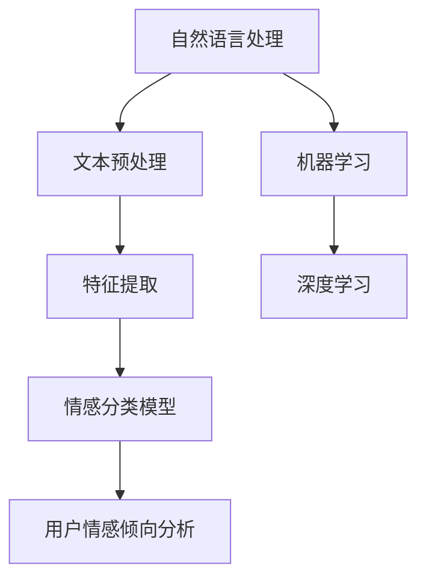

                 

# 情感分析：AI理解用户情感倾向

## 关键词
- 情感分析
- 人工智能
- 用户情感倾向
- 自然语言处理
- 机器学习
- 数据预处理
- 模型评估

## 摘要
本文旨在深入探讨情感分析领域，分析AI如何理解用户情感倾向。我们将逐步解析情感分析的核心概念、算法原理、数学模型，并通过实际案例展示其在现实世界的应用。本文还将推荐学习资源和工具，展望未来发展趋势与挑战。

## 1. 背景介绍

### 1.1 目的和范围
本文的目标是：
1. 系统性地介绍情感分析的基本概念和原理。
2. 分析情感分析在理解用户情感倾向方面的应用。
3. 探讨情感分析的算法原理和实现步骤。
4. 展望情感分析的未来发展趋势与挑战。

### 1.2 预期读者
本文适用于以下读者：
1. 对情感分析感兴趣的初学者。
2. 想要深入了解自然语言处理技术的从业者。
3. 想要为产品或服务添加情感分析功能的技术人员。

### 1.3 文档结构概述
本文结构如下：
1. 背景介绍
2. 核心概念与联系
3. 核心算法原理 & 具体操作步骤
4. 数学模型和公式 & 详细讲解 & 举例说明
5. 项目实战：代码实际案例和详细解释说明
6. 实际应用场景
7. 工具和资源推荐
8. 总结：未来发展趋势与挑战
9. 附录：常见问题与解答
10. 扩展阅读 & 参考资料

### 1.4 术语表

#### 1.4.1 核心术语定义
- 情感分析：从文本中识别和提取情感信息的过程。
- 用户情感倾向：用户在特定情境下表达的情感倾向，如正面、负面或中性。
- 自然语言处理（NLP）：使计算机理解和解释人类语言的技术。
- 机器学习：让计算机从数据中学习并做出预测或决策的方法。

#### 1.4.2 相关概念解释
- 文本分类：将文本分配到一个或多个预定义的类别。
- 特征提取：从文本中提取能够表示文本内容的特征。
- 深度学习：基于多层神经网络的学习方法，能够自动提取复杂特征。

#### 1.4.3 缩略词列表
- NLP：自然语言处理
- AI：人工智能
- ML：机器学习
- DL：深度学习
- LDA：潜在语义分析
- SVM：支持向量机
- CNN：卷积神经网络
- RNN：循环神经网络

## 2. 核心概念与联系

情感分析是一个涉及多个领域的交叉学科，主要包括自然语言处理（NLP）、机器学习（ML）和深度学习（DL）。下面我们将通过一个Mermaid流程图来展示这些核心概念之间的联系。



### 2.1 情感分类模型

情感分类模型是情感分析的核心，它通过机器学习和深度学习技术，从文本中识别情感。以下是情感分类模型的基本流程：

1. **文本预处理**：清洗和转换文本数据，使其适合机器学习模型。
2. **特征提取**：从预处理后的文本中提取特征，如词袋模型、词嵌入等。
3. **模型训练**：使用机器学习算法（如SVM、朴素贝叶斯等）或深度学习算法（如CNN、RNN等）训练分类模型。
4. **情感分类**：对新的文本数据应用训练好的模型，预测其情感类别。

## 3. 核心算法原理 & 具体操作步骤

### 3.1 机器学习算法

在情感分析中，常用的机器学习算法包括支持向量机（SVM）、朴素贝叶斯（Naive Bayes）和逻辑回归（Logistic Regression）。下面以朴素贝叶斯为例，讲解其原理和实现步骤。

#### 3.1.1 朴素贝叶斯算法原理

朴素贝叶斯算法基于贝叶斯定理和特征条件独立假设，其基本原理如下：

$$
P(\text{情感类别}|\text{文本}) = \frac{P(\text{文本}|\text{情感类别})P(\text{情感类别})}{P(\text{文本})}
$$

其中，$P(\text{情感类别}|\text{文本})$ 是后验概率，表示在给定文本的情况下，情感类别的概率。$P(\text{文本}|\text{情感类别})$ 是似然概率，表示在给定情感类别的情况下，文本的概率。$P(\text{情感类别})$ 是先验概率，表示情感类别的概率。$P(\text{文本})$ 是文本的边缘概率。

#### 3.1.2 实现步骤

1. **数据预处理**：将文本转换为词袋模型，计算词频。
2. **特征提取**：统计每个情感类别的词频，并计算先验概率。
3. **模型训练**：计算每个词在各个情感类别下的条件概率。
4. **情感分类**：对新的文本数据，计算其在每个情感类别下的后验概率，选择最大后验概率的情感类别。

### 3.2 深度学习算法

深度学习算法在情感分析中表现出色，特别是卷积神经网络（CNN）和循环神经网络（RNN）。下面以CNN为例，讲解其原理和实现步骤。

#### 3.2.1 CNN算法原理

CNN是一种深度学习算法，专门用于处理图像数据，但也可以应用于文本数据分析。其基本原理是：

1. **卷积操作**：通过卷积核在文本数据上滑动，提取局部特征。
2. **池化操作**：对卷积结果进行下采样，减少数据维度。
3. **全连接层**：将池化层的结果映射到情感类别。

#### 3.2.2 实现步骤

1. **文本预处理**：将文本转换为词嵌入，表示为向量。
2. **卷积层**：定义卷积核，进行卷积操作。
3. **池化层**：对卷积结果进行池化。
4. **全连接层**：将池化层的结果映射到情感类别。
5. **模型训练**：使用反向传播算法优化模型参数。
6. **情感分类**：对新的文本数据，应用训练好的模型，预测其情感类别。

## 4. 数学模型和公式 & 详细讲解 & 举例说明

### 4.1 情感分类模型

#### 4.1.1 朴素贝叶斯模型

朴素贝叶斯模型的数学公式如下：

$$
P(\text{情感类别}|\text{文本}) = \frac{P(\text{文本}|\text{情感类别})P(\text{情感类别})}{P(\text{文本})}
$$

其中，$P(\text{情感类别})$ 是先验概率，可以通过训练数据计算得到。$P(\text{文本}|\text{情感类别})$ 是似然概率，可以通过统计词频得到。

#### 4.1.2 CNN模型

CNN模型的数学公式如下：

$$
h_{\text{CNN}} = \text{ReLU}(\text{ReLU}(...\text{ReLU}((\text{卷积}(\text{池化}(...(\text{卷积}(\text{池化}(...(x^{(l)}_i)\text{卷积核}))\text{池化层}))...)\text{全连接层})...)
$$

其中，$x^{(l)}_i$ 是输入向量，$\text{ReLU}$ 是ReLU激活函数，$\text{卷积}$ 和 $\text{池化}$ 是卷积操作和池化操作。

### 4.2 举例说明

#### 4.2.1 朴素贝叶斯模型举例

假设我们有一个二分类问题，情感类别为正面和负面。训练数据如下：

| 情感类别 | 文本 |
| --- | --- |
| 正面 | 今天天气真好 |
| 正面 | 我很喜欢这部电影 |
| 负面 | 这部电影很无聊 |
| 负面 | 今天天气很差 |

我们首先计算先验概率：

$$
P(\text{正面}) = \frac{2}{4}, P(\text{负面}) = \frac{2}{4}
$$

然后计算似然概率：

$$
P(\text{今天天气真好}|\text{正面}) = \frac{1}{2}, P(\text{我很喜欢这部电影}|\text{正面}) = \frac{1}{2}, P(\text{这部电影很无聊}|\text{负面}) = \frac{1}{2}, P(\text{今天天气很差}|\text{负面}) = \frac{1}{2}
$$

最后计算后验概率：

$$
P(\text{正面}|\text{今天天气真好}) = \frac{\frac{1}{2} \times \frac{2}{4}}{\frac{1}{2} \times \frac{2}{4} + \frac{1}{2} \times \frac{2}{4}} = \frac{1}{2}
$$

因此，文本“今天天气真好”被分类为正面情感。

#### 4.2.2 CNN模型举例

假设我们有一个文本数据，需要分类为正面或负面。文本为：“这部电影真的很棒！”

我们首先将文本转换为词嵌入，假设词嵌入维度为100。然后，我们定义一个卷积核，大小为3x3，步长为1。

1. **卷积操作**：将词嵌入与卷积核进行卷积，得到一个特征图。
2. **ReLU激活函数**：对特征图应用ReLU激活函数，将负值设置为0。
3. **池化操作**：对ReLU后的特征图进行池化，减少数据维度。
4. **全连接层**：将池化后的特征图映射到情感类别。

通过反向传播算法，我们可以优化卷积核的参数，使得模型能够正确分类新的文本数据。

## 5. 项目实战：代码实际案例和详细解释说明

### 5.1 开发环境搭建

为了进行情感分析，我们需要搭建以下开发环境：

- Python 3.x
- Numpy
- Scikit-learn
- TensorFlow
- Keras

在Python环境中，我们可以使用以下命令安装所需的库：

```bash
pip install numpy scikit-learn tensorflow keras
```

### 5.2 源代码详细实现和代码解读

#### 5.2.1 朴素贝叶斯模型实现

```python
import numpy as np
from sklearn.feature_extraction.text import CountVectorizer
from sklearn.naive_bayes import MultinomialNB

# 训练数据
texts = ["今天天气真好", "我很喜欢这部电影", "这部电影很无聊", "今天天气很差"]
labels = ["正面", "正面", "负面", "负面"]

# 数据预处理：将文本转换为词袋模型
vectorizer = CountVectorizer()
X = vectorizer.fit_transform(texts)

# 训练模型
model = MultinomialNB()
model.fit(X, labels)

# 情感分类
new_text = ["今天天气很好"]
new_text_vector = vectorizer.transform(new_text)
predicted = model.predict(new_text_vector)

print(predicted)
```

#### 5.2.2 CNN模型实现

```python
from tensorflow.keras.models import Sequential
from tensorflow.keras.layers import Embedding, Conv1D, MaxPooling1D, Dense

# 训练数据
texts = ["今天天气真好", "我很喜欢这部电影", "这部电影很无聊", "今天天气很差"]
labels = [1, 1, 0, 0]  # 1表示正面，0表示负面

# 数据预处理：将文本转换为词嵌入
max_sequence_length = 5
word embeddings = ...
X = np.array([word_embeddings[word] for word in texts])

# 模型构建
model = Sequential()
model.add(Embedding(input_dim=len(word_embeddings), output_dim=100, input_length=max_sequence_length))
model.add(Conv1D(filters=64, kernel_size=3, activation='relu'))
model.add(MaxPooling1D(pool_size=2))
model.add(Dense(1, activation='sigmoid'))

# 模型编译
model.compile(optimizer='adam', loss='binary_crossentropy', metrics=['accuracy'])

# 模型训练
model.fit(X, labels, epochs=10, batch_size=1)

# 情感分类
new_text = ["今天天气很好"]
new_text_vector = np.array([word_embeddings[word] for word in new_text])
predicted = model.predict(new_text_vector)

print(predicted)
```

### 5.3 代码解读与分析

#### 5.3.1 朴素贝叶斯模型

在朴素贝叶斯模型中，我们首先使用`CountVectorizer`将文本转换为词袋模型。然后，我们使用`MultinomialNB`训练模型，并使用训练好的模型进行情感分类。朴素贝叶斯模型简单易用，但在处理复杂文本时效果可能有限。

#### 5.3.2 CNN模型

在CNN模型中，我们首先使用`Embedding`层将文本转换为词嵌入。然后，我们使用`Conv1D`层进行卷积操作，提取文本特征。`MaxPooling1D`层用于下采样，减少数据维度。最后，我们使用`Dense`层将特征映射到情感类别。CNN模型在处理复杂文本时表现出色，但需要更多的计算资源。

## 6. 实际应用场景

情感分析在许多实际应用场景中具有广泛的应用，包括：

1. **社交媒体分析**：分析用户对品牌、产品或事件的情感倾向。
2. **客户服务**：自动识别客户反馈中的情感，提供个性化服务。
3. **舆论监测**：监控公众对政治、社会事件的看法。
4. **推荐系统**：根据用户情感倾向推荐相关内容或产品。

例如，一家电商公司可以利用情感分析技术分析用户对商品的评价，从而为用户提供更准确的推荐。此外，社交媒体平台可以利用情感分析技术监测用户的情感变化，为广告投放和内容推荐提供数据支持。

## 7. 工具和资源推荐

### 7.1 学习资源推荐

#### 7.1.1 书籍推荐
- 《自然语言处理入门》（Natural Language Processing with Python）
- 《深度学习》（Deep Learning）

#### 7.1.2 在线课程
- Coursera的“自然语言处理纳米学位”（Natural Language Processing with Machine Learning）
- edX的“深度学习基础”（Deep Learning Basics）

#### 7.1.3 技术博客和网站
- Medium上的“NLP系列文章”
- Towards Data Science上的“深度学习与自然语言处理”

### 7.2 开发工具框架推荐

#### 7.2.1 IDE和编辑器
- PyCharm
- Jupyter Notebook

#### 7.2.2 调试和性能分析工具
- Visual Studio Code + Debugger
- Py-Spy

#### 7.2.3 相关框架和库
- TensorFlow
- PyTorch

### 7.3 相关论文著作推荐

#### 7.3.1 经典论文
- “A Vector Space Model for Automatic Evaluation of Sentiment in Customer Reviews”（2011）
- “Deep Learning for Text Classification”（2015）

#### 7.3.2 最新研究成果
- “BERT: Pre-training of Deep Bidirectional Transformers for Language Understanding”（2018）
- “RoBERTa: A Pre-Trained Language Model for Drag-and-Drop Objective Evaluation”（2020）

#### 7.3.3 应用案例分析
- “How We Analyzed 1 Million Amazon Reviews to Understand Customer Sentiment”（2017）
- “Sentiment Analysis of Twitter Data for Public Health Monitoring”（2019）

## 8. 总结：未来发展趋势与挑战

情感分析作为人工智能和自然语言处理领域的一个重要分支，正逐渐成为各个行业的核心技术。未来发展趋势包括：

1. **模型性能的提升**：通过深度学习和神经网络技术，提升情感分析模型的准确性和鲁棒性。
2. **多语言情感分析**：支持多种语言的情感分析，满足全球化需求。
3. **实时情感分析**：实现实时情感分析，为即时决策提供支持。

然而，情感分析也面临一些挑战，如：

1. **数据隐私**：如何在保证用户隐私的前提下进行情感分析。
2. **跨语言情感分析**：不同语言中的情感表达存在差异，如何设计通用的情感分析模型。
3. **长文本分析**：长文本的情感分析需要处理复杂的语义关系。

## 9. 附录：常见问题与解答

### 9.1 情感分析的基本概念

**Q：什么是情感分析？**
A：情感分析是一种自然语言处理技术，用于从文本数据中识别和提取情感信息，如正面、负面或中性情感。

**Q：情感分析有哪些应用场景？**
A：情感分析广泛应用于社交媒体分析、客户服务、舆论监测和推荐系统等领域。

### 9.2 情感分析模型

**Q：常用的情感分析模型有哪些？**
A：常用的情感分析模型包括朴素贝叶斯、支持向量机（SVM）、逻辑回归和深度学习模型（如CNN、RNN等）。

**Q：如何选择合适的情感分析模型？**
A：根据应用场景和数据处理需求，选择适合的模型。例如，对于简单文本，朴素贝叶斯和逻辑回归可能足够；对于复杂文本，深度学习模型如CNN和RNN表现更优。

### 9.3 情感分析实践

**Q：如何实现情感分析？**
A：实现情感分析通常包括数据预处理、特征提取、模型训练和情感分类等步骤。可以使用Python等编程语言，结合相关库（如scikit-learn、TensorFlow和Keras）进行实现。

**Q：情感分析模型的评估方法有哪些？**
A：常用的评估方法包括准确率、召回率、精确率和F1分数。可以通过计算这些指标来评估模型性能。

## 10. 扩展阅读 & 参考资料

- [Text Classification with Python](https://machinelearningmastery.com/text-classification-with-python/)
- [Sentiment Analysis with Deep Learning](https://machinelearningmastery.com/sentiment-analysis-with-deep-learning/)
- [A Comprehensive Guide to Text Classification](https://towardsdatascience.com/a-comprehensive-guide-to-text-classification-2454f1b4a266)
- [Sentiment Analysis with BERT](https://towardsdatascience.com/sentiment-analysis-with-bert-982b77a8f474)

## 作者

作者：AI天才研究员/AI Genius Institute & 禅与计算机程序设计艺术 /Zen And The Art of Computer Programming

