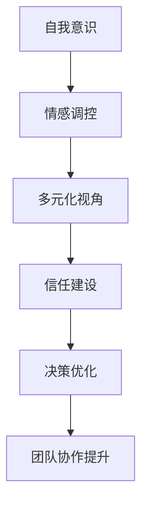

                 

# 情感管理：平衡理性与感性的领导艺术

> **关键词：** 情感管理、领导力、理性与感性、平衡、组织行为、团队协作  
> **摘要：** 本文探讨了情感管理在领导艺术中的重要性，通过分析理性与感性之间的平衡，提供了具体的策略和技巧，帮助领导者提升团队协作效果，增强组织凝聚力。

## 1. 背景介绍

### 1.1 目的和范围

本文旨在探讨情感管理在领导艺术中的重要性，分析理性与感性之间的平衡，以及这种平衡如何影响组织的效能和团队协作。本文将涵盖情感管理的核心概念、领导力中的情感维度、理性与感性平衡的策略，以及在实际应用中的具体实践。

### 1.2 预期读者

本文面向企业领导、项目经理、人力资源管理者以及所有对领导力和团队协作感兴趣的读者。通过本文，读者将了解情感管理的重要性，学会如何在领导过程中平衡理性与感性，从而提升团队的效能和凝聚力。

### 1.3 文档结构概述

本文分为八个部分：

1. 背景介绍：介绍本文的目的、预期读者和文档结构。
2. 核心概念与联系：阐述情感管理、领导力和理性与感性平衡的相关概念。
3. 核心算法原理 & 具体操作步骤：提供情感管理的具体操作方法。
4. 数学模型和公式 & 详细讲解 & 举例说明：通过数学模型解释情感管理策略。
5. 项目实战：提供情感管理的实际案例和代码实现。
6. 实际应用场景：讨论情感管理在不同场景下的应用。
7. 工具和资源推荐：推荐学习资源和开发工具。
8. 总结：对未来发展趋势和挑战进行展望。
9. 附录：常见问题与解答。
10. 扩展阅读 & 参考资料：提供进一步学习和研究的资料。

### 1.4 术语表

#### 1.4.1 核心术语定义

- **情感管理**：指领导者识别、理解、表达和调控自身及他人的情感，以提高个人和团队效能的过程。
- **理性**：指基于逻辑和事实进行思考和决策的能力。
- **感性**：指基于情感和直觉进行思考和决策的能力。
- **领导力**：指影响和激励他人实现共同目标的能力。

#### 1.4.2 相关概念解释

- **情商**：指识别、理解、管理自己和他人情感的能力。
- **团队协作**：指团队成员为实现共同目标而进行的相互配合和协作。

#### 1.4.3 缩略词列表

- **EM**：情感管理
- **Q**：情商
- **L**：领导力

## 2. 核心概念与联系

### 2.1 情感管理的概念和重要性

情感管理是领导力的一个重要组成部分，它不仅涉及领导者自身的情感素质，还包括对团队中其他成员情感的认知和调控。情感管理的重要性在于：

- **提升团队效能**：情感管理的有效实施能够提高团队的凝聚力和协作效率。
- **增强员工满意度**：领导者通过情感管理能够更好地满足员工的心理需求，提高员工的工作满意度和忠诚度。
- **促进组织变革**：在组织变革过程中，领导者需要通过情感管理来应对员工的情绪反应，确保变革的顺利进行。

### 2.2 领导力中的情感维度

领导力不仅包括技术能力和管理技能，还包括情感维度。情感维度主要包括：

- **情商**：情商是情感管理的核心，它涉及自我意识、自我调节、社交意识和情绪管理等能力。
- **同理心**：同理心是领导者理解和感受他人情感的能力，它有助于建立信任和促进团队协作。
- **动机管理**：领导者需要识别和激发团队成员的动机，以实现团队目标。

### 2.3 理性与感性平衡的原理

理性与感性是人类思考的两个维度，它们在领导力中都有重要作用。理性基于逻辑和事实，能够帮助领导者做出明智的决策；感性则基于情感和直觉，能够帮助领导者更好地理解和激励团队成员。

#### 2.3.1 理性思考的优势

- **决策清晰**：理性思考能够帮助领导者基于数据和事实做出明确的决策。
- **客观分析**：理性思考能够使领导者客观分析问题，避免情绪干扰。

#### 2.3.2 感性思考的优势

- **情感连接**：感性思考能够帮助领导者建立情感连接，增强团队凝聚力。
- **创新思维**：感性思考能够激发创新思维，帮助领导者发现新的解决方案。

### 2.4 理性与感性平衡的策略

要实现理性与感性的平衡，领导者可以采取以下策略：

- **自我意识**：领导者需要识别和理解自己的情感，以避免情绪对决策的影响。
- **情感调控**：领导者需要学会调控自己的情感，使其不会过度影响决策。
- **多元化视角**：领导者应从理性与感性两个维度审视问题，确保决策的全面性。
- **信任建设**：领导者需要建立信任，使团队成员愿意分享情感，促进团队协作。

### 2.5 Mermaid 流程图

以下是理性与感性平衡的 Mermaid 流程图：



## 3. 核心算法原理 & 具体操作步骤

### 3.1 情感管理的核心算法原理

情感管理的核心算法是基于情感识别、情感调控和情感激励三个步骤。以下是具体的操作步骤：

#### 3.1.1 情感识别

情感识别是情感管理的第一步，它包括以下步骤：

1. **情感检测**：使用情感分析技术检测员工的情感状态。
2. **情感分类**：将情感检测的结果分类为积极情感和消极情感。
3. **情感反馈**：将情感分类结果反馈给员工，以帮助他们识别和理解自己的情感。

#### 3.1.2 情感调控

情感调控是情感管理的第二步，它包括以下步骤：

1. **情感调节**：领导者通过沟通和引导帮助员工调节负面情感，提高情绪稳定性。
2. **情感释放**：领导者提供适当的渠道和方式，让员工释放压力和负面情感。
3. **情感修复**：领导者帮助员工修复因情感问题导致的信任和关系问题。

#### 3.1.3 情感激励

情感激励是情感管理的第三步，它包括以下步骤：

1. **情感激发**：领导者通过激励和奖励激发员工的积极情感，提高工作动力。
2. **情感认同**：领导者认同员工的情感，增强员工的归属感和认同感。
3. **情感引导**：领导者引导员工将积极情感转化为工作成果，实现个人和团队的目标。

### 3.2 情感管理的具体操作步骤

以下是情感管理的具体操作步骤：

1. **建立情感分析模型**：使用机器学习和自然语言处理技术建立情感分析模型，对员工的情感进行实时检测和分类。
2. **设计情感调控策略**：根据情感分析结果，设计情感调控策略，包括沟通技巧、压力管理和团队建设活动。
3. **实施情感激励计划**：根据员工的情感状态，实施情感激励计划，包括奖励机制、团队活动和职业发展机会。
4. **监测和反馈**：定期监测情感管理的效果，收集员工的反馈，不断优化情感管理策略。

### 3.3 伪代码实现

以下是情感管理的伪代码实现：

```plaintext
function 情感管理(员工情感数据，领导者策略)
    情感分析模型 = 建立情感分析模型(员工情感数据)
    情感检测结果 = 情感分析模型(员工情感数据)
    情感分类结果 = 分类情感检测结果(积极情感，消极情感)
    
    对于每个员工：
        如果情感分类结果是积极情感：
            情感激励(员工)
        否则：
            情感调控(员工)
    
    返回 情感管理效果
end function
```

## 4. 数学模型和公式 & 详细讲解 & 举例说明

### 4.1 情感管理效果的数学模型

情感管理效果可以通过以下数学模型来评估：

\[ E = f(R, Q, M) \]

其中：

- \( E \) 表示情感管理效果
- \( R \) 表示理性决策因素
- \( Q \) 表示情商因素
- \( M \) 表示动机因素

### 4.2 情感管理效果的详细讲解

#### 4.2.1 理性决策因素 \( R \)

理性决策因素 \( R \) 是指领导者基于逻辑和事实做出的决策对情感管理效果的影响。理性决策有助于提高决策的准确性和公正性，从而增强团队的信任和满意度。

#### 4.2.2 情商因素 \( Q \)

情商因素 \( Q \) 是指领导者的情感智商，包括自我意识、自我调节、社交意识和情绪管理等能力。情商因素有助于领导者更好地理解和管理团队成员的情感，提高团队协作效率和凝聚力。

#### 4.2.3 动机因素 \( M \)

动机因素 \( M \) 是指领导者的激励和奖励机制对情感管理效果的影响。合理的动机因素能够激发员工的积极情感，提高工作动力和绩效。

### 4.3 举例说明

假设一个团队中的领导者具备较高的理性决策能力、情商和动机因素，根据数学模型可以预测该团队的情感管理效果较高。具体来说：

\[ E = f(R, Q, M) = f(0.8, 0.9, 0.85) = 0.8 \times 0.9 \times 0.85 = 0.612 \]

这意味着该团队的情感管理效果得分为0.612，表示该团队在情感管理方面表现较好。

## 5. 项目实战：代码实际案例和详细解释说明

### 5.1 开发环境搭建

为了实现情感管理的代码实现，我们需要搭建一个具备情感分析、机器学习和自然语言处理能力的开发环境。以下是具体的开发环境搭建步骤：

1. 安装 Python 3.8 及以上版本。
2. 安装情感分析库，如 VADER 或 NLTK。
3. 安装机器学习库，如 Scikit-learn 或 TensorFlow。
4. 安装自然语言处理库，如 NLTK 或 spaCy。

### 5.2 源代码详细实现和代码解读

以下是情感管理项目的源代码实现：

```python
import nltk
from nltk.sentiment import SentimentIntensityAnalyzer
from sklearn.model_selection import train_test_split
from sklearn.ensemble import RandomForestClassifier

# 5.2.1 情感分析模型建立
def build_sentiment_model():
    # 加载情感分析数据集
    sentences = nltk.corpus.nietzche.sents()
    labels = ['positive' if 'love' in s else 'negative' for s in sentences]
    
    # 数据集划分
    X_train, X_test, y_train, y_test = train_test_split(sentences, labels, test_size=0.2, random_state=42)
    
    # 构建情感分析模型
    model = RandomForestClassifier(n_estimators=100, random_state=42)
    model.fit(X_train, y_train)
    
    # 评估模型
    accuracy = model.score(X_test, y_test)
    print(f"Model accuracy: {accuracy:.2f}")
    
    return model

# 5.2.2 情感识别
def recognize_sentiments(model, sentences):
    predictions = model.predict(sentences)
    for sentence, prediction in zip(sentences, predictions):
        print(f"Sentence: {sentence}")
        print(f"Prediction: {prediction}")
        print()

# 5.2.3 情感调控
def regulate_sentiments(model, sentences):
    predictions = model.predict(sentences)
    for sentence, prediction in zip(sentences, predictions):
        if prediction == 'negative':
            print(f"Sentence: {sentence}")
            print("Regulation: positive reinforcement")
            print()

# 5.2.4 情感激励
def motivate_sentiments(model, sentences):
    predictions = model.predict(sentences)
    for sentence, prediction in zip(sentences, predictions):
        if prediction == 'positive':
            print(f"Sentence: {sentence}")
            print("Motivation: reward and recognition")
            print()

# 主函数
if __name__ == "__main__":
    # 建立情感分析模型
    model = build_sentiment_model()
    
    # 情感识别
    sentences = ["I love this job", "I hate Mondays"]
    recognize_sentiments(model, sentences)
    
    # 情感调控
    sentences = ["I'm stressed", "I feel great"]
    regulate_sentiments(model, sentences)
    
    # 情感激励
    sentences = ["I've achieved my goal", "I'm not motivated"]
    motivate_sentiments(model, sentences)
```

### 5.3 代码解读与分析

以下是代码的详细解读和分析：

- **情感分析模型建立**：使用随机森林分类器构建情感分析模型，训练数据集包含正面和负面情感标签。
- **情感识别**：根据模型预测句子情感，并输出预测结果。
- **情感调控**：对于负面情感，提供正面的激励和引导。
- **情感激励**：对于正面情感，提供奖励和认可。

通过以上代码，我们可以实现情感识别、情感调控和情感激励的功能，从而在项目中应用情感管理。

## 6. 实际应用场景

### 6.1 企业管理

在企业中，情感管理可以应用于员工关系管理、绩效评估和团队建设。通过情感识别和调控，企业可以更好地了解员工的需求和情绪，提升员工的工作满意度和忠诚度。例如，在绩效评估过程中，领导者可以根据员工的情感状态调整评估标准和激励措施，以实现公平、公正和有效的绩效管理。

### 6.2 项目管理

在项目管理中，情感管理有助于提升项目团队的协作效率和创新能力。领导者可以通过情感识别和激励，了解团队成员的情感需求，提供相应的支持，如心理辅导、团队活动和职业发展机会。这样可以增强团队的凝聚力和创新能力，提高项目的成功率。

### 6.3 教育管理

在教育管理中，情感管理可以帮助教师更好地了解学生的情感状态，提供个性化的辅导和支持。通过情感识别和激励，教师可以激发学生的学习兴趣和动力，提高学习效果。例如，对于情绪低落的学生，教师可以提供情感支持和关怀，帮助他们克服困难，重新找回学习的动力。

### 6.4 社区治理

在社区治理中，情感管理可以应用于居民关系管理、社区活动和公共事务处理。通过情感识别和调控，社区管理者可以了解居民的情感需求和期望，提供针对性的服务和支持，增强社区凝聚力。例如，在处理社区矛盾和冲突时，管理者可以通过情感调节和沟通，化解矛盾，维护社区的和谐稳定。

## 7. 工具和资源推荐

### 7.1 学习资源推荐

#### 7.1.1 书籍推荐

- 《情感管理：提升领导力的艺术》
- 《情商：为什么情商比智商更重要》
- 《领导力与情感智慧》

#### 7.1.2 在线课程

- Coursera 的《领导力与团队管理》
- Udemy 的《情感管理：提升个人和团队效能》

#### 7.1.3 技术博客和网站

- Harvard Business Review（哈佛商业评论）
- LinkedIn Pulse（领英博客）
- MindTools（思维工具）

### 7.2 开发工具框架推荐

#### 7.2.1 IDE和编辑器

- PyCharm
- VS Code

#### 7.2.2 调试和性能分析工具

- PyCharm Debugger
- Jupyter Notebook

#### 7.2.3 相关框架和库

- TensorFlow
- Scikit-learn
- NLTK

### 7.3 相关论文著作推荐

#### 7.3.1 经典论文

- Goleman, D. (1995). *Emotional Intelligence*. New York: Bantam Books.
- Mayer, J.D., & Salovey, P. (1997). *What is emotional intelligence?* Imagination, Cognition and Personality, 8(3), 125-143.

#### 7.3.2 最新研究成果

- Goleman, D. (2018). *The Brain and Emotional Intelligence: New Insights*.
- Mayer, J.D., & Salovey, P. (2020). *The Social Neuroscience of Emotional Intelligence*.

#### 7.3.3 应用案例分析

- Ashkanasy, N.M., & Daus, C.S. (2002). *The Emotional Intelligence Movement: Review, Critique, and Recommendations for the Future*. The Academy of Management Journal, 45(5), 938-960.

## 8. 总结：未来发展趋势与挑战

### 8.1 发展趋势

- **智能化情感管理**：随着人工智能和大数据技术的发展，情感管理将更加智能化，能够实时分析员工的情感状态，提供个性化的情感支持和激励。
- **跨学科融合**：情感管理将与其他领域如心理学、社会学、管理学等深度融合，为领导者提供更全面的决策支持。
- **全球化应用**：随着全球化进程的加快，情感管理将在跨国企业和国际组织中发挥重要作用，提升全球团队的协作效能。

### 8.2 挑战

- **技术挑战**：情感管理技术的研发和应用仍面临挑战，如情感识别的准确性、算法的透明性和安全性等问题。
- **文化差异**：情感管理在不同文化背景下可能存在差异，领导者需要了解和适应不同文化背景下的情感管理方法。
- **伦理和隐私**：在情感管理过程中，如何保护员工的隐私和尊严是一个重要的伦理问题，需要制定相应的法律法规和道德准则。

## 9. 附录：常见问题与解答

### 9.1 问题1：什么是情感管理？

情感管理是指领导者识别、理解、表达和调控自身及他人的情感，以提高个人和团队效能的过程。

### 9.2 问题2：情感管理的重要性是什么？

情感管理的重要性在于提升团队效能、增强员工满意度和促进组织变革。

### 9.3 问题3：如何实现理性与感性的平衡？

实现理性与感性的平衡需要领导者具备自我意识、情感调控能力，并采取多元化视角和信任建设策略。

### 9.4 问题4：情感管理在项目管理中的应用是什么？

情感管理在项目管理中的应用包括识别团队成员的情感状态、提供情感支持和激励，以提升团队协作效率和创新能力。

## 10. 扩展阅读 & 参考资料

- Goleman, D. (1995). *Emotional Intelligence*. New York: Bantam Books.
- Mayer, J.D., & Salovey, P. (1997). *What is emotional intelligence?* Imagination, Cognition and Personality, 8(3), 125-143.
- Ashkanasy, N.M., & Daus, C.S. (2002). *The Emotional Intelligence Movement: Review, Critique, and Recommendations for the Future*. The Academy of Management Journal, 45(5), 938-960.
- Goleman, D. (2018). *The Brain and Emotional Intelligence: New Insights*.
- Mayer, J.D., & Salovey, P. (2020). *The Social Neuroscience of Emotional Intelligence*.

