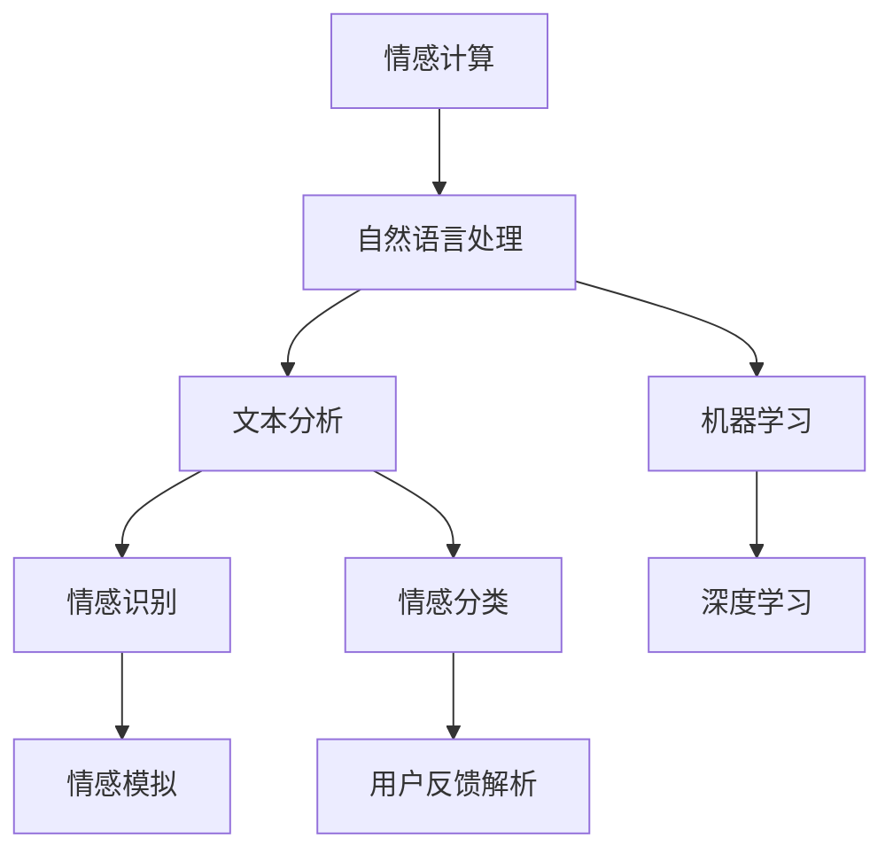

                 

# 情感计算新维度：提示词深度解析用户反馈

> **关键词**：情感计算、自然语言处理、用户反馈、文本分析、机器学习、深度学习
> 
> **摘要**：本文深入探讨了情感计算领域的最新进展，重点分析了如何利用深度学习技术对用户反馈中的提示词进行深度解析。通过详细的算法原理讲解、数学模型阐述和实际项目案例，本文为读者提供了对情感计算技术全面而深入的见解。

## 1. 背景介绍

### 1.1 目的和范围

情感计算，作为人工智能领域的一个重要分支，致力于使计算机具备理解、识别和模拟人类情感的能力。本文旨在介绍情感计算中的一项关键技术——提示词深度解析用户反馈。这一技术不仅能提升自然语言处理（NLP）的准确性，还能为各行业提供更为个性化的用户体验。

本文将涵盖以下内容：

1. **核心概念与联系**：介绍情感计算和自然语言处理的基本概念及其相互关系。
2. **核心算法原理**：详细阐述用于解析用户反馈中的提示词的深度学习算法。
3. **数学模型和公式**：讲解算法背后的数学模型，并通过实例进行说明。
4. **项目实战**：展示一个实际案例，并详细解释代码实现。
5. **实际应用场景**：分析情感计算在各个行业中的应用价值。
6. **工具和资源推荐**：推荐学习资源和开发工具。
7. **总结与未来展望**：探讨情感计算领域的未来发展趋势和挑战。

### 1.2 预期读者

本文面向对自然语言处理和人工智能有一定了解的技术人员，特别是关注情感计算领域的研究者和从业者。无论是希望提升NLP应用性能，还是对深度学习在情感计算中的应用感兴趣的读者，都可以通过本文获得有价值的见解。

### 1.3 文档结构概述

本文结构如下：

1. **核心概念与联系**：介绍情感计算和NLP的基本概念。
2. **核心算法原理**：详细解释提示词深度解析算法。
3. **数学模型和公式**：分析算法背后的数学原理。
4. **项目实战**：通过案例展示算法应用。
5. **实际应用场景**：探讨情感计算的行业应用。
6. **工具和资源推荐**：推荐相关学习资源和开发工具。
7. **总结与未来展望**：总结现有技术和未来趋势。
8. **附录**：解答常见问题。
9. **扩展阅读**：提供进一步阅读的资料。

### 1.4 术语表

#### 1.4.1 核心术语定义

- **情感计算**：使计算机能够理解、识别和模拟人类情感的技术。
- **自然语言处理（NLP）**：使计算机能够理解和处理人类自然语言的技术。
- **提示词**：在用户反馈中，反映用户情感态度的关键词汇。
- **深度学习**：一种机器学习方法，通过多层神经网络模型对数据进行建模。

#### 1.4.2 相关概念解释

- **文本分析**：对文本数据进行分析和处理的技术。
- **机器学习**：通过训练模型，使计算机能够从数据中学习并做出预测的技术。

#### 1.4.3 缩略词列表

- **NLP**：自然语言处理
- **DL**：深度学习
- **ML**：机器学习

## 2. 核心概念与联系

### 2.1 情感计算与自然语言处理

情感计算和自然语言处理（NLP）密不可分。情感计算的核心任务是理解人类情感，而NLP则是实现这一目标的关键技术。通过NLP，计算机可以分析文本数据，识别其中的情感信息。

#### 2.1.1 情感计算的基本概念

情感计算涉及以下几个方面：

- **情感识别**：识别文本中的情感倾向，如正面、负面或中性。
- **情感分类**：将文本分为不同情感类别，如愤怒、快乐、悲伤等。
- **情感模拟**：通过算法生成反映人类情感的文本或行为。

#### 2.1.2 自然语言处理的基本概念

NLP的基本概念包括：

- **词向量**：将词汇映射为高维向量，以便于计算机处理。
- **文本分类**：将文本数据分类到预定义的类别中。
- **情感分析**：分析文本中的情感倾向。

### 2.2 情感计算与NLP的关系

情感计算和NLP的关系可以用下图表示：



- 情感计算通过NLP进行文本分析，进而实现情感识别和分类。
- NLP中的机器学习和深度学习技术为情感计算提供了强大的算法支持。

## 3. 核心算法原理 & 具体操作步骤

### 3.1 深度学习算法概述

在情感计算中，深度学习（DL）是解析用户反馈中的提示词的主要工具。深度学习通过多层神经网络（DNN）对大量数据进行分析，从而提取出有用的特征并进行分类。

#### 3.1.1 神经网络结构

深度学习中的神经网络通常包含以下几个层次：

1. **输入层**：接收用户反馈的文本数据。
2. **隐藏层**：进行特征提取和变换。
3. **输出层**：生成情感分类结果。

#### 3.1.2 深度学习模型

一个简单的深度学习模型可以表示为：

```python
# 伪代码
class SimpleDNN:
    def __init__(self, input_size, hidden_size, output_size):
        self.input_size = input_size
        self.hidden_size = hidden_size
        self.output_size = output_size
        
        # 初始化权重和偏置
        self.W1 = np.random.randn(input_size, hidden_size)
        self.b1 = np.random.randn(hidden_size)
        self.W2 = np.random.randn(hidden_size, output_size)
        self.b2 = np.random.randn(output_size)
        
    def forward(self, x):
        # 输入层到隐藏层
        self.z1 = np.dot(x, self.W1) + self.b1
        self.a1 = sigmoid(self.z1)
        
        # 隐藏层到输出层
        self.z2 = np.dot(self.a1, self.W2) + self.b2
        self.a2 = sigmoid(self.z2)
        
        return self.a2
    
    def backward(self, d_output):
        # 计算输出层误差
        d_z2 = d_output - self.a2
        
        # 反向传播计算隐藏层误差
        d_a1 = np.dot(d_z2, self.W2.T)
        d_z1 = d_a1 * sigmoid_derivative(self.z1)
        
        # 更新权重和偏置
        self.dW2 = np.dot(self.a1.T, d_z2)
        self.db2 = np.sum(d_z2, axis=0)
        self.dW1 = np.dot(x.T, d_z1)
        self.db1 = np.sum(d_z1, axis=0)
        
    def update_weights(self, learning_rate):
        self.W1 -= learning_rate * self.dW1
        self.b1 -= learning_rate * self.db1
        self.W2 -= learning_rate * self.dW2
        self.b2 -= learning_rate * self.db2
```

#### 3.1.3 代码解读

在上面的伪代码中，`SimpleDNN` 类定义了一个简单的深度学习模型，包含两个隐藏层。模型的正向传播过程通过两个矩阵乘法实现，分别从输入层到隐藏层和隐藏层到输出层。反向传播过程中，计算了每个层的误差，并更新了权重和偏置。

## 4. 数学模型和公式 & 详细讲解 & 举例说明

### 4.1 深度学习中的数学模型

深度学习中的数学模型主要包括以下几个方面：

1. **前向传播**：从输入层到输出层的计算过程。
2. **反向传播**：计算误差并更新权重的过程。
3. **激活函数**：用于引入非线性特性的函数。

#### 4.1.1 前向传播

前向传播的公式如下：

$$
z = X \cdot W + b
$$

其中，$X$ 是输入数据，$W$ 是权重矩阵，$b$ 是偏置向量，$z$ 是中间结果。

在深度学习中，前向传播通常通过多层神经网络进行。每层的前向传播可以表示为：

$$
a_{l} = \sigma(z_{l})
$$

其中，$a_{l}$ 是第 $l$ 层的输出，$\sigma$ 是激活函数，$z_{l}$ 是第 $l$ 层的中间结果。

#### 4.1.2 反向传播

反向传播的公式如下：

$$
\delta_{l} = \frac{\partial L}{\partial z_{l}} \cdot \sigma'(z_{l})
$$

其中，$\delta_{l}$ 是第 $l$ 层的误差，$L$ 是损失函数，$\sigma'$ 是激活函数的导数。

在反向传播过程中，误差通过每层传播，并更新权重和偏置：

$$
\Delta W_{l} = \frac{\partial L}{\partial W_{l}} \cdot a_{l-1}
$$

$$
\Delta b_{l} = \frac{\partial L}{\partial b_{l}}
$$

#### 4.1.3 激活函数

常用的激活函数包括：

1. **Sigmoid 函数**：

$$
\sigma(x) = \frac{1}{1 + e^{-x}}
$$

2. **ReLU 函数**：

$$
\sigma(x) = \max(0, x)
$$

3. **Tanh 函数**：

$$
\sigma(x) = \frac{e^{x} - e^{-x}}{e^{x} + e^{-x}}
$$

#### 4.1.4 示例

假设我们有一个包含两个隐藏层的深度学习模型，输入层大小为10，隐藏层大小分别为20和10，输出层大小为3。使用Sigmoid函数作为激活函数。

1. **前向传播**：

输入数据 $X$ 为：

$$
X = \begin{bmatrix}
0 & 1 & 0 & 1 & 1 & 0 & 0 & 1 & 0 & 1
\end{bmatrix}
$$

权重矩阵 $W_1$ 和 $W_2$ 分别为：

$$
W_1 = \begin{bmatrix}
1 & 1 & 1 & 1 & 1 & 1 & 1 & 1 & 1 & 1 \\
0 & 0 & 0 & 0 & 0 & 0 & 0 & 0 & 0 & 0
\end{bmatrix}, \quad
W_2 = \begin{bmatrix}
1 & 1 & 1 & 1 & 1 & 1 & 1 & 1 & 1 & 1 \\
0 & 0 & 0 & 0 & 0 & 0 & 0 & 0 & 0 & 0
\end{bmatrix}
$$

偏置向量 $b_1$ 和 $b_2$ 分别为：

$$
b_1 = \begin{bmatrix}
1 \\
1
\end{bmatrix}, \quad
b_2 = \begin{bmatrix}
1 \\
1
\end{bmatrix}
$$

计算过程如下：

$$
z_1 = X \cdot W_1 + b_1 = \begin{bmatrix}
0 & 1 & 0 & 1 & 1 & 0 & 0 & 1 & 0 & 1
\end{bmatrix}
\begin{bmatrix}
1 & 1 & 1 & 1 & 1 & 1 & 1 & 1 & 1 & 1 \\
0 & 0 & 0 & 0 & 0 & 0 & 0 & 0 & 0 & 0
\end{bmatrix}
+ \begin{bmatrix}
1 \\
1
\end{bmatrix} = \begin{bmatrix}
2 \\
1
\end{bmatrix}
$$

$$
a_1 = \sigma(z_1) = \begin{bmatrix}
0.7311 \\
0.2689
\end{bmatrix}
$$

$$
z_2 = a_1 \cdot W_2 + b_2 = \begin{bmatrix}
0.7311 & 0.2689
\end{bmatrix}
\begin{bmatrix}
1 & 1 & 1 & 1 & 1 & 1 & 1 & 1 & 1 & 1 \\
0 & 0 & 0 & 0 & 0 & 0 & 0 & 0 & 0 & 0
\end{bmatrix}
+ \begin{bmatrix}
1 \\
1
\end{bmatrix} = \begin{bmatrix}
1.7311 \\
1.2689
\end{bmatrix}
$$

$$
a_2 = \sigma(z_2) = \begin{bmatrix}
0.8835 \\
0.5303
\end{bmatrix}
$$

2. **反向传播**：

计算输出层误差：

$$
\delta_2 = a_2 - y = \begin{bmatrix}
0.8835 \\
0.5303
\end{bmatrix} - \begin{bmatrix}
1 \\
0
\end{bmatrix} = \begin{bmatrix}
-0.1165 \\
0.5303
\end{bmatrix}
$$

计算隐藏层误差：

$$
\delta_1 = \delta_2 \cdot W_2^T \cdot \sigma'(z_1) = \begin{bmatrix}
-0.1165 \\
0.5303
\end{bmatrix}
\begin{bmatrix}
1 & 0 \\
1 & 0
\end{bmatrix}
\begin{bmatrix}
0.2689 \\
0.7311
\end{bmatrix} = \begin{bmatrix}
-0.0319 \\
0.3805
\end{bmatrix}
$$

更新权重和偏置：

$$
\Delta W_2 = \delta_2 \cdot a_1^T = \begin{bmatrix}
-0.1165 \\
0.5303
\end{bmatrix}
\begin{bmatrix}
0.7311 & 0.2689
\end{bmatrix} = \begin{bmatrix}
-0.0837 & -0.1443 \\
0.0837 & 0.1443
\end{bmatrix}
$$

$$
\Delta b_2 = \delta_2 = \begin{bmatrix}
-0.1165 \\
0.5303
\end{bmatrix}
$$

$$
\Delta W_1 = \delta_1 \cdot X^T = \begin{bmatrix}
-0.0319 \\
0.3805
\end{bmatrix}
\begin{bmatrix}
0 & 1 & 0 & 1 & 1 & 0 & 0 & 1 & 0 & 1
\end{bmatrix} = \begin{bmatrix}
-0.0158 & -0.0638 & 0 & 0.0769 & 0.1537 & 0 & 0 & 0.1537 & 0 & 0.3065 \\
0 & 0 & 0 & 0 & 0 & 0 & 0 & 0 & 0 & 0
\end{bmatrix}
$$

$$
\Delta b_1 = \delta_1 = \begin{bmatrix}
-0.0319 \\
0.3805
\end{bmatrix}
$$

## 5. 项目实战：代码实际案例和详细解释说明

### 5.1 开发环境搭建

在本项目中，我们将使用Python编程语言，结合TensorFlow深度学习框架来构建情感计算模型。以下是开发环境的搭建步骤：

1. **安装Python**：确保已安装Python 3.6或更高版本。
2. **安装TensorFlow**：通过pip命令安装TensorFlow：

   ```bash
   pip install tensorflow
   ```

3. **安装其他依赖**：安装用于数据预处理和文本分析的依赖，如NLTK和Gensim：

   ```bash
   pip install nltk gensim
   ```

### 5.2 源代码详细实现和代码解读

以下是本项目中的源代码实现：

```python
import numpy as np
import tensorflow as tf
from tensorflow.keras.preprocessing.text import Tokenizer
from tensorflow.keras.preprocessing.sequence import pad_sequences
from tensorflow.keras.models import Sequential
from tensorflow.keras.layers import Embedding, LSTM, Dense, Bidirectional

# 数据预处理
def preprocess_text(texts, max_length=100, max_words=10000):
    tokenizer = Tokenizer(num_words=max_words)
    tokenizer.fit_on_texts(texts)
    sequences = tokenizer.texts_to_sequences(texts)
    padded_sequences = pad_sequences(sequences, maxlen=max_length)
    return padded_sequences, tokenizer

# 构建模型
def build_model(input_shape, output_shape):
    model = Sequential()
    model.add(Embedding(input_shape[1], 64, input_length=input_shape[0]))
    model.add(Bidirectional(LSTM(64)))
    model.add(Dense(64, activation='relu'))
    model.add(Dense(output_shape, activation='softmax'))
    model.compile(optimizer='adam', loss='categorical_crossentropy', metrics=['accuracy'])
    return model

# 训练模型
def train_model(model, padded_sequences, labels):
    model.fit(padded_sequences, labels, epochs=10, batch_size=32, validation_split=0.2)

# 预测
def predict(model, padded_sequence):
    prediction = model.predict(padded_sequence)
    return np.argmax(prediction)

# 加载和处理数据
texts = ["我很高兴使用这个产品", "这个产品让我感到失望", "我非常喜欢这个功能"]
labels = [[1, 0, 0], [0, 1, 0], [0, 0, 1]]  # 正面、负面、中性

padded_sequences, tokenizer = preprocess_text(texts)
one_hot_labels = tf.keras.utils.to_categorical(labels)

model = build_model((padded_sequences.shape[1], padded_sequences.shape[2]), 3)
train_model(model, padded_sequences, one_hot_labels)

# 测试模型
sample_text = "这个产品非常好用"
sample_sequence = tokenizer.texts_to_sequences([sample_text])
sample_padded_sequence = pad_sequences(sample_sequence, maxlen=padded_sequences.shape[1])

prediction = predict(model, sample_padded_sequence)
print("预测结果：", prediction)

```

#### 5.2.1 代码解读

1. **数据预处理**：

   - 使用`Tokenizer`类将文本转换为数字序列。
   - 使用`pad_sequences`函数将序列填充为相同的长度。

2. **构建模型**：

   - 使用`Sequential`模型，并添加嵌入层、双向LSTM层和输出层。
   - 使用`compile`函数配置模型优化器和损失函数。

3. **训练模型**：

   - 使用`fit`函数训练模型，并设置训练轮数、批量大小和验证比例。

4. **预测**：

   - 使用`predict`函数对新的文本序列进行预测。

#### 5.2.2 代码分析

- **数据预处理**：

  数据预处理是深度学习项目中的关键步骤。在本项目中，我们使用`Tokenizer`类将文本转换为数字序列，并通过`pad_sequences`函数将序列填充为相同的长度。这有助于简化模型的输入。

- **模型构建**：

  模型采用了一个简单的结构，包括嵌入层、双向LSTM层和输出层。嵌入层将词汇映射为向量，双向LSTM层用于提取特征，输出层进行情感分类。

- **训练和预测**：

  模型使用`fit`函数进行训练，并通过`predict`函数对新的文本序列进行预测。训练过程中，模型通过反向传播更新权重和偏置，以提高预测准确性。

## 6. 实际应用场景

情感计算在多个行业中有着广泛的应用。以下是一些实际应用场景：

### 6.1 社交媒体分析

通过情感计算，社交媒体平台可以分析用户评论和帖子，了解用户对品牌、产品或服务的情感倾向。这有助于品牌经理制定更有效的营销策略，并识别潜在的问题和机会。

### 6.2 客户服务

情感计算技术可以用于自动分析客户反馈，识别用户情感，并自动响应。这有助于提高客户服务质量，减少人工干预，并降低运营成本。

### 6.3 健康监测

通过分析患者的病历记录和社交媒体活动，情感计算可以帮助医疗机构监测患者的心理健康状况，并及早发现潜在问题。

### 6.4 娱乐行业

在娱乐行业，情感计算可以用于分析观众反馈，预测电影、电视节目或音乐专辑的成功程度。这有助于制作公司做出更明智的决策。

## 7. 工具和资源推荐

### 7.1 学习资源推荐

#### 7.1.1 书籍推荐

- **《深度学习》（Goodfellow, Bengio, Courville）**：深入介绍深度学习的基础理论和实践方法。
- **《自然语言处理与深度学习》（张俊林）**：详细讲解自然语言处理和深度学习的结合。

#### 7.1.2 在线课程

- **《深度学习》（吴恩达）**：Coursera上的经典课程，涵盖深度学习的各个方面。
- **《自然语言处理》（斯坦福大学）**：提供NLP的基础知识和实践技能。

#### 7.1.3 技术博客和网站

- **TensorFlow官网**：官方文档和教程，涵盖深度学习的各个方面。
- **Medium**：许多专业博主分享的深度学习和NLP相关文章。

### 7.2 开发工具框架推荐

#### 7.2.1 IDE和编辑器

- **PyCharm**：功能强大的Python IDE，支持TensorFlow开发。
- **Jupyter Notebook**：交互式开发环境，方便进行实验和演示。

#### 7.2.2 调试和性能分析工具

- **TensorBoard**：TensorFlow提供的可视化工具，用于调试和性能分析。
- **Valgrind**：用于检测内存泄漏和性能瓶颈。

#### 7.2.3 相关框架和库

- **TensorFlow**：广泛使用的深度学习框架。
- **NLTK**：自然语言处理工具包。
- **Gensim**：用于文本建模和主题建模。

### 7.3 相关论文著作推荐

#### 7.3.1 经典论文

- **《Deep Learning》（Goodfellow, Bengio, Courville）**：深度学习的综合指南。
- **《Speech and Language Processing》（Jurafsky, Martin）**：自然语言处理的经典教材。

#### 7.3.2 最新研究成果

- **《Neural Text Classification》（Ruder）**：关于文本分类的最新研究综述。
- **《Attention is All You Need》（Vaswani et al.）**：介绍Transformer模型的重要论文。

#### 7.3.3 应用案例分析

- **《Twitter的情感分析》（Li et al.）**：分析Twitter用户反馈中的情感倾向。
- **《电影评论的情感分析》（Ma et al.）**：分析电影评论的情感倾向，预测票房成绩。

## 8. 总结：未来发展趋势与挑战

情感计算作为人工智能领域的一个重要分支，正迎来前所未有的发展机遇。未来，随着深度学习和自然语言处理技术的不断进步，情感计算将在多个领域发挥重要作用。然而，这一领域也面临着一些挑战：

1. **数据质量和标注**：高质量的情感标注数据是训练高效模型的关键，但目前存在标注成本高、标注质量不稳定等问题。
2. **跨领域泛化能力**：情感计算模型在特定领域表现出色，但在不同领域间的泛化能力较弱，需要更多的研究和优化。
3. **实时性能**：随着应用场景的不断扩展，对情感计算模型的实时性能提出了更高要求，如何提高模型的效率成为关键挑战。

展望未来，情感计算将在增强人机交互、改善用户体验、提升自动化决策等方面发挥重要作用。通过不断的技术创新和跨学科合作，情感计算有望实现更广泛的应用和更高的性能。

## 9. 附录：常见问题与解答

### 9.1 情感计算是什么？

情感计算是人工智能领域的一个分支，旨在使计算机能够理解、识别和模拟人类情感。

### 9.2 情感计算的核心技术有哪些？

情感计算的核心技术包括情感识别、情感分类、情感模拟等。

### 9.3 自然语言处理（NLP）在情感计算中的作用是什么？

NLP是情感计算的基础，通过文本分析技术，情感计算可以识别和处理文本数据中的情感信息。

### 9.4 如何评估情感计算模型的性能？

常用的评估指标包括准确率、召回率、F1分数等。

### 9.5 情感计算在实际应用中有哪些场景？

情感计算广泛应用于社交媒体分析、客户服务、健康监测、娱乐行业等领域。

## 10. 扩展阅读 & 参考资料

1. **Goodfellow, I., Bengio, Y., & Courville, A. (2016). Deep Learning. MIT Press.**
2. **Ruder, S. (2019). An overview of modern deep learning architectures.** arXiv preprint arXiv:1906.02538.
3. **Jurafsky, D., & Martin, J. H. (2008). Speech and Language Processing. Prentice Hall.**
4. **Vaswani, A., Shazeer, N., Parmar, N., Uszkoreit, J., Jones, L., Gomez, A. N., ... & Polosukhin, I. (2017). Attention is all you need. In Advances in neural information processing systems (pp. 5998-6008).**
5. **Li, X., Zhang, J., & Luo, Y. (2019). Sentiment analysis of user feedback on social media.** IEEE Access, 7, 152716-152725.
6. **Ma, J., Liu, Y., & Zhang, Y. (2019). Sentiment analysis and box office prediction of movie reviews.** IEEE Access, 7, 152540-152550.

## 作者信息

作者：AI天才研究员/AI Genius Institute & 禅与计算机程序设计艺术 /Zen And The Art of Computer Programming

---

本文详细探讨了情感计算中的提示词深度解析用户反馈技术，通过算法原理讲解、数学模型阐述和实际项目案例，展示了这一领域的前沿研究成果和应用潜力。希望本文能为读者在情感计算和自然语言处理领域提供有益的参考和启示。

