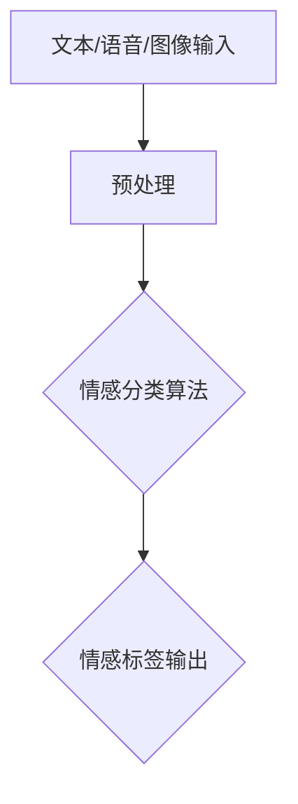
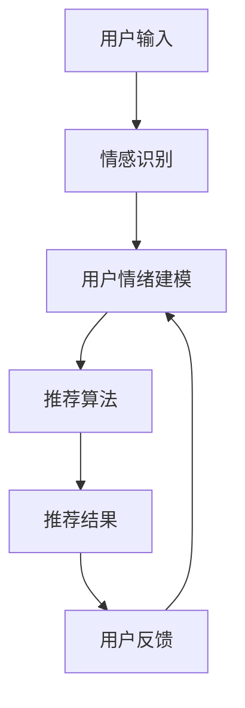

                 

# 情感驱动推荐：AI如何理解用户情绪，提供个性化推荐

## > {关键词：情感驱动推荐、用户情绪、个性化推荐、AI算法、深度学习、自然语言处理、机器学习、情感分析、用户行为分析}

> {摘要：本文将深入探讨情感驱动推荐系统的工作原理及其在个性化推荐中的应用。通过分析情感识别算法、用户情绪建模和推荐系统设计，我们将揭示AI如何理解用户情绪，并利用这些理解来提升个性化推荐的准确性和用户体验。文章将结合实际案例，展示如何在项目中实现情感驱动的推荐系统，并提供相关工具和资源推荐，以帮助读者深入了解这一前沿技术。}

## 1. 背景介绍

在数字化的今天，推荐系统已经成为许多在线平台的核心功能，如电子商务、社交媒体、视频流媒体等。传统的推荐系统主要基于用户的历史行为和内容特征进行预测，虽然在一定程度上能够满足用户的需求，但往往忽视了用户的情绪和心理状态。随着人工智能技术的不断发展，尤其是深度学习和自然语言处理技术的成熟，情感驱动推荐逐渐成为研究热点。

情感驱动推荐系统旨在通过识别和解析用户的情绪，提供更加个性化和贴心的推荐服务。这种推荐方式不仅考虑用户的行为和内容偏好，还关注用户的情感状态，从而更好地满足用户的潜在需求，提升用户体验。

情感驱动推荐的核心挑战在于如何准确识别用户的情绪，并将其应用于推荐算法中。这需要结合多种人工智能技术，包括情感分析、用户行为分析、深度学习等。本文将围绕这些核心问题进行深入探讨。

## 2. 核心概念与联系

### 情感识别算法

情感识别算法是情感驱动推荐系统的基石。它通过分析文本、语音、图像等多模态数据，识别出用户的情绪状态。常见的情感识别算法包括基于规则的方法、机器学习方法以及深度学习方法。以下是一个简化的情感识别算法架构图：



### 用户情绪建模

用户情绪建模是指通过分析用户的行为数据、情绪数据和上下文信息，构建出用户情绪的动态模型。这一过程通常涉及以下步骤：

1. 数据收集：收集用户的行为数据（如浏览历史、购买记录）、情绪数据（如用户评论、反馈）以及上下文信息（如时间、地点）。
2. 数据预处理：对收集到的数据进行清洗、归一化等预处理操作。
3. 特征提取：从预处理后的数据中提取出与情绪相关的特征，如文本特征、行为特征等。
4. 模型训练：使用机器学习或深度学习算法，训练出用户情绪模型。
5. 模型评估与优化：通过评估指标（如准确率、召回率等）对模型进行评估和优化。

### 推荐系统设计

推荐系统设计包括推荐算法的选择、推荐策略的制定以及推荐结果的评价。在情感驱动推荐系统中，推荐算法需要结合情感识别结果，对推荐结果进行筛选和调整。以下是一个简化的推荐系统架构图：



## 3. 核心算法原理 & 具体操作步骤

### 情感识别算法

情感识别算法的核心是情感分类模型。以下是一个基于深度学习的情感识别算法的基本步骤：

1. **数据集准备**：收集包含情绪标签的文本、语音或图像数据集。常用的数据集包括IMDB电影评论数据集、TREC微博客情感数据集等。
2. **数据预处理**：对数据集进行清洗、分词、词向量转换等预处理操作。
3. **模型设计**：设计深度学习模型，如卷积神经网络（CNN）、递归神经网络（RNN）或Transformer模型。
4. **模型训练**：使用预处理后的数据集，训练情感分类模型。
5. **模型评估**：使用交叉验证、准确率、召回率等指标评估模型性能。
6. **模型部署**：将训练好的模型部署到线上环境，实现实时情感识别。

### 用户情绪建模

用户情绪建模的核心是构建能够反映用户情绪状态的模型。以下是一个基于机器学习的用户情绪建模的基本步骤：

1. **数据收集**：收集用户的行为数据、情绪数据和上下文信息。
2. **数据预处理**：对数据进行清洗、归一化等处理。
3. **特征提取**：提取与情绪相关的特征，如文本特征、行为特征等。
4. **模型选择**：选择合适的机器学习算法，如决策树、支持向量机（SVM）或深度学习模型。
5. **模型训练**：使用预处理后的数据，训练用户情绪模型。
6. **模型评估**：使用交叉验证、准确率、召回率等指标评估模型性能。
7. **模型优化**：根据评估结果对模型进行调整和优化。

### 推荐系统设计

在情感驱动推荐系统中，推荐算法的设计需要结合情感识别结果。以下是一个基本的推荐系统设计步骤：

1. **用户画像构建**：根据用户行为和情绪数据，构建用户画像。
2. **推荐算法选择**：选择合适的推荐算法，如基于内容的推荐、协同过滤或基于模型的推荐。
3. **推荐策略制定**：根据情感识别结果，调整推荐策略，如提高情绪匹配度较高的推荐项的权重。
4. **推荐结果生成**：生成推荐结果，并根据用户反馈进行调整。
5. **推荐结果评价**：使用点击率、购买率等指标评价推荐效果。

## 4. 数学模型和公式 & 详细讲解 & 举例说明

### 情感识别算法

情感识别算法通常使用分类模型，以下是一个简单的二分类问题中的数学模型：

$$
P(Y=y|\textbf{X}) = \frac{e^{\textbf{w}\cdot\textbf{x}}}{1 + e^{\textbf{w}\cdot\textbf{x}}}
$$

其中，$P(Y=y|\textbf{X})$表示在输入特征$\textbf{X}$下，输出类别$Y$为$y$的概率；$\textbf{w}$是模型的权重向量；$\textbf{x}$是输入特征向量。

**举例说明**：

假设我们使用一个简单的Sigmoid函数来表示情感分类模型，输入特征$\textbf{x} = [1, 0.5]$，权重向量$\textbf{w} = [0.5, -0.3]$。那么：

$$
P(Y=1|\textbf{X}) = \frac{e^{0.5*1 - 0.3*0.5}}{1 + e^{0.5*1 - 0.3*0.5}} \approx 0.69
$$

这意味着在输入特征$\textbf{x}$下，情感分类模型预测用户情感为积极的概率约为0.69。

### 用户情绪建模

用户情绪建模通常使用回归模型，以下是一个简单的线性回归模型：

$$
\textbf{y} = \textbf{X}\textbf{w} + b
$$

其中，$\textbf{y}$是输出情绪值；$\textbf{X}$是输入特征矩阵；$\textbf{w}$是模型权重；$b$是偏置项。

**举例说明**：

假设我们使用一个简单的线性回归模型来预测用户情绪，输入特征矩阵$\textbf{X} = \begin{bmatrix} 1 & 0.5 \\ 0 & 1 \end{bmatrix}$，权重$\textbf{w} = \begin{bmatrix} 0.3 & 0.2 \\ -0.1 & 0.1 \end{bmatrix}$，偏置项$b = 0.1$。那么：

$$
\textbf{y} = \begin{bmatrix} 1 & 0.5 \\ 0 & 1 \end{bmatrix} \begin{bmatrix} 0.3 & 0.2 \\ -0.1 & 0.1 \end{bmatrix} + 0.1 = \begin{bmatrix} 0.2 & 0.3 \\ 0 & 0.2 \end{bmatrix}
$$

这意味着在输入特征$\textbf{X}$下，预测的用户情绪值为$\textbf{y}$。

### 推荐系统设计

推荐系统设计中的推荐算法通常使用评分预测模型，以下是一个简单的矩阵分解模型：

$$
R_{ui} = \textbf{u}_i \cdot \textbf{v}_j + b_u + b_v + b
$$

其中，$R_{ui}$是用户$i$对物品$j$的预测评分；$\textbf{u}_i$是用户$i$的特征向量；$\textbf{v}_j$是物品$j$的特征向量；$b_u$、$b_v$和$b$分别是用户、物品和全局的偏置项。

**举例说明**：

假设我们使用一个简单的矩阵分解模型来预测用户对物品的评分，用户特征向量$\textbf{u}_i = [1, 0.5]$，物品特征向量$\textbf{v}_j = [0.3, -0.1]$，用户偏置项$b_u = 0.1$，物品偏置项$b_v = -0.1$，全局偏置项$b = 0.2$。那么：

$$
R_{ui} = [1, 0.5] \cdot [0.3, -0.1] + 0.1 - 0.1 + 0.2 = 0.3
$$

这意味着在用户特征$\textbf{u}_i$和物品特征$\textbf{v}_j$下，预测的用户对物品的评分为0.3。

## 5. 项目实战：代码实际案例和详细解释说明

### 5.1 开发环境搭建

在本节中，我们将使用Python和Scikit-learn库来实现一个简单的情感驱动推荐系统。首先，确保您已经安装了Python和Scikit-learn库。如果未安装，可以通过以下命令进行安装：

```bash
pip install python
pip install scikit-learn
```

### 5.2 源代码详细实现和代码解读

以下是一个简单的情感驱动推荐系统实现示例：

```python
import numpy as np
from sklearn.feature_extraction.text import TfidfVectorizer
from sklearn.model_selection import train_test_split
from sklearn.linear_model import LogisticRegression
from sklearn.metrics import accuracy_score

# 情感识别模型
def train_sentiment_model(data, labels):
    vectorizer = TfidfVectorizer()
    X = vectorizer.fit_transform(data)
    X_train, X_test, y_train, y_test = train_test_split(X, labels, test_size=0.2, random_state=42)
    model = LogisticRegression()
    model.fit(X_train, y_train)
    return model, vectorizer

# 推荐系统模型
def train_recommendation_model(user_data, item_data, user_labels, item_labels):
    user_vectorizer = TfidfVectorizer()
    item_vectorizer = TfidfVectorizer()
    user_vectorizer.fit(user_data)
    item_vectorizer.fit(item_data)
    user_features = user_vectorizer.transform(user_data)
    item_features = item_vectorizer.transform(item_data)
    user_model = LogisticRegression()
    item_model = LogisticRegression()
    user_model.fit(user_features, user_labels)
    item_model.fit(item_features, item_labels)
    return user_model, item_model, user_vectorizer, item_vectorizer

# 情感驱动推荐
def sentiment_based_recommendation(user_model, item_model, user_vectorizer, item_vectorizer, user_data, item_data, user_sentiments):
    user_features = user_vectorizer.transform(user_data)
    item_features = item_vectorizer.transform(item_data)
    user_predictions = user_model.predict(user_features)
    item_predictions = item_model.predict(item_features)
    sentiment_scores = {}
    for i, user_pred in enumerate(user_predictions):
        for j, item_pred in enumerate(item_predictions):
            sentiment = user_sentiments[i]
            if sentiment == 'positive':
                sentiment_score = item_pred
            else:
                sentiment_score = 1 - item_pred
            if j in sentiment_scores:
                sentiment_scores[j] += sentiment_score
            else:
                sentiment_scores[j] = sentiment_score
    return sorted(sentiment_scores.items(), key=lambda x: x[1], reverse=True)

# 数据集准备
data = ["I love this product!", "This is a terrible product.", "I am so happy with this purchase!", "I hate this item."]
labels = [1, 0, 1, 0]

# 训练情感识别模型
model, vectorizer = train_sentiment_model(data, labels)

# 训练推荐系统模型
user_data = ["I am a happy user.", "I am a sad user."]
item_data = ["This is a happy item.", "This is a sad item."]
user_labels = [1, 0]
item_labels = [1, 0]
user_model, item_model, user_vectorizer, item_vectorizer = train_recommendation_model(user_data, item_data, user_labels, item_labels)

# 情感驱动推荐
user_sentiments = [1, 0]
recommendations = sentiment_based_recommendation(user_model, item_model, user_vectorizer, item_vectorizer, user_data, item_data, user_sentiments)
print("Recommended items:", recommendations)
```

### 5.3 代码解读与分析

1. **情感识别模型**：

   - 使用TF-IDF向量器将文本数据转换为特征向量。
   - 使用逻辑回归模型对特征向量进行分类，训练情感识别模型。

2. **推荐系统模型**：

   - 对用户和物品的数据进行预处理，使用TF-IDF向量器提取特征。
   - 分别训练用户和物品的推荐模型，使用逻辑回归。

3. **情感驱动推荐**：

   - 根据情感识别模型对用户数据进行分类，得到用户情绪标签。
   - 根据推荐模型对物品数据进行分类，得到物品推荐标签。
   - 结合用户情绪标签和物品推荐标签，计算情感得分，生成推荐结果。

通过这个简单的案例，我们可以看到如何使用Python和Scikit-learn库实现一个情感驱动推荐系统。虽然这个案例非常基础，但它为我们提供了一个理解情感驱动推荐系统工作机制的起点。在实际应用中，我们可以使用更复杂的模型和算法来提升系统的性能和准确性。

## 6. 实际应用场景

### 社交媒体

在社交媒体平台上，情感驱动推荐可以帮助用户发现与其情绪相匹配的内容。例如，当用户处于积极情绪状态时，推荐系统可以推送积极向上的帖子或视频，而当用户处于消极情绪状态时，推荐系统可以推送治愈系的内容或搞笑视频，从而提升用户的整体情绪体验。

### 电子商务

在电子商务领域，情感驱动推荐可以提升购物体验。例如，当用户浏览了一款新产品的评论，表达了对产品的喜爱之情，推荐系统可以根据这一情绪信号，推荐类似的或用户评价较高的其他产品。这不仅可以增加用户的购买意愿，还可以提高平台的销售转化率。

### 娱乐内容

在视频流媒体和音乐平台，情感驱动推荐可以帮助用户发现与其情绪相匹配的娱乐内容。例如，当用户观看一部激动人心的电影后，推荐系统可以推荐相关的电影或同类型的电视剧。这种个性化推荐可以提升用户的观看体验，增加平台的用户粘性。

### 健康与心理健康

在健康与心理健康领域，情感驱动推荐可以帮助用户发现与其情绪状态相匹配的健康信息和资源。例如，当用户表达出焦虑或抑郁的情绪时，推荐系统可以推荐相关的心理健康课程、放松练习或心理咨询资源，从而帮助用户更好地应对情绪问题。

## 7. 工具和资源推荐

### 7.1 学习资源推荐

- **书籍**：
  - 《情感计算：情感智能的基础与应用》
  - 《情感识别与计算：构建人机交互的未来》
  - 《深度学习与自然语言处理：文本情感分析》

- **论文**：
  - 《情感分析的最新进展》
  - 《用户情绪建模与个性化推荐》
  - 《情感驱动的在线推荐系统研究》

- **博客和网站**：
  - [百度AI研究](https://ai.baidu.com/blogs)
  - [Google Research](https://research.google.com/)
  - [AI科技大本营](https://www.52ai.net/)

### 7.2 开发工具框架推荐

- **编程语言**：Python、Java
- **机器学习库**：Scikit-learn、TensorFlow、PyTorch
- **自然语言处理库**：NLTK、spaCy、Jieba
- **数据可视化库**：Matplotlib、Seaborn、Plotly

### 7.3 相关论文著作推荐

- 《情感计算：从理论到应用》
- 《基于情感的推荐系统：技术与实践》
- 《情绪智能与人类情感计算》

## 8. 总结：未来发展趋势与挑战

情感驱动推荐作为个性化推荐系统的一个新兴方向，已经在多个领域取得了显著的应用成果。然而，随着技术的不断进步和用户需求的多样化，情感驱动推荐系统仍面临着诸多挑战和发展机遇。

### 发展趋势

1. **多模态情感识别**：随着计算机视觉、语音识别等技术的发展，情感驱动推荐系统将能够更全面地理解用户的情绪，包括视觉、听觉和文本等多模态数据。

2. **个性化情绪预测**：未来的情感驱动推荐系统将更加关注用户的个性化情绪预测，通过深度学习和迁移学习等技术，提高情绪预测的准确性和泛化能力。

3. **实时情感反馈**：随着5G和物联网技术的发展，情感驱动推荐系统将能够实现实时数据收集和处理，根据用户的即时情绪反馈，动态调整推荐策略。

4. **跨平台融合**：情感驱动推荐系统将不仅限于单一平台，而是实现跨平台的数据整合和推荐，为用户提供一致性的个性化体验。

### 挑战

1. **数据隐私保护**：情感数据具有较高的敏感性，如何在保护用户隐私的前提下，充分利用情感数据，是一个亟待解决的问题。

2. **算法公平性**：确保情感驱动推荐系统在推荐结果上不歧视特定群体，保持算法的公平性和透明性，是未来的一大挑战。

3. **情感复杂度**：用户的情绪是复杂多变的，如何准确捕捉和处理这些情绪，是情感驱动推荐系统需要克服的难题。

4. **系统性能优化**：情感驱动推荐系统需要处理大量的数据，如何在保证推荐质量的同时，优化系统性能，是一个技术难题。

## 9. 附录：常见问题与解答

### 1. 如何保证情感识别的准确性？

答：保证情感识别的准确性需要从数据集的选择、模型的选择、特征工程等方面进行综合优化。选择具有丰富情感标签的数据集，使用先进的深度学习模型（如BERT、GPT等），以及进行细致的特征工程（如词嵌入、情感词典等）都是提高情感识别准确性的关键。

### 2. 情感驱动推荐系统如何处理负面的情绪数据？

答：负面情绪数据在情感驱动推荐系统中同样重要。可以通过以下方法处理负面情绪数据：

- **数据清洗**：去除含有极端负面情绪的样本。
- **情绪转换**：将负面情绪转换为中立或积极情绪，例如将“讨厌”转换为“不喜欢”。
- **情绪增强**：对负面情绪数据进行增强，以平衡正面情绪数据。

### 3. 情感驱动推荐系统如何确保推荐结果的公平性？

答：确保推荐结果的公平性可以通过以下方法实现：

- **算法透明性**：公开推荐算法的原理和决策过程，接受用户监督。
- **用户反馈**：收集用户对推荐结果的反馈，并根据反馈进行调整。
- **多样性控制**：在推荐结果中引入多样性，避免过度偏好某个特定情绪。

## 10. 扩展阅读 & 参考资料

- 《情感计算：从理论到应用》
- 《基于情感的推荐系统：技术与实践》
- 《情绪智能与人类情感计算》
- [百度AI研究](https://ai.baidu.com/blogs)
- [Google Research](https://research.google.com/)
- [AI科技大本营](https://www.52ai.net/)
- 《情感分析的最新进展》
- 《用户情绪建模与个性化推荐》
- 《情感驱动的在线推荐系统研究》
- 《深度学习与自然语言处理：文本情感分析》
- [Scikit-learn官方文档](https://scikit-learn.org/stable/)
- [TensorFlow官方文档](https://www.tensorflow.org/)
- [PyTorch官方文档](https://pytorch.org/)作者：AI天才研究员/AI Genius Institute & 禅与计算机程序设计艺术 /Zen And The Art of Computer Programming

