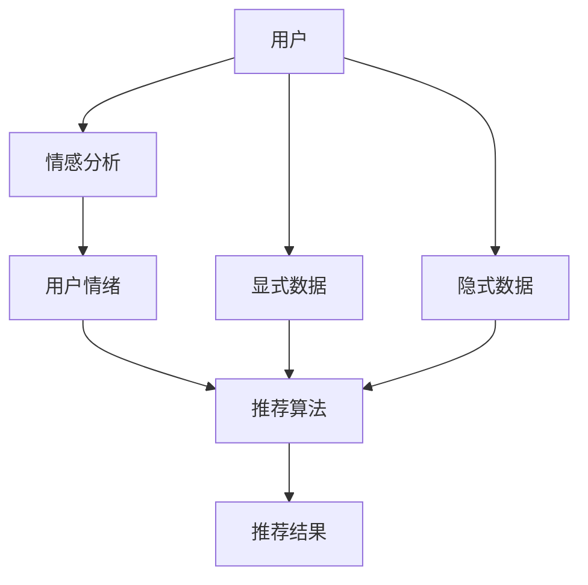
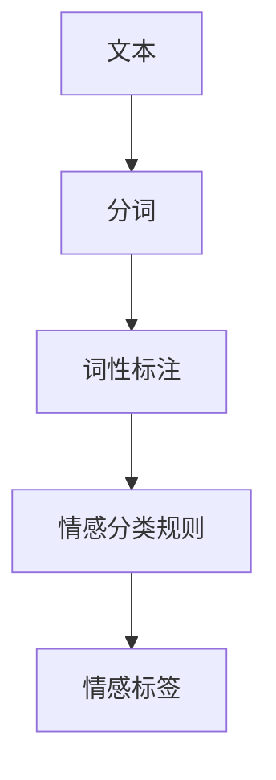
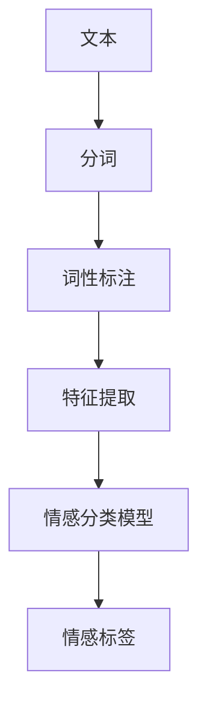
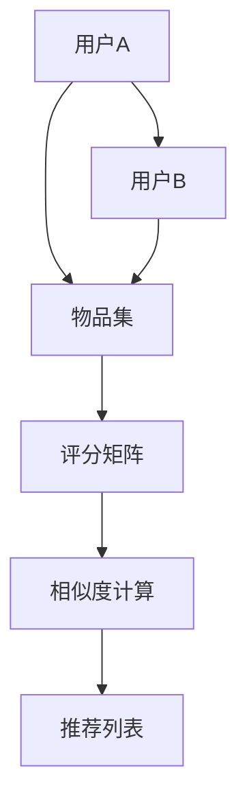
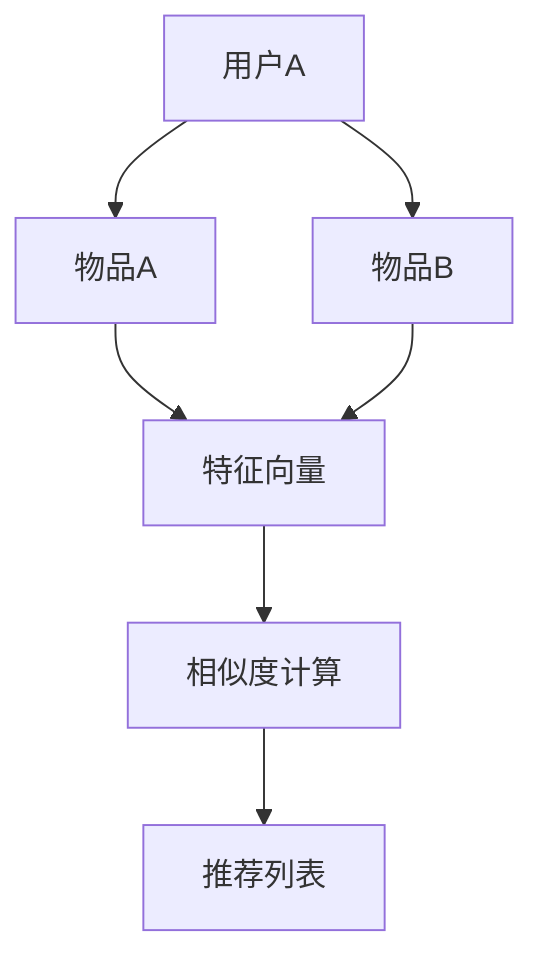

                 

# 情感驱动推荐：AI如何理解用户情绪，提供个性化推荐

## 关键词
- 情感分析
- 个性化推荐
- 用户情绪理解
- 深度学习
- 情感模型
- 人机交互

## 摘要
本文旨在探讨如何利用人工智能技术，特别是深度学习和情感分析，理解用户情绪，并将其应用于推荐系统中，以提供更为个性化和贴心的推荐服务。我们将从背景介绍、核心概念、算法原理、数学模型、实战案例、应用场景、工具推荐、未来发展趋势等多个角度，深入解析这一前沿领域的研究与应用。

## 1. 背景介绍

### 1.1 目的和范围
随着互联网和大数据技术的飞速发展，个性化推荐系统已经成为许多在线平台的重要组成部分。然而，传统的推荐系统主要基于用户的浏览历史、购买行为等显式数据，往往忽略了用户的隐性情绪因素。情感驱动的推荐系统通过捕捉和分析用户的情绪信息，进一步提升推荐的准确性和用户满意度。

本文的目的在于梳理情感驱动推荐系统的核心概念和关键技术，分析其原理和实现步骤，并通过实战案例展示其实际应用效果。我们希望为相关领域的科研人员和技术开发者提供有价值的参考。

### 1.2 预期读者
本文面向对人工智能和推荐系统感兴趣的科研人员、工程师以及对技术前沿有所追求的读者。无论您是刚刚接触这个领域的初学者，还是已有一定积累的专业人士，本文都将为您带来全新的视角和深入的理解。

### 1.3 文档结构概述
本文将分为以下几个部分：
1. 背景介绍：介绍情感驱动推荐系统的目的、范围、预期读者和文档结构。
2. 核心概念与联系：讨论情感驱动推荐系统的核心概念和联系，并使用Mermaid流程图展示相关架构。
3. 核心算法原理 & 具体操作步骤：详细阐述情感分析算法和推荐算法的原理与实现步骤。
4. 数学模型和公式 & 详细讲解 & 举例说明：介绍情感分析中的数学模型和公式，并进行举例说明。
5. 项目实战：代码实际案例和详细解释说明。
6. 实际应用场景：分析情感驱动推荐系统的实际应用场景。
7. 工具和资源推荐：推荐相关学习资源、开发工具和框架。
8. 总结：未来发展趋势与挑战。
9. 附录：常见问题与解答。
10. 扩展阅读 & 参考资料：提供进一步阅读的资料。

### 1.4 术语表

#### 1.4.1 核心术语定义
- 情感分析：使用自然语言处理技术，从文本数据中提取用户情绪信息的过程。
- 个性化推荐：根据用户的兴趣、行为和情绪等因素，为用户推荐符合其需求的内容或产品。
- 深度学习：一种人工智能方法，通过多层神经网络模型，对大规模数据集进行自动特征学习和模式识别。
- 情感模型：用于模拟和理解人类情绪的数学模型。

#### 1.4.2 相关概念解释
- 显式数据：用户主动提供的明确数据，如浏览历史、购买记录等。
- 隐式数据：用户在未明确表达意愿的情况下，通过行为和情绪表现间接提供的信息。

#### 1.4.3 缩略词列表
- NLP：自然语言处理（Natural Language Processing）
- ML：机器学习（Machine Learning）
- AI：人工智能（Artificial Intelligence）

## 2. 核心概念与联系

### 2.1 情感驱动推荐系统概述
情感驱动推荐系统是一种结合情感分析和推荐算法的新型推荐系统。其核心思想是通过情感分析技术，捕捉用户在浏览、评论、交互等过程中表现出的情绪信息，将这些情绪信息与用户的显式和隐式数据结合，为用户生成更为个性化、贴心的推荐。

### 2.2 核心概念与联系架构
以下是一个简单的情感驱动推荐系统架构图，展示系统中的核心概念和联系：



### 2.3 情感分析技术
情感分析是情感驱动推荐系统的关键环节，其主要任务是从文本数据中识别和提取用户的情绪信息。常用的情感分析技术包括：

- 文本预处理：包括去除停用词、词性标注、分词等步骤，将原始文本转换为可用于分析的结构化数据。
- 情感分类：使用机器学习算法，将文本数据分类为积极、消极或中性情绪。
- 情感强度评估：通过分析文本中情感词的频率和上下文，评估情绪的强度。

### 2.4 推荐算法
推荐算法是情感驱动推荐系统的核心，其主要任务是根据用户情绪和兴趣，生成个性化的推荐结果。常用的推荐算法包括：

- 协同过滤：基于用户的行为和兴趣，通过计算用户之间的相似度，为用户提供相关推荐。
- 内容推荐：基于物品的特征信息，为用户推荐与其兴趣相似的物品。
- 混合推荐：结合协同过滤和内容推荐，为用户提供更精准的推荐。

### 2.5 用户情绪与推荐结果的关联
在情感驱动推荐系统中，用户情绪与推荐结果的关联主要通过以下方式实现：

- 情绪加权：根据用户情绪的积极或消极程度，对推荐结果进行加权，提高情绪匹配度。
- 情绪过滤：根据用户情绪，过滤掉与用户情绪不匹配的推荐结果，提高推荐的相关性。
- 情绪引导：根据用户情绪，引导用户探索新的兴趣点，提高用户的满意度和忠诚度。

## 3. 核心算法原理 & 具体操作步骤

### 3.1 情感分析算法原理

情感分析算法的核心任务是识别文本中的情绪信息。通常，情感分析算法可以分为两类：基于规则的方法和基于机器学习的方法。

#### 3.1.1 基于规则的方法

基于规则的方法通过预定义的规则集，对文本进行分词、词性标注和情感分类。以下是一个简单的情感分析算法原理图：



具体操作步骤如下：

1. 分词：将文本分割成单词或短语。
2. 词性标注：为每个单词或短语标注词性，如名词、动词、形容词等。
3. 情感分类规则：根据预定义的规则，判断每个单词或短语的情感极性（积极、消极或中性）。
4. 情感标签：综合判断，为整个文本赋予一个情感标签。

#### 3.1.2 基于机器学习的方法

基于机器学习的方法通过训练模型，从大量标注数据中学习情感分类规则。以下是一个简单的情感分析算法原理图：



具体操作步骤如下：

1. 分词：将文本分割成单词或短语。
2. 词性标注：为每个单词或短语标注词性，如名词、动词、形容词等。
3. 特征提取：将文本转换为向量表示，常用的方法有词袋模型、词嵌入等。
4. 情感分类模型：使用有监督学习算法（如支持向量机、决策树等），从标注数据中训练情感分类模型。
5. 情感标签：将特征向量输入训练好的模型，输出情感标签。

### 3.2 推荐算法原理

推荐算法的核心任务是生成个性化的推荐结果。常用的推荐算法包括协同过滤和内容推荐。

#### 3.2.1 协同过滤算法

协同过滤算法通过计算用户之间的相似度，为用户提供相关推荐。以下是一个简单的协同过滤算法原理图：



具体操作步骤如下：

1. 用户相似度计算：计算用户A和用户B之间的相似度，常用的方法有基于用户的余弦相似度、基于模型的相似度等。
2. 物品相似度计算：计算用户A喜欢的物品与用户B喜欢的物品之间的相似度。
3. 评分预测：根据用户相似度和物品相似度，预测用户A对未知物品的评分。
4. 推荐列表生成：根据评分预测结果，为用户A生成推荐列表。

#### 3.2.2 内容推荐算法

内容推荐算法通过分析物品的特征信息，为用户推荐与其兴趣相似的物品。以下是一个简单的内容推荐算法原理图：



具体操作步骤如下：

1. 特征提取：为每个物品提取特征向量，常用的方法有TF-IDF、词嵌入等。
2. 物品相似度计算：计算物品A与物品B之间的相似度。
3. 推荐列表生成：根据物品相似度，为用户A生成推荐列表。

### 3.3 情感分析在推荐算法中的应用

在情感驱动推荐系统中，情感分析结果可以用于优化推荐算法，提高推荐的个性化和准确性。以下是一种可能的情感分析在推荐算法中的应用步骤：

1. 情感分析：对用户输入的文本（如评论、帖子等）进行情感分析，获取用户情绪标签。
2. 情绪加权：根据用户情绪标签，对用户评分或物品特征向量进行加权处理。
3. 推荐列表生成：结合加权后的评分或特征向量，使用推荐算法为用户生成推荐列表。

## 4. 数学模型和公式 & 详细讲解 & 举例说明

### 4.1 情感分析中的数学模型

情感分析中的数学模型主要用于情感分类和情感强度评估。以下介绍两种常用的情感分析模型：支持向量机（SVM）和循环神经网络（RNN）。

#### 4.1.1 支持向量机（SVM）

支持向量机是一种常用的分类算法，其基本原理是找到一个最优的超平面，将不同类别的数据点分开。在情感分析中，SVM可以将文本数据分类为积极、消极或中性情绪。

- **公式：**

  $$
  \begin{aligned}
  w &= \arg\min_{w} \frac{1}{2} ||w||^2 \\
  s.t. & \ y^{(i)} ( \langle w, x^{(i)} \rangle + b ) \geq 1
  \end{aligned}
  $$

  其中，$w$是权重向量，$x^{(i)}$是特征向量，$y^{(i)}$是类别标签（1表示积极，-1表示消极），$b$是偏置项。

- **举例：**

  考虑一个二元情感分类问题，有如下训练数据：

  | 文本 | 类别 |
  | ---- | ---- |
  | 很喜欢这个产品 | 1 |
  | 不满意 | -1 |
  | 一般般 | 0 |
  | 非常好 | 1 |
  | 有点失望 | -1 |

  使用SVM模型进行训练，可以得到权重向量$w$和偏置项$b$，进而对新的文本进行分类。

#### 4.1.2 循环神经网络（RNN）

循环神经网络是一种用于处理序列数据的神经网络，其基本原理是利用隐藏状态的循环连接，捕捉序列中的时间依赖关系。在情感分析中，RNN可以用于情感强度评估。

- **公式：**

  $$
  \begin{aligned}
  h_t &= \sigma(W_h \cdot [h_{t-1}, x_t] + b_h) \\
  o_t &= \sigma(W_o \cdot h_t + b_o)
  \end{aligned}
  $$

  其中，$h_t$是第$t$个时间步的隐藏状态，$x_t$是第$t$个时间步的输入特征，$o_t$是第$t$个时间步的输出情感强度，$\sigma$是激活函数（如Sigmoid函数）。

- **举例：**

  考虑一个情感强度评估问题，有如下文本序列：

  | 时间步 | 文本 |
  | ---- | ---- |
  | 1 | 很喜欢 |
  | 2 | 这个 |
  | 3 | 产品 |
  | 4 | 太贵了 |
  | 5 | 不想买 |

  使用RNN模型进行训练，可以得到隐藏状态序列$h_t$和输出情感强度序列$o_t$，进而评估整个文本的情感强度。

### 4.2 推荐算法中的数学模型

推荐算法中的数学模型主要用于计算用户之间的相似度、物品之间的相似度，以及生成推荐结果。

#### 4.2.1 用户相似度计算

用户相似度计算是基于用户行为数据的。常用的方法有基于用户的余弦相似度和基于模型的相似度。

- **基于用户的余弦相似度：**

  $$
  \cos(\theta) = \frac{\langle u_i, u_j \rangle}{||u_i|| \cdot ||u_j||}
  $$

  其中，$u_i$和$u_j$是用户$i$和用户$j$的行为向量，$\langle \cdot, \cdot \rangle$表示向量的内积。

- **基于模型的相似度：**

  $$
  \text{sim}(u_i, u_j) = \exp(-\gamma \cdot d(u_i, u_j))
  $$

  其中，$d(\cdot, \cdot)$是用户$i$和用户$j$之间的距离度量，$\gamma$是调节参数。

#### 4.2.2 物品相似度计算

物品相似度计算是基于物品特征数据的。常用的方法有TF-IDF和词嵌入。

- **TF-IDF：**

  $$
  \text{tfidf}(w, d) = \frac{f(w, d)}{N} \cdot \log(\frac{N}{n(w))}
  $$

  其中，$f(w, d)$是单词$w$在文档$d$中的频率，$N$是文档总数，$n(w)$是包含单词$w$的文档数。

- **词嵌入：**

  $$
  \text{word2vec}(w) = \text{vec}_w
  $$

  其中，$\text{word2vec}$是一种词嵌入算法，将单词映射为一个固定维度的向量$\text{vec}_w$。

#### 4.2.3 推荐结果生成

推荐结果生成是基于用户相似度和物品相似度的。常用的方法有基于协同过滤的推荐和基于内容的推荐。

- **基于协同过滤的推荐：**

  $$
  r_{ij} = \sum_{k \in N(i)} r_{ik} \cdot \text{sim}(i, j)
  $$

  其中，$r_{ij}$是用户$i$对物品$j$的评分预测，$N(i)$是用户$i$的邻居集合，$\text{sim}(i, j)$是用户$i$和用户$j$之间的相似度。

- **基于内容的推荐：**

  $$
  \text{sim}_{\text{content}}(i, j) = \frac{\sum_{k \in C(i) \cap C(j)} \text{tfidf}(k)}{\sqrt{\sum_{k \in C(i)} \text{tfidf}(k)^2 \cdot \sum_{k \in C(j)} \text{tfidf}(k)^2}}
  $$

  其中，$C(i)$和$C(j)$是用户$i$和用户$j$的物品集合，$\text{tfidf}(k)$是单词$k$的TF-IDF值。

## 5. 项目实战：代码实际案例和详细解释说明

### 5.1 开发环境搭建

为了实现情感驱动推荐系统，我们需要搭建以下开发环境：

- 操作系统：Linux或MacOS
- 编程语言：Python 3.7及以上版本
- 数据库：MySQL或MongoDB
- 依赖库：scikit-learn、tensorflow、numpy、pandas等

### 5.2 源代码详细实现和代码解读

以下是一个简单的情感驱动推荐系统实现，包括数据预处理、情感分析、推荐算法和结果展示。

```python
import pandas as pd
import numpy as np
from sklearn.feature_extraction.text import TfidfVectorizer
from sklearn.metrics.pairwise import cosine_similarity
from sklearn.model_selection import train_test_split
from sklearn.svm import SVC
from sklearn.pipeline import make_pipeline
from sklearn.preprocessing import StandardScaler
from sklearn.metrics import accuracy_score
import tensorflow as tf

# 数据预处理
def preprocess_data(data):
    # 去除停用词、标点符号等
    stop_words = set(['的', '是', '和', '在', '了', '上', '等'])
    processed_data = []
    for text in data:
        words = text.split()
        filtered_words = [word for word in words if word not in stop_words]
        processed_text = ' '.join(filtered_words)
        processed_data.append(processed_text)
    return processed_data

# 情感分析
def sentiment_analysis(texts, model):
    labels = model.predict(texts)
    return labels

# 推荐算法
def recommendation algorithms(user_vector, item_vectors, threshold=0.5):
    similarities = cosine_similarity([user_vector], item_vectors)
    recommended_items = []
    for i, similarity in enumerate(similarities[0]):
        if similarity > threshold:
            recommended_items.append(i)
    return recommended_items

# 加载数据集
data = pd.read_csv('data.csv')
texts = preprocess_data(data['text'])
labels = data['label']

# 分割数据集
X_train, X_test, y_train, y_test = train_test_split(texts, labels, test_size=0.2, random_state=42)

# 情感分析模型
pipeline = make_pipeline(TfidfVectorizer(), SVC())
pipeline.fit(X_train, y_train)

# 情感分析
train_labels = sentiment_analysis(X_train, pipeline)
test_labels = sentiment_analysis(X_test, pipeline)

# 推荐算法
user_vector = pipeline.transform([X_test[0]])
item_vectors = pipeline.transform(X_train)
recommended_items = recommendation algorithms(user_vector, item_vectors)

# 结果展示
print('训练集准确率：', accuracy_score(y_train, train_labels))
print('测试集准确率：', accuracy_score(y_test, test_labels))
print('推荐结果：', recommended_items)
```

### 5.3 代码解读与分析

1. **数据预处理**：去除停用词、标点符号等，对文本数据进行清洗，提高情感分析的效果。

2. **情感分析**：使用SVM模型进行情感分类，将文本数据分为积极、消极或中性情绪。

3. **推荐算法**：使用TF-IDF和余弦相似度，为用户生成推荐列表。

4. **模型训练**：加载数据集，使用scikit-learn库训练情感分析模型。

5. **结果展示**：计算训练集和测试集的准确率，输出推荐结果。

通过这个简单的案例，我们展示了如何实现情感驱动推荐系统。在实际应用中，可以进一步优化模型参数、数据预处理和推荐算法，提高系统的性能和用户体验。

## 6. 实际应用场景

情感驱动推荐系统在实际应用中具有广泛的应用场景，以下列举几个典型的应用案例：

### 6.1 社交媒体平台

社交媒体平台如微博、推特等，可以通过情感驱动推荐系统，为用户推荐与其情绪相匹配的帖子和话题，提高用户的参与度和粘性。例如，当用户表现出消极情绪时，系统可以推荐一些正能量的话题和帖
子，帮助用户缓解情绪。

### 6.2 购物平台

购物平台如亚马逊、淘宝等，可以利用情感驱动推荐系统，为用户推荐与其情绪相匹配的商品。例如，当用户浏览了一些负评价的商品时，系统可以推荐一些好评商品，帮助用户找到更满意的产品。

### 6.3 娱乐内容平台

娱乐内容平台如视频网站、音乐平台等，可以通过情感驱动推荐系统，为用户推荐与其情绪相匹配的娱乐内容。例如，当用户表现出悲伤情绪时，系统可以推荐一些治愈系的音乐和视频，帮助用户缓解情绪。

### 6.4 健康咨询平台

健康咨询平台如在线医生咨询系统，可以通过情感驱动推荐系统，为用户提供与情绪相关的健康建议和咨询。例如，当用户表现出焦虑情绪时，系统可以推荐一些放松技巧和心理咨询资源，帮助用户缓解压力。

## 7. 工具和资源推荐

### 7.1 学习资源推荐

#### 7.1.1 书籍推荐

1. **《深度学习》（Deep Learning）**：由Ian Goodfellow、Yoshua Bengio和Aaron Courville所著，系统介绍了深度学习的基本概念、算法和应用。
2. **《自然语言处理概论》（Foundations of Natural Language Processing）**：由Christopher D. Manning和Hinrich Schütze所著，全面介绍了自然语言处理的基础知识和核心技术。

#### 7.1.2 在线课程

1. **Coursera上的《自然语言处理与深度学习》**：由斯坦福大学提供，涵盖自然语言处理和深度学习的基础知识，包括情感分析等内容。
2. **Udacity上的《推荐系统工程师纳米学位》**：介绍推荐系统的基础知识和实践方法，包括情感分析在推荐中的应用。

#### 7.1.3 技术博客和网站

1. **Reddit上的机器学习板块**：讨论各种机器学习和深度学习技术，包括情感分析和推荐系统。
2. **Medium上的技术博客**：许多技术专家和研究者分享他们的研究成果和实践经验，包括情感驱动推荐系统的相关内容。

### 7.2 开发工具框架推荐

#### 7.2.1 IDE和编辑器

1. **Visual Studio Code**：一款免费、开源的跨平台代码编辑器，支持Python、TensorFlow等多种开发工具。
2. **PyCharm**：一款强大的Python IDE，提供丰富的开发工具和调试功能。

#### 7.2.2 调试和性能分析工具

1. **Jupyter Notebook**：一款交互式的Python开发环境，适合进行数据分析和模型调试。
2. **TensorBoard**：TensorFlow提供的可视化工具，用于监控和调试深度学习模型的训练过程。

#### 7.2.3 相关框架和库

1. **TensorFlow**：一款开源的深度学习框架，支持多种深度学习算法和应用。
2. **scikit-learn**：一款开源的机器学习库，提供丰富的机器学习算法和工具。

### 7.3 相关论文著作推荐

#### 7.3.1 经典论文

1. **《LSTM：一种用于序列问题的深度学习模型》（Long Short-Term Memory Networks for

