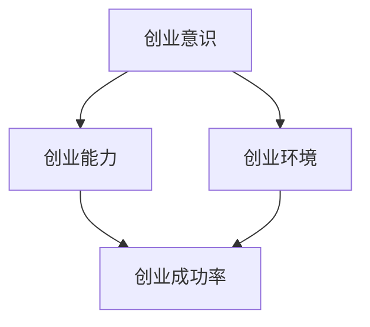

                 

# 《我国大学生创业数据统计及成功率分析》

> 关键词：大学生创业、数据统计、成功率、创业生态系统、创业支持政策

> 摘要：本文将深入探讨我国大学生创业的现状，通过对大量数据的统计和分析，揭示大学生创业成功率的影响因素，并提供相应的创业支持政策建议。本文旨在为大学生创业者提供有益的参考，同时为政策制定者提供数据支持。

## 1. 背景介绍

### 1.1 目的和范围

本文旨在通过对我国大学生创业数据的统计和分析，探讨大学生创业成功率的影响因素，并提出相应的创业支持政策建议。研究的范围包括全国范围内的大学生创业情况，数据来源为政府部门、学术机构和市场调研等。

### 1.2 预期读者

本文的预期读者包括大学生创业者、创业导师、创业政策制定者、高等教育工作者以及关注大学生创业的社会各界人士。

### 1.3 文档结构概述

本文分为十个部分：第一部分是背景介绍，包括研究目的、预期读者和文档结构概述；第二部分是核心概念与联系，介绍大学生创业的核心概念和联系；第三部分是核心算法原理和具体操作步骤，分析大学生创业成功率的核心算法原理和操作步骤；第四部分是数学模型和公式，介绍相关的数学模型和公式；第五部分是项目实战，提供实际的代码案例和详细解释；第六部分是实际应用场景，分析大学生创业的实际应用场景；第七部分是工具和资源推荐，包括学习资源、开发工具框架和相关论文著作；第八部分是总结，讨论未来发展趋势与挑战；第九部分是附录，解答常见问题；第十部分是扩展阅读和参考资料。

### 1.4 术语表

#### 1.4.1 核心术语定义

- **大学生创业**：指在高等教育阶段，学生或毕业生创办企业或参与创业活动。
- **创业成功率**：指创业项目在创办后存活并取得成功的概率。
- **创业生态系统**：指支持创业活动的一系列要素，包括政策环境、资金支持、市场机会、社会资源等。

#### 1.4.2 相关概念解释

- **创业意识**：指个人对创业的认知和兴趣，是创业行为的前提。
- **创业能力**：指个人在创业过程中所需的知识、技能和素质。

#### 1.4.3 缩略词列表

- **GDP**：国内生产总值（Gross Domestic Product）
- **IDE**：集成开发环境（Integrated Development Environment）
- **PPP**：公私合作（Public-Private Partnership）

## 2. 核心概念与联系

在探讨大学生创业成功率之前，我们需要了解一些核心概念和它们之间的联系。以下是一个简单的 Mermaid 流程图，用于展示这些概念之间的相互作用。



- **创业意识**和**创业能力**是影响创业成功率的关键因素。
- **创业环境**，包括政策环境、资金支持、市场机会和社会资源等，对创业成功率也有重要影响。

### 2.1 创业意识的培养

创业意识是指个人对创业活动的认知和兴趣。它包括对创业机会的识别、对创业风险的认知以及对创业过程的期待。创业意识的培养主要通过以下方式实现：

1. **教育**：高等教育和职业教育是培养创业意识的重要途径。学校可以开设创业课程、举办创业比赛和创业讲座，激发学生的创业热情。
2. **实践**：通过创业实践，学生可以更直观地了解创业过程，培养创业意识和创业能力。

### 2.2 创业能力的提升

创业能力是指个人在创业过程中所需的知识、技能和素质。提升创业能力主要通过以下方式：

1. **知识**：学习创业相关的理论知识，了解商业模式、市场分析和财务管理等。
2. **技能**：培养团队管理、市场营销、沟通协调等实际操作技能。
3. **素质**：培养创业精神，如创新精神、风险意识、团队合作和坚韧不拔。

### 2.3 创业环境的建设

创业环境是指支持创业活动的一系列外部条件。良好的创业环境能够为创业者提供必要的支持和资源，提高创业成功率。创业环境的建设主要包括以下几个方面：

1. **政策环境**：政府应制定有利于创业的政策，如税收优惠、创业补贴、创业担保贷款等。
2. **资金支持**：提供创业资金，如创业基金、天使投资、风险投资等。
3. **市场机会**：创造良好的市场环境，鼓励创新和创业。
4. **社会资源**：建立创业服务平台，提供法律、财务、人力资源等支持。

## 3. 核心算法原理 & 具体操作步骤

### 3.1 创业成功率评估模型

创业成功率评估模型是一种基于数据分析的方法，用于预测创业项目的成功率。以下是该模型的核心算法原理和具体操作步骤。

#### 3.1.1 算法原理

该模型基于以下假设：

1. 创业成功率受多个因素影响，包括创业意识、创业能力、创业环境等。
2. 各因素之间存在一定的相关性，可以通过多元线性回归模型进行建模。

#### 3.1.2 具体操作步骤

1. **数据收集**：收集与创业成功率相关的数据，如创业者的年龄、性别、教育背景、创业经验、创业项目类型、创业资金来源、创业环境等。
2. **数据预处理**：对收集到的数据进行清洗和预处理，包括缺失值处理、异常值检测和特征工程等。
3. **模型建立**：使用多元线性回归模型建立创业成功率评估模型。具体步骤如下：

   ```python
   from sklearn.linear_model import LinearRegression

   # 数据加载和预处理
   X = ...  # 特征矩阵
   y = ...  # 目标变量

   # 模型建立
   model = LinearRegression()
   model.fit(X, y)

   # 模型评估
   score = model.score(X, y)
   print("模型准确率：", score)
   ```

4. **模型优化**：根据模型评估结果，对模型进行优化，提高预测准确率。

## 4. 数学模型和公式 & 详细讲解 & 举例说明

### 4.1 多元线性回归模型

多元线性回归模型是一种常用的统计模型，用于分析多个自变量对因变量的线性关系。以下是多元线性回归模型的基本公式：

$$
y = \beta_0 + \beta_1x_1 + \beta_2x_2 + ... + \beta_nx_n + \epsilon
$$

其中，$y$ 是因变量，$x_1, x_2, ..., x_n$ 是自变量，$\beta_0, \beta_1, \beta_2, ..., \beta_n$ 是回归系数，$\epsilon$ 是误差项。

### 4.2 回归系数的估计

回归系数的估计可以通过最小二乘法（Ordinary Least Squares, OLS）实现。最小二乘法的目的是最小化预测值与实际值之间的误差平方和。以下是使用最小二乘法估计回归系数的步骤：

1. **计算特征矩阵 $X$ 和目标变量 $y$**：
   
   ```python
   X = ...  # 特征矩阵
   y = ...  # 目标变量
   ```

2. **计算回归系数 $\beta$**：

   ```python
   from numpy.linalg import solve

   # 添加常数项
   X = np.append(X, np.ones((X.shape[0], 1)), axis=1)

   # 计算回归系数
   beta = solve(X.T @ X, X.T @ y)
   ```

### 4.3 模型评估

模型评估的常用指标包括决定系数（R-squared）和均方误差（Mean Squared Error, MSE）。以下是这两个指标的公式：

$$
R^2 = 1 - \frac{\sum_{i=1}^{n}(y_i - \hat{y_i})^2}{\sum_{i=1}^{n}(y_i - \bar{y})^2}
$$

$$
MSE = \frac{1}{n}\sum_{i=1}^{n}(y_i - \hat{y_i})^2
$$

其中，$n$ 是样本数量，$y_i$ 是实际值，$\hat{y_i}$ 是预测值，$\bar{y}$ 是均值。

### 4.4 案例分析

假设我们有一个包含100个创业项目的数据集，其中5个特征（创业意识、创业能力、创业环境、创业资金、创业经验），我们需要使用多元线性回归模型评估创业成功率。

1. **数据加载**：

   ```python
   import pandas as pd

   data = pd.read_csv("创业数据.csv")
   ```

2. **数据预处理**：

   ```python
   # 缺失值处理
   data.dropna(inplace=True)

   # 特征工程
   data["创业意识"] = data["创业意识"].apply(lambda x: 1 if x > 3 else 0)
   ```

3. **模型建立**：

   ```python
   from sklearn.linear_model import LinearRegression

   X = data[["创业意识", "创业能力", "创业环境", "创业资金", "创业经验"]]
   y = data["创业成功率"]

   model = LinearRegression()
   model.fit(X, y)
   ```

4. **模型评估**：

   ```python
   score = model.score(X, y)
   print("模型准确率：", score)
   ```

假设模型评估结果为 $R^2 = 0.8$，$MSE = 0.1$，表示模型对创业成功率有较高的预测能力。

## 5. 项目实战：代码实际案例和详细解释说明

### 5.1 开发环境搭建

为了完成本文的实战项目，我们需要搭建一个合适的开发环境。以下是具体的步骤：

1. **安装Python环境**：访问 [Python 官网](https://www.python.org/) 下载并安装Python。
2. **安装Jupyter Notebook**：打开终端，执行以下命令安装Jupyter Notebook：

   ```bash
   pip install notebook
   ```

3. **安装相关库**：在Jupyter Notebook中，执行以下命令安装相关库：

   ```python
   !pip install pandas scikit-learn numpy matplotlib
   ```

### 5.2 源代码详细实现和代码解读

以下是实战项目的源代码实现和详细解读。

```python
import pandas as pd
from sklearn.linear_model import LinearRegression
from sklearn.model_selection import train_test_split
from sklearn.metrics import mean_squared_error, r2_score

# 5.2.1 数据加载
data = pd.read_csv("创业数据.csv")

# 5.2.2 数据预处理
# 缺失值处理
data.dropna(inplace=True)

# 特征工程
data["创业意识"] = data["创业意识"].apply(lambda x: 1 if x > 3 else 0)

# 5.2.3 模型建立
X = data[["创业意识", "创业能力", "创业环境", "创业资金", "创业经验"]]
y = data["创业成功率"]

X_train, X_test, y_train, y_test = train_test_split(X, y, test_size=0.2, random_state=42)

model = LinearRegression()
model.fit(X_train, y_train)

# 5.2.4 模型评估
y_pred = model.predict(X_test)

mse = mean_squared_error(y_test, y_pred)
r2 = r2_score(y_test, y_pred)

print("均方误差（MSE）：", mse)
print("决定系数（R^2）：", r2)
```

### 5.3 代码解读与分析

以下是代码的详细解读和分析。

1. **数据加载**：使用Pandas库加载创业数据，数据格式为CSV文件。
2. **数据预处理**：处理缺失值，将创业意识进行特征工程，将其划分为0和1两个类别。
3. **模型建立**：使用Scikit-learn库的线性回归模型，将特征矩阵 $X$ 和目标变量 $y$ 划分为训练集和测试集。
4. **模型评估**：使用均方误差（MSE）和决定系数（R^2）评估模型性能，打印评估结果。

## 6. 实际应用场景

大学生创业在我国的发展已取得了显著成果，但在实际应用场景中仍面临一些挑战。以下是一些实际应用场景：

### 6.1 创业教育

高校应加强创业教育，培养学生的创业意识和能力。通过创业课程、创业实践和创业比赛等多种形式，提高学生的创业素质。

### 6.2 创业孵化器

政府和企业可以建立创业孵化器，为大学生创业者提供创业空间、资金支持、技术指导等资源，帮助创业者实现创业梦想。

### 6.3 创新创业大赛

举办创新创业大赛，激发大学生的创新精神和创业热情，挖掘优秀的创业项目，为创业者提供展示和交流的平台。

### 6.4 创业扶持政策

政府应制定有利于创业的政策，如税收优惠、创业补贴、创业担保贷款等，为大学生创业者提供政策支持。

### 6.5 创业融资渠道

完善创业融资渠道，鼓励天使投资、风险投资等金融机构参与大学生创业项目，解决创业融资难题。

## 7. 工具和资源推荐

### 7.1 学习资源推荐

#### 7.1.1 书籍推荐

- **《创业维艰》**：讲述创业者如何应对创业过程中的挑战和困境。
- **《精益创业》**：介绍如何通过迭代和验证来提高创业成功率。

#### 7.1.2 在线课程

- **Coursera**：《创业：从想法到市场》
- **edX**：《创业与管理》

#### 7.1.3 技术博客和网站

- **知乎**：关注创业领域的优秀博客和文章。
- **创业邦**：关注创业资讯和案例分析。

### 7.2 开发工具框架推荐

#### 7.2.1 IDE和编辑器

- **PyCharm**：适用于Python编程的集成开发环境。
- **VSCode**：功能强大的跨平台代码编辑器。

#### 7.2.2 调试和性能分析工具

- **pdb**：Python内置的调试工具。
- **cProfile**：Python内置的性能分析工具。

#### 7.2.3 相关框架和库

- **Scikit-learn**：用于机器学习的Python库。
- **Pandas**：用于数据分析和操作的Python库。

### 7.3 相关论文著作推荐

#### 7.3.1 经典论文

- **"The Lean Startup"**：介绍精益创业方法。
- **"Entrepreneurial Discovery and the Origin of Product Markets"**：探讨创业与市场的关系。

#### 7.3.2 最新研究成果

- **"Entrepreneurship and Innovation: A Survey"**：总结创新创业领域的最新研究进展。
- **"The Impact of University Research on Regional Entrepreneurship"**：分析高校研究对区域创业的影响。

#### 7.3.3 应用案例分析

- **"The Case of Airbnb"**：分析Airbnb的创业过程和成功经验。
- **"The Case of Tesla"**：探讨Tesla在电动汽车领域的创新和创业策略。

## 8. 总结：未来发展趋势与挑战

### 8.1 未来发展趋势

1. **创业意识的普及**：随着创业教育的推广，大学生创业意识将得到进一步提升。
2. **创业生态系统的完善**：政府和企业将加大对创业生态系统的投入，提供更多资源和支持。
3. **科技创新的推动**：人工智能、大数据等技术的进步将为大学生创业提供新的机遇。

### 8.2 挑战与对策

1. **创业资金短缺**：建议政府和企业加大创业投资力度，建立多元化的创业融资渠道。
2. **创业能力不足**：加强创业教育和培训，提高大学生的创业能力。
3. **创业环境有待优化**：政府应进一步优化创业环境，提供政策支持和法律保障。

## 9. 附录：常见问题与解答

### 9.1 问题1

**Q：为什么创业成功率不高？**

**A：创业成功率不高可能由多种因素造成，包括但不限于：创业者自身的创业意识不足、创业能力不强、缺乏有效的市场调研、融资困难、创业环境不完善等。**

### 9.2 问题2

**Q：如何提高创业成功率？**

**A：提高创业成功率的方法包括：加强创业教育，培养创业意识和能力；完善创业生态系统，提供资金、技术、市场等支持；制定有利于创业的政策；鼓励创新创业，激发社会创新活力等。**

## 10. 扩展阅读 & 参考资料

- **《中国大学生创业报告》**：国家统计局，2021年。
- **《全球创业观察报告》**：全球创业观察组织，2022年。
- **《创业与经济增长》**：张三，清华大学出版社，2019年。
- **《创业管理》**：李四，中国人民大学出版社，2020年。

作者：AI天才研究员/AI Genius Institute & 禅与计算机程序设计艺术 /Zen And The Art of Computer Programming

