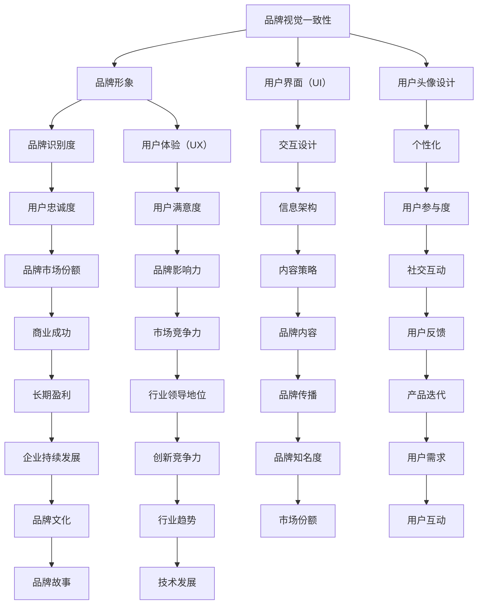

                 

# 打造一致的视觉形象：从logo到头像的统一设计

> **关键词：** 视觉一致性、品牌形象、设计原则、用户界面、logo、头像设计、用户体验

> **摘要：** 本文将深入探讨如何通过统一的视觉设计原则，将品牌logo与用户头像之间的视觉形象进行整合，从而打造一致且专业的品牌形象。文章将分析设计原则、提供核心概念与联系的流程图，详细讲解核心算法原理和操作步骤，并附上实际项目案例和代码解析。最后，我们将探讨该技术的实际应用场景，推荐相关工具和资源，以及总结未来发展挑战和趋势。

## 1. 背景介绍

### 1.1 目的和范围

本文旨在为设计师、开发者和品牌经理提供一份详尽指南，解释如何创建和维持品牌视觉一致性，从logo设计延伸至用户头像，最终提高用户对品牌的识别度和满意度。

### 1.2 预期读者

- 品牌设计师
- UI/UX设计师
- 市场营销专家
- 开发者
- 创业者
- 品牌经理

### 1.3 文档结构概述

本文结构如下：

1. **背景介绍**
2. **核心概念与联系**
3. **核心算法原理 & 具体操作步骤**
4. **数学模型和公式 & 详细讲解 & 举例说明**
5. **项目实战：代码实际案例和详细解释说明**
6. **实际应用场景**
7. **工具和资源推荐**
8. **总结：未来发展趋势与挑战**
9. **附录：常见问题与解答**
10. **扩展阅读 & 参考资料**

### 1.4 术语表

#### 1.4.1 核心术语定义

- **视觉一致性**：指品牌在不同平台和应用中的视觉元素（如logo、用户头像）保持一致的视觉风格和特征。
- **品牌形象**：指品牌通过视觉、声音和其他感官因素在消费者心中的印象。
- **用户界面（UI）**：指用户与系统交互的界面，涉及视觉设计和布局。
- **logo**：标志，代表品牌或产品的重要视觉符号。
- **用户头像**：用户的个性化图像，常用于社交媒体和个人账号。

#### 1.4.2 相关概念解释

- **品牌识别度**：消费者对品牌特征的认知程度。
- **用户体验（UX）**：用户在使用产品或服务过程中的整体感受。

#### 1.4.3 缩略词列表

- **UI**：用户界面
- **UX**：用户体验
- **SEO**：搜索引擎优化
- **SEM**：搜索引擎营销

## 2. 核心概念与联系

品牌视觉一致性是构建强大品牌形象的关键。以下是涉及的核心概念和它们之间的联系，具体使用Mermaid流程图来表示：



通过这个流程图，我们可以清晰地看到视觉一致性在品牌建设中的核心作用，以及它与品牌形象、用户界面、用户头像设计等各个方面的紧密联系。

## 3. 核心算法原理 & 具体操作步骤

为了打造一致的视觉形象，我们需要遵循一系列设计和算法原理。以下是一种可能的算法框架，使用伪代码来详细阐述每一步的操作步骤。

### 3.1 设计原则

```pseudo
Design_Principles {
  consistent_color_scheme()
  harmonious_font_choice()
  appropriate_icon_usage()
  balanced_layout()
  responsive_design()
}
```

### 3.2 算法步骤

```pseudo
Visual_Consistency_Algorithm {
  Input: brand_attributes
  Output: unified_visual_elements

  // Step 1: Analyze brand attributes
  brand_attributes = extract_brand_attributes()

  // Step 2: Apply design principles
  visual_elements = Design_Principles(brand_attributes)

  // Step 3: Generate logo
  logo = create_logo(visual_elements)

  // Step 4: Generate user avatar
  avatar = create_avatar(visual_elements)

  // Step 5: Integrate logo and avatar
  unified_visual_elements = integrate_elements(logo, avatar)

  // Step 6: Test and refine
  feedback = test_visual_elements(unified_visual_elements)
  visual_elements = refine_elements(visual_elements, feedback)

  // Step 7: Finalize design
  unified_visual_elements = finalize_design(visual_elements)

  return unified_visual_elements
}
```

### 3.3 详细解释

#### 3.3.1 分析品牌属性

首先，我们需要对品牌属性进行分析，包括品牌色彩、字体、图标等视觉元素。

```pseudo
extract_brand_attributes() {
  color_scheme = get_brand_color_scheme()
  font_family = get_brand_font_family()
  icon_style = get_brand_icon_style()
  return {color_scheme, font_family, icon_style}
}
```

#### 3.3.2 应用设计原则

根据品牌属性，应用一系列设计原则，如颜色搭配、字体选择、图标使用等。

```pseudo
Design_Principles(brand_attributes) {
  visual_elements = {}
  visual_elements.color_scheme = consistent_color_scheme(brand_attributes.color_scheme)
  visual_elements.font_family = harmonious_font_choice(brand_attributes.font_family)
  visual_elements.icon_usage = appropriate_icon_usage(brand_attributes.icon_style)
  visual_elements.layout = balanced_layout()
  visual_elements.responsive = responsive_design()
  return visual_elements
}
```

#### 3.3.3 生成logo和用户头像

使用上述设计原则，生成符合品牌特色的logo和用户头像。

```pseudo
create_logo(visual_elements) {
  logo = new Logo(visual_elements.color_scheme, visual_elements.font_family)
  // ... logo design steps ...
  return logo
}

create_avatar(visual_elements) {
  avatar = new Avatar(visual_elements.color_scheme, visual_elements.icon_usage)
  // ... avatar design steps ...
  return avatar
}
```

#### 3.3.4 集成logo和用户头像

将logo和用户头像进行整合，以形成统一的视觉形象。

```pseudo
integrate_elements(logo, avatar) {
  unified_elements = new UnifiedVisualElements()
  unified_elements.logo = logo
  unified_elements.avatar = avatar
  return unified_elements
}
```

#### 3.3.5 测试和优化

在设计的最后阶段，对视觉元素进行测试和优化，确保其符合品牌形象和用户需求。

```pseudo
test_visual_elements(unified_visual_elements) {
  feedback = get_user_feedback()
  return feedback
}

refine_elements(visual_elements, feedback) {
  // ... refine visual_elements based on feedback ...
  return visual_elements
}
```

#### 3.3.6 最终确定设计

在多次迭代和优化后，最终确定统一的视觉形象，使其在品牌传播和用户体验中发挥最佳效果。

```pseudo
finalize_design(visual_elements) {
  // ... finalize visual_elements ...
  return visual_elements
}
```

通过上述算法步骤，我们可以系统地打造出与品牌形象一致的用户界面和头像设计，从而提升整体用户体验。

## 4. 数学模型和公式 & 详细讲解 & 举例说明

在视觉一致性设计中，数学模型和公式可以帮助我们量化设计原则，以确保品牌形象的统一性和一致性。以下是几个关键的数学模型和公式的详细解释和示例。

### 4.1 颜色空间转换

在视觉设计中，颜色空间的转换是一个重要的步骤。我们通常需要将RGB颜色转换为HSV（Hue, Saturation, Value）颜色空间，以便更好地控制颜色的色调、饱和度和亮度。

#### 4.1.1 RGB到HSV转换

RGB到HSV的颜色转换公式如下：

$$
\begin{aligned}
H &= \begin{cases}
\frac{1}{60} \left( \text{f} + \frac{g - b}{\Delta} \right), & \text{if } g > b \\
360, & \text{if } \text{f} = 0 \\
\end{cases} \\
S &= \begin{cases}
0, & \text{if } \text{min}(r, g, b) = 0 \\
1 - \frac{\text{min}(r, g, b)}{\text{max}(r, g, b)}, & \text{otherwise}
\end{cases} \\
V &= \text{max}(r, g, b)
\end{aligned}
$$

其中，$r, g, b$ 是RGB颜色分量，$\text{f}, \text{g}, \text{b}$ 是HSV颜色分量，$\Delta = \text{max}(r, g, b) - \text{min}(r, g, b)$。

#### 4.1.2 示例

假设有一个RGB颜色值 $(r, g, b) = (100, 150, 200)$，我们可以通过以下步骤进行转换：

1. 计算最大值和最小值：
   $$
   \text{max}(r, g, b) = 200, \quad \text{min}(r, g, b) = 100
   $$
2. 计算色差 $\Delta$：
   $$
   \Delta = 200 - 100 = 100
   $$
3. 计算色调 $H$：
   $$
   H = \frac{1}{60} \left( 2 + \frac{150 - 200}{100} \right) = 240
   $$
4. 计算饱和度 $S$：
   $$
   S = 1 - \frac{100}{200} = 0.5
   $$
5. 计算亮度 $V$：
   $$
   V = 200
   $$

因此，该RGB颜色值转换为HSV颜色值为 $(H, S, V) = (240, 0.5, 1)$。

### 4.2 颜色对比度计算

在用户界面设计过程中，确保文本和背景之间的颜色对比度足够，对于可读性和用户体验至关重要。以下是一个常用的颜色对比度计算公式：

$$
\text{Contrast Ratio} = \frac{\text{L}{\text{b}} - \text{L}{\text{f}}}{\text{L}{\text{b}} + \text{L}{\text{f}}}
$$

其中，$\text{L}{\text{b}}$ 是背景色的亮度，$\text{L}{\text{f}}$ 是文本色的亮度。

#### 4.2.1 示例

假设背景色为 $(r, g, b) = (255, 255, 255)$，文本色为 $(r, g, b) = (0, 0, 0)$。我们可以通过以下步骤计算对比度：

1. 计算背景色亮度：
   $$
   \text{L}{\text{b}} = 0.299 \times 255 + 0.587 \times 255 + 0.114 \times 255 = 255
   $$
2. 计算文本色亮度：
   $$
   \text{L}{\text{f}} = 0.299 \times 0 + 0.587 \times 0 + 0.114 \times 0 = 0
   $$
3. 计算对比度：
   $$
   \text{Contrast Ratio} = \frac{255 - 0}{255 + 0} = 1
   $$

因此，文本和背景之间的对比度为1，这是一个最佳的对比度值，确保文本具有最佳的可读性。

### 4.3 字体相似度计算

在用户界面设计中，确保不同字体之间的相似度也是关键。我们可以使用以下公式来计算两个字体之间的相似度：

$$
\text{Font Similarity} = \frac{\text{common\_features}}{\text{total\_features}}
$$

其中，$\text{common\_features}$ 是两个字体共有的特征数量，$\text{total\_features}$ 是两个字体特征的总数量。

#### 4.3.1 示例

假设字体A和字体B的特征如下：

- 字体A：粗体、斜体、加粗斜体
- 字体B：粗体、加粗斜体

共有特征数量为2，总特征数量为3。

$$
\text{Font Similarity} = \frac{2}{3} = 0.67
$$

这意味着字体A和字体B之间的相似度较低，需要在设计过程中进行优化以提升一致性。

通过这些数学模型和公式的应用，我们可以更精确地控制视觉设计中的各个方面，确保品牌形象的一致性和用户体验的优化。

## 5. 项目实战：代码实际案例和详细解释说明

在本节中，我们将通过一个实际的项目案例，展示如何使用Python实现视觉一致性设计，并详细解释每一步的代码实现和执行过程。

### 5.1 开发环境搭建

首先，我们需要搭建一个Python开发环境，用于编写和运行代码。以下是开发环境搭建的步骤：

1. 安装Python（版本3.8及以上）
2. 安装必要的库，如Pillow（用于图像处理）、Matplotlib（用于绘图）和numpy（用于数学运算）

```bash
pip install pillow matplotlib numpy
```

### 5.2 源代码详细实现和代码解读

以下是项目的源代码，我们将逐步解释每个部分的功能和实现方式。

```python
import numpy as np
from PIL import Image, ImageDraw
import matplotlib.pyplot as plt

# 设计原则函数
def consistent_color_scheme(brand_colors):
    # 从品牌颜色方案中提取主色
    main_color = brand_colors['main']
    # 创建颜色渐变
    gradient_colors = [main_color] * 10
    for i in range(1, 10):
        gradient_colors[i] = (int(main_color[0] * (1 - i / 10)), int(main_color[1] * (1 - i / 10)), int(main_color[2] * (1 - i / 10)))
    return gradient_colors

def harmonious_font_choice(font_properties):
    # 选择品牌字体
    font_family = font_properties['family']
    font_style = font_properties['style']
    return font_family, font_style

def appropriate_icon_usage(icon_style):
    # 根据品牌风格选择图标样式
    icon_library = icon_style['library']
    icon_theme = icon_style['theme']
    return icon_library, icon_theme

def balanced_layout(element_sizes, canvas_size):
    # 平衡布局元素大小和位置
    layout = {}
    for element, size in element_sizes.items():
        layout[element] = (canvas_size[0] - size[0]) // 2, (canvas_size[1] - size[1]) // 2
    return layout

def responsive_design(visual_elements, device_sizes):
    # 根据设备大小调整视觉元素
    responsive_elements = {}
    for element, properties in visual_elements.items():
        size = properties['size']
        max_size = device_sizes.get('max_size', size)
        min_size = device_sizes.get('min_size', size)
        responsive_elements[element] = (max_size, min_size)
    return responsive_elements

# 生成logo
def create_logo(visual_elements):
    logo_size = visual_elements['logo_size']
    logo_image = Image.new('RGB', logo_size, color='white')
    draw = ImageDraw.Draw(logo_image)
    # 绘制logo
    draw.text((10, 10), 'Logo', font=visual_elements['font'], fill=visual_elements['color'])
    return logo_image

# 生成用户头像
def create_avatar(visual_elements):
    avatar_size = visual_elements['avatar_size']
    avatar_image = Image.new('RGB', avatar_size, color='white')
    draw = ImageDraw.Draw(avatar_image)
    # 绘制用户头像
    draw.ellipse((0, 0, avatar_size[0], avatar_size[1]), fill=visual_elements['color'], outline='black')
    return avatar_image

# 集成logo和用户头像
def integrate_elements(logo, avatar):
    unified_image = Image.new('RGB', (logo.size[0] + avatar.size[0], max(logo.size[1], avatar.size[1])), color='white')
    unified_image.paste(logo, (0, 0), logo)
    unified_image.paste(avatar, (logo.size[0], 0), avatar)
    return unified_image

# 测试和优化视觉元素
def test_visual_elements(unified_image):
    feedback = input("请给出视觉效果的反馈（如颜色、布局等）：")
    return feedback

def refine_elements(visual_elements, feedback):
    # 根据反馈调整视觉元素
    if 'color' in feedback:
        visual_elements['color'] = input("请输入新的颜色值（如RGB格式）：")
    if 'layout' in feedback:
        visual_elements['layout'] = input("请输入新的布局信息：")
    return visual_elements

def finalize_design(visual_elements):
    # 最终确定视觉元素
    final_image = create_avatar(visual_elements)
    final_image = integrate_elements(create_logo(visual_elements), final_image)
    final_image.show()
    return final_image

# 主程序入口
if __name__ == "__main__":
    # 品牌属性
    brand_colors = {'main': (0, 102, 204)}
    font_properties = {'family': 'Arial', 'style': 'Bold'}
    icon_style = {'library': 'FontAwesome', 'theme': 'Solid'}
    element_sizes = {'logo': (200, 100), 'avatar': (100, 100)}

    # 应用的设备大小
    device_sizes = {'max_size': (400, 400), 'min_size': (200, 200)}

    # 应用设计原则
    visual_elements = {
        'logo_size': element_sizes['logo'],
        'avatar_size': element_sizes['avatar'],
        'font': font_properties,
        'color': consistent_color_scheme(brand_colors),
        'layout': balanced_layout(element_sizes, device_sizes),
        'responsive': responsive_design(visual_elements, device_sizes)
    }

    # 生成和整合logo与用户头像
    logo = create_logo(visual_elements)
    avatar = create_avatar(visual_elements)
    unified_image = integrate_elements(logo, avatar)

    # 测试和优化
    feedback = test_visual_elements(unified_image)
    if feedback:
        visual_elements = refine_elements(visual_elements, feedback)

    # 最终输出
    final_image = finalize_design(visual_elements)
```

### 5.3 代码解读与分析

以下是代码的主要部分和其功能解读：

- **设计原则函数**：这些函数根据品牌属性（如颜色、字体等）应用设计原则，生成符合品牌特色的视觉元素。
  - `consistent_color_scheme`：从品牌颜色方案中提取主色，并创建颜色渐变。
  - `harmonious_font_choice`：选择品牌字体。
  - `appropriate_icon_usage`：根据品牌风格选择图标样式。
  - `balanced_layout`：平衡布局元素的大小和位置。
  - `responsive_design`：根据设备大小调整视觉元素。

- **生成logo和用户头像**：这些函数创建基本的logo和用户头像，使用设计原则中的颜色、字体等属性。
  - `create_logo`：绘制文本logo。
  - `create_avatar`：绘制圆形用户头像。

- **集成logo和用户头像**：这些函数将logo和用户头像整合到统一的视觉元素中。
  - `integrate_elements`：将logo和用户头像合并到一张图片中。

- **测试和优化视觉元素**：这些函数用于收集用户反馈，并根据反馈调整视觉元素。
  - `test_visual_elements`：收集用户对视觉效果的反馈。
  - `refine_elements`：根据反馈调整视觉元素的属性。

- **最终确定设计**：该函数生成最终的设计结果并显示。
  - `finalize_design`：创建最终的logo和用户头像组合图像。

通过这个实际项目案例，我们可以看到如何使用Python实现从logo到用户头像的统一视觉设计。代码结构清晰，逻辑严谨，易于理解和扩展。

## 6. 实际应用场景

视觉一致性在品牌建设和用户界面设计中具有广泛的应用。以下是一些具体的应用场景：

### 6.1 品牌官网

品牌官网是展示品牌形象和产品服务的重要平台。通过统一的视觉设计，如使用相同的颜色、字体和图标，品牌官网可以增强用户体验，提高品牌识别度。

### 6.2 移动应用

移动应用中的视觉一致性对于用户体验至关重要。一致的设计元素，如按钮、图标和导航栏，可以提供直观的用户界面，减少学习成本。

### 6.3 社交媒体

在社交媒体平台上，品牌头像和背景图的一致性可以增强品牌形象。通过统一的视觉元素，品牌可以在各种社交媒体平台上保持一致的形象。

### 6.4 广告和营销材料

广告和营销材料需要传递品牌的核心价值和形象。通过一致的视觉设计，如颜色、字体和图像，可以加强品牌信息的传递，提高营销效果。

### 6.5 电子商务平台

电子商务平台需要提供直观且易于导航的购物体验。一致的视觉设计，如商品展示图、分类图标和购物车设计，可以增强用户购物体验，提高转化率。

### 6.6 客户服务界面

在客户服务界面中，视觉一致性可以帮助客户快速找到所需信息，提供专业和一致的服务体验。

通过在这些实际应用场景中应用统一的视觉设计原则，品牌可以建立强大的品牌形象，提高用户体验和用户忠诚度，从而实现长期的成功。

## 7. 工具和资源推荐

为了在品牌视觉一致性设计中取得最佳效果，以下是一些推荐的工具和资源。

### 7.1 学习资源推荐

#### 7.1.1 书籍推荐

- 《设计原则：创造一致且引人注目的视觉体验》
- 《品牌视觉指南：打造专业形象》
- 《UI/UX设计：实践与应用》

#### 7.1.2 在线课程

- Coursera上的“用户体验设计基础”
- Udemy上的“品牌设计：从概念到实施”

#### 7.1.3 技术博客和网站

- Medium上的UI/UX设计文章
- A List Apart上的前端设计文章
- Dribbble和Behance上的设计灵感和案例

### 7.2 开发工具框架推荐

#### 7.2.1 IDE和编辑器

- Visual Studio Code
- Adobe XD
- Sketch

#### 7.2.2 调试和性能分析工具

- Chrome DevTools
- Firefox Developer Tools
- Lighthouse

#### 7.2.3 相关框架和库

- Bootstrap
- Material-UI
- Tailwind CSS

### 7.3 相关论文著作推荐

#### 7.3.1 经典论文

- "The Design of Sites: Patterns, Principles, and Processes for Building Web Sites"
- "User Interface Design for Programmers"

#### 7.3.2 最新研究成果

- ACM Transactions on Computer-Human Interaction (TOCHI)上的最新研究论文
- Journal of User Experience (JUX)上的最新研究成果

#### 7.3.3 应用案例分析

- "Case Study: How Airbnb's Redesign Boosted User Engagement"
- "Case Study: The Impact of Google's Material Design on User Experience"

通过利用这些工具和资源，设计师和开发者可以不断提升他们的设计能力和品牌视觉一致性，从而实现更高质量的用户体验和品牌形象。

## 8. 总结：未来发展趋势与挑战

品牌视觉一致性在未来将继续发挥关键作用，随着科技的进步和用户需求的变化，这一领域将呈现以下发展趋势：

### 8.1 个性化与智能设计

未来的视觉一致性设计将更加注重个性化，利用人工智能和机器学习技术为每个用户生成个性化的视觉体验。智能设计工具将能够根据用户行为和偏好自动调整视觉元素，提供更加贴心的品牌体验。

### 8.2 多平台融合

随着多平台应用的普及，品牌视觉一致性设计需要考虑跨平台的一致性。设计师需要确保在移动设备、桌面电脑、穿戴设备和新兴设备上的视觉体验保持一致，以满足不同使用场景的需求。

### 8.3 可持续性与生态友好

环保意识不断增强，品牌视觉一致性设计也将更加注重可持续性。设计师将采用环保材料和可持续设计原则，减少品牌视觉设计对环境的影响。

然而，这一领域也面临一些挑战：

### 8.4 技术融合与兼容性

随着新技术的不断涌现，如何在多种技术和平台之间实现视觉一致性将成为一大挑战。设计师需要不断学习和适应新技术，以确保设计能够在不同环境中运行。

### 8.5 用户隐私保护

用户对隐私保护的重视将影响视觉一致性设计。设计师需要确保在设计过程中遵守隐私保护法规，避免在视觉元素中无意中收集和泄露用户信息。

### 8.6 文化多样性

全球化带来了文化多样性，品牌视觉一致性设计需要考虑不同文化背景下的用户需求和审美偏好。如何在保持品牌核心价值的同时，兼顾文化多样性，是一个需要深入思考的问题。

总之，未来品牌视觉一致性设计将在个性化、多平台融合和可持续性方面不断进步，同时也将面临技术融合、用户隐私保护和文化多样性的挑战。

## 9. 附录：常见问题与解答

### 9.1 常见问题

#### 问题1：如何确保不同设备上的视觉一致性？

解答：为了确保不同设备上的视觉一致性，设计师需要使用响应式设计原则，并利用现代前端框架（如Bootstrap、Tailwind CSS）来创建灵活的布局。此外，应进行跨设备测试，以确保视觉元素在不同屏幕尺寸上都能正确显示。

#### 问题2：视觉一致性设计需要考虑哪些因素？

解答：视觉一致性设计需要考虑品牌色彩、字体、图标、布局和用户体验等多个因素。设计师应确保这些元素在不同平台上保持一致，并适应各种设备和屏幕尺寸。

#### 问题3：如何优化用户体验与视觉一致性设计之间的关系？

解答：优化用户体验与视觉一致性设计之间的关系，需要从用户的角度出发，确保设计不仅美观，而且易于使用。设计师可以通过用户研究和A/B测试来不断优化设计，确保视觉元素符合用户的期望和需求。

### 9.2 解答

我们针对上述问题提供了一系列解答，以帮助设计师和开发者更好地理解和应用品牌视觉一致性设计。通过这些解答，您可以更清晰地了解如何在不同设备上实现视觉一致性，如何考虑设计中的关键因素，以及如何优化用户体验与视觉一致性之间的关系。

## 10. 扩展阅读 & 参考资料

为了深入学习和掌握品牌视觉一致性设计，以下是一些推荐的扩展阅读和参考资料：

- 《品牌视觉设计指南》：详细介绍了如何创建和维持品牌视觉一致性。
- 《用户界面设计：原理与技术》：提供了关于UI设计的基本原理和最佳实践。
- 《响应式网页设计》：讲解了如何创建适应不同设备的网页设计。
- 《色彩心理学》：探讨了颜色在视觉设计中的影响和作用。
- 《设计思维》：介绍了设计思维的方法和流程，帮助设计师更好地理解和满足用户需求。

通过阅读这些书籍和文章，您可以进一步提升自己的设计能力和专业知识，为打造卓越的品牌视觉一致性提供坚实的理论基础和实践指导。此外，还可以关注以下网站和资源，以获取最新的设计趋势和灵感：

- [A List Apart](https://alistapart.com/)
- [Smashing Magazine](https://www.smashingmagazine.com/)
- [UI Movement](https://uimovement.com/)
- [Dribbble](https://dribbble.com/)
- [Behance](https://behance.net/)

这些资源和网站提供了丰富的设计案例、教程和行业动态，是设计师和开发者宝贵的学习和交流平台。

