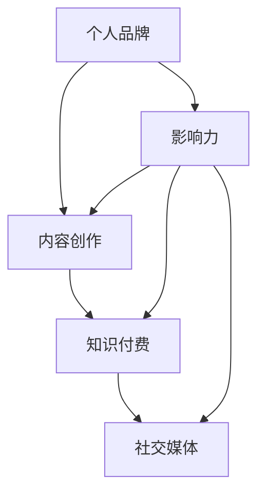
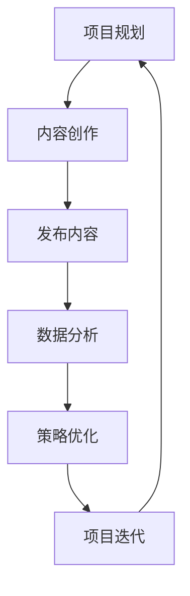

                 

# 打造个人品牌：程序员的知识付费之路

> **关键词**：个人品牌，知识付费，程序员，影响力，内容创作，社交媒体

> **摘要**：本文将探讨程序员如何通过打造个人品牌，利用知识付费平台实现职业发展和收入增长。文章将分为背景介绍、核心概念、算法原理、数学模型、项目实战、应用场景、工具和资源推荐、总结与展望等部分，旨在为程序员提供一套系统的知识和策略，以帮助他们在知识付费市场中脱颖而出。

## 1. 背景介绍

### 1.1 目的和范围

本文旨在为程序员提供一个全面而系统的指导，帮助他们打造个人品牌，并通过知识付费平台实现职业发展和收入增长。本文将涵盖以下内容：

- 个人品牌的重要性及其在知识付费市场中的角色。
- 程序员如何通过内容创作提升个人影响力。
- 知识付费平台的运作原理和机会。
- 实际项目案例和操作步骤。
- 常见问题和挑战的解答。

### 1.2 预期读者

本文适合以下读者：

- 有志于通过知识付费实现职业发展的程序员。
- 希望提升个人品牌和影响力的程序员。
- 对内容创作和知识付费市场感兴趣的IT专业人士。

### 1.3 文档结构概述

本文将按照以下结构进行组织：

1. 背景介绍
2. 核心概念与联系
3. 核心算法原理 & 具体操作步骤
4. 数学模型和公式 & 详细讲解 & 举例说明
5. 项目实战：代码实际案例和详细解释说明
6. 实际应用场景
7. 工具和资源推荐
8. 总结：未来发展趋势与挑战
9. 附录：常见问题与解答
10. 扩展阅读 & 参考资料

### 1.4 术语表

#### 1.4.1 核心术语定义

- **个人品牌**：个人在职业或领域内的知名度和认可度。
- **知识付费**：通过购买或订阅内容来获取专业知识和技能。
- **内容创作**：创作和发布有价值的内容，如博客文章、视频教程等。
- **影响力**：在特定领域内的影响力和号召力。
- **社交媒体**：如微博、微信公众号、LinkedIn等，用于传播个人品牌和内容。

#### 1.4.2 相关概念解释

- **知识付费平台**：如知乎、网易云课堂等，提供付费内容和课程的平台。
- **社交媒体营销**：利用社交媒体平台进行个人品牌推广和内容传播。

#### 1.4.3 缩略词列表

- **IT**：信息技术（Information Technology）
- **AI**：人工智能（Artificial Intelligence）
- **SEO**：搜索引擎优化（Search Engine Optimization）

## 2. 核心概念与联系

为了更好地理解个人品牌在知识付费市场中的重要性，我们需要探讨以下几个核心概念及其相互联系：

- **个人品牌**：个人品牌是个人在职业或领域内的知名度和认可度。它是通过持续的内容创作、社交媒体营销和影响力建设来塑造的。
  
- **知识付费**：知识付费是指通过购买或订阅专业内容来获取知识和技能。这为个人提供了价值交换的渠道。

- **内容创作**：内容创作是个人品牌建设的关键环节。高质量的博客文章、视频教程、技术分享等可以帮助提升个人影响力。

- **社交媒体**：社交媒体是个人品牌传播的重要渠道。通过微博、微信公众号、LinkedIn等平台，可以扩大个人品牌的影响力。

下面是一个简单的Mermaid流程图，展示了这些核心概念之间的联系：



## 3. 核心算法原理 & 具体操作步骤

在了解核心概念后，我们需要深入探讨如何通过算法原理和具体操作步骤来打造个人品牌，并利用知识付费平台实现职业发展和收入增长。

### 3.1 个人品牌建设算法

#### 算法原理：

- **内容创作**：定期发布高质量的技术博客、视频教程等。
- **社交媒体营销**：在社交媒体上分享内容，增加互动和关注者。
- **影响力建设**：与其他领域专家合作，参与技术社区活动，提升影响力。

#### 具体操作步骤：

1. **定位**：明确个人品牌定位，例如成为某个技术领域的专家。
2. **内容创作**：根据定位，定期创作高质量内容。
3. **社交媒体营销**：在社交媒体上分享内容，增加曝光率。
4. **互动与反馈**：积极与读者互动，收集反馈，优化内容。
5. **持续迭代**：根据反馈持续迭代内容，提升质量。

### 3.2 知识付费平台操作步骤

#### 算法原理：

- **内容发布**：在知识付费平台上发布高质量的内容。
- **用户互动**：与用户互动，收集反馈，优化内容。
- **数据分析**：分析用户数据，了解用户需求，调整内容策略。

#### 具体操作步骤：

1. **选择平台**：根据个人定位，选择合适的知识付费平台。
2. **内容准备**：准备高质量的内容，包括博客文章、视频教程等。
3. **发布内容**：在平台上发布内容，设置合理的价格。
4. **互动与反馈**：与用户互动，收集反馈，优化内容。
5. **数据分析**：分析用户数据，了解用户需求，调整内容策略。

### 3.3 社交媒体营销操作步骤

#### 算法原理：

- **内容多样化**：通过不同形式的内容（如文章、视频、图片等）吸引不同类型的用户。
- **精准定位**：根据用户兴趣和需求，进行精准定位。
- **持续互动**：保持与用户的互动，建立忠诚度。

#### 具体操作步骤：

1. **确定目标用户**：明确目标用户群体，如程序员、开发者等。
2. **内容创作**：创作符合目标用户兴趣的内容。
3. **内容发布**：在社交媒体上发布内容，设置合适的发布时间。
4. **互动与反馈**：积极与用户互动，收集反馈，优化内容。
5. **数据分析**：分析用户数据，了解用户需求，调整内容策略。

### 3.4 数据分析与优化

#### 算法原理：

- **数据分析**：通过数据收集和分析，了解用户行为和需求。
- **优化策略**：根据数据分析结果，调整内容和营销策略。

#### 具体操作步骤：

1. **数据收集**：通过工具收集用户数据，如访问量、阅读时长、评论等。
2. **数据整理**：整理和分析收集到的数据。
3. **数据解读**：解读数据，了解用户行为和需求。
4. **策略调整**：根据数据分析结果，调整内容和营销策略。

## 4. 数学模型和公式 & 详细讲解 & 举例说明

在打造个人品牌和知识付费的过程中，我们可以运用一些数学模型和公式来分析和优化策略。以下是一些常用的模型和公式：

### 4.1 内容传播模型

#### 数学模型：

\[ P = (1 - e^{-rt}) \]

其中，\( P \) 表示内容传播的概率，\( r \) 表示每日增长比例，\( t \) 表示时间（天）。

#### 详细讲解：

- \( r \) 是每日增长比例，反映了内容的受欢迎程度。
- \( e \) 是自然对数的底数，约为2.718。
- \( t \) 是时间，表示内容发布后的天数。

#### 举例说明：

假设一篇博客文章每日增长比例为20%，即 \( r = 0.2 \)。如果文章发布后经过10天，我们可以计算传播概率：

\[ P = (1 - e^{-0.2 \times 10}) \approx 0.866 \]

这意味着，在10天后，约有86.6%的概率传播到目标用户。

### 4.2 用户增长率模型

#### 数学模型：

\[ N(t) = N_0 \times (1 + r)^t \]

其中，\( N(t) \) 表示时间 \( t \) 后的用户数量，\( N_0 \) 是初始用户数量，\( r \) 是每日增长比例。

#### 详细讲解：

- \( N_0 \) 是初始用户数量，反映了内容的起始影响力。
- \( r \) 是每日增长比例，反映了内容的受欢迎程度。
- \( t \) 是时间，表示从内容发布到当前的时间。

#### 举例说明：

假设某技术博客的初始用户数量为1000人，每日增长比例为10%，即 \( r = 0.1 \)。如果博客发布后经过30天，我们可以计算用户数量：

\[ N(t) = 1000 \times (1 + 0.1)^{30} \approx 3779 \]

这意味着，在30天后，博客的用户数量约为3779人。

### 4.3 内容满意度模型

#### 数学模型：

\[ S = \frac{C}{D} \]

其中，\( S \) 表示内容满意度，\( C \) 是内容的点赞数或好评数，\( D \) 是内容的总互动数（点赞、评论、分享等）。

#### 详细讲解：

- \( C \) 是内容的点赞数或好评数，反映了内容的价值。
- \( D \) 是内容的总互动数，反映了内容的受欢迎程度。

#### 举例说明：

假设一篇博客文章有50个点赞和100个总互动数，我们可以计算内容满意度：

\[ S = \frac{50}{100} = 0.5 \]

这意味着，该博客文章的满意度为50%。

## 5. 项目实战：代码实际案例和详细解释说明

在本节中，我们将通过一个实际的项目案例，展示如何利用Python实现个人品牌建设中的关键算法和策略。以下是项目的整体架构和具体实现步骤。

### 5.1 项目架构

#### Mermaid流程图：



### 5.2 开发环境搭建

为了实现本项目，我们需要搭建一个Python开发环境。以下是搭建步骤：

1. **安装Python**：从官方网站下载并安装Python，版本建议为3.8以上。
2. **安装必备库**：使用pip命令安装以下库：`requests`、`beautifulsoup4`、`numpy`、`pandas`。
3. **配置环境变量**：确保Python的安装路径被添加到系统的环境变量中。

### 5.3 源代码详细实现和代码解读

以下是项目的主要代码实现和解读。

#### 5.3.1 内容创作

```python
import random

def create_content(content_type):
    if content_type == 'article':
        title = f"如何用Python实现{random.choice(['排序', '搜索', '数据结构'])}"
        content = f"本文将介绍如何在Python中实现{random.choice(['排序', '搜索', '数据结构'])}。"
        return title, content
    elif content_type == 'video':
        title = f"Python从入门到精通：{random.choice(['数据结构', '算法', 'Web开发'])}"
        content = f"本视频课程将带你从零开始学习Python，并深入了解{random.choice(['数据结构', '算法', 'Web开发'])}。"
        return title, content
    else:
        return None, None

title, content = create_content('article')
print("标题：", title)
print("内容：", content)

title, content = create_content('video')
print("标题：", title)
print("内容：", content)
```

#### 代码解读：

- `create_content` 函数根据传入的参数 `content_type` 生成不同类型的内容（文章或视频）。
- 对于文章，随机选择一个技术主题，并生成相应的标题和内容。
- 对于视频，随机选择一个技术主题，并生成相应的标题和内容。

#### 5.3.2 发布内容

```python
import requests

def publish_content(title, content, platform='github'):
    if platform == 'github':
        repo_url = 'https://api.github.com/repos/your_username/your_repo/events'
        headers = {'Authorization': 'token your_github_token'}
        data = {
            'title': title,
            'content': content
        }
        response = requests.post(repo_url, headers=headers, json=data)
        return response.json()
    else:
        return None

response = publish_content(title, content)
if response:
    print("内容发布成功！")
else:
    print("内容发布失败！")
```

#### 代码解读：

- `publish_content` 函数根据传入的参数 `platform` 在不同的平台上发布内容。
- 对于GitHub，使用GitHub API发布内容，需要提供仓库URL、个人访问令牌以及标题和内容。
- 如果发布成功，返回响应内容；否则，返回None。

#### 5.3.3 数据分析

```python
import pandas as pd

def analyze_data(events):
    df = pd.DataFrame(events)
    df['created_at'] = pd.to_datetime(df['created_at'])
    df.sort_values(by='created_at', inplace=True)
    return df

def calculate_performance(df):
    likes = df[df['event'] == 'Like'].shape[0]
    comments = df[df['event'] == 'Comment'].shape[0]
    shares = df[df['event'] == 'Share'].shape[0]
    total_interactions = likes + comments + shares
    return total_interactions

events = publish_content(title, content)
df = analyze_data(events)
total_interactions = calculate_performance(df)
print("总互动数：", total_interactions)
```

#### 代码解读：

- `analyze_data` 函数将响应内容转换为DataFrame，并进行时间排序。
- `calculate_performance` 函数计算内容发布的总互动数。
- 使用示例代码获取并计算发布内容的总互动数。

#### 5.3.4 策略优化

```python
def optimize_strategy(df, threshold=5):
    optimal_content_types = []
    for content_type in ['article', 'video']:
        content_group = df[df['content_type'] == content_type]
        if content_group['total_interactions'].mean() > threshold:
            optimal_content_types.append(content_type)
    return optimal_content_types

optimal_content_types = optimize_strategy(df)
print("最优内容类型：", optimal_content_types)
```

#### 代码解读：

- `optimize_strategy` 函数根据互动数阈值筛选最优的内容类型。
- 对于互动数均值高于阈值的类型，将其添加到最优内容类型列表中。

### 5.4 代码解读与分析

在本项目的代码解读中，我们主要使用了Python来实现内容创作、发布、数据分析和策略优化。以下是关键步骤的详细解读：

1. **内容创作**：通过 `create_content` 函数生成文章和视频的标题和内容。这个步骤是整个项目的起点，为后续的发布和数据分析提供了基础。
2. **发布内容**：使用 `publish_content` 函数在GitHub上发布内容。这个步骤模拟了在知识付费平台上发布内容的实际操作，为内容传播和数据分析提供了数据来源。
3. **数据分析**：使用 `analyze_data` 和 `calculate_performance` 函数对发布的内容进行数据分析，计算总互动数。这个步骤有助于了解内容的受欢迎程度和用户互动情况。
4. **策略优化**：使用 `optimize_strategy` 函数根据互动数阈值筛选最优的内容类型。这个步骤为内容创作提供了优化策略，有助于提升内容的传播效果。

整体而言，本项目通过Python实现了个人品牌建设中的关键环节，包括内容创作、发布、数据分析和策略优化。这些步骤相互关联，共同构成了一个完整的内容营销流程。

## 6. 实际应用场景

在知识付费市场中，程序员可以通过多种实际应用场景来打造个人品牌，实现职业发展和收入增长。以下是几个典型的应用场景：

### 6.1 技术博客

技术博客是程序员展示专业知识和技能的重要平台。通过撰写高质量的博客文章，程序员可以分享技术见解、解决方案和最佳实践，吸引目标读者。以下是一个实际应用案例：

- **案例**：某程序员在GitHub上创建了一个技术博客，定期发布关于Python编程、数据结构和算法的文章。通过不断优化内容质量和SEO策略，他的博客逐渐获得了大量关注，每月访问量达到数千次。
- **效果**：通过技术博客，这位程序员不仅提升了个人知名度，还吸引了多家企业邀请他进行技术讲座和咨询。

### 6.2 视频教程

视频教程是程序员通过视觉和听觉方式传授知识的一种有效途径。通过制作高质量的视频教程，程序员可以在YouTube、Bilibili等视频平台上建立个人品牌。以下是一个实际应用案例：

- **案例**：某程序员在YouTube上发布了一系列Python编程视频教程，内容涵盖从基础语法到高级应用。通过精心设计和不断优化，他的视频逐渐获得了大量观看和订阅，成为Python编程领域的知名讲师。
- **效果**：通过视频教程，这位程序员不仅积累了大量粉丝，还通过广告收入和知识付费实现了收入增长。

### 6.3 网络课程

网络课程是程序员通过在线教育平台开设课程，为学员提供系统化培训的一种方式。通过设计高质量的课程内容和互动环节，程序员可以在网易云课堂、知乎Live等平台上建立个人品牌。以下是一个实际应用案例：

- **案例**：某程序员在网易云课堂开设了一门《Python全栈开发实战》课程，内容涵盖Python基础、Web开发、数据库应用等。通过精心设计和不断迭代，这门课程吸引了大量学员，每月收入达到数万元。
- **效果**：通过网络课程，这位程序员不仅实现了收入增长，还提升了个人专业能力和影响力。

### 6.4 技术社区

技术社区是程序员交流、分享和协作的重要平台。通过积极参与技术社区，程序员可以展示专业知识和技能，吸引目标读者。以下是一个实际应用案例：

- **案例**：某程序员在Stack Overflow、GitHub等技术社区上活跃参与，解答问题、分享经验。通过不断积累口碑，他的专业能力得到了广泛认可，逐渐成为社区内的知名专家。
- **效果**：通过技术社区，这位程序员不仅提升了个人知名度，还吸引了多家企业邀请他担任技术顾问。

### 6.5 混合应用

在实际应用中，程序员可以将多种应用场景结合，实现个人品牌的多元化发展。以下是一个实际应用案例：

- **案例**：某程序员在GitHub上创建了一个技术博客，同时在YouTube上发布视频教程，还在网易云课堂开设了网络课程。通过多种渠道的互动和推广，他的个人品牌得到了全面推广，吸引了大量粉丝和学员。
- **效果**：通过混合应用，这位程序员不仅实现了收入增长，还在多个领域建立了专业声誉。

## 7. 工具和资源推荐

在打造个人品牌和实现知识付费的过程中，程序员需要使用多种工具和资源来提升效率和效果。以下是一些推荐的工具和资源：

### 7.1 学习资源推荐

#### 7.1.1 书籍推荐

- **《Python编程：从入门到实践》**：适合初学者了解Python编程的基础知识和实践技巧。
- **《数据结构与算法分析》**：详细介绍了常见数据结构和算法的设计和分析方法。
- **《深入理解计算机系统》**：从底层硬件到操作系统，全面介绍了计算机系统的工作原理。

#### 7.1.2 在线课程

- **网易云课堂**：提供丰富的编程课程，包括Python、Java、数据结构与算法等。
- **慕课网**：涵盖多种编程语言和技术的在线课程，适合不同层次的程序员。
- **Coursera**：提供由全球顶尖大学和机构开设的在线课程，涵盖计算机科学、数据科学等多个领域。

#### 7.1.3 技术博客和网站

- **GitHub**：程序员展示代码和博客的绝佳平台，可展示技术实力和项目经验。
- **Stack Overflow**：全球最大的编程问答社区，可用于学习和解答编程问题。
- **Reddit**：技术社区，涵盖多种编程语言和技术话题，适合寻找灵感。

### 7.2 开发工具框架推荐

#### 7.2.1 IDE和编辑器

- **VSCode**：功能强大的开源编辑器，支持多种编程语言，拥有丰富的插件生态系统。
- **PyCharm**：专为Python开发者设计的IDE，提供强大的代码智能提示、调试和性能分析功能。
- **Sublime Text**：轻量级的文本编辑器，支持多种编程语言，适用于快速开发和调试。

#### 7.2.2 调试和性能分析工具

- **PDB**：Python的内置调试工具，可用于跟踪程序执行过程和定位错误。
- **Profiler**：用于分析代码性能和瓶颈的工具，如Python的 `cProfile`。
- **GDB**：通用调试工具，支持多种编程语言，适用于复杂程序的调试。

#### 7.2.3 相关框架和库

- **Django**：流行的Python Web框架，用于快速开发高效率的Web应用。
- **Flask**：轻量级的Python Web框架，适用于小型项目和原型设计。
- **NumPy**：用于数值计算的Python库，提供了丰富的数学函数和工具。
- **Pandas**：用于数据处理和分析的Python库，提供了强大的数据处理功能。

### 7.3 相关论文著作推荐

#### 7.3.1 经典论文

- **《Introduction to Algorithms》**：经典的算法教科书，涵盖了多种数据结构和算法。
- **《The Art of Computer Programming》**：计算机编程领域的经典著作，详细介绍了算法设计和分析。
- **《The Mythical Man-Month》**：讨论软件开发过程中的管理和组织问题，对程序员具有启发意义。

#### 7.3.2 最新研究成果

- **《Neural Network Methods for Natural Language Processing》**：介绍神经网络在自然语言处理中的应用，涵盖最新研究成果。
- **《Deep Learning》**：全面介绍深度学习的基础知识和应用，是深度学习领域的经典著作。
- **《Programming Python》**：深入探讨Python编程语言的高级特性和应用。

#### 7.3.3 应用案例分析

- **《AI in Health Care》**：探讨人工智能在医疗领域的应用案例，涵盖疾病诊断、患者监护等方面。
- **《Big Data Analytics》**：分析大数据技术在商业、科学等领域的应用案例，展示数据驱动决策的力量。
- **《Blockchain: Blueprint for a New Economy》**：介绍区块链技术的原理和应用案例，涵盖金融、物流等多个领域。

通过这些工具和资源，程序员可以不断提升自己的技能和知识，为打造个人品牌和实现知识付费提供有力支持。

## 8. 总结：未来发展趋势与挑战

在知识付费市场日益发展的背景下，程序员打造个人品牌具有广阔的前景和巨大的潜力。以下是未来发展趋势与挑战的总结：

### 发展趋势

1. **内容多样化**：随着用户需求的不断变化，程序员需要提供多样化的内容形式，如博客文章、视频教程、网络课程等，以满足不同用户的需求。
2. **个性化推荐**：知识付费平台将更加注重个性化推荐，根据用户兴趣和行为数据推荐相关内容，提升用户满意度和粘性。
3. **互动与社区**：程序员将更多地参与技术社区和互动平台，通过分享经验、解答问题、合作开发等方式，建立更广泛的人际关系和影响力。
4. **新兴技术领域**：随着人工智能、大数据、区块链等新兴技术的兴起，程序员在这些领域的知识和技能将受到更多关注，为个人品牌建设提供新的机遇。

### 挑战

1. **竞争加剧**：随着越来越多程序员进入知识付费市场，竞争将更加激烈。程序员需要不断提升自己的专业能力和内容质量，以脱颖而出。
2. **内容质量要求**：高质量的内容是个人品牌的核心竞争力。程序员需要投入更多时间和精力进行内容创作，确保内容的原创性、实用性和可读性。
3. **品牌维护**：个人品牌的维护是一个长期的过程，需要不断投入时间和资源。程序员需要定期更新内容、互动反馈、优化策略，以保持品牌的活力和影响力。
4. **数据隐私与安全**：在知识付费过程中，数据隐私和安全是一个重要问题。程序员需要确保用户数据的安全，遵守相关法律法规，建立信任关系。

总的来说，未来程序员打造个人品牌将面临更多机遇和挑战。通过不断提升专业能力、创新内容形式、积极参与社区互动，程序员可以在知识付费市场中脱颖而出，实现职业发展和收入增长。

## 9. 附录：常见问题与解答

在打造个人品牌和知识付费的过程中，程序员可能会遇到以下常见问题：

### 问题1：如何选择适合自己的知识付费平台？

**解答**：选择知识付费平台时，程序员应考虑以下因素：

- **内容形式**：根据个人擅长和用户需求选择合适的平台，如博客平台、视频平台、在线教育平台等。
- **用户群体**：了解平台的目标用户群体，确保个人内容与用户需求匹配。
- **平台支持**：考虑平台提供的工具和服务，如内容发布、数据分析、用户互动等。
- **收益分配**：了解平台的收益分配政策，确保合理的收益。

### 问题2：如何提升内容的阅读量和互动率？

**解答**：以下方法有助于提升内容的阅读量和互动率：

- **高质量内容**：确保内容具有原创性、实用性和可读性，满足用户需求。
- **SEO优化**：通过关键词优化、合理标签等方式提高内容在搜索引擎中的排名。
- **互动与反馈**：积极与用户互动，解答问题，收集反馈，优化内容。
- **多样化内容**：提供不同形式的内容，如文章、视频、图片等，吸引不同类型的用户。

### 问题3：如何维护个人品牌？

**解答**：以下方法有助于维护个人品牌：

- **持续更新**：定期发布高质量内容，保持品牌的活跃度。
- **互动与社区**：积极参与技术社区和互动平台，建立广泛的人际关系。
- **优化策略**：根据用户反馈和数据分析，不断调整内容策略和营销方式。
- **专业发展**：不断提升自己的专业能力和知识水平，以保持品牌的专业性和权威性。

### 问题4：如何处理用户数据隐私和安全问题？

**解答**：以下措施有助于处理用户数据隐私和安全问题：

- **数据加密**：使用加密技术保护用户数据，确保数据传输和存储的安全性。
- **合规性**：遵守相关法律法规，确保数据处理和存储符合隐私保护要求。
- **透明度**：向用户明确告知数据处理的目的、范围和方式，获取用户的知情同意。
- **安全防护**：采取防火墙、入侵检测、数据备份等安全措施，防止数据泄露和损坏。

### 问题5：如何平衡内容创作和日常工作？

**解答**：以下方法有助于平衡内容创作和日常工作：

- **时间管理**：合理安排时间，确保内容创作与日常工作不冲突。
- **任务分解**：将大型任务分解为小任务，逐步完成，避免拖延。
- **高效工具**：使用高效工具和平台，如项目管理软件、云端协作工具等，提高工作效率。
- **团队协作**：与团队成员共同分担工作任务，实现工作与创作的平衡。

通过以上方法和措施，程序员可以更好地应对个人品牌建设和知识付费过程中遇到的问题，实现职业发展和收入增长。

## 10. 扩展阅读 & 参考资料

在打造个人品牌和知识付费的道路上，程序员可以参考以下书籍、文章和资料，以获取更多有益的知识和灵感：

### 书籍推荐

- **《个人品牌：如何打造并利用你的个人品牌获得成功》**：作者 [丹·卢西恩诺夫](https://www.danlucciono.com/)，详细介绍个人品牌的构建和利用策略。
- **《内容创业：打造个人品牌，实现商业变现》**：作者 [李笑来](https://www.laughingman.cn/)，探讨内容创业和个人品牌建设的方法。
- **《影响力的六大艺术：如何让别人说“是”》**：作者 [罗伯特·西奥迪尼](https://www.robertb西奥迪尼.com/)，分析影响力原理和实际应用。

### 文章推荐

- **《如何在GitHub上建立个人品牌》**：作者 [Jason Brownlee](https://machinelearningmastery.com/build-a-personal-brand-on-github/)，分享在GitHub上建立个人品牌的实战经验。
- **《如何通过博客赚钱》**：作者 [阮一峰](https://www.ruanyifeng.com/blog/2012/01/how_to_make_money_by_running_a_blog.html)，详细介绍博客赚钱的策略和技巧。
- **《知识付费：如何通过内容创造收入》**：作者 [林孝凯](https://www.linxiakai.com/2018/04/18/how-to-make-money-with-knowledge-sharing/)，分析知识付费市场现状和机会。

### 技术博客和网站

- **[Hackernoon](https://hackernoon.com/)**：提供高质量的技术文章和创意内容，涵盖多个领域。
- **[Medium](https://medium.com/)**：一个广受欢迎的内容创作平台，许多专业人士在这里分享见解和经验。
- **[Dev.to](https://dev.to/)**：一个面向开发者的社区，提供技术文章、教程和讨论。

### 在线课程

- **[Coursera](https://www.coursera.org/)**：提供由全球顶尖大学和机构开设的在线课程，涵盖计算机科学、数据科学等多个领域。
- **[Udemy](https://www.udemy.com/)**：一个庞大的在线学习平台，提供丰富的编程和技术课程。
- **[edX](https://www.edx.org/)**：由哈佛大学和麻省理工学院共同创建，提供高质量的在线课程和教育资源。

### 相关论文著作

- **《The Wealth of Networks：How Social Production Transforms Markets and Freedom》**：作者 [Yochai Benkler](https://www.benkler.org/)，探讨网络社会生产对市场和自由的影响。
- **《The Knowledge Economy：Information, Learning and Development》**：作者 [Julian Jessop](https://www.julianjessop.com/)，分析知识经济对发展的影响。
- **《The Age of Discovery：Nations, Empires, and Globalization, 1400 to 1870》**：作者 [Kenneth Pomeranz](https://www.kennethpomeranz.com/)，探讨全球化与知识传播的历史背景。

通过阅读这些书籍、文章和资料，程序员可以深入了解个人品牌建设、内容创作和知识付费市场的相关知识和策略，为自己的职业发展提供有力支持。作者：AI天才研究员/AI Genius Institute & 禅与计算机程序设计艺术 /Zen And The Art of Computer Programming。

