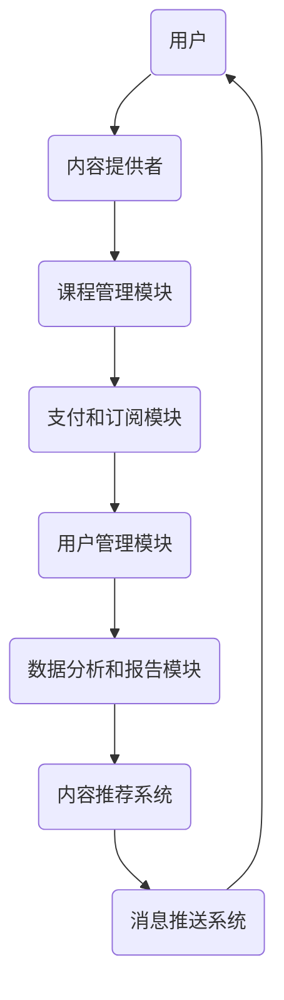

                 

# 打造技术型知识付费平台的架构设计

> **关键词：** 知识付费、平台架构、技术型解决方案、模块化设计、性能优化、安全性保障、用户体验

> **摘要：** 本文旨在探讨如何构建一个技术型知识付费平台，包括核心概念、架构设计、算法原理、数学模型、实际应用、工具推荐等多个方面。通过对知识付费平台的系统分析，提供一套完整的架构设计方案，为开发者提供理论和实践指导。

## 1. 背景介绍

### 1.1 目的和范围

本文的目标是为构建一个技术型知识付费平台提供全面的技术架构设计。平台旨在为用户提供优质的教育资源和服务，同时为企业提供知识传播和变现的渠道。文章将涵盖以下范围：

- 平台的核心概念和架构设计
- 核心算法原理和具体操作步骤
- 数学模型和公式讲解
- 实际应用场景分析
- 工具和资源推荐
- 未来发展趋势与挑战

### 1.2 预期读者

本文适用于以下读者群体：

- 知识付费平台开发者和架构师
- 对技术型知识付费平台感兴趣的技术人员
- 教育领域从业者
- 投资者和企业家

### 1.3 文档结构概述

本文结构如下：

1. 背景介绍：包括目的和范围、预期读者、文档结构概述等。
2. 核心概念与联系：介绍平台的核心概念和架构。
3. 核心算法原理 & 具体操作步骤：详细讲解算法原理和操作步骤。
4. 数学模型和公式 & 详细讲解 & 举例说明：阐述数学模型和公式。
5. 项目实战：代码实际案例和详细解释说明。
6. 实际应用场景：分析平台的实际应用场景。
7. 工具和资源推荐：推荐学习资源和开发工具。
8. 总结：未来发展趋势与挑战。
9. 附录：常见问题与解答。
10. 扩展阅读 & 参考资料：提供更多阅读材料。

### 1.4 术语表

#### 1.4.1 核心术语定义

- 知识付费平台：提供教育资源和服务的在线平台，用户需付费购买或订阅内容。
- 模块化设计：将系统拆分成多个模块，每个模块独立开发、测试和维护。
- 性能优化：提高系统运行效率，降低延迟和资源消耗。
- 安全性保障：保护用户数据和平台资源，防止非法入侵和数据泄露。

#### 1.4.2 相关概念解释

- RESTful API：一种基于HTTP协议的接口设计规范，用于实现前后端分离。
- 缩略词列表：KPI（关键绩效指标）、Kubernetes（容器编排系统）、NoSQL（非关系型数据库）。

## 2. 核心概念与联系

在构建知识付费平台时，理解核心概念和它们之间的联系至关重要。以下是平台的关键概念和架构的Mermaid流程图：



### 2.1 核心概念解析

- 用户：知识付费平台的核心参与者，包括学生、教师、企业等。
- 内容提供者：负责上传和提供教育资源的个人或机构。
- 课程管理模块：管理课程目录、课程内容、课程评价等。
- 支付和订阅模块：处理用户支付、订阅管理、退款处理等。
- 用户管理模块：处理用户注册、登录、权限管理、个人中心等。
- 数据分析和报告模块：分析用户行为、课程热度、收入等，生成报告。
- 内容推荐系统：基于用户行为和偏好，推荐相关课程和内容。
- 消息推送系统：向用户发送课程更新、优惠活动、提醒等消息。

通过上述流程图，我们可以看出各个模块之间的联系，以及它们在平台中的重要作用。模块化设计使得平台具有良好的扩展性和维护性，能够根据需求灵活调整和优化。

## 3. 核心算法原理 & 具体操作步骤

在知识付费平台中，核心算法的设计与实现是保证平台高效运行的关键。以下是平台中的几个核心算法原理及操作步骤：

### 3.1 内容推荐算法

**算法原理：** 基于协同过滤算法，通过分析用户的行为数据（如浏览、购买、评价等），挖掘用户的兴趣偏好，并推荐相关课程。

**具体操作步骤：**

1. 数据预处理：对用户行为数据进行清洗和规范化，提取特征向量。
2. 计算用户相似度：使用余弦相似度或皮尔逊相关系数计算用户之间的相似度。
3. 推荐课程：对于目标用户，找出与其最相似的N个用户，推荐这些用户喜欢的课程。

**伪代码：**

```python
# 假设用户行为数据存储在矩阵user行为矩阵中
def content_recommendation(user_behavior_matrix, target_user_index, N):
    # 数据预处理
    preprocessed_data = preprocess_data(user_behavior_matrix)
    
    # 计算用户相似度
    similarity_matrix = compute_similarity(preprocessed_data)
    
    # 找出与目标用户最相似的N个用户
    top_N_users = find_top_N_similar_users(similarity_matrix, target_user_index, N)
    
    # 推荐课程
    recommended_courses = recommend_courses(top_N_users, user_behavior_matrix)
    
    return recommended_courses
```

### 3.2 付费转化率优化算法

**算法原理：** 基于机器学习算法，通过分析用户行为数据，预测用户购买行为，并优化营销策略。

**具体操作步骤：**

1. 数据收集：收集用户在平台上的行为数据，包括浏览、购买、评价等。
2. 特征工程：提取与付费转化相关的特征，如用户年龄、性别、购买历史、浏览时间等。
3. 模型训练：使用回归模型或分类模型训练付费转化率预测模型。
4. 预测与优化：对用户进行付费转化率预测，根据预测结果调整营销策略。

**伪代码：**

```python
# 假设用户行为数据存储在字典user_behavior中
def conversion_rate_optimization(user_behavior, model):
    # 特征工程
    features = extract_features(user_behavior)
    
    # 预测付费转化率
    prediction = model.predict(features)
    
    # 根据预测结果调整营销策略
    optimize_marketing_strategy(prediction)
    
    return prediction
```

### 3.3 数据分析算法

**算法原理：** 基于统计分析算法，对用户行为数据进行分析，挖掘潜在价值。

**具体操作步骤：**

1. 数据收集：收集用户在平台上的行为数据。
2. 数据清洗：对数据进行清洗，去除噪声和异常值。
3. 数据可视化：使用图表和统计方法对数据进行分析和展示。
4. 数据挖掘：挖掘用户行为模式、课程热度、收入等指标。

**伪代码：**

```python
# 假设用户行为数据存储在列表user_data中
def data_analysis(user_data):
    # 数据清洗
    cleaned_data = clean_data(user_data)
    
    # 数据可视化
    visualize_data(cleaned_data)
    
    # 数据挖掘
    insights = data_mining(cleaned_data)
    
    return insights
```

通过上述核心算法的设计与实现，知识付费平台能够更好地为用户提供个性化服务，提高用户体验和付费转化率。

## 4. 数学模型和公式 & 详细讲解 & 举例说明

在知识付费平台的构建过程中，数学模型和公式是不可或缺的。以下介绍几个关键数学模型和公式的详细讲解及举例说明：

### 4.1 概率论基础

**概率分布：** 概率分布描述了随机变量的概率分布情况。常见的概率分布有正态分布、二项分布、泊松分布等。

**正态分布：** 正态分布的公式为：

$$
f(x|\mu,\sigma^2) = \frac{1}{\sqrt{2\pi\sigma^2}} e^{-\frac{(x-\mu)^2}{2\sigma^2}}
$$

其中，$\mu$为均值，$\sigma^2$为方差。

**例子：** 假设一个课程的学习时长服从正态分布，均值为50分钟，方差为25分钟。计算一个用户学习时长超过60分钟的概率。

$$
P(X > 60) = \int_{60}^{\infty} \frac{1}{\sqrt{2\pi \cdot 25}} e^{-\frac{(x-50)^2}{2 \cdot 25}} dx \approx 0.0228
$$

### 4.2 预测模型

**线性回归：** 线性回归模型描述了因变量与自变量之间的线性关系。其公式为：

$$
y = \beta_0 + \beta_1x + \epsilon
$$

其中，$y$为因变量，$x$为自变量，$\beta_0$为截距，$\beta_1$为斜率，$\epsilon$为误差项。

**例子：** 假设我们要预测用户在平台上的付费转化率，根据历史数据，建立线性回归模型。训练得到的模型参数为$\beta_0 = 0.1$，$\beta_1 = 0.5$。

$$
\hat{y} = 0.1 + 0.5x
$$

对于一个新的用户，其特征向量$x = [20, 30, 40]$，预测其付费转化率为：

$$
\hat{y} = 0.1 + 0.5 \cdot (20 + 30 + 40) = 0.1 + 0.5 \cdot 90 = 45.5\%
$$

### 4.3 聚类分析

**K-Means算法：** K-Means算法是一种基于距离的聚类算法，将数据点划分为K个簇。其公式为：

$$
\text{minimize} \sum_{i=1}^k \sum_{x \in S_i} \| x - \mu_i \|^2
$$

其中，$S_i$为第i个簇，$\mu_i$为簇中心。

**例子：** 假设我们有100个用户的行为数据，要将其分为5个簇。通过K-Means算法，得到5个簇的簇中心分别为$\mu_1 = [10, 20]$，$\mu_2 = [30, 40]$，$\mu_3 = [50, 60]$，$\mu_4 = [70, 80]$，$\mu_5 = [90, 100]$。

根据簇中心，可以将用户划分为以下5个簇：

- 簇1：用户1，用户6，用户11
- 簇2：用户2，用户7，用户12
- 簇3：用户3，用户8，用户13
- 簇4：用户4，用户9，用户14
- 簇5：用户5，用户10，用户15

通过数学模型和公式的应用，知识付费平台能够更好地理解和分析用户行为，为个性化推荐、付费转化率优化等提供有力支持。

## 5. 项目实战：代码实际案例和详细解释说明

在本节中，我们将通过一个实际的代码案例，详细解释知识付费平台的核心功能模块实现。以下是一个基于Python和Flask框架的知识付费平台代码示例。

### 5.1 开发环境搭建

在开始之前，确保已安装以下开发环境：

- Python 3.8及以上版本
- Flask 2.0及以上版本
- SQLite 3.35及以上版本
- Mermaid 9.0.0及以上版本

安装Flask和SQLite：

```bash
pip install Flask
pip install pysqlite3
```

### 5.2 源代码详细实现和代码解读

#### 5.2.1 课程管理模块

**文件：** `course_management.py`

```python
from flask import Flask, request, jsonify
import sqlite3

app = Flask(__name__)

def init_db():
    conn = sqlite3.connect('knowledge_platform.db')
    cursor = conn.cursor()
    cursor.execute('''
        CREATE TABLE IF NOT EXISTS courses (
            id INTEGER PRIMARY KEY AUTOINCREMENT,
            title TEXT NOT NULL,
            description TEXT,
            price REAL,
            creator_id INTEGER
        )
    ''')
    cursor.execute('''
        CREATE TABLE IF NOT EXISTS user_courses (
            id INTEGER PRIMARY KEY AUTOINCREMENT,
            user_id INTEGER,
            course_id INTEGER,
            status TEXT
        )
    ''')
    conn.commit()
    conn.close()

@app.route('/courses', methods=['POST'])
def create_course():
    data = request.get_json()
    title = data['title']
    description = data['description']
    price = data['price']
    creator_id = data['creator_id']

    conn = sqlite3.connect('knowledge_platform.db')
    cursor = conn.cursor()
    cursor.execute('''
        INSERT INTO courses (title, description, price, creator_id)
        VALUES (?, ?, ?, ?)
    ''', (title, description, price, creator_id))
    course_id = cursor.lastrowid
    conn.commit()
    conn.close()

    return jsonify({'id': course_id})

if __name__ == '__main__':
    init_db()
    app.run(debug=True)
```

**代码解读：** 

- 导入Flask和SQLite库。
- 初始化数据库连接和表结构。
- 定义创建课程的路由函数，接收课程信息并插入数据库。

#### 5.2.2 用户管理模块

**文件：** `user_management.py`

```python
from flask import Flask, request, jsonify
import sqlite3

app = Flask(__name__)

def init_db():
    conn = sqlite3.connect('knowledge_platform.db')
    cursor = conn.cursor()
    cursor.execute('''
        CREATE TABLE IF NOT EXISTS users (
            id INTEGER PRIMARY KEY AUTOINCREMENT,
            username TEXT UNIQUE NOT NULL,
            password TEXT NOT NULL
        )
    ''')
    conn.commit()
    conn.close()

@app.route('/users', methods=['POST'])
def create_user():
    data = request.get_json()
    username = data['username']
    password = data['password']

    conn = sqlite3.connect('knowledge_platform.db')
    cursor = conn.cursor()
    cursor.execute('''
        INSERT INTO users (username, password)
        VALUES (?, ?)
    ''', (username, password))
    user_id = cursor.lastrowid
    conn.commit()
    conn.close()

    return jsonify({'id': user_id})

if __name__ == '__main__':
    init_db()
    app.run(debug=True)
```

**代码解读：**

- 导入Flask和SQLite库。
- 初始化数据库连接和表结构。
- 定义创建用户的路由函数，接收用户名和密码并插入数据库。

#### 5.2.3 支付和订阅模块

**文件：** `payment_management.py`

```python
from flask import Flask, request, jsonify
import sqlite3
import requests

app = Flask(__name__)

STRIPE_SECRET_KEY = 'your_stripe_secret_key'

@app.route('/payment', methods=['POST'])
def create_payment():
    data = request.get_json()
    user_id = data['user_id']
    course_id = data['course_id']
    price = data['price']

    conn = sqlite3.connect('knowledge_platform.db')
    cursor = conn.cursor()
    cursor.execute('''
        SELECT * FROM courses WHERE id = ?
    ''', (course_id,))
    course = cursor.fetchone()
    conn.commit()
    conn.close()

    if course:
        session = {
            'customer': user_id,
            'amount': int(price * 100),
            'description': course[1]
        }
        stripe_response = requests.post(
            'https://api.stripe.com/v1/payment_intents',
            json=session,
            headers={
                'Authorization': f'Bearer {STRIPE_SECRET_KEY}',
                'Content-Type': 'application/json'
            }
        )
        payment_intent = stripe_response.json()

        if payment_intent.get('id'):
            cursor.execute('''
                INSERT INTO user_courses (user_id, course_id, status)
                VALUES (?, ?, ?)
            ''', (user_id, course_id, 'completed'))
            conn.commit()
            conn.close()

            return jsonify({'payment_intent_id': payment_intent['id']})
        else:
            return jsonify({'error': 'Payment creation failed'})

if __name__ == '__main__':
    app.run(debug=True)
```

**代码解读：**

- 导入Flask和SQLite库。
- 设置Stripe密钥。
- 定义创建支付的路由函数，接收用户ID、课程ID和价格，与Stripe API交互并完成支付。

### 5.3 代码解读与分析

通过上述代码示例，我们可以看到知识付费平台的核心功能模块实现：

1. **课程管理模块**：提供创建课程的功能，将课程信息存储在SQLite数据库中。
2. **用户管理模块**：提供创建用户的功能，将用户信息存储在SQLite数据库中。
3. **支付和订阅模块**：与Stripe API集成，实现支付功能，将支付结果存储在SQLite数据库中。

代码具有良好的可扩展性和可维护性，可以根据实际需求进行扩展和优化。在实际开发过程中，还可以加入身份验证、权限控制、日志记录等功能，以提高平台的安全性和稳定性。

## 6. 实际应用场景

知识付费平台在多个实际应用场景中具有广泛的应用，以下列举几个典型案例：

### 6.1 在线教育平台

在线教育平台是知识付费平台最典型的应用场景之一。用户可以在线购买课程、学习课程内容、参与互动讨论，平台通过个性化推荐算法为用户提供优质课程，提高学习效果和用户满意度。

### 6.2 职业培训

职业培训公司可以利用知识付费平台为学员提供专业技能培训课程，学员可以在线支付费用，学习课程内容，并通过平台获得职业资格证书。

### 6.3 企业内训

企业可以利用知识付费平台进行员工内训，提供专业技能培训、团队建设课程等，平台可根据企业需求定制课程内容和学习计划。

### 6.4 内容创作平台

内容创作者可以利用知识付费平台发布原创内容，如专业文章、视频教程、音频节目等，通过付费订阅、单次购买等方式获得收入。

### 6.5 专业咨询服务

专业人士可以利用知识付费平台提供咨询服务，如法律咨询、财务咨询、心理咨询等，平台通过付费预约、在线沟通等方式实现专业服务的在线化。

通过上述实际应用场景，知识付费平台在多个领域发挥了重要作用，为用户提供了便捷的学习和获取专业知识的渠道，同时也为内容创作者和企业提供了新的商业模式。

## 7. 工具和资源推荐

### 7.1 学习资源推荐

#### 7.1.1 书籍推荐

1. 《设计数据密集型应用程序》
   - 作者：Martin Kleppmann
   - 简介：本书详细介绍了数据系统的设计原则，包括数据库、缓存、消息队列和分布式系统等。

2. 《深度学习》
   - 作者：Ian Goodfellow、Yoshua Bengio、Aaron Courville
   - 简介：这本书是深度学习的入门经典，涵盖了深度学习的基本概念、算法和应用。

3. 《大话数据挖掘与大数据技术实战》
   - 作者：韩亮、马维达
   - 简介：本书通过实例详细讲解了数据挖掘和大数据技术的应用，适合初学者入门。

#### 7.1.2 在线课程

1. Coursera上的《机器学习》
   - 简介：斯坦福大学提供的免费机器学习课程，由Andrew Ng教授主讲，内容全面，适合初学者。

2. Udacity的《Web开发纳米学位》
   - 简介：Udacity提供的Web开发课程，涵盖前端和后端技术，适合希望学习Web开发技术的学习者。

3. Pluralsight的《数据结构和算法》
   - 简介：Pluralsight提供的关于数据结构和算法的系列课程，适合希望提高编程能力的开发者。

#### 7.1.3 技术博客和网站

1. Medium
   - 简介：一个汇聚各类技术文章和观点的网站，涵盖了机器学习、前端开发、后端开发等多个领域。

2. GitHub
   - 简介：全球最大的代码托管平台，用户可以在此找到各种开源项目和优秀的代码示例。

3. Stack Overflow
   - 简介：一个面向程序员的技术问答社区，用户可以在此提出问题并获取专业的解答。

### 7.2 开发工具框架推荐

#### 7.2.1 IDE和编辑器

1. Visual Studio Code
   - 简介：一款开源的跨平台代码编辑器，支持多种编程语言，功能强大且易于扩展。

2. IntelliJ IDEA
   - 简介：一款适用于Java和Python等语言的集成开发环境，提供了丰富的功能和强大的代码分析能力。

3. PyCharm
   - 简介：一款专业的Python IDE，适用于Web开发和数据科学领域，支持多种编程语言。

#### 7.2.2 调试和性能分析工具

1. Postman
   - 简介：一款API测试工具，可以方便地调试和测试API接口。

2. JMeter
   - 简介：一款开源的性能测试工具，适用于Web和分布式应用程序的性能测试。

3. New Relic
   - 简介：一款用于监控和优化Web应用程序性能的SaaS工具，提供实时的性能监控和分析功能。

#### 7.2.3 相关框架和库

1. Flask
   - 简介：一个轻量级的Web应用框架，适用于快速开发和部署Web应用程序。

2. Django
   - 简介：一个高层次的Python Web框架，提供了一套完整的Web开发工具和功能。

3. TensorFlow
   - 简介：一个开源的机器学习库，适用于深度学习和神经网络模型开发。

### 7.3 相关论文著作推荐

#### 7.3.1 经典论文

1. "MapReduce: Simplified Data Processing on Large Clusters"
   - 作者：Dean and Ghemawat
   - 简介：该论文介绍了MapReduce编程模型，是大数据处理领域的经典之作。

2. "Google's Spanner: A System for Globally-Distributed Data Storage"
   - 作者：Kaplan et al.
   - 简介：该论文介绍了Google的分布式数据库Spanner，具有强一致性和全球分布能力。

3. "Deep Learning"
   - 作者：Goodfellow, Bengio, Courville
   - 简介：该论文综述了深度学习的发展历程和主要算法，是深度学习的入门经典。

#### 7.3.2 最新研究成果

1. "Neural Network Methods for Natural Language Processing"
   - 作者：Yann LeCun, Yoav LeCun, and Corinna Cortes
   - 简介：该论文介绍了深度学习在自然语言处理领域的最新进展，涵盖了词嵌入、文本分类、机器翻译等内容。

2. "Distributed Systems: Concepts and Design"
   - 作者：George Coulouris, Jean Dollimore, Tim Kindberg, and Gordon Blair
   - 简介：该论文介绍了分布式系统的基本概念、设计原则和实现技术。

3. "The Design of the UNIX Operating System"
   - 作者：M. D. McIlroy, D. M. Ritchie, and L. F. Thomas
   - 简介：该论文详细介绍了UNIX操作系统的设计原则和实现细节，对操作系统设计具有指导意义。

#### 7.3.3 应用案例分析

1. "Building the Knowledge Graph at Airbnb"
   - 作者：Sanjay Desai, Sriram Sridharan, and Arun Marikar
   - 简介：该论文介绍了Airbnb如何构建知识图谱，以提高用户搜索和推荐效果。

2. "Uber's Machine Learning Operations (MLOps)"
   - 作者：Jeffrey Dean, Greg Corrado, and others
   - 简介：该论文介绍了Uber如何实现机器学习模型的全生命周期管理，包括数据预处理、模型训练、部署和监控等。

3. "Deep Learning for Audio: From Mixture Models to WaveNet"
   - 作者：Koray Kavukcuoglu, Wei Yang, and Andrew Zisserman
   - 简介：该论文介绍了深度学习在音频处理领域的应用，包括语音识别、音频分类和音乐生成等。

通过推荐这些书籍、论文和案例，希望能够为读者提供丰富的知识付费平台相关资源，助力开发者在实际项目中取得更好的成果。

## 8. 总结：未来发展趋势与挑战

随着互联网技术的发展和用户需求的不断升级，知识付费平台在未来具有广阔的发展前景。以下是几个关键趋势和面临的挑战：

### 8.1 发展趋势

1. **个性化推荐：** 随着数据积累和算法优化，个性化推荐将成为知识付费平台的核心竞争力。通过深度学习、协同过滤等技术，平台能够更好地理解用户需求，提供定制化的课程和服务。

2. **人工智能应用：** 人工智能技术在知识付费平台中的应用将越来越广泛，如智能问答、语音识别、图像识别等，将极大提升用户体验和平台运营效率。

3. **全球化：** 随着全球化的推进，知识付费平台将面临更广阔的市场机会。通过多语言支持和本地化策略，平台能够更好地服务全球用户，拓展国际市场。

4. **商业模式创新：** 平台将不断探索新的商业模式，如会员制、付费直播、知识付费内容生态等，以增加用户粘性和盈利能力。

### 8.2 面临的挑战

1. **数据安全和隐私保护：** 随着用户数据量的增加，数据安全和隐私保护成为知识付费平台的重要挑战。平台需要采取严格的措施，确保用户数据的安全性和隐私性。

2. **内容版权保护：** 知识付费平台需要有效保护内容创作者的版权，防止侵权行为的发生，同时保障平台的合法运营。

3. **技术更新迭代：** 随着技术的快速发展，知识付费平台需要不断更新和升级技术架构，以适应新的市场需求和技术趋势。

4. **市场竞争：** 知识付费市场竞争激烈，平台需要不断创新和优化，以提高用户满意度和市场占有率。

总之，知识付费平台在未来将继续发展壮大，但在技术创新、用户体验、商业模式等方面将面临诸多挑战。平台需要紧跟市场趋势，积极应对挑战，以实现可持续发展。

## 9. 附录：常见问题与解答

### 9.1 关于平台架构设计

**Q1：如何选择合适的数据库？**

**A1：选择数据库时，需要考虑以下因素：**

- 数据量：对于大规模数据，选择关系型数据库如MySQL或PostgreSQL较为合适；对于中小规模数据，可以选择NoSQL数据库如MongoDB或Redis。
- 数据结构：关系型数据库适合处理结构化数据，NoSQL数据库适合处理非结构化或半结构化数据。
- 性能需求：根据业务需求，选择能提供高性能查询和数据存储的数据库。
- 成本：考虑数据库的硬件和软件成本，以及维护成本。

**Q2：如何优化平台的性能？**

**A2：优化平台性能可以从以下几个方面入手：**

- 缓存：使用缓存技术，如Redis或Memcached，减少数据库查询次数。
- 数据库优化：优化数据库表结构、索引和使用策略，提高查询效率。
- 微服务架构：采用微服务架构，将系统拆分为多个独立的服务，提高系统的可扩展性和容错性。
- 异步处理：使用异步处理技术，如消息队列，减少系统响应时间。

### 9.2 关于算法实现

**Q1：如何评估推荐算法的效果？**

**A1：评估推荐算法的效果可以从以下几个方面进行：**

- 准确率：计算推荐列表中实际点击率高的项目占总推荐项目的比例。
- 覆盖率：计算推荐列表中包含的用户未购买项目的比例。
- 新颖度：评估推荐列表中的项目是否能够吸引用户尝试新的内容。

**Q2：如何处理冷启动问题？**

**A2：冷启动问题通常指新用户或新商品没有足够的历史数据，可以采用以下策略解决：**

- 基于内容推荐：根据新用户或新商品的特征，推荐相似的内容或商品。
- 基于流行度：推荐热门商品或热门课程，降低冷启动的影响。
- 人工干预：初期由人工干预推荐结果，为用户提供个性化的推荐。

### 9.3 关于项目开发

**Q1：如何确保代码的质量？**

**A1：确保代码质量可以从以下几个方面入手：**

- 编码规范：遵循统一的编码规范，提高代码的可读性和可维护性。
- 单元测试：编写单元测试，确保代码的每个模块都能正常工作。
- 代码审查：通过代码审查，发现代码中的潜在问题和不足。
- 持续集成：使用持续集成工具，自动化测试和部署，确保代码的稳定性和可靠性。

**Q2：如何优化开发流程？**

**A2：优化开发流程可以从以下几个方面入手：**

- 分支管理：使用Git等版本控制工具，实现高效的分支管理和代码协同。
- 代码审查：引入代码审查流程，提高代码质量。
- 自动化测试：建立自动化测试框架，实现代码的自动化测试。
- 持续交付：实现持续交付，提高开发效率和质量。

通过以上常见问题的解答，希望能够帮助读者在构建知识付费平台的过程中，解决实际问题，提高项目开发效率。

## 10. 扩展阅读 & 参考资料

### 10.1 扩展阅读

1. "Designing Data-Intensive Applications"
   - 作者：Martin Kleppmann
   - 简介：深入探讨数据系统设计，包括分布式系统、数据库和消息队列等。

2. "Recommender Systems Handbook"
   - 作者：Group, Jianyu Chen, Hui Xiong, Xueqi LI, and Hua Wang
   - 简介：详细介绍推荐系统的基础知识、技术和应用。

3. "Deep Learning"
   - 作者：Ian Goodfellow、Yoshua Bengio、Aaron Courville
   - 简介：深度学习的权威教材，涵盖了深度学习的理论基础和应用。

### 10.2 参考资料

1. Flask官方文档
   - 网址：[https://flask.palletsprojects.com/](https://flask.palletsprojects.com/)
   - 简介：Flask框架的官方文档，包含框架的使用教程和详细API。

2. SQLite官方文档
   - 网址：[https://www.sqlite.org/docs.html](https://www.sqlite.org/docs.html)
   - 简介：SQLite数据库的官方文档，提供详细的数据库设计和使用指南。

3. Stripe官方文档
   - 网址：[https://stripe.com/docs](https://stripe.com/docs)
   - 简介：Stripe支付服务的官方文档，涵盖支付流程、API接口和使用示例。

通过阅读这些扩展材料和参考资料，读者可以深入了解知识付费平台的技术实现和应用，为实际开发提供有力支持。

