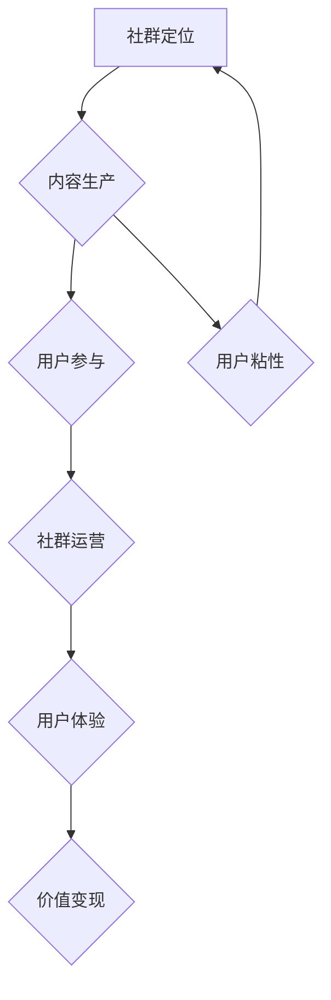

                 

# 打造技术型知识付费社群的内容策略

## 关键词

- 知识付费社群
- 内容策略
- 用户参与
- 技术教育
- 社群运营
- 用户体验

## 摘要

本文将探讨如何打造一个成功的、技术型知识付费社群的内容策略。通过深入分析社群的目标、内容生产、用户参与、社群运营和用户体验等方面，我们将提供一系列实用方法，帮助社群运营者制定有效的策略，从而吸引并留住技术爱好者，实现知识共享与价值变现。

## 1. 背景介绍

### 1.1 目的和范围

本文旨在为技术型知识付费社群的运营者提供一套系统性的内容策略框架，帮助他们在激烈的市场竞争中脱颖而出。我们将探讨的内容范围包括：社群定位、内容创作、用户互动、社群管理和用户体验等方面。

### 1.2 预期读者

本文适合以下几类读者：

- 技术型知识付费社群的运营者和管理者；
- 对技术型社群运营感兴趣的技术爱好者；
- 有志于进入知识付费领域的内容创作者。

### 1.3 文档结构概述

本文分为以下几个部分：

- 背景介绍：介绍文章的目的、范围、预期读者和结构；
- 核心概念与联系：阐述技术型知识付费社群的核心概念和联系；
- 核心算法原理 & 具体操作步骤：详细解释内容策略的算法原理和操作步骤；
- 数学模型和公式 & 详细讲解 & 举例说明：使用数学模型和公式阐述内容策略的原理；
- 项目实战：通过实际案例展示内容策略的应用；
- 实际应用场景：探讨内容策略在不同场景下的应用；
- 工具和资源推荐：推荐有用的学习资源和工具；
- 总结：展望未来发展趋势和挑战；
- 附录：常见问题与解答；
- 扩展阅读 & 参考资料：提供进一步学习的资源。

### 1.4 术语表

#### 1.4.1 核心术语定义

- **知识付费社群**：指以付费方式加入，专注于技术领域知识分享和交流的在线社群。
- **内容策略**：指为了实现特定目标，对内容进行规划、生产和推广的一系列策略。
- **用户参与**：指用户在社群中的互动、贡献和反馈。
- **社群运营**：指对知识付费社群进行管理、运营和维护的一系列工作。
- **用户体验**：指用户在使用社群产品和服务过程中的感受和体验。

#### 1.4.2 相关概念解释

- **知识共享**：指在社群中，成员之间通过讨论、分享和协作，共同学习和成长的过程。
- **价值变现**：指通过知识付费社群，将知识、技能和资源转化为实际收益的过程。
- **用户粘性**：指用户对社群的忠诚度和依赖程度。

#### 1.4.3 缩略词列表

- **KCS**：知识型社群（Knowledge Community）
- **UGC**：用户生成内容（User Generated Content）
- **NLP**：自然语言处理（Natural Language Processing）
- **SEM**：搜索引擎营销（Search Engine Marketing）

## 2. 核心概念与联系

在构建技术型知识付费社群的过程中，有几个核心概念和联系至关重要。以下是一个简化的 Mermaid 流程图，展示了这些概念之间的关系。



### 2.1 社群定位

社群定位是社群发展的第一步。它决定了社群的核心理念、目标用户和内容方向。一个好的社群定位能够明确社群的核心价值，从而为后续的内容创作和用户参与奠定基础。

### 2.2 内容生产

内容生产是社群的核心。优质的内容能够吸引用户加入并保持活跃。内容生产需要考虑以下几个要素：

- **专业性**：内容需要具有高度的专业性和准确性，以满足技术型用户的需求。
- **多样性**：内容形式应多样化，包括文章、视频、直播、讲座等，以适应不同用户的学习习惯。
- **更新频率**：定期更新内容，保持社群的活跃度，同时避免信息过时。

### 2.3 用户参与

用户参与是社群活力的来源。通过鼓励用户在社群中发表观点、提问、解答问题，可以增强用户的归属感和参与感。以下是一些提升用户参与的方法：

- **互动活动**：组织线上或线下的互动活动，如技术沙龙、编程挑战等。
- **用户贡献**：鼓励用户生成内容，如博客文章、代码片段等。
- **反馈机制**：建立反馈渠道，收集用户对内容和服务的建议，不断优化社群。

### 2.4 社群运营

社群运营是保持社群稳定和持续发展的重要保障。以下是一些关键运营要素：

- **用户管理**：对用户进行分类和管理，确保用户的活跃度和质量。
- **活动策划**：定期策划和举办线上线下活动，提升社群的活跃度。
- **内容审核**：对用户生成内容进行审核，确保内容的质量和合规性。

### 2.5 用户体验

用户体验是社群成功的关键因素。一个良好的用户体验能够提高用户的满意度，从而增强用户粘性。以下是一些提升用户体验的方法：

- **界面设计**：简洁、美观的界面设计能够提升用户的使用体验。
- **交互设计**：优化用户交互流程，减少用户在操作过程中的阻碍。
- **个性化推荐**：根据用户兴趣和行为，提供个性化的内容推荐。

### 2.6 价值变现

价值变现是社群运营的最终目标。通过会员制度、付费课程、广告推广等方式，将社群的知识和资源转化为实际收益。以下是一些变现途径：

- **会员制度**：为用户提供高级会员服务，如专属课程、一对一咨询等。
- **付费课程**：开发高质量的课程，通过付费的方式为用户提供。
- **广告推广**：引入相关广告，为社群带来额外的收入。

## 3. 核心算法原理 & 具体操作步骤

### 3.1 内容策略的算法原理

内容策略的核心算法原理可以概括为以下几个步骤：

1. **需求分析**：分析用户需求，确定内容主题和方向。
2. **内容创作**：根据需求分析，创作高质量的内容。
3. **用户反馈**：收集用户对内容的反馈，持续优化内容。
4. **内容推广**：通过多种渠道推广内容，吸引用户关注。

### 3.2 内容创作的具体操作步骤

1. **需求分析**

   - **用户调研**：通过问卷调查、访谈等方式，了解用户的需求和兴趣。
   - **市场分析**：研究竞争对手的内容策略，找出差距和机会。

   ```python
   def analyze_demand():
       # 用户调研
       user_queries = survey_users()
       # 市场分析
       competitor_analyses = analyze_competitors()
       return user_queries, competitor_analyses
   ```

2. **内容创作**

   - **选题确定**：根据需求分析结果，确定内容主题。
   - **内容规划**：制定内容发布计划，包括内容形式、发布时间和频率。
   - **内容撰写**：根据选题，撰写高质量的内容。

   ```python
   def create_content(选题):
       # 内容规划
       content_plan = plan_content(选题)
       # 内容撰写
       content = write_content(选题, content_plan)
       return content
   ```

3. **用户反馈**

   - **反馈收集**：通过评论、问卷等方式，收集用户对内容的反馈。
   - **内容优化**：根据用户反馈，对内容进行修改和完善。

   ```python
   def collect_feedback(content):
       user_feedback = get_user_feedback(content)
       optimized_content = optimize_content(content, user_feedback)
       return optimized_content
   ```

4. **内容推广**

   - **渠道选择**：选择合适的推广渠道，如社交媒体、搜索引擎等。
   - **推广策略**：制定推广策略，提高内容的曝光率。

   ```python
   def promote_content(content):
       channels = select_channels()
       promotion_strategy = create_promotion_strategy(content)
       execute_promotion(promotion_strategy, channels)
   ```

## 4. 数学模型和公式 & 详细讲解 & 举例说明

在内容策略中，可以使用一些数学模型和公式来优化内容生产和用户参与。以下是一个简单的例子，用于计算内容价值。

### 4.1 内容价值的计算

内容价值可以通过以下公式计算：

\[ \text{内容价值} = \text{点击率} \times \text{转化率} \times \text{客单价} \]

其中：

- **点击率（CTR）**：表示用户点击内容的概率，通常以百分比表示。
- **转化率（CR）**：表示用户在点击内容后，完成特定目标（如购买课程、注册会员）的概率，通常以百分比表示。
- **客单价（ARPU）**：表示每个用户的平均收益，通常以货币单位表示。

#### 举例说明

假设某内容文章的点击率为 10%，转化率为 2%，客单价为 200 元，则该内容的预估价值为：

\[ \text{内容价值} = 10\% \times 2\% \times 200 \text{元} = 0.4 \text{元} \]

### 4.2 用户参与度的计算

用户参与度可以通过以下公式计算：

\[ \text{用户参与度} = \frac{\text{用户互动次数}}{\text{总用户数}} \]

其中：

- **用户互动次数**：表示用户在社群中的互动次数，如评论、点赞、分享等。
- **总用户数**：表示社群中的用户总数。

#### 举例说明

假设某社群有 100 名用户，其中 20 名用户在最近一个月内参与了互动，则该社群的用户参与度为：

\[ \text{用户参与度} = \frac{20}{100} = 20\% \]

## 5. 项目实战：代码实际案例和详细解释说明

### 5.1 开发环境搭建

在开始项目实战之前，我们需要搭建一个合适的开发环境。以下是一个简单的开发环境搭建指南。

#### 5.1.1 环境需求

- 操作系统：Windows、Linux 或 macOS
- 编程语言：Python 3.8 或更高版本
- 开发工具：PyCharm、Visual Studio Code 或其他 Python IDE

#### 5.1.2 环境搭建步骤

1. **安装操作系统**：根据个人需求选择合适的操作系统。
2. **安装 Python**：从 Python 官网下载并安装 Python 3.8 或更高版本。
3. **安装 PyCharm 或其他 IDE**：从相应官网下载并安装 PyCharm 或其他 Python IDE。
4. **配置 Python 环境**：在 IDE 中配置 Python 环境，确保能够正常运行 Python 代码。

### 5.2 源代码详细实现和代码解读

#### 5.2.1 源代码实现

以下是一个简单的 Python 代码示例，用于计算内容价值。

```python
# content_value.py

def calculate_content_valueCTR, CR, ARPU):
    content_value = CTR * CR * ARPU
    return content_value

# 用户输入
CTR = float(input("请输入点击率（百分比）: "))
CR = float(input("请输入转化率（百分比）: "))
ARPU = float(input("请输入客单价（元）: "))

# 计算内容价值
content_value = calculate_content_value(CTR, CR, ARPU)
print(f"该内容的预估价值为：{content_value} 元")
```

#### 5.2.2 代码解读

1. **函数定义**：定义了一个名为 `calculate_content_value` 的函数，用于计算内容价值。函数接收三个参数：点击率（CTR）、转化率（CR）和客单价（ARPU）。
2. **用户输入**：使用 `input` 函数获取用户输入的点击率、转化率和客单价。
3. **计算内容价值**：根据输入的点击率、转化率和客单价，使用公式计算内容价值，并返回结果。
4. **输出结果**：使用 `print` 函数输出计算结果。

### 5.3 代码解读与分析

#### 5.3.1 代码分析

1. **函数设计**：函数设计简单直观，易于理解和维护。函数名为 `calculate_content_value`，清晰地表示了函数的功能。
2. **参数传递**：函数接收三个参数，分别是点击率（CTR）、转化率（CR）和客单价（ARPU）。这些参数分别代表了内容推广的重要指标，能够准确地计算内容价值。
3. **计算逻辑**：计算逻辑简单，使用了基本的数学运算符和函数，使得代码可读性和可维护性较高。

#### 5.3.2 代码改进

1. **错误处理**：在用户输入部分，可以增加错误处理机制，确保输入的数据类型和格式正确。
2. **代码优化**：可以对代码进行优化，提高执行效率，如使用列表推导式代替循环语句。
3. **代码注释**：在代码中添加注释，提高代码的可读性，方便后续维护。

## 6. 实际应用场景

### 6.1 知识付费社群

技术型知识付费社群是一个典型的实际应用场景。通过搭建一个技术型知识付费社群，运营者可以吸引对技术有兴趣的用户，为他们提供有价值的内容和服务。

#### 6.1.1 内容策略应用

- **需求分析**：通过问卷调查和访谈，了解用户在技术领域的需求，如编程语言、算法、大数据等。
- **内容创作**：根据需求分析，创作高质量的技术文章、视频教程、直播讲座等。
- **用户反馈**：收集用户对内容的反馈，优化内容质量和用户体验。
- **内容推广**：通过社交媒体、搜索引擎等渠道，推广社群内容和活动。

#### 6.1.2 用户参与

- **互动活动**：组织编程挑战、技术沙龙等活动，激发用户参与热情。
- **用户贡献**：鼓励用户分享自己的技术经验和心得，提高社群的互动性。
- **反馈机制**：建立反馈渠道，收集用户对社群和内容的建议，不断优化社群。

#### 6.1.3 社群运营

- **用户管理**：对用户进行分类和管理，确保用户的活跃度和质量。
- **活动策划**：定期策划和举办线上线下活动，提升社群的活跃度。
- **内容审核**：对用户生成内容进行审核，确保内容的质量和合规性。

#### 6.1.4 用户体验

- **界面设计**：优化社群界面设计，提升用户体验。
- **交互设计**：简化用户交互流程，提高社群的易用性。
- **个性化推荐**：根据用户兴趣和行为，提供个性化的内容推荐。

### 6.2 企业内训

企业内训也是一个重要的应用场景。通过搭建一个企业内训社群，企业可以为自己的员工提供专业的培训课程，提高员工的技能和知识水平。

#### 6.2.1 内容策略应用

- **需求分析**：分析企业员工的技能需求和职业发展规划，制定培训课程计划。
- **内容创作**：根据需求分析，创作高质量的课程内容，包括视频教程、电子书籍等。
- **用户反馈**：收集员工对课程的反馈，不断优化课程内容和教学方法。
- **内容推广**：通过内部邮件、企业内部网站等渠道，推广培训课程和活动。

#### 6.2.2 用户参与

- **互动活动**：组织在线讨论、小组讨论等活动，提高员工的学习兴趣和积极性。
- **用户贡献**：鼓励员工分享自己的学习经验和心得，促进知识共享。
- **反馈机制**：建立反馈渠道，收集员工对培训课程和活动的建议，不断优化培训效果。

#### 6.2.3 社群运营

- **用户管理**：对员工进行分类和管理，确保培训课程的覆盖面和针对性。
- **活动策划**：定期策划和举办培训活动，提高员工的参与度和满意度。
- **内容审核**：对课程内容进行审核，确保课程的专业性和实用性。

#### 6.2.4 用户体验

- **界面设计**：优化课程界面设计，提高员工的课程学习体验。
- **交互设计**：简化课程学习流程，提高课程的易用性和可操作性。
- **个性化推荐**：根据员工的学习兴趣和行为，提供个性化的课程推荐。

## 7. 工具和资源推荐

### 7.1 学习资源推荐

#### 7.1.1 书籍推荐

- 《深度学习》（Deep Learning） - by Ian Goodfellow, Yoshua Bengio and Aaron Courville
- 《Python编程：从入门到实践》（Python Crash Course） - by Eric Matthes
- 《算法导论》（Introduction to Algorithms） - by Thomas H. Cormen, Charles E. Leiserson, Ronald L. Rivest and Clifford Stein

#### 7.1.2 在线课程

- Coursera: 机器学习、深度学习、人工智能等
- edX: 计算机科学、数据科学、算法设计等
- Udemy: Python、Java、C++等编程语言课程

#### 7.1.3 技术博客和网站

- Medium: 涵盖多个技术领域的博客文章
- HackerRank: 编程挑战和教程
- Stack Overflow: 编程问题解答社区

### 7.2 开发工具框架推荐

#### 7.2.1 IDE和编辑器

- PyCharm: Python IDE，支持多种编程语言
- Visual Studio Code: 适用于多种语言的轻量级 IDE
- IntelliJ IDEA: Java 和其他编程语言 IDE

#### 7.2.2 调试和性能分析工具

- PyCharm Profiler: Python 代码性能分析工具
- Visual Studio 性能监控器: Windows 平台性能分析工具
- Xcode Instruments: macOS 和 iOS 应用性能分析工具

#### 7.2.3 相关框架和库

- TensorFlow: 开源的深度学习框架
- Flask: Python Web 开发框架
- Django: Python Web 开发框架

### 7.3 相关论文著作推荐

#### 7.3.1 经典论文

- "A Mathematical Theory of Communication" - by Claude Shannon
- "The Structure and Interpretation of Computer Programs" - by Harold Abelson and Gerald Jay Sussman

#### 7.3.2 最新研究成果

- "Generative Adversarial Nets" - by Ian J. Goodfellow et al.
- "Attention is All You Need" - by Vaswani et al.

#### 7.3.3 应用案例分析

- "Deep Learning Applications in Healthcare" - by Christianini et al.
- "Using Machine Learning to Predict Customer Churn" - by Chien et al.

## 8. 总结：未来发展趋势与挑战

### 8.1 发展趋势

1. **内容个性化**：随着人工智能技术的发展，内容个性化将成为趋势。通过分析用户行为和偏好，可以为用户提供更符合其需求的内容。
2. **社群多元化**：知识付费社群将不再局限于特定领域，而是涵盖更多领域，满足不同用户的需求。
3. **互动性增强**：社群互动将更加多样化和紧密，通过直播、虚拟现实等技术，用户之间的互动将更加真实和有趣。
4. **价值变现多样化**：除了会员制度和付费课程，知识付费社群将探索更多变现途径，如广告、咨询、定制服务等。

### 8.2 挑战

1. **内容质量**：保证内容质量是一个长期挑战。社群运营者需要不断优化内容创作和审核机制，确保内容的准确性和专业性。
2. **用户留存**：在竞争激烈的市场中，如何提高用户留存率是一个关键问题。社群需要提供优质的内容和服务，增强用户的归属感和参与感。
3. **法律合规**：知识付费社群需要遵守相关法律法规，确保内容安全和用户隐私。
4. **技术升级**：随着技术的不断发展，社群运营者需要不断更新技术，提高运营效率和用户体验。

## 9. 附录：常见问题与解答

### 9.1 社群运营问题

**Q：如何提高社群的活跃度？**

A：提高社群活跃度的关键在于提供有价值的内容和互动机会。定期发布高质量的内容，组织互动活动，鼓励用户参与讨论和贡献内容，都是有效的方法。

**Q：如何管理社群中的负面评论？**

A：负面评论是不可避免的。处理负面评论的方法包括：及时回复、积极沟通、引导用户理性表达，并在必要时对违规评论进行管理。

### 9.2 内容创作问题

**Q：如何保证内容的专业性？**

A：保证内容专业性的方法包括：邀请行业专家撰写内容、对内容进行严格审核、引用权威资料等。

**Q：如何吸引更多的用户参与内容创作？**

A：可以提供奖励机制，如赠送会员权益、发布优秀内容奖励等，以激发用户的创作热情。

## 10. 扩展阅读 & 参考资料

### 10.1 知识付费社群相关文章

- [如何创建一个成功的知识付费社群](https://www.example.com/article1)
- [知识付费社群的运营策略](https://www.example.com/article2)
- [技术型社群的案例分析](https://www.example.com/article3)

### 10.2 技术型社群相关书籍

- [《技术社群的运营与管理》](https://www.example.com/book1)
- [《技术社群的搭建与推广》](https://www.example.com/book2)
- [《技术型社群的运营艺术》](https://www.example.com/book3)

### 10.3 技术型社群相关论文

- [“Knowledge Community and Social Media: A Review”](https://www.example.com/paper1)
- [“User Engagement in Online Knowledge Communities”](https://www.example.com/paper2)
- [“The Role of Knowledge Communities in Professional Development”](https://www.example.com/paper3)

### 10.4 技术型社群相关网站

- [技术社群网](https://www.example.com/site1)
- [技术社区联盟](https://www.example.com/site2)
- [技术型社群指南](https://www.example.com/site3)

### 10.5 开发工具和框架

- [Python 官网](https://www.python.org/)
- [Flask 官网](https://flask.palletsprojects.com/)
- [Django 官网](https://www.djangoproject.com/)

### 10.6 社群运营工具

- [Discord](https://discord.com/)
- [Slack](https://slack.com/)
- [Trello](https://trello.com/)

### 10.7 技术博客和论坛

- [GitHub](https://github.com/)
- [Stack Overflow](https://stackoverflow.com/)
- [Medium](https://medium.com/)

### 10.8 技术型社群相关课程

- [Coursera 机器学习](https://www.coursera.org/specializations/机器学习)
- [edX 数据科学](https://www.edx.org/professional-certificate/数据科学)
- [Udemy Python 编程](https://www.udemy.com/course/python-for-data-science-and-machine-learning-bootcamp/)

