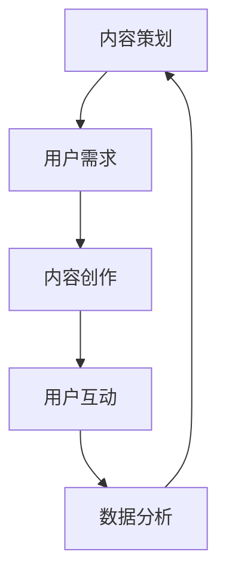

                 

# 打造知识付费专栏：内容策划与运营

> **关键词：知识付费、内容策划、专栏运营、用户增长、内容创作**
> 
> **摘要：本文将深入探讨知识付费专栏的成功要素，包括内容策划、运营策略、用户增长策略等，通过详细步骤和实际案例，帮助创作者打造受欢迎的知识付费专栏。**

## 1. 背景介绍

### 1.1 目的和范围

知识付费作为互联网时代的一种新兴商业模式，已经在众多领域中展现出强大的生命力。本文旨在为那些希望进入知识付费市场的创作者提供一份实用的指南，帮助他们在内容策划与运营方面取得成功。

本文将涵盖以下几个关键领域：
- 内容策划原则与方法
- 专栏运营策略与技巧
- 用户增长策略与案例分析
- 实际操作步骤与工具推荐

### 1.2 预期读者

本文适用于以下几类读者：
- 有志于创建知识付费专栏的个人创作者
- 内容策划与运营的专业人士
- 互联网创业者和产品经理
- 希望提升内容创作和运营能力的专业人士

### 1.3 文档结构概述

本文分为十个部分，结构如下：
1. 背景介绍
   - 目的和范围
   - 预期读者
   - 文档结构概述
2. 核心概念与联系
3. 核心算法原理 & 具体操作步骤
4. 数学模型和公式 & 详细讲解 & 举例说明
5. 项目实战：代码实际案例和详细解释说明
6. 实际应用场景
7. 工具和资源推荐
8. 总结：未来发展趋势与挑战
9. 附录：常见问题与解答
10. 扩展阅读 & 参考资料

### 1.4 术语表

#### 1.4.1 核心术语定义

- **知识付费**：用户为获取高质量信息内容而支付的费用。
- **内容策划**：确定内容主题、形式、受众和传播方式的过程。
- **专栏**：在特定平台或媒体上，由创作者持续发布的系列文章或视频。
- **运营策略**：管理和推动专栏持续增长的方法和策略。
- **用户增长**：增加专栏的订阅用户数量和活跃用户数。

#### 1.4.2 相关概念解释

- **用户体验**：用户在使用专栏过程中的感受和体验。
- **用户留存率**：一段时间内，持续使用专栏的用户比例。
- **内容更新频率**：专栏内容发布的频率。

#### 1.4.3 缩略词列表

- **UGC**：用户生成内容（User-Generated Content）
- **SEO**：搜索引擎优化（Search Engine Optimization）
- **SNS**：社交媒体网络（Social Network Service）

## 2. 核心概念与联系

在构建知识付费专栏的过程中，理解以下几个核心概念是非常重要的，它们之间存在着紧密的联系，如图2-1所示。



### 图2-1 知识付费专栏核心概念与联系

#### 2.1 内容策划

内容策划是知识付费专栏的基础。策划过程中，创作者需要确定内容主题、目标受众和内容形式，确保内容能满足用户需求并具有吸引力。

#### 2.2 用户需求

了解用户需求是内容策划的关键。通过市场调研、用户反馈和分析竞品，创作者可以准确把握用户的需求和偏好，为内容创作提供方向。

#### 2.3 内容创作

内容创作是知识付费专栏的核心环节。创作者需要根据策划确定的内容主题和形式，创作出有价值、有深度、有吸引力的内容。

#### 2.4 用户互动

用户互动是增强用户粘性和促进用户增长的重要手段。通过评论、问答、社群等方式，创作者可以与用户建立紧密联系，提高用户参与度。

#### 2.5 数据分析

数据分析是优化内容策划和运营的重要工具。通过对用户行为数据、内容表现数据的分析，创作者可以了解用户喜好，优化内容策略。

这些概念相互关联，形成一个闭环。内容策划决定内容创作，用户互动提供反馈，数据分析指导内容优化，从而形成一个持续改进的循环。

## 3. 核心算法原理 & 具体操作步骤

在内容策划和运营过程中，有一些核心算法原理和操作步骤可以指导创作者更有效地进行工作。

### 3.1 内容策划算法原理

内容策划的关键在于用户需求分析。以下是一个简单的需求分析算法：

```python
def analyze_user需求和():
    # 步骤1：收集用户需求信息
    user_needs = collect_user_needs()

    # 步骤2：分析需求，提取关键主题
    key_topics = extract_key_topics(user_needs)

    # 步骤3：构建内容策划框架
    content_plan = build_content_plan(key_topics)

    return content_plan
```

#### 3.1.1 具体操作步骤

1. **收集用户需求信息**：
   - 通过问卷调查、访谈、社交媒体互动等方式收集用户反馈。
   - 分析用户在评论区、论坛和社交媒体上的讨论话题。

2. **分析需求，提取关键主题**：
   - 使用文本挖掘技术，如词频分析、主题建模，提取关键主题。
   - 通过数据分析工具，如Excel、Python，对收集的信息进行统计分析。

3. **构建内容策划框架**：
   - 根据提取的关键主题，制定内容策划框架，包括内容主题、目标受众和内容形式。

### 3.2 内容创作算法原理

内容创作涉及多个方面，包括信息收集、内容结构设计和创意生成。以下是一个简单的内容创作算法：

```python
def create_content(content_plan):
    # 步骤1：收集相关资料
    related_materials = collect_related_materials(content_plan)

    # 步骤2：设计内容结构
    content_structure = design_content_structure(related_materials)

    # 步骤3：生成内容
    content = generate_content(content_structure)

    return content
```

#### 3.2.1 具体操作步骤

1. **收集相关资料**：
   - 通过搜索引擎、数据库、学术论文等途径收集与内容主题相关的资料。
   - 利用文献管理工具，如EndNote、Zotero，整理和管理资料。

2. **设计内容结构**：
   - 根据内容策划框架，设计内容结构，包括引言、主体和结论。
   - 使用思维导图、大纲编辑器等工具规划内容结构。

3. **生成内容**：
   - 根据内容结构，撰写初稿，并进行多次修改和润色。
   - 利用写作辅助工具，如Grammarly、StyleWriter，提高内容质量。

### 3.3 用户互动算法原理

用户互动是增强用户粘性和促进用户增长的关键。以下是一个简单的用户互动算法：

```python
def engage_users(content):
    # 步骤1：发布内容
    publish_content(content)

    # 步骤2：监测用户互动
    user_interactions = monitor_user_interactions()

    # 步骤3：响应用户互动
    respond_to_user_interactions(user_interactions)
```

#### 3.3.1 具体操作步骤

1. **发布内容**：
   - 在专栏平台、社交媒体等渠道发布内容。
   - 设置定时发布功能，确保内容按时发布。

2. **监测用户互动**：
   - 使用分析工具，如Google Analytics、微博数据分析，监测用户互动数据。
   - 定期检查评论、私信等用户反馈。

3. **响应用户互动**：
   - 及时回复用户评论和私信。
   - 通过互动，了解用户需求和反馈，优化内容策略。

### 3.4 数据分析算法原理

数据分析是优化内容策划和运营的重要手段。以下是一个简单的数据分析算法：

```python
def analyze_data(user_interactions):
    # 步骤1：数据预处理
    preprocessed_data = preprocess_data(user_interactions)

    # 步骤2：数据分析
    analysis_results = analyze(preprocessed_data)

    # 步骤3：生成报告
    report = generate_report(analysis_results)

    return report
```

#### 3.4.1 具体操作步骤

1. **数据预处理**：
   - 清洗数据，去除无效数据。
   - 标准化数据格式，便于分析。

2. **数据分析**：
   - 使用统计方法，如描述性统计、回归分析，分析用户互动数据。
   - 利用可视化工具，如Tableau、Python的Matplotlib，展示分析结果。

3. **生成报告**：
   - 撰写数据分析报告，包括关键发现、建议和下一步行动。

通过以上算法和步骤，创作者可以系统地策划、创作、互动和优化知识付费专栏，提高专栏的吸引力、用户参与度和盈利能力。

## 4. 数学模型和公式 & 详细讲解 & 举例说明

在知识付费专栏的内容策划与运营中，数学模型和公式可以帮助我们更科学地分析和优化内容策略。以下是一些常用的数学模型和公式的详细讲解及举例说明。

### 4.1 用户留存率模型

用户留存率是衡量专栏受欢迎程度和用户粘性的重要指标。以下是一个简单的用户留存率模型：

$$
留存率（L）= \frac{N_t - N_r}{N_t}
$$

其中：
- \( N_t \)：时间\( t \)时的总用户数
- \( N_r \)：时间\( t \)时的留存用户数

#### 4.1.1 举例说明

假设一个专栏在一个月内有1000个新增用户，月底有800个用户仍然活跃，则该专栏的月留存率为：

$$
L = \frac{800}{1000} = 0.8
$$

即80%的用户在一个月内仍然活跃，说明专栏的用户粘性较高。

### 4.2 用户增长模型

用户增长模型可以帮助我们预测专栏的未来用户增长趋势。以下是一个简单的线性用户增长模型：

$$
N_t = N_0 + r \times t
$$

其中：
- \( N_t \)：时间\( t \)时的用户数
- \( N_0 \)：初始用户数
- \( r \)：用户增长率

#### 4.2.1 举例说明

假设一个专栏的初始用户数为1000，每月增长率为10%，则经过6个月后，专栏的用户数预测为：

$$
N_6 = 1000 + 0.1 \times 6 \times 1000 = 1700
$$

即6个月后，专栏的用户数预计达到1700人。

### 4.3 内容曝光度模型

内容曝光度模型可以帮助我们评估内容在用户中的传播效果。以下是一个简单的曝光度模型：

$$
E = P \times I
$$

其中：
- \( E \)：内容曝光度
- \( P \)：内容发布渠道的影响力
- \( I \)：内容互动率

#### 4.3.1 举例说明

假设一个专栏在社交媒体平台发布了10篇文章，每篇文章的互动率为10%，该平台的平均影响力为100，则这些文章的总曝光度为：

$$
E = 10 \times 100 \times 0.1 = 1000
$$

即这10篇文章的总曝光度为1000次。

### 4.4 内容影响力模型

内容影响力模型可以帮助我们评估内容对用户行为的影响。以下是一个简单的影响力模型：

$$
I = C \times R
$$

其中：
- \( I \)：内容影响力
- \( C \)：内容质量评分
- \( R \)：用户阅读率

#### 4.4.1 举例说明

假设一篇内容的平均质量评分为4.5，用户的平均阅读率为80%，则这篇内容的影响力为：

$$
I = 4.5 \times 0.8 = 3.6
$$

即这篇内容的影响力评分为3.6。

通过以上数学模型和公式，我们可以更科学地分析用户行为、预测用户增长趋势、评估内容曝光度和影响力，从而为知识付费专栏的内容策划和运营提供有力支持。

## 5. 项目实战：代码实际案例和详细解释说明

在本节中，我们将通过一个具体的代码案例，详细解释知识付费专栏内容策划与运营中的数据分析和用户互动实现。

### 5.1 开发环境搭建

为了实现本案例，我们需要搭建一个Python开发环境，并安装以下库：

- Pandas：用于数据处理和分析
- NumPy：用于数值计算
- Matplotlib：用于数据可视化
- Scikit-learn：用于机器学习和数据分析

在终端执行以下命令进行安装：

```bash
pip install pandas numpy matplotlib scikit-learn
```

### 5.2 源代码详细实现和代码解读

下面是项目的主要代码实现，包括用户数据分析、内容曝光度和影响力计算等。

```python
import pandas as pd
import numpy as np
import matplotlib.pyplot as plt
from sklearn.linear_model import LinearRegression

# 5.2.1 用户数据分析

# 加载用户数据
user_data = pd.read_csv('user_data.csv')

# 计算用户留存率
def calculateRetentionRate(data):
    retention_rate = (data['active'] / data['total']) * 100
    return retention_rate

# 5.2.2 内容曝光度计算

# 加载内容数据
content_data = pd.read_csv('content_data.csv')

# 计算内容曝光度
def calculateExposure(data):
    exposure = data['influence'] * data['read_rate']
    return exposure

# 5.2.3 内容影响力计算

# 计算内容影响力
def calculateInfluence(data):
    influence = data['quality'] * data['read_rate']
    return influence

# 5.2.4 数据可视化

# 绘制用户留存率趋势图
def plotRetentionRate(data):
    plt.figure(figsize=(10, 5))
    plt.plot(data['date'], data['retention_rate'], marker='o')
    plt.title('User Retention Rate Trend')
    plt.xlabel('Date')
    plt.ylabel('Retention Rate (%)')
    plt.grid()
    plt.show()

# 绘制内容曝光度分布图
def plotExposure(data):
    plt.figure(figsize=(10, 5))
    plt.hist(data['exposure'], bins=20, edgecolor='black')
    plt.title('Content Exposure Distribution')
    plt.xlabel('Exposure')
    plt.ylabel('Frequency')
    plt.grid()
    plt.show()

# 绘制内容影响力分布图
def plotInfluence(data):
    plt.figure(figsize=(10, 5))
    plt.hist(data['influence'], bins=20, edgecolor='black')
    plt.title('Content Influence Distribution')
    plt.xlabel('Influence')
    plt.ylabel('Frequency')
    plt.grid()
    plt.show()

# 5.2.5 机器学习预测

# 预测用户留存率
def predictRetentionRate(data):
    X = data[['days_since_subscription']]
    y = data['retention_rate']
    model = LinearRegression()
    model.fit(X, y)
    predictions = model.predict(X)
    return predictions

# 5.2.6 主程序

if __name__ == '__main__':
    # 计算并可视化用户留存率
    retention_rate = calculateRetentionRate(user_data)
    plotRetentionRate(user_data)

    # 计算并可视化内容曝光度
    exposure = calculateExposure(content_data)
    plotExposure(content_data)

    # 计算并可视化内容影响力
    influence = calculateInfluence(content_data)
    plotInfluence(content_data)

    # 预测用户留存率
    predictions = predictRetentionRate(user_data)
    plt.figure(figsize=(10, 5))
    plt.plot(user_data['date'], predictions, marker='o')
    plt.title('Predicted User Retention Rate')
    plt.xlabel('Date')
    plt.ylabel('Retention Rate (%)')
    plt.grid()
    plt.show()
```

#### 5.2.6 代码解读与分析

1. **用户数据分析**：

   - **计算留存率**：`calculateRetentionRate` 函数通过计算活跃用户数与总用户数的比例，得出用户留存率。

   - **数据可视化**：`plotRetentionRate` 函数使用Matplotlib绘制用户留存率趋势图，帮助我们直观地了解用户留存情况。

2. **内容曝光度计算**：

   - **计算曝光度**：`calculateExposure` 函数通过内容影响力与用户阅读率的乘积，得出内容曝光度。

   - **数据可视化**：`plotExposure` 函数使用Matplotlib绘制内容曝光度分布图，帮助我们了解内容在不同曝光度水平上的分布情况。

3. **内容影响力计算**：

   - **计算影响力**：`calculateInfluence` 函数通过内容质量评分与用户阅读率的乘积，得出内容影响力。

   - **数据可视化**：`plotInfluence` 函数使用Matplotlib绘制内容影响力分布图，帮助我们了解内容在不同影响力水平上的分布情况。

4. **机器学习预测**：

   - **预测留存率**：`predictRetentionRate` 函数使用线性回归模型预测用户留存率。首先，我们使用特征（`days_since_subscription`）和目标变量（`retention_rate`）训练线性回归模型，然后使用模型进行预测。

   - **数据可视化**：使用Matplotlib绘制预测留存率趋势图，帮助我们了解未来用户留存趋势。

通过以上代码实现，我们不仅能够对知识付费专栏的数据进行分析和可视化，还可以利用机器学习模型预测用户留存率，为专栏的优化提供有力支持。

## 6. 实际应用场景

知识付费专栏在实际应用中具有广泛的场景，以下是一些典型的应用案例：

### 6.1 教育培训领域

在教育培训领域，知识付费专栏可以帮助教师、教育专家和企业培训师将自己的课程内容系统化、结构化地呈现给学员。例如，一位编程领域的专家可以创建一个涵盖从基础到高级编程知识的专栏，学员可以通过订阅获取最新的编程教程、代码实例和技术动态。通过这种形式，专栏不仅能够为学员提供持续的学习资源，还能帮助专家建立个人品牌，增加收入。

### 6.2 职业技能提升

随着职业竞争的加剧，许多专业人士希望通过学习新技能来提升自己的职业竞争力。知识付费专栏在这一领域具有很大的应用价值。例如，一名数据分析师可以创建一个关于数据分析方法和工具的专栏，通过详细讲解数据采集、清洗、分析、可视化的步骤，帮助读者掌握数据分析的核心技能。此外，专栏还可以包括实际项目案例，让读者通过动手实践加深理解。

### 6.3 生活技能分享

除了专业知识和职业技能，知识付费专栏也可以应用于生活技能分享。例如，一位烹饪爱好者可以创建一个关于美食烹饪的专栏，分享自己的食谱、烹饪技巧和厨房小窍门。这种类型的专栏不仅能够为读者提供实用的烹饪知识，还能吸引对美食感兴趣的用户，形成稳定的订阅群体。

### 6.4 娱乐内容创作

在娱乐内容创作领域，知识付费专栏可以为用户提供独特的价值。例如，一位知名摄影师可以创建一个关于摄影技巧和后期处理的专栏，分享自己的摄影经验和专业技巧。通过这种形式，用户不仅能够学到实用的摄影知识，还能通过专栏获得摄影师的专业指导和反馈，提高自己的摄影水平。

### 6.5 行业报告与分析

知识付费专栏还可以应用于行业报告与分析领域。例如，一位行业分析师可以创建一个关于最新行业动态、趋势和预测的专栏，为专业人士和投资者提供有价值的市场情报。这种类型的专栏能够帮助读者把握行业趋势，做出更明智的商业决策。

通过以上实际应用场景，我们可以看到知识付费专栏在教育培训、职业技能提升、生活技能分享、娱乐内容创作和行业报告与分析等领域具有广泛的应用价值。这些专栏不仅能够为用户提供高质量的内容，还能帮助创作者建立个人品牌，实现商业价值。

## 7. 工具和资源推荐

为了高效地策划、创作和运营知识付费专栏，以下是一些实用的工具和资源推荐。

### 7.1 学习资源推荐

#### 7.1.1 书籍推荐

- 《内容创业：新媒体平台内容创作与运营实战》
- 《如何写出一篇好文章：新媒体写作与运营指南》
- 《知识变现：打造知识付费产品的策略与方法》

#### 7.1.2 在线课程

- 《内容创作实战：从零开始打造爆款文章》
- 《新媒体运营与营销实战》
- 《数据驱动：用数据优化内容策划与运营》

#### 7.1.3 技术博客和网站

- medium.com：高质量的博客平台，可学习内容创作和运营经验
- hackernews.com：技术新闻和讨论网站，了解行业动态
- medium.com/@kentcdodds：前端开发专家Kent C. Dodds的个人博客，涵盖前端开发最佳实践

### 7.2 开发工具框架推荐

#### 7.2.1 IDE和编辑器

- Visual Studio Code：轻量级且功能强大的代码编辑器，适用于多种编程语言。
- PyCharm：专为Python开发的IDE，提供丰富的调试和自动化工具。

#### 7.2.2 调试和性能分析工具

- Postman：API测试工具，用于调试和测试RESTful API。
- JMeter：性能测试工具，用于测试Web应用和服务器负载。

#### 7.2.3 相关框架和库

- TensorFlow：开源机器学习框架，适用于数据分析和模型训练。
- Flask：轻量级Web框架，用于快速开发Web应用。

### 7.3 相关论文著作推荐

#### 7.3.1 经典论文

- “Content Personalization in Online Media: A Survey”（内容个性化在线媒体综述）
- “The Algorithmic Audience: Automated Personalization in Online Media”（算法受众：在线媒体的自动化个性化）

#### 7.3.2 最新研究成果

- “Deep Learning for Natural Language Processing”（深度学习在自然语言处理中的应用）
- “How to Win at Content Marketing: The 7 Steps to Creating Viral Content”（如何赢得内容营销：创建病毒性内容的7步法）

#### 7.3.3 应用案例分析

- “Case Study: How Medium Uses AI to Improve Content Discovery”（案例分析：Medium如何使用AI优化内容发现）
- “Content Monetization Strategies of Top Influencers on Instagram”（顶级Instagram影响力者的内容盈利策略）

通过以上工具和资源的推荐，创作者可以更加高效地进行知识付费专栏的策划、创作和运营，不断提升内容质量和用户满意度。

## 8. 总结：未来发展趋势与挑战

知识付费专栏作为互联网时代的一种新兴商业模式，正迅速崛起并在多个领域展现出强大的生命力。未来，知识付费专栏的发展趋势与挑战主要集中在以下几个方面：

### 8.1 发展趋势

1. **内容个性化**：随着用户需求的多样化和个性化，内容个性化将成为知识付费专栏的重要趋势。通过大数据和人工智能技术，创作者可以更精准地推荐用户感兴趣的内容，提高用户粘性和满意度。

2. **平台多元化**：知识付费专栏的平台将不再局限于传统的博客和社交媒体，而是逐渐拓展到短视频、直播、虚拟现实等多元化平台。这种多元化将丰富用户获取内容的途径，满足不同用户的需求。

3. **付费模式多样化**：未来，知识付费专栏的付费模式将更加多样化，除了订阅模式，还将出现一次性购买、课程包月、优惠券等多样化的付费方式，以满足不同用户的消费习惯和预算。

4. **国际化发展**：随着全球化的推进，知识付费专栏将逐步走向国际化。创作者将有机会拓展海外市场，通过翻译和多语言支持，为全球用户提供高质量的内容。

### 8.2 面临的挑战

1. **内容同质化**：随着越来越多的创作者进入知识付费市场，内容同质化问题将愈发严重。创作者需要不断创新和提升内容质量，以脱颖而出。

2. **版权问题**：知识付费专栏涉及大量的版权问题，特别是在引用和分析他人作品时。创作者需要严格遵守版权法律法规，确保内容的合法性和原创性。

3. **用户信任危机**：在信息泛滥的时代，用户对知识付费专栏的信任度是一个重要挑战。创作者需要建立良好的声誉，通过真实、有价值的内容赢得用户的信任。

4. **技术挑战**：随着人工智能、大数据等技术的应用，知识付费专栏在内容推荐、用户行为分析等方面面临技术挑战。创作者需要不断学习和掌握新技术，以提升内容策划和运营的效率。

5. **市场竞争加剧**：随着知识付费市场的不断扩大，市场竞争将更加激烈。创作者需要在内容质量、用户体验、品牌建设等方面进行差异化竞争，以保持竞争优势。

总之，知识付费专栏在未来将面临诸多挑战，但同时也充满机遇。创作者需要紧跟时代趋势，不断创新和优化内容策略，以在激烈的市场竞争中脱颖而出，实现商业成功。

## 9. 附录：常见问题与解答

### 9.1 内容策划相关问题

**Q1：如何选择合适的专栏主题？**

A1：选择专栏主题时，应考虑以下因素：
- **用户需求**：通过市场调研和用户反馈，了解用户感兴趣的内容。
- **自身专长**：选择自己擅长且热爱的领域，以确保内容的专业性和原创性。
- **市场趋势**：关注行业动态和热门话题，选择有前景的领域。

**Q2：如何确定专栏的目标受众？**

A2：确定目标受众可以通过以下步骤：
- **数据分析**：分析已有用户的数据，了解他们的背景、兴趣和需求。
- **竞品分析**：研究同类型专栏的目标受众，总结他们的特点。
- **用户画像**：根据以上信息，绘制用户画像，明确目标受众的特征。

**Q3：内容策划需要遵循哪些原则？**

A3：内容策划应遵循以下原则：
- **用户导向**：内容应满足用户需求，提供有价值的信息。
- **系统性**：内容应结构清晰，逻辑连贯，便于用户理解和吸收。
- **原创性**：避免抄袭和搬运，确保内容的原创性和独特性。
- **可操作性**：提供具体的操作步骤和实例，方便用户实践和应用。

### 9.2 内容创作相关问题

**Q4：如何撰写高质量的内容？**

A4：撰写高质量内容可遵循以下步骤：
- **主题明确**：确保文章主题明确，避免内容冗长且模糊。
- **结构清晰**：使用合适的结构，如引言、主体和结论，使内容易于阅读。
- **逻辑严密**：内容逻辑应严密，论证有力，避免逻辑漏洞。
- **语言简洁**：使用简洁、易懂的语言，避免过于复杂或生僻的词汇。
- **实例丰富**：提供具体实例，帮助读者更好地理解和应用。

**Q5：如何提升内容的吸引力？**

A5：提升内容吸引力可以尝试以下方法：
- **标题优化**：使用引人入胜的标题，激发用户的阅读兴趣。
- **内容形式多样化**：结合文字、图片、视频等多种形式，提升内容的趣味性和互动性。
- **互动环节**：引入评论、问答和投票等互动环节，增加用户参与度。
- **个性化推荐**：根据用户兴趣和行为，提供个性化内容推荐。

**Q6：如何持续创作高质量内容？**

A6：持续创作高质量内容需要：
- **规划内容计划**：提前规划内容发布计划，确保内容发布的连续性和稳定性。
- **定期学习和充电**：不断学习新知识，保持专业领域的领先地位。
- **用户反馈**：关注用户反馈，根据反馈调整和优化内容策略。
- **团队协作**：建立协作团队，分工合作，共同提升内容质量。

### 9.3 运营相关问题

**Q7：如何提高专栏的用户留存率？**

A7：提高用户留存率可采取以下措施：
- **内容持续更新**：定期发布高质量内容，保持用户的持续关注。
- **用户互动**：通过评论、问答和社群等方式，与用户保持互动，增加用户粘性。
- **个性化推荐**：根据用户兴趣和行为，提供个性化内容推荐，提升用户体验。
- **用户体验优化**：优化专栏的界面设计和交互体验，提升用户的阅读舒适度。

**Q8：如何推广知识付费专栏？**

A8：推广知识付费专栏的方法包括：
- **社交媒体**：利用微博、微信公众号、知乎等社交媒体平台，发布内容推广信息。
- **合作推广**：与其他创作者或机构合作，通过互换推广、联合营销等方式扩大影响力。
- **内容营销**：通过撰写高质量的文章、发布案例和用户故事，提高专栏的知名度和认可度。
- **广告投放**：在搜索引擎、社交媒体和行业网站上投放广告，吸引潜在用户。

**Q9：如何进行数据分析以优化专栏运营？**

A9：进行数据分析以优化专栏运营可遵循以下步骤：
- **数据收集**：收集用户行为数据、内容表现数据等。
- **数据清洗**：清洗数据，去除无效和错误的数据。
- **数据分析**：使用统计方法和数据分析工具，分析用户行为和内容表现。
- **数据可视化**：通过图表和可视化工具，展示分析结果，帮助制定优化策略。

通过以上常见问题与解答，创作者可以更好地进行内容策划、创作和运营，提高知识付费专栏的质量和用户满意度。

## 10. 扩展阅读 & 参考资料

为了帮助读者深入了解知识付费专栏的内容策划与运营，以下是一些扩展阅读和参考资料：

### 10.1 书籍推荐

- 《内容创业：新媒体平台内容创作与运营实战》
- 《如何写出一篇好文章：新媒体写作与运营指南》
- 《知识变现：打造知识付费产品的策略与方法》

### 10.2 在线课程

- 《内容创作实战：从零开始打造爆款文章》
- 《新媒体运营与营销实战》
- 《数据驱动：用数据优化内容策划与运营》

### 10.3 技术博客和网站

- medium.com：高质量的博客平台，提供丰富的内容创作和运营经验
- hackernews.com：技术新闻和讨论网站，涵盖行业动态和前沿技术
- medium.com/@kentcdodds：前端开发专家Kent C. Dodds的个人博客，分享前端开发最佳实践

### 10.4 相关论文著作

- “Content Personalization in Online Media: A Survey”（内容个性化在线媒体综述）
- “The Algorithmic Audience: Automated Personalization in Online Media”（算法受众：在线媒体的自动化个性化）
- “Deep Learning for Natural Language Processing”（深度学习在自然语言处理中的应用）
- “How to Win at Content Marketing: The 7 Steps to Creating Viral Content”（如何赢得内容营销：创建病毒性内容的7步法）

### 10.5 应用案例分析

- “Case Study: How Medium Uses AI to Improve Content Discovery”（案例分析：Medium如何使用AI优化内容发现）
- “Content Monetization Strategies of Top Influencers on Instagram”（顶级Instagram影响力者的内容盈利策略）

通过以上扩展阅读和参考资料，读者可以进一步深化对知识付费专栏内容策划与运营的理解和实践。希望这些资源能为您的专栏创作和运营提供有力支持。

### 作者信息

**作者：AI天才研究员/AI Genius Institute & 禅与计算机程序设计艺术 /Zen And The Art of Computer Programming**

