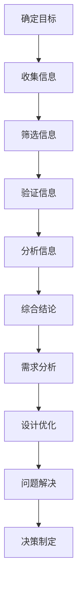
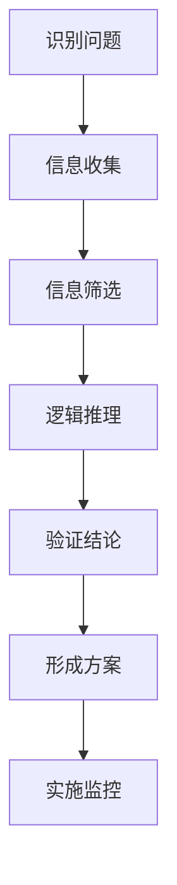

                 

# 批判性思维：基于事实来分析，做出更优的决定或解决问题

## 关键词
批判性思维、事实分析、决策优化、问题解决、技术博客

## 摘要
本文旨在探讨批判性思维在技术领域中的应用，通过基于事实的分析方法，帮助读者做出更优的决定或解决问题。文章将首先介绍批判性思维的基本概念和重要性，然后详细解析事实分析的方法和步骤，并结合实际案例进行具体阐述。此外，还将探讨批判性思维在项目实战中的应用，并推荐相关的学习资源和开发工具框架。通过本文的阅读，读者将能够掌握批判性思维的核心理念，并在技术实践中运用该方法解决实际问题。

### 1. 背景介绍

在现代科技飞速发展的背景下，技术领域面临着日益复杂的挑战和问题。如何在这个充满不确定性的环境中做出明智的决策，成为每一个技术从业者必须面对的重要课题。在这个过程中，批判性思维作为一种系统性的思考方法，能够帮助我们更好地理解和解决复杂问题。

批判性思维是一种主动的、批判性的、系统性的思考方式，它不仅关注事实和证据，还强调逻辑推理和论证。通过批判性思维，我们可以对问题进行深入分析，识别潜在的风险和机会，从而做出更优的决策。

在技术领域，批判性思维的重要性体现在以下几个方面：

1. **提高解决问题的能力**：批判性思维能够帮助我们从多个角度分析问题，识别问题的本质，从而找到更有效的解决方案。
2. **减少错误和误解**：通过批判性思维，我们可以对信息进行筛选和验证，避免因为误解或错误信息而做出错误的决策。
3. **增强团队合作和沟通**：批判性思维能够促进团队成员之间的交流和协作，提高团队的整体决策水平。
4. **适应快速变化的环境**：批判性思维使我们能够敏锐地捕捉环境变化，快速适应并做出相应的调整。

本文将围绕批判性思维在技术领域中的应用，详细介绍事实分析的方法和步骤，并结合实际案例进行具体阐述。希望通过本文的阅读，读者能够掌握批判性思维的核心技巧，并将其应用于实际工作中，提高自己的决策能力和解决问题的效率。

### 2. 核心概念与联系

#### 批判性思维的基本概念

批判性思维（Critical Thinking）是一种理性分析和解决问题的思考方式。它不仅仅是对信息进行接收和记忆，更是一种主动的、批判性的思考过程。批判性思维包括以下几个方面：

1. **分析能力**：批判性思维要求我们能够深入分析问题，识别问题的本质和关键点。
2. **逻辑推理**：批判性思维强调逻辑推理的重要性，通过逻辑推理，我们可以从已知的信息中得出新的结论。
3. **论证能力**：批判性思维要求我们能够进行有效的论证，通过事实、数据和逻辑来支持自己的观点。
4. **反思能力**：批判性思维不仅仅关注当前问题，还要求我们能够进行反思，从过去的经验中总结教训，为未来的决策提供参考。

#### 事实分析的方法和步骤

事实分析是批判性思维的重要组成部分，它是一种基于证据和数据的思考方式。以下是事实分析的基本方法和步骤：

1. **确定目标**：首先，我们需要明确分析的目标，即我们要解决什么问题或达到什么目的。
2. **收集信息**：根据目标，收集相关的信息，这些信息可以来源于文献、数据、访谈等多种渠道。
3. **筛选信息**：对收集到的信息进行筛选，识别出与目标相关的重要信息，并排除无关或错误的信息。
4. **验证信息**：对筛选出来的信息进行验证，确保其准确性和可靠性。
5. **分析信息**：对验证过的信息进行深入分析，识别出问题的本质和关键点。
6. **综合结论**：根据分析结果，得出结论，并提出解决方案。

#### 批判性思维在技术领域的应用

在技术领域，批判性思维的应用主要体现在以下几个方面：

1. **需求分析**：在开发软件或系统时，通过批判性思维，深入理解用户的需求，识别出潜在的问题和需求。
2. **设计优化**：在系统设计过程中，通过批判性思维，分析系统的各个组成部分，识别出可能的问题和优化点。
3. **问题解决**：在遇到技术难题时，通过批判性思维，分析问题的本质，找到有效的解决方案。
4. **决策制定**：在项目管理和决策过程中，通过批判性思维，评估各种方案的风险和收益，做出明智的决策。

#### Mermaid 流程图

为了更清晰地展示批判性思维在技术领域中的应用，我们使用 Mermaid 流程图来表示。



### 3. 核心算法原理 & 具体操作步骤

#### 3.1 核心算法原理

在批判性思维中，核心算法可以理解为一种系统化的思考模式，它帮助我们从复杂的信息中提取关键点，并形成有逻辑的论证。以下是核心算法的基本原理：

1. **识别问题**：首先，我们需要明确我们要解决的问题是什么，这是批判性思维的基础。
2. **信息收集**：收集与问题相关的所有信息，确保信息来源的多样性和可靠性。
3. **信息筛选**：从收集到的信息中筛选出与问题直接相关的重要信息，排除无关或错误的信息。
4. **逻辑推理**：利用筛选后的信息进行逻辑推理，形成有逻辑的论证。
5. **验证结论**：对形成的结论进行验证，确保其准确性和可靠性。
6. **形成方案**：根据验证后的结论，形成具体的解决方案。

#### 3.2 具体操作步骤

1. **识别问题**：
   - 提问：针对问题，提出明确的问题陈述。
   - 分析：对问题进行分析，识别出问题的本质。

2. **信息收集**：
   - 搜索：使用各种渠道收集与问题相关的信息。
   - 采访：与相关专家或利益相关者进行访谈，获取第一手信息。

3. **信息筛选**：
   - 筛选：根据问题陈述，筛选出与问题直接相关的重要信息。
   - 排除：排除无关或错误的信息，确保信息的准确性。

4. **逻辑推理**：
   - 建立模型：使用已有的理论或模型，对问题进行建模。
   - 推理：根据模型，进行逻辑推理，形成初步的论证。

5. **验证结论**：
   - 交叉验证：使用不同的方法和数据源，对结论进行验证。
   - 评估：评估结论的准确性和可靠性，确保其符合事实。

6. **形成方案**：
   - 拟定方案：根据验证后的结论，拟定具体的解决方案。
   - 实施：实施解决方案，并监控其效果。

#### 3.3 核心算法原理 & 具体操作步骤 Mermaid 流程图



### 4. 数学模型和公式 & 详细讲解 & 举例说明

在批判性思维中，数学模型和公式是一种非常有用的工具，它可以帮助我们更准确地分析问题，得出结论。以下是几个常见的数学模型和公式的详细讲解以及实际应用举例。

#### 4.1 线性回归模型

线性回归模型是一种用于分析和预测线性关系的数学模型。其基本公式如下：

\[ y = ax + b \]

其中，\( y \) 是因变量，\( x \) 是自变量，\( a \) 是斜率，\( b \) 是截距。

**举例说明**：

假设我们想要分析一个电商平台的销售额 \( y \) 与广告投放费用 \( x \) 之间的关系。根据历史数据，我们可以建立如下线性回归模型：

\[ 销售额 = 200 \times 广告投放费用 + 5000 \]

如果我们计划在未来一个月内投放 10000 元的广告费用，那么我们可以预测未来的销售额为：

\[ 销售额 = 200 \times 10000 + 5000 = 2050000 元 \]

#### 4.2 概率论

概率论是用于描述和预测随机事件发生概率的数学分支。其中，贝叶斯定理是一种用于更新和预测概率的常用方法。其基本公式如下：

\[ P(A|B) = \frac{P(B|A) \times P(A)}{P(B)} \]

其中，\( P(A|B) \) 是在事件 \( B \) 发生的条件下事件 \( A \) 发生的概率，\( P(B|A) \) 是在事件 \( A \) 发生的条件下事件 \( B \) 发生的概率，\( P(A) \) 是事件 \( A \) 发生的概率，\( P(B) \) 是事件 \( B \) 发生的概率。

**举例说明**：

假设我们想要预测一个产品是否畅销。根据历史数据，畅销产品的概率为 0.6，而一般产品的概率为 0.4。现在，我们观察到该产品的广告投放费用较高，那么我们可以使用贝叶斯定理来更新该产品的畅销概率：

\[ P(畅销|高广告投放费用) = \frac{P(高广告投放费用|畅销) \times P(畅销)}{P(高广告投放费用)} \]

根据历史数据，我们估计：

\[ P(高广告投放费用|畅销) = 0.8 \]
\[ P(畅销) = 0.6 \]
\[ P(高广告投放费用) = 0.5 \]

代入公式，我们可以计算出：

\[ P(畅销|高广告投放费用) = \frac{0.8 \times 0.6}{0.5} = 0.96 \]

因此，根据我们的观察和模型预测，该产品畅销的概率为 96%。

#### 4.3 决策树模型

决策树模型是一种用于决策分析的数据挖掘工具。它通过一系列的判断节点和结果节点，形成一个树状结构，用于描述决策过程。其基本结构如下：

```
[根节点]
|
|-- 是
|   |-- [判断节点1]
|   |   |-- 是
|   |   |   |-- [结果节点1]
|   |   |   |-- [结果节点2]
|   |   |-- 否
|   |   |   |-- [结果节点3]
|   |   |   |-- [结果节点4]
|   |-- 否
|   |   |-- [判断节点2]
|   |   |   |-- 是
|   |   |   |   |-- [结果节点5]
|   |   |   |-- 否
|   |   |   |   |-- [结果节点6]
```

**举例说明**：

假设我们想要分析一个产品是否畅销，根据不同的特征和条件，我们可以建立如下决策树模型：

```
[根节点：是否畅销]
|
|-- 是
|   |-- [判断节点：广告投放费用]
|   |   |-- 是
|   |   |   |-- [结果节点：畅销]
|   |   |-- 否
|   |   |   |-- [结果节点：一般]
|   |-- 否
|   |   |-- [判断节点：产品类型]
|   |   |   |-- 是
|   |   |   |   |-- [结果节点：畅销]
|   |   |-- 否
|   |   |   |-- [结果节点：一般]
```

根据我们的模型，如果一个产品具有高广告投放费用且产品类型为畅销，那么我们可以预测该产品有 90% 的可能性畅销。

### 5. 项目实战：代码实际案例和详细解释说明

#### 5.1 开发环境搭建

在开始项目实战之前，我们需要搭建一个合适的开发环境。以下是一个基本的开发环境搭建步骤：

1. **安装操作系统**：选择一个适合的操作系统，如 Ubuntu 或 macOS。
2. **安装 Python**：通过包管理器安装 Python，如使用 `apt-get` 或 `brew`。
3. **安装 IDE**：选择一个适合的集成开发环境，如 PyCharm 或 VSCode。
4. **安装依赖库**：安装项目中所需的依赖库，如 NumPy、Pandas、Scikit-learn 等。

以下是一个简单的 Python 脚本，用于安装所需的依赖库：

```python
!pip install numpy pandas scikit-learn
```

#### 5.2 源代码详细实现和代码解读

以下是一个简单的线性回归模型的 Python 实现案例：

```python
import numpy as np
from sklearn.linear_model import LinearRegression

# 生成模拟数据
np.random.seed(0)
X = np.random.rand(100, 1)
y = 2 * X[:, 0] + 1 + np.random.randn(100)

# 建立线性回归模型
model = LinearRegression()
model.fit(X, y)

# 输出模型参数
print("斜率 a:", model.coef_)
print("截距 b:", model.intercept_)

# 预测新数据
new_X = np.array([[0.5]])
prediction = model.predict(new_X)
print("预测结果：", prediction)
```

**代码解读**：

1. **导入库**：首先，我们导入了 NumPy 和 Scikit-learn 中的 LinearRegression 模型。
2. **生成模拟数据**：我们使用 NumPy 生成了一组随机数据，作为我们的训练数据。
3. **建立线性回归模型**：我们创建了一个 LinearRegression 模型对象，并使用 `fit()` 方法进行训练。
4. **输出模型参数**：我们使用 `print()` 函数输出了模型的斜率和截距。
5. **预测新数据**：我们使用 `predict()` 方法对新的数据进行预测，并输出了预测结果。

#### 5.3 代码解读与分析

**1. 数据生成**：

```python
X = np.random.rand(100, 1)
y = 2 * X[:, 0] + 1 + np.random.randn(100)
```

这一部分代码生成了模拟数据。我们使用 `np.random.rand()` 函数生成了一组随机数据 \( X \)，每个数据点都是一个在 [0, 1] 范围内的浮点数。然后，我们使用线性关系 \( y = 2x + 1 \) 生成了一组对应的标签 \( y \)，并且加入了一些随机噪声 \( \text{np.random.randn(100)} \)，使得数据更加真实。

**2. 建立线性回归模型**：

```python
model = LinearRegression()
model.fit(X, y)
```

这一部分代码建立了线性回归模型，并使用 `fit()` 方法进行训练。`LinearRegression()` 函数创建了一个线性回归模型对象，`fit(X, y)` 方法使用训练数据 \( X \) 和 \( y \) 进行模型训练。

**3. 输出模型参数**：

```python
print("斜率 a:", model.coef_)
print("截距 b:", model.intercept_)
```

这一部分代码输出了模型的斜率和截距。`model.coef_` 和 `model.intercept_` 分别是模型的斜率和截距。

**4. 预测新数据**：

```python
new_X = np.array([[0.5]])
prediction = model.predict(new_X)
print("预测结果：", prediction)
```

这一部分代码对新的数据进行预测。我们使用 `np.array([[0.5]])` 创建了一个新的数据点，然后使用 `model.predict(new_X)` 方法进行预测，并输出了预测结果。

通过这个简单的案例，我们可以看到线性回归模型的基本实现过程。在实际项目中，我们可能需要处理更复杂的数据和模型，但基本的步骤是相似的。通过批判性思维，我们可以对模型进行深入分析，识别出潜在的问题和优化点，从而提高模型的性能。

### 6. 实际应用场景

批判性思维在技术领域的实际应用场景非常广泛，以下列举几个典型的应用场景：

#### 6.1 软件开发

在软件开发过程中，批判性思维可以帮助开发者识别需求中的潜在问题，优化系统设计，提高代码质量。例如，在需求分析阶段，开发者可以使用批判性思维对用户需求进行深入分析，确保需求的完整性和可行性。在设计阶段，批判性思维可以帮助开发者评估各种设计方案的优缺点，选择最优的设计方案。在编码阶段，批判性思维可以帮助开发者发现代码中的潜在错误和缺陷，提高代码的可读性和可维护性。

#### 6.2 数据分析

在数据分析领域，批判性思维可以帮助分析师对数据进行深入分析，识别数据中的异常和规律，提供有价值的洞见。例如，在数据分析项目中，分析师可以使用批判性思维对数据来源进行验证，确保数据的准确性和可靠性。在分析阶段，批判性思维可以帮助分析师识别数据中的关键指标和变量，建立合适的数学模型进行分析。在结果解读阶段，批判性思维可以帮助分析师对分析结果进行客观评估，避免因为主观偏见而得出错误的结论。

#### 6.3 项目管理

在项目管理中，批判性思维可以帮助项目经理识别项目中的风险和问题，制定有效的解决方案。例如，在项目规划阶段，项目经理可以使用批判性思维评估项目的可行性，识别潜在的风险和瓶颈。在项目执行阶段，批判性思维可以帮助项目经理监控项目进度，及时发现和解决项目中的问题。在项目总结阶段，批判性思维可以帮助项目经理对项目进行客观评估，总结经验教训，为未来的项目提供参考。

#### 6.4 技术决策

在技术决策过程中，批判性思维可以帮助技术团队评估各种技术的优缺点，选择最适合的技术方案。例如，在架构设计阶段，技术团队可以使用批判性思维评估不同架构方案的性能、可维护性和可扩展性，选择最优的架构方案。在技术选型阶段，批判性思维可以帮助技术团队评估不同技术的适用场景和性能，选择最适合的技术实现方案。

通过批判性思维，技术团队可以在复杂的技术环境中做出明智的决策，提高项目的成功率。

### 7. 工具和资源推荐

为了更好地掌握批判性思维，并提高在技术领域的应用能力，以下是一些推荐的学习资源和开发工具：

#### 7.1 学习资源推荐

1. **书籍**：
   - 《批判性思维：工具与技法》（作者：理查德·保罗）
   - 《Python编程：从入门到实践》（作者：埃里克·马瑟斯）
   - 《深入理解计算机系统》（作者：尼古拉斯·威尔金森）

2. **论文**：
   - “Critical Thinking in Computer Science Education”（作者：David B. Johnson）
   - “Data Analysis Using Regression and Multicollinearity”（作者：Frank J. Aquilina）

3. **博客**：
   - 《机器学习博客》（作者：吴恩达）
   - 《Python编程学习笔记》（作者：小码哥）

4. **网站**：
   - Coursera（提供大量在线课程，包括批判性思维和技术相关课程）
   - Medium（可搜索到许多优秀的技术博客文章）

#### 7.2 开发工具框架推荐

1. **集成开发环境（IDE）**：
   - PyCharm（适用于 Python 开发）
   - VSCode（适用于多种编程语言）

2. **数据分析工具**：
   - Pandas（适用于数据处理和分析）
   - Matplotlib（适用于数据可视化）

3. **机器学习框架**：
   - Scikit-learn（适用于机器学习算法实现）
   - TensorFlow（适用于深度学习模型）

4. **版本控制系统**：
   - Git（适用于代码管理和协作开发）

通过这些学习资源和开发工具，读者可以系统地学习批判性思维的方法，并将其应用于实际技术项目中，提高自己的技术能力和决策水平。

### 8. 总结：未来发展趋势与挑战

批判性思维作为一项重要的思考技能，在未来的技术领域中将继续发挥重要作用。随着人工智能、大数据和云计算等技术的快速发展，技术环境变得更加复杂和动态。在这种背景下，批判性思维的应用场景将更加广泛，对技术从业者的要求也将越来越高。

未来，批判性思维的发展趋势主要体现在以下几个方面：

1. **更加智能化**：随着人工智能技术的发展，批判性思维工具将变得更加智能化，能够自动分析和处理复杂的数据，提供更准确的结论。
2. **更加协作化**：在团队合作中，批判性思维将成为重要的沟通工具，帮助团队成员更好地理解问题，共同找到解决方案。
3. **更加个性化**：未来的批判性思维工具将更加注重个体差异，根据用户的兴趣和能力，提供个性化的学习和应用建议。
4. **更加集成化**：批判性思维将与其他技术领域（如心理学、教育学）相结合，形成更加综合的思考体系。

然而，批判性思维的发展也面临一些挑战：

1. **信息过载**：随着信息量的爆炸性增长，如何筛选和利用有效的信息，成为批判性思维的一个挑战。
2. **偏见与误解**：在批判性思维过程中，个人偏见和误解可能影响结论的准确性，如何克服这些偏见和误解，是未来研究的一个方向。
3. **技术依赖**：随着智能化工具的应用，技术依赖可能减弱人们的批判性思维能力，如何平衡技术工具和人的思考能力，也是一个重要的挑战。

总之，批判性思维在技术领域的未来发展前景广阔，但同时也面临着诸多挑战。通过不断研究和实践，我们可以更好地掌握批判性思维的方法，提高自身的决策能力和问题解决能力，为未来的技术发展做出积极贡献。

### 9. 附录：常见问题与解答

#### 9.1 批判性思维是什么？

批判性思维是一种理性分析和解决问题的思考方式，它不仅关注事实和证据，还强调逻辑推理和论证。通过批判性思维，我们可以深入分析问题，识别潜在的风险和机会，从而做出更优的决策。

#### 9.2 如何培养批判性思维？

培养批判性思维需要以下几个步骤：
1. **学习基本概念**：了解批判性思维的基本原理和方法。
2. **练习逻辑推理**：通过解决实际问题，提高逻辑推理能力。
3. **多角度思考**：尝试从不同的角度分析问题，避免陷入思维定势。
4. **反思和总结**：定期对自己的思考和决策进行反思，总结经验教训。

#### 9.3 批判性思维在技术领域有哪些应用？

批判性思维在技术领域有广泛的应用，包括但不限于：
1. **需求分析**：通过批判性思维，深入理解用户需求，识别出潜在的问题和需求。
2. **系统设计**：通过批判性思维，评估系统设计的优缺点，优化系统性能。
3. **问题解决**：在遇到技术难题时，通过批判性思维，分析问题的本质，找到有效的解决方案。
4. **决策制定**：在项目管理和决策过程中，通过批判性思维，评估各种方案的风险和收益，做出明智的决策。

#### 9.4 如何在项目中应用批判性思维？

在项目中应用批判性思维，可以遵循以下步骤：
1. **明确目标**：确定项目目标，确保团队成员对目标有清晰的理解。
2. **信息收集**：收集与项目相关的信息，包括用户需求、技术可行性等。
3. **分析信息**：对收集到的信息进行深入分析，识别出问题的本质和关键点。
4. **论证和决策**：根据分析结果，进行逻辑推理和论证，制定解决方案。
5. **实施和监控**：实施解决方案，并持续监控项目进展，及时调整和优化。

### 10. 扩展阅读 & 参考资料

为了更深入地了解批判性思维在技术领域的应用，以下是几篇扩展阅读和参考资料：

1. **书籍**：
   - 《批判性思维：工具与技法》（作者：理查德·保罗）
   - 《Python编程：从入门到实践》（作者：埃里克·马瑟斯）
   - 《深度学习》（作者：伊恩·古德费洛等）

2. **论文**：
   - “Critical Thinking in Computer Science Education”（作者：David B. Johnson）
   - “Data Analysis Using Regression and Multicollinearity”（作者：Frank J. Aquilina）

3. **博客**：
   - 《机器学习博客》（作者：吴恩达）
   - 《Python编程学习笔记》（作者：小码哥）

4. **在线课程**：
   - Coursera 上的“批判性思维与决策”（由杜克大学提供）
   - edX 上的“深度学习基础”（由斯坦福大学提供）

通过阅读这些资料，读者可以进一步拓展批判性思维的知识体系，并将其应用于实际技术项目中。同时，也欢迎读者在评论区分享自己的心得体会，共同探讨批判性思维在技术领域的应用。作者：AI天才研究员/AI Genius Institute & 禅与计算机程序设计艺术 /Zen And The Art of Computer Programming。

