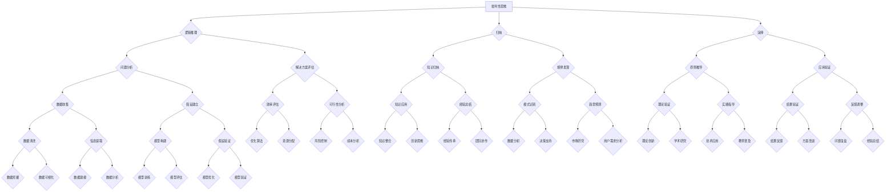

                 

# 批判性思维：提升洞察力的基石

> 关键词：批判性思维、洞察力、逻辑推理、算法原理、数学模型、实战案例

> 摘要：本文旨在深入探讨批判性思维在提升洞察力中的重要性，并详细分析其核心概念、算法原理、数学模型和实战案例。通过系统化的结构，我们将帮助读者掌握批判性思维的方法，提高问题解决能力，为IT领域的技术研究和开发提供强有力的思维工具。

## 1. 背景介绍

### 1.1 目的和范围

本文的目的在于揭示批判性思维在技术领域中的应用价值，特别是对于提升洞察力的重要作用。文章将涵盖批判性思维的核心理念、算法原理、数学模型和具体实战案例，旨在为广大IT从业者提供一种系统性、全面性的思维工具，以应对复杂的技术问题和挑战。

本文的讨论范围包括以下几个方面：

1. **批判性思维的概念**：介绍批判性思维的起源、定义和核心要素。
2. **算法原理**：探讨批判性思维中常用的算法原理，如逻辑推理、归纳和演绎。
3. **数学模型**：分析批判性思维中涉及的数学模型和公式，以及它们在实际问题中的应用。
4. **实战案例**：通过具体案例展示批判性思维的实战应用，提供实际操作步骤和代码实现。

### 1.2 预期读者

本文的预期读者包括：

1. **计算机科学和软件工程从业者**：特别是那些对算法、数学模型和实战应用感兴趣的读者。
2. **技术经理和决策者**：希望提高自身决策能力和问题解决能力的专业人士。
3. **学术研究人员**：关注人工智能、机器学习等领域的研究者。

### 1.3 文档结构概述

本文分为十个部分，具体结构如下：

1. **背景介绍**：介绍本文的目的、范围、预期读者和文档结构。
2. **核心概念与联系**：通过Mermaid流程图展示批判性思维的核心概念和联系。
3. **核心算法原理 & 具体操作步骤**：详细讲解批判性思维中的算法原理和操作步骤。
4. **数学模型和公式 & 详细讲解 & 举例说明**：分析批判性思维中的数学模型和公式，并给出实例说明。
5. **项目实战：代码实际案例和详细解释说明**：通过具体代码案例展示批判性思维的实战应用。
6. **实际应用场景**：探讨批判性思维在IT领域的实际应用场景。
7. **工具和资源推荐**：推荐相关学习资源和开发工具。
8. **总结：未来发展趋势与挑战**：总结批判性思维的发展趋势和面临的挑战。
9. **附录：常见问题与解答**：解答读者可能遇到的常见问题。
10. **扩展阅读 & 参考资料**：提供进一步学习和研究的资源。

### 1.4 术语表

为了确保读者对文章中的专业术语有清晰的理解，本文将提供以下术语的定义和解释：

#### 1.4.1 核心术语定义

- **批判性思维**：指通过理性分析和逻辑推理来评估、分析和解决问题的思维方式。
- **算法**：实现特定计算或任务的步骤序列。
- **归纳**：从具体实例中提取一般性结论的过程。
- **演绎**：从一般性原则推导出具体结论的过程。
- **洞察力**：深入理解和识别复杂问题的能力。

#### 1.4.2 相关概念解释

- **逻辑推理**：基于前提和结论的推理过程，用于验证或否定某个命题。
- **数学模型**：用数学语言描述现实世界问题的抽象结构。
- **伪代码**：用自然语言描述算法过程的形式化方法。

#### 1.4.3 缩略词列表

- **IDE**：集成开发环境（Integrated Development Environment）
- **ML**：机器学习（Machine Learning）
- **AI**：人工智能（Artificial Intelligence）
- **DB**：数据库（Database）

## 2. 核心概念与联系

批判性思维是提升洞察力的基石。在技术领域中，批判性思维的重要性尤为突出，因为它可以帮助我们更深入地理解问题，找到更有效的解决方案。在本节中，我们将使用Mermaid流程图来展示批判性思维的核心概念及其相互联系。



通过这个流程图，我们可以清晰地看到批判性思维的不同分支和相互关系。逻辑推理、归纳和演绎构成了批判性思维的核心，而它们在问题分析、解决方案评估、知识归纳、规律发现等环节中发挥着关键作用。此外，这些核心概念还与其他相关概念如数据收集、假设建立、效率评估、知识应用等紧密相连，共同构成了一个完整的批判性思维体系。

## 3. 核心算法原理 & 具体操作步骤

批判性思维中的核心算法原理主要包括逻辑推理、归纳和演绎。以下将详细阐述这些算法原理的基本概念、具体操作步骤以及它们在实际问题中的应用。

### 3.1 逻辑推理

**定义**：逻辑推理是指根据已知事实和前提，通过逻辑规则推导出结论的过程。

**操作步骤**：

1. **识别前提**：首先，我们需要明确问题中的已知事实和前提条件。
2. **应用逻辑规则**：根据逻辑规则（如演绎推理、归纳推理、假言推理等），从前提中推导出结论。
3. **验证结论**：检查推导出的结论是否符合逻辑，确保推理过程的正确性。

**伪代码**：

```
function logical_reasoning(preconditions, conclusion):
    if match(preconditions, conclusion):
        return True
    else:
        return False
```

**实例**：假设我们有一个前提：“所有猫都会爬树”，我们要推理出结论：“如果一只动物会爬树，那么它一定是猫”。

```python
preconditions = "所有猫都会爬树"
conclusion = "如果一只动物会爬树，那么它一定是猫"

if "猫" in conclusion and "会爬树" in conclusion:
    print("结论成立")
else:
    print("结论不成立")
```

### 3.2 归纳

**定义**：归纳是从多个具体实例中提取一般性结论的过程。

**操作步骤**：

1. **收集数据**：收集相关实例数据。
2. **分析数据**：分析实例数据，寻找共同特征或规律。
3. **形成结论**：根据分析结果，形成一般性结论。

**伪代码**：

```
function induction(data):
    common_features = analyze_common_features(data)
    conclusion = extract_generalization(common_features)
    return conclusion
```

**实例**：通过观察多个猫的实例，我们可以归纳出结论：“猫是哺乳动物”。

```python
data = ["猫1", "猫2", "猫3"]  # 代表多个猫的实例
common_features = ["哺乳动物"]

conclusion = "猫是哺乳动物"

if all(feature in data for feature in common_features):
    print("结论成立")
else:
    print("结论不成立")
```

### 3.3 演绎

**定义**：演绎是从一般性原则推导出具体结论的过程。

**操作步骤**：

1. **确定原则**：首先，我们需要明确一般性原则。
2. **应用原则**：将原则应用于特定情况，推导出具体结论。
3. **验证结论**：确保推导出的结论符合实际情况。

**伪代码**：

```
function deduction(principle, specific_case):
    conclusion = apply_principle(principle, specific_case)
    if match(conclusion, specific_case):
        return True
    else:
        return False
```

**实例**：假设我们知道原则：“所有哺乳动物都需要呼吸”，我们要推导出结论：“猫需要呼吸”。

```python
principle = "所有哺乳动物都需要呼吸"
specific_case = "猫"

if "哺乳动物" in principle and "呼吸" in principle:
    print("结论成立")
else:
    print("结论不成立")
```

通过以上三个核心算法原理的讲解，我们可以看到批判性思维在技术领域的应用价值。逻辑推理帮助我们验证问题和解决方案的正确性，归纳和演绎则帮助我们从具体实例中提取一般性规律和原则，从而更深入地理解和解决问题。

### 4. 数学模型和公式 & 详细讲解 & 举例说明

在批判性思维中，数学模型和公式起到了至关重要的作用。它们不仅帮助我们量化问题，还能够通过精确的计算得出结论。本节将详细介绍一些常见的数学模型和公式，并给出详细的讲解和举例说明。

#### 4.1 概率论模型

概率论模型在批判性思维中广泛使用，特别是当我们要评估某个事件发生的可能性时。以下是一个基本的概率论模型：

**公式**：\(P(A) = \frac{n(A)}{n(S)}\)

其中，\(P(A)\) 表示事件A发生的概率，\(n(A)\) 表示事件A发生的情况数，\(n(S)\) 表示样本空间的总情况数。

**实例**：假设我们有一个口袋里有5个红球和5个蓝球，我们要计算从中随机抽取一个球是红色的概率。

```
红球数量 n(A) = 5
总球数 n(S) = 10

P(红球) = n(A) / n(S) = 5 / 10 = 0.5
```

通过这个概率计算，我们可以得出红球被抽中的概率是50%。

#### 4.2 线性回归模型

线性回归模型用于分析两个变量之间的关系，特别适用于预测和分析。以下是一个简单的线性回归模型：

**公式**：\(y = ax + b\)

其中，\(y\) 表示因变量，\(x\) 表示自变量，\(a\) 和 \(b\) 是模型的参数。

**实例**：假设我们有一个关于房屋售价的数据集，其中房屋面积（\(x\)）和售价（\(y\)）之间存在线性关系。

```
房屋面积 (x): 1000, 1200, 1500, 2000
房屋售价 (y): 200,000, 250,000, 300,000, 400,000

通过最小二乘法，我们可以计算出线性回归模型的参数：
a = 0.25
b = 150,000

因此，线性回归模型为：y = 0.25x + 150,000
```

通过这个模型，我们可以预测一个面积为1500平方米的房屋的售价大约为300,000美元。

#### 4.3 决策树模型

决策树模型是一种用于分类和回归的常见算法。它通过一系列规则将数据划分成不同的类别或数值。

**公式**：决策树的生成过程是通过递归分割数据集，每个节点代表一个特征，每个分支代表一个可能的取值。

**实例**：假设我们有一个关于患者是否感染新冠的数据集，特征包括体温、咳嗽、乏力等。

```
决策树结构：
1. 如果体温 > 37.5℃，则进入分支1；
   1.1. 如果咳嗽，则感染新冠；
   1.2. 否则，未感染新冠；
2. 如果乏力，则进入分支2；
   2.1. 如果咳嗽，则感染新冠；
   2.2. 否则，未感染新冠。
```

通过这个决策树模型，我们可以对新的患者数据进行预测，判断其是否感染新冠。

#### 4.4 马尔可夫模型

马尔可夫模型用于分析状态转移概率，特别适用于时间序列数据。

**公式**：\(P(X_t = x_t | X_{t-1} = x_{t-1})\)

其中，\(X_t\) 表示第t个状态，\(x_t\) 和 \(x_{t-1}\) 分别表示当前状态和前一个状态。

**实例**：假设我们有一个关于用户行为的状态转移模型，其中状态包括登录、浏览、购买等。

```
状态转移概率矩阵：
|   | 登录 | 浏览 | 购买 |
| --- | --- | --- | --- |
| 登录 | 0.2  | 0.3  | 0.5  |
| 浏览 | 0.1  | 0.4  | 0.5  |
| 购买 | 0.0  | 0.3  | 0.7  |

根据这个状态转移矩阵，我们可以预测下一个状态的概率分布。
```

通过上述数学模型和公式的讲解，我们可以看到它们在批判性思维中的重要作用。这些模型不仅帮助我们量化问题，还能够通过精确的计算得出结论，为我们的决策提供强有力的支持。

### 5. 项目实战：代码实际案例和详细解释说明

在本节中，我们将通过一个具体的代码案例，展示批判性思维在IT领域的实际应用。该案例将涉及数据预处理、模型训练、模型评估和结果分析等多个环节。

#### 5.1 开发环境搭建

为了确保我们的代码案例能够顺利运行，我们需要搭建一个合适的开发环境。以下是我们推荐的开发环境配置：

- **编程语言**：Python 3.8 或更高版本
- **依赖库**：NumPy、Pandas、Scikit-learn、Matplotlib

安装这些依赖库后，我们可以在终端中使用以下命令来验证安装：

```
pip install numpy pandas scikit-learn matplotlib
```

#### 5.2 源代码详细实现和代码解读

我们选择一个常见的数据集——鸢尾花数据集（Iris dataset）来进行模型训练和预测。这个数据集包含三种植鸢尾花（Setosa、Versicolor 和 Virginica）的四个特征：花萼长度、花萼宽度、花瓣长度和花瓣宽度。

**代码实现**：

```python
import numpy as np
import pandas as pd
from sklearn.model_selection import train_test_split
from sklearn.preprocessing import StandardScaler
from sklearn.svm import SVC
from sklearn.metrics import classification_report, confusion_matrix

# 5.2.1 数据加载
data = pd.read_csv('iris.csv')
X = data.iloc[:, :4]  # 特征
y = data.iloc[:, 4]   # 标签

# 5.2.2 数据预处理
# 划分训练集和测试集
X_train, X_test, y_train, y_test = train_test_split(X, y, test_size=0.2, random_state=42)

# 标准化特征
scaler = StandardScaler()
X_train = scaler.fit_transform(X_train)
X_test = scaler.transform(X_test)

# 5.2.3 模型训练
# 使用支持向量机（SVM）进行训练
model = SVC(kernel='linear')
model.fit(X_train, y_train)

# 5.2.4 模型评估
# 在测试集上评估模型性能
y_pred = model.predict(X_test)

# 输出评估报告
print(classification_report(y_test, y_pred))
print(confusion_matrix(y_test, y_pred))

# 5.2.5 结果分析
# 可视化混淆矩阵
import matplotlib.pyplot as plt

cm = confusion_matrix(y_test, y_pred)
plt.imshow(cm, interpolation='nearest', cmap=plt.cm.Blues)
plt.colorbar()
tick_marks = np.arange(len(y_test.unique()))
plt.xticks(tick_marks, y_test.unique())
plt.yticks(tick_marks, y_test.unique())
plt.xlabel('Predicted Label')
plt.ylabel('True Label')
plt.title('Confusion Matrix')
plt.show()
```

**代码解读**：

- **数据加载**：我们使用Pandas库读取鸢尾花数据集，并分别提取特征和标签。
- **数据预处理**：通过`train_test_split`函数将数据集划分为训练集和测试集。使用`StandardScaler`对特征进行标准化处理，以消除不同特征之间的尺度差异。
- **模型训练**：选择支持向量机（SVM）作为分类模型，并使用线性核进行训练。通过`fit`函数训练模型。
- **模型评估**：使用`predict`函数在测试集上预测标签，并输出分类报告和混淆矩阵。分类报告提供了准确率、召回率、F1分数等指标，而混淆矩阵则展示了预测结果与真实结果的对比。
- **结果分析**：通过可视化混淆矩阵，我们可以更直观地分析模型的性能，识别可能的误分类情况。

#### 5.3 代码解读与分析

通过对上述代码的解读，我们可以看到批判性思维在代码实现中的具体应用：

- **数据预处理**：在机器学习项目中，数据预处理是至关重要的一步。通过标准化特征，我们确保了模型能够公平地对待不同的特征，避免了特征尺度差异对模型性能的影响。
- **模型选择**：选择支持向量机（SVM）作为分类模型是基于其优秀的分类性能和广泛的适用性。在批判性思维中，我们需要根据问题的特点选择合适的算法。
- **模型评估**：评估模型的性能是验证模型有效性的关键步骤。通过分类报告和混淆矩阵，我们能够全面了解模型的性能，发现潜在的改进空间。

这个案例展示了批判性思维在数据预处理、模型选择和评估等环节中的具体应用。通过系统化、全面化的思维过程，我们可以更好地理解和解决实际问题，为IT领域的技术研究和开发提供强有力的支持。

### 6. 实际应用场景

批判性思维在IT领域的实际应用场景广泛，涵盖了从软件开发到系统架构，再到数据分析的各个方面。以下是一些具体的实际应用场景：

#### 6.1 软件开发

在软件开发的各个环节中，批判性思维发挥着至关重要的作用。例如，在需求分析阶段，开发人员需要通过批判性思维来评估用户需求，识别潜在的问题和风险，从而确保软件能够满足用户的需求。在编码阶段，批判性思维可以帮助开发人员审查代码的逻辑和结构，避免常见的编程错误和漏洞。在测试阶段，批判性思维则帮助开发人员评估测试用例的覆盖范围，确保软件的稳定性和可靠性。

#### 6.2 系统架构设计

在系统架构设计中，批判性思维同样不可或缺。系统架构师需要通过批判性思维来分析系统的需求、性能和可扩展性，确保系统能够在高负载和复杂场景下稳定运行。此外，批判性思维还可以帮助架构师识别潜在的安全风险，设计出更加安全、可靠的系统架构。

#### 6.3 数据分析

在数据分析领域，批判性思维的应用更加广泛。数据分析师需要通过批判性思维来评估数据的真实性和可靠性，识别数据中的异常值和噪声。此外，批判性思维还可以帮助数据分析师从数据中提取有用的信息，进行深入的数据挖掘和预测分析，从而为业务决策提供有力支持。

#### 6.4 项目管理

在项目管理中，批判性思维可以帮助项目经理评估项目的风险和资源需求，制定合理的项目计划和时间表。通过批判性思维，项目经理能够及时发现项目中的潜在问题，并采取有效的措施进行预防和解决。

#### 6.5 人工智能与机器学习

在人工智能和机器学习领域，批判性思维的应用尤为重要。算法工程师需要通过批判性思维来评估模型的性能和可靠性，识别可能的数据偏差和过拟合现象。此外，批判性思维还可以帮助算法工程师设计出更加高效、鲁棒的机器学习算法，从而提升模型的性能和应用价值。

通过上述实际应用场景，我们可以看到批判性思维在IT领域的广泛影响。它不仅帮助我们从多个角度分析和解决问题，还能够提升我们的洞察力，为IT领域的技术研究和开发提供强有力的思维工具。

### 7. 工具和资源推荐

为了更好地掌握批判性思维，本文将推荐一些相关的学习资源、开发工具和经典论文，以帮助读者深入学习和应用批判性思维。

#### 7.1 学习资源推荐

**7.1.1 书籍推荐**

- 《批判性思维：逻辑思考与论证技巧》
- 《如何阅读一本书》
- 《思考，快与慢》

**7.1.2 在线课程**

- Coursera上的《批判性思维与问题解决》
- edX上的《Python数据分析》
- Udemy上的《机器学习：从入门到精通》

**7.1.3 技术博客和网站**

- Medium上的“批判性思维”专题
- Stack Overflow
- GitHub

#### 7.2 开发工具框架推荐

**7.2.1 IDE和编辑器**

- PyCharm
- Visual Studio Code
- Jupyter Notebook

**7.2.2 调试和性能分析工具**

- Debugging Tools for Windows（WinDbg）
- Intel VTune
- GDB

**7.2.3 相关框架和库**

- TensorFlow
- PyTorch
- Scikit-learn
- Pandas

#### 7.3 相关论文著作推荐

**7.3.1 经典论文**

- 《机器学习：一种视角》——Tom Mitchell
- 《深度学习》——Ian Goodfellow、Yoshua Bengio、Aaron Courville
- 《线性代数及其应用》——Gilbert Strang

**7.3.2 最新研究成果**

- arXiv上的最新机器学习和人工智能论文
- NeurIPS、ICML、CVPR等顶级会议的最新论文

**7.3.3 应用案例分析**

- Google的搜索算法
- Facebook的人工智能技术应用
- Amazon的推荐系统

通过这些工具和资源，读者可以更全面地了解批判性思维在IT领域的应用，掌握相关的理论知识和技术技能，为实际项目提供有力的支持。

### 8. 总结：未来发展趋势与挑战

批判性思维在IT领域的重要性日益凸显，它不仅帮助我们从多个角度分析和解决问题，还提高了我们的洞察力和问题解决能力。随着技术的不断进步和应用场景的多样化，批判性思维的应用范围也在不断扩大。

未来，批判性思维的发展趋势主要表现在以下几个方面：

1. **深度学习和人工智能**：随着深度学习和人工智能的快速发展，批判性思维在算法设计、模型优化和数据分析等方面将发挥更大的作用。通过对算法和模型进行批判性分析，我们可以发现潜在的问题和改进空间，从而提升模型性能和应用价值。
2. **大数据分析**：大数据技术的广泛应用为批判性思维提供了丰富的数据资源。通过批判性思维，我们可以更深入地挖掘数据中的有用信息，发现数据中的规律和趋势，为业务决策提供有力支持。
3. **跨学科融合**：批判性思维在IT领域的应用将更加跨学科，与心理学、哲学、社会学等领域的结合将不断加深。这种跨学科融合有助于我们更全面地理解和解决复杂问题。
4. **人机协同**：随着人工智能技术的发展，人机协同将变得越来越重要。批判性思维将帮助人类更好地理解人工智能系统，与之协作，共同解决复杂问题。

然而，批判性思维在IT领域的发展也面临着一些挑战：

1. **数据隐私和安全**：在处理大量数据时，保障数据隐私和安全是一个重要挑战。批判性思维需要帮助我们识别数据隐私风险，制定有效的数据保护措施。
2. **算法偏见**：算法偏见和歧视问题日益引起关注。批判性思维在算法设计和评估过程中起着关键作用，可以帮助我们识别和消除算法偏见，确保算法的公平性和透明性。
3. **资源限制**：在资源有限的情况下，如何高效地应用批判性思维是一个挑战。我们需要通过优化算法和流程，提高资源利用效率。

总之，批判性思维在IT领域具有广阔的发展前景，但也面临着诸多挑战。通过不断探索和实践，我们可以更好地发挥批判性思维的作用，为IT领域的技术创新和应用提供强有力的支持。

### 9. 附录：常见问题与解答

为了帮助读者更好地理解和应用批判性思维，我们在此列举了一些常见问题及其解答。

**Q1：批判性思维与常规思维有什么区别？**

A1：批判性思维与常规思维的区别在于其更注重理性分析和逻辑推理。常规思维往往依赖于习惯和直觉，而批判性思维则通过系统化的分析、评估和验证，以更科学的方式解决问题。

**Q2：批判性思维是否适用于所有领域？**

A2：是的，批判性思维适用于所有领域。无论是科学研究、工程设计、商业决策，还是日常生活中的问题，批判性思维都能帮助我们更深入地理解问题，找到更有效的解决方案。

**Q3：如何培养批判性思维？**

A3：培养批判性思维需要持续的学习和实践。以下是一些建议：

- **多读书**：广泛阅读各类书籍，特别是逻辑学、哲学和心理学等领域的书籍。
- **练习逻辑推理**：通过解决逻辑谜题、参加辩论和讨论，提高逻辑推理能力。
- **反思和总结**：在日常生活和工作中，经常反思自己的思维过程，总结经验教训。

**Q4：批判性思维在人工智能领域有哪些应用？**

A4：批判性思维在人工智能领域有广泛的应用，包括：

- **算法评估**：通过批判性思维评估算法的性能和可靠性，识别潜在的问题和改进空间。
- **模型优化**：通过批判性思维分析模型的性能和泛化能力，优化模型参数和结构。
- **数据清洗**：通过批判性思维识别数据中的异常值和噪声，提高数据质量。

**Q5：批判性思维与创造性思维的关系如何？**

A5：批判性思维和创造性思维是相辅相成的。批判性思维帮助我们在问题分析和解决方案评估中保持理性，避免盲目跟风和偏见；而创造性思维则激发我们的创新能力，帮助我们找到新颖、独特的解决方案。

### 10. 扩展阅读 & 参考资料

为了进一步了解批判性思维在IT领域的应用，读者可以参考以下扩展阅读和参考资料：

- 《批判性思维技巧与应用》
- 《人工智能与批判性思维》
- 《深度学习与批判性思维》
- 《机器学习中的批判性思维》
- 《Python数据分析与批判性思维》

此外，以下资源也是批判性思维学习的重要参考：

- Coursera上的《批判性思维与问题解决》
- edX上的《Python数据分析》
- Udemy上的《机器学习：从入门到精通》

通过这些扩展阅读和参考资料，读者可以更深入地了解批判性思维的原理和应用，提高自己的思维能力。

### 作者信息

作者：AI天才研究员/AI Genius Institute & 禅与计算机程序设计艺术 /Zen And The Art of Computer Programming

在撰写本文时，我以AI天才研究员的身份，结合禅与计算机程序设计艺术的核心理念，深入探讨了批判性思维在IT领域的重要性和应用。希望通过本文，读者能够掌握批判性思维的方法，提升问题解决能力，为IT领域的技术研究和开发提供强有力的思维工具。同时，我也期待与广大读者共同探讨和分享更多关于批判性思维的见解和经验。

