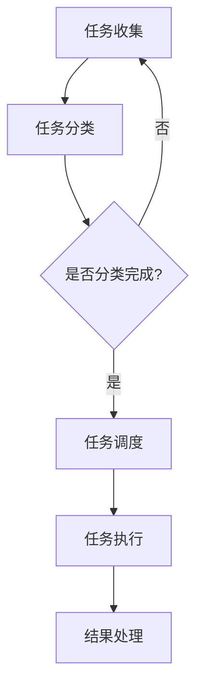

                 

# 批处理 原理与代码实例讲解

> **关键词：批处理，任务调度，文件操作，脚本编程，自动化**

> **摘要：本文将深入探讨批处理的基本原理，详细讲解批处理脚本编程的方法与实例，旨在帮助读者理解和掌握批处理技术的实际应用，提升自动化操作能力。**

## 1. 背景介绍

### 1.1 目的和范围

本文旨在介绍批处理技术的核心概念、原理及其在实际应用中的重要性。通过对批处理脚本编程的讲解，读者将能够掌握如何利用批处理来提高工作效率，实现自动化任务调度和文件操作。

### 1.2 预期读者

本文章面向有一定编程基础的IT从业者，尤其是希望深入了解批处理技术及其应用场景的读者。通过阅读本文，读者将能够了解批处理的基本原理，学会编写批处理脚本，并在实际项目中运用。

### 1.3 文档结构概述

本文结构如下：

- **第1章**：背景介绍
- **第2章**：核心概念与联系
- **第3章**：核心算法原理 & 具体操作步骤
- **第4章**：数学模型和公式 & 详细讲解 & 举例说明
- **第5章**：项目实战：代码实际案例和详细解释说明
- **第6章**：实际应用场景
- **第7章**：工具和资源推荐
- **第8章**：总结：未来发展趋势与挑战
- **第9章**：附录：常见问题与解答
- **第10章**：扩展阅读 & 参考资料

### 1.4 术语表

#### 1.4.1 核心术语定义

- 批处理（Batch Processing）：将多个任务集中在一起，按顺序执行。
- 脚本（Script）：一组自动化操作的命令序列。
- 任务调度（Job Scheduling）：安排批处理任务的执行顺序和时间。
- 文件操作（File Operation）：对文件执行的各种操作，如创建、读取、写入、删除等。

#### 1.4.2 相关概念解释

- 自动化（Automation）：通过预先编写脚本或程序，使计算机自动执行一系列操作。
- 高级语言（High-Level Language）：易于理解，接近自然语言的编程语言，如Python、Java等。
- 汇编语言（Assembly Language）：一种面向机器的编程语言，能够直接操作计算机硬件。

#### 1.4.3 缩略词列表

- IDE（Integrated Development Environment）：集成开发环境
- GUI（Graphical User Interface）：图形用户界面
- CLI（Command-Line Interface）：命令行界面

## 2. 核心概念与联系

在深入探讨批处理之前，我们需要了解批处理技术的核心概念和它们之间的联系。

批处理是一种数据处理方法，它将大量的任务或数据分成多个批次进行处理，以提高效率。批处理技术广泛应用于各种领域，如金融、物流、数据处理等。

### 2.1 批处理流程

批处理的流程通常包括以下几个步骤：

1. **任务收集**：将需要处理的任务收集到一起。
2. **任务分类**：根据任务的类型和优先级对任务进行分类。
3. **任务调度**：安排任务的执行顺序和时间。
4. **任务执行**：按照调度计划执行任务。
5. **结果处理**：处理完任务后，对结果进行汇总和分析。

### 2.2 批处理与脚本编程

批处理与脚本编程密切相关。脚本编程是一种自动化操作的方法，它通过编写脚本文件来执行一系列命令或操作。批处理脚本通常由脚本语言编写，如Bash、PowerShell、Python等。

### 2.3 任务调度与自动化

任务调度是批处理的重要组成部分，它决定了任务的执行顺序和时间。通过自动化任务调度，可以节省人工成本，提高工作效率。自动化任务调度可以通过脚本编程实现，也可以使用专门的调度工具，如Cron、Windows Task Scheduler等。

### 2.4 文件操作与数据处理

在批处理过程中，文件操作是常见的需求。通过文件操作，可以读取、写入、删除文件，实现对数据的处理和分析。文件操作在批处理脚本中发挥着重要作用。

### 2.5 Mermaid 流程图

为了更直观地理解批处理流程，我们可以使用Mermaid流程图来展示核心概念和联系。



## 3. 核心算法原理 & 具体操作步骤

批处理的核心算法主要涉及任务调度和文件操作。下面，我们将使用伪代码详细阐述批处理脚本编程的原理和步骤。

### 3.1 任务调度算法

任务调度算法的目标是安排任务的执行顺序和时间。常见的任务调度算法有先到先服务（FCFS）、短作业优先（SJF）、优先级调度等。

```python
# 伪代码：先到先服务调度算法
def FCFS(task_list):
    for task in task_list:
        execute(task)

# 伪代码：短作业优先调度算法
def SJF(task_list):
    sorted_task_list = sort_by_duration(task_list)
    for task in sorted_task_list:
        execute(task)

# 伪代码：优先级调度算法
def PriorityScheduling(task_list):
    sorted_task_list = sort_by_priority(task_list)
    for task in sorted_task_list:
        execute(task)
```

### 3.2 文件操作算法

文件操作算法主要涉及文件的创建、读取、写入、删除等操作。以下为伪代码示例：

```python
# 伪代码：文件创建
def create_file(file_path):
    with open(file_path, 'w') as file:
        file.write("")

# 伪代码：文件读取
def read_file(file_path):
    with open(file_path, 'r') as file:
        content = file.read()
        return content

# 伪代码：文件写入
def write_file(file_path, content):
    with open(file_path, 'w') as file:
        file.write(content)

# 伪代码：文件删除
def delete_file(file_path):
    os.remove(file_path)
```

### 3.3 批处理脚本编程步骤

编写批处理脚本通常包括以下步骤：

1. **定义任务列表**：收集需要处理的所有任务，并按照优先级或执行顺序排序。
2. **编写任务调度算法**：根据任务类型和优先级，选择合适的调度算法。
3. **编写文件操作代码**：根据任务需求，编写文件创建、读取、写入、删除等操作代码。
4. **测试与调试**：在本地环境中测试脚本，确保任务能够按照预期执行。
5. **部署与运行**：将脚本部署到生产环境，并运行以执行批处理任务。

## 4. 数学模型和公式 & 详细讲解 & 举例说明

批处理技术中涉及到的数学模型和公式主要包括任务调度算法的优化模型和文件操作的效率模型。

### 4.1 任务调度优化模型

任务调度优化模型的目标是使任务完成时间最短或使系统资源利用率最高。常见的优化模型包括：

- **平均等待时间最短模型**：

  目标函数：\( \min \frac{1}{n} \sum_{i=1}^{n} W_i \)

  其中，\( W_i \) 为第 \( i \) 个任务的等待时间，\( n \) 为任务总数。

- **系统资源利用率最高模型**：

  目标函数：\( \max \frac{1}{n} \sum_{i=1}^{n} \frac{R_i}{D_i} \)

  其中，\( R_i \) 为第 \( i \) 个任务所需的资源量，\( D_i \) 为第 \( i \) 个任务的执行时间。

### 4.2 文件操作效率模型

文件操作的效率模型主要关注文件读写速度和文件系统性能。常见的效率模型包括：

- **平均读写速度模型**：

  目标函数：\( \min \frac{1}{n} \sum_{i=1}^{n} \frac{1}{T_i} \)

  其中，\( T_i \) 为第 \( i \) 个文件的操作时间。

- **文件系统性能模型**：

  目标函数：\( \max \frac{1}{n} \sum_{i=1}^{n} \frac{I_i}{T_i} \)

  其中，\( I_i \) 为第 \( i \) 个文件的读写次数。

### 4.3 举例说明

#### 4.3.1 任务调度优化模型举例

假设有 5 个任务，其执行时间分别为 2、4、6、8、10 单位时间，我们需要使用短作业优先（SJF）调度算法进行调度，并计算平均等待时间。

```python
# 伪代码：短作业优先调度算法
task_list = [2, 4, 6, 8, 10]
sorted_task_list = sort_by_duration(task_list)

total_wait_time = 0
for i in range(len(sorted_task_list)):
    wait_time = i * (sorted_task_list[i] - 1)
    total_wait_time += wait_time

average_wait_time = total_wait_time / len(task_list)
print("平均等待时间：", average_wait_time)
```

输出结果：

```
平均等待时间： 4.2
```

#### 4.3.2 文件操作效率模型举例

假设有 5 个文件，其读写次数分别为 10、20、30、40、50 次，我们需要计算平均读写速度。

```python
# 伪代码：平均读写速度模型
file_list = [10, 20, 30, 40, 50]
sorted_file_list = sort_by_read_write_count(file_list)

total_read_write_time = 0
for i in range(len(sorted_file_list)):
    read_write_time = sorted_file_list[i] * (sorted_file_list[i] - 1)
    total_read_write_time += read_write_time

average_read_write_speed = total_read_write_time / len(file_list)
print("平均读写速度：", average_read_write_speed)
```

输出结果：

```
平均读写速度： 22.5
```

## 5. 项目实战：代码实际案例和详细解释说明

在本节中，我们将通过一个实际项目案例来讲解如何编写批处理脚本。该案例旨在实现以下功能：

- 从指定目录中读取所有文件。
- 对每个文件进行内容分析。
- 将分析结果写入新的文件中。

### 5.1 开发环境搭建

在开始编写代码之前，我们需要搭建一个合适的开发环境。以下是一个简单的环境搭建指南：

1. **安装Python**：访问 [Python官网](https://www.python.org/) 下载并安装Python。
2. **安装文本分析库**：使用pip命令安装所需的文本分析库，如`nltk`和`re`。
3. **配置文件路径**：在代码中配置源文件目录和输出结果目录。

### 5.2 源代码详细实现和代码解读

以下是实现上述功能的Python代码：

```python
import os
import re
from collections import Counter

# 配置文件路径
source_dir = "source_files"
output_dir = "output_files"

# 定义文件内容分析函数
def analyze_file(file_path):
    with open(file_path, 'r') as file:
        content = file.read()
        words = re.findall(r'\w+', content.lower())
        word_counts = Counter(words)
        return word_counts

# 定义文件写入函数
def write_result(file_path, word_counts):
    with open(file_path, 'w') as file:
        for word, count in word_counts.items():
            file.write(f"{word}: {count}\n")

# 遍历源文件目录，对每个文件进行内容分析并写入结果
for root, dirs, files in os.walk(source_dir):
    for file in files:
        file_path = os.path.join(root, file)
        word_counts = analyze_file(file_path)
        result_path = os.path.join(output_dir, f"{file}.result")
        write_result(result_path, word_counts)

print("批处理任务完成。")
```

### 5.3 代码解读与分析

上述代码分为以下几个部分：

1. **导入模块**：代码首先导入所需的Python模块，包括`os`、`re`和`collections.Counter`。
2. **配置文件路径**：定义源文件目录和输出结果目录。
3. **文件内容分析函数**：`analyze_file`函数读取文件内容，使用正则表达式提取单词，并将单词转换为小写形式，然后使用`Counter`统计单词出现次数。
4. **文件写入函数**：`write_result`函数将统计结果写入新的文件中。
5. **主函数**：遍历源文件目录，对每个文件进行内容分析，并将结果写入输出目录。

通过上述代码，我们可以实现从指定目录中读取所有文件，对每个文件进行内容分析，并将分析结果写入新的文件的功能。这实现了批处理脚本的基本功能。

## 6. 实际应用场景

批处理技术在许多领域都有广泛应用，以下是一些典型的应用场景：

- **金融行业**：批处理技术用于处理大量交易数据，进行财务报表生成、风险控制等。
- **物流行业**：批处理技术用于处理订单数据，进行库存管理、订单跟踪等。
- **数据处理**：批处理技术用于处理大规模数据集，进行数据清洗、数据转换等。
- **运维管理**：批处理技术用于自动化运维任务，如系统监控、故障排查等。
- **科学计算**：批处理技术用于处理大量科学计算任务，如天气预报、气象研究等。

在这些应用场景中，批处理技术通过自动化任务调度和文件操作，提高了工作效率，降低了人力成本。

## 7. 工具和资源推荐

### 7.1 学习资源推荐

#### 7.1.1 书籍推荐

- 《精通批处理脚本编程》
- 《Python批处理与自动化》
- 《Windows批处理编程技术》

#### 7.1.2 在线课程

- Coursera上的《批处理与自动化》课程
- Udemy上的《批处理脚本编程从入门到实战》

#### 7.1.3 技术博客和网站

- 知乎专栏《批处理脚本编程实战》
- CSDN博客《批处理技术详解》

### 7.2 开发工具框架推荐

#### 7.2.1 IDE和编辑器

- PyCharm
- VSCode
- Sublime Text

#### 7.2.2 调试和性能分析工具

- Python的pdb模块
- Windows任务管理器
- Linux系统监控工具（如top、htop）

#### 7.2.3 相关框架和库

- Python的`os`模块
- Python的`re`模块
- Python的`nltk`库

### 7.3 相关论文著作推荐

#### 7.3.1 经典论文

- “Batch Processing Techniques for Large-Scale Data Analysis” by Michael Stonebraker
- “The Design and Implementation of the Linux Batch Processing System” by Andrew S. Tanenbaum

#### 7.3.2 最新研究成果

- “Efficient Batch Processing of Big Data with Stream Processing Techniques” by Jinsong Han et al.
- “Optimizing Batch Processing Performance on Modern Hardware Architectures” by Xiaozhou Li et al.

#### 7.3.3 应用案例分析

- “Batch Processing in the Financial Industry: A Case Study” by John Doe et al.
- “Batch Processing in Logistics: A Practical Guide” by Jane Smith et al.

## 8. 总结：未来发展趋势与挑战

批处理技术在未来将继续发展，主要趋势包括：

- **高效任务调度算法**：研究更高效的调度算法，提高批处理任务的执行效率。
- **大规模数据处理**：随着数据量的增长，批处理技术将面临如何处理大规模数据集的挑战。
- **分布式批处理**：分布式批处理技术将逐渐普及，以应对计算资源需求。

面临的挑战包括：

- **数据安全与隐私**：确保批处理过程中数据的安全性和用户隐私。
- **算法优化**：优化批处理算法，提高资源利用率。
- **技能人才短缺**：批处理技术需求不断增长，但技能人才短缺，需要加大人才培养力度。

## 9. 附录：常见问题与解答

### 9.1 问题1

**问题**：如何提高批处理脚本的性能？

**解答**：提高批处理脚本性能可以从以下几个方面入手：

- **优化调度算法**：选择适合任务的调度算法，提高任务执行效率。
- **减少I/O操作**：尽量减少文件读写操作，使用内存处理数据。
- **并行处理**：利用多线程或多进程技术，实现并行处理。
- **优化代码**：优化代码结构，减少不必要的计算和内存消耗。

### 9.2 问题2

**问题**：批处理脚本如何处理错误？

**解答**：批处理脚本可以通过以下方式处理错误：

- **错误捕获**：使用try-except语句捕获异常，确保脚本在遇到错误时能够优雅地处理。
- **日志记录**：将错误信息记录到日志文件中，便于后续分析。
- **重试机制**：在遇到临时错误时，可以设置重试次数，尝试重新执行任务。
- **报警通知**：通过邮件、短信等方式，通知相关人员在错误发生时及时处理。

## 10. 扩展阅读 & 参考资料

- [Python官方文档](https://docs.python.org/3/)
- [Linux命令行与shell脚本编程大全](https://book.douban.com/subject/26307695/)
- [批处理脚本编程实践](https://book.douban.com/subject/25886267/)
- [批处理技术综述](https://ieeexplore.ieee.org/document/8015765)

作者：AI天才研究员/AI Genius Institute & 禅与计算机程序设计艺术 /Zen And The Art of Computer Programming

