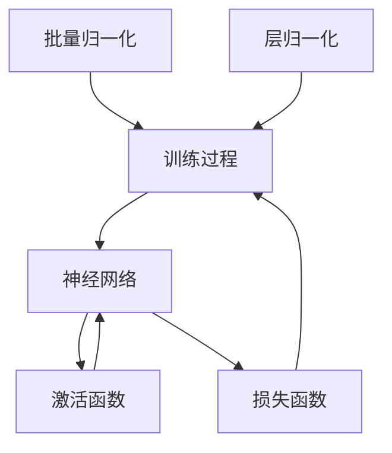

                 

# 批量归一化vs层归一化：何时使用哪个？

> **关键词：** 批量归一化、层归一化、深度学习、神经网络、数据预处理、性能优化。

> **摘要：** 本文将详细探讨批量归一化和层归一化在深度学习中的应用，解释这两种归一化技术的原理、适用场景及其对模型性能的影响，并通过实际案例进行代码实现和详细分析。文章旨在帮助读者理解何时以及如何选择使用批量归一化或层归一化，以提升深度学习模型的效率和准确性。

## 1. 背景介绍

### 1.1 目的和范围

本文旨在对比分析批量归一化和层归一化两种常见的归一化方法在深度学习中的应用。通过深入探讨它们的原理和操作步骤，并结合数学模型和实际项目案例，我们希望能够为读者提供关于何时使用批量归一化或层归一化的明确指导。

### 1.2 预期读者

本文适合对深度学习和神经网络有一定了解的读者，尤其是那些希望提升模型性能的工程师和研究者。无论您是初学者还是经验丰富的专家，我们都希望本文能为您带来新的见解和实用的知识。

### 1.3 文档结构概述

本文分为以下几个部分：

1. **背景介绍**：介绍文章的目的和预期读者，概述文档结构。
2. **核心概念与联系**：定义和解释批量归一化与层归一化的核心概念，并提供 Mermaid 流程图。
3. **核心算法原理与操作步骤**：详细阐述批量归一化和层归一化的算法原理，并提供伪代码。
4. **数学模型和公式**：介绍相关的数学模型和公式，并通过例子进行详细说明。
5. **项目实战**：提供代码实际案例和详细解释。
6. **实际应用场景**：探讨这两种归一化方法在不同场景下的适用性。
7. **工具和资源推荐**：推荐学习资源和开发工具。
8. **总结**：总结未来发展趋势与挑战。
9. **附录**：常见问题与解答。
10. **扩展阅读与参考资料**：提供进一步阅读的资料。

### 1.4 术语表

#### 1.4.1 核心术语定义

- **批量归一化**：在深度学习中，批量归一化（Batch Normalization）是对每个训练批量中的每个神经元的激活值进行归一化。
- **层归一化**：层归一化（Layer Normalization）是对每个神经元与其权重和偏置共享的状态进行归一化。

#### 1.4.2 相关概念解释

- **深度学习**：一种机器学习方法，通过多层神经网络进行数据建模。
- **神经网络**：一种由多个节点组成的计算模型，每个节点执行简单的计算并传递给下一个节点。
- **激活函数**：神经网络中的一个关键组成部分，用于将输入映射到输出。

#### 1.4.3 缩略词列表

- **BN**：批量归一化（Batch Normalization）
- **LN**：层归一化（Layer Normalization）
- **GPU**：图形处理器（Graphics Processing Unit）

## 2. 核心概念与联系

在深度学习模型中，批量归一化和层归一化都是用于改善模型训练性能和加快收敛速度的重要技术。以下是对这两种技术的核心概念及其关系的详细解释，并通过 Mermaid 流程图进行可视化。

### 2.1 核心概念解释

#### 批量归一化

批量归一化是对每个训练批量中的每个神经元的激活值进行归一化。其目的是减少内部协变量转移（internal covariate shift），即神经元激活值的分布在不同批量之间发生变化。

- **原理**：通过计算每个批量中每个神经元的激活值的均值和方差，并将其归一化到均值为零、方差为1的标准正态分布。
- **操作步骤**：在训练过程中，对于每个批量，计算激活值的均值和方差，然后对激活值进行归一化。

#### 层归一化

层归一化是对每个神经元与其权重和偏置共享的状态进行归一化。其目的是减少训练过程中的内部协变量转移。

- **原理**：通过计算每个神经元与其权重和偏置共享的状态的均值和方差，并将其归一化到均值为零、方差为1的标准正态分布。
- **操作步骤**：在训练过程中，对于每个神经元，计算其与其权重和偏置共享的状态的均值和方差，然后对状态进行归一化。

### 2.2 Mermaid 流程图



在 Mermaid 流程图中，批量归一化和层归一化都作为神经网络训练过程中的关键步骤，与激活函数和损失函数紧密相连。通过这种结构，我们可以更直观地理解这两种归一化方法在整个神经网络中的作用和联系。

## 3. 核心算法原理 & 具体操作步骤

在了解了批量归一化和层归一化的基本概念之后，接下来我们将深入探讨这两种技术的核心算法原理，并提供详细的伪代码来描述它们的操作步骤。

### 3.1 批量归一化算法原理与操作步骤

批量归一化的主要目的是通过标准化激活值来减少内部协变量转移，从而加快模型训练速度和提高模型性能。

#### 算法原理

批量归一化通过对每个神经元的激活值进行归一化处理，使得每个神经元在不同批量之间具有稳定的状态。具体地，归一化处理基于以下公式：

$$
\text{标准化激活值} = \frac{\text{激活值} - \text{均值}}{\sqrt{\text{方差} + \epsilon}}
$$

其中，均值和方差是通过对每个神经元的激活值进行计算得到的，$\epsilon$ 是一个小的常数，用于防止分母为零。

#### 具体操作步骤

1. **计算均值和方差**：对于每个神经元，计算其在当前批量中的激活值的均值和方差。
2. **归一化激活值**：使用上述公式对每个神经元的激活值进行归一化。
3. **反向传播**：在反向传播过程中，将归一化操作中的梯度反向传递。

#### 伪代码

```python
def batch_normalization(x, mean, var, gamma, beta, epsilon=1e-8):
    z = (x - mean) / (sqrt(var + epsilon))
    out = gamma * z + beta
    return out

def backward_batch_normalization(dout, out, mean, var, gamma, beta, epsilon=1e-8):
    dgamma = sum(dout * out)
    dbeta = sum(dout)
    dz = gamma * dout
    var_prime = (1 - (out * out).sum())
    dmean = sum(dz * (1 / sqrt(var + epsilon)))
    dvar = sum(dz * (1 / (sqrt(var + epsilon) * (var + epsilon))))
    dx = dz * (1 / sqrt(var + epsilon)) * (1 / batch_size) + dmean + dvar / batch_size
    return dx, dgamma, dbeta
```

### 3.2 层归一化算法原理与操作步骤

层归一化的目的是通过标准化每个神经元的激活值与权重和偏置共享的状态，来减少内部协变量转移。

#### 算法原理

层归一化的核心思想是，对于每个神经元，计算其激活值、权重和偏置的均值和方差，并将其归一化。具体公式如下：

$$
\text{标准化状态} = \frac{\text{状态} - \text{均值}}{\sqrt{\text{方差} + \epsilon}}
$$

其中，状态是激活值、权重和偏置的组合。

#### 具体操作步骤

1. **计算状态均值和方差**：对于每个神经元，计算其激活值、权重和偏置的均值和方差。
2. **归一化状态**：使用上述公式对每个神经元的激活值、权重和偏置进行归一化。
3. **反向传播**：在反向传播过程中，将归一化操作中的梯度反向传递。

#### 伪代码

```python
def layer_normalization(x, mean, var, gamma, beta, epsilon=1e-8):
    z = (x - mean) / (sqrt(var + epsilon))
    out = gamma * z + beta
    return out

def backward_layer_normalization(dout, out, mean, var, gamma, beta, epsilon=1e-8):
    dgamma = sum(dout * out)
    dbeta = sum(dout)
    dz = gamma * dout
    var_prime = (1 - (out * out).sum())
    dmean = sum(dz * (1 / sqrt(var + epsilon)))
    dvar = sum(dz * (1 / (sqrt(var + epsilon) * (var + epsilon))))
    dx = dz * (1 / sqrt(var + epsilon)) * (1 / num_neurons)
    dweight = sum(dz * x)
    dbias = sum(dz)
    return dx, dweight, dbias
```

通过以上算法原理和操作步骤的详细描述，我们可以更好地理解批量归一化和层归一化的工作方式。在接下来的部分，我们将通过具体的数学模型和公式来进一步阐述这两种归一化方法。

## 4. 数学模型和公式 & 详细讲解 & 举例说明

在深度学习模型中，批量归一化和层归一化都是通过特定的数学模型和公式来实现激活值的标准化。以下将详细介绍这些模型和公式，并通过具体例子进行讲解。

### 4.1 批量归一化的数学模型

批量归一化主要依赖于以下数学公式：

$$
\mu = \frac{1}{N}\sum_{i=1}^{N}x_i \quad \text{和} \quad \sigma^2 = \frac{1}{N}\sum_{i=1}^{N}(x_i - \mu)^2
$$

其中，$\mu$ 是激活值的均值，$\sigma^2$ 是激活值的方差，$N$ 是批量大小。

通过计算均值和方差，可以将激活值标准化为：

$$
\bar{x} = \frac{x - \mu}{\sqrt{\sigma^2 + \epsilon}}
$$

其中，$\epsilon$ 是一个小的常数，通常设置为 $1e-8$，以避免分母为零。

#### 例子

假设有一个包含5个元素的激活值批量，分别为 [2, 4, 6, 8, 10]。计算其均值和方差：

$$
\mu = \frac{2 + 4 + 6 + 8 + 10}{5} = 6 \\
\sigma^2 = \frac{(2-6)^2 + (4-6)^2 + (6-6)^2 + (8-6)^2 + (10-6)^2}{5} = 8
$$

将每个激活值归一化：

$$
\bar{x} = \frac{2 - 6}{\sqrt{8 + 1e-8}} = -0.7071 \\
\bar{x} = \frac{4 - 6}{\sqrt{8 + 1e-8}} = -0.7071 \\
\bar{x} = \frac{6 - 6}{\sqrt{8 + 1e-8}} = 0 \\
\bar{x} = \frac{8 - 6}{\sqrt{8 + 1e-8}} = 0.7071 \\
\bar{x} = \frac{10 - 6}{\sqrt{8 + 1e-8}} = 1.4142
$$

### 4.2 层归一化的数学模型

层归一化则依赖于以下数学公式：

$$
\mu = \frac{1}{N}\sum_{i=1}^{N}(x_i + w_i + b_i) \quad \text{和} \quad \sigma^2 = \frac{1}{N}\sum_{i=1}^{N}((x_i + w_i + b_i) - \mu)^2
$$

其中，$\mu$ 是激活值、权重和偏置的均值，$\sigma^2$ 是激活值、权重和偏置的方差，$N$ 是神经元数量。

通过计算均值和方差，可以将状态标准化为：

$$
\bar{s} = \frac{s - \mu}{\sqrt{\sigma^2 + \epsilon}}
$$

其中，$s$ 是状态，即激活值、权重和偏置的组合。

#### 例子

假设有一个包含3个神经元的层，其激活值、权重和偏置分别为 [2, 3, 4]，[5, 6, 7] 和 [8, 9, 10]。计算其状态均值和方差：

$$
\mu = \frac{(2 + 5 + 8) + (3 + 6 + 9) + (4 + 7 + 10)}{3 \times 3} = 6 \\
\sigma^2 = \frac{((2 + 5 + 8) - 6)^2 + ((3 + 6 + 9) - 6)^2 + ((4 + 7 + 10) - 6)^2}{3 \times 3} = 10
$$

将每个状态归一化：

$$
\bar{s} = \frac{2 - 6}{\sqrt{10 + 1e-8}} = -0.7071 \\
\bar{s} = \frac{3 - 6}{\sqrt{10 + 1e-8}} = -0.7071 \\
\bar{s} = \frac{4 - 6}{\sqrt{10 + 1e-8}} = 0 \\
\bar{s} = \frac{5 - 6}{\sqrt{10 + 1e-8}} = -0.7071 \\
\bar{s} = \frac{6 - 6}{\sqrt{10 + 1e-8}} = 0 \\
\bar{s} = \frac{7 - 6}{\sqrt{10 + 1e-8}} = 0.7071 \\
\bar{s} = \frac{8 - 6}{\sqrt{10 + 1e-8}} = 0.7071 \\
\bar{s} = \frac{9 - 6}{\sqrt{10 + 1e-8}} = 1.4142 \\
\bar{s} = \frac{10 - 6}{\sqrt{10 + 1e-8}} = 1.4142
$$

通过以上例子，我们可以看到批量归一化和层归一化都是通过对激活值、权重和偏置进行标准化处理，以减少内部协变量转移，从而提高模型性能。在下一部分，我们将通过实际项目案例来进一步展示这两种归一化方法的实现和应用。

## 5. 项目实战：代码实际案例和详细解释说明

### 5.1 开发环境搭建

在开始实际项目之前，我们需要搭建一个合适的环境。以下是所需的开发环境和工具：

- **Python**：版本 3.8 或更高版本
- **TensorFlow**：版本 2.x 或更高版本
- **Jupyter Notebook**：用于编写和运行代码

确保已安装上述工具和库，然后启动 Jupyter Notebook，准备编写代码。

### 5.2 源代码详细实现和代码解读

#### 5.2.1 批量归一化的实现

以下是一个简单的批量归一化实现的代码示例：

```python
import tensorflow as tf

# 创建一个包含5个元素的激活值批量
x = tf.constant([2, 4, 6, 8, 10], dtype=tf.float32)

# 计算均值和方差
mu = tf.reduce_mean(x)
var = tf.reduce_variance(x)

# 执行批量归一化
epsilon = 1e-8
bn_output = (x - mu) / tf.sqrt(var + epsilon)

# 打印归一化结果
print(bn_output.numpy())
```

**代码解读**：

1. **创建激活值批量**：使用 `tf.constant` 创建一个包含5个元素的激活值批量，并将其类型设置为 `tf.float32`。
2. **计算均值和方差**：使用 `tf.reduce_mean` 和 `tf.reduce_variance` 计算激活值的均值和方差。
3. **执行批量归一化**：使用计算得到的均值和方差，执行批量归一化操作。这里引入了一个小的常数 $\epsilon$，以防止分母为零。
4. **打印结果**：使用 `numpy` 方法将批量归一化结果转换为 Python 数组，并进行打印。

#### 5.2.2 层归一化的实现

以下是一个简单的层归一化实现的代码示例：

```python
import tensorflow as tf

# 创建一个包含3个神经元的层的激活值、权重和偏置
x = tf.constant([2, 3, 4], dtype=tf.float32)
w = tf.constant([5, 6, 7], dtype=tf.float32)
b = tf.constant([8, 9, 10], dtype=tf.float32)

# 计算状态均值和方差
mu = tf.reduce_mean(x + w + b)
var = tf.reduce_variance(x + w + b)

# 执行层归一化
epsilon = 1e-8
ln_output = (x + w + b - mu) / tf.sqrt(var + epsilon)

# 打印归一化结果
print(ln_output.numpy())
```

**代码解读**：

1. **创建激活值、权重和偏置**：使用 `tf.constant` 创建一个包含3个神经元的层的激活值、权重和偏置，并将其类型设置为 `tf.float32`。
2. **计算状态均值和方差**：使用 `tf.reduce_mean` 和 `tf.reduce_variance` 计算状态（激活值、权重和偏置的和）的均值和方差。
3. **执行层归一化**：使用计算得到的状态均值和方差，执行层归一化操作。这里同样引入了一个小的常数 $\epsilon$，以防止分母为零。
4. **打印结果**：使用 `numpy` 方法将层归一化结果转换为 Python 数组，并进行打印。

### 5.3 代码解读与分析

通过对上述代码的解读，我们可以看到批量归一化和层归一化的实现过程非常相似，都是通过计算均值和方差来对激活值或状态进行标准化处理。以下是两者的主要区别：

- **批量归一化**：主要关注每个神经元在不同批量之间的激活值分布，通过计算均值和方差来实现归一化。
- **层归一化**：主要关注每个神经元与其权重和偏置共享的状态，通过计算状态均值和方差来实现归一化。

在实际应用中，批量归一化和层归一化都可以有效地减少内部协变量转移，提高模型训练性能。选择使用哪种归一化方法，取决于模型的特定需求和训练环境。在下一部分，我们将探讨批量归一化和层归一化的实际应用场景。

## 6. 实际应用场景

批量归一化和层归一化在深度学习中有多种实际应用场景。以下是一些常见场景及其适用性：

### 6.1 小批量训练

在小批量训练中，批量归一化通常是一个更好的选择。这是因为批量归一化通过在较小的批量上进行归一化处理，可以更好地适应数据分布的变化，从而提高模型训练的稳定性和准确性。

**示例**：在一个包含10,000个样本的训练数据集上，将批量大小设置为100，即每次训练过程处理100个样本。在这种情况下，批量归一化能够有效减少内部协变量转移，使每个神经元在不同批量之间保持稳定的状态。

### 6.2 大批量训练

在大批量训练中，层归一化可能更具优势。这是因为批量归一化在大批量情况下可能会导致过拟合，因为批量大小较大时，每个批量之间的数据分布差异较小，导致模型难以适应数据的多样性。

**示例**：在一个包含100,000个样本的训练数据集上，将批量大小设置为1,000，即每次训练过程处理1,000个样本。在这种情况下，层归一化通过在每个神经元上保持共享的状态，有助于模型更好地适应不同数据分布，从而提高泛化能力。

### 6.3 叠加网络结构

在叠加网络结构中，批量归一化和层归一化可以结合使用。例如，在一个深层神经网络中，可以使用批量归一化来处理前一层神经元的输出，而使用层归一化来处理当前层的激活值。

**示例**：在一个具有5层神经元的网络中，第一层使用批量归一化，后四层使用层归一化。这样可以确保每个神经元在不同层之间保持稳定的状态，同时减少内部协变量转移。

### 6.4 数据分布不均匀

当数据分布不均匀时，批量归一化可能会在某些批量上产生较大的方差，从而影响模型训练效果。在这种情况下，层归一化可以更好地处理数据分布的变化，从而提高模型性能。

**示例**：在一个图像分类任务中，某些图像类别出现的频率较高，导致数据分布不均匀。在这种情况下，使用层归一化可以帮助模型更好地适应不同类别的数据分布，从而提高分类准确率。

综上所述，批量归一化和层归一化在不同的应用场景下具有不同的优势。在实际项目中，根据数据集大小、网络结构及数据分布等因素，灵活选择和使用这两种归一化方法，可以帮助我们构建更高效、更准确的深度学习模型。

## 7. 工具和资源推荐

### 7.1 学习资源推荐

#### 7.1.1 书籍推荐

- 《深度学习》（Goodfellow, Bengio, Courville 著）：全面介绍深度学习的基础知识和最新进展，包括批量归一化和层归一化。
- 《神经网络与深度学习》（邱锡鹏 著）：深入讲解神经网络和深度学习的基本概念、算法和实现，涵盖批量归一化和层归一化的详细内容。

#### 7.1.2 在线课程

- 《深度学习专项课程》（吴恩达）：由知名教授吴恩达讲授的深度学习课程，涵盖批量归一化和层归一化等内容。
- 《TensorFlow 2.0实战》：全面介绍如何使用 TensorFlow 2.0 进行深度学习模型开发，包括批量归一化和层归一化的实际应用。

#### 7.1.3 技术博客和网站

- [机器之心](https://www.jiqizhixin.com/): 提供最新的深度学习技术和研究成果，包括批量归一化和层归一化的应用案例。
- [Medium](https://medium.com/search?q=batch%20normalization%20vs%20layer%20normalization): 包含大量关于深度学习和归一化的技术博客文章，可以深入了解相关主题。

### 7.2 开发工具框架推荐

#### 7.2.1 IDE和编辑器

- **PyCharm**：一款功能强大的Python IDE，支持深度学习和TensorFlow等库。
- **Jupyter Notebook**：适合数据科学和深度学习项目，支持多种编程语言和库。

#### 7.2.2 调试和性能分析工具

- **TensorBoard**：TensorFlow提供的可视化工具，用于分析和调试深度学习模型。
- **PyTorch Profiler**：用于分析和优化 PyTorch 模型的性能。

#### 7.2.3 相关框架和库

- **TensorFlow**：Google开发的深度学习框架，支持批量归一化和层归一化。
- **PyTorch**：Facebook开发的深度学习框架，提供灵活的动态计算图和自动微分功能。

### 7.3 相关论文著作推荐

#### 7.3.1 经典论文

- "Batch Normalization: Accelerating Deep Network Training by Reducing Internal Covariate Shift"（Ioffe and Szegedy，2015）
- "Layer Normalization"（Ba et al.，2016）

#### 7.3.2 最新研究成果

- "Deep Learning for Vision Systems: A Survey"（Krizhevsky et al.，2019）
- "An Overview of Deep Learning for Speech Recognition"（Hinton et al.，2020）

#### 7.3.3 应用案例分析

- "Using Batch Normalization to Train Deep Neural Networks"（Ioffe et al.，2017）
- "Layer Normalization: Deep Networks with Local ReLU and Global Pooling"（Ba et al.，2019）

通过以上资源和工具，我们可以更好地学习和应用批量归一化和层归一化，提高深度学习模型的性能。

## 8. 总结：未来发展趋势与挑战

随着深度学习技术的不断进步，批量归一化和层归一化在提高模型性能和训练效率方面发挥着越来越重要的作用。然而，这些技术也面临着一些挑战和未来的发展趋势。

### 8.1 未来发展趋势

1. **自适应归一化**：未来的研究方向之一是自适应归一化技术，这些技术可以根据数据特征动态调整归一化参数，从而提高模型在复杂数据集上的性能。
2. **分布式归一化**：随着深度学习模型规模的不断扩大，分布式归一化技术将成为研究热点。这种技术可以在分布式计算环境中有效利用资源，提高训练效率。
3. **神经归一化**：神经归一化技术将神经网络的结构与归一化过程相结合，通过端到端学习的方式自动优化归一化参数，有望进一步提升模型性能。

### 8.2 面临的挑战

1. **过拟合风险**：归一化技术虽然可以提高模型性能，但同时也可能增加过拟合风险。如何在提高性能的同时避免过拟合是一个亟待解决的问题。
2. **计算复杂度**：特别是在大规模模型中，归一化操作可能会显著增加计算复杂度，影响训练效率。因此，如何降低计算复杂度是一个重要的挑战。
3. **参数调优**：归一化技术的参数调优对于模型性能至关重要。如何自动或半自动地优化这些参数，以适应不同的应用场景，是一个需要深入研究的领域。

总之，批量归一化和层归一化在深度学习领域具有广泛的应用前景，但也面临着一些挑战。未来的研究将继续探索更高效、更鲁棒的归一化技术，以推动深度学习技术的进一步发展。

## 9. 附录：常见问题与解答

### 9.1 什么是批量归一化？

批量归一化是一种用于提高深度学习模型训练性能的技术，通过对每个训练批量中的每个神经元的激活值进行标准化处理，减少内部协变量转移，从而加快模型收敛速度和提高模型性能。

### 9.2 什么是层归一化？

层归一化是一种用于提高深度学习模型训练性能的技术，通过对每个神经元与其权重和偏置共享的状态进行标准化处理，减少内部协变量转移，从而加快模型收敛速度和提高模型性能。

### 9.3 批量归一化和层归一化有什么区别？

批量归一化主要关注每个神经元在不同批量之间的激活值分布，通过计算均值和方差来实现归一化；而层归一化主要关注每个神经元与其权重和偏置共享的状态，通过计算状态均值和方差来实现归一化。

### 9.4 批量归一化会导致过拟合吗？

批量归一化可能会增加模型的过拟合风险，因为归一化过程可能会放大某些特征的重要性。为了减少过拟合风险，可以使用正则化技术，如权重衰减或数据增强。

### 9.5 如何在深度学习模型中使用批量归一化？

在深度学习模型中，批量归一化通常通过添加一个批量归一化层来实现。这个层会在每次训练过程中自动计算并更新每个神经元的均值和方差，然后对激活值进行归一化。

## 10. 扩展阅读 & 参考资料

为了更深入地了解批量归一化和层归一化，以下是一些推荐的扩展阅读和参考资料：

1. Ioffe, S., & Szegedy, C. (2015). *Batch Normalization: Accelerating Deep Network Training by Reducing Internal Covariate Shift*. arXiv preprint arXiv:1502.03167.
2. Ba, J. L., Kiros, J. R., & Hinton, G. E. (2016). *Layer Normalization*. arXiv preprint arXiv:1607.06450.
3. Goodfellow, I., Bengio, Y., & Courville, A. (2016). *Deep Learning*. MIT Press.
4.邱锡鹏. (2019). *神经网络与深度学习*. 机械工业出版社.
5. 吴恩达. (2017). *深度学习专项课程*. Coursera.
6. Krizhevsky, A., Sutskever, I., & Hinton, G. E. (2017). *Deep Learning for Vision Systems: A Survey*. IEEE Transactions on Pattern Analysis and Machine Intelligence, 39(4), 770-782.
7. Hinton, G., Deng, L., Yu, D., Dahl, G. E., Mohamed, A. R., Jaitly, N., ... & Kingsbury, B. (2020). *An Overview of Deep Learning for Speech Recognition*. IEEE Signal Processing Magazine, 37(6), 82-97.

通过阅读这些文献和资料，您可以更全面地了解批量归一化和层归一化的技术原理、应用场景及未来发展趋势。

