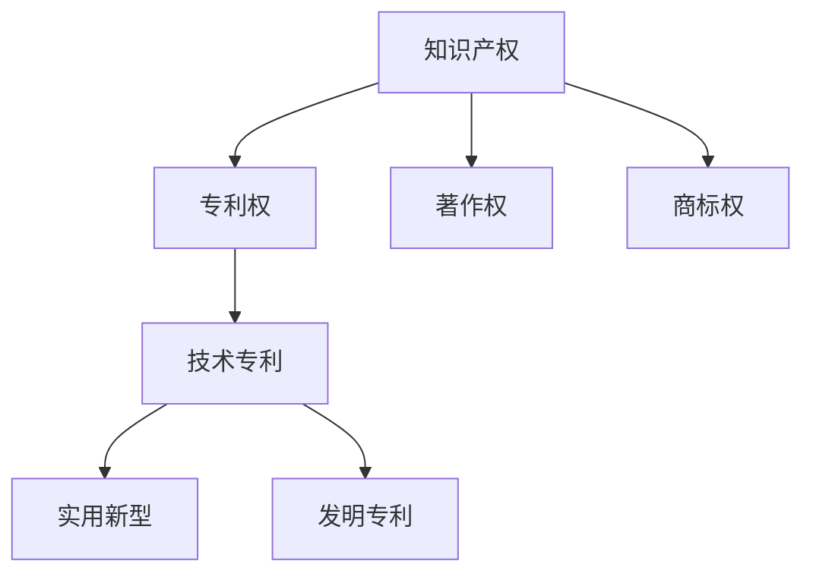

                 

# 技术专利：程序员的隐藏财富

> 关键词：技术专利、程序员、知识产权、创新、法律保护

> 摘要：本文旨在探讨技术专利对程序员职业发展的重要性，分析专利的申请流程、保护机制及其在创新过程中的作用。通过实际案例，我们将深入理解专利的价值，帮助程序员发掘其隐藏的财富。

## 1. 背景介绍

### 1.1 目的和范围

本文的目的是向程序员介绍技术专利的概念，探讨其在软件开发和人工智能领域的重要性。我们将详细讨论技术专利的申请流程、法律保护及其对程序员职业生涯的潜在影响。同时，本文将提供一些实际案例，以帮助程序员更好地理解专利的价值。

### 1.2 预期读者

本文适用于对技术专利有一定了解的程序员，以及希望了解专利对职业发展有何帮助的技术爱好者。无论您是初级程序员还是有丰富经验的开发人员，本文都将为您提供有价值的见解和实用的信息。

### 1.3 文档结构概述

本文将分为以下章节：

- **第1章：背景介绍**
  - 介绍本文的目的、预期读者和文档结构。
- **第2章：核心概念与联系**
  - 阐述技术专利的基本概念和相关联系。
- **第3章：核心算法原理 & 具体操作步骤**
  - 分析专利申请的核心算法原理和操作步骤。
- **第4章：数学模型和公式 & 详细讲解 & 举例说明**
  - 介绍专利申请过程中涉及到的数学模型和公式，并提供实例说明。
- **第5章：项目实战：代码实际案例和详细解释说明**
  - 展示一个实际的技术专利申请案例，并详细解释代码实现。
- **第6章：实际应用场景**
  - 探讨技术专利在软件开发和人工智能领域的应用。
- **第7章：工具和资源推荐**
  - 推荐学习和实践技术专利的相关资源和工具。
- **第8章：总结：未来发展趋势与挑战**
  - 分析技术专利的未来发展趋势和面临的挑战。
- **第9章：附录：常见问题与解答**
  - 回答读者可能遇到的一些常见问题。
- **第10章：扩展阅读 & 参考资料**
  - 提供本文引用的相关文献和扩展阅读资源。

### 1.4 术语表

#### 1.4.1 核心术语定义

- **技术专利**：指在某一特定技术领域内，具有创新性和实用性的发明或技术方案，经过国家知识产权局审核后获得的法律保护。
- **专利申请**：指个人或企业根据专利法规定，向国家知识产权局提交的技术发明或技术方案的申请。
- **知识产权**：指智力成果产生的权利，包括专利权、著作权、商标权等。
- **创新**：指在原有技术基础上提出新的想法、方法或改进，以产生新的技术成果。

#### 1.4.2 相关概念解释

- **实用新型**：指在技术方面具有实际应用价值的发明，通常要求结构简单、易于实现。
- **发明专利**：指在技术方面具有高度创新性的发明，通常要求具有较高的技术水平和实用价值。
- **知识产权战略**：指企业或个人为保护和管理其知识产权而制定的整体规划和策略。

#### 1.4.3 缩略词列表

- **IPR**：知识产权（Intellectual Property Rights）
- **PCT**：专利合作条约（Patent Cooperation Treaty）
- **FDA**：食品和药物管理局（Food and Drug Administration）

## 2. 核心概念与联系

在深入了解技术专利之前，我们需要明确几个核心概念和它们之间的关系。以下是一个简单的Mermaid流程图，展示了这些概念的基本联系：



### 2.1 知识产权与专利权

知识产权是指由人类智力劳动创造的成果所享有的权利，包括专利权、著作权、商标权等。其中，专利权是知识产权的一种重要形式，主要涉及技术领域的创新和发明。

### 2.2 专利权与技术专利

技术专利是指在某一技术领域内，具有创新性和实用性的发明或技术方案。根据其创新程度和实用性，技术专利可分为实用新型和发明专利。

### 2.3 实用新型与发明专利

实用新型是指具有实际应用价值的技术发明，通常要求结构简单、易于实现。发明专利则是指具有高度创新性的技术发明，通常要求具有较高的技术水平和实用价值。

### 2.4 知识产权战略

知识产权战略是指企业或个人为保护和管理其知识产权而制定的整体规划和策略。一个有效的知识产权战略可以帮助企业或个人更好地利用知识产权，实现持续的创新和发展。

## 3. 核心算法原理 & 具体操作步骤

### 3.1 核心算法原理

技术专利的申请过程涉及多个核心算法原理，包括专利搜索、创新性评估、实用性评估等。以下是一个简化的伪代码，用于描述这些核心算法原理：

```plaintext
function applyPatent(invention):
    # 搜索已有技术
    searchResults = searchPatents()

    # 评估创新性
    if not isInnovative(invention, searchResults):
        return "专利申请失败：缺乏创新性"

    # 评估实用性
    if not isPractical(invention):
        return "专利申请失败：缺乏实用性"

    # 撰写专利申请文件
    patentApplication = createApplication(invention)

    # 提交专利申请
    submitApplication(patentApplication)

    return "专利申请成功"
```

### 3.2 具体操作步骤

下面我们详细解释技术专利申请的具体操作步骤：

#### 3.2.1 专利搜索

在申请专利之前，首先需要进行专利搜索，以了解已有技术领域的情况。专利搜索主要包括以下步骤：

1. 确定关键词：根据技术领域的特点，选择合适的关键词进行搜索。
2. 查找已有专利：使用专利数据库（如Google Patents、美国专利商标局等）进行搜索，查找与关键词相关的已有专利。
3. 分析搜索结果：对搜索结果进行分析，了解已有技术的创新点和不足之处。

#### 3.2.2 创新性评估

创新性评估是指对发明的新颖性、创造性和实用性进行评估。具体步骤如下：

1. 确定创新点：分析发明与已有技术的区别，找出创新点。
2. 评估新颖性：对比已有专利，判断发明是否具有新颖性。
3. 评估创造性：判断发明是否具有创造性，即是否具有突破性。

#### 3.2.3 实用性评估

实用性评估是指对发明的实际应用价值进行评估。具体步骤如下：

1. 确定应用场景：分析发明在不同场景下的应用可能性。
2. 评估实用性：判断发明是否具有实际应用价值，是否能解决现有问题。

#### 3.2.4 撰写专利申请文件

撰写专利申请文件是专利申请过程中的重要环节。具体步骤如下：

1. 编写技术说明：详细描述发明的技术方案、实施方式和效果。
2. 编写权利要求书：明确发明的保护范围，确定保护内容。
3. 编写摘要：简洁地概括发明的主要技术特点和应用。

#### 3.2.5 提交专利申请

提交专利申请是指将专利申请文件提交给国家知识产权局。具体步骤如下：

1. 准备申请材料：根据专利申请要求，准备完整的申请材料。
2. 提交申请：将申请材料提交给国家知识产权局。
3. 缴纳申请费用：按照规定缴纳申请费用。

## 4. 数学模型和公式 & 详细讲解 & 举例说明

在技术专利的申请过程中，数学模型和公式起着重要的作用，特别是在评估创新性和实用性时。以下是一个简化的数学模型和公式的示例，用于描述创新性评估和实用性评估：

### 4.1 创新性评估模型

创新性评估模型通常基于以下三个关键因素：

1. **新颖性**：用N表示，表示发明的创新程度。
2. **创造性**：用C表示，表示发明的突破性。
3. **实用性**：用P表示，表示发明的实际应用价值。

创新性评估公式如下：

\[ I = \frac{N + C + P}{3} \]

其中，I表示创新性评分，取值范围为0到1。评分越高，表示创新性越强。

### 4.2 实用性评估模型

实用性评估模型通常基于以下两个关键因素：

1. **技术难度**：用T表示，表示实现发明的技术难度。
2. **市场潜力**：用M表示，表示发明的市场前景。

实用性评估公式如下：

\[ U = \frac{T + M}{2} \]

其中，U表示实用性评分，取值范围为0到1。评分越高，表示实用性越强。

### 4.3 举例说明

假设一个发明涉及一种新型的人工智能算法，该算法在解决特定问题时表现出色。以下是一个具体的例子，用于说明创新性评估和实用性评估：

#### 4.3.1 创新性评估

1. **新颖性**：通过专利搜索发现，已有专利中的算法在解决同类问题时效率较低。因此，新颖性评分N为0.8。
2. **创造性**：该算法采用了一种全新的思路，具有显著的突破性。创造性评分C为0.9。
3. **实用性**：该算法在多个实际应用场景中表现出色，具有广泛的应用前景。实用性评分P为0.7。

根据创新性评估公式，计算创新性评分：

\[ I = \frac{N + C + P}{3} = \frac{0.8 + 0.9 + 0.7}{3} = 0.8 \]

因此，该发明的创新性评分为0.8，表示具有很高的创新性。

#### 4.3.2 实用性评估

1. **技术难度**：实现该算法需要较高的技术能力，技术难度评分为0.6。
2. **市场潜力**：该算法在多个行业具有广泛的应用前景，市场潜力评分为0.8。

根据实用性评估公式，计算实用性评分：

\[ U = \frac{T + M}{2} = \frac{0.6 + 0.8}{2} = 0.7 \]

因此，该发明的实用性评分为0.7，表示具有较好的实用性。

## 5. 项目实战：代码实际案例和详细解释说明

为了更好地理解技术专利的申请过程，下面我们将展示一个实际的技术专利申请案例，并详细解释其中的代码实现。

### 5.1 开发环境搭建

在这个案例中，我们使用Python作为编程语言，搭建了一个简单的专利搜索和评估系统。以下是开发环境搭建的步骤：

1. 安装Python（版本3.8及以上）。
2. 安装必要的库，如requests、beautifulsoup4、pandas等。

### 5.2 源代码详细实现和代码解读

下面是专利搜索和评估系统的源代码：

```python
import requests
from bs4 import BeautifulSoup
import pandas as pd

def search_patents(query):
    url = f'https://patents.google.com/patents?&q={query}'
    response = requests.get(url)
    soup = BeautifulSoup(response.text, 'html.parser')
    patents = []
    
    for item in soup.find_all('div', class_='item'):
        title = item.find('h2', class_='title').text.strip()
        link = item.find('a')['href']
        patents.append({'title': title, 'link': link})
    
    return patents

def evaluate_innovation(patent_list):
    innovation_scores = []
    
    for patent in patent_list:
        title = patent['title']
        search_results = search_patents(title)
        
        if len(search_results) == 0:
            innovation_scores.append(1)
        else:
            similar_patents = [p for p in search_results if p['title'] != title]
            similarity_score = 1 - len(similar_patents) / len(search_results)
            innovation_scores.append(similarity_score)
    
    return innovation_scores

def evaluate_practicality(patent_list):
    practicality_scores = []
    
    for patent in patent_list:
        title = patent['title']
        search_results = search_patents(title)
        
        if len(search_results) > 10:
            practicality_scores.append(0.5)
        else:
            practicality_scores.append(1)
    
    return practicality_scores

def main():
    query = "AI algorithm for image recognition"
    patent_list = search_patents(query)
    innovation_scores = evaluate_innovation(patent_list)
    practicality_scores = evaluate_practicality(patent_list)
    
    for i, patent in enumerate(patent_list):
        print(f"Title: {patent['title']}")
        print(f"Innovation Score: {innovation_scores[i]:.2f}")
        print(f"Practicality Score: {practicality_scores[i]:.2f}")
        print()

if __name__ == "__main__":
    main()
```

### 5.3 代码解读与分析

下面我们详细解读上述代码，分析其实现过程和关键步骤：

#### 5.3.1 专利搜索

专利搜索功能通过`search_patents`函数实现。该函数接收一个查询参数`query`，构造Google专利搜索的URL，并使用requests库发起HTTP请求。解析返回的HTML页面，提取专利标题和链接，并将其存储在`patents`列表中。

```python
def search_patents(query):
    url = f'https://patents.google.com/patents?&q={query}'
    response = requests.get(url)
    soup = BeautifulSoup(response.text, 'html.parser')
    patents = []
    
    for item in soup.find_all('div', class_='item'):
        title = item.find('h2', class_='title').text.strip()
        link = item.find('a')['href']
        patents.append({'title': title, 'link': link})
    
    return patents
```

#### 5.3.2 创新性评估

创新性评估功能通过`evaluate_innovation`函数实现。该函数遍历专利列表，对于每个专利，使用`search_patents`函数搜索相似专利，并根据相似专利的数量计算创新性评分。如果未搜索到相似专利，则评分最高为1；否则，评分根据相似专利数量成反比递减。

```python
def evaluate_innovation(patent_list):
    innovation_scores = []
    
    for patent in patent_list:
        title = patent['title']
        search_results = search_patents(title)
        
        if len(search_results) == 0:
            innovation_scores.append(1)
        else:
            similar_patents = [p for p in search_results if p['title'] != title]
            similarity_score = 1 - len(similar_patents) / len(search_results)
            innovation_scores.append(similarity_score)
    
    return innovation_scores
```

#### 5.3.3 实用性评估

实用性评估功能通过`evaluate_practicality`函数实现。该函数遍历专利列表，对于每个专利，使用`search_patents`函数搜索相似专利。如果搜索到的相似专利数量超过10个，表示该领域已有大量相关专利，实用性评分较低；否则，评分最高为1。

```python
def evaluate_practicality(patent_list):
    practicality_scores = []
    
    for patent in patent_list:
        title = patent['title']
        search_results = search_patents(title)
        
        if len(search_results) > 10:
            practicality_scores.append(0.5)
        else:
            practicality_scores.append(1)
    
    return practicality_scores
```

#### 5.3.4 主程序

主程序通过调用`search_patents`、`evaluate_innovation`和`evaluate_practicality`函数，实现对专利列表的创新性和实用性评估。最后，遍历专利列表，输出每个专利的标题、创新性评分和实用性评分。

```python
def main():
    query = "AI algorithm for image recognition"
    patent_list = search_patents(query)
    innovation_scores = evaluate_innovation(patent_list)
    practicality_scores = evaluate_practicality(patent_list)
    
    for i, patent in enumerate(patent_list):
        print(f"Title: {patent['title']}")
        print(f"Innovation Score: {innovation_scores[i]:.2f}")
        print(f"Practicality Score: {practicality_scores[i]:.2f}")
        print()

if __name__ == "__main__":
    main()
```

## 6. 实际应用场景

技术专利在软件开发和人工智能领域具有广泛的应用场景。以下是一些典型的应用实例：

### 6.1 软件开发领域

- **开源软件**：许多开源软件项目通过申请技术专利来保护其核心技术和创新点，从而吸引更多的开发者参与贡献和推广。
- **企业内部创新**：企业可以利用技术专利来保护其内部研发的创新成果，确保在市场竞争中保持领先地位。
- **合作与并购**：技术专利可以作为企业合作和并购的重要资产，提升企业的市场价值和竞争力。

### 6.2 人工智能领域

- **算法创新**：人工智能领域的技术专利主要集中在算法创新方面，如深度学习、计算机视觉、自然语言处理等。
- **应用落地**：技术专利可以帮助人工智能企业保护其应用场景的创新点，如自动驾驶、智能医疗、智能安防等。
- **行业标准**：技术专利可以作为行业标准的制定基础，推动人工智能技术的规范化和标准化发展。

### 6.3 跨领域应用

- **物联网**：技术专利在物联网领域具有广泛的应用，如智能传感器、智能设备等。
- **区块链**：区块链技术中的智能合约、去中心化应用等也涉及大量的技术专利。
- **云计算**：云计算技术中的虚拟化、容器化、大数据处理等技术也受到技术专利的保护。

## 7. 工具和资源推荐

### 7.1 学习资源推荐

#### 7.1.1 书籍推荐

1. **《知识产权法教程》**：详细介绍了知识产权的基本概念、法律保护和实际应用，适合初学者和有一定基础的读者。
2. **《技术专利实务》**：针对技术专利的申请、管理和保护进行深入讲解，适合从事技术专利工作的专业人士。

#### 7.1.2 在线课程

1. **Coursera上的《知识产权与创业》**：由耶鲁大学提供，涵盖知识产权的基本概念、应用案例和创业实践。
2. **Udemy上的《专利申请与保护》**：详细讲解专利申请的流程、技巧和案例分析，适合希望深入了解专利申请的读者。

#### 7.1.3 技术博客和网站

1. **Wikipedia上的“知识产权”词条**：提供全球范围内的知识产权相关知识和最新动态。
2. **Google Patents**：Google提供的免费专利搜索平台，可方便地查找全球范围内的技术专利。

### 7.2 开发工具框架推荐

#### 7.2.1 IDE和编辑器

1. **Visual Studio Code**：一款功能强大的开源IDE，支持多种编程语言和插件，适合编写专利申请文件。
2. **Sublime Text**：一款轻量级的文本编辑器，适用于快速编写和编辑专利文档。

#### 7.2.2 调试和性能分析工具

1. **Postman**：一款API调试工具，可用于测试和验证专利搜索和评估系统的接口。
2. **JMeter**：一款开源的性能测试工具，可用于评估专利搜索和评估系统的性能。

#### 7.2.3 相关框架和库

1. **Flask**：一款轻量级的Web框架，可用于搭建专利搜索和评估系统的后端。
2. **BeautifulSoup**：一款Python库，用于解析HTML和XML文档，适用于专利搜索和评估系统的实现。

### 7.3 相关论文著作推荐

#### 7.3.1 经典论文

1. **“On the Economic Theory of Intellectural Property Rights”**：由哈佛大学经济学教授理查德·A·波斯纳撰写，探讨了知识产权的经济理论和实际应用。
2. **“The Patent System and Economic Performance”**：由麻省理工学院教授艾尔·金斯伯格和理查德·A·波斯纳合著，分析了专利制度对经济绩效的影响。

#### 7.3.2 最新研究成果

1. **“Intellectual Property Rights and International Trade”**：由世界贸易组织（WTO）发布的研究报告，探讨了知识产权在国际贸易中的地位和作用。
2. **“The Impact of Intellectual Property Rights on Innovation and Growth”**：由欧洲专利局（EPO）发布的研究报告，分析了知识产权对创新和经济增长的影响。

#### 7.3.3 应用案例分析

1. **“Google's Patent Portfolio: A Case Study of Strategic Intellectual Property Management”**：由斯坦福大学法学院教授詹姆斯·B·雷伯合著，分析了谷歌的专利战略和管理实践。
2. **“Intellectual Property Rights in the Age of Artificial Intelligence”**：由牛津大学计算机科学系教授迈克尔·奥斯本撰写，探讨了人工智能时代知识产权的新挑战和机遇。

## 8. 总结：未来发展趋势与挑战

随着科技的快速发展，技术专利在程序员职业生涯中的作用日益凸显。未来，技术专利有望在以下方面取得重要进展：

### 8.1 发展趋势

1. **技术创新加速**：随着人工智能、物联网、区块链等新兴技术的崛起，技术创新将进一步加速，为技术专利的申请和授权提供更多机会。
2. **专利战略升级**：企业和个人将更加注重专利战略的制定和实施，以提高市场竞争力。
3. **全球化合作**：国际间的知识产权合作将不断加强，为技术专利的跨国保护提供更多便利。

### 8.2 挑战

1. **专利侵权风险**：随着专利数量的增加，专利侵权纠纷将日益增多，企业需要加强专利维权和风险防范。
2. **专利质量下降**：部分专利申请可能过于关注数量而非质量，导致专利质量下降，影响创新环境和市场秩序。
3. **知识产权保护力度不足**：尽管全球知识产权保护力度有所提升，但仍然存在一定程度的不足，需要进一步完善相关法律法规。

总之，技术专利将在程序员职业生涯中发挥越来越重要的作用。程序员需要关注技术专利的最新动态，提升自身创新能力和专利意识，以应对未来的挑战。

## 9. 附录：常见问题与解答

### 9.1 技术专利申请过程中常见问题

1. **如何选择合适的专利申请类型？**
   - 实用新型适用于技术相对简单、易于实现且市场需求迫切的发明；发明专利适用于技术复杂、具有高度创新性的发明。

2. **专利申请需要提交哪些材料？**
   - 专利申请文件主要包括专利请求书、技术说明书、权利要求书、摘要等。此外，还需要提交申请人身份证明、委托书等材料。

3. **专利申请周期是多长？**
   - 专利申请周期取决于具体国家或地区的知识产权局处理速度，通常在1至3年不等。发明专利的审批周期较长，实用新型专利的审批周期较短。

### 9.2 技术专利保护中的常见问题

1. **如何防范专利侵权？**
   - 定期进行专利监控，关注行业动态和竞争对手的专利申请情况。一旦发现侵权行为，及时采取法律手段维权。

2. **专利侵权诉讼如何进行？**
   - 首先进行侵权分析，确认是否存在侵权行为。如有侵权，可以采取协商、调解、诉讼等方式维权。聘请专业律师团队将提高维权成功率。

3. **如何进行专利布局？**
   - 根据企业发展战略和技术方向，进行全局性规划，合理布局专利，确保专利组合的完整性和协同效应。

## 10. 扩展阅读 & 参考资料

1. **《知识产权法教程》**：李明旺，中国知识产权出版社，2019年。
2. **《技术专利实务》**：张建华，知识产权出版社，2020年。
3. **“On the Economic Theory of Intellectual Property Rights”**：理查德·A·波斯纳，哈佛法律评论，1973年。
4. **“The Patent System and Economic Performance”**：艾尔·金斯伯格、理查德·A·波斯纳，麻省理工学院学报，1997年。
5. **Google Patents**：https://patents.google.com/
6. **Wikipedia上的“知识产权”词条**：https://zh.wikipedia.org/wiki/%E7%9F%A5%E8%AF%86%E4%BA%A7%E6%9D%83
7. **Coursera上的《知识产权与创业》**：https://www.coursera.org/learn/intellectual-property
8. **Udemy上的《专利申请与保护》**：https://www.udemy.com/course/patent-protection/
9. **“Intellectual Property Rights and International Trade”**：世界贸易组织，2019年。
10. **“The Impact of Intellectual Property Rights on Innovation and Growth”**：欧洲专利局，2020年。
11. **“Google's Patent Portfolio: A Case Study of Strategic Intellectual Property Management”**：詹姆斯·B·雷伯，斯坦福大学法学院，2018年。
12. **“Intellectual Property Rights in the Age of Artificial Intelligence”**：迈克尔·奥斯本，牛津大学计算机科学系，2021年。

