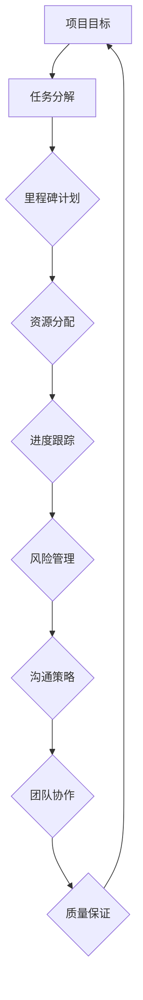

                 

# 技术人如何进行有效的项目管理和团队协作

## 关键词
项目管理、团队协作、效率提升、沟通技巧、技术领导力、敏捷开发

> 项目管理不仅仅是规划、执行和监控，它更是一种艺术，需要技术人与团队成员共同协作，以高效地达成目标。本文将深入探讨技术人如何进行有效的项目管理和团队协作，分享实用的技巧和策略，助您成为团队中的领导者。

## 摘要
在当今快速发展的技术领域，技术人不仅需要具备扎实的技术能力，还需要掌握有效的项目管理和团队协作技巧。本文将系统地阐述如何运用这些技巧，包括制定明确的目标、优化沟通流程、提升团队协作效率等，以实现项目的成功交付。同时，本文还将探讨项目管理中的挑战和解决方案，以及如何通过敏捷开发等现代方法提高项目管理的效率。无论您是一名项目经理还是团队成员，这篇文章都将为您提供宝贵的指导和启示。

## 1. 背景介绍

### 1.1 目的和范围
本文旨在帮助技术人提高项目管理和团队协作的效率，通过一系列实用的技巧和方法，实现项目的成功交付。文章将涵盖项目管理的基础知识、沟通技巧、团队协作策略以及敏捷开发方法等，旨在为读者提供一个全面的指导框架。

### 1.2 预期读者
本文适合以下读者群体：
- 项目经理和技术负责人
- 团队成员和开发工程师
- 对项目管理感兴趣的IT专业人士

### 1.3 文档结构概述
本文分为十个主要部分：
1. 背景介绍
2. 核心概念与联系
3. 核心算法原理 & 具体操作步骤
4. 数学模型和公式 & 详细讲解 & 举例说明
5. 项目实战：代码实际案例和详细解释说明
6. 实际应用场景
7. 工具和资源推荐
8. 总结：未来发展趋势与挑战
9. 附录：常见问题与解答
10. 扩展阅读 & 参考资料

### 1.4 术语表

#### 1.4.1 核心术语定义
- 项目管理：规划和执行项目的活动，以实现特定目标的过程。
- 团队协作：团队成员共同工作，共同完成项目任务的过程。
- 敏捷开发：一种软件开发方法，强调迭代、快速响应变化和客户需求。
- 沟通技巧：有效传达信息、理解他人意图的技能。
- 技术领导力：在技术团队中发挥领导作用的能力。

#### 1.4.2 相关概念解释
- 项目目标：项目希望达成的结果或成果。
- 任务分解：将项目目标分解为更小、更具体的任务。
- 里程碑：项目中的重要时间节点，通常表示阶段性成果。

#### 1.4.3 缩略词列表
- PM：项目经理
- Scrum：敏捷开发方法
- Kanban：看板方法
- OKR：目标与关键成果法

## 2. 核心概念与联系

在项目管理中，理解核心概念和它们之间的联系至关重要。以下是一个使用Mermaid绘制的流程图，展示了一些关键概念和它们的相互关系。



- 项目目标：明确项目的最终成果和预期效益。
- 任务分解：将项目目标分解为具体可执行的任务。
- 里程碑计划：设定关键时间节点，确保项目按计划进行。
- 资源分配：合理分配人力资源、时间和预算。
- 进度跟踪：监控项目进度，确保按时完成任务。
- 风险管理：识别、评估和应对项目风险。
- 沟通策略：确保团队成员之间的有效沟通。
- 团队协作：促进团队成员共同完成任务。
- 质量保证：确保项目成果符合预期质量标准。

通过上述流程图，我们可以清晰地看到项目管理中的各个环节如何相互关联，形成一个完整的闭环。

## 3. 核心算法原理 & 具体操作步骤

在项目管理中，核心算法原理通常涉及如何有效地分配资源、制定进度计划以及监控项目进度。以下是一个具体的操作步骤，使用伪代码来详细阐述。

### 3.1 资源分配算法

```python
# 伪代码：资源分配算法

function allocate_resources(tasks, resources):
    for each task in tasks:
        for each resource in resources:
            if resource available:
                assign resource to task
                update resource availability
                break
```

- tasks：任务列表
- resources：资源列表
- resource available：资源可用性检查

具体步骤：
1. 遍历每个任务。
2. 遍历每个资源。
3. 如果资源可用，将其分配给任务。
4. 更新资源的可用性。
5. 继续下一个任务，直到所有资源被分配或所有任务已完成。

### 3.2 进度计划算法

```python
# 伪代码：进度计划算法

function plan_progress(tasks, deadlines):
    for each task in tasks:
        if task deadline is not met:
            reschedule_task(task, available_resources)
    return planned_progress
```

- tasks：任务列表
- deadlines：任务截止日期
- available_resources：可用资源
- reschedule_task：重新安排任务

具体步骤：
1. 遍历每个任务。
2. 如果任务的截止日期无法满足，重新安排任务。
3. 返回计划的进度。

### 3.3 进度跟踪算法

```python
# 伪代码：进度跟踪算法

function track_progress(tasks, actual_dates):
    for each task in tasks:
        if actual_date > deadline:
            raise_alert("Task delay detected")
    return current_progress
```

- tasks：任务列表
- actual_dates：实际完成日期
- deadline：任务截止日期

具体步骤：
1. 遍历每个任务。
2. 如果实际完成日期晚于截止日期，发出警报。
3. 返回当前进度。

通过上述伪代码，我们可以看到如何通过算法原理来指导项目管理的具体操作步骤，从而提高项目执行的效率。

## 4. 数学模型和公式 & 详细讲解 & 举例说明

在项目管理中，数学模型和公式可以帮助我们量化项目目标、优化资源分配、评估进度等。以下是一些常用的数学模型和公式，以及它们的详细讲解和举例说明。

### 4.1 乐观估计（O）、悲观估计（P）和最可能估计（M）

- 乐观估计（O）：任务在最佳情况下所需的时间。
- 悲观估计（P）：任务在最坏情况下所需的时间。
- 最可能估计（M）：任务在大多数情况下所需的时间。

### 4.2 期望时间（E）

期望时间（E）可以通过以下公式计算：

$$ E = \frac{O + 4M + P}{6} $$

### 4.3 方差（V）

方差（V）可以通过以下公式计算：

$$ V = \frac{(P - E)^2 + (O - E)^2}{4} $$

### 4.4 解释与举例

假设我们有一个任务，其乐观估计为2天，悲观估计为6天，最可能估计为4天。

- 期望时间（E）：

$$ E = \frac{2 + 4 \times 4 + 6}{6} = \frac{2 + 16 + 6}{6} = \frac{24}{6} = 4 \text{天} $$

- 方差（V）：

$$ V = \frac{(6 - 4)^2 + (2 - 4)^2}{4} = \frac{4 + 4}{4} = 2 $$

通过计算期望时间和方差，我们可以更准确地预测任务完成的时间，并评估任务的风险。

## 5. 项目实战：代码实际案例和详细解释说明

为了更好地理解项目管理和团队协作的实际应用，我们将通过一个简单的项目案例来展示具体的代码实现和解析。

### 5.1 开发环境搭建

我们假设使用Python语言和Git工具进行项目开发。以下是开发环境的搭建步骤：

1. 安装Python：从[Python官网](https://www.python.org/)下载并安装Python。
2. 安装Git：从[Git官网](https://git-scm.com/)下载并安装Git。
3. 配置Python和Git的环境变量。

### 5.2 源代码详细实现和代码解读

以下是项目的基本代码框架：

```python
# main.py

import git

def initialize_project():
    """初始化项目"""
    print("Initializing project...")
    # 在此处执行初始化任务，如创建目录、配置文件等

def allocate_resources():
    """分配资源"""
    print("Allocating resources...")
    # 在此处执行资源分配，如指定开发人员、分配任务等

def execute_tasks():
    """执行任务"""
    print("Executing tasks...")
    # 在此处执行任务，如编写代码、测试等

def track_progress():
    """跟踪进度"""
    print("Tracking progress...")
    # 在此处执行进度跟踪，如检查任务完成情况、更新进度表等

def main():
    """主函数，启动项目流程"""
    initialize_project()
    allocate_resources()
    execute_tasks()
    track_progress()

if __name__ == "__main__":
    main()
```

### 5.3 代码解读与分析

1. **初始化项目（initialize_project）**：该函数用于项目的初始化操作，如创建目录、配置文件等。
2. **分配资源（allocate_resources）**：该函数用于资源的分配，如指定开发人员、分配任务等。
3. **执行任务（execute_tasks）**：该函数用于任务的执行，如编写代码、测试等。
4. **跟踪进度（track_progress）**：该函数用于项目的进度跟踪，如检查任务完成情况、更新进度表等。
5. **主函数（main）**：该函数启动整个项目的流程，依次执行初始化、资源分配、任务执行和进度跟踪。

通过上述代码框架，我们可以清晰地看到项目的各个阶段和模块。在实际开发中，每个模块都可以进一步细分，实现具体的功能。

## 6. 实际应用场景

项目管理和团队协作在实际应用场景中至关重要，以下是几个具体的应用案例：

### 6.1 软件开发项目

在软件开发项目中，项目管理和团队协作确保开发进度和质量。通过明确的目标、详细的任务分解和有效的沟通策略，开发团队可以高效地完成项目任务，并按时交付高质量的软件产品。

### 6.2 市场营销活动

在市场营销活动中，项目管理和团队协作确保活动的策划、执行和效果评估。通过明确的目标、任务分解和进度跟踪，市场团队可以有效地管理活动资源，优化活动效果。

### 6.3 产品发布

在产品发布过程中，项目管理和团队协作确保产品开发、测试和发布的顺利进行。通过合理的进度计划和风险管理，产品团队可以降低风险，确保产品按时上市。

### 6.4 应急响应

在应急响应项目中，项目管理和团队协作确保应急资源的有效配置和协调。通过明确的目标、任务分解和进度跟踪，应急团队可以迅速响应，最大限度地减少损失。

## 7. 工具和资源推荐

为了提高项目管理和团队协作的效率，以下是一些推荐的工具和资源：

### 7.1 学习资源推荐

#### 7.1.1 书籍推荐
- 《敏捷开发实践指南》
- 《项目管理知识体系指南（PMBOK指南）》
- 《人月神话》

#### 7.1.2 在线课程
- Coursera上的《项目管理专业课程》
- Udemy上的《敏捷项目管理实战》
- edX上的《软件项目管理》

#### 7.1.3 技术博客和网站
- ProjectManagement.com
- AgileScout
- Atlassian's blog

### 7.2 开发工具框架推荐

#### 7.2.1 IDE和编辑器
- PyCharm
- Visual Studio Code
- IntelliJ IDEA

#### 7.2.2 调试和性能分析工具
- Postman
- JMeter
- GDB

#### 7.2.3 相关框架和库
- Scrum敏捷开发框架
- Kanban看板方法
- Git版本控制

### 7.3 相关论文著作推荐

#### 7.3.1 经典论文
- "The Mythical Man-Month" by Fred Brooks
- "The Practice of Agile Project Management" by Jim Highsmith

#### 7.3.2 最新研究成果
- "Agile Practices in Large-Scale Systems Development" by Agile Practices Group
- "The Lean Startup" by Eric Ries

#### 7.3.3 应用案例分析
- "Scrum in the Real World" by Ken Schwaber
- "Kanban: Successful Evolutionary Change for Your Technology Business" by David Anderson

## 8. 总结：未来发展趋势与挑战

随着技术的不断进步和市场竞争的加剧，项目管理和团队协作将面临新的挑战和机遇。以下是未来发展趋势和面临的挑战：

### 8.1 发展趋势

- **数字化和自动化**：随着数字化转型的加速，项目管理和团队协作将更多地依赖于自动化工具和平台，以提高效率。
- **远程工作**：远程工作的普及将要求项目管理和团队协作适应新的工作方式，如虚拟团队管理、远程沟通和协作工具的使用。
- **敏捷和精益管理**：敏捷和精益管理方法将在未来得到更广泛的应用，以更好地适应快速变化的市场需求。
- **数据驱动的决策**：通过数据分析和人工智能技术，项目管理和团队协作将更加精准和高效。

### 8.2 挑战

- **技能差距**：随着技术的发展，项目管理人员和技术人员需要不断更新知识和技能，以应对新兴技术的挑战。
- **沟通障碍**：远程工作和跨文化团队可能导致沟通障碍，需要更有效的沟通策略和工具。
- **资源管理**：在资源有限的情况下，如何优化资源分配和利用，以实现项目的成功交付，是项目管理面临的挑战。

## 9. 附录：常见问题与解答

### 9.1 什么是敏捷开发？

敏捷开发是一种软件开发方法，强调快速迭代、灵活应对变化和客户需求，以高效地交付高质量的产品。

### 9.2 如何进行有效的团队协作？

有效的团队协作包括明确的目标、良好的沟通、分工明确的任务、积极的反馈和持续的学习与改进。

### 9.3 项目管理中的常见风险有哪些？

项目管理中的常见风险包括进度延误、资源不足、质量不符合要求、预算超支和外部环境变化等。

## 10. 扩展阅读 & 参考资料

- 《敏捷开发实践指南》[作者：杰夫·萨瑟兰]
- 《项目管理知识体系指南（PMBOK指南）》[作者：项目管理协会]
- 《人月神话》[作者：弗雷德·布鲁克斯]
- ProjectManagement.com [网址：https://www.projectmanagement.com/]
- AgileScout [网址：https://www.agilescout.com/]
- Atlassian's blog [网址：https://www.atlassian.com/blog/]
- Coursera上的《项目管理专业课程》[网址：https://www.coursera.org/specializations/project-management]
- Udemy上的《敏捷项目管理实战》[网址：https://www.udemy.com/course/agile-project-management-for-business-and-technical-teams/]
- edX上的《软件项目管理》[网址：https://www.edx.org/course/software-project-management-by-umbc]

## 作者

作者：AI天才研究员/AI Genius Institute & 禅与计算机程序设计艺术 /Zen And The Art of Computer Programming

通过本文的深入探讨，我们系统地介绍了技术人如何进行有效的项目管理和团队协作。我们不仅详细讲解了项目管理的基础知识，还通过实际案例展示了项目管理的具体操作步骤。同时，我们还推荐了相关的工具和资源，以帮助读者在实际工作中更好地应用所学知识。

在未来的工作中，技术人需要不断学习和实践，掌握项目管理和团队协作的精髓，以应对快速变化的市场需求和不断升级的技术挑战。希望通过本文，读者能够对项目管理和团队协作有更深入的理解，并在实际工作中取得更好的成果。

再次感谢您的阅读，期待与您在未来的项目中相见。如果您有任何问题或建议，欢迎随时与我交流。祝您工作顺利，生活愉快！<|im_sep|>

