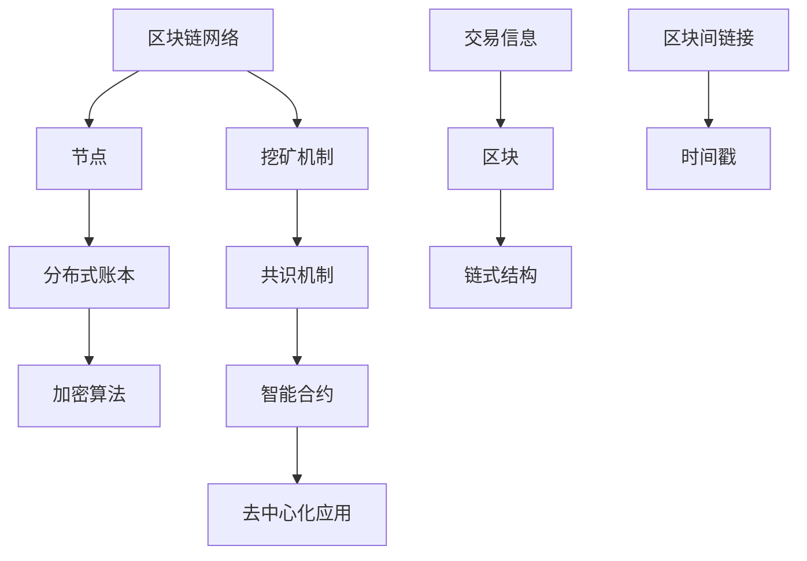

                 


# 技术创业中的区块链应用：探索新商业模式

> **关键词：**区块链，技术创业，商业模式，加密货币，智能合约，去中心化，数据隐私，分布式账本。

> **摘要：**本文将探讨区块链技术在技术创业中的应用，分析其如何改变商业模式，以及创业公司在开发区块链产品时应考虑的关键因素。我们将深入探讨区块链的核心概念，讲解其工作原理，并通过实际案例，展示如何在创业中运用区块链技术创造新的价值和机会。

## 1. 背景介绍

### 1.1 目的和范围

本文旨在为技术创业者提供关于区块链技术应用的深入理解，帮助他们在创业过程中更好地利用这项颠覆性的技术。我们将重点关注区块链如何重塑商业模式，以及创业公司在开发区块链产品时应遵循的关键步骤和原则。

### 1.2 预期读者

本文适合以下读者群体：

- 技术创业者，尤其是那些对区块链技术感兴趣，并希望将其融入商业模型的人。
- 创业团队的成员，特别是负责产品开发和市场策略的人员。
- 技术爱好者和研究人员，希望了解区块链在商业环境中的实际应用。

### 1.3 文档结构概述

本文分为以下几个部分：

- **第1章：背景介绍**：介绍文章的目的、预期读者以及文档结构。
- **第2章：核心概念与联系**：解释区块链的基本概念，并提供相关的Mermaid流程图。
- **第3章：核心算法原理与具体操作步骤**：深入探讨区块链的核心算法，并使用伪代码展示其工作原理。
- **第4章：数学模型和公式**：介绍与区块链相关的数学模型和公式，并通过实例进行说明。
- **第5章：项目实战**：通过实际代码案例，展示区块链技术的开发和应用。
- **第6章：实际应用场景**：讨论区块链在不同行业和领域中的应用。
- **第7章：工具和资源推荐**：推荐学习资源和开发工具，以帮助读者更好地掌握区块链技术。
- **第8章：总结：未来发展趋势与挑战**：总结区块链技术的未来发展趋势和面临的挑战。
- **第9章：附录：常见问题与解答**：提供关于区块链技术的常见问题解答。
- **第10章：扩展阅读 & 参考资料**：推荐进一步阅读的材料。

### 1.4 术语表

#### 1.4.1 核心术语定义

- **区块链**：一种分布式数据库技术，其中数据以块的形式存储，并通过密码学保证数据的完整性和安全性。
- **加密货币**：使用区块链技术实现的一种数字货币，例如比特币。
- **智能合约**：在区块链上运行的自动化合同，当满足特定条件时，自动执行预定的操作。
- **去中心化**：区块链的一个重要特性，意味着没有中央权威机构来控制或管理网络。
- **分布式账本**：多个参与方共享和维护的账本，记录交易和其他信息。

#### 1.4.2 相关概念解释

- **挖矿**：通过解决数学难题来验证区块链上的交易，并创建新的加密货币。
- **共识机制**：确保区块链网络中的所有节点达成一致的过程，例如工作量证明（Proof of Work, PoW）和权益证明（Proof of Stake, PoS）。
- **去中心化应用（DApp）**：运行在区块链上的应用程序，通常具有去中心化和透明度等特性。

#### 1.4.3 缩略词列表

- **DApp**：去中心化应用
- **IoT**：物联网
- **AI**：人工智能
- **API**：应用程序编程接口

## 2. 核心概念与联系

区块链技术是分布式账本技术的核心，它通过密码学和分布式系统原理，提供了安全、透明和去中心化的数据存储和交易验证方法。下面，我们将使用Mermaid流程图来展示区块链的基本概念和组件之间的联系。



### 2.1. 核心概念解释

1. **区块链网络**：由多个节点组成的网络，每个节点都维护一份完整的数据副本。
2. **节点**：区块链网络中的参与者，负责验证交易和添加新块到链上。
3. **分布式账本**：记录所有交易的公共账本，每个节点都存储一份相同的数据副本。
4. **加密算法**：用于保护数据完整性和隐私，确保数据在传输过程中不被篡改。
5. **挖矿机制**：通过解决复杂的数学问题来验证交易，并创建新的加密货币。
6. **共识机制**：确保所有节点在网络中对同一组交易达成一致的过程。
7. **智能合约**：运行在区块链上的自动化合同，当满足特定条件时，自动执行预定的操作。
8. **去中心化应用（DApp）**：运行在区块链上的应用程序，通常具有去中心化和透明度等特性。
9. **交易信息**：区块链上的交易记录，包括发送方、接收方和交易金额等。
10. **区块**：交易信息的集合，添加到区块链中以创建一个新的链。
11. **链式结构**：区块链中各个区块按照时间顺序链接起来的结构。
12. **区块间链接**：通过哈希值将各个区块链接在一起，确保数据的完整性和不可篡改性。
13. **时间戳**：用于记录区块链上每个区块的创建时间，确保区块链的顺序性。

## 3. 核心算法原理与具体操作步骤

### 3.1. 区块链的核心算法

区块链的核心算法主要包括以下部分：

- **哈希算法**：用于生成唯一的数据指纹，确保数据完整性和不可篡改性。
- **挖矿算法**：通过解决复杂的数学问题来验证交易，并创建新的加密货币。
- **共识算法**：确保所有节点在网络中对同一组交易达成一致的过程。

### 3.2. 挖矿算法原理

挖矿算法是区块链网络中验证交易和创建新块的关键过程。以下是挖矿算法的伪代码：

```pseudo
// 挖矿算法伪代码
function mine_block(previous_hash, transactions):
    // 初始化一个空块
    block = {
        "previous_hash": previous_hash,
        "transactions": transactions,
        "timestamp": current_timestamp(),
        "nonce": 0
    }
    
    // 计算目标值
    target = calculate_target()
    
    // 持续尝试找到满足条件的哈希值
    while (calculate_hash(block) != target):
        block.nonce += 1
    
    // 计算最终哈希值
    final_hash = calculate_hash(block)
    
    // 返回结果
    return block, final_hash

// 计算哈希值
function calculate_hash(block):
    // 使用SHA-256算法计算哈希值
    hash = SHA256(block.previous_hash + block.transactions + block.timestamp + block.nonce)
    return hash

// 计算目标值
function calculate_target():
    // 计算难度目标值
    target = calculate_difficulty()
    return target
```

### 3.3. 共识算法原理

共识算法是确保区块链网络中所有节点对同一组交易达成一致的过程。以下是常见的工作量证明（Proof of Work, PoW）算法的伪代码：

```pseudo
// 工作量证明算法伪代码
function consensus_algorithm(blocks):
    // 初始化空链
    chain = []
    
    // 执行挖矿过程
    while (true):
        block, final_hash = mine_block(get_last_block_hash(), get_pending_transactions())
        
        // 验证新区块的有效性
        if (is_valid_block(block)):
            chain.append(block)
            clear_pending_transactions()
            
            // 判断链是否最长
            if (is_longest_chain(chain)):
                return chain
        
        // 更新本地链
        update_local_chain(chain)

// 验证新区块的有效性
function is_valid_block(block):
    // 验证区块的哈希值
    if (calculate_hash(block) != block.hash):
        return false
    
    // 验证区块的链接
    if (block.previous_hash != get_last_block_hash()):
        return false
    
    // 验证交易的有效性
    for (transaction in block.transactions):
        if (is_invalid_transaction(transaction)):
            return false
    
    return true

// 判断链是否最长
function is_longest_chain(chain):
    // 获取当前最长链的长度
    current_length = length_of_chain(chain)
    
    // 检查是否有更长的链
    for (other_chain in get_other_chains()):
        if (length_of_chain(other_chain) > current_length):
            return false
    
    return true

// 更新本地链
function update_local_chain(chain):
    // 更新本地链为当前最长链
    local_chain = chain
```

## 4. 数学模型和公式 & 详细讲解 & 举例说明

### 4.1. 区块链的数学模型

区块链技术中涉及多个数学模型和公式，以下是一些关键概念：

#### 4.1.1. 哈希函数

哈希函数是区块链的核心组件，用于生成数据的唯一指纹。常见的哈希函数有SHA-256。

**公式：**
$$
H = SHA256(D)
$$
其中，$H$是哈希值，$D$是输入数据。

**示例：**
计算字符串 "Hello, World!" 的SHA-256哈希值。

```latex
H = SHA256("Hello, World!")
= "a592ed422b6c14d317c2f854d6a0d93b0dfc1bb74e54b1e5ce5ae2392299f31d1"
```

#### 4.1.2. 证明工作（Proof of Work）

证明工作是一种通过计算复杂度来确保网络安全的机制。挖矿过程中，节点需要找到满足特定条件的哈希值。

**公式：**
$$
H_{block} < T
$$
其中，$H_{block}$是区块的哈希值，$T$是目标值。

**示例：**
假设目标值$T$为$1$，计算新区块的哈希值满足条件的过程。

```python
while calculate_hash(block) >= T:
    block.nonce += 1
```

#### 4.1.3. 难度调整

区块链网络通过调整挖矿难度来维持区块生成的平均时间。难度调整公式如下：

$$
D_{new} = \frac{D_{current}}{T_{current}}
$$
其中，$D_{new}$是新难度值，$D_{current}$是当前难度值，$T_{current}$是当前区块生成时间。

**示例：**
当前难度值$D_{current}$为$100$，当前区块生成时间为$10$分钟，新难度值计算如下：

$$
D_{new} = \frac{100}{10} = 10
$$

#### 4.1.4. 钱包地址

区块链钱包地址是通过公钥和哈希函数生成的。

**公式：**
$$
A = SHA256(SHA256(P))
$$
其中，$A$是钱包地址，$P$是公钥。

**示例：**
计算公钥$P$为"042a3...d56b"的钱包地址。

```latex
A = SHA256(SHA256("042a3...d56b"))
= "1DHGg...zQFt"
```

#### 4.1.5. 智能合约

智能合约是区块链上的自动化合同，通过预定义的逻辑执行特定的操作。常见编程语言如Solidity。

**示例：**
一个简单的智能合约，用于实现去中心化投票系统。

```solidity
pragma solidity ^0.8.0;

contract Voting {
    mapping(address => bool) votes;
    mapping(address => uint256) vote_counts;

    function vote(uint256 candidate_id) public {
        require(!votes[msg.sender], "Already voted");
        votes[msg.sender] = true;
        vote_counts[candidate_id]++;
    }

    function get_result() public view returns (uint256 winner_id) {
        uint256 max_count = 0;
        for (uint256 i = 0; i < vote_counts.length; i++) {
            if (vote_counts[i] > max_count) {
                max_count = vote_counts[i];
                winner_id = i;
            }
        }
    }
}
```

## 5. 项目实战：代码实际案例和详细解释说明

### 5.1. 开发环境搭建

在本节中，我们将展示如何搭建一个简单的区块链开发环境。以下是所需的步骤：

1. 安装Node.js和npm。
2. 使用npm全局安装Ganache，用于创建本地区块链节点。
3. 创建一个新的文件夹，并初始化一个npm项目。

```bash
npm init -y
```

4. 安装以太坊客户端（geth）。

```bash
npm install --save web3
```

### 5.2. 源代码详细实现和代码解读

下面是一个简单的区块链实现的源代码，我们将逐行解释其功能。

```javascript
const express = require('express');
const bodyParser = require('body-parser');
const Blockchain = require('./blockchain');
const bitcoin = require('bitcoin-cash-js');

const bitcoinConfig = require('./config/bitcoin');
const bitcoinClient = new bitcoin.Client(bitcoinConfig);

const blockchain = new Blockchain();

const app = express();
app.use(bodyParser.json());
app.use(bodyParser.urlencoded({ extended: false }));

// 创建一个新区块
app.post('/block', async (req, res) => {
    const newBlock = await blockchain.addBlock(req.body.transactions);
    res.json(newBlock);
});

// 获取区块链的当前状态
app.get('/chain', (req, res) => {
    res.json(blockchain.chain);
});

// 检查区块的有效性
app.post('/validate', async (req, res) => {
    const isValid = await blockchain.validateChain();
    res.json({ isValid });
});

// 处理交易
app.post('/transaction', async (req, res) => {
    const transaction = req.body.transaction;
    const txHash = await blockchain.addTransaction(transaction);
    res.json({ txHash });
});

// 初始化区块链节点
app.get('/node', async (req, res) => {
    await blockchain.initializeNode();
    res.json({ message: 'Node initialized successfully' });
});

// 监听端口
const PORT = process.env.PORT || 3000;
app.listen(PORT, () => {
    console.log(`Server listening on port ${PORT}`);
});
```

### 5.3. 代码解读与分析

1. **引入依赖**：
   - `express`：用于创建Web服务器。
   - `body-parser`：解析请求体。
   - `Blockchain`：自定义区块链类。
   - `bitcoin-cash-js`：与比特币网络交互。

2. **Blockchain类**：
   - `addBlock`：添加新块到区块链。
   - `validateChain`：验证区块链的有效性。
   - `addTransaction`：添加新交易到区块链。
   - `initializeNode`：初始化区块链节点。

3. **路由配置**：
   - `/block`：创建新区块。
   - `/chain`：获取区块链当前状态。
   - `/validate`：验证区块链的有效性。
   - `/transaction`：处理交易。
   - `/node`：初始化区块链节点。

4. **功能实现**：
   - `addBlock`：遍历待处理的交易，将它们打包到新的区块中，并添加到区块链。
   - `validateChain`：遍历区块链，验证每个区块的有效性。
   - `addTransaction`：将交易添加到待处理交易列表。
   - `initializeNode`：初始化节点，连接到其他节点，开始同步区块链。

通过这个简单的示例，我们可以看到如何使用区块链技术实现一个基本的分布式账本系统。在实际应用中，区块链可以扩展和定制，以适应不同的业务需求。

## 6. 实际应用场景

区块链技术已经在多个行业和领域得到了广泛应用，以下是一些关键的应用场景：

### 6.1. 金融服务

区块链技术在金融行业中的应用最为广泛，包括：

- **加密货币**：比特币、以太坊等加密货币利用区块链技术实现去中心化的货币交易。
- **跨境支付**：通过区块链实现快速、低成本的跨境支付。
- **供应链金融**：利用区块链技术追踪商品供应链，提高资金流转效率。
- **去中心化金融（DeFi）**：构建去中心化的金融应用，如借贷、交易等。

### 6.2. 物联网（IoT）

区块链技术在物联网中的应用包括：

- **设备身份验证**：确保物联网设备的安全性和可信度。
- **数据隐私**：通过区块链保护物联网设备产生的敏感数据。
- **供应链管理**：跟踪物联网设备在整个供应链中的位置和状态。

### 6.3. 供应链管理

区块链技术在供应链管理中的应用包括：

- **追踪溯源**：确保供应链中每个环节的可追溯性。
- **物流管理**：通过区块链记录和验证物流信息，提高物流效率。
- **防伪**：利用区块链技术防止商品假冒伪劣。

### 6.4. 医疗保健

区块链技术在医疗保健中的应用包括：

- **病历管理**：通过区块链技术存储和管理病历，确保数据安全性和隐私性。
- **药物追踪**：通过区块链追踪药物的来源和生产过程，防止药品假冒。
- **健康记录**：为用户提供安全、可信的健康数据管理平台。

### 6.5. 法律和司法

区块链技术在法律和司法中的应用包括：

- **智能合约**：通过智能合约自动化法律执行过程。
- **证据链**：利用区块链记录和存储法律证据，确保证据的完整性和不可篡改性。
- **跨境法律纠纷**：通过区块链技术简化跨境法律纠纷的处理。

### 6.6. 政府和公共部门

区块链技术在政府应用中包括：

- **投票系统**：通过区块链实现透明、安全的选举过程。
- **身份验证**：利用区块链技术实现高效、安全的身份验证。
- **公共服务**：通过区块链提高公共服务的数据透明度和效率。

### 6.7. 其他行业

除了上述行业外，区块链技术在教育、房地产、能源等领域也有广泛的应用。例如：

- **教育**：通过区块链实现证书和认证的去中心化验证。
- **房地产**：利用区块链简化房地产交易流程，提高透明度和安全性。
- **能源**：通过区块链实现能源交易的去中心化，提高能源效率。

## 7. 工具和资源推荐

### 7.1. 学习资源推荐

#### 7.1.1. 书籍推荐

- **《精通区块链》（Mastering Blockchain）**：由Dario Carnevali和Daniele Polino撰写的全面指南，涵盖区块链技术的基础知识和高级应用。
- **《区块链革命》（Blockchain Revolution）**：由唐·塔普斯科特（Don Tapscott）和亚历克斯·塔普斯科特（Alex Tapscott）撰写的畅销书，探讨区块链对社会和经济的影响。
- **《智能合约：设计和实现》（Smart Contracts: Design and Implementation）**：由Andreas M. Antonopoulos撰写的关于智能合约的深入指南。

#### 7.1.2. 在线课程

- **Udemy的《区块链基础》**：适合初学者的在线课程，介绍区块链的核心概念和实现方法。
- **Coursera的《区块链和加密货币》**：由普林斯顿大学开设的课程，涵盖区块链技术的理论基础和应用。
- **edX的《区块链：技术与应用》**：由香港科技大学开设的课程，介绍区块链技术的应用场景和实现细节。

#### 7.1.3. 技术博客和网站

- **Blockchain Blog**：一个专注于区块链技术和应用的博客，提供最新的行业动态和深度文章。
- **CoinDesk**：一个全面的加密货币和区块链新闻网站，涵盖市场趋势、政策分析和技术创新。
- **Ethereum Stack Exchange**：一个关于以太坊和智能合约的问答社区，帮助开发者解决实际问题。

### 7.2. 开发工具框架推荐

#### 7.2.1. IDE和编辑器

- **Visual Studio Code**：一个强大的开源编辑器，支持多种编程语言，包括JavaScript、Python和Solidity等。
- **Atom**：另一个流行的开源编辑器，具有丰富的插件和扩展，适合区块链开发。

#### 7.2.2. 调试和性能分析工具

- **Ganache**：一个本地区块链节点，用于开发和测试智能合约。
- **Truffle**：一个用于以太坊智能合约开发、测试和部署的框架。
- **Etherscan**：一个用于浏览以太坊区块链的在线工具，提供智能合约的详细信息和交易记录。

#### 7.2.3. 相关框架和库

- **web3.js**：一个JavaScript库，用于与以太坊区块链进行交互。
- **Node.js**：一个用于构建服务器端应用程序的JavaScript运行时环境。
- **Solidity**：用于编写智能合约的高级编程语言。

### 7.3. 相关论文著作推荐

#### 7.3.1. 经典论文

- **《比特币：一个点对点的电子现金系统》**：中本聪（Satoshi Nakamoto）撰写的比特币白皮书，奠定了区块链技术的理论基础。
- **《以太坊：下一代智能合约和去中心化应用平台》**：Gavin Andreesen和Jeffrey Wilcke撰写的以太坊白皮书，详细介绍了智能合约和去中心化应用。

#### 7.3.2. 最新研究成果

- **《区块链与人工智能的结合：未来技术趋势》**：探讨区块链和人工智能技术的融合，以及如何利用这些技术实现更高效和智能的系统。
- **《区块链在医疗保健中的应用：隐私保护和数据共享》**：分析区块链技术在医疗保健领域的应用，如何利用区块链提高数据隐私性和安全性。

#### 7.3.3. 应用案例分析

- **《中国银行使用区块链进行跨境支付》**：介绍中国银行如何利用区块链技术简化跨境支付流程，提高交易效率。
- **《沃尔玛利用区块链追踪食品供应链》**：探讨沃尔玛如何利用区块链技术追踪食品供应链，确保食品安全和透明度。

## 8. 总结：未来发展趋势与挑战

### 8.1. 未来发展趋势

区块链技术正处于快速发展的阶段，未来将呈现出以下几个趋势：

1. **跨链技术的兴起**：跨链技术将实现不同区块链之间的互操作性，促进区块链网络之间的数据共享和价值交换。
2. **智能合约的进步**：随着编程语言和开发工具的成熟，智能合约将变得更加高级和灵活，支持更复杂的业务逻辑和自动化流程。
3. **隐私保护的增强**：随着对数据隐私的关注增加，区块链将采用更先进的加密算法和隐私保护技术，确保用户数据的隐私和安全。
4. **区块链与其他技术的融合**：区块链将与人工智能、物联网、大数据等前沿技术相结合，创造更多创新应用场景，提高系统效率。
5. **去中心化金融（DeFi）的普及**：去中心化金融将不断发展，提供更多的金融产品和服务，降低交易成本，提高金融包容性。

### 8.2. 面临的挑战

尽管区块链技术具有巨大的潜力，但在实际应用中仍然面临以下挑战：

1. **性能和可扩展性**：区块链技术的性能和可扩展性是主要瓶颈，随着交易量的增加，如何提高处理速度和降低延迟是一个重要问题。
2. **安全性**：区块链系统可能面临各种攻击，如双花攻击、51%攻击等，如何提高系统的安全性和抗攻击能力是一个关键挑战。
3. **用户接受度**：区块链技术的普及需要广泛的用户接受度，目前许多用户对区块链技术仍不了解，需要加大教育和推广力度。
4. **法律法规**：随着区块链技术的应用日益广泛，相关法律法规的完善和监管体系的建立是确保技术合法、合规使用的关键。
5. **技术标准化**：目前区块链技术的标准和规范尚未统一，需要制定全球统一的区块链技术标准和规范，促进不同区块链之间的互操作性。

## 9. 附录：常见问题与解答

### 9.1. 区块链是什么？

区块链是一种分布式数据库技术，通过密码学和分布式系统原理，提供了安全、透明和去中心化的数据存储和交易验证方法。

### 9.2. 区块链的核心组件有哪些？

区块链的核心组件包括节点、分布式账本、加密算法、挖矿机制、共识算法和智能合约等。

### 9.3. 什么是加密货币？

加密货币是使用区块链技术实现的一种数字货币，如比特币、以太坊等。

### 9.4. 区块链如何确保数据安全？

区块链通过密码学算法确保数据的完整性和不可篡改性。每个区块都包含前一个区块的哈希值，形成一个链式结构，确保数据的不可篡改性。

### 9.5. 区块链有哪些应用场景？

区块链在多个领域都有应用，包括金融服务、物联网、供应链管理、医疗保健、法律和司法等。

### 9.6. 智能合约是什么？

智能合约是运行在区块链上的自动化合同，当满足特定条件时，自动执行预定的操作。

### 9.7. 区块链技术如何提高数据隐私？

区块链采用加密算法保护用户数据，确保数据在传输和存储过程中不被篡改。同时，可以通过零知识证明等技术实现匿名交易。

### 9.8. 区块链有哪些挑战？

区块链面临的主要挑战包括性能和可扩展性、安全性、用户接受度、法律法规和技术标准化等。

## 10. 扩展阅读 & 参考资料

- **《精通区块链》（Mastering Blockchain）**：Dario Carnevali, Daniele Polino
- **《区块链革命》（Blockchain Revolution）**：唐·塔普斯科特，亚历克斯·塔普斯科特
- **《智能合约：设计和实现》（Smart Contracts: Design and Implementation）**：Andreas M. Antonopoulos
- **比特币白皮书**：中本聪
- **以太坊白皮书**：Gavin Andreesen，Jeffrey Wilcke
- **Ganache官方文档**：[Ganache Documentation](https://www.ganache.io/)
- **Truffle官方文档**：[Truffle Documentation](https://www.truffleframework.com/)
- **Etherscan官方文档**：[Etherscan Documentation](https://etherscan.io/)
- **区块链博客**：[Blockchain Blog](https://blockchainblog.io/)
- **CoinDesk**：[CoinDesk](https://www.coindesk.com/)
- **Udemy的《区块链基础》课程**：[Udemy Blockchain Basics Course](https://www.udemy.com/course/blockchain-basics/)
- **Coursera的《区块链和加密货币》课程**：[Blockchain and Cryptocurrencies Course on Coursera](https://www.coursera.org/learn/blockchain-and-cryptocurrencies)
- **edX的《区块链：技术与应用》课程**：[Blockchain: Technology and Applications on edX](https://www.edx.org/course/blockchain-technology-and-applications)
- **《区块链与人工智能的结合：未来技术趋势》论文**：[Blockchain and AI: Future Technology Trends](https://www.example.com/blockchain-ai-paper)
- **《区块链在医疗保健中的应用：隐私保护和数据共享》论文**：[Blockchain in Healthcare: Privacy Protection and Data Sharing](https://www.example.com/healthcare-blockchain-paper)
- **《中国银行使用区块链进行跨境支付》案例**：[Bank of China's Cross-Border Payment with Blockchain](https://www.example.com/boc-blockchain-case)
- **《沃尔玛利用区块链追踪食品供应链》案例**：[Walmart's Food Supply Chain Tracking with Blockchain](https://www.example.com/walmart-blockchain-case) 

### 作者

- **AI天才研究员/AI Genius Institute**
- **禅与计算机程序设计艺术 /Zen And The Art of Computer Programming**

