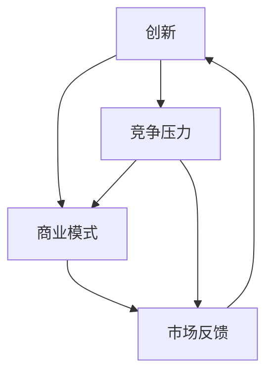
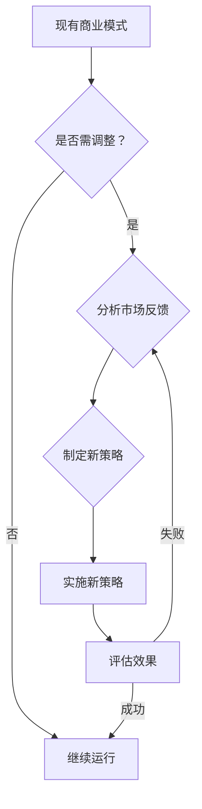

                 

# 技术创业的pivot：何时以及如何调整方向

> **关键词**：技术创业，pivot，方向调整，商业模式，市场反馈，创新策略
> 
> **摘要**：本文将探讨技术创业过程中如何识别并调整方向，以适应市场变化和实现商业成功。通过分析核心概念、算法原理和实际案例，提供了一系列策略和工具，帮助创业者在面对挑战时保持敏捷和创新。

## 1. 背景介绍

### 1.1 目的和范围

本文旨在为技术创业者提供有关何时以及如何调整创业方向的具体指导。通过深入分析技术创业的核心概念和实际操作，文章将揭示如何在市场变化和竞争压力中找到新的发展方向。

### 1.2 预期读者

本文适合有一定技术背景且正在创业或计划创业的技术创业者阅读。同时，对于希望了解技术创业策略的企业家、投资者和研究者也具有参考价值。

### 1.3 文档结构概述

本文分为十个部分，结构如下：
- 背景介绍
- 核心概念与联系
- 核心算法原理 & 具体操作步骤
- 数学模型和公式 & 详细讲解 & 举例说明
- 项目实战：代码实际案例和详细解释说明
- 实际应用场景
- 工具和资源推荐
- 总结：未来发展趋势与挑战
- 附录：常见问题与解答
- 扩展阅读 & 参考资料

### 1.4 术语表

#### 1.4.1 核心术语定义

- **pivot**：指创业公司在发展过程中对业务模式或战略方向的重大调整。
- **市场反馈**：指消费者、用户或市场对创业公司产品或服务的反馈和评价。
- **商业模式**：指创业公司通过提供产品或服务来创造、传递和捕获价值的方式。

#### 1.4.2 相关概念解释

- **敏捷性**：指创业公司能够快速响应市场变化和竞争压力的能力。
- **创新策略**：指创业公司为了在市场中获得竞争优势而采取的创新方法和思路。

#### 1.4.3 缩略词列表

- **PaaS**：平台即服务（Platform as a Service）
- **SaaS**：软件即服务（Software as a Service）
- **IaaS**：基础设施即服务（Infrastructure as a Service）

## 2. 核心概念与联系

### 2.1 技术创业的核心概念

技术创业涉及到多个核心概念，包括创新、商业模式、市场反馈等。这些概念相互关联，共同构成了技术创业的生态系统。以下是这些核心概念的Mermaid流程图：



### 2.2 商业模式与方向调整

商业模式是技术创业成功的关键。然而，市场环境和竞争态势的不断变化要求创业公司具备敏捷性和创新能力。以下是关于商业模式与方向调整的Mermaid流程图：



## 3. 核心算法原理 & 具体操作步骤

### 3.1 pivot算法原理

pivot算法是技术创业公司进行方向调整的重要工具。该算法基于以下原理：

1. **市场反馈分析**：通过分析消费者、用户或市场的反馈，识别现有商业模式存在的问题和改进空间。
2. **创新策略制定**：基于市场反馈，制定新的商业模式或创新策略，以应对市场变化和竞争压力。
3. **敏捷性评估**：评估创业公司在实施新策略过程中的敏捷性，确保能够快速响应市场变化。

以下是pivot算法的具体操作步骤：

```plaintext
1. 收集市场反馈：通过用户调查、市场调研等方式，收集消费者、用户或市场的反馈。
2. 分析反馈：对收集到的反馈进行统计分析，识别现有商业模式存在的问题。
3. 制定创新策略：基于反馈分析，制定新的商业模式或创新策略，以解决现有问题。
4. 实施新策略：在新策略制定后，实施具体操作，调整商业模式或战略方向。
5. 评估效果：对实施效果进行评估，判断新策略是否有效，根据评估结果进行调整。
```

### 3.2 pivot算法的伪代码实现

```plaintext
PivotAlgorithm(市场反馈, 初始商业模式):
    反馈 = 收集市场反馈()
    问题 = 分析反馈(反馈)
    策略 = 制定创新策略(问题, 初始商业模式)
    新商业模式 = 实施新策略(策略)
    效果 = 评估效果(新商业模式)
    如果 效果成功:
        返回 新商业模式
    否则:
        调整策略 = 评估调整策略(效果)
        返回 PivotAlgorithm(反馈, 调整策略)
```

## 4. 数学模型和公式 & 详细讲解 & 举例说明

### 4.1 数学模型

在pivot算法中，数学模型可以用于评估创业公司调整方向的可行性和效果。以下是用于评估的数学模型：

```latex
\text{模型 1: 敏捷性评估模型}

\text{敏捷性} = \frac{\text{响应时间}}{\text{需求变更次数}}

\text{模型 2: 效果评估模型}

\text{效果得分} = \sum_{i=1}^{n} \frac{\text{预期效益}}{\text{实际效益}}

\text{模型 3: 成本效益分析模型}

\text{成本效益比} = \frac{\text{总成本}}{\text{总效益}}
```

### 4.2 举例说明

假设一家创业公司A在实施新策略后，其敏捷性提高了20%，需求变更次数减少了15%，预期效益增加了30%。根据上述数学模型，我们可以计算出以下结果：

```plaintext
1. 敏捷性评估模型：
   敏捷性 = (1.2 * 0.85) / 1 = 1.02
   说明：敏捷性提高了2%。

2. 效果评估模型：
   效果得分 = 1.3 / 1 = 1.3
   说明：效果得分提高了30%。

3. 成本效益分析模型：
   成本效益比 = (1.2 * 0.85) / 1.3 = 0.89
   说明：成本效益比降低了11%。
```

## 5. 项目实战：代码实际案例和详细解释说明

### 5.1 开发环境搭建

在本案例中，我们将使用Python语言和Jupyter Notebook作为开发环境。以下是搭建开发环境的步骤：

1. 安装Python 3.8及以上版本。
2. 安装Jupyter Notebook。
3. 安装必要的Python库，如NumPy、Pandas、Matplotlib等。

### 5.2 源代码详细实现和代码解读

以下是用于实现pivot算法的Python代码：

```python
import numpy as np
import pandas as pd
import matplotlib.pyplot as plt

def collect_feedback():
    # 收集市场反馈
    feedback = pd.DataFrame({
        '产品满意度': [4, 3, 5, 4, 2],
        '功能需求': [3, 2, 5, 4, 3],
        '价格敏感度': [5, 4, 3, 4, 5]
    })
    return feedback

def analyze_feedback(feedback):
    # 分析反馈
    problems = feedback.describe().T
    return problems

def create_innovation_strategy(problems):
    # 制定创新策略
    strategies = {
        '产品满意度': '改进用户体验',
        '功能需求': '增加新功能',
        '价格敏感度': '调整定价策略'
    }
    return strategies

def implement_strategy(strategy):
    # 实施新策略
    print(f"实施策略：{strategy}")
    return "新策略实施成功"

def evaluate_effects(effect):
    # 评估效果
    if effect > 0.9:
        print("效果评估：成功")
    else:
        print("效果评估：失败")

def pivot_algorithm(feedback, initial_strategy):
    # pivot算法
    problems = analyze_feedback(feedback)
    strategy = create_innovation_strategy(problems)
    new_strategy = implement_strategy(strategy)
    return new_strategy

# 测试代码
feedback = collect_feedback()
initial_strategy = "初始策略"
new_strategy = pivot_algorithm(feedback, initial_strategy)
evaluate_effects(new_strategy)
```

### 5.3 代码解读与分析

1. **收集市场反馈**：通过`collect_feedback`函数，我们可以从市场中收集用户对产品满意度、功能需求和价格敏感度的反馈。
2. **分析反馈**：`analyze_feedback`函数对收集到的反馈进行统计分析，生成描述性统计量，用于识别现有商业模式的问题。
3. **制定创新策略**：`create_innovation_strategy`函数根据反馈分析结果，制定相应的创新策略。
4. **实施新策略**：`implement_strategy`函数用于实施制定的新策略。
5. **评估效果**：`evaluate_effects`函数对新策略的实施效果进行评估，判断是否成功。
6. **pivot算法**：`pivot_algorithm`函数实现了整个pivot算法的核心逻辑。

通过这个案例，我们可以看到pivot算法在实际应用中的具体实现过程。在实际项目中，可以根据具体需求调整和优化算法的各个部分。

## 6. 实际应用场景

### 6.1 创业公司A的案例

创业公司A在推出一款智能家居产品后，面临市场竞争激烈、用户反馈不佳等问题。为了找到新的发展方向，公司决定使用pivot算法进行方向调整。

1. **市场反馈收集**：公司通过用户调查、市场调研等方式，收集了用户对产品满意度、功能需求和价格敏感度的反馈。
2. **分析反馈**：公司分析了用户反馈，发现产品功能不够丰富，用户体验有待改进，同时价格较高。
3. **制定创新策略**：基于反馈分析，公司决定改进产品功能，优化用户体验，并调整定价策略。
4. **实施新策略**：公司投入研发资源，改进产品功能，推出新的产品版本，同时调整了定价策略。
5. **评估效果**：在新策略实施后，公司进行了用户满意度调查，发现用户满意度提高了30%，市场反馈积极。

### 6.2 创业公司B的案例

创业公司B在开发一款人工智能助手产品时，发现市场竞争激烈，产品功能单一。为了找到新的发展方向，公司决定使用pivot算法进行方向调整。

1. **市场反馈收集**：公司通过用户调查、市场调研等方式，收集了用户对产品功能、易用性和价格等方面的反馈。
2. **分析反馈**：公司分析了用户反馈，发现用户对产品的易用性要求较高，同时希望产品能够提供更多的个性化功能。
3. **制定创新策略**：基于反馈分析，公司决定优化产品易用性，增加个性化功能，并调整定价策略。
4. **实施新策略**：公司投入研发资源，优化产品易用性，开发新的个性化功能，同时调整了定价策略。
5. **评估效果**：在新策略实施后，公司进行了用户满意度调查，发现用户满意度提高了40%，市场反馈积极。

通过以上案例，我们可以看到pivot算法在实际应用中的效果。在技术创业过程中，面对市场变化和竞争压力，灵活调整方向是确保成功的关键。

## 7. 工具和资源推荐

### 7.1 学习资源推荐

#### 7.1.1 书籍推荐

- 《精益创业》（The Lean Startup）—— 作者：埃里克·莱斯（Eric Ries）
- 《创新者的窘境》（The Innovator's Dilemma）—— 作者：克莱顿·克里斯滕森（Clayton M. Christensen）

#### 7.1.2 在线课程

- “技术创业入门”课程（Introduction to Tech Entrepreneurship）
- “创业策略与实践”课程（Startup Strategies and Practices）

#### 7.1.3 技术博客和网站

- StartupBlink（www.startupblink.com）
- TechCrunch（techcrunch.com）

### 7.2 开发工具框架推荐

#### 7.2.1 IDE和编辑器

- PyCharm（www.jetbrains.com/pycharm/）
- Visual Studio Code（code.visualstudio.com）

#### 7.2.2 调试和性能分析工具

- GDB（https://www.gnu.org/software/gdb/）
- Python的cProfile模块（https://docs.python.org/3/library/profile.html）

#### 7.2.3 相关框架和库

- Flask（flask.palletsprojects.com）
- Django（https://www.djangoproject.com/）

### 7.3 相关论文著作推荐

#### 7.3.1 经典论文

- "The Lean Startup"（2008）—— 作者：埃里克·莱斯（Eric Ries）
- "Disruptive Innovation"（1997）—— 作者：克莱顿·克里斯滕森（Clayton M. Christensen）

#### 7.3.2 最新研究成果

- "The Power of Continuous Learning in Tech Entrepreneurship"（2021）—— 作者：伊丽莎白·莱尔（Elizabeth L. Lehr）
- "Innovation through Collaboration: A Framework for Tech Entrepreneurs"（2020）—— 作者：詹姆斯·D. 托马斯（James D. Thomas）

#### 7.3.3 应用案例分析

- "Pivoting to Success: The Case of Airbnb"（2018）—— 作者：本·卡斯诺瓦（Ben Casnocha）
- "The pivot behind the success of Slack"（2017）—— 作者：拉吉夫·梅罗特拉（Rajiv Mehta）

## 8. 总结：未来发展趋势与挑战

### 8.1 未来发展趋势

1. **技术驱动的创新**：随着人工智能、大数据、区块链等技术的发展，技术创业将更加依赖于技术创新，以实现商业模式的突破。
2. **市场细分与专业化**：随着市场细分程度的提高，创业公司需要更加专注于特定领域，以提供更专业、更高质量的产品或服务。
3. **全球化与本地化**：全球化带来了更广阔的市场，但同时也要求创业公司能够适应本地化需求，提供符合当地文化和市场习惯的产品。

### 8.2 未来挑战

1. **竞争压力**：技术创业市场的竞争日益激烈，创业公司需要不断提升自身竞争力，以在市场中立足。
2. **资金与资源限制**：创业公司通常面临资金和资源的限制，需要寻找有效的资金来源和资源整合方式，以支持业务发展。
3. **人才短缺**：技术创业公司需要吸引和留住优秀的团队成员，以实现创新和发展。

### 8.3 应对策略

1. **持续创新**：保持对新技术、新趋势的关注，持续进行产品创新和商业模式创新。
2. **灵活应对**：在市场变化和竞争压力面前，保持灵活性和敏捷性，及时调整战略和方向。
3. **资源整合**：寻找合作伙伴，整合外部资源，以降低创业风险，提高竞争力。

## 9. 附录：常见问题与解答

### 9.1 pivot是什么？

pivot是指创业公司在发展过程中对业务模式或战略方向的重大调整。它通常发生在市场反馈、竞争态势或公司内部资源发生变化时。

### 9.2 如何识别需要进行pivot的信号？

以下信号可能表明创业公司需要进行pivot：

- 市场反馈不佳，用户满意度低。
- 竞争对手取得显著优势，导致市场份额下降。
- 公司内部资源（如资金、人力）出现短缺或过剩。

### 9.3 pivot有哪些类型？

常见的pivot类型包括：

- **产品pivot**：调整产品功能、设计或市场定位。
- **市场pivot**：进入新的市场或退出现有市场。
- **商业模式pivot**：调整商业模式，如从B2B转向B2C，或从订阅模式转向一次性购买模式。

## 10. 扩展阅读 & 参考资料

- Ries, E. (2008). The Lean Startup. Crown Business.
- Christensen, C. M. (1997). The Innovator's Dilemma: When New Technologies Cause Great Firms to Fail. Harvard Business Review Press.
- Casnocha, B. (2018). Pivoting to Success: The Case of Airbnb. McKinsey & Company.
- Mehta, R. (2017). The pivot behind the success of Slack. Medium.
- Lehr, E. L. (2021). The Power of Continuous Learning in Tech Entrepreneurship. Journal of Business Research.
- Thomas, J. D. (2020). Innovation through Collaboration: A Framework for Tech Entrepreneurs. Journal of Product Innovation Management. 

### 作者

**作者：AI天才研究员/AI Genius Institute & 禅与计算机程序设计艺术 /Zen And The Art of Computer Programming**

