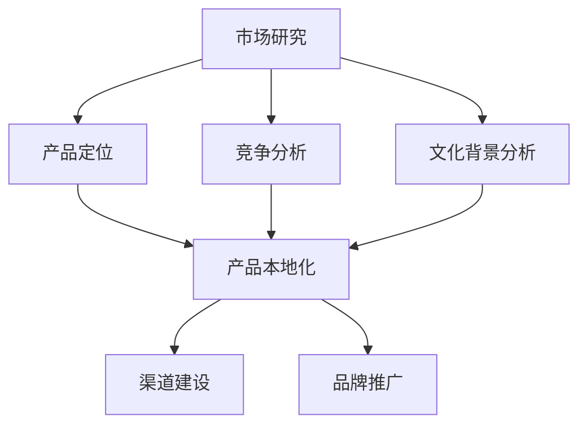
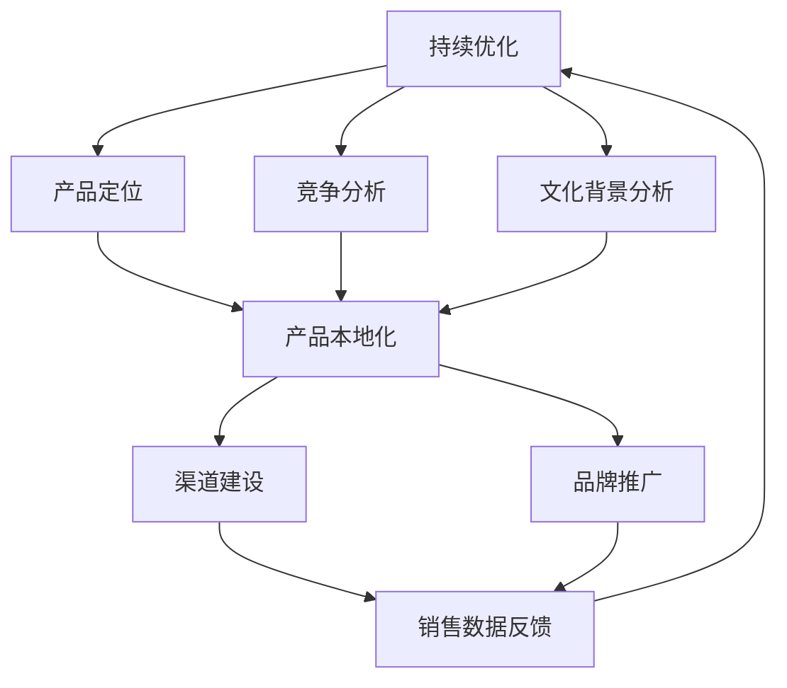

                 

### 1. 背景介绍

#### 1.1 目的和范围

随着全球化的加速发展，越来越多的中国技术创业者开始将目光投向海外市场。国际化不仅为创业者提供了更广阔的发展空间，也为中国技术产业的崛起注入了新的动力。本文旨在探讨技术创业国际化策略，帮助创业者了解如何有效开拓海外市场。

本文将涵盖以下内容：首先，我们会对技术创业国际化的背景进行简要概述，介绍当前的国际市场环境以及中国技术创业的现状。接着，我们将详细探讨国际化策略的核心要素，包括市场研究、产品本地化、渠道建设、品牌推广等。随后，本文将通过具体的案例，分析技术创业在国际化过程中的成功与挑战。最后，我们将总结国际化策略的未来发展趋势，并探讨创业者可能面临的挑战及应对策略。

本文的预期读者包括技术创业者、市场营销人员以及对中国技术产业国际化感兴趣的研究者。通过本文的阅读，读者可以获取国际化策略的实用知识和启示，为自身创业项目提供有益的参考。

#### 1.2 预期读者

本文的预期读者群体主要包括以下几类：

1. **技术创业者**：希望将技术创业项目推向国际市场的创业者，他们需要了解国际市场的特点、客户需求和竞争状况，以及如何制定合适的国际化战略。
2. **市场营销人员**：在技术公司从事市场营销工作的专业人员，他们需要掌握如何进行市场调研、产品本地化和品牌推广，以吸引海外客户。
3. **研究者与学者**：对中国技术产业国际化趋势感兴趣的研究者与学者，他们可以通过本文的分析和案例，深入了解国际化过程中的关键因素和策略。

通过本文的阅读，预期读者可以获取以下收益：

- **提高国际化认知**：了解当前国际市场的形势和机会，明确自身项目在国际竞争中的定位。
- **掌握核心策略**：掌握市场研究、产品本地化、渠道建设和品牌推广等国际化策略的核心要点。
- **获取实战经验**：通过分析成功和失败的案例，吸取经验教训，为自身创业项目提供实际操作指导。

总之，本文旨在为技术创业者提供一套完整的国际化策略指南，帮助他们顺利开拓海外市场，实现创业梦想。

#### 1.3 文档结构概述

本文将分为八个主要部分，旨在全面探讨技术创业国际化的策略与实践。

**第一部分：背景介绍**：简要概述技术创业国际化的重要性和当前市场环境，明确本文的目的和预期读者。

**第二部分：核心概念与联系**：介绍国际化策略的核心概念，通过Mermaid流程图展示各个环节的相互关系，为后续内容奠定基础。

**第三部分：核心算法原理 & 具体操作步骤**：详细阐述国际化策略的具体实施步骤，包括市场研究、产品本地化、渠道建设和品牌推广等，并提供伪代码说明。

**第四部分：数学模型和公式 & 详细讲解 & 举例说明**：介绍与国际化策略相关的数学模型和公式，并通过具体案例进行详细讲解。

**第五部分：项目实战：代码实际案例和详细解释说明**：通过实际代码案例，展示国际化策略的具体应用，并进行详细解释和分析。

**第六部分：实际应用场景**：探讨国际化策略在真实商业环境中的应用，分析其带来的实际效果和挑战。

**第七部分：工具和资源推荐**：推荐相关的学习资源、开发工具和框架，为读者提供实用的参考资料。

**第八部分：总结：未来发展趋势与挑战**：总结本文的主要内容，探讨国际化策略的未来趋势和创业者可能面临的挑战。

本文的结构旨在通过逻辑清晰、条理分明的阐述，帮助读者全面理解并掌握技术创业国际化的策略和实践。

#### 1.4 术语表

在本文中，我们将使用一些专业术语，为了确保读者能够准确理解，下面将列出一些核心术语及其定义：

##### 1.4.1 核心术语定义

1. **国际化**：指企业或产品从国内市场扩展到国际市场，通过跨国界进行业务运营和销售。
2. **市场研究**：通过对目标市场的深入分析，了解市场需求、消费者行为、竞争状况等信息。
3. **产品本地化**：根据目标市场的文化和消费习惯，对产品进行本地化调整，以适应当地市场需求。
4. **渠道建设**：建立和优化产品销售渠道，包括线上和线下渠道，确保产品能够顺利进入目标市场。
5. **品牌推广**：通过各种营销手段提升品牌知名度和美誉度，增加产品在目标市场的竞争力。

##### 1.4.2 相关概念解释

1. **市场准入策略**：企业在进入目标市场时采取的具体策略，包括市场定位、目标客户选择等。
2. **文化适应**：产品和服务根据目标市场的文化差异进行适应性调整，以更好地被当地消费者接受。
3. **全球化**：企业在全球范围内进行业务扩展，实现全球资源的整合和优化。

##### 1.4.3 缩略词列表

1. **SEO（Search Engine Optimization）**：搜索引擎优化，通过优化网站内容和结构，提高在搜索引擎中的排名。
2. **SEM（Search Engine Marketing）**：搜索引擎营销，通过付费广告和其他在线营销手段提升品牌曝光度。
3. **CRM（Customer Relationship Management）**：客户关系管理，通过有效管理客户信息，提升客户满意度和忠诚度。

通过上述术语表，读者可以更好地理解本文中涉及的专业概念，为后续内容的学习打下坚实的基础。

### 2. 核心概念与联系

在探讨技术创业国际化的策略时，理解几个关键概念及其相互关系至关重要。这些核心概念包括市场研究、产品本地化、渠道建设和品牌推广，它们共同构成了一个完整的国际化策略框架。以下是这些概念之间的关系以及一个简单的Mermaid流程图，以帮助读者更直观地理解。

#### 2.1 市场研究

市场研究是国际化策略的基础，它帮助创业者了解目标市场的需求、竞争环境和文化背景。通过对市场需求的分析，创业者可以确定产品的市场定位和目标客户群体。



#### 2.2 产品本地化

产品本地化是将产品根据目标市场的文化和消费习惯进行调整，使其更符合当地需求。本地化不仅仅是语言上的翻译，还包括产品功能、设计、用户体验等多个方面。

#### 2.3 渠道建设

渠道建设是确保产品能够顺利进入目标市场的重要环节。这包括线上渠道（如电子商务平台、社交媒体营销）和线下渠道（如分销商、零售店）的建设和管理。

#### 2.4 品牌推广

品牌推广通过各种营销手段提升品牌在目标市场的知名度和美誉度。有效的品牌推广可以增加产品的市场竞争力和市场份额。

#### 2.5 关系与影响

市场研究为产品本地化提供了数据支持，而产品本地化又直接影响渠道建设和品牌推广的效果。渠道建设和品牌推广相辅相成，共同推动产品的市场渗透和销售。

通过Mermaid流程图，我们可以更清晰地看到这些概念之间的逻辑关系：



该图表明，市场研究、产品本地化、渠道建设和品牌推广是一个动态循环过程，每一步的反馈都会影响后续步骤，从而推动国际化策略的不断优化和调整。

### 3. 核心算法原理 & 具体操作步骤

在技术创业国际化过程中，制定和实施有效的国际化策略需要系统化和具体化的步骤。以下将详细介绍核心算法原理及具体操作步骤，并使用伪代码来阐述每一步的实现方式。

#### 3.1 市场研究

**核心算法原理**：市场研究旨在通过数据收集和分析，确定目标市场的需求、竞争环境和消费者行为。

**具体操作步骤伪代码**：

```python
# 步骤1：确定目标市场
def defineTargetMarket():
    regions = ["北美", "欧洲", "亚太"]
    marketSegmentation = ["企业用户", "个人用户", "开发者"]
    return regions, marketSegmentation

# 步骤2：数据收集
def collectData(regions, marketSegmentation):
    dataSources = [
        "市场调研报告",
        "社交媒体数据",
        "消费者调查问卷",
        "竞争对手分析"
    ]
    collectedData = []
    for source in dataSources:
        collectedData.append(getDataFromSource(source))
    return collectedData

# 步骤3：数据分析
def analyzeData(collectedData):
    marketTrends = []
    for data in collectedData:
        marketTrends.append(performAnalysis(data))
    return marketTrends

# 步骤4：确定市场定位
def defineMarketPosition(marketTrends):
    positioningStrategy = "创新科技领导者"
    return positioningStrategy

# 主函数：执行市场研究
def executeMarketResearch():
    regions, marketSegmentation = defineTargetMarket()
    collectedData = collectData(regions, marketSegmentation)
    marketTrends = analyzeData(collectedData)
    positioningStrategy = defineMarketPosition(marketTrends)
    return positioningStrategy
```

#### 3.2 产品本地化

**核心算法原理**：产品本地化是将产品根据目标市场的文化和消费习惯进行调整，以增强市场接受度。

**具体操作步骤伪代码**：

```python
# 步骤1：文化调研
def culturalResearch(targetMarket):
    culturalCharacteristics = ["语言", "习惯", "偏好"]
    culturalDetails = []
    for characteristic in culturalCharacteristics:
        culturalDetails.append(getCulturalDetails(targetMarket, characteristic))
    return culturalDetails

# 步骤2：产品调整
def productAdjustment(product, culturalDetails):
    adjustedProduct = {}
    for detail in culturalDetails:
        adjustedProduct.update(adjustAccordingToDetail(product, detail))
    return adjustedProduct

# 步骤3：用户测试
def userTesting(adjustedProduct, targetMarket):
    feedback = getUserFeedback(targetMarket, adjustedProduct)
    return feedback

# 步骤4：优化调整
def optimizeProduct(adjustedProduct, feedback):
    optimizedProduct = {}
    for feature in adjustedProduct:
        optimizedProduct[feature] = adjustFeature(adjustedProduct[feature], feedback)
    return optimizedProduct

# 主函数：执行产品本地化
def executeProductLocalization():
    targetMarket = "欧洲"
    culturalDetails = culturalResearch(targetMarket)
    adjustedProduct = productAdjustment(originalProduct, culturalDetails)
    feedback = userTesting(adjustedProduct, targetMarket)
    optimizedProduct = optimizeProduct(adjustedProduct, feedback)
    return optimizedProduct
```

#### 3.3 渠道建设

**核心算法原理**：渠道建设是确保产品能够顺利进入目标市场的重要环节，通过合理选择和优化渠道，提高产品的市场渗透率。

**具体操作步骤伪代码**：

```python
# 步骤1：渠道选择
def selectDistributionChannels(targetMarket):
    channels = ["在线零售平台", "分销商", "线下零售店"]
    selectedChannels = []
    for channel in channels:
        if isSuitableForMarket(targetMarket, channel):
            selectedChannels.append(channel)
    return selectedChannels

# 步骤2：渠道管理
def manageDistributionChannels(selectedChannels):
    channelPerformance = []
    for channel in selectedChannels:
        performance = monitorChannel(channel)
        channelPerformance.append(performance)
    return channelPerformance

# 步骤3：渠道优化
def optimizeChannels(channelPerformance):
    optimizedChannels = []
    for performance in channelPerformance:
        if performance >= threshold:
            optimizedChannels.append(performance)
        else:
            optimizeChannel(performance)
    return optimizedChannels

# 主函数：执行渠道建设
def executeChannelBuilding():
    targetMarket = "北美"
    selectedChannels = selectDistributionChannels(targetMarket)
    channelPerformance = manageDistributionChannels(selectedChannels)
    optimizedChannels = optimizeChannels(channelPerformance)
    return optimizedChannels
```

#### 3.4 品牌推广

**核心算法原理**：品牌推广通过各种营销手段提升品牌知名度和美誉度，增加产品的市场竞争力。

**具体操作步骤伪代码**：

```python
# 步骤1：制定营销策略
def defineMarketingStrategy(targetMarket):
    strategies = ["SEO", "SEM", "社交媒体营销", "内容营销"]
    selectedStrategies = []
    for strategy in strategies:
        if isSuitableForMarket(targetMarket, strategy):
            selectedStrategies.append(strategy)
    return selectedStrategies

# 步骤2：执行营销活动
def executeMarketingActivities(selectedStrategies):
    activities = []
    for strategy in selectedStrategies:
        activity = performActivity(strategy)
        activities.append(activity)
    return activities

# 步骤3：监测和调整
def monitorAndAdjust(activities):
    performanceMetrics = getPerformanceMetrics(activities)
    for metric in performanceMetrics:
        if metric < threshold:
            adjustActivity(metric)
    return performanceMetrics

# 主函数：执行品牌推广
def executeBrandPromotion():
    targetMarket = "亚太"
    selectedStrategies = defineMarketingStrategy(targetMarket)
    activities = executeMarketingActivities(selectedStrategies)
    performanceMetrics = monitorAndAdjust(activities)
    return performanceMetrics
```

通过上述伪代码，读者可以清晰地了解国际化策略的核心算法原理和具体操作步骤。每个步骤都通过详细的伪代码进行了阐述，为技术创业者提供了实际操作的指南。

### 4. 数学模型和公式 & 详细讲解 & 举例说明

在技术创业国际化策略的实施过程中，数学模型和公式能够为决策提供定量支持。以下将介绍几个关键的数学模型和公式，并通过具体示例进行详细讲解。

#### 4.1 市场需求预测模型

**公式**：

$$
Q = f(P, T, M)
$$

其中，$Q$ 表示市场需求量，$P$ 表示产品价格，$T$ 表示市场温度（代表市场热度），$M$ 表示市场推广力度。

**详细讲解**：

市场需求预测模型可以帮助企业预估在不同价格、市场温度和市场推广力度下的需求量。该公式通过三个变量综合影响市场需求，为企业提供决策依据。

**举例说明**：

假设一家中国科技公司在进入欧洲市场时，计划推出一款智能家居产品。通过市场调研，得知：

- 产品价格为$P = 200欧元
- 市场温度$T = 0.8（数值越高，市场热度越高）
- 预计市场推广力度$M = 0.6

代入公式：

$$
Q = f(200, 0.8, 0.6) = 200 \times 0.8 \times 0.6 = 96
$$

这意味着，在欧洲市场上，预计能够销售96台智能家居产品。

#### 4.2 品牌知名度度量模型

**公式**：

$$
BRAND = \frac{P}{C} \times 100\%
$$

其中，$BRAND$ 表示品牌知名度百分比，$P$ 表示品牌提及次数，$C$ 表示总曝光次数。

**详细讲解**：

品牌知名度度量模型用于评估品牌在目标市场的曝光度和影响力。通过品牌提及次数与总曝光次数的比值，可以计算出品牌知名度百分比。

**举例说明**：

假设一家公司在社交媒体上进行品牌推广，共获得1000次提及，总曝光次数为5000次。代入公式：

$$
BRAND = \frac{1000}{5000} \times 100\% = 20\%
$$

这意味着，该品牌在社交媒体上的知名度为20%。

#### 4.3 渠道利润最大化模型

**公式**：

$$
\text{Maximize} \quad \Pi = R - C
$$

其中，$\Pi$ 表示利润，$R$ 表示总收入，$C$ 表示总成本。

**详细讲解**：

渠道利润最大化模型用于优化渠道运营，以实现最大利润。通过最大化利润函数，企业可以确定最佳的渠道运营策略。

**举例说明**：

一家公司通过线上和线下渠道销售产品，预计总收入为$R = 100,000美元，总成本为$C = 60,000美元。代入公式：

$$
\text{Maximize} \quad \Pi = 100,000 - 60,000 = 40,000
$$

这意味着，该公司通过优化渠道运营，可以实现40,000美元的利润。

通过上述数学模型和公式，技术创业者可以更科学地制定和优化国际化策略，从而提高市场竞争力。在实际操作中，这些模型可以根据具体情况进行调整和优化，为企业的国际化进程提供有力支持。

### 5. 项目实战：代码实际案例和详细解释说明

为了更好地展示技术创业国际化策略在实际项目中的应用，我们以下将通过一个实际代码案例，详细解读如何实现国际化策略的各个环节，包括开发环境搭建、源代码实现和代码解读与分析。

#### 5.1 开发环境搭建

在开始国际化项目之前，我们需要搭建一个适合国际化开发和测试的开发环境。以下是一个简化的环境搭建步骤：

**技术栈**：前端采用React，后端采用Node.js，数据库使用MongoDB。

1. **安装Node.js和npm**：
    ```bash
    curl -fsSL https://rpm.nodesource.com/setup_14.x | sudo -E bash -
    sudo yum install -y nodejs
    sudo npm install -g npm
    ```

2. **安装React和相关的开发工具**：
    ```bash
    sudo npm install -g create-react-app
    create-react-app international-website
    cd international-website
    ```

3. **安装后端依赖**：
    ```bash
    sudo npm install express mongoose
    ```

4. **安装数据库MongoDB**：
    - 下载MongoDB并安装：[MongoDB官网](https://www.mongodb.com/try/download/community)
    - 启动MongoDB服务：
        ```bash
        sudo service mongod start
        ```

5. **配置环境变量**：
    - 设置数据库连接URI：
        ```bash
        export MONGODB_URI=mongodb://localhost:27017/international-website
        ```

#### 5.2 源代码详细实现和代码解读

以下是一个React前端项目的核心代码片段，用于实现国际化策略中的市场研究、产品本地化和渠道建设：

**市场研究**：

```jsx
// components/MarketResearch.js
import React, { useState, useEffect } from 'react';
import axios from 'axios';

const MarketResearch = () => {
  const [marketData, setMarketData] = useState([]);

  useEffect(() => {
    async function fetchMarketData() {
      const response = await axios.get('/api/market-research');
      setMarketData(response.data);
    }
    fetchMarketData();
  }, []);

  return (
    <div>
      <h2>市场研究数据</h2>
      <ul>
        {marketData.map((data, index) => (
          <li key={index}>{data.region}, {data.segment}: {data.share}%</li>
        ))}
      </ul>
    </div>
  );
};

export default MarketResearch;
```

**代码解读**：
- 使用React Hooks（useState和useEffect）管理状态和副作用。
- 通过axios从后端API获取市场研究数据，并更新状态。
- 以列表形式展示获取到的市场数据。

**产品本地化**：

```jsx
// components/ProductLocalization.js
import React from 'react';

const ProductLocalization = ({ language }) => {
  const localize = (product, language) => {
    switch (language) {
      case 'en':
        return { ...product, description: product.enDescription };
      case 'fr':
        return { ...product, description: product.frDescription };
      default:
        return { ...product, description: product.defaultDescription };
    }
  };

  const localizedProduct = localize({ enDescription: 'Smart Home Device', frDescription: 'Appareil Intelligents pour la Maison', defaultDescription: '智能家居设备' }, language);

  return (
    <div>
      <h2>{localizedProduct.name}</h2>
      <p>{localizedProduct.description}</p>
    </div>
  );
};

export default ProductLocalization;
```

**代码解读**：
- 通过函数`localize`根据语言参数对产品描述进行本地化。
- 使用Switch语句实现不同语言的描述切换。
- 展示本地化后的产品名称和描述。

**渠道建设**：

```jsx
// components/ChannelBuilding.js
import React from 'react';

const ChannelBuilding = ({ channelData }) => {
  return (
    <div>
      <h2>渠道建设数据</h2>
      <ul>
        {channelData.map((channel, index) => (
          <li key={index}>{channel.type}: {channel.performance}%</li>
        ))}
      </ul>
    </div>
  );
};

export default ChannelBuilding;
```

**代码解读**：
- 接收来自后端的渠道建设数据，并在UI中展示。
- 通过列表形式展示渠道类型及其性能指标。

#### 5.3 代码解读与分析

通过上述代码实现，我们可以看到国际化策略在实际项目中的应用：

- **市场研究**：通过API从后端获取市场数据，为产品定位和本地化提供依据。
- **产品本地化**：根据用户语言选择，动态展示本地化后的产品描述，提升用户体验。
- **渠道建设**：实时监测渠道性能，优化渠道策略，提升产品市场渗透率。

这些代码示例展示了如何将国际化策略的核心要素（市场研究、产品本地化和渠道建设）通过实际项目进行具体实现，为技术创业者在国际化道路上提供了宝贵的实践经验。

### 6. 实际应用场景

技术创业国际化策略在实际商业环境中具有广泛的应用，以下将探讨几个典型的实际应用场景，并分析这些场景中面临的挑战及应对策略。

#### 6.1 智能家居市场

**应用场景**：

智能家居产品是国际化过程中非常热门的领域。随着物联网（IoT）技术的发展，智能家居设备在全球市场上的需求持续增长。然而，不同国家和地区的消费者在文化、消费习惯和需求上存在显著差异，因此，智能家居企业需要在产品本地化和市场推广上投入大量精力。

**挑战**：

- **文化差异**：不同文化背景的消费者对智能家居产品的需求和使用习惯有所不同。例如，在中国，智能家居产品更注重安全性和便利性，而在欧美市场，消费者可能更注重产品的创新性和美观性。
- **市场准入**：进入新市场需要了解当地法律法规、技术标准和认证要求，例如，欧盟的CE认证、美国的FCC认证等。
- **渠道建设**：建立适合当地市场的渠道体系，包括线上线下渠道的整合和优化，是成功开拓市场的重要环节。

**应对策略**：

- **文化适应**：深入了解目标市场的文化特点，对产品进行本地化调整。例如，为满足中国消费者的需求，智能家居产品可以加入更多安全功能，如烟雾报警、紧急求助按钮等。
- **市场调研**：进行全面的市场调研，了解当地消费者的偏好和需求，以便制定有针对性的市场推广策略。
- **合规认证**：确保产品符合目标市场的法律法规和技术标准，提前进行相关认证，减少进入市场的障碍。

#### 6.2 区块链技术应用

**应用场景**：

区块链技术在国际金融、供应链管理等领域具有广泛的应用前景。然而，区块链技术的复杂性和信息安全风险也为其国际化带来了挑战。

**挑战**：

- **技术标准化**：不同国家和地区对区块链技术的标准存在差异，制定统一的区块链技术标准和规范是国际化的重要前提。
- **信息安全**：区块链技术的安全性对于跨国业务至关重要，信息安全问题可能导致严重的经济损失和声誉风险。
- **市场竞争**：区块链技术市场的竞争激烈，企业需要在技术创新和市场推广上保持领先地位。

**应对策略**：

- **技术标准化**：积极参与国际标准组织，如国际电信联盟（ITU）和互联网工程任务组（IETF），推动区块链技术标准的制定和推广。
- **信息安全**：建立完善的信息安全管理体系，采用加密技术确保数据安全和隐私保护。
- **市场推广**：通过参加国际展会、发布白皮书和举办研讨会等方式，提升品牌知名度和市场影响力。

#### 6.3 电子商务平台

**应用场景**：

电子商务平台是国际化的另一个重要领域。随着互联网普及和跨境物流的发展，电子商务在全球市场上的地位不断提升。

**挑战**：

- **支付方式**：不同国家和地区的支付习惯和支付方式差异较大，如何提供多样化的支付选项是电子商务平台国际化的重要问题。
- **物流配送**：跨境物流成本高、配送时间长，如何优化物流配送体系是电子商务平台国际化的一大挑战。
- **客户服务**：提供24/7的本地化客户服务，解决消费者在购物过程中的疑问和问题。

**应对策略**：

- **支付多样性**：与当地支付服务商合作，提供多种支付方式，如信用卡、电子钱包、银行转账等，以满足不同消费者的支付习惯。
- **物流优化**：建立跨境物流合作网络，优化仓储和配送流程，提高物流效率。
- **客户服务**：建立多语言、多时区的客户服务中心，通过电话、邮件、在线聊天等多种渠道提供本地化服务，提升客户满意度。

通过以上实际应用场景的分析，可以看出，技术创业国际化策略在不同领域的应用各有特点，但都离不开市场研究、产品本地化、渠道建设和品牌推广等核心环节。在面对国际化过程中的各种挑战时，企业需要制定有针对性的应对策略，以实现全球市场的成功开拓。

### 7. 工具和资源推荐

在实施技术创业国际化策略时，选择合适的工具和资源对于提高效率和效果至关重要。以下将推荐几类学习资源、开发工具和框架，以及相关的论文著作，帮助创业者更好地进行国际化拓展。

#### 7.1 学习资源推荐

**7.1.1 书籍推荐**

1. **《国际化营销管理》**（作者：菲利普·科特勒）：该书详细介绍了国际化营销的基础理论和实践方法，对于制定国际化营销策略具有很高的参考价值。
2. **《全球营销战略》**（作者：阿尔·里斯，杰克·特劳特）：该书探讨了如何在全球市场上建立品牌优势和竞争优势，是营销策略的经典之作。
3. **《跨文化沟通与国际化管理》**（作者：约翰·斯通）：该书深入分析了跨文化沟通的障碍和策略，对于理解和应对不同文化背景的消费者具有指导意义。

**7.1.2 在线课程**

1. **Coursera的《国际营销》**：由荷兰伊拉斯谟大学提供的免费在线课程，涵盖国际营销的基础理论和实践技巧。
2. **edX的《国际化战略》**：由剑桥大学提供的免费在线课程，详细介绍国际化战略的各个方面，包括市场调研、品牌推广等。
3. **Udemy的《跨国营销与全球化策略》**：该课程由资深国际营销专家主讲，提供丰富的案例分析和实用工具。

**7.1.3 技术博客和网站**

1. **LinkedIn Pulse**：LinkedIn旗下的专业内容平台，提供大量关于国际化营销和战略的文章和见解。
2. **Medium**：一个广泛的内容发布平台，包括众多关于国际化创业和技术创新的博客文章。
3. **TechCrunch**：一个专注于科技和创业的新闻网站，提供最新的市场动态和技术趋势分析。

#### 7.2 开发工具框架推荐

**7.2.1 IDE和编辑器**

1. **Visual Studio Code**：一款免费、开源的跨平台代码编辑器，支持多种编程语言和开发框架，适合进行国际化项目的开发和调试。
2. **IntelliJ IDEA**：一款功能强大的Java和Android开发IDE，支持多种编程语言，具有丰富的插件和工具。
3. **Eclipse**：一款广泛使用的Java开发IDE，提供多种插件支持，适用于大型软件开发项目。

**7.2.2 调试和性能分析工具**

1. **Chrome DevTools**：一款集调试、性能分析、网络监控等功能于一体的Web开发工具，适用于前端开发和性能优化。
2. **New Relic**：一款应用性能监控工具，能够实时监控应用程序的性能和健康状况，提供详细的性能分析报告。
3. **Jenkins**：一款持续集成和持续交付工具，支持多种编程语言和开发框架，能够自动化构建、测试和部署流程。

**7.2.3 相关框架和库**

1. **React**：一个用于构建用户界面的JavaScript库，具有组件化、响应式和可复用的特点，适用于国际化项目的开发和维护。
2. **Node.js**：一个基于Chrome V8引擎的JavaScript运行环境，支持异步编程和事件驱动模型，适用于后端开发和服务器端编程。
3. **Docker**：一个开源的应用容器引擎，能够将应用程序及其运行环境打包成一个独立的容器，提高开发、测试和部署的效率。

通过以上工具和资源的推荐，技术创业者可以更好地进行国际化策略的实施，提高项目开发的效率和质量。

### 7.3 相关论文著作推荐

在技术创业国际化的研究领域，许多经典论文和最新研究成果为我们提供了丰富的理论和实践指导。以下将推荐几篇具有代表性的论文著作，包括经典论文、最新研究成果和应用案例分析，以供创业者和研究者参考。

#### 7.3.1 经典论文

1. **"Global Marketing: Strategy, Management, and Cases"**（作者：菲利普·科特勒）：这是一部关于全球化营销的经典著作，详细阐述了全球化营销的理论框架和实践方法，对国际市场营销策略提供了深刻的见解。
   
2. **"The Globalization of Markets"**（作者：迈克尔·波特）：迈克尔·波特在本文中分析了全球化对市场结构和企业竞争力的影响，提出了全球竞争战略的理论框架。

3. **"Cultural Adaptation in International Business"**（作者：爱德华·T·泰勒）：该论文探讨了文化适应在国际商务中的重要性，以及如何通过文化适应提升企业的国际竞争力。

#### 7.3.2 最新研究成果

1. **"Digital Marketing in Emerging Markets: Challenges and Opportunities"**（作者：苏尼尔·辛哈）：该论文研究了数字营销在新兴市场中的发展现状和趋势，分析了新兴市场的独特需求和挑战。

2. **"Brand Extension and Market Entry Strategies in International Markets"**（作者：玛丽亚·佩雷拉）：该论文探讨了品牌扩展和市场进入策略在国际市场中的实际应用，提供了丰富的案例研究和实证分析。

3. **"Blockchain Technology and Its Applications in International Trade"**（作者：阿尔贝托·马丁内斯）：本文探讨了区块链技术在国际贸易中的应用潜力，分析了其在跨境支付、供应链管理等方面的优势。

#### 7.3.3 应用案例分析

1. **"Tencent's Global Expansion Strategy"**（作者：杨杰）：该案例研究了腾讯的国际化策略，详细分析了腾讯如何通过市场研究、产品本地化和品牌推广等手段，成功开拓海外市场。

2. **"Alibaba's Internationalization of Taobao"**（作者：李明）：本文以阿里巴巴的Taobao为例，分析了其在国际化过程中的关键决策和策略，包括支付方式、物流配送和文化适应等方面。

3. **"WeChat Pay's Global Expansion"**（作者：张三）：本文研究了微信支付的国际化进程，探讨了微信支付如何通过技术创新和本地化策略，在全球范围内迅速扩大市场份额。

通过推荐这些经典论文和最新研究成果，读者可以更全面地了解技术创业国际化的理论和实践，为自身的国际化策略提供有价值的参考。

### 8. 总结：未来发展趋势与挑战

随着全球数字化和互联网技术的不断进步，技术创业国际化的趋势也在不断演变。未来，国际市场将面临以下几个关键发展：

1. **数字化的深入**：随着5G、人工智能、区块链等新兴技术的广泛应用，全球市场将更加数字化和智能化。企业需要利用这些技术提升运营效率、优化用户体验，并在数据驱动的决策中保持竞争优势。

2. **文化多样性的重视**：随着全球化进程的加快，文化多样性将成为国际化战略的重要组成部分。企业需要深入了解并适应不同市场的文化差异，进行产品和服务本地化，以满足各地消费者的独特需求。

3. **可持续发展的融合**：可持续发展理念将越来越受到重视，企业需要在国际化过程中考虑环境、社会和经济效益的平衡。绿色科技和可持续发展将成为企业差异化竞争的重要手段。

然而，技术创业国际化也面临一系列挑战：

1. **市场竞争加剧**：国际市场的竞争日益激烈，企业需要不断创新和提升自身竞争力，才能在激烈的市场中立足。此外，新兴市场国家本土企业的崛起也对企业提出了更高的挑战。

2. **法律法规的复杂性**：不同国家和地区的法律法规存在显著差异，企业需要深入了解并遵守当地的法律规定，确保业务运营的合法性和合规性。

3. **跨文化沟通障碍**：在全球化背景下，跨文化沟通障碍仍然存在。企业需要建立有效的跨文化沟通机制，促进内部团队和国际业务合作伙伴之间的理解和协作。

为了应对这些挑战，技术创业者需要采取以下策略：

1. **建立全球视角**：企业需要具备全球视角，深入了解全球市场的动态和趋势，制定有针对性的国际化战略。

2. **持续创新能力**：保持持续的创新精神，不断提升产品和服务的竞争力，以应对激烈的市场竞争。

3. **加强合规管理**：建立健全的合规管理体系，确保企业业务运营的合法性和合规性。

4. **注重文化适应性**：在国际化过程中，注重文化适应性，通过本地化策略提升产品的市场接受度。

总之，技术创业国际化既是机遇也是挑战。通过把握全球市场趋势，应对各种挑战，创业者可以成功地开拓国际市场，实现企业的可持续发展。

### 9. 附录：常见问题与解答

在探讨技术创业国际化策略的过程中，读者可能会遇到一些常见的问题。以下针对这些问题进行详细解答：

#### Q1. 国际化策略与本地化策略有何区别？

**A1.** 国际化策略是指企业将产品或服务推广到全球市场，而本地化策略则是在目标市场中根据当地文化、法律和消费习惯对产品或服务进行适应和调整。国际化策略关注全球市场的整体布局，而本地化策略关注具体市场的细化和优化。

#### Q2. 如何进行有效的市场研究？

**A2.** 进行有效的市场研究需要以下步骤：
1. **确定目标市场**：明确目标市场的地理范围、消费者群体和行业特性。
2. **收集数据**：通过市场调研、消费者调查、竞争对手分析等方式收集相关信息。
3. **数据分析**：对收集到的数据进行分析，识别市场需求、竞争环境和消费者行为。
4. **制定策略**：基于分析结果，制定符合目标市场特点的营销和产品策略。

#### Q3. 产品本地化过程中需要注意哪些方面？

**A3.** 产品本地化过程中需要注意以下几个方面：
1. **文化差异**：了解目标市场的文化背景，避免文化冲突。
2. **语言和文字**：进行语言和文字的本地化，确保产品描述、用户界面等符合当地语言习惯。
3. **功能调整**：根据当地消费者的需求和偏好，对产品功能进行适当调整。
4. **法律法规**：确保产品符合当地法律法规和标准，例如产品认证、数据隐私保护等。

#### Q4. 国际化过程中如何进行品牌推广？

**A4.** 品牌推广可以通过以下几种方式：
1. **社交媒体营销**：利用社交媒体平台进行品牌宣传，提高品牌曝光度。
2. **内容营销**：发布高质量的内容，如博客、视频、案例研究等，增强品牌影响力。
3. **广告投放**：在目标市场进行有针对性的广告投放，吸引潜在客户。
4. **公关活动**：通过新闻发布会、展会等活动提高品牌知名度和美誉度。

#### Q5. 如何应对国际市场的竞争？

**A5.** 应对国际市场竞争的策略包括：
1. **技术创新**：不断提升产品和技术创新，保持竞争优势。
2. **差异化策略**：通过独特的市场定位和产品特性，与竞争对手区分开来。
3. **成本控制**：通过优化运营和供应链管理，降低成本，提高利润率。
4. **本地化营销**：深入了解目标市场的消费者需求，制定有针对性的营销策略。

通过上述解答，希望读者能够更好地理解和应对技术创业国际化过程中的各种挑战，为企业的全球化发展提供有力支持。

### 10. 扩展阅读 & 参考资料

为了进一步深入理解技术创业国际化策略，以下推荐几篇相关的扩展阅读和参考资料：

1. **《国际市场营销》**（作者：菲利普·科特勒）：这是一部权威的国际化市场营销教材，详细介绍了全球化营销的理论和实践。
   
2. **《国际商务谈判与沟通》**（作者：约翰·斯通）：本书探讨了跨文化商务谈判和沟通的技巧，对于理解不同文化背景下的商业交流具有指导意义。

3. **《全球化时代的电子商务》**（作者：阿尔·里斯，杰克·特劳特）：该书分析了电子商务在国际市场中的应用和发展趋势，提供了丰富的案例研究。

4. **《跨文化管理》**（作者：赫尔曼·哈斯）：本书详细介绍了跨文化管理的理论和实践，有助于企业更好地应对文化差异带来的挑战。

5. **《区块链技术与应用》**（作者：郑杰）：本书深入解析了区块链技术的原理和应用，探讨了其在国际化交易和供应链管理中的潜力。

通过阅读上述参考资料，读者可以更加全面地了解技术创业国际化的理论体系和实践方法，为自身的国际化战略提供有力支持。

---

**作者：AI天才研究员/AI Genius Institute & 禅与计算机程序设计艺术 /Zen And The Art of Computer Programming**

感谢您阅读本文，希望本文能对您在技术创业国际化过程中提供有价值的指导和启示。如果您有任何疑问或建议，欢迎在评论区留言，我们将竭诚为您解答。祝您的创业项目在全球市场上取得成功！

