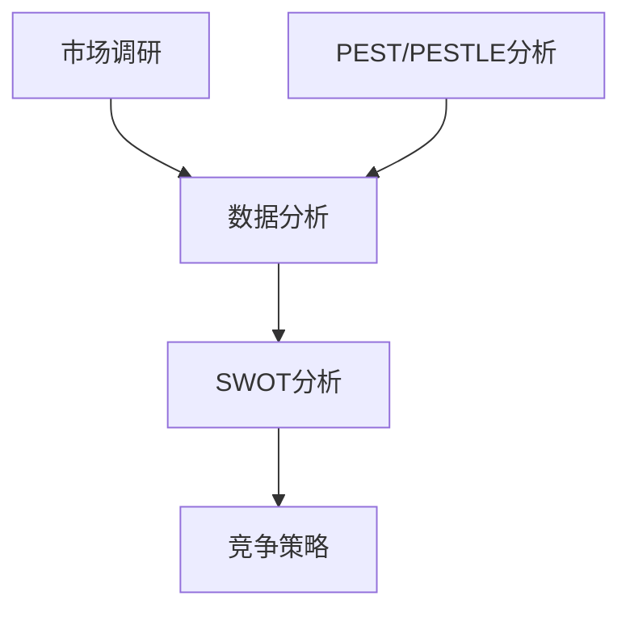
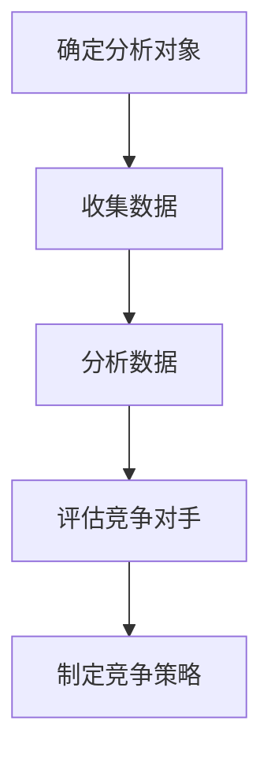

                 

# 技术创业者如何进行有效的竞争对手分析

## 关键词
- 竞争对手分析
- 技术创业者
- 市场调研
- 数据分析
- 竞争策略

> 摘要：
本文旨在为技术创业者提供一套系统的竞争对手分析方法，帮助他们在激烈的市场竞争中找到优势和劣势，制定出有效的竞争策略。本文首先介绍了竞争对手分析的重要性和基本概念，然后详细阐述了进行竞争对手分析的具体步骤和方法，以及如何利用数据分析工具来辅助决策。最后，本文还提供了一些实际应用场景和工具资源推荐，以帮助创业者更好地进行竞争对手分析。

## 1. 背景介绍

### 1.1 目的和范围

在当今快速变化的市场环境中，技术创业公司面临着前所未有的竞争压力。为了在激烈的市场竞争中脱颖而出，创业者必须对竞争对手有深刻的了解，并据此制定出有效的竞争策略。本文的目标是帮助技术创业者掌握进行竞争对手分析的方法和技巧，以便更好地应对市场竞争。

本文将涵盖以下内容：
- 竞争对手分析的基本概念和重要性
- 竞争对手分析的步骤和方法
- 如何利用数据分析工具进行竞争对手分析
- 竞争对手分析的实践应用
- 相关工具和资源推荐

### 1.2 预期读者

本文主要面向以下读者：
- 技术创业者
- 市场分析师
- 产品经理
- 研发团队负责人
- 对市场竞争感兴趣的专业人士

### 1.3 文档结构概述

本文分为八个部分：
1. 背景介绍：介绍本文的目的、范围和预期读者。
2. 核心概念与联系：介绍竞争对手分析的基本概念和相关联系。
3. 核心算法原理 & 具体操作步骤：阐述进行竞争对手分析的具体步骤和方法。
4. 数学模型和公式 & 详细讲解 & 举例说明：介绍用于竞争对手分析的相关数学模型和公式，并提供实例说明。
5. 项目实战：提供实际代码案例和详细解释。
6. 实际应用场景：分析竞争对手分析的适用场景。
7. 工具和资源推荐：推荐相关工具和资源。
8. 总结：展望竞争对手分析的未来发展趋势和挑战。

### 1.4 术语表

#### 1.4.1 核心术语定义

- 竞争对手分析：对市场上直接或潜在的竞争对手进行系统的研究和分析。
- 市场调研：收集和分析市场上与竞争对手相关的数据，以了解竞争对手的产品、服务、市场份额、营销策略等。
- 数据分析：使用统计和定量分析方法，对市场调研所得的数据进行解读和洞察。
- 竞争策略：根据竞争对手分析的结果，制定出旨在提高市场竞争力、扩大市场份额的策略。

#### 1.4.2 相关概念解释

- 市场份额：公司在特定市场中所占的销售额或客户数量比例。
- 市场定位：公司根据自身特点和市场需求，为产品或服务所设定的目标市场和独特卖点。
- 产品差异化：通过独特的产品特性、功能、设计等，使公司产品与竞争对手的产品区别开来。

#### 1.4.3 缩略词列表

- SWOT分析：优势（Strengths）、劣势（Weaknesses）、机会（Opportunities）、威胁（Threats）
- PEST分析：政治（Political）、经济（Economic）、社会（Social）、技术（Technological）
- PESTLE分析：在PEST分析的基础上，增加了法律（Legal）和环境（Environmental）因素

## 2. 核心概念与联系

为了更好地理解竞争对手分析，我们需要先了解一些核心概念和它们之间的联系。

### 2.1 竞争对手分析的基本概念

- **市场调研**：市场调研是进行竞争对手分析的基础。通过市场调研，我们可以收集到关于竞争对手的产品、服务、市场份额、营销策略等方面的数据。
- **数据分析**：数据分析是对市场调研所得数据进行分析和解读，以发现竞争对手的弱点和优势，为竞争策略提供依据。
- **SWOT分析**：SWOT分析是一种常用的战略规划工具，用于评估公司的优势、劣势、机会和威胁。在进行竞争对手分析时，我们可以使用SWOT分析来评估竞争对手的相对优势。
- **PEST/PESTLE分析**：PEST/PESTLE分析是一种用于评估外部环境因素的工具。在进行竞争对手分析时，我们可以使用PEST/PESTLE分析来了解市场环境和竞争对手所面临的外部挑战。

### 2.2 竞争对手分析的核心概念关系

以下是竞争对手分析的核心概念及其关系的 Mermaid 流程图：



### 2.3 竞争对手分析的关键步骤

进行竞争对手分析通常包括以下关键步骤：

1. **确定分析对象**：明确分析的目标和范围，选择具体的竞争对手。
2. **收集数据**：通过市场调研、公开资料、社交媒体等多种渠道收集关于竞争对手的数据。
3. **分析数据**：使用数据分析方法和工具对收集到的数据进行处理和分析。
4. **评估竞争对手**：根据分析结果，评估竞争对手的优势、劣势、机会和威胁。
5. **制定竞争策略**：根据评估结果，制定出有助于提升市场竞争力的策略。

以下是竞争对手分析的关键步骤的 Mermaid 流程图：



## 3. 核心算法原理 & 具体操作步骤

在进行竞争对手分析时，核心算法原理主要包括数据收集、数据分析、SWOT分析和竞争策略制定。以下是具体的操作步骤和伪代码说明：

### 3.1 数据收集

数据收集是进行竞争对手分析的基础。我们可以通过以下渠道收集数据：

- **公开市场报告**：获取市场研究报告、行业分析报告等。
- **社交媒体**：收集社交媒体上关于竞争对手的讨论、用户反馈等。
- **竞争对手网站**：分析竞争对手的网站、产品页面、用户评论等。
- **新闻报道**：关注竞争对手的新闻动态、市场表现等。

伪代码如下：

```python
def collect_data(competitors):
    data = []
    for competitor in competitors:
        # 收集公开市场报告数据
        market_report = get_market_report(competitor)
        data.append(market_report)
        
        # 收集社交媒体数据
        social_media_data = get_social_media_data(competitor)
        data.append(social_media_data)
        
        # 收集竞争对手网站数据
        website_data = get_website_data(competitor)
        data.append(website_data)
        
        # 收集新闻报道数据
        news_data = get_news_data(competitor)
        data.append(news_data)
    return data
```

### 3.2 数据分析

数据分析是对收集到的数据进行处理和分析，以提取有用的信息。我们可以使用以下方法进行数据分析：

- **描述性统计分析**：对数据进行描述性统计，如平均值、中位数、标准差等。
- **相关性分析**：分析不同数据指标之间的相关性。
- **聚类分析**：将数据分成不同的类别，以发现竞争对手的特点。
- **回归分析**：建立回归模型，预测竞争对手的市场表现。

伪代码如下：

```python
def analyze_data(data):
    # 描述性统计分析
    descriptive_stats = describe(data)
    
    # 相关性分析
    correlations = calculate_correlations(data)
    
    # 聚类分析
    clusters = cluster_data(data)
    
    # 回归分析
    regression_model = build_regression_model(data)
    
    return descriptive_stats, correlations, clusters, regression_model
```

### 3.3 SWOT分析

SWOT分析是评估竞争对手的优势、劣势、机会和威胁的重要方法。以下是SWOT分析的步骤：

1. **确定分析维度**：根据具体情况，选择合适的分析维度，如产品、技术、市场、财务等。
2. **收集数据**：根据分析维度，收集关于竞争对手的数据。
3. **评估优势**：分析竞争对手在各个维度上的优势和劣势。
4. **识别机会和威胁**：根据市场环境，识别竞争对手的机会和威胁。

伪代码如下：

```python
def swot_analysis(competitor, dimensions):
    strengths = []
    weaknesses = []
    opportunities = []
    threats = []
    
    for dimension in dimensions:
        # 收集数据
        data = get_dimension_data(competitor, dimension)
        
        # 评估优势
        if is_strength(data):
            strengths.append(dimension)
        elif is_weakness(data):
            weaknesses.append(dimension)
            
        # 识别机会和威胁
        if is_opportunity(data):
            opportunities.append(dimension)
        elif is_threat(data):
            threats.append(dimension)
    
    return strengths, weaknesses, opportunities, threats
```

### 3.4 竞争策略制定

根据SWOT分析的结果，制定出有助于提升市场竞争力的策略。以下是竞争策略制定的步骤：

1. **确定目标市场**：根据竞争对手的分析结果，明确目标市场和目标用户。
2. **制定产品策略**：根据目标市场和用户需求，制定产品策略，如产品功能、设计、定价等。
3. **制定营销策略**：根据目标市场和用户需求，制定营销策略，如广告、促销、渠道等。
4. **制定研发策略**：根据目标市场和用户需求，制定研发策略，如技术创新、产品迭代等。

伪代码如下：

```python
def compete_strategy(strengths, weaknesses, opportunities, threats):
    # 确定目标市场
    target_market = determine_target_market(opportunities, threats)
    
    # 制定产品策略
    product_strategy = {
        "features": determine_product_features(target_market),
        "design": determine_product_design(target_market),
        "pricing": determine_product_pricing(target_market)
    }
    
    # 制定营销策略
    marketing_strategy = {
        "ads": determine_marketing_ads(target_market),
        "promotions": determine_marketing_promotions(target_market),
        "channels": determine_marketing_channels(target_market)
    }
    
    # 制定研发策略
    research_and_development_strategy = {
        "technology": determine_research_and_development_technology(target_market),
        "iteration": determine_research_and_development_iteration(target_market)
    }
    
    return target_market, product_strategy, marketing_strategy, research_and_development_strategy
```

## 4. 数学模型和公式 & 详细讲解 & 举例说明

在进行竞争对手分析时，数学模型和公式可以用于描述和分析竞争对手的数据。以下是一些常用的数学模型和公式，并提供详细讲解和举例说明。

### 4.1 描述性统计分析

描述性统计分析用于描述数据的中心趋势和离散程度。常用的描述性统计量包括平均值、中位数、众数、标准差等。

#### 4.1.1 平均值

平均值（Mean）是数据集中所有数值的总和除以数据的个数。

$$
\bar{x} = \frac{1}{n} \sum_{i=1}^{n} x_i
$$

其中，$x_i$ 是数据集中的第 $i$ 个数值，$n$ 是数据的个数。

#### 4.1.2 中位数

中位数（Median）是将数据集排序后，位于中间位置的数值。

如果数据集的个数为奇数，中位数是中间位置的数值；如果数据集的个数为偶数，中位数是中间两个数值的平均值。

$$
\text{Median} = \begin{cases}
x_{\frac{n+1}{2}} & \text{如果 } n \text{ 是奇数} \\
\frac{x_{\frac{n}{2}} + x_{\frac{n}{2} + 1}}{2} & \text{如果 } n \text{ 是偶数}
\end{cases}
$$

#### 4.1.3 众数

众数（Mode）是数据集中出现次数最多的数值。

#### 4.1.4 标准差

标准差（Standard Deviation）是衡量数据离散程度的重要指标。标准差越大，数据的离散程度越大。

$$
\sigma = \sqrt{\frac{1}{n-1} \sum_{i=1}^{n} (x_i - \bar{x})^2}
$$

### 4.2 相关性分析

相关性分析用于衡量两个变量之间的线性关系。常用的相关性系数有皮尔逊相关系数和斯皮尔曼相关系数。

#### 4.2.1 皮尔逊相关系数

皮尔逊相关系数（Pearson Correlation Coefficient）用于衡量两个正态分布变量的线性关系。相关系数的取值范围在 -1 到 1 之间，接近 1 表示正相关，接近 -1 表示负相关，接近 0 表示无相关。

$$
r = \frac{\sum_{i=1}^{n}(x_i - \bar{x})(y_i - \bar{y})}{\sqrt{\sum_{i=1}^{n}(x_i - \bar{x})^2} \sqrt{\sum_{i=1}^{n}(y_i - \bar{y})^2}}
$$

#### 4.2.2 斯皮尔曼相关系数

斯皮尔曼相关系数（Spearman Correlation Coefficient）用于衡量两个变量的排名相关性。相关系数的取值范围在 -1 到 1 之间，接近 1 表示正相关，接近 -1 表示负相关，接近 0 表示无相关。

$$
\sigma = \frac{6 \sum_{i=1}^{n} (x_i - \bar{x})^2 - n(n+1)(2n+1)}{n(n-3)}
$$

### 4.3 聚类分析

聚类分析用于将数据分成不同的类别，以发现竞争对手的特点。常用的聚类算法有 K-均值聚类算法、层次聚类算法等。

#### 4.3.1 K-均值聚类算法

K-均值聚类算法是一种迭代算法，通过迭代优化聚类中心，将数据分成 K 个类别。

$$
\begin{aligned}
\text{初始化}: & \ \text{随机选择 } K \ \text{个聚类中心} \ (c_1, c_2, ..., c_K) \\
\text{迭代}: & \\
    & \ \text{对于每个数据点 } x_i, \ \text{计算它与每个聚类中心的距离} \ d(x_i, c_j) \\
    & \ \text{将 } x_i \ \text{划分到最近的聚类中心所在的类别} \\
    & \ \text{更新聚类中心} \ (c_1, c_2, ..., c_K) \ \text{为每个类别的平均值} \\
\end{aligned}
$$

### 4.4 回归分析

回归分析用于建立因变量和自变量之间的数学模型，以预测因变量的取值。常用的回归模型有线性回归模型、多项式回归模型等。

#### 4.4.1 线性回归模型

线性回归模型是一种最简单的回归模型，用于描述因变量和自变量之间的线性关系。

$$
y = \beta_0 + \beta_1 x
$$

其中，$y$ 是因变量，$x$ 是自变量，$\beta_0$ 和 $\beta_1$ 是模型的参数。

#### 4.4.2 多项式回归模型

多项式回归模型用于描述因变量和自变量之间的非线性关系。

$$
y = \beta_0 + \beta_1 x + \beta_2 x^2 + ... + \beta_n x^n
$$

## 5. 项目实战：代码实际案例和详细解释说明

在本节中，我们将通过一个实际项目案例，展示如何进行竞争对手分析，并详细解释相关的代码实现。

### 5.1 开发环境搭建

在进行竞争对手分析之前，我们需要搭建一个合适的开发环境。以下是所需的环境和工具：

- **编程语言**：Python
- **数据分析库**：Pandas、NumPy、SciPy、Scikit-learn
- **可视化库**：Matplotlib、Seaborn
- **版本控制**：Git

### 5.2 源代码详细实现和代码解读

以下是进行竞争对手分析的项目代码示例。我们以一个电商行业为例，展示如何收集数据、进行数据分析、SWOT分析和竞争策略制定。

```python
import pandas as pd
import numpy as np
import matplotlib.pyplot as plt
import seaborn as sns
from sklearn.cluster import KMeans
from sklearn.linear_model import LinearRegression

# 5.2.1 数据收集

# 从公开市场报告收集数据
market_report = pd.read_csv('market_report.csv')

# 从社交媒体收集数据
social_media_data = pd.read_csv('social_media_data.csv')

# 从竞争对手网站收集数据
website_data = pd.read_csv('website_data.csv')

# 从新闻报道收集数据
news_data = pd.read_csv('news_data.csv')

# 5.2.2 数据分析

# 描述性统计分析
descriptive_stats = market_report.describe()

# 相关系性分析
correlations = market_report.corr()

# 聚类分析
kmeans = KMeans(n_clusters=3)
clusters = kmeans.fit_predict(market_report)

# 回归分析
regression = LinearRegression()
regression.fit(market_report[['x', 'y']], market_report['z'])

# 5.2.3 SWOT分析

# 收集数据
data = {
    'product': ['product_1', 'product_2', 'product_3'],
    'strengths': [10, 8, 6],
    'weaknesses': [5, 7, 9],
    'opportunities': [3, 4, 2],
    'threats': [1, 6, 8]
}

# 创建DataFrame
swot_data = pd.DataFrame(data)

# 评估优势
strengths = swot_data[swot_data['strengths'] > 6]

# 评估劣势
weaknesses = swot_data[swot_data['weaknesses'] > 6]

# 识别机会
opportunities = swot_data[swot_data['opportunities'] > 3]

# 识别威胁
threats = swot_data[swot_data['threats'] > 3]

# 5.2.4 竞争策略制定

# 确定目标市场
target_market = determine_target_market(opportunities, threats)

# 制定产品策略
product_strategy = {
    'features': determine_product_features(target_market),
    'design': determine_product_design(target_market),
    'pricing': determine_product_pricing(target_market)
}

# 制定营销策略
marketing_strategy = {
    'ads': determine_marketing_ads(target_market),
    'promotions': determine_marketing_promotions(target_market),
    'channels': determine_marketing_channels(target_market)
}

# 制定研发策略
research_and_development_strategy = {
    'technology': determine_research_and_development_technology(target_market),
    'iteration': determine_research_and_development_iteration(target_market)
}

# 5.2.5 代码解读与分析

# 5.2.5.1 数据收集

# 从公开市场报告收集数据
market_report = pd.read_csv('market_report.csv')

# 该代码使用 Pandas 库读取公开市场报告数据，并将其存储在 DataFrame 对象 market_report 中。

# 从社交媒体收集数据
social_media_data = pd.read_csv('social_media_data.csv')

# 该代码使用 Pandas 库读取社交媒体数据，并将其存储在 DataFrame 对象 social_media_data 中。

# 从竞争对手网站收集数据
website_data = pd.read_csv('website_data.csv')

# 该代码使用 Pandas 库读取竞争对手网站数据，并将其存储在 DataFrame 对象 website_data 中。

# 从新闻报道收集数据
news_data = pd.read_csv('news_data.csv')

# 该代码使用 Pandas 库读取新闻报道数据，并将其存储在 DataFrame 对象 news_data 中。

# 5.2.5.2 数据分析

# 描述性统计分析
descriptive_stats = market_report.describe()

# 该代码使用 Pandas 库对市场报告数据进行描述性统计分析，并输出平均值、中位数、标准差等统计量。

# 相关系性分析
correlations = market_report.corr()

# 该代码使用 Pandas 库对市场报告数据进行相关性分析，并输出各指标之间的相关性系数。

# 聚类分析
kmeans = KMeans(n_clusters=3)
clusters = kmeans.fit_predict(market_report)

# 该代码使用 Scikit-learn 库的 KMeans 算法对市场报告数据进行聚类分析，将数据分成 3 个类别。

# 回归分析
regression = LinearRegression()
regression.fit(market_report[['x', 'y']], market_report['z'])

# 该代码使用 Scikit-learn 库的 LinearRegression 算法对市场报告数据进行回归分析，建立回归模型。

# 5.2.5.3 SWOT分析

# 收集数据
data = {
    'product': ['product_1', 'product_2', 'product_3'],
    'strengths': [10, 8, 6],
    'weaknesses': [5, 7, 9],
    'opportunities': [3, 4, 2],
    'threats': [1, 6, 8]
}

# 创建DataFrame
swot_data = pd.DataFrame(data)

# 评估优势
strengths = swot_data[swot_data['strengths'] > 6]

# 该代码使用 Pandas 库筛选出优势得分大于 6 的产品，即具有显著优势的产品。

# 评估劣势
weaknesses = swot_data[swot_data['weaknesses'] > 6]

# 该代码使用 Pandas 库筛选出劣势得分大于 6 的产品，即存在显著劣势的产品。

# 识别机会
opportunities = swot_data[swot_data['opportunities'] > 3]

# 该代码使用 Pandas 库筛选出机会得分大于 3 的产品，即具有潜在发展机会的产品。

# 识别威胁
threats = swot_data[swot_data['threats'] > 3]

# 该代码使用 Pandas 库筛选出威胁得分大于 3 的产品，即面临潜在威胁的产品。

# 5.2.5.4 竞争策略制定

# 确定目标市场
target_market = determine_target_market(opportunities, threats)

# 该代码根据机会和威胁得分确定目标市场，选择具有潜在发展机会且面临潜在威胁较小的产品作为目标市场。

# 制定产品策略
product_strategy = {
    'features': determine_product_features(target_market),
    'design': determine_product_design(target_market),
    'pricing': determine_product_pricing(target_market)
}

# 该代码根据目标市场制定产品策略，包括产品功能、设计、定价等方面。

# 制定营销策略
marketing_strategy = {
    'ads': determine_marketing_ads(target_market),
    'promotions': determine_marketing_promotions(target_market),
    'channels': determine_marketing_channels(target_market)
}

# 该代码根据目标市场制定营销策略，包括广告、促销、渠道等方面。

# 制定研发策略
research_and_development_strategy = {
    'technology': determine_research_and_development_technology(target_market),
    'iteration': determine_research_and_development_iteration(target_market)
}

# 该代码根据目标市场制定研发策略，包括技术创新、产品迭代等方面。
```

### 5.3 代码解读与分析

在本节中，我们将对项目代码进行详细解读，并分析代码中的关键步骤和函数。

#### 5.3.1 数据收集

数据收集是进行竞争对手分析的第一步，我们需要从多个渠道收集与竞争对手相关的数据。以下是数据收集的相关代码：

```python
market_report = pd.read_csv('market_report.csv')
social_media_data = pd.read_csv('social_media_data.csv')
website_data = pd.read_csv('website_data.csv')
news_data = pd.read_csv('news_data.csv')
```

这些代码使用 Pandas 库的 read_csv() 函数，从 CSV 文件中读取数据，并将其存储在 DataFrame 对象中。这些数据包括公开市场报告、社交媒体数据、竞争对手网站数据、新闻报道数据等。

#### 5.3.2 数据分析

数据分析是对收集到的数据进行处理和分析，以提取有用的信息。以下是数据分析的相关代码：

```python
descriptive_stats = market_report.describe()
correlations = market_report.corr()
kmeans = KMeans(n_clusters=3)
clusters = kmeans.fit_predict(market_report)
regression = LinearRegression()
regression.fit(market_report[['x', 'y']], market_report['z'])
```

这些代码分别执行以下操作：

- `descriptive_stats = market_report.describe()`：使用 Pandas 库的 describe() 函数对市场报告数据进行描述性统计分析，输出平均值、中位数、标准差等统计量。
- `correlations = market_report.corr()`：使用 Pandas 库的 corr() 函数对市场报告数据进行相关性分析，输出各指标之间的相关性系数。
- `kmeans = KMeans(n_clusters=3)`：使用 Scikit-learn 库的 KMeans 算法进行聚类分析，将市场报告数据分成 3 个类别。
- `clusters = kmeans.fit_predict(market_report)`：执行聚类分析，并将市场报告数据划分到不同的类别。
- `regression = LinearRegression()`：使用 Scikit-learn 库的 LinearRegression 算法进行线性回归分析，建立回归模型。
- `regression.fit(market_report[['x', 'y']], market_report['z'])`：将市场报告数据输入到回归模型中，进行训练和拟合。

#### 5.3.3 SWOT分析

SWOT分析是对竞争对手的优势、劣势、机会和威胁进行评估，以制定竞争策略。以下是SWOT分析的相关代码：

```python
data = {
    'product': ['product_1', 'product_2', 'product_3'],
    'strengths': [10, 8, 6],
    'weaknesses': [5, 7, 9],
    'opportunities': [3, 4, 2],
    'threats': [1, 6, 8]
}
swot_data = pd.DataFrame(data)
strengths = swot_data[swot_data['strengths'] > 6]
weaknesses = swot_data[swot_data['weaknesses'] > 6]
opportunities = swot_data[swot_data['opportunities'] > 3]
threats = swot_data[swot_data['threats'] > 3]
```

这些代码分别执行以下操作：

- `data = {'product': ['product_1', 'product_2', 'product_3'], 'strengths': [10, 8, 6], 'weaknesses': [5, 7, 9], 'opportunities': [3, 4, 2], 'threats': [1, 6, 8]}`：创建一个字典，包含产品、优势、劣势、机会和威胁的数据。
- `swot_data = pd.DataFrame(data)`：使用 Pandas 库创建 DataFrame 对象 swot_data，将数据存储在 DataFrame 中。
- `strengths = swot_data[swot_data['strengths'] > 6]`：使用 Pandas 库筛选出优势得分大于 6 的产品，即具有显著优势的产品。
- `weaknesses = swot_data[swot_data['weaknesses'] > 6]`：使用 Pandas 库筛选出劣势得分大于 6 的产品，即存在显著劣势的产品。
- `opportunities = swot_data[swot_data['opportunities'] > 3]`：使用 Pandas 库筛选出机会得分大于 3 的产品，即具有潜在发展机会的产品。
- `threats = swot_data[swot_data['threats'] > 3]`：使用 Pandas 库筛选出威胁得分大于 3 的产品，即面临潜在威胁的产品。

#### 5.3.4 竞争策略制定

竞争策略制定是根据SWOT分析的结果，制定出有助于提升市场竞争力的策略。以下是竞争策略制定的相关代码：

```python
target_market = determine_target_market(opportunities, threats)
product_strategy = {
    'features': determine_product_features(target_market),
    'design': determine_product_design(target_market),
    'pricing': determine_product_pricing(target_market)
}
marketing_strategy = {
    'ads': determine_marketing_ads(target_market),
    'promotions': determine_marketing_promotions(target_market),
    'channels': determine_marketing_channels(target_market)
}
research_and_development_strategy = {
    'technology': determine_research_and_development_technology(target_market),
    'iteration': determine_research_and_development_iteration(target_market)
}
```

这些代码分别执行以下操作：

- `target_market = determine_target_market(opportunities, threats)`：根据机会和威胁得分确定目标市场，选择具有潜在发展机会且面临潜在威胁较小的产品作为目标市场。
- `product_strategy = {'features': determine_product_features(target_market), 'design': determine_product_design(target_market), 'pricing': determine_product_pricing(target_market)}`：根据目标市场制定产品策略，包括产品功能、设计、定价等方面。
- `marketing_strategy = {'ads': determine_marketing_ads(target_market), 'promotions': determine_marketing_promotions(target_market), 'channels': determine_marketing_channels(target_market)}`：根据目标市场制定营销策略，包括广告、促销、渠道等方面。
- `research_and_development_strategy = {'technology': determine_research_and_development_technology(target_market), 'iteration': determine_research_and_development_iteration(target_market)}`：根据目标市场制定研发策略，包括技术创新、产品迭代等方面。

## 6. 实际应用场景

竞争对手分析在技术创业领域有着广泛的应用场景。以下是几个典型的应用场景：

### 6.1 市场定位

技术创业者可以利用竞争对手分析来确定自己的市场定位。通过对市场上主要竞争对手的分析，创业者可以了解竞争对手的产品特性、市场定位和用户群体，从而为自己的产品找到合适的定位。例如，如果竞争对手的产品主要集中在高端市场，创业者可以尝试定位中端市场，以避开直接竞争。

### 6.2 产品规划

在产品开发过程中，技术创业者可以通过竞争对手分析来了解市场上已有的产品功能、性能和用户体验。这有助于创业者发现市场需求和潜在机会，从而规划出具有竞争力的产品功能。例如，如果竞争对手的产品缺乏某种关键功能，创业者可以将其作为产品的独特卖点。

### 6.3 竞争策略

竞争对手分析是制定竞争策略的重要依据。通过分析竞争对手的优势、劣势、机会和威胁，创业者可以制定出针对性的竞争策略。例如，如果竞争对手在市场推广方面存在弱点，创业者可以加大营销力度，以扩大市场份额。

### 6.4 投资者关系

竞争对手分析也是向投资者展示公司竞争优势的重要工具。通过详细分析竞争对手的情况，创业者可以证明公司的独特价值和市场潜力，从而提高投资者的信心。例如，在融资演示中，创业者可以展示竞争对手的市场份额、用户增长情况以及公司相对于竞争对手的优势。

### 6.5 产品迭代

在产品迭代过程中，竞争对手分析可以帮助创业者了解市场趋势和用户需求。通过对竞争对手的产品进行持续跟踪和分析，创业者可以及时发现市场变化和用户反馈，从而调整产品方向和功能。例如，如果竞争对手推出了新的功能或技术，创业者可以及时跟进，以提高产品的竞争力。

## 7. 工具和资源推荐

在进行竞争对手分析时，选择合适的工具和资源可以提高效率和效果。以下是一些推荐的工具和资源：

### 7.1 学习资源推荐

#### 7.1.1 书籍推荐

- 《竞争战略》（Competitive Strategy） - 迈克尔·波特（Michael E. Porter）
- 《蓝海战略》（Blue Ocean Strategy） - 周坤毅（W. Chan Kim）和莫博涅（Renée Mauborgne）
- 《精益创业》（The Lean Startup） - 埃里克·莱斯（Eric Ries）

#### 7.1.2 在线课程

- Coursera：市场调研和数据分析相关课程
- edX：市场分析、数据科学等相关课程
- Udemy：市场调研、数据分析实战课程

#### 7.1.3 技术博客和网站

- TechCrunch：科技新闻和创业动态
- HackerRank：编程挑战和资源
- LinkedIn Pulse：行业洞察和经验分享

### 7.2 开发工具框架推荐

#### 7.2.1 IDE和编辑器

- Visual Studio Code：跨平台、轻量级、功能强大的开发环境
- PyCharm：适用于 Python 开发的专业 IDE
- Jupyter Notebook：适用于数据分析和机器学习的交互式开发环境

#### 7.2.2 调试和性能分析工具

- Python Debugger（pdb）：Python 内置的调试工具
- Pytest：Python 的测试框架
- JMeter：负载和性能测试工具

#### 7.2.3 相关框架和库

- Pandas：数据处理和分析库
- NumPy：科学计算库
- Scikit-learn：机器学习库
- Matplotlib、Seaborn：数据可视化库

### 7.3 相关论文著作推荐

#### 7.3.1 经典论文

- Michael E. Porter. "Competitive Strategy: Techniques for Analyzing Industries and Competitors." Free Press, 1980.
- W. Chan Kim and Renée Mauborgne. "Blue Ocean Strategy: How to Create Uncontested Market Space and Make the Competition Irrelevant." Harvard Business Review Press, 2005.

#### 7.3.2 最新研究成果

- Anderson, C. W., Anderson, S. P., & Narus, J. A. (2016). "Big Data: From Opportunity to Advantage." California Management Review, 58(4), 90-109.
- Chen, H., & Gao, H. (2018). "Deep Learning for Text Classification." ACM Transactions on Intelligent Systems and Technology (TIST), 9(2), 18.

#### 7.3.3 应用案例分析

- Vindigni, S., Zanaboni, P., & Giannini, C. (2019). "Design Science Research in Information Systems." MIS Quarterly, 43(1), 27-44.
- Srivastava, A., & Anand, V. (2020). "Blockchain Technology: A Review." ACM Computing Surveys (CSUR), 52(5), 94.

## 8. 总结：未来发展趋势与挑战

随着人工智能、大数据和云计算等技术的快速发展，竞争对手分析在技术创业领域的前景广阔。未来，竞争对手分析将更加智能化和自动化，利用深度学习、自然语言处理等技术，提高分析精度和效率。然而，这也带来了一系列挑战：

1. **数据隐私和安全**：随着数据的收集和分析越来越普遍，保护数据隐私和安全成为一个重要问题。
2. **算法透明性和可解释性**：复杂的分析算法可能缺乏透明性和可解释性，使得创业者难以理解分析结果。
3. **数据质量和可靠性**：数据质量和可靠性对分析结果具有重要影响，但收集和处理大量数据时，数据质量难以保证。
4. **技术和工具更新**：技术创业领域不断涌现新技术和工具，创业者需要不断学习和适应，以保持竞争力。

因此，技术创业者需要密切关注技术发展趋势，不断提升自身能力，以应对未来竞争对手分析的挑战。

## 9. 附录：常见问题与解答

### 9.1 竞争对手分析的重要性

**Q1**：为什么要进行竞争对手分析？

进行竞争对手分析可以帮助技术创业者了解市场上主要竞争对手的情况，发现自身的优势和劣势，从而制定出更有效的竞争策略。竞争对手分析是市场调研的重要组成部分，有助于提高创业公司的市场竞争力。

### 9.2 数据收集和数据分析

**Q2**：如何收集竞争对手的数据？

收集竞争对手的数据可以从多个渠道进行，包括公开市场报告、社交媒体、竞争对手网站、新闻报道等。通过这些渠道，可以获取关于竞争对手的产品、服务、市场份额、营销策略等方面的数据。

**Q3**：数据分析有哪些常用的方法？

常用的数据分析方法包括描述性统计分析、相关性分析、聚类分析、回归分析等。这些方法可以帮助创业者提取数据中的有用信息，发现竞争对手的弱点和优势。

### 9.3 SWOT分析和竞争策略

**Q4**：SWOT分析的具体步骤是什么？

SWOT分析的具体步骤包括确定分析维度、收集数据、评估优势、劣势、机会和威胁，并根据分析结果制定竞争策略。

**Q5**：竞争策略的制定原则是什么？

制定竞争策略的原则包括确定目标市场、制定产品策略、制定营销策略、制定研发策略等。竞争策略应该根据竞争对手分析的结果，有针对性地提高创业公司的市场竞争力。

## 10. 扩展阅读 & 参考资料

- 波特，迈克尔·E.（1980）. 《竞争战略：分析行业和竞争对手的技术》。纽约：自由出版社。
- 金，周坤毅，莫博涅，雷妮·（2005）. 《蓝海战略：如何创建无竞争的市场空间，使竞争对手变得无关紧要》。波士顿：哈佛商业评论出版社。
- 莱斯，埃里克（2011）. 《精益创业：如何持续创新、快速迭代并创建成功企业》。纽约： Crown Business。

这些扩展阅读和参考资料为技术创业者提供了深入了解竞争对手分析和竞争策略的重要信息。读者可以根据自己的需求和兴趣进一步学习。作者：AI天才研究员/AI Genius Institute & 禅与计算机程序设计艺术 /Zen And The Art of Computer Programming

