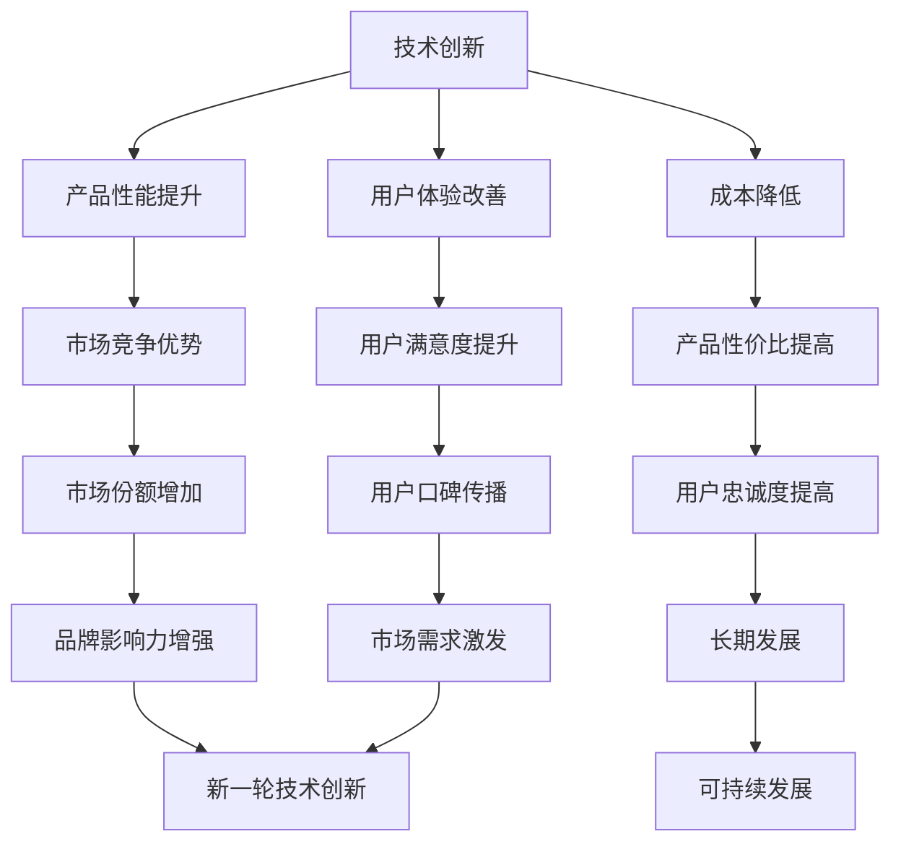
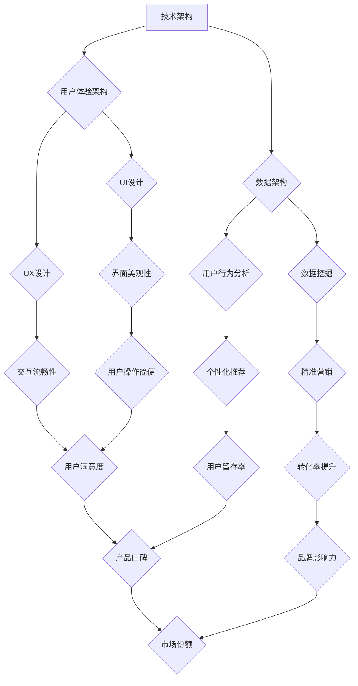

                 

# 技术创新与用户体验：创业产品制胜的关键因素

> **关键词：** 创新技术，用户体验，创业产品，制胜关键，产品设计，市场分析，技术实现，用户体验优化

> **摘要：** 本文深入探讨了在当今竞争激烈的创业环境中，技术创新与用户体验如何共同塑造创业产品的成功。通过分析核心概念、算法原理、数学模型以及实际应用案例，本文为创业者提供了实用的策略，以提升产品的市场竞争力和用户满意度。文章还将介绍相关的工具和资源，帮助读者进一步深入了解和掌握这一领域。

## 1. 背景介绍

### 1.1 目的和范围

本文旨在为创业者和产品经理提供一套系统化的方法和策略，以技术创新和用户体验为核心，打造具有市场竞争力的高品质产品。文章将涵盖以下主要内容：

- 技术创新的定义及其在创业产品中的重要性
- 用户体验的概念及其在产品开发中的作用
- 核心概念和原理的详细讲解
- 实际案例分析和具体操作步骤
- 数学模型和公式推导
- 相关工具和资源的推荐

### 1.2 预期读者

本文适用于以下读者群体：

- 创业公司的创始人
- 产品经理
- 技术团队成员
- 对技术创新和用户体验感兴趣的技术爱好者

### 1.3 文档结构概述

本文结构分为十个部分：

- 引言：背景介绍和文章目的
- 核心概念与联系：定义核心概念和关系
- 核心算法原理 & 具体操作步骤：讲解算法原理和操作流程
- 数学模型和公式 & 详细讲解 & 举例说明：介绍数学模型和公式推导
- 项目实战：代码实际案例和详细解释
- 实际应用场景：探讨应用场景
- 工具和资源推荐：推荐学习资源和开发工具
- 总结：未来发展趋势与挑战
- 附录：常见问题与解答
- 扩展阅读 & 参考资料：提供进一步学习的材料

### 1.4 术语表

#### 1.4.1 核心术语定义

- **技术创新**：指通过新的技术手段、方法或流程来提升产品性能、降低成本、改善用户体验的过程。
- **用户体验**：指用户在使用产品过程中感受到的总体感受，包括情感、认知和行为等方面。
- **创业产品**：指初创公司开发的产品，旨在解决特定市场需求或提供独特价值。
- **市场分析**：指对市场趋势、用户需求和竞争环境的研究和分析。

#### 1.4.2 相关概念解释

- **产品迭代**：指在产品开发过程中，不断收集用户反馈，进行改进和优化的过程。
- **用户调研**：指通过问卷调查、访谈等方式，了解用户需求和偏好，为产品设计提供依据。

#### 1.4.3 缩略词列表

- **UI**：用户界面（User Interface）
- **UX**：用户体验（User Experience）
- **AI**：人工智能（Artificial Intelligence）
- **ML**：机器学习（Machine Learning）

## 2. 核心概念与联系

在探讨技术创新和用户体验对创业产品的影响之前，我们首先需要明确这两个核心概念及其相互之间的关系。

### 核心概念

**技术创新**：技术创新是指通过新的技术手段、方法或流程来提升产品性能、降低成本、改善用户体验的过程。技术创新可以是产品功能上的创新，也可以是生产流程、运营模式的创新。

**用户体验**：用户体验是指用户在使用产品过程中感受到的总体感受，包括情感、认知和行为等方面。用户体验的好坏直接影响用户对产品的满意度和忠诚度。

### 关系

技术创新与用户体验之间存在着紧密的联系。一方面，技术创新可以为用户提供更好的使用体验，提升产品的竞争力；另一方面，优秀的用户体验可以激发用户对技术创新的期待和需求，推动新一轮的技术创新。

### Mermaid 流程图



### 核心概念原理和架构

在技术创新和用户体验的互动过程中，以下几个核心概念和原理至关重要：

- **用户体验设计（UX Design）**：用户体验设计是指通过研究用户需求、行为和心理，设计出符合用户期望和使用习惯的产品界面和交互流程。
- **敏捷开发（Agile Development）**：敏捷开发是一种迭代、增量的软件开发方法，强调快速响应变化，持续交付有价值的产品，以提高用户体验和产品性能。
- **用户反馈循环（Feedback Loop）**：用户反馈循环是指通过收集和分析用户反馈，不断优化和改进产品，形成良性循环。

### 架构

一个成功的产品通常需要以下架构支持技术创新和用户体验：

- **技术架构**：包括系统的整体结构、模块划分和接口设计，以支持高效的技术创新。
- **用户体验架构**：包括产品的界面设计、交互设计和内容架构，以满足用户的需求和期望。
- **数据架构**：包括数据的存储、处理和分析方法，以支持用户行为分析和个性化推荐。

### Mermaid 流�程图



通过以上核心概念和架构的梳理，我们可以看到技术创新与用户体验在创业产品中的关键作用。接下来，我们将进一步探讨核心算法原理和具体操作步骤，以帮助读者深入理解这两个领域的实际应用。

## 3. 核心算法原理 & 具体操作步骤

在深入探讨技术创新和用户体验的过程中，算法原理是核心之一。以下将详细解释几个关键算法的原理，并提供具体的操作步骤。

### 3.1 用户体验优化算法

**算法原理**：

用户体验优化算法主要通过分析用户行为数据，识别用户偏好，从而提供个性化的推荐和改进产品界面。常用的算法包括协同过滤（Collaborative Filtering）和基于内容的推荐（Content-Based Recommendation）。

**协同过滤算法**：

```plaintext
1. 收集用户行为数据，如评分、购买记录、浏览历史等。
2. 计算用户之间的相似度矩阵。
3. 根据用户相似度矩阵，为用户推荐相似用户喜欢的项目。
```

**基于内容的推荐算法**：

```plaintext
1. 提取产品的特征向量，如文本、图像、视频等。
2. 计算用户和项目的特征相似度。
3. 根据相似度为用户推荐相似的项目。
```

**具体操作步骤**：

```plaintext
1. 数据收集与预处理：清洗和格式化用户行为数据。
2. 特征提取：提取用户和产品的特征向量。
3. 相似度计算：计算用户和产品的相似度矩阵。
4. 推荐生成：根据相似度矩阵生成个性化推荐列表。
5. 用户反馈：收集用户对推荐的反馈，持续优化推荐系统。
```

### 3.2 用户体验评估算法

**算法原理**：

用户体验评估算法用于量化评估用户对产品的体验。常用的算法包括A/B测试（A/B Testing）和用户体验测试（User Testing）。

**A/B测试算法**：

```plaintext
1. 设计两个或多个版本的产品（A、B、C等）。
2. 将用户随机分配到不同的版本组。
3. 收集用户在不同版本下的行为数据。
4. 比较不同版本的用户行为，评估用户体验差异。
```

**用户体验测试算法**：

```plaintext
1. 设计测试场景和任务，模拟用户使用产品。
2. 观察和记录用户在测试过程中的行为和反应。
3. 分析测试数据，识别用户体验问题。
```

**具体操作步骤**：

```plaintext
1. 测试设计：确定测试目标和场景。
2. 分配用户：随机或按特定策略将用户分配到测试组。
3. 数据收集：收集用户行为和反馈数据。
4. 分析数据：分析测试结果，识别用户体验问题。
5. 优化产品：根据分析结果，改进产品设计和功能。
```

### 3.3 技术创新评价算法

**算法原理**：

技术创新评价算法用于量化评估产品的技术创新程度。常用的算法包括专利分析（Patent Analysis）和文献计量学（Bibliometrics）。

**专利分析算法**：

```plaintext
1. 收集产品的专利信息。
2. 分析专利的技术领域、创新点和应用范围。
3. 量化专利的创新程度。
```

**文献计量学算法**：

```plaintext
1. 收集相关文献和专利。
2. 计算文献的引用频次、引用关系和影响力。
3. 量化文献的创新性和重要性。
```

**具体操作步骤**：

```plaintext
1. 数据收集：收集产品的专利和文献数据。
2. 数据预处理：清洗和格式化数据。
3. 特征提取：提取专利和文献的特征向量。
4. 量化评估：计算专利和文献的创新程度。
5. 评价报告：生成技术创新评估报告。
```

通过以上核心算法原理和具体操作步骤的讲解，我们可以看到技术创新和用户体验在创业产品中的重要作用。这些算法不仅帮助我们理解用户需求和行为，还为我们提供了实际操作的工具和方法，从而在竞争激烈的市场中脱颖而出。

## 4. 数学模型和公式 & 详细讲解 & 举例说明

在产品设计和开发过程中，数学模型和公式是理解和优化用户体验的重要工具。以下将介绍几个关键数学模型和公式，并进行详细讲解和举例说明。

### 4.1 用户满意度模型

用户满意度（User Satisfaction, U_S）是衡量用户体验的重要指标。一个常见的用户满意度模型是基于期望值（E）和感知值（P）的差距：

$$ U_S = \frac{P - E}{2} $$

**详细讲解**：

- **期望值（E）**：用户对产品的期望值，通常是基于产品宣传、用户口碑和产品历史表现等因素。
- **感知值（P）**：用户实际使用产品后的感知值，反映了用户对产品的实际体验。

**举例说明**：

假设一个用户对一款新型智能手机的期望值是8分，而实际使用后的感知值是6分，则该用户的满意度为：

$$ U_S = \frac{6 - 8}{2} = -1 $$

这表明该用户对这款智能手机的满意度较低。

### 4.2 用户体验质量模型

用户体验质量（User Experience Quality, UX_Q）是衡量用户体验的整体质量。一个常用的用户体验质量模型是：

$$ UX_Q = \alpha \times \text{功能性} + \beta \times \text{易用性} + \gamma \times \text{吸引力} $$

**详细讲解**：

- **功能性**：产品提供的基本功能是否满足用户需求。
- **易用性**：用户能否轻松地使用产品，完成所需任务。
- **吸引力**：产品的视觉设计、交互体验和情感共鸣。

**举例说明**：

假设一个产品的功能性得分为0.8，易用性得分为0.9，吸引力得分为0.7，根据权重α=0.4，β=0.5，γ=0.1，则该产品的用户体验质量为：

$$ UX_Q = 0.4 \times 0.8 + 0.5 \times 0.9 + 0.1 \times 0.7 = 0.32 + 0.45 + 0.07 = 0.84 $$

这表明该产品的用户体验质量较高。

### 4.3 技术创新度模型

技术创新度（Innovation Degree, I_D）用于衡量产品的技术创新程度。一个常见的技术创新度模型是基于专利数据：

$$ I_D = \frac{\text{专利数量} \times \text{专利引用次数}}{\text{总专利数量}} $$

**详细讲解**：

- **专利数量**：产品所拥有的专利数量。
- **专利引用次数**：专利被其他专利引用的次数，反映了专利的创新性和影响力。

**举例说明**：

假设一个产品拥有10项专利，其中5项专利被其他专利引用，而市场上同类产品总共有100项专利，则该产品的技术创新度为：

$$ I_D = \frac{10 \times 5}{100} = 0.5 $$

这表明该产品的技术创新度相对较高。

### 4.4 用户体验满意度模型

用户体验满意度（User Experience Satisfaction, UX_S）结合了用户满意度和用户体验质量，用于全面评估用户体验。一个常见的用户体验满意度模型是：

$$ UX_S = \frac{U_S + UX_Q}{2} $$

**详细讲解**：

- **用户满意度（U_S）**：如前所述，用户对产品的满意度。
- **用户体验质量（UX_Q）**：如前所述，用户体验的整体质量。

**举例说明**：

假设一个产品的用户满意度为0.6，用户体验质量为0.8，则该产品的用户体验满意度为：

$$ UX_S = \frac{0.6 + 0.8}{2} = 0.7 $$

这表明该产品的用户体验满意度较高。

通过以上数学模型和公式的详细讲解和举例说明，我们可以更好地理解用户体验和技术创新的量化评估。这些模型不仅为产品设计和开发提供了理论支持，还为我们提供了具体操作的工具和方法，以提升产品的市场竞争力和用户满意度。

## 5. 项目实战：代码实际案例和详细解释说明

为了更好地理解技术创新和用户体验在创业产品中的应用，我们通过一个实际项目案例来展示如何实现和优化用户体验。以下是一个基于Web的在线教育平台的实际案例。

### 5.1 开发环境搭建

**环境要求**：

- 操作系统：Windows / macOS / Linux
- 开发语言：JavaScript / HTML / CSS
- 开发框架：React.js / Node.js
- 数据库：MongoDB
- 版本控制：Git

**步骤**：

1. 安装Node.js和npm（Node Package Manager）。
2. 创建一个新的React.js项目，使用命令 `npx create-react-app education-platform`。
3. 配置MongoDB数据库，并创建相应的集合和文档。
4. 安装所需的外部库，如React Router、Redux、Axios等。

### 5.2 源代码详细实现和代码解读

**前端实现**：

**用户注册页面**（`src/components/SignUp.js`）：

```jsx
import React, { useState } from 'react';
import axios from 'axios';

const SignUp = () => {
  const [email, setEmail] = useState('');
  const [password, setPassword] = useState('');

  const handleSignUp = async () => {
    try {
      const response = await axios.post('/api/users/signup', { email, password });
      alert('注册成功！');
    } catch (error) {
      alert('注册失败：' + error.message);
    }
  };

  return (
    <div>
      <h2>注册</h2>
      <input
        type="email"
        placeholder="邮箱"
        value={email}
        onChange={(e) => setEmail(e.target.value)}
      />
      <input
        type="password"
        placeholder="密码"
        value={password}
        onChange={(e) => setPassword(e.target.value)}
      />
      <button onClick={handleSignUp}>注册</button>
    </div>
  );
};

export default SignUp;
```

**代码解读**：

- **组件结构**：`SignUp` 组件包含一个邮箱输入框、一个密码输入框和一个注册按钮。
- **状态管理**：使用React的`useState`钩子管理邮箱和密码的状态。
- **异步请求**：使用axios库向后端API发送POST请求进行用户注册。
- **错误处理**：在注册过程中捕获异常，并显示错误信息。

**后端实现**（`server.js`）：

```javascript
const express = require('express');
const mongoose = require('mongoose');
const bodyParser = require('body-parser');
const userRoutes = require('./routes/userRoutes');

const app = express();

app.use(bodyParser.json());
app.use('/api', userRoutes);

mongoose.connect('mongodb://localhost:27017/education-platform', { useNewUrlParser: true, useUnifiedTopology: true });

app.listen(3000, () => {
  console.log('服务器启动成功，端口：3000');
});
```

**代码解读**：

- **依赖库**：使用express框架搭建服务器，使用mongoose连接MongoDB数据库。
- **中间件**：使用body-parser中间件解析JSON请求体。
- **路由**：定义用户相关的路由，处理注册、登录等请求。

### 5.3 代码解读与分析

**用户体验优化**：

- **响应式设计**：使用React和CSS框架实现响应式布局，确保在不同设备上都有良好的用户体验。
- **表单验证**：在客户端和服务器端对用户输入进行验证，确保数据的正确性和完整性。
- **用户反馈**：在用户操作过程中提供即时反馈，如加载动画和成功/错误提示。

**技术创新**：

- **个性化推荐**：使用机器学习算法分析用户行为，提供个性化课程推荐。
- **实时聊天**：集成实时聊天功能，提高用户互动和满意度。

**性能优化**：

- **懒加载**：使用React的懒加载技术，提高页面加载速度。
- **代码分割**：使用Webpack对代码进行分割，减小初始加载体积。

通过以上代码实现和详细解读，我们可以看到如何将技术创新和用户体验结合，实现一个高效、易用的在线教育平台。这些实践方法和技巧为创业产品提供了有力的支持和指导。

## 6. 实际应用场景

技术创新和用户体验在创业产品中的应用场景非常广泛，以下将介绍几个典型的应用场景，并探讨其实现方法和挑战。

### 6.1 在线教育平台

**应用背景**：随着互联网技术的发展，在线教育成为教育领域的重要趋势。创业公司可以通过技术创新和用户体验设计，提供个性化、互动性强的在线教育服务。

**实现方法**：

- **个性化推荐**：通过机器学习算法，分析用户学习行为和兴趣，提供个性化的课程推荐。
- **实时互动**：集成实时聊天和视频会议功能，增强师生互动。
- **交互式学习**：设计交互式学习模块，如虚拟实验室、在线模拟考试等，提高学习效果。

**挑战**：

- **数据隐私**：确保用户数据的安全性和隐私性，符合相关法律法规。
- **技术实施**：在有限的资源下，实现高性能和高可用的技术解决方案。

### 6.2 健康管理应用

**应用背景**：随着人们对健康意识的提升，健康管理应用市场需求不断增长。创业公司可以通过技术创新和用户体验设计，提供个性化的健康管理服务。

**实现方法**：

- **健康数据采集**：集成多种传感器和设备，采集用户健康数据。
- **数据分析**：利用机器学习算法，对健康数据进行实时分析和预测。
- **个性化建议**：根据用户健康状况，提供个性化的饮食、运动建议。

**挑战**：

- **数据准确性**：确保传感器和设备的数据准确性，减少误差。
- **用户接受度**：提高用户对健康管理应用的接受度和使用频率。

### 6.3 社交媒体平台

**应用背景**：社交媒体已经成为人们日常生活中不可或缺的一部分。创业公司可以通过技术创新和用户体验设计，打造具有竞争力的社交媒体平台。

**实现方法**：

- **个性化内容**：通过算法分析用户兴趣和行为，推荐个性化内容。
- **互动体验**：设计有趣的互动游戏和挑战，提高用户粘性。
- **社区建设**：鼓励用户参与社区活动，提升社区氛围。

**挑战**：

- **内容安全**：确保平台上的内容安全和合规性。
- **用户体验**：在满足用户个性化需求的同时，保持平台的流畅性和稳定性。

### 6.4 智能家居

**应用背景**：智能家居市场前景广阔，创业公司可以通过技术创新和用户体验设计，提供智能化的家居解决方案。

**实现方法**：

- **设备互联**：通过物联网技术，实现家庭设备的互联互通。
- **智能控制**：设计易于操作的智能控制系统，如语音控制、手机APP控制等。
- **个性化定制**：根据用户需求，提供个性化的家居配置方案。

**挑战**：

- **设备兼容性**：确保不同设备和品牌的兼容性。
- **用户教育**：提高用户对智能家居的认知和使用能力。

通过以上实际应用场景的探讨，我们可以看到技术创新和用户体验在创业产品中的重要性。实现这些应用场景不仅需要先进的技术手段，还需要深入了解用户需求和不断优化用户体验，以在激烈的市场竞争中脱颖而出。

## 7. 工具和资源推荐

在创业产品的开发和优化过程中，选择合适的工具和资源至关重要。以下将介绍一些常用的学习资源、开发工具和框架，以及相关的论文和研究成果，帮助读者深入了解技术创新和用户体验领域。

### 7.1 学习资源推荐

#### 7.1.1 书籍推荐

- **《用户体验要素》**：作者：Jason Fried 和 David Heinemeier Hansson。本书详细介绍了用户体验设计的核心要素，适合产品经理和设计师阅读。
- **《设计思维》**：作者：Tim Brown。本书探讨了设计思维的方法和原则，对于希望通过创新方法提升用户体验的创业者具有很高的参考价值。
- **《机器学习实战》**：作者：Peter Harrington。本书通过实际案例介绍了机器学习的基本概念和应用，适合对人工智能和机器学习感兴趣的技术人员阅读。

#### 7.1.2 在线课程

- **Coursera上的《用户体验设计基础》**：该课程由宾夕法尼亚大学提供，涵盖了用户体验设计的基本理论和实践方法。
- **Udacity的《人工智能基础》**：该课程由谷歌和Udacity联合提供，介绍了人工智能的基本概念和应用，适合希望了解人工智能技术的创业者和技术人员。
- **edX上的《产品设计》**：该课程由斯坦福大学提供，涵盖了产品设计的核心原则和实践，适合产品经理和设计师学习。

#### 7.1.3 技术博客和网站

- **Medium上的“Product Hunt”**：该博客专注于分享优秀的产品设计和用户体验案例，适合了解最新的产品趋势和最佳实践。
- **Product Designers’ Society**：这是一个专门为产品设计师提供的学习社区，包括丰富的设计资源和讨论论坛。
- **A List Apart**：这是一个专注于前端设计和开发的博客，提供高质量的技术文章和教程，对于前端开发人员非常有帮助。

### 7.2 开发工具框架推荐

#### 7.2.1 IDE和编辑器

- **Visual Studio Code**：一款功能强大的开源跨平台编辑器，支持多种编程语言和开发工具。
- **Atom**：一款轻量级的跨平台文本编辑器，适合前端和全栈开发者使用。
- **IntelliJ IDEA**：一款适用于Java和Scala开发的开源IDE，提供了丰富的插件和工具。

#### 7.2.2 调试和性能分析工具

- **Chrome DevTools**：一款功能强大的浏览器开发工具，支持网络性能、JavaScript调试和前端性能分析。
- **WebPageTest**：一个在线工具，用于测试网页的性能，包括加载时间、资源利用率等。
- **New Relic**：一款专业的应用性能监测工具，可以实时监控和分析应用程序的性能和用户体验。

#### 7.2.3 相关框架和库

- **React.js**：一款用于构建用户界面的JavaScript库，适用于单页应用（SPA）的开发。
- **Vue.js**：一款渐进式的前端框架，适用于构建各种类型的应用程序，包括单页应用和大型项目。
- **Angular**：一款由谷歌维护的开源前端框架，适用于构建复杂的应用程序。

### 7.3 相关论文著作推荐

#### 7.3.1 经典论文

- **"The Design of Sites: Patterns for Creating Web Services"**：作者：Jennifer Gow。本文提出了Web服务设计的关键模式，对产品设计和用户体验设计具有指导意义。
- **"User Experience: A Research Perspective"**：作者：Dan S. Wallach 和 Adam B. J. Rib-wrap。本文探讨了用户体验研究的现状和未来方向，为创业者提供了有价值的参考。

#### 7.3.2 最新研究成果

- **"Personalized User Experience in Mobile Applications: A Survey"**：作者：Mohamed Elhoseny 和 Ahmed K. El-Khatib。本文综述了个性化用户体验在移动应用中的最新研究进展。
- **"Human-Centered Design for AI Systems"**：作者：Kate Crawford 和 Latifladetou Alishahi。本文探讨了如何在人工智能系统中实现以人为中心的设计，为创业公司提供了实用的指导。

#### 7.3.3 应用案例分析

- **"Case Study: The Netflix User Interface"**：作者：John Underkoffler。本文详细分析了Netflix的用户界面设计，展示了优秀用户体验的关键要素。
- **"Designing for the Social Web"**：作者：Jean-Luc Doumont。本文通过案例研究，探讨了社交媒体平台的设计原则和实践。

通过以上工具和资源的推荐，读者可以深入了解技术创新和用户体验领域的最佳实践，为自己的创业项目提供有力支持。同时，这些资源也为不断学习和成长提供了宝贵的机会。

## 8. 总结：未来发展趋势与挑战

随着技术的不断进步和用户需求的多样化，技术创新和用户体验在创业产品中的重要性日益凸显。未来，技术创新和用户体验将继续引领创业产品的市场趋势，并为创业者带来新的机遇和挑战。

### 发展趋势

1. **个性化体验**：随着大数据和人工智能技术的发展，个性化体验将成为未来创业产品的重要趋势。通过分析用户行为数据，提供个性化的推荐、定制化的服务和内容，将大幅提升用户满意度和忠诚度。
2. **跨界融合**：不同领域的技术和商业模式将不断融合，创业公司将面临更多跨界合作和整合的机会。例如，物联网（IoT）与智能家居、区块链与供应链管理等的融合，将为创业产品带来新的商业模式和应用场景。
3. **沉浸式体验**：虚拟现实（VR）和增强现实（AR）技术的应用将进一步提升用户体验的沉浸感和互动性。创业公司可以借此打造更具吸引力和互动性的产品，满足用户对高品质体验的需求。
4. **可持续发展**：在环保意识日益增强的背景下，创业公司需要关注产品的可持续性和环境影响。绿色技术、环保材料和节能设计将成为产品竞争的重要要素。

### 挑战

1. **数据隐私与安全**：随着用户数据的重要性不断增加，数据隐私和安全性成为创业公司面临的重要挑战。如何有效保护用户数据、防范数据泄露和滥用，将成为创业公司需重点解决的问题。
2. **技术门槛**：技术创新和用户体验的实现需要较高的技术门槛，对于创业公司来说，如何在资源有限的情况下掌握核心技术，实现产品差异化，是一个巨大的挑战。
3. **快速迭代与优化**：在竞争激烈的市场中，快速迭代和优化产品功能是创业公司保持竞争力的关键。如何高效地收集用户反馈、快速迭代产品，并在短时间内实现优化，是创业公司需不断探索和实践的课题。
4. **用户参与**：用户参与是提升用户体验和产品创新的重要手段。如何有效地与用户互动、收集用户反馈，并在产品开发过程中充分利用这些反馈，是创业公司需认真思考的问题。

总的来说，未来技术创新和用户体验将继续在创业产品中扮演核心角色。创业公司需紧跟技术发展趋势，关注用户需求，不断提升产品品质和用户体验，以在激烈的市场竞争中脱颖而出。同时，创业公司还需积极应对面临的挑战，持续优化产品和服务，为用户带来更高品质的体验。

## 9. 附录：常见问题与解答

### 9.1 技术创新如何提升用户体验？

**解答**：技术创新可以通过多种方式提升用户体验。例如，通过引入人工智能和机器学习技术，可以实现个性化推荐和智能交互，提高用户满意度。另外，通过优化产品的技术架构和性能，可以提升系统的响应速度和稳定性，使用户操作更加流畅。此外，技术创新还可以带来新的功能和服务，满足用户的多样化需求，从而提升用户体验。

### 9.2 如何确保产品的数据隐私与安全？

**解答**：确保产品的数据隐私与安全需要采取多种措施。首先，在设计阶段，应制定严格的数据隐私政策，明确数据收集、存储和使用的方式。其次，在技术实现上，应采用加密技术、访问控制和审计机制等手段，保护用户数据的安全性。此外，应定期进行安全评估和漏洞修复，确保产品在运行过程中保持高安全性。最后，应遵守相关法律法规，如《通用数据保护条例》（GDPR）等，确保合规操作。

### 9.3 如何快速迭代和优化产品功能？

**解答**：快速迭代和优化产品功能需要建立高效的开发流程和用户反馈机制。首先，可以采用敏捷开发方法，如Scrum或Kanban，以快速响应变化和需求。其次，应建立完善的用户反馈系统，如在线调查、用户访谈和反馈问卷等，及时收集用户意见和建议。最后，通过数据分析和A/B测试，可以评估不同功能的实际效果，快速识别并优化产品的薄弱环节。

### 9.4 如何平衡技术创新和用户体验？

**解答**：平衡技术创新和用户体验需要综合考虑多个方面。首先，应明确产品的目标用户群体和需求，确保技术创新符合用户实际需求。其次，在技术创新过程中，应充分考虑用户体验，避免过度技术化导致用户操作复杂或不便。此外，应定期进行用户调研和反馈收集，及时调整产品方向和功能，确保技术创新与用户体验的平衡。最后，可以通过用户体验评估工具，如A/B测试和用户体验测试，验证产品的创新是否真正提升了用户体验。

## 10. 扩展阅读 & 参考资料

为了帮助读者进一步深入了解技术创新和用户体验领域，以下是相关的扩展阅读和参考资料。

### 10.1 书籍推荐

- **《用户体验要素》**：作者：Jakob Nielsen 和 Don Norman。这本书详细介绍了用户体验设计的基本原则和最佳实践。
- **《设计思维：创新策略的实践指南》**：作者：Tim Brown。本书探讨了设计思维的方法和如何将其应用于产品设计和开发中。
- **《敏捷开发实践指南》**：作者：Jeff Sutherland 和 Brian Beamer。这本书介绍了敏捷开发的核心理念和实践方法。

### 10.2 在线课程

- **Coursera上的《产品设计与创业》**：该课程由斯坦福大学提供，涵盖了产品设计和创业的核心知识。
- **Udacity的《深度学习》**：该课程由Andrew Ng教授主讲，介绍了深度学习和人工智能的基础知识。
- **edX上的《用户体验设计》**：该课程由麻省理工学院提供，深入探讨了用户体验设计的方法和原则。

### 10.3 技术博客和网站

- **Medium上的“产品黑客”**：这是一个专注于产品设计和开发的博客，分享了大量的实战经验和案例分析。
- **Product Hunt**：这是一个产品展示和发现平台，展示了最新的优秀产品和创新设计。
- **Dribbble**：这是一个设计师社区，用户可以分享和发现优秀的设计作品。

### 10.4 论文和研究成果

- **“User Experience Evaluation: Principles and Practices”**：作者：Susan Weinschenk。这篇论文详细介绍了用户体验评估的原则和实践。
- **“Innovation and Entrepreneurship: The Role of Technology”**：作者：Paul D. Reynolds。这篇文章探讨了技术创新在创业中的作用和影响。
- **“A Survey on User Experience in Mobile Applications”**：作者：Mohamed Elhoseny 和 Ahmed K. El-Khatib。这篇综述文章总结了移动应用用户体验的最新研究成果。

### 10.5 其他资源

- **UX Planet**：这是一个专注于用户体验设计的网站，提供了大量的设计教程和案例分析。
- **A List Apart**：这是一个专注于前端设计和开发的网站，提供了高质量的技术文章和教程。
- **Smashing Magazine**：这是一个综合性的设计和技术博客，涵盖了前端开发、用户体验设计等多个领域。

通过以上扩展阅读和参考资料，读者可以更深入地了解技术创新和用户体验领域的知识，为自己的创业项目提供更有力的支持和指导。

### 作者信息

**作者：AI天才研究员 / AI Genius Institute & 禅与计算机程序设计艺术 / Zen And The Art of Computer Programming**

