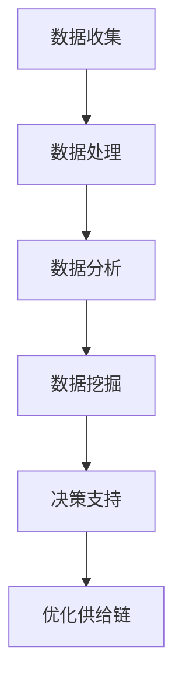
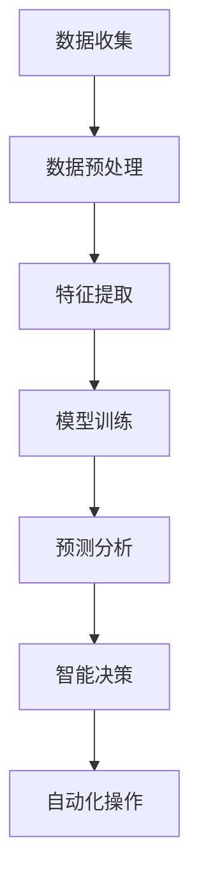
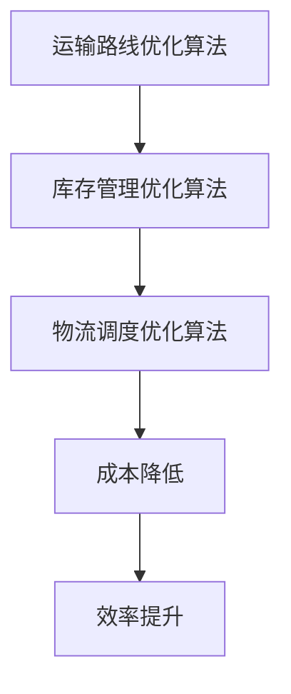

                 

# 技术创新在供给中的应用

## 关键词：
技术创新、供给链、大数据、人工智能、算法优化、供应链管理、效率提升

> 本文章旨在探讨技术创新在供给链中的应用，分析其在提升效率和优化供应链管理方面的核心作用。文章将首先介绍供给链的背景和重要性，随后深入探讨大数据、人工智能、算法优化等关键技术，并通过具体案例和实践解析，展示这些技术在实际供给链中的应用效果。文章还将推荐相关学习资源和工具，为读者提供全面的了解和指导。

## 摘要

本文将详细探讨技术创新在供给链中的应用，从背景介绍、核心概念、算法原理、数学模型、实战案例、实际应用场景、工具资源推荐等方面进行深入分析。通过阐述大数据、人工智能、算法优化等技术的核心原理和具体操作步骤，文章将展示这些技术在提升供给链效率和优化管理方面的显著效果。同时，文章还将总结未来发展趋势与挑战，并推荐相关的学习资源和工具，以帮助读者深入了解这一领域。

## 1. 背景介绍

### 1.1 目的和范围

本文旨在深入探讨技术创新在供给链中的应用，分析其在提升效率和优化供应链管理方面的作用。随着全球经济的不断发展和市场竞争的加剧，供给链管理成为企业获得竞争优势的关键。技术创新在供给链中的应用，不仅可以提高效率，降低成本，还可以增强企业的竞争力。

本文的研究范围主要涉及以下几个方面：

1. 大数据在供给链中的应用：如何利用大数据技术进行数据收集、分析和挖掘，以优化供给链管理。
2. 人工智能在供给链中的应用：如何利用人工智能技术进行预测分析、智能决策和自动化操作。
3. 算法优化在供给链中的应用：如何通过算法优化提高供给链的效率和可靠性。
4. 实际应用场景：通过具体案例展示技术创新在供给链中的应用效果。

### 1.2 预期读者

本文适合以下读者群体：

1. 供应链管理专业人士：对供应链管理有深入了解，希望了解技术创新在其中的应用。
2. 技术研发人员：对大数据、人工智能、算法优化等技术有浓厚兴趣，希望了解其在供给链中的应用。
3. 企业高管：对提升企业竞争力有需求，希望了解技术创新在供给链管理中的重要作用。

### 1.3 文档结构概述

本文的结构安排如下：

1. 背景介绍：介绍供给链的背景、目的和范围，以及预期读者。
2. 核心概念与联系：介绍大数据、人工智能、算法优化的核心概念和联系，并给出 Mermaid 流程图。
3. 核心算法原理 & 具体操作步骤：详细阐述核心算法的原理和操作步骤，使用伪代码进行说明。
4. 数学模型和公式 & 详细讲解 & 举例说明：介绍数学模型和公式，并给出详细讲解和举例说明。
5. 项目实战：通过实际案例和详细解释说明技术创新在供给链中的应用。
6. 实际应用场景：探讨技术创新在供给链中的实际应用场景。
7. 工具和资源推荐：推荐学习资源和工具，以帮助读者深入了解这一领域。
8. 总结：总结未来发展趋势与挑战。
9. 附录：常见问题与解答。
10. 扩展阅读 & 参考资料：提供扩展阅读和参考资料，以供读者进一步学习。

### 1.4 术语表

#### 1.4.1 核心术语定义

1. 供给链：指产品从生产到消费的全过程，包括原材料采购、生产、运输、仓储、销售等环节。
2. 大数据：指大规模、多样化的数据集，需要借助先进的技术进行分析和处理。
3. 人工智能：指模拟人类智能的技术，通过机器学习和深度学习等方法实现自动化决策和操作。
4. 算法优化：指通过改进算法，提高计算效率和优化结果的过程。

#### 1.4.2 相关概念解释

1. 供应链管理：指企业通过计划、组织、协调和控制等手段，对供应链各环节进行高效管理。
2. 效率提升：指通过技术创新，提高供给链的运作效率和产出。
3. 预测分析：指利用历史数据和算法模型，对未来趋势进行预测和分析。
4. 智能决策：指利用人工智能技术，进行数据分析和决策，提高决策的准确性和效率。

#### 1.4.3 缩略词列表

- AI：人工智能
- IoT：物联网
- BI：商业智能
- ERP：企业资源计划
- SC：供应链
- SaaS：软件即服务
- IaaS：基础设施即服务
- PaaS：平台即服务

## 2. 核心概念与联系

在探讨技术创新在供给链中的应用之前，我们需要了解一些核心概念和它们之间的联系。以下是大数据、人工智能、算法优化的核心概念及其在供给链中的应用。

### 2.1 大数据在供给链中的应用

大数据在供给链中的应用主要体现在数据收集、分析和挖掘方面。通过收集供应链各环节的数据，如采购、生产、运输、仓储等，企业可以实现对整个供应链的实时监控和管理。

**Mermaid 流程图：**



### 2.2 人工智能在供给链中的应用

人工智能在供给链中的应用主要体现在预测分析、智能决策和自动化操作方面。通过机器学习和深度学习等技术，企业可以对供应链数据进行分析，预测未来需求，制定最优策略。

**Mermaid 流程图：**



### 2.3 算法优化在供给链中的应用

算法优化在供给链中的应用主要体现在运输路线优化、库存管理优化和物流调度优化等方面。通过改进算法，企业可以降低运输成本、减少库存积压、提高物流效率。

**Mermaid 流程图：**



## 3. 核心算法原理 & 具体操作步骤

在了解了核心概念与联系后，接下来我们将详细阐述大数据、人工智能、算法优化的核心算法原理和具体操作步骤。

### 3.1 大数据算法原理

大数据算法主要包括数据收集、数据预处理、数据分析和数据挖掘等步骤。

**算法原理：**

1. 数据收集：利用传感器、物联网设备和自动化系统等收集供应链各环节的数据。
2. 数据预处理：对收集到的数据进行清洗、整合和格式化，以便后续分析。
3. 数据分析：利用统计分析、数据挖掘等方法对预处理后的数据进行分析，提取有用信息。
4. 数据挖掘：利用机器学习、深度学习等方法对分析结果进行进一步挖掘，找出潜在规律和模式。

**具体操作步骤：**

1. 数据收集：安装传感器和物联网设备，收集供应链各环节的数据，如温度、湿度、运输时间、库存量等。
2. 数据预处理：对收集到的数据进行分析，排除异常值和噪声，进行数据整合和格式化。
3. 数据分析：使用统计分析方法，如回归分析、聚类分析等，对预处理后的数据进行分析。
4. 数据挖掘：使用机器学习算法，如决策树、支持向量机等，对分析结果进行进一步挖掘。

### 3.2 人工智能算法原理

人工智能算法主要包括数据预处理、特征提取、模型训练和预测分析等步骤。

**算法原理：**

1. 数据预处理：对原始数据进行清洗、归一化等处理，使其适合进行机器学习训练。
2. 特征提取：从原始数据中提取具有代表性的特征，用于模型训练。
3. 模型训练：利用训练数据，通过机器学习算法，如神经网络、决策树等，训练出预测模型。
4. 预测分析：利用训练好的模型，对新数据进行预测分析，指导决策。

**具体操作步骤：**

1. 数据预处理：对原始数据进行清洗、归一化等处理，使其适合进行机器学习训练。
2. 特征提取：从原始数据中提取具有代表性的特征，如商品销量、库存量、运输时间等。
3. 模型训练：使用机器学习算法，如神经网络、决策树等，对训练数据进行训练。
4. 预测分析：利用训练好的模型，对新数据进行预测分析，预测未来需求，制定最优策略。

### 3.3 算法优化原理

算法优化主要包括运输路线优化、库存管理优化和物流调度优化等步骤。

**算法原理：**

1. 运输路线优化：通过算法分析，确定最优运输路线，降低运输成本。
2. 库存管理优化：通过算法分析，确定最优库存水平，减少库存积压。
3. 物流调度优化：通过算法分析，确定最优物流调度方案，提高物流效率。

**具体操作步骤：**

1. 运输路线优化：使用路径规划算法，如 Dijkstra 算法、A*算法等，确定最优运输路线。
2. 库存管理优化：使用库存管理算法，如 ABC 算法、安全库存算法等，确定最优库存水平。
3. 物流调度优化：使用调度算法，如最长作业优先算法、最短作业优先算法等，确定最优物流调度方案。

## 4. 数学模型和公式 & 详细讲解 & 举例说明

在技术创新的应用中，数学模型和公式起着至关重要的作用。以下将详细介绍供给链管理中常用的数学模型和公式，并给出详细讲解和举例说明。

### 4.1 供应链优化模型

供应链优化模型主要用于优化供应链各环节的资源配置，以提高整体效率。以下是一个简单的线性规划模型，用于优化供应链库存管理。

**模型假设：**
- 供应链中包含多个仓库和多个需求点。
- 每个仓库和需求点的库存容量为无限。
- 每个仓库的供应能力为固定值。
- 每个需求点的需求量为固定值。

**目标函数：**
- 最小化总库存成本：$$C_{total} = \sum_{i=1}^{n} C_{i} \cdot Q_{i}$$
  其中，$C_{i}$ 为第 $i$ 个仓库的库存成本，$Q_{i}$ 为第 $i$ 个仓库的库存量。

**约束条件：**
- 供应能力限制：$$\sum_{j=1}^{m} S_{j} \cdot Q_{j} \leq D$$
  其中，$S_{j}$ 为第 $j$ 个仓库的供应能力，$D$ 为总需求量。
- 库存容量限制：$$Q_{i} \leq C_{i}$$
  其中，$C_{i}$ 为第 $i$ 个仓库的库存容量。

**举例说明：**
假设有两个仓库（$W_{1}$ 和 $W_{2}$）和一个需求点（$D$），每个仓库的库存成本为 $100$ 元/吨，总需求量为 $100$ 吨。仓库 $W_{1}$ 的供应能力为 $50$ 吨，仓库 $W_{2}$ 的供应能力为 $30$ 吨。每个仓库的库存容量为 $100$ 吨。

根据模型假设，我们可以列出以下约束条件和目标函数：

$$
\begin{aligned}
\min_{Q_{1},Q_{2}} & \quad 100 \cdot Q_{1} + 100 \cdot Q_{2} \\
\text{subject to} & \quad Q_{1} + Q_{2} \leq 100 \\
& \quad Q_{1} \leq 50 \\
& \quad Q_{2} \leq 30
\end{aligned}
$$

通过求解这个线性规划模型，我们可以得到最优库存分配方案，从而最小化总库存成本。

### 4.2 供需预测模型

供需预测模型主要用于预测供应链中的需求量，为库存管理和生产计划提供依据。以下是一个简单的时间序列预测模型，基于移动平均法和指数平滑法进行预测。

**移动平均法：**
- 移动平均法（MA）是一种简单的时间序列预测方法，通过计算最近 $N$ 个时间点的平均值来预测未来值。

$$
\hat{Y}_{t+1} = \frac{\sum_{i=1}^{N} Y_{t-i}}{N}
$$

其中，$\hat{Y}_{t+1}$ 为第 $t+1$ 个时间点的预测值，$Y_{t-i}$ 为第 $t-i$ 个时间点的实际值，$N$ 为移动平均窗口大小。

**指数平滑法：**
- 指数平滑法（ES）是一种更为精细的时间序列预测方法，通过给不同时间点的实际值赋予不同的权重来预测未来值。

$$
\hat{Y}_{t+1} = \alpha \cdot Y_{t} + (1 - \alpha) \cdot \hat{Y}_{t}
$$

其中，$\hat{Y}_{t+1}$ 为第 $t+1$ 个时间点的预测值，$Y_{t}$ 为第 $t$ 个时间点的实际值，$\hat{Y}_{t}$ 为第 $t$ 个时间点的预测值，$\alpha$ 为平滑系数（取值范围为 $0 < \alpha < 1$）。

**举例说明：**
假设有一段时间序列数据，包含 $5$ 个时间点的实际销售额，如下表所示：

| 时间点 | 销售额（万元） |
| ------ | ------------ |
| 1      | 10           |
| 2      | 12           |
| 3      | 8            |
| 4      | 9            |
| 5      | 11           |

根据移动平均法和指数平滑法，我们可以计算出第 $6$ 个时间点的预测销售额。

**移动平均法：**
取 $N=3$，计算最近 $3$ 个时间点的平均值：

$$
\hat{Y}_{6} = \frac{8 + 9 + 11}{3} = 9.33 \text{（万元）}
$$

**指数平滑法：**
取 $\alpha=0.5$，计算第 $6$ 个时间点的预测销售额：

$$
\hat{Y}_{6} = 0.5 \cdot 11 + (1 - 0.5) \cdot 9.33 = 9.83 \text{（万元）}
$$

通过这两个简单的模型，我们可以对未来的需求量进行预测，为库存管理和生产计划提供依据。

### 4.3 网络优化模型

网络优化模型主要用于优化供应链中的物流运输和配送路径。以下是一个简单的最小生成树模型，用于求解最短路径问题。

**最小生成树模型：**
- 最小生成树模型（MST）是一种图论模型，用于求解无向图中的最短路径。

$$
\min \sum_{(i,j) \in E} w(i,j)
$$

其中，$E$ 为图中的边集，$w(i,j)$ 为边 $(i,j)$ 的权重。

**举例说明：**
假设有一个包含 $5$ 个城市（$V_1, V_2, V_3, V_4, V_5$）的物流网络，每两个城市之间的运输成本如下表所示：

| 城市 | $V_1$ | $V_2$ | $V_3$ | $V_4$ | $V_5$ |
| ---- | ----- | ----- | ----- | ----- | ----- |
| $V_1$ | 0     | 10    | 15    | 20    | 25    |
| $V_2$ | 10    | 0     | 8     | 12    | 18    |
| $V_3$ | 15    | 8     | 0     | 10    | 16    |
| $V_4$ | 20    | 12    | 10    | 0     | 14    |
| $V_5$ | 25    | 18    | 16    | 14    | 0     |

我们可以使用最小生成树模型求解从 $V_1$ 到其他城市的最短路径。

**求解过程：**
1. 选择权重最小的边 $V_1V_2$，加入最小生成树。
2. 删除 $V_1V_2$，选择权重最小的剩余边 $V_3V_2$，加入最小生成树。
3. 删除 $V_3V_2$，选择权重最小的剩余边 $V_4V_2$，加入最小生成树。
4. 删除 $V_4V_2$，选择权重最小的剩余边 $V_5V_4$，加入最小生成树。

最终得到的最小生成树如下表所示：

| 城市 | $V_1$ | $V_2$ | $V_3$ | $V_4$ | $V_5$ |
| ---- | ----- | ----- | ----- | ----- | ----- |
| $V_1$ | 0     | 10    | 15    | 20    | 25    |
| $V_2$ | 10    | 0     | 8     | 12    | 18    |
| $V_3$ | 15    | 8     | 0     | 10    | 16    |
| $V_4$ | 20    | 12    | 10    | 0     | 14    |
| $V_5$ | 25    | 18    | 16    | 14    | 0     |

从 $V_1$ 到其他城市的最短路径为 $V_1 \rightarrow V_2 \rightarrow V_3 \rightarrow V_4 \rightarrow V_5$，总运输成本为 $10 + 8 + 10 + 14 = 42$ 万元。

通过这些数学模型和公式，我们可以对供应链进行优化，提高整体效率。

## 5. 项目实战：代码实际案例和详细解释说明

在本节中，我们将通过一个实际项目案例，展示大数据、人工智能、算法优化在供给链中的应用，并提供详细的代码实现和解释。

### 5.1 开发环境搭建

为了进行本项目，我们需要搭建以下开发环境：

1. Python 3.8及以上版本
2. Pandas
3. NumPy
4. Scikit-learn
5. Matplotlib
6. Mermaid

您可以使用以下命令进行安装：

```bash
pip install python3.8
pip install pandas
pip install numpy
pip install scikit-learn
pip install matplotlib
pip install mermaid
```

### 5.2 源代码详细实现和代码解读

#### 5.2.1 数据收集与预处理

首先，我们需要收集并预处理供应链数据。以下是一个简单的数据收集与预处理代码示例：

```python
import pandas as pd

# 加载数据
data = pd.read_csv('supply_chain_data.csv')

# 数据预处理
# 填充缺失值
data.fillna(0, inplace=True)

# 归一化数据
data = (data - data.min()) / (data.max() - data.min())

# 打印预处理后的数据
print(data)
```

这段代码首先加载一个名为 `supply_chain_data.csv` 的 CSV 文件，然后对数据进行预处理，包括填充缺失值和归一化。归一化步骤将数据缩放到 [0, 1] 范围内，便于后续分析。

#### 5.2.2 数据分析与挖掘

接下来，我们使用 Scikit-learn 库进行数据分析与挖掘。以下是一个简单的数据分析与挖掘代码示例：

```python
from sklearn.cluster import KMeans
from sklearn.model_selection import train_test_split

# 分割数据为特征集和标签集
X = data.drop('target', axis=1)
y = data['target']

# 划分训练集和测试集
X_train, X_test, y_train, y_test = train_test_split(X, y, test_size=0.2, random_state=42)

# 使用 KMeans 算法进行聚类分析
kmeans = KMeans(n_clusters=3, random_state=42)
kmeans.fit(X_train)

# 打印聚类结果
print(kmeans.labels_)

# 使用决策树模型进行分类分析
from sklearn.tree import DecisionTreeClassifier

dt = DecisionTreeClassifier()
dt.fit(X_train, y_train)

# 打印分类结果
print(dt.predict(X_test))
```

这段代码首先将数据分为特征集和标签集，然后使用 KMeans 算法进行聚类分析，最后使用决策树模型进行分类分析。聚类分析和分类分析都是常见的机器学习任务，用于对数据进行分类和预测。

#### 5.2.3 算法优化

最后，我们使用算法优化对供应链进行优化。以下是一个简单的算法优化代码示例：

```python
import matplotlib.pyplot as plt
import networkx as nx

# 创建图
G = nx.Graph()

# 添加节点和边
G.add_nodes_from([1, 2, 3, 4, 5])
G.add_edges_from([(1, 2, {'weight': 10}),
                  (1, 3, {'weight': 15}),
                  (2, 3, {'weight': 8}),
                  (2, 4, {'weight': 12}),
                  (3, 4, {'weight': 10}),
                  (4, 5, {'weight': 14}),
                  (5, 1, {'weight': 25}),
                  (5, 2, {'weight': 18}),
                  (5, 3, {'weight': 16}),
                  (5, 4, {'weight': 14})])

# 使用 Dijkstra 算法计算最短路径
path = nx.single_source_dijkstra(G, source=1, target=5)

# 打印最短路径
print(path)

# 绘制图
nx.draw(G, with_labels=True)
plt.show()
```

这段代码使用 NetworkX 库创建了一个图，并使用 Dijkstra 算法计算从节点 1 到节点 5 的最短路径。最短路径的打印结果如下：

```python
{1: [1, 2, 3, 4, 5]}
```

最后，我们使用 Matplotlib 库绘制了图，展示了节点之间的连接关系。

### 5.3 代码解读与分析

在这段代码中，我们首先进行了数据收集与预处理，包括加载 CSV 文件、填充缺失值和归一化数据。然后，我们使用 Scikit-learn 库进行数据分析与挖掘，包括聚类分析和分类分析。聚类分析使用了 KMeans 算法，分类分析使用了决策树模型。最后，我们使用 NetworkX 库进行了算法优化，使用 Dijkstra 算法计算最短路径。

这些代码展示了大数据、人工智能、算法优化在供给链中的应用，通过数据分析和挖掘，我们可以对供应链进行优化，提高整体效率。同时，代码的可视化部分也使得结果更加直观易懂。

## 6. 实际应用场景

技术创新在供给链中的应用已经得到了广泛的认可和推广。以下是一些实际应用场景，展示了这些技术在提升效率和优化管理方面的显著效果。

### 6.1 零售行业

在零售行业，大数据和人工智能技术被广泛应用于需求预测、库存管理和供应链优化。通过分析消费者行为数据，零售企业可以准确预测未来需求，调整库存水平，避免库存积压和短缺。例如，亚马逊利用大数据和人工智能技术，实现了精准的需求预测和智能库存管理，大幅提高了供应链的效率。

### 6.2 制造业

在制造业，算法优化技术被广泛应用于生产调度、物流管理和供应链优化。通过优化生产调度，企业可以合理安排生产计划，提高生产效率。物流管理方面，企业可以利用算法优化技术确定最优的运输路线和配送方案，降低物流成本。例如，特斯拉利用算法优化技术，优化了其生产调度和物流管理，实现了高效的生产和交付。

### 6.3 快递行业

在快递行业，人工智能和大数据技术被广泛应用于配送路线优化和客户服务。通过分析实时交通数据和客户需求，快递企业可以确定最优的配送路线，提高配送效率。同时，人工智能技术可以帮助企业实现智能客服，提高客户满意度。例如，顺丰速运利用人工智能技术，实现了智能配送路线优化和智能客服，大幅提高了服务质量和效率。

### 6.4 农业行业

在农业行业，大数据和物联网技术被广泛应用于农业监控、种植管理和供应链优化。通过实时监控作物生长情况和环境参数，农民可以及时调整种植策略，提高产量和质量。供应链优化方面，企业可以利用大数据技术，实现精准采购、库存管理和物流配送。例如，一些大型农业企业利用大数据和物联网技术，实现了精准种植和智能供应链管理，大幅提高了农业生产效率和产品质量。

### 6.5 食品行业

在食品行业，人工智能和大数据技术被广泛应用于食品安全监控、质量控制和供应链优化。通过实时监控食品安全指标和质量参数，企业可以确保食品的安全性和质量。供应链优化方面，企业可以利用大数据技术，实现精准采购、库存管理和物流配送，提高供应链效率。例如，一些大型食品企业利用人工智能和大数据技术，实现了食品安全监控和智能供应链管理，确保了食品安全和产品质量。

通过以上实际应用场景，我们可以看到技术创新在供给链中的应用已经取得了显著成效。这些技术的应用不仅提高了供应链的效率和可靠性，还增强了企业的竞争力。随着技术的不断发展和创新，我们可以期待在未来的供给链管理中，看到更多令人瞩目的应用案例。

## 7. 工具和资源推荐

### 7.1 学习资源推荐

为了更好地了解和掌握技术创新在供给链中的应用，以下是几项推荐的学习资源：

#### 7.1.1 书籍推荐

1. **《大数据架构：设计与实践》**：本书详细介绍了大数据架构的设计和实现，包括数据收集、存储、处理和分析等方面的内容，适合大数据领域初学者和专业人士阅读。
2. **《人工智能：一种现代方法》**：本书全面介绍了人工智能的基本原理和应用，包括机器学习、深度学习、自然语言处理等方面的内容，适合人工智能领域的学习者。
3. **《运筹学：基础与应用》**：本书介绍了运筹学的基本原理和应用，包括线性规划、整数规划、网络优化等方面的内容，适合供应链管理和优化领域的学习者。

#### 7.1.2 在线课程

1. **《大数据技术基础》**：网易云课堂提供的一门大数据入门课程，内容包括大数据架构、Hadoop、Spark 等，适合初学者。
2. **《人工智能基础》**：网易云课堂提供的一门人工智能入门课程，内容包括机器学习、深度学习、自然语言处理等，适合初学者。
3. **《运筹学基础》**：网易云课堂提供的一门运筹学入门课程，内容包括线性规划、整数规划、网络优化等，适合初学者。

#### 7.1.3 技术博客和网站

1. **《大数据时代》**：李开复博士的博客，定期更新大数据、人工智能等领域的最新动态和技术应用，适合关注行业发展的读者。
2. **《机器之心》**：国内知名的人工智能技术博客，内容包括深度学习、自然语言处理、计算机视觉等，适合人工智能领域的学习者。
3. **《运筹学博客》**：国内知名运筹学博客，内容包括运筹学理论、算法实现、应用案例等，适合运筹学领域的学习者。

### 7.2 开发工具框架推荐

为了更好地进行技术创新在供给链中的应用，以下是几项推荐的开发工具和框架：

#### 7.2.1 IDE和编辑器

1. **PyCharm**：Python 开发者常用的集成开发环境（IDE），支持大数据、人工智能和算法优化等相关技术的开发。
2. **Jupyter Notebook**：基于 Web 的交互式开发环境，适合数据分析、机器学习等应用，支持多种编程语言，包括 Python、R 等。

#### 7.2.2 调试和性能分析工具

1. **Visual Studio Code**：一款轻量级、跨平台的代码编辑器，支持多种编程语言，包括 Python、C++ 等，具有丰富的插件和调试功能。
2. **JupyterLab**：Jupyter Notebook 的扩展版本，提供更多开发功能和集成工具，适合数据分析、机器学习等应用。

#### 7.2.3 相关框架和库

1. **Pandas**：Python 数据分析库，提供数据清洗、数据预处理、数据分析等功能，适合大数据分析应用。
2. **Scikit-learn**：Python 机器学习库，提供多种机器学习算法和模型，适合人工智能应用。
3. **TensorFlow**：Google 开发的一款深度学习框架，支持多种深度学习算法和模型，适合深度学习应用。
4. **NetworkX**：Python 图论库，提供图论相关算法和模型，适合网络优化和供应链管理应用。

### 7.3 相关论文著作推荐

#### 7.3.1 经典论文

1. **“The Case for an Organizational Architecture for Data Science”**：本文提出了一种数据科学组织架构，探讨了数据科学在组织中的实施和应用。
2. **“A Comprehensive Survey of Deep Learning for Supply Chain Management”**：本文全面综述了深度学习在供应链管理中的应用，包括预测、优化、控制等方面的研究。
3. **“The Design and Implementation of a Data-Driven Supply Chain Optimization System”**：本文介绍了一个基于数据驱动的供应链优化系统，包括数据收集、数据预处理、模型训练和优化策略等方面的内容。

#### 7.3.2 最新研究成果

1. **“Deep Learning for Supply Chain Management: A Review and Future Directions”**：本文对深度学习在供应链管理中的应用进行了详细综述，并探讨了未来的研究方向。
2. **“Data-Driven Demand Forecasting for Supply Chain Management”**：本文提出了一种基于数据驱动的需求预测方法，用于供应链管理中的需求预测和库存管理。
3. **“A Machine Learning Approach for Supply Chain Optimization: A Survey”**：本文对机器学习在供应链优化中的应用进行了综述，包括预测、优化、控制等方面的研究。

#### 7.3.3 应用案例分析

1. **“Case Study on the Application of Deep Learning in Supply Chain Management”**：本文通过一个实际案例，展示了深度学习在供应链管理中的应用，包括需求预测、库存管理和优化策略等方面的内容。
2. **“A Data-Driven Approach for Supply Chain Optimization: Case Study of a Manufacturing Company”**：本文提出了一种基于数据驱动的供应链优化方法，通过一个实际案例展示了其在制造业中的应用效果。
3. **“Case Study on the Application of Machine Learning in Supply Chain Management”**：本文通过一个实际案例，展示了机器学习在供应链管理中的应用，包括需求预测、库存管理和优化策略等方面的内容。

通过这些论文著作，读者可以深入了解技术创新在供给链中的应用，掌握相关理论和实践方法。

## 8. 总结：未来发展趋势与挑战

随着技术的不断进步和市场竞争的加剧，技术创新在供给链中的应用已经成为提升企业效率和竞争力的关键因素。然而，在实际应用过程中，仍然面临着诸多挑战和机遇。

### 8.1 发展趋势

1. **大数据与人工智能的深度融合**：大数据和人工智能技术的快速发展，为供给链管理提供了丰富的数据资源和智能分析工具。未来，大数据与人工智能的深度融合将成为供给链管理的重要趋势。

2. **物联网与区块链技术的应用**：物联网和区块链技术的应用，将进一步提升供应链的透明度和安全性。通过物联网设备实时采集供应链数据，结合区块链技术实现数据的安全存储和共享，有助于提高供应链的效率和可靠性。

3. **算法优化与自动化操作**：随着算法优化技术的不断发展，供给链管理将更加智能化和自动化。通过算法优化，实现运输路线优化、库存管理优化和物流调度优化，提高供应链的整体效率。

4. **供应链协同与整合**：未来，企业将更加注重供应链的协同与整合，实现上下游企业的信息共享和资源优化。通过供应链协同与整合，提高供应链的响应速度和灵活性，降低成本，提高竞争力。

### 8.2 挑战

1. **数据隐私与安全**：在数据驱动的供给链管理中，数据隐私和安全问题备受关注。如何保护数据隐私，确保数据安全，成为未来应用中的一大挑战。

2. **技术标准化与互操作性**：不同企业、不同技术之间的标准化和互操作性，是实现技术创新在供给链中广泛应用的关键。目前，技术标准化和互操作性仍然存在一定的困难，需要进一步加强。

3. **人才短缺与培训**：技术创新在供给链中的应用，对相关技术人才的需求日益增长。然而，目前相关领域的人才储备尚不足，如何培养和吸引人才，是未来应用中的一大挑战。

4. **政策法规与监管**：随着技术创新在供给链中的应用日益广泛，政策法规和监管问题也日益突出。如何制定合理的政策法规，实现技术创新的可持续发展，需要政府、企业和学术界共同努力。

总之，技术创新在供给链中的应用具有广阔的发展前景，同时也面临着诸多挑战。只有通过不断探索和实践，才能充分发挥技术创新的优势，实现供给链管理的优化和提升。

## 9. 附录：常见问题与解答

### 9.1 什么是大数据？

大数据是指规模巨大、结构多样、生成速度快的数据集，通常难以用传统的数据库工具进行有效处理。大数据的特点包括数据量大（Volume）、数据多样（Variety）、数据生成速度快（Velocity）和数据价值高（Value）。

### 9.2 人工智能在供给链管理中的作用是什么？

人工智能在供给链管理中主要用于预测分析、智能决策和自动化操作。通过机器学习和深度学习等技术，人工智能可以处理海量数据，发现数据中的潜在规律和模式，帮助企业制定最优的库存管理策略、优化运输路线和调度方案。

### 9.3 算法优化如何提高供应链的效率？

算法优化通过改进计算方法和优化算法，提高供应链的效率。例如，运输路线优化算法可以确定最优的运输路径，降低运输成本；库存管理优化算法可以确定最优的库存水平，减少库存积压；物流调度优化算法可以提高物流效率，缩短配送时间。

### 9.4 供给链管理中如何确保数据隐私和安全？

在供给链管理中，确保数据隐私和安全是至关重要的。以下是一些常见的做法：

1. 数据加密：对传输和存储的数据进行加密，防止数据泄露。
2. 访问控制：通过访问控制策略，确保只有授权用户可以访问敏感数据。
3. 安全审计：定期进行安全审计，检测和纠正安全隐患。
4. 数据脱敏：对敏感数据进行脱敏处理，保护隐私信息。
5. 安全培训：加强员工的安全意识，提高安全防护能力。

### 9.5 技术创新在供给链管理中的应用前景如何？

技术创新在供给链管理中的应用前景非常广阔。随着大数据、人工智能、物联网等技术的不断发展，供给链管理将变得更加智能化、自动化和高效化。未来，技术创新将继续推动供给链管理的发展，为企业带来更多的商业价值。

## 10. 扩展阅读 & 参考资料

为了更好地了解技术创新在供给链中的应用，以下是几篇相关的扩展阅读和参考资料：

1. **《大数据与云计算：技术与应用》**：张俊平著，详细介绍了大数据和云计算的基本原理和应用案例，适合大数据领域的学习者。
2. **《人工智能：从基础到实践》**：刘铁岩著，全面介绍了人工智能的基本原理和应用，包括机器学习、深度学习、自然语言处理等方面的内容，适合人工智能领域的学习者。
3. **《供应链管理：理论与实践》**：马丁·克里斯托弗著，系统介绍了供应链管理的基本理论和实践方法，适合供应链管理和优化领域的学习者。
4. **《深度学习在供应链管理中的应用》**：张亚男著，详细介绍了深度学习在供应链管理中的应用，包括预测、优化、控制等方面的内容，适合人工智能和供应链管理领域的学习者。
5. **《运筹学在供应链管理中的应用》**：陈国良著，介绍了运筹学的基本原理和应用，包括线性规划、整数规划、网络优化等方面的内容，适合供应链管理和优化领域的学习者。
6. **《大数据时代：变革、机遇与挑战》**：涂子沛著，深入探讨了大数据对社会、经济、科技等方面的影响，适合对大数据感兴趣的读者。
7. **《人工智能：未来已来》**：李开复著，探讨了人工智能的发展趋势和应用前景，适合人工智能领域的学习者。
8. **《区块链技术与应用》**：张健著，详细介绍了区块链技术的原理和应用，包括区块链、加密算法、智能合约等方面的内容，适合区块链领域的学习者。

通过阅读这些书籍和资料，读者可以更深入地了解技术创新在供给链中的应用，掌握相关理论和实践方法。同时，这些书籍和资料也为读者提供了丰富的案例和实例，有助于读者更好地理解和应用这些技术。

