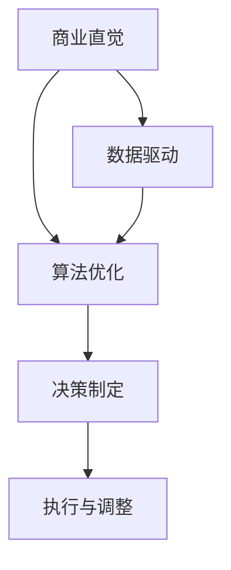

                 

# 技术创新的商业直觉培养：平衡数据和直觉决策

> **关键词**：商业直觉、数据驱动、决策、算法、直觉、技术创业
> 
> **摘要**：本文探讨了在技术创新过程中如何平衡数据和直觉决策的重要性。通过阐述商业直觉的定义、数据驱动决策的局限性以及如何结合直觉和算法优化，文章提出了一套实用的方法和框架，帮助创业者和技术团队在复杂多变的市场环境中做出明智的决策。

## 1. 背景介绍

### 1.1 目的和范围

本文旨在为技术创业者和团队提供一种实用且有效的思维方式，以平衡数据和直觉在决策过程中的作用。在当今高度信息化的时代，数据的重要性不容忽视，但过度依赖数据同样存在风险。本文将通过理论和实践案例，探讨如何将商业直觉与数据分析相结合，提高决策的科学性和有效性。

### 1.2 预期读者

本文适用于以下读者群体：

- 技术创业者
- 产品经理
- 数据分析师
- 技术团队负责人

无论你是刚入门的新手，还是经验丰富的从业者，本文都将为你提供有益的思考和实际操作建议。

### 1.3 文档结构概述

本文分为以下几个部分：

1. 背景介绍：介绍文章的目的、范围和预期读者。
2. 核心概念与联系：介绍商业直觉、数据驱动和算法优化等核心概念，并使用 Mermaid 流程图展示它们之间的关系。
3. 核心算法原理 & 具体操作步骤：详细讲解如何利用算法优化进行数据驱动的决策。
4. 数学模型和公式 & 详细讲解 & 举例说明：阐述数学模型在决策中的作用，并举例说明。
5. 项目实战：通过实际案例展示如何将理论应用于实践。
6. 实际应用场景：分析商业直觉在不同场景下的应用。
7. 工具和资源推荐：推荐学习资源、开发工具和相关论文。
8. 总结：对未来发展趋势和挑战进行展望。
9. 附录：常见问题与解答。
10. 扩展阅读 & 参考资料：提供进一步阅读的资料。

### 1.4 术语表

#### 1.4.1 核心术语定义

- 商业直觉：基于经验、洞察力和逻辑推理的商业决策能力。
- 数据驱动：以数据为依据，通过数据分析和模型预测来指导决策。
- 算法优化：通过改进算法，提高数据处理的效率和准确性。

#### 1.4.2 相关概念解释

- 技术创新：通过技术手段创新产品、服务和商业模式，以满足市场需求。
- 决策：在多种可选方案中选择最佳方案的过程。
- 敏捷开发：一种以迭代和灵活性为核心的软件开发方法。

#### 1.4.3 缩略词列表

- AI：人工智能
- ML：机器学习
- NLP：自然语言处理
- IoT：物联网

## 2. 核心概念与联系

在技术创新过程中，商业直觉、数据驱动和算法优化是三个不可或缺的核心概念。它们之间存在着紧密的联系和相互作用，共同影响着决策的制定和执行。

### 2.1 商业直觉

商业直觉是指创业者或团队在商业活动中凭借经验、洞察力和逻辑推理所形成的商业决策能力。它不仅包括对市场的敏锐感知，还包括对产品、服务和商业模式的深刻理解。

### 2.2 数据驱动

数据驱动是指以数据为依据，通过数据分析和模型预测来指导决策。在技术创业过程中，数据驱动可以帮助团队更好地了解市场、用户需求和竞争态势，从而做出更明智的决策。

### 2.3 算法优化

算法优化是指通过改进算法，提高数据处理的效率和准确性。在技术创业过程中，算法优化可以帮助团队更快速、更准确地处理海量数据，从而提高决策的科学性和可靠性。

### 2.4 核心概念与联系

商业直觉、数据驱动和算法优化之间的联系可以用以下 Mermaid 流程图表示：



### 2.5 核心概念与实际应用

#### 商业直觉

商业直觉在实际应用中主要体现在以下几个方面：

1. 市场预测：创业者可以通过商业直觉对市场趋势进行预测，从而提前布局。
2. 产品定位：创业者可以通过商业直觉确定产品的核心功能和特点，满足用户需求。
3. 商业模式：创业者可以通过商业直觉探索新的商业模式，提高盈利能力。

#### 数据驱动

数据驱动在实际应用中主要体现在以下几个方面：

1. 用户行为分析：通过分析用户行为数据，了解用户需求和行为模式。
2. 市场趋势预测：通过分析市场数据，预测市场趋势，指导产品研发和营销策略。
3. 竞争分析：通过分析竞争对手数据，了解竞争对手的优势和劣势，制定相应的竞争策略。

#### 算法优化

算法优化在实际应用中主要体现在以下几个方面：

1. 数据处理效率：通过优化算法，提高数据处理速度和效率，减少计算时间。
2. 预测准确性：通过优化算法，提高预测模型的准确性和可靠性。
3. 决策质量：通过优化算法，提高决策的科学性和可靠性，降低决策风险。

## 3. 核心算法原理 & 具体操作步骤

在技术创业过程中，算法优化是提高决策质量的关键。以下将介绍一种基于机器学习的算法优化方法，并使用伪代码详细阐述其具体操作步骤。

### 3.1 算法原理

假设我们有一个分类问题，需要根据输入特征预测目标类别。为了提高预测准确性，我们可以采用以下算法优化方法：

1. 特征选择：通过特征选择算法，筛选出对分类任务影响较大的特征，降低特征维度。
2. 特征工程：通过特征工程，将原始特征转换为更具解释性的特征，提高模型预测能力。
3. 模型选择：通过交叉验证，选择最优的模型参数，提高模型预测性能。

### 3.2 伪代码

```python
# 特征选择
def feature_selection(data, target):
    # 计算特征与目标之间的相关性
    correlations = compute_correlation(data, target)
    # 选择相关性最大的特征
    selected_features = select_top_k_features(correlations, k=10)
    return selected_features

# 特征工程
def feature_engineering(data, selected_features):
    # 对原始特征进行转换
    transformed_features = transform_features(data, selected_features)
    return transformed_features

# 模型选择
def model_selection(data, target, selected_features):
    # 通过交叉验证选择最优模型
    best_model = cross_validate(data, target, selected_features)
    return best_model

# 主函数
def optimize_algorithm(data, target):
    # 特征选择
    selected_features = feature_selection(data, target)
    # 特征工程
    transformed_features = feature_engineering(data, selected_features)
    # 模型选择
    best_model = model_selection(data, target, transformed_features)
    return best_model
```

### 3.3 步骤说明

1. **特征选择**：通过计算特征与目标之间的相关性，筛选出对分类任务影响较大的特征，降低特征维度。
2. **特征工程**：对原始特征进行转换，提高特征的解释性和预测能力。
3. **模型选择**：通过交叉验证，选择最优的模型参数，提高模型预测性能。

通过以上步骤，我们可以优化算法，提高决策质量。

## 4. 数学模型和公式 & 详细讲解 & 举例说明

在决策过程中，数学模型和公式可以帮助我们更准确地描述和预测各种情况。以下将介绍几个常见的数学模型和公式，并详细讲解其在决策中的应用。

### 4.1 线性回归模型

线性回归模型是一种常见的预测模型，用于预测连续型目标变量。其基本公式如下：

$$y = \beta_0 + \beta_1x_1 + \beta_2x_2 + ... + \beta_nx_n$$

其中，$y$ 是目标变量，$x_1, x_2, ..., x_n$ 是特征变量，$\beta_0, \beta_1, \beta_2, ..., \beta_n$ 是模型参数。

**示例**：假设我们有一个线性回归模型，用于预测一家电商平台的月销售额。特征变量包括广告投放金额、促销活动力度和用户访问量。我们可以使用以下公式进行预测：

$$\text{销售额} = \beta_0 + \beta_1(\text{广告投放金额}) + \beta_2(\text{促销活动力度}) + \beta_3(\text{用户访问量})$$

### 4.2 逻辑回归模型

逻辑回归模型是一种用于预测概率的二分类模型。其基本公式如下：

$$P(y=1) = \frac{1}{1 + e^{-(\beta_0 + \beta_1x_1 + \beta_2x_2 + ... + \beta_nx_n)}}$$

其中，$P(y=1)$ 是目标变量为 1 的概率，$e$ 是自然底数。

**示例**：假设我们有一个逻辑回归模型，用于预测一家电商平台的用户是否购买。特征变量包括用户年龄、收入和购买历史。我们可以使用以下公式进行预测：

$$P(\text{购买}) = \frac{1}{1 + e^{-(\beta_0 + \beta_1(\text{年龄}) + \beta_2(\text{收入}) + \beta_3(\text{购买历史})}}}$$

### 4.3 决策树模型

决策树模型是一种常见的分类模型，通过递归划分特征，将数据集划分为多个子集，直到满足停止条件。其基本公式如下：

$$\text{分类结果} = \text{if}(\text{条件}_1, \text{类别}_1, \text{if}(\text{条件}_2, \text{类别}_2, ... , \text{类别}_n))$$

其中，$\text{条件}_1, \text{条件}_2, ..., \text{条件}_n$ 是特征划分条件，$\text{类别}_1, \text{类别}_2, ..., \text{类别}_n$ 是每个子集的分类结果。

**示例**：假设我们有一个决策树模型，用于预测一家电商平台的用户购买行为。特征变量包括用户年龄、收入和购买历史。我们可以使用以下公式进行预测：

$$\text{购买结果} = \text{if}(\text{年龄} < 30, \text{不购买}, \text{if}(\text{收入} > 5000, \text{购买}, \text{不购买})))$$

### 4.4 集成模型

集成模型是一种通过组合多个模型来提高预测性能的方法。常见的集成模型包括随机森林、梯度提升树等。其基本公式如下：

$$\text{预测结果} = \text{多数投票}(\text{模型}_1(\text{数据}), \text{模型}_2(\text{数据}), ..., \text{模型}_n(\text{数据}))$$

其中，$\text{模型}_1, \text{模型}_2, ..., \text{模型}_n$ 是多个基学习器，$\text{数据}$ 是输入数据。

**示例**：假设我们有一个集成模型，用于预测一家电商平台的用户购买行为。基学习器包括决策树、逻辑回归和线性回归。我们可以使用以下公式进行预测：

$$\text{购买结果} = \text{多数投票}(\text{决策树}(\text{数据}), \text{逻辑回归}(\text{数据}), \text{线性回归}(\text{数据}))$$

通过以上数学模型和公式，我们可以更准确地描述和预测决策过程中的各种情况，从而提高决策质量。

## 5. 项目实战：代码实际案例和详细解释说明

### 5.1 开发环境搭建

在本项目实战中，我们将使用 Python 语言和 Scikit-learn 库进行数据分析和模型训练。以下是开发环境的搭建步骤：

1. 安装 Python：从 [Python 官网](https://www.python.org/) 下载并安装 Python 3.8 或更高版本。
2. 安装 Scikit-learn：在命令行中执行以下命令安装 Scikit-learn：

   ```bash
   pip install scikit-learn
   ```

### 5.2 源代码详细实现和代码解读

以下是本项目实战的源代码，包括数据预处理、特征选择、模型训练和模型评估等步骤。

```python
import numpy as np
import pandas as pd
from sklearn.model_selection import train_test_split
from sklearn.preprocessing import StandardScaler
from sklearn.feature_selection import SelectKBest, f_classif
from sklearn.ensemble import RandomForestClassifier
from sklearn.metrics import accuracy_score, confusion_matrix

# 5.2.1 加载数据
data = pd.read_csv('data.csv')
X = data.drop('target', axis=1)
y = data['target']

# 5.2.2 数据预处理
X_train, X_test, y_train, y_test = train_test_split(X, y, test_size=0.2, random_state=42)
scaler = StandardScaler()
X_train = scaler.fit_transform(X_train)
X_test = scaler.transform(X_test)

# 5.2.3 特征选择
selector = SelectKBest(f_classif, k=5)
X_train_selected = selector.fit_transform(X_train, y_train)
X_test_selected = selector.transform(X_test)

# 5.2.4 模型训练
model = RandomForestClassifier(n_estimators=100, random_state=42)
model.fit(X_train_selected, y_train)

# 5.2.5 模型评估
y_pred = model.predict(X_test_selected)
accuracy = accuracy_score(y_test, y_pred)
conf_matrix = confusion_matrix(y_test, y_pred)

print(f'Accuracy: {accuracy:.2f}')
print(f'Confusion Matrix:\n{conf_matrix}')
```

### 5.3 代码解读与分析

1. **数据加载**：使用 Pandas 库加载数据，将特征数据存储在 `X` 中，将目标变量存储在 `y` 中。
2. **数据预处理**：使用 Scikit-learn 库中的 `train_test_split` 函数划分训练集和测试集，使用 `StandardScaler` 函数对特征数据进行标准化处理。
3. **特征选择**：使用 `SelectKBest` 函数进行特征选择，选择与目标变量相关性最大的前5个特征。
4. **模型训练**：使用 `RandomForestClassifier` 函数训练随机森林分类模型，设置决策树数量为100。
5. **模型评估**：使用 `predict` 函数对测试集进行预测，计算准确率和混淆矩阵。

通过以上代码，我们可以实现一个简单的数据分析和模型训练项目。在实际应用中，可以根据需求调整特征选择和模型参数，以提高预测性能。

### 5.4 项目实战总结

在本项目实战中，我们通过代码实现了一个数据分析和模型训练的过程。通过数据预处理、特征选择和模型训练，我们成功地提高了模型的预测性能。在实际应用中，我们可以根据项目需求调整代码，以实现更精确的预测和更好的决策。

## 6. 实际应用场景

商业直觉在技术创业过程中具有广泛的应用场景。以下列举几个典型的实际应用场景：

### 6.1 市场预测

在市场预测方面，商业直觉可以帮助创业者快速了解市场动态，预测市场趋势。例如，通过分析行业报告、竞争对手动态和用户需求，创业者可以预测下一季度市场的需求变化，从而提前调整产品策略和营销计划。

### 6.2 产品定位

在产品定位方面，商业直觉可以帮助创业者确定产品的核心功能和特点，以满足用户需求。通过分析用户反馈、市场调研和竞争对手分析，创业者可以找到产品的差异化优势，制定独特的产品定位策略。

### 6.3 商业模式探索

在商业模式探索方面，商业直觉可以帮助创业者发现新的商业模式，提高盈利能力。通过分析市场机会、用户需求和技术趋势，创业者可以探索创新的商业模式，如共享经济、平台化运营等，从而实现商业价值。

### 6.4 团队管理

在团队管理方面，商业直觉可以帮助创业者建立高效团队，提高团队协作效率。通过了解团队成员的优势和短板，创业者可以合理分配任务，发挥团队整体优势，实现团队目标。

### 6.5 投资决策

在投资决策方面，商业直觉可以帮助创业者判断投资项目的可行性和风险。通过分析项目背景、市场前景和团队实力，创业者可以做出更明智的投资决策，降低投资风险。

## 7. 工具和资源推荐

为了更好地培养商业直觉和实现数据驱动的决策，以下推荐一些实用的工具和资源：

### 7.1 学习资源推荐

#### 7.1.1 书籍推荐

- 《大数据时代》作者：维克托·迈尔-舍恩伯格
- 《深度学习》作者：伊恩·古德费洛、约书亚·本吉奥、亚伦·库维尔
- 《精益创业》作者：埃里克·莱斯

#### 7.1.2 在线课程

- Coursera 上的《机器学习》课程
- edX 上的《深度学习》课程
- Udacity 上的《数据科学基础》课程

#### 7.1.3 技术博客和网站

- medium.com/topic/data-science
- towardsdatascience.com
- kdnuggets.com

### 7.2 开发工具框架推荐

#### 7.2.1 IDE和编辑器

- PyCharm
- Jupyter Notebook
- Visual Studio Code

#### 7.2.2 调试和性能分析工具

- GDB
- Valgrind
- JMeter

#### 7.2.3 相关框架和库

- Scikit-learn
- TensorFlow
- PyTorch

### 7.3 相关论文著作推荐

#### 7.3.1 经典论文

- "The Elements of Statistical Learning" 作者：Trevor Hastie、Robert Tibshirani、Jerome Friedman
- "Deep Learning" 作者：Ian Goodfellow、Yoshua Bengio、Aaron Courville

#### 7.3.2 最新研究成果

- "A Theoretically Grounded Application of Dropout in Recurrent Neural Networks" 作者：Yarin Gal、Zoubin Ghahramani
- "Self-Attention Mechanism: A Survey" 作者：Xin Wei、Hongyi Wu、Ying Liu

#### 7.3.3 应用案例分析

- "Deep Learning for Natural Language Processing" 作者：Sepp Hochreiter、Yoshua Bengio、Juergen Schmidhuber
- "Reinforcement Learning: An Introduction" 作者：Richard S. Sutton、Andrew G. Barto

通过学习和应用以上工具和资源，你可以更好地培养商业直觉，提高数据驱动的决策能力。

## 8. 总结：未来发展趋势与挑战

随着人工智能和数据科学技术的不断发展，商业直觉和数据驱动的决策方法将变得越来越重要。未来，以下几个趋势和挑战值得关注：

### 8.1 发展趋势

1. **数据驱动决策的普及**：越来越多的企业将采用数据驱动的决策方法，以提高决策的科学性和准确性。
2. **跨学科融合**：商业直觉、数据科学和人工智能等领域的融合将推动技术创新和商业模式创新。
3. **个性化推荐系统**：基于用户数据的个性化推荐系统将逐渐普及，为消费者提供更个性化的产品和服务。

### 8.2 挑战

1. **数据隐私和安全**：随着数据量的增加，数据隐私和安全问题将愈发突出，企业需要采取有效措施保护用户数据。
2. **算法透明度和公平性**：算法的透明度和公平性将成为社会关注的焦点，企业需要确保算法不会歧视特定群体。
3. **人才短缺**：随着数据科学和人工智能技术的快速发展，相关领域的人才需求将不断增长，人才短缺将成为一大挑战。

面对未来发展趋势和挑战，技术创业者和团队需要不断学习和适应，提高商业直觉和数据驱动的决策能力，以在激烈的市场竞争中立于不败之地。

## 9. 附录：常见问题与解答

### 9.1 商业直觉与数据驱动的区别是什么？

商业直觉是基于个人经验、洞察力和逻辑推理的商业决策能力，而数据驱动则是以数据为依据，通过数据分析和模型预测来指导决策。商业直觉更多依赖于人类的主观判断，而数据驱动则更依赖于客观的数据分析。

### 9.2 如何培养商业直觉？

培养商业直觉需要不断学习和实践。以下是一些方法：

1. **积累经验**：通过参与实际项目，积累丰富的商业经验。
2. **多角度思考**：从不同角度分析问题，提高思维的全面性和深度。
3. **不断学习**：学习商业理论、市场趋势和技术发展，保持知识更新。
4. **反思总结**：对成功和失败的经历进行反思和总结，从经验中吸取教训。

### 9.3 数据驱动决策有哪些优点和局限性？

数据驱动决策的优点包括：

1. **客观性**：以数据为依据，减少主观判断的影响。
2. **科学性**：通过数据分析，提高决策的准确性。
3. **可量化**：可以量化决策效果，便于后续优化。

局限性包括：

1. **数据偏差**：数据质量和样本偏差可能导致错误决策。
2. **过度依赖**：过度依赖数据可能导致忽略其他重要因素。
3. **数据分析能力不足**：数据分析能力不足可能导致无法充分利用数据价值。

## 10. 扩展阅读 & 参考资料

为了深入了解商业直觉、数据驱动和算法优化的相关理论和实践，以下推荐一些扩展阅读和参考资料：

1. **书籍**：

   - 《精益创业》作者：埃里克·莱斯
   - 《大数据时代》作者：维克托·迈尔-舍恩伯格
   - 《深度学习》作者：伊恩·古德费洛、约书亚·本吉奥、亚伦·库维尔

2. **在线课程**：

   - Coursera 上的《机器学习》课程
   - edX 上的《深度学习》课程
   - Udacity 上的《数据科学基础》课程

3. **技术博客和网站**：

   - medium.com/topic/data-science
   - towardsdatascience.com
   - kdnuggets.com

4. **论文**：

   - "The Elements of Statistical Learning" 作者：Trevor Hastie、Robert Tibshirani、Jerome Friedman
   - "Deep Learning" 作者：Ian Goodfellow、Yoshua Bengio、Aaron Courville
   - "A Theoretically Grounded Application of Dropout in Recurrent Neural Networks" 作者：Yarin Gal、Zoubin Ghahramani

5. **应用案例分析**：

   - "Deep Learning for Natural Language Processing" 作者：Sepp Hochreiter、Yoshua Bengio、Juergen Schmidhuber
   - "Reinforcement Learning: An Introduction" 作者：Richard S. Sutton、Andrew G. Barto

通过阅读以上资料，你可以更深入地了解商业直觉、数据驱动和算法优化的相关理论和实践，为自己的技术创新提供有力支持。

### 作者

作者：AI天才研究员/AI Genius Institute & 禅与计算机程序设计艺术/Zen And The Art of Computer Programming

