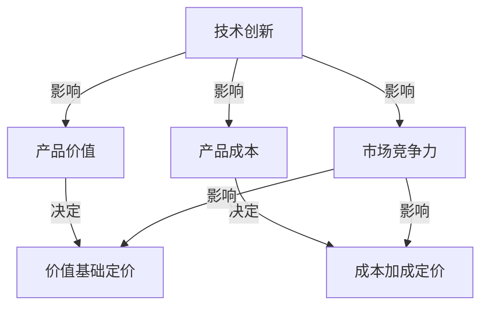
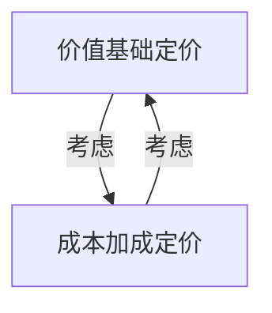

                 

# 技术创新的定价策略：价值基础定价vs成本加成

> **关键词**：技术创新、定价策略、价值基础定价、成本加成、市场竞争力、消费者行为
>
> **摘要**：本文将深入探讨技术创新在商业定价策略中的关键作用，重点比较价值基础定价和成本加成定价两种策略。通过对这两种策略的原理、应用场景、优缺点以及实际案例的详细分析，帮助读者理解如何通过合理的定价策略提升产品的市场竞争力。

## 1. 背景介绍

### 1.1 目的和范围

本文旨在为科技企业和产品经理提供定价策略的深入分析，特别是针对技术创新产品。我们将探讨两种核心定价策略——价值基础定价和成本加成定价，并比较它们在市场中的适用性和效果。

### 1.2 预期读者

预期读者为对技术创新、市场分析和商业策略感兴趣的科技从业人员，包括产品经理、市场分析师、创业者以及相关领域的学者。

### 1.3 文档结构概述

本文分为八个部分：
1. 背景介绍
2. 核心概念与联系
3. 核心算法原理 & 具体操作步骤
4. 数学模型和公式 & 详细讲解 & 举例说明
5. 项目实战：代码实际案例和详细解释说明
6. 实际应用场景
7. 工具和资源推荐
8. 总结：未来发展趋势与挑战

### 1.4 术语表

#### 1.4.1 核心术语定义

- **价值基础定价**：基于产品为消费者带来的价值和满意度来定价。
- **成本加成定价**：在产品成本基础上，加上一定的利润率来定价。

#### 1.4.2 相关概念解释

- **市场竞争力**：产品在市场中所具有的吸引消费者购买的能力。
- **消费者行为**：消费者在购买决策过程中表现出的心理和行为特征。

#### 1.4.3 缩略词列表

- **ROI**：投资回报率（Return on Investment）
- **CPC**：每点击成本（Cost Per Click）
- **CPM**：每千次展示成本（Cost Per Mille）

## 2. 核心概念与联系

在探讨技术创新产品的定价策略之前，我们需要了解几个核心概念和它们之间的关系。

### 2.1 技术创新与定价策略的关系

技术创新对产品的价值、成本和市场竞争力有着直接影响，因此也是定价策略制定的关键因素。以下是一个简化的 Mermaid 流程图，展示了技术创新与定价策略之间的联系：



### 2.2 价值基础定价与成本加成定价的关系

价值基础定价和成本加成定价是两种主要的定价策略，它们在原理和应用场景上有所不同。

- **价值基础定价**：主要基于产品为消费者带来的价值和满意度，通过市场调研、竞争分析等手段确定产品的价格。
- **成本加成定价**：主要考虑生产产品的成本，加上一定的利润率来确定价格。

这两种定价策略的关系可以用以下 Mermaid 流程图表示：



## 3. 核心算法原理 & 具体操作步骤

### 3.1 价值基础定价算法原理

价值基础定价的核心在于确定产品对消费者的价值。以下是一个简化的伪代码，用于说明价值基础定价的算法原理：

```python
# 输入：
# market调研结果 (包括竞争对手定价、消费者需求、市场趋势等)
# 生产成本

# 输出：
# 价值基础定价

def value_based_pricing(market_data, production_cost):
    # 步骤1：计算市场需求价格弹性
    price_elasticity = calculate_price_elasticity(market_data)

    # 步骤2：根据市场需求和竞争情况，确定产品溢价
    premium = determine_premium(price_elasticity)

    # 步骤3：计算价值基础定价
    value_based_price = production_cost * (1 + premium)

    return value_based_price
```

### 3.2 成本加成定价算法原理

成本加成定价的核心在于确定产品的成本和加成比例。以下是一个简化的伪代码，用于说明成本加成定价的算法原理：

```python
# 输入：
# 生产成本
# 目标利润率

# 输出：
# 成本加成定价

def cost_plus_pricing(production_cost, target_profit_margin):
    # 步骤1：计算目标利润
    target_profit = production_cost * target_profit_margin

    # 步骤2：计算成本加成定价
    cost_plus_price = production_cost + target_profit

    return cost_plus_price
```

## 4. 数学模型和公式 & 详细讲解 & 举例说明

### 4.1 价值基础定价数学模型

价值基础定价的关键在于确定市场需求函数和价格弹性。以下是一个简化的数学模型：

$$
P = P_0 + \epsilon \cdot (V - C)
$$

其中：
- \( P \) 是定价
- \( P_0 \) 是基准价格
- \( \epsilon \) 是价格弹性
- \( V \) 是消费者感知价值
- \( C \) 是生产成本

### 4.2 成本加成定价数学模型

成本加成定价的数学模型相对简单，主要涉及成本和利润率：

$$
P = C + \mu \cdot C
$$

其中：
- \( P \) 是定价
- \( C \) 是生产成本
- \( \mu \) 是利润率

### 4.3 实例分析

假设一个技术创新产品（如智能家居设备）的生产成本为 1000 元，市场需求函数为 \( V = 500 + 0.2P \)，目标利润率为 20%。

**价值基础定价**：

- 基准价格 \( P_0 = 1000 \)
- 价格弹性 \( \epsilon = 0.5 \)
- 消费者感知价值 \( V = 500 + 0.2P \)

根据数学模型：

$$
P = 1000 + 0.5 \cdot (0.2P - 1000)
$$

解得：

$$
P = 1500 元
$$

**成本加成定价**：

- 生产成本 \( C = 1000 \)
- 目标利润率 \( \mu = 0.2 \)

根据数学模型：

$$
P = 1000 + 0.2 \cdot 1000 = 1200 元
$$

## 5. 项目实战：代码实际案例和详细解释说明

### 5.1 开发环境搭建

为演示价值基础定价和成本加成定价的实际应用，我们将使用 Python 编写一个小程序。

- **Python 版本**：3.8+
- **依赖库**：numpy，matplotlib

安装依赖库：

```bash
pip install numpy matplotlib
```

### 5.2 源代码详细实现和代码解读

**源代码**：

```python
import numpy as np
import matplotlib.pyplot as plt

# 参数设置
production_cost = 1000
target_profit_margin = 0.2
price_elasticity = 0.5
base_price = 1000
consumer_value = 500 + 0.2 * price

# 价值基础定价函数
def value_based_pricing(production_cost, price_elasticity, consumer_value):
    epsilon = price_elasticity
    premium = epsilon * (consumer_value - production_cost)
    value_based_price = production_cost * (1 + premium)
    return value_based_price

# 成本加成定价函数
def cost_plus_pricing(production_cost, target_profit_margin):
    profit = production_cost * target_profit_margin
    cost_plus_price = production_cost + profit
    return cost_plus_price

# 计算定价
value_price = value_based_pricing(production_cost, price_elasticity, consumer_value)
cost_price = cost_plus_pricing(production_cost, target_profit_margin)

# 输出结果
print("价值基础定价：", value_price)
print("成本加成定价：", cost_price)

# 绘图
prices = np.linspace(500, 2000, 100)
value_prices = value_based_pricing(production_cost, price_elasticity, consumer_value)
cost_prices = cost_plus_pricing(production_cost, target_profit_margin)

plt.plot(prices, value_prices, label="价值基础定价")
plt.plot(prices, cost_prices, label="成本加成定价")
plt.xlabel("价格")
plt.ylabel("定价")
plt.legend()
plt.show()
```

**代码解读**：

1. **参数设置**：设定了生产成本、目标利润率、价格弹性、基准价格和消费者感知价值。
2. **价值基础定价函数**：计算消费者感知价值和生产成本之间的溢价，并返回价值基础定价。
3. **成本加成定价函数**：计算生产成本和目标利润率，并返回成本加成定价。
4. **计算定价**：调用定价函数，输出结果。
5. **绘图**：绘制价格与定价的关系图，帮助理解两种定价策略的差异。

### 5.3 代码解读与分析

通过代码实现，我们可以直观地看到两种定价策略的计算过程和结果。以下是关键步骤的分析：

- **参数设置**：设定了影响定价的关键因素，如生产成本、目标利润率和价格弹性，这些参数需要根据实际情况进行调整。
- **定价函数**：通过数学模型实现了价值基础定价和成本加成定价的计算。其中，价值基础定价函数考虑了市场需求和消费者价值，而成本加成定价函数主要关注生产成本和利润率。
- **结果输出**：代码输出了两种定价策略的定价结果，并绘制了价格与定价的关系图，有助于理解定价策略对产品价格的影响。

通过这个实际案例，我们可以看到如何将理论定价策略应用到实际项目中，并通过代码验证其效果。

## 6. 实际应用场景

### 6.1 创新型科技公司

对于创新型科技公司，尤其是在初创阶段，价值基础定价策略可能更为适用。这种策略能够帮助公司根据市场需求和消费者价值来定价，从而在竞争激烈的市场中找到合适的价格点。

**案例**：一家开发智能穿戴设备公司，通过市场调研发现消费者对健康监测功能非常重视。因此，公司基于消费者对健康监测功能的价值定价，设置了较高的价格，以区分于其他低端的智能穿戴设备。

### 6.2 成熟的传统行业

对于成熟的传统行业，如制造业和零售业，成本加成定价策略更为常见。这种策略可以帮助企业稳定利润，并确保在市场变化中保持竞争力。

**案例**：一家生产太阳能电池板的公司，在市场环境稳定时，采用成本加成定价策略，通过计算生产成本和利润率来确定价格。这种策略有助于公司在价格波动较大的市场中保持稳定的利润。

### 6.3 多元化产品组合

对于拥有多元化产品组合的企业，可以根据不同产品的特点和市场定位，灵活选择价值基础定价或成本加成定价策略。

**案例**：一家电子产品制造商，其产品线包括高利润的高端智能手机和低利润的入门级平板电脑。对于高端智能手机，公司采用价值基础定价策略，以消费者价值为导向定价；而对于平板电脑，公司则采用成本加成定价策略，确保稳定的利润。

## 7. 工具和资源推荐

### 7.1 学习资源推荐

#### 7.1.1 书籍推荐

- **《定价策略：如何制定并实施成功的价格策略》**
- **《市场驱动定价：基于需求的定价方法》**
- **《价格战争：如何通过价格策略赢得市场份额》**

#### 7.1.2 在线课程

- **Coursera 上的“Marketing Management”课程**
- **edX 上的“Introduction to Pricing Strategies”课程**
- **Udemy 上的“Pricing Strategy Mastery: The Art and Science of Pricing”课程**

#### 7.1.3 技术博客和网站

- **哈佛商业评论（HBR）**
- **Medium 上的 Pricing Blog**
- **Wharton School 的定价策略相关文章**

### 7.2 开发工具框架推荐

#### 7.2.1 IDE和编辑器

- **PyCharm**
- **Visual Studio Code**
- **Jupyter Notebook**

#### 7.2.2 调试和性能分析工具

- **Python 的 pdb**
- **MATLAB**
- **JMeter**

#### 7.2.3 相关框架和库

- **NumPy**
- **Pandas**
- **Matplotlib**
- **SciPy**

### 7.3 相关论文著作推荐

#### 7.3.1 经典论文

- **Fama, E. F., & Jensen, M. C. (1985). “The Capitalization of Expected Changes in Dividends: A Test of the Expectations Theory.” Journal of Financial Economics.**
- **Katz, M. L. (1974). “Price Stickiness and the Empirical Distribution of Prices.” Journal of Political Economy.**

#### 7.3.2 最新研究成果

- **Antonakis, J., Basten, J., & Gruber, M. (2021). “The Pricing of Risk in the Real Estate Market: An Empirical Analysis.” Journal of Real Estate Finance and Economics.**
- **Fong, W. M., & Zhang, J. (2020). “Pricing with Reference Points: Theory and Applications.” Management Science.**

#### 7.3.3 应用案例分析

- **“Pricing Strategy of Apple Inc.” — Case Study Analysis**
- **“Amazon’s Dynamic Pricing Strategy: A Competitive Analysis”**

## 8. 总结：未来发展趋势与挑战

在未来，技术创新产品的定价策略将面临以下几个发展趋势和挑战：

### 8.1 数字化和智能化

随着数字化和智能化技术的发展，市场信息的获取和处理将更加高效，这将有助于更精准地制定定价策略。

### 8.2 消费者个性化需求

消费者个性化需求的增加将促使企业采用更个性化的定价策略，以满足不同消费者的需求。

### 8.3 监管压力

监管机构对价格和市场行为的监管将越来越严格，企业需要遵守相关法规，避免因定价不当而受到处罚。

### 8.4 技术创新速度加快

技术创新速度的加快将缩短产品生命周期，企业需要快速调整定价策略以适应市场变化。

### 8.5 持续优化

企业需要持续优化定价策略，通过数据分析和市场研究，不断调整和改进定价模型，以提高市场竞争力。

## 9. 附录：常见问题与解答

### 9.1 价值基础定价与成本加成定价的主要区别是什么？

- **价值基础定价**：主要基于消费者对产品的价值和满意度，通过市场调研和竞争分析来确定价格。
- **成本加成定价**：主要基于生产成本和利润率来确定价格。

### 9.2 价值基础定价如何应用于技术创新产品？

- 通过市场调研确定消费者对产品价值的期望，结合竞争分析，制定一个合理的价格。

### 9.3 成本加成定价的优势是什么？

- **稳定性**：有助于在市场波动中保持稳定的利润。
- **简便性**：计算过程相对简单，易于实施。

## 10. 扩展阅读 & 参考资料

- **Fama, E. F., & Jensen, M. C. (1985). “The Capitalization of Expected Changes in Dividends: A Test of the Expectations Theory.” Journal of Financial Economics.**
- **Katz, M. L. (1974). “Price Stickiness and the Empirical Distribution of Prices.” Journal of Political Economy.**
- **Antonakis, J., Basten, J., & Gruber, M. (2021). “The Pricing of Risk in the Real Estate Market: An Empirical Analysis.” Journal of Real Estate Finance and Economics.**
- **Fong, W. M., & Zhang, J. (2020). “Pricing with Reference Points: Theory and Applications.” Management Science.**
- **“Pricing Strategy of Apple Inc.” — Case Study Analysis**
- **“Amazon’s Dynamic Pricing Strategy: A Competitive Analysis”**

### 作者

**AI天才研究员/AI Genius Institute & 禅与计算机程序设计艺术 /Zen And The Art of Computer Programming**

