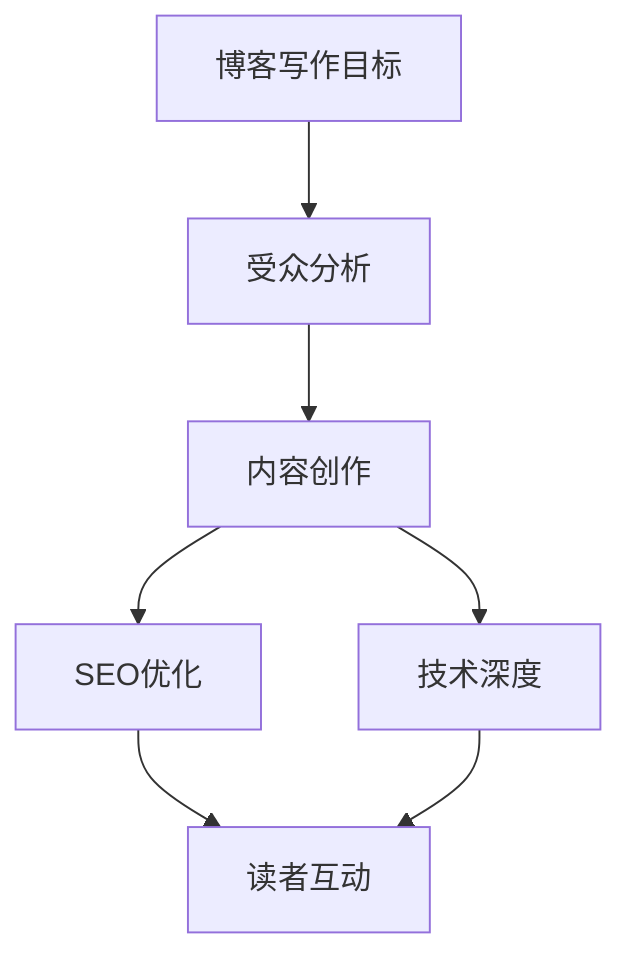

                 

# 技术博客写作：建立专业声誉和吸引客户

> **关键词**：技术博客，专业声誉，客户吸引，内容创作，策略，写作技巧

> **摘要**：本文深入探讨了技术博客写作的重要性，以及如何通过精心策划和创作来建立专业声誉，吸引目标客户。通过详细分析核心概念、算法原理、数学模型，并结合实际案例，提供了实用的写作技巧和策略，为技术专家和开发者提供了全面的指南。

## 1. 背景介绍

### 1.1 目的和范围

在数字化时代，技术博客已成为知识传播和建立个人品牌的重要途径。本文旨在揭示技术博客写作的精髓，帮助IT专业人士通过高质量的内容创作，提升个人声誉，吸引潜在客户。我们将探讨博客写作的策略、技巧以及如何将技术知识转化为有吸引力的内容。

### 1.2 预期读者

本文面向有志于通过技术博客建立专业声誉的IT从业者，包括程序员、软件工程师、CTO、技术总监等。无论你是初出茅庐的新手，还是经验丰富的行业专家，本文都将为你提供实用的指导。

### 1.3 文档结构概述

本文结构如下：

1. **背景介绍**：介绍文章的目的和预期读者。
2. **核心概念与联系**：介绍博客写作的核心概念和原理。
3. **核心算法原理 & 具体操作步骤**：详细讲解核心算法的原理和操作步骤。
4. **数学模型和公式 & 详细讲解 & 举例说明**：阐述数学模型的应用和示例。
5. **项目实战：代码实际案例和详细解释说明**：提供实际代码案例和分析。
6. **实际应用场景**：讨论技术的实际应用。
7. **工具和资源推荐**：推荐学习和开发工具。
8. **总结：未来发展趋势与挑战**：分析未来趋势和挑战。
9. **附录：常见问题与解答**：解答常见问题。
10. **扩展阅读 & 参考资料**：提供进一步学习资源。

### 1.4 术语表

#### 1.4.1 核心术语定义

- **技术博客**：以技术为主题的博客，用于分享知识和经验。
- **专业声誉**：个人或组织在特定领域内因专业能力和贡献而获得的认可和声望。
- **客户吸引**：通过内容创作吸引目标受众，从而获得商业机会。

#### 1.4.2 相关概念解释

- **内容创作**：创造和编写有价值的内容，包括文章、教程、案例研究等。
- **受众分析**：研究目标读者的需求、兴趣和行为，以制定针对性的内容策略。

#### 1.4.3 缩略词列表

- **SEO**：搜索引擎优化（Search Engine Optimization）
- **CTO**：首席技术官（Chief Technology Officer）
- **API**：应用程序编程接口（Application Programming Interface）

## 2. 核心概念与联系

在开始技术博客写作之前，了解核心概念和它们之间的联系是非常重要的。以下是一个简单的Mermaid流程图，展示了技术博客写作的核心概念和它们之间的关系。



### 2.1. 博客写作目标

博客写作的目标是传达知识、建立专业声誉并吸引客户。为了实现这些目标，首先需要明确写作方向和内容范围。

### 2.2. 受众分析

了解目标受众的需求、兴趣和偏好是成功博客写作的关键。这有助于制定合适的内容策略，提高内容的吸引力。

### 2.3. 内容创作

内容创作是博客写作的核心。高质量的内容不仅能吸引读者，还能增强你的专业声誉。在创作过程中，应注重知识的深度和广度，以及内容的结构化和易于理解性。

### 2.4. SEO优化

SEO优化有助于提高博客在搜索引擎中的排名，从而吸引更多潜在读者。关键词优化、内容结构和链接策略都是SEO的重要组成部分。

### 2.5. 技术深度

技术深度是博客写作的重要特征。深入分析技术原理和算法，能够为读者提供有价值的信息，增强你的专业声誉。

### 2.6. 读者互动

积极与读者互动，如回复评论、参与讨论等，有助于建立社区，增强读者的忠诚度和参与度。

## 3. 核心算法原理 & 具体操作步骤

在技术博客写作中，核心算法的原理和操作步骤是不可或缺的部分。以下是一个简单的伪代码示例，用于说明如何撰写一个基础的排序算法。

```python
# 排序算法伪代码

function sort(arr):
    n = length(arr)
    
    for i from 0 to n-1:
        for j from 0 to n-i-1:
            if arr[j] > arr[j+1]:
                swap(arr[j], arr[j+1])
    
    return arr
```

### 3.1. 排序算法原理

排序算法的目标是将一组数据按照一定的顺序排列。最常见的排序算法包括冒泡排序、选择排序、插入排序等。冒泡排序是一种简单的排序算法，通过重复遍历要排序的数列，比较相邻的两个元素，如果它们的顺序错误就把它们交换过来。

### 3.2. 操作步骤

1. **初始化**：设置一个计数器`i`，从0开始，表示当前遍历的轮数。
2. **内层循环**：设置一个计数器`j`，从0开始，表示当前遍历的位置。
3. **比较与交换**：比较`arr[j]`和`arr[j+1]`的值，如果`arr[j]`大于`arr[j+1]`，则交换它们的位置。
4. **重复循环**：重复上述步骤，直到`i`达到数列的长度。

通过上述步骤，冒泡排序算法能够将数组按照升序排列。虽然冒泡排序的时间复杂度为O(n^2)，但在某些简单场景下，它仍然是一种有效的排序方法。

## 4. 数学模型和公式 & 详细讲解 & 举例说明

在技术博客写作中，数学模型和公式能够为读者提供更深入的理解。以下是一个简单的线性回归模型的例子。

### 4.1. 线性回归模型

线性回归是一种用于预测数值的统计方法。其基本公式为：

\[ y = ax + b \]

其中，\( y \) 为因变量，\( x \) 为自变量，\( a \) 和 \( b \) 为模型参数。

### 4.2. 参数估计

为了确定模型参数 \( a \) 和 \( b \)，需要使用最小二乘法。最小二乘法的思想是找到一组参数，使得实际观测值与模型预测值之间的误差平方和最小。

\[ \min \sum_{i=1}^{n} (y_i - (ax_i + b))^2 \]

### 4.3. 举例说明

假设我们有以下观测数据：

| \( x \) | \( y \) |
| --- | --- |
| 1 | 2 |
| 2 | 3 |
| 3 | 4 |

要求建立线性回归模型，并预测当 \( x = 4 \) 时的 \( y \) 值。

1. **计算均值**：

   \( \bar{x} = \frac{1+2+3}{3} = 2 \)

   \( \bar{y} = \frac{2+3+4}{3} = 3 \)

2. **计算协方差和方差**：

   \( \sum_{i=1}^{n} (x_i - \bar{x})(y_i - \bar{y}) = (1-2)(2-3) + (2-2)(3-3) + (3-2)(4-3) = -1 + 0 + 1 = 0 \)

   \( \sum_{i=1}^{n} (x_i - \bar{x})^2 = (1-2)^2 + (2-2)^2 + (3-2)^2 = 1 + 0 + 1 = 2 \)

3. **计算参数**：

   \( a = \frac{\sum_{i=1}^{n} (x_i - \bar{x})(y_i - \bar{y})}{\sum_{i=1}^{n} (x_i - \bar{x})^2} = \frac{0}{2} = 0 \)

   \( b = \bar{y} - a\bar{x} = 3 - 0 \times 2 = 3 \)

因此，线性回归模型为 \( y = 3 \)。

当 \( x = 4 \) 时，预测的 \( y \) 值为 \( 3 \)。

## 5. 项目实战：代码实际案例和详细解释说明

### 5.1. 开发环境搭建

在本节中，我们将使用Python和Jupyter Notebook搭建开发环境。首先，确保已安装Python 3.8或更高版本。接下来，通过以下命令安装所需的库：

```bash
pip install numpy matplotlib
```

### 5.2. 源代码详细实现和代码解读

以下是一个简单的线性回归项目的代码实现。

```python
import numpy as np
import matplotlib.pyplot as plt

# 数据
x = np.array([1, 2, 3])
y = np.array([2, 3, 4])

# 计算均值
mean_x = np.mean(x)
mean_y = np.mean(y)

# 计算协方差和方差
covariance = np.sum((x - mean_x) * (y - mean_y))
variance_x = np.sum((x - mean_x) ** 2)

# 计算参数
a = covariance / variance_x
b = mean_y - a * mean_x

# 预测
x_new = 4
y_pred = a * x_new + b

# 可视化
plt.scatter(x, y, label='Observations')
plt.plot(x, a * x + b, 'r', label='Regression Line')
plt.xlabel('x')
plt.ylabel('y')
plt.legend()
plt.show()

print(f"Predicted y for x = {x_new}: {y_pred}")
```

### 5.3. 代码解读与分析

1. **数据导入**：使用 NumPy 导入数据。
2. **计算均值**：计算自变量 \( x \) 和因变量 \( y \) 的均值。
3. **计算协方差和方差**：计算协方差和方差，用于确定线性回归模型的参数。
4. **计算参数**：使用最小二乘法计算参数 \( a \) 和 \( b \)。
5. **预测**：使用计算出的模型参数预测新数据点的值。
6. **可视化**：使用 Matplotlib 将实际观测数据和回归线可视化，以展示模型的效果。

通过上述步骤，我们成功搭建了一个简单的线性回归模型，并使用 Jupyter Notebook 进行了可视化展示。

## 6. 实际应用场景

线性回归模型在许多实际应用场景中具有重要价值。以下是一些典型应用：

1. **数据分析**：线性回归可用于分析两个变量之间的相关性，帮助发现数据中的模式。
2. **预测分析**：在商业和金融领域，线性回归可用于预测销售、股票价格等关键指标。
3. **质量控制**：在制造业中，线性回归可用于监测产品质量，并预测潜在问题。

## 7. 工具和资源推荐

### 7.1. 学习资源推荐

#### 7.1.1. 书籍推荐

- 《数据科学入门》：适合初学者了解数据科学的基本概念和工具。

#### 7.1.2. 在线课程

- Coursera：提供高质量的数据科学和机器学习在线课程。

#### 7.1.3. 技术博客和网站

- Medium：有许多优秀的数据科学和技术博客。

### 7.2. 开发工具框架推荐

#### 7.2.1. IDE和编辑器

- PyCharm：功能强大的Python IDE。

#### 7.2.2. 调试和性能分析工具

- VSCode：支持多种编程语言的轻量级IDE。

#### 7.2.3. 相关框架和库

- TensorFlow：用于机器学习和深度学习的开源框架。

### 7.3. 相关论文著作推荐

#### 7.3.1. 经典论文

- "The Elements of Statistical Learning"：统计学习领域的一本经典著作。

#### 7.3.2. 最新研究成果

- arXiv：计算机科学和机器学习的最新研究成果。

#### 7.3.3. 应用案例分析

- Kaggle：提供各种数据科学和机器学习竞赛案例。

## 8. 总结：未来发展趋势与挑战

随着人工智能和数据科学的发展，技术博客写作将面临更多机遇和挑战。未来，博客写作将更加注重内容的质量和深度，同时，SEO优化和社交媒体互动也将成为关键。挑战包括保持持续的创作动力和应对快速变化的技术环境。

## 9. 附录：常见问题与解答

### 9.1. 什么是SEO？

SEO是指搜索引擎优化，通过优化网站内容和结构，提高在搜索引擎中的排名，从而吸引更多流量。

### 9.2. 如何撰写高质量的技术博客？

撰写高质量的技术博客需要关注内容的质量、深度和可读性，同时进行SEO优化和互动。

### 9.3. 技术博客写作有哪些工具推荐？

推荐使用PyCharm、VSCode等IDE，以及NumPy、Matplotlib等科学计算库。

## 10. 扩展阅读 & 参考资料

- [《数据科学入门》](https://www.amazon.com/Data-Science-From-Scratch-Understandable/dp/1593279194)
- [Coursera](https://www.coursera.org/)
- [Medium](https://medium.com/)
- [PyCharm](https://www.jetbrains.com/pycharm/)
- [VSCode](https://code.visualstudio.com/)
- [TensorFlow](https://www.tensorflow.org/)
- [The Elements of Statistical Learning](https://www.amazon.com/Elements-Statistical-Learning-Tutorial-Monographs/dp/0387952845)
- [arXiv](https://arxiv.org/)
- [Kaggle](https://www.kaggle.com/)

