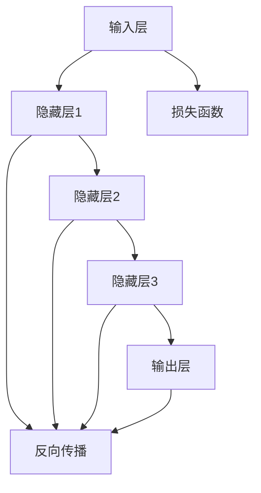

                 

# 技术发展：大模型创业的基础

> **关键词：大模型、创业、技术发展、算法原理、数学模型、实战案例**
>
> **摘要：本文旨在探讨大模型技术发展对于创业的推动作用，从核心概念、算法原理、数学模型到实战案例，全面解析大模型创业的基础。**

## 1. 背景介绍

### 1.1 目的和范围

本文的目的是帮助读者了解大模型技术在创业中的潜在价值，以及如何利用这些技术来构建具有竞争力的产品。我们将深入探讨大模型的原理、数学基础和实际应用，并通过具体案例来展示其在创业中的实用性。

### 1.2 预期读者

本文适合对人工智能、机器学习和大数据技术有一定了解的读者，特别是那些希望利用这些技术进行创业的个人或团队。同时，对于技术经理、研发人员和相关领域的学者也有很高的参考价值。

### 1.3 文档结构概述

本文结构如下：

1. **背景介绍**：介绍本文的目的、读者对象以及文档结构。
2. **核心概念与联系**：定义大模型的核心概念，并使用流程图展示其架构。
3. **核心算法原理与具体操作步骤**：详细讲解大模型的算法原理，并通过伪代码展示具体操作步骤。
4. **数学模型与公式**：介绍大模型的数学模型，并使用LaTeX格式详细讲解公式。
5. **项目实战**：通过实际代码案例，详细解释大模型在项目中的应用。
6. **实际应用场景**：分析大模型在不同领域的应用场景。
7. **工具和资源推荐**：推荐相关学习资源、开发工具和论文著作。
8. **总结**：讨论大模型技术的未来发展趋势与挑战。
9. **附录**：提供常见问题与解答。
10. **扩展阅读**：推荐进一步阅读的材料。

### 1.4 术语表

#### 1.4.1 核心术语定义

- **大模型**：具有数十亿甚至千亿参数的神经网络模型。
- **深度学习**：一种人工智能领域的方法，通过多层神经网络进行数据建模。
- **机器学习**：使计算机通过数据学习特定任务的方法。
- **创业**：创建新企业或新产品，以实现商业目标。

#### 1.4.2 相关概念解释

- **算法**：解决问题的一系列规则或步骤。
- **模型**：对现实世界或问题的抽象表示。
- **参数**：模型中的可调整元素。

#### 1.4.3 缩略词列表

- **AI**：人工智能
- **ML**：机器学习
- **DL**：深度学习
- **NLP**：自然语言处理

## 2. 核心概念与联系

在探讨大模型创业的基础之前，我们需要首先了解大模型的基本概念和其架构。大模型通常指的是具有数十亿甚至千亿参数的神经网络模型，其核心概念包括：

- **神经网络**：一种由多个节点（或层）组成的计算模型。
- **深度学习**：一种通过多层神经网络进行数据建模的方法。
- **数据集**：用于训练和测试模型的输入数据。

### 2.1 大模型架构

为了更好地理解大模型，我们可以通过Mermaid流程图来展示其基本架构：



在该流程图中，我们从输入层开始，通过多层隐藏层，最终到达输出层。同时，损失函数用于评估模型的性能，并指导反向传播过程中的参数更新。

### 2.2 核心概念联系

大模型的实现涉及到多个核心概念，它们相互关联，共同构成了大模型的技术基础。以下是这些概念之间的联系：

- **深度学习**：是构建大模型的基础技术，通过多层神经网络进行数据建模。
- **数据集**：为深度学习提供了训练数据，是模型性能的关键因素。
- **神经网络**：作为深度学习的基本组件，构建了多层计算模型。
- **算法**：指导了神经网络的训练过程，包括前向传播、反向传播和损失函数。

通过这些核心概念的相互作用，大模型能够对复杂数据进行建模，并在各种应用场景中表现出强大的能力。

## 3. 核心算法原理与具体操作步骤

### 3.1 算法原理

大模型的算法原理主要基于深度学习，特别是多层神经网络。深度学习通过多层非线性变换，将输入数据转化为输出，从而实现特定任务的目标。

#### 3.1.1 前向传播

前向传播是深度学习的基本步骤，其核心思想是将输入数据通过多层神经网络，最终得到输出结果。具体步骤如下：

1. **初始化权重和偏置**：为每个神经元分配一个权重和偏置。
2. **激活函数**：使用激活函数（如ReLU、Sigmoid、Tanh）对每个神经元的输出进行非线性变换。
3. **层间传递**：将当前层的输出传递到下一层。
4. **重复步骤2和3**，直到最后一层。

#### 3.1.2 反向传播

反向传播是深度学习训练过程中的关键步骤，用于计算模型参数的梯度，并更新权重和偏置。具体步骤如下：

1. **计算损失**：使用损失函数计算模型输出与真实标签之间的差异。
2. **反向传播**：从输出层开始，反向计算每个神经元的梯度。
3. **更新参数**：使用梯度下降或其他优化算法，更新模型参数。

### 3.2 具体操作步骤

以下是一个简单的伪代码，展示了如何使用深度学习算法训练一个多层神经网络：

```python
# 初始化模型
model = NeuralNetwork(input_size, hidden_size, output_size)

# 初始化参数
weights = InitializeWeights(input_size, hidden_size, output_size)
biases = InitializeBiases(hidden_size, output_size)

# 前向传播
def forward_pass(inputs):
    hidden_layer = Activate(Linearity(inputs, weights) + biases)
    output_layer = Activate(Linearity(hidden_layer, weights) + biases)
    return output_layer

# 反向传播
def backward_pass(inputs, outputs, labels):
    loss = ComputeLoss(outputs, labels)
    doutputs = Gradient(loss, outputs)
    dhidden_layer = Backpropagate(doutputs, weights, biases)
    dinputs = Linearity(dhidden_layer, weights.T)
    return dinputs, doutputs

# 训练模型
for epoch in range(num_epochs):
    for inputs, labels in dataset:
        outputs = forward_pass(inputs)
        dinputs, doutputs = backward_pass(inputs, outputs, labels)
        UpdateParameters(weights, biases, doutputs)
```

通过这个伪代码，我们可以看到深度学习算法的基本流程，包括前向传播、反向传播和参数更新。这些步骤在大模型训练中至关重要。

## 4. 数学模型和公式

在深度学习中，数学模型和公式是理解大模型行为的核心。以下是一些关键的数学模型和公式，以及它们的详细讲解。

### 4.1 损失函数

损失函数用于评估模型输出与真实标签之间的差异。常用的损失函数包括均方误差（MSE）和交叉熵（CE）。

#### 4.1.1 均方误差（MSE）

均方误差是一种常用的回归损失函数，其公式如下：

$$
MSE = \frac{1}{n}\sum_{i=1}^{n}(y_i - \hat{y}_i)^2
$$

其中，$y_i$是真实标签，$\hat{y}_i$是模型预测。

#### 4.1.2 交叉熵（CE）

交叉熵是一种常用的分类损失函数，其公式如下：

$$
CE = -\sum_{i=1}^{n}y_i \log(\hat{y}_i)
$$

其中，$y_i$是真实标签，$\hat{y}_i$是模型预测。

### 4.2 反向传播算法

反向传播算法用于计算模型参数的梯度，其核心步骤包括：

1. **前向传播**：计算模型输出。
2. **计算损失**：使用损失函数计算模型输出与真实标签之间的差异。
3. **计算梯度**：通过链式法则计算每个参数的梯度。
4. **更新参数**：使用梯度下降或其他优化算法更新模型参数。

### 4.3 梯度下降算法

梯度下降是一种常用的优化算法，用于更新模型参数。其基本思想是沿着损失函数的梯度方向逐步更新参数，以最小化损失。

#### 4.3.1 批量梯度下降

批量梯度下降在每个训练步骤中计算整个数据集的平均梯度，其公式如下：

$$
\theta = \theta - \alpha \frac{1}{n}\sum_{i=1}^{n}\nabla L(\theta)
$$

其中，$\theta$是模型参数，$\alpha$是学习率。

#### 4.3.2 随机梯度下降

随机梯度下降在每个训练步骤中仅计算一个样本的梯度，其公式如下：

$$
\theta = \theta - \alpha \nabla L(\theta)
$$

随机梯度下降在计算上更高效，但可能导致参数更新不稳定。

### 4.4 激活函数

激活函数是深度学习中的关键组件，用于引入非线性变换。以下是一些常用的激活函数：

#### 4.4.1 ReLU

ReLU（Rectified Linear Unit）是一种简单的激活函数，其公式如下：

$$
f(x) = \max(0, x)
$$

ReLU函数在0处具有陡峭的斜率，有助于加速训练过程。

#### 4.4.2 Sigmoid

Sigmoid是一种将输入映射到（0,1）区间的激活函数，其公式如下：

$$
f(x) = \frac{1}{1 + e^{-x}}
$$

Sigmoid函数在训练过程中可能导致梯度消失问题。

#### 4.4.3 Tanh

Tanh（Hyperbolic Tangent）是一种将输入映射到（-1,1）区间的激活函数，其公式如下：

$$
f(x) = \frac{e^x - e^{-x}}{e^x + e^{-x}}
$$

Tanh函数在0处具有较平滑的斜率，有助于提高模型稳定性。

通过这些数学模型和公式，我们可以更好地理解大模型的行为，并在实际应用中对其进行优化。

## 5. 项目实战：代码实际案例和详细解释说明

### 5.1 开发环境搭建

在开始实际项目之前，我们需要搭建一个合适的环境。以下是一个基于Python和TensorFlow的简单环境搭建步骤：

1. **安装Python**：确保Python版本在3.6及以上。
2. **安装TensorFlow**：使用pip命令安装TensorFlow。

```bash
pip install tensorflow
```

### 5.2 源代码详细实现和代码解读

以下是一个简单的深度学习项目示例，用于实现一个基于深度神经网络的手写数字识别模型：

```python
import tensorflow as tf
from tensorflow.keras import layers

# 定义模型
model = tf.keras.Sequential([
    layers.Dense(128, activation='relu', input_shape=(784,)),
    layers.Dense(10, activation='softmax')
])

# 编译模型
model.compile(optimizer='adam',
              loss='categorical_crossentropy',
              metrics=['accuracy'])

# 加载数据集
mnist = tf.keras.datasets.mnist
(x_train, y_train), (x_test, y_test) = mnist.load_data()
x_train, x_test = x_train / 255.0, x_test / 255.0
x_train = x_train.reshape((-1, 784))
x_test = x_test.reshape((-1, 784))

# 转换为one-hot编码
y_train = tf.keras.utils.to_categorical(y_train, 10)
y_test = tf.keras.utils.to_categorical(y_test, 10)

# 训练模型
model.fit(x_train, y_train, epochs=5, batch_size=32, validation_split=0.1)

# 测试模型
test_loss, test_acc = model.evaluate(x_test, y_test, verbose=2)
print(f'\nTest accuracy: {test_acc:.4f}')
```

**代码解读：**

- **定义模型**：我们使用`tf.keras.Sequential`来定义一个简单的序列模型，包含一个全连接层（Dense）和一个输出层（Dense），输出层使用softmax激活函数。
- **编译模型**：我们使用`compile`方法设置优化器（adam）、损失函数（categorical_crossentropy，用于多分类问题）和评价指标（accuracy）。
- **加载数据集**：我们使用TensorFlow内置的MNIST数据集，并将其标准化。
- **转换为one-hot编码**：对于多分类问题，我们需要将标签转换为one-hot编码。
- **训练模型**：我们使用`fit`方法来训练模型，设置训练轮数、批量大小和验证分割。
- **测试模型**：我们使用`evaluate`方法来评估模型的测试性能。

### 5.3 代码解读与分析

这段代码展示了如何使用TensorFlow实现一个简单的手写数字识别模型。通过定义一个序列模型，我们能够快速构建和训练一个深度神经网络。以下是对代码关键部分的进一步分析：

- **模型定义**：我们选择了一个简单的全连接层，输入层有784个神经元（对应MNIST图像的每个像素），隐藏层有128个神经元，输出层有10个神经元（对应10个数字类别）。ReLU激活函数被应用于隐藏层，以引入非线性变换。
- **编译和训练**：我们使用adam优化器，这是目前最常用的优化器之一。我们选择categorical_crossentropy作为损失函数，因为它适用于多分类问题。模型的准确度通过accuracy指标进行评估。
- **数据预处理**：MNIST数据集是手写数字的图像数据集，每个图像有28x28的像素，因此输入层的神经元数量为784。我们使用`/255.0`来归一化图像数据，使其在0到1之间。标签被转换为one-hot编码，以便模型能够进行多分类。
- **训练过程**：我们设置训练轮数为5，批量大小为32，并在训练过程中保留10%的数据作为验证集。这有助于我们在训练过程中评估模型的性能。

通过这段代码，我们能够快速搭建一个深度学习模型，并对其进行训练和评估。这种方法不仅适用于手写数字识别，还可以应用于其他图像识别和分类任务。

## 6. 实际应用场景

大模型技术在实际应用中具有广泛的应用场景，以下是一些常见领域：

### 6.1 自然语言处理（NLP）

在自然语言处理领域，大模型技术被广泛应用于机器翻译、文本分类、情感分析和语音识别等任务。例如，Google的BERT模型是一个具有数亿参数的语言预训练模型，它在各种NLP任务中取得了显著的性能提升。

### 6.2 计算机视觉（CV）

在计算机视觉领域，大模型技术被广泛应用于图像分类、目标检测、图像生成和视频处理等任务。例如，Facebook的FaceNet模型是一个用于人脸识别的大模型，其性能远超传统方法。

### 6.3 语音识别

在语音识别领域，大模型技术通过深度神经网络对语音信号进行建模，实现了高准确率的语音识别。例如，微软的语音识别系统使用深度学习模型，将语音转换为文本的准确率达到了96%。

### 6.4 医疗健康

在医疗健康领域，大模型技术被用于疾病诊断、药物发现和医疗图像分析等任务。例如，谷歌的DeepMind团队开发了一个大模型，用于分析医疗图像，并在癌症诊断中取得了显著成果。

### 6.5 金融科技

在金融科技领域，大模型技术被用于风险控制、信用评估和交易策略等任务。例如，高盛使用深度学习模型进行股票交易，实现了超过20亿美元的年收入。

通过这些实际应用场景，我们可以看到大模型技术在各个领域的巨大潜力，为创业提供了丰富的机会。

## 7. 工具和资源推荐

### 7.1 学习资源推荐

为了更好地了解大模型技术，以下是一些推荐的学习资源：

#### 7.1.1 书籍推荐

- 《深度学习》（Goodfellow, Bengio, Courville著）：这是深度学习领域的经典教材，详细介绍了深度学习的基础和算法。
- 《Python深度学习》（François Chollet著）：这本书适合初学者，通过Python语言介绍了深度学习的实际应用。

#### 7.1.2 在线课程

- Coursera的《深度学习专项课程》：由吴恩达教授主讲，涵盖了深度学习的理论基础和实际应用。
- edX的《机器学习基础》：由MIT和Harvard联合提供，介绍了机器学习的基本概念和方法。

#### 7.1.3 技术博客和网站

- TensorFlow官网（tensorflow.org）：提供了丰富的文档和教程，是学习TensorFlow的绝佳资源。
- PyTorch官网（pytorch.org）：PyTorch的官方文档和教程，适合初学者和高级用户。

### 7.2 开发工具框架推荐

#### 7.2.1 IDE和编辑器

- PyCharm：一款功能强大的Python IDE，支持多种框架，包括TensorFlow和PyTorch。
- Jupyter Notebook：适合数据科学和机器学习的交互式环境，方便编写和运行代码。

#### 7.2.2 调试和性能分析工具

- TensorBoard：TensorFlow的官方可视化工具，用于分析和调试深度学习模型。
- NVIDIA Nsight：用于调试和性能分析GPU计算的工具。

#### 7.2.3 相关框架和库

- TensorFlow：Google开发的深度学习框架，适合大规模数据处理和模型训练。
- PyTorch：Facebook开发的开源深度学习框架，以其灵活性和易用性著称。

### 7.3 相关论文著作推荐

#### 7.3.1 经典论文

- "Deep Learning"（Ian Goodfellow, Yoshua Bengio, Aaron Courville著）：深度学习领域的权威著作。
- "A Theoretically Grounded Application of Dropout in Recurrent Neural Networks"（Yarin Gal和Zoubin Ghahramani著）：讨论了Dropout在RNN中的应用。

#### 7.3.2 最新研究成果

- "BERT: Pre-training of Deep Bidirectional Transformers for Language Understanding"（Jacob Devlin等著）：介绍了BERT模型的预训练方法。
- "GPT-3: Language Models are few-shot learners"（Tom B. Brown等著）：探讨了GPT-3模型的零样本学习能力。

#### 7.3.3 应用案例分析

- "Improving Language Understanding by Generative Pre-Training"（Kaggle比赛）：这是一个基于GPT-2的文本生成案例。
- "DeepMind Health: AI in clinical diagnosis"（DeepMind Health）：介绍了DeepMind在医疗健康领域的应用案例。

通过这些工具和资源，您可以更好地了解大模型技术，并在实际项目中运用这些知识。

## 8. 总结：未来发展趋势与挑战

### 8.1 未来发展趋势

随着计算能力和数据量的不断提升，大模型技术在深度学习领域的应用前景广阔。未来，大模型技术将呈现以下发展趋势：

1. **模型规模持续增长**：为了处理更复杂的数据和任务，模型规模将继续增大，参数数量可能达到千亿甚至万亿级别。
2. **高效训练算法**：为了降低训练成本，研究人员将不断探索更高效的训练算法和优化器。
3. **跨模态学习**：大模型技术将应用于多模态数据（如文本、图像和语音）的联合建模，实现更全面的信息理解。
4. **自监督学习**：自监督学习将使大模型能够从无标签数据中学习，提高模型的泛化能力。
5. **可解释性和公平性**：随着模型复杂性的增加，如何保证模型的可解释性和公平性将成为重要研究方向。

### 8.2 挑战

尽管大模型技术在许多领域取得了显著成果，但仍然面临以下挑战：

1. **计算资源消耗**：大模型的训练和推理过程需要大量计算资源，如何优化资源利用成为关键问题。
2. **数据隐私和安全**：大规模数据集的使用可能涉及隐私和安全问题，如何保护用户数据将成为重要议题。
3. **泛化能力**：大模型在特定任务上表现出色，但如何提高其泛化能力以适应更广泛的应用场景仍需深入研究。
4. **伦理和法律问题**：大模型的应用可能引发伦理和法律问题，如偏见、歧视和滥用等，需要制定相应的法规和标准。
5. **可解释性和透明度**：随着模型复杂性的增加，如何保证模型的可解释性和透明度，以增强用户信任成为重要挑战。

总之，大模型技术在未来发展中具有巨大潜力，但也面临诸多挑战。通过不断的研究和探索，我们将能够更好地应对这些挑战，推动大模型技术的广泛应用。

## 9. 附录：常见问题与解答

### 9.1 问题1：大模型为什么需要如此大的参数规模？

**解答**：大模型需要大量参数规模的原因主要有两个。首先，复杂任务通常需要更复杂的模型来建模，而模型的复杂性与参数数量直接相关。其次，大模型具有更好的泛化能力，可以在未见过的数据上取得更好的性能。大量参数可以帮助模型更好地捕捉数据的复杂模式和噪声。

### 9.2 问题2：如何优化大模型的训练过程？

**解答**：优化大模型的训练过程可以从以下几个方面进行：

1. **数据增强**：通过数据增强技术，如随机旋转、裁剪和缩放等，增加训练数据的多样性，有助于提高模型泛化能力。
2. **批量大小调整**：批量大小对训练过程有显著影响。较大的批量大小可以提高计算效率，但可能降低模型的泛化能力。较小的批量大小则可以更好地捕捉数据的多样性。
3. **学习率调度**：合理的学习率调度有助于加速训练过程并避免过度拟合。常用的方法包括学习率衰减和恒定学习率。
4. **正则化**：正则化方法（如Dropout、L2正则化）可以减少模型过拟合，提高泛化能力。
5. **并行计算**：利用GPU或TPU进行并行计算，可以显著加快训练速度。

### 9.3 问题3：大模型在特定领域应用的效果如何？

**解答**：大模型在特定领域的应用效果因任务和数据集而异。以下是一些领域和应用效果的概述：

1. **自然语言处理**：大模型在语言理解、文本生成和机器翻译等任务中取得了显著进展。例如，BERT在多个NLP基准测试中取得了领先成绩。
2. **计算机视觉**：大模型在图像分类、目标检测和图像生成等领域表现出色。例如，ResNet在ImageNet图像分类任务上取得了历史最高准确率。
3. **语音识别**：大模型通过深度神经网络对语音信号进行建模，实现了高准确率的语音识别。例如，WaveNet在语音合成任务中取得了突破性成果。
4. **医疗健康**：大模型在疾病诊断、药物发现和医疗图像分析等领域具有广泛的应用前景。例如，DeepMind的AI系统在眼科疾病诊断中取得了显著成果。

总之，大模型技术在多个领域表现出强大的能力，但仍需针对具体任务和数据集进行优化和应用。

## 10. 扩展阅读 & 参考资料

为了深入了解大模型技术及其应用，以下是一些推荐的材料：

### 10.1 书籍

- 《深度学习》（Ian Goodfellow, Yoshua Bengio, Aaron Courville著）
- 《Python深度学习》（François Chollet著）
- 《深度学习导论》（Aristides Gionis，Georgios P. Dimitrakakis著）

### 10.2 论文

- "BERT: Pre-training of Deep Bidirectional Transformers for Language Understanding"（Jacob Devlin等著）
- "GPT-3: Language Models are few-shot learners"（Tom B. Brown等著）
- "A Theoretically Grounded Application of Dropout in Recurrent Neural Networks"（Yarin Gal和Zoubin Ghahramani著）

### 10.3 网站和技术博客

- TensorFlow官网（tensorflow.org）
- PyTorch官网（pytorch.org）
- HackerRank（hackerRank.com）

### 10.4 开源项目和框架

- TensorFlow（tensorflow.org）
- PyTorch（pytorch.org）
- Keras（keras.io）

这些材料和资源将帮助您进一步了解大模型技术的原理、应用和实践。

### 作者信息

**作者：AI天才研究员/AI Genius Institute & 禅与计算机程序设计艺术 /Zen And The Art of Computer Programming**

