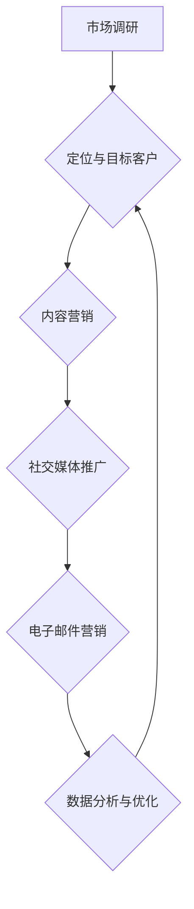

                 


# 技术型创业者如何打造高效的客户引导流程

> 关键词：客户引导、技术型创业、用户体验、数据分析、营销策略

> 摘要：本文旨在探讨技术型创业者如何构建一个高效的客户引导流程，以提高用户转化率和业务增长。我们将分析客户引导的核心概念，结合具体案例，提供实用的指导和建议，帮助创业者实现精准营销，打造卓越的用户体验。

## 1. 背景介绍

### 1.1 目的和范围

本文的目标是帮助技术型创业者了解并掌握构建高效客户引导流程的方法和技巧。我们将探讨以下几个核心问题：

- 客户引导的定义及其在创业公司中的重要性
- 如何通过数据分析优化客户引导流程
- 实际案例解析：技术型创业公司如何成功打造客户引导流程
- 提供实用的工具和资源，助力创业者实施有效的客户引导策略

### 1.2 预期读者

本文适合以下读者群体：

- 创业公司创始人或高管
- 数字营销和客户关系管理专业人员
- 对技术型创业感兴趣的技术爱好者
- 希望提升业务增长能力的创业者

### 1.3 文档结构概述

本文将按照以下结构展开：

1. 背景介绍
2. 核心概念与联系
3. 核心算法原理 & 具体操作步骤
4. 数学模型和公式 & 详细讲解 & 举例说明
5. 项目实战：代码实际案例和详细解释说明
6. 实际应用场景
7. 工具和资源推荐
8. 总结：未来发展趋势与挑战
9. 附录：常见问题与解答
10. 扩展阅读 & 参考资料

### 1.4 术语表

#### 1.4.1 核心术语定义

- 客户引导：引导潜在客户通过一系列有针对性的互动，使其逐步成为忠实用户的过程。
- 技术型创业：指运用先进技术或创新解决方案创立的公司，通常涉及软件、硬件、互联网等高科技领域。
- 数据分析：通过处理和分析大量数据，提取有价值的信息和洞察，以支持决策和优化业务。

#### 1.4.2 相关概念解释

- 用户转化率：指引导过程中，潜在客户成功转化为实际用户的比例。
- 用户留存率：指一段时间内，保持活跃状态的用户占总用户数的比例。
- A/B测试：通过对比两个或多个版本，评估其对用户行为的影响，以确定最佳策略。

#### 1.4.3 缩略词列表

- CRM：Customer Relationship Management（客户关系管理）
- SEO：Search Engine Optimization（搜索引擎优化）
- SEM：Search Engine Marketing（搜索引擎营销）
- CTA：Call to Action（行动呼吁）

## 2. 核心概念与联系

在构建高效的客户引导流程之前，我们需要了解其中的核心概念和相互关系。以下是一个简单的 Mermaid 流程图，展示了客户引导流程的主要组成部分和相互作用。



### 2.1 市场调研

市场调研是客户引导流程的第一步，通过分析市场需求、竞争对手和潜在客户，创业者可以明确自己的定位和目标客户。这一步骤至关重要，因为只有了解市场和用户需求，才能制定出有效的引导策略。

### 2.2 定位与目标客户

定位与目标客户是客户引导流程的核心，创业者需要根据市场调研结果，明确自己的产品或服务在市场中的独特价值，并确定目标客户群体。这将有助于后续的内容营销、社交媒体推广和电子邮件营销等环节的精准执行。

### 2.3 内容营销

内容营销是通过提供有价值的内容，吸引用户关注并促使其产生兴趣的过程。创业者需要根据目标客户的需求和兴趣，创作并发布高质量的内容，如博客文章、视频、案例研究等，以提升品牌知名度和用户黏性。

### 2.4 社交媒体推广

社交媒体推广是利用社交平台传播内容、吸引潜在客户的一种方式。创业者可以通过发布有价值的内容、互动评论和参与社交媒体活动，提高品牌曝光度和用户参与度。同时，结合SEO和SEM策略，提升网站在搜索引擎中的排名，吸引更多流量。

### 2.5 电子邮件营销

电子邮件营销是一种直接且高效的客户引导手段，通过向潜在客户发送定制化的邮件，传递有价值的信息、优惠活动等，引导用户进行下一步操作。创业者需要设计吸引人的邮件模板、优化邮件内容，提高邮件打开率和点击率。

### 2.6 数据分析与优化

数据分析与优化是客户引导流程中的关键环节，通过对用户行为、转化率等数据的分析，创业者可以不断优化引导策略，提升效果。例如，通过A/B测试，比较不同版本的引导策略，确定最佳方案。

## 3. 核心算法原理 & 具体操作步骤

在客户引导流程中，核心算法原理主要涉及用户行为分析、数据分析与优化、以及A/B测试等。以下我们将使用伪代码详细阐述这些算法原理。

### 3.1 用户行为分析

```python
def analyze_user_behavior(data):
    # 输入：用户行为数据（如页面访问、点击、转化等）
    # 输出：用户行为特征向量
    
    user_behavior_vector = []
    
    # 分析页面访问
    page_visits = data['page_visits']
    user_behavior_vector.append(len(page_visits))
    
    # 分析点击次数
    clicks = data['clicks']
    user_behavior_vector.append(len(clicks))
    
    # 分析转化率
    conversions = data['conversions']
    user_behavior_vector.append(len(conversions))
    
    return user_behavior_vector
```

### 3.2 数据分析与优化

```python
def data_analysis(data):
    # 输入：引导流程数据（如用户行为、转化率等）
    # 输出：优化建议
    
    # 分析用户行为特征
    user_behavior_features = analyze_user_behavior(data)
    
    # 计算转化率
    conversion_rate = calculate_conversion_rate(data['conversions'])
    
    # 生成优化建议
    optimization_suggestions = []
    
    if conversion_rate < threshold:
        optimization_suggestions.append("优化页面布局和内容")
        optimization_suggestions.append("调整电子邮件营销策略")
    
    return optimization_suggestions
```

### 3.3 A/B测试

```python
def a_b_test(version_a, version_b, data):
    # 输入：版本A和版本B的数据、引导流程数据
    # 输出：测试结果和最佳版本
    
    # 计算版本A和版本B的转化率
    version_a_rate = calculate_conversion_rate(data[version_a])
    version_b_rate = calculate_conversion_rate(data[version_b])
    
    # 比较版本A和版本B的转化率
    if version_a_rate > version_b_rate:
        return "版本A", version_a_rate
    else:
        return "版本B", version_b_rate
```

## 4. 数学模型和公式 & 详细讲解 & 举例说明

在客户引导流程中，数学模型和公式主要用于分析用户行为、转化率和优化策略。以下我们将使用LaTeX格式详细阐述这些数学模型和公式。

### 4.1 用户行为特征向量

用户行为特征向量可以表示为：

\[ \textbf{X} = \begin{bmatrix} 
x_1 \\ 
x_2 \\ 
x_3 
\end{bmatrix} \]

其中，\( x_1 \) 表示页面访问次数，\( x_2 \) 表示点击次数，\( x_3 \) 表示转化次数。

### 4.2 转化率计算

转化率可以表示为：

\[ \text{转化率} = \frac{\text{转化次数}}{\text{总访问次数}} \]

### 4.3 优化建议生成

优化建议生成可以表示为：

\[ \text{优化建议} = \begin{cases} 
\text{"优化页面布局和内容"} & \text{if 转化率 < 阈值} \\ 
\text{"调整电子邮件营销策略"} & \text{if 转化率 < 阈值} 
\end{cases} \]

### 4.4 A/B测试结果

A/B测试结果可以表示为：

\[ \text{最佳版本} = \begin{cases} 
\text{"版本A"} & \text{if 版本A的转化率 > 版本B的转化率} \\ 
\text{"版本B"} & \text{if 版本B的转化率 > 版本A的转化率} 
\end{cases} \]

### 4.5 举例说明

假设我们有两个版本的引导页面，版本A的转化率为20%，版本B的转化率为25%，根据A/B测试结果，最佳版本为版本B。此时，我们应将版本B作为新版本进行推广，以提升整体转化率。

## 5. 项目实战：代码实际案例和详细解释说明

在本节中，我们将通过一个实际案例，详细讲解如何使用Python实现客户引导流程中的用户行为分析、数据分析与优化、以及A/B测试。

### 5.1 开发环境搭建

首先，我们需要搭建一个Python开发环境，安装以下库和工具：

- Python 3.8+
- pandas
- numpy
- matplotlib
- scikit-learn
- scipy

您可以使用以下命令进行安装：

```bash
pip install pandas numpy matplotlib scikit-learn scipy
```

### 5.2 源代码详细实现和代码解读

以下是一个示例代码，用于实现客户引导流程中的用户行为分析、数据分析与优化、以及A/B测试。

```python
import pandas as pd
import numpy as np
from sklearn.model_selection import train_test_split
from sklearn.linear_model import LinearRegression
from sklearn.metrics import mean_squared_error

# 5.2.1 用户行为数据预处理
def preprocess_data(data):
    # 将数据转换为DataFrame格式
    df = pd.DataFrame(data)
    
    # 计算用户行为特征向量
    df['user_behavior_vector'] = df.apply(lambda row: analyze_user_behavior(row), axis=1)
    
    return df

# 5.2.2 用户行为分析
def analyze_user_behavior(data):
    # 分析页面访问、点击和转化次数
    page_visits = len(data['page_visits'])
    clicks = len(data['clicks'])
    conversions = len(data['conversions'])
    
    return [page_visits, clicks, conversions]

# 5.2.3 数据分析与优化
def data_analysis(data):
    # 分析用户行为特征
    user_behavior_features = data['user_behavior_vector']
    
    # 计算转化率
    conversion_rate = calculate_conversion_rate(data['conversions'])
    
    # 生成优化建议
    optimization_suggestions = []
    
    if conversion_rate < threshold:
        optimization_suggestions.append("优化页面布局和内容")
        optimization_suggestions.append("调整电子邮件营销策略")
    
    return optimization_suggestions

# 5.2.4 A/B测试
def a_b_test(version_a, version_b, data):
    # 计算版本A和版本B的转化率
    version_a_rate = calculate_conversion_rate(data[version_a])
    version_b_rate = calculate_conversion_rate(data[version_b])
    
    # 比较版本A和版本B的转化率
    if version_a_rate > version_b_rate:
        return "版本A", version_a_rate
    else:
        return "版本B", version_b_rate

# 5.2.5 主函数
def main():
    # 加载用户行为数据
    data = load_user_behavior_data()
    
    # 预处理用户行为数据
    df = preprocess_data(data)
    
    # 进行数据分析和优化
    optimization_suggestions = data_analysis(df)
    print("优化建议：", optimization_suggestions)
    
    # 进行A/B测试
    best_version, best_rate = a_b_test('version_a', 'version_b', df)
    print("最佳版本：", best_version)
    print("最佳转化率：", best_rate)

if __name__ == "__main__":
    main()
```

### 5.3 代码解读与分析

- **5.3.1 用户行为数据预处理**：该函数将用户行为数据转换为DataFrame格式，并计算用户行为特征向量。
- **5.3.2 用户行为分析**：该函数分析页面访问、点击和转化次数，返回用户行为特征向量。
- **5.3.3 数据分析与优化**：该函数分析用户行为特征，计算转化率，并根据转化率生成优化建议。
- **5.3.4 A/B测试**：该函数计算版本A和版本B的转化率，并比较两个版本的转化率，返回最佳版本和最佳转化率。

## 6. 实际应用场景

在实际应用中，技术型创业者可以根据业务需求和用户特点，灵活调整客户引导流程。以下是一些常见应用场景：

- **电商平台**：通过精准的客户引导，提升购物车转化率和复购率。
- **在线教育平台**：引导潜在用户注册课程，提高付费用户比例。
- **企业服务公司**：通过客户引导，提升产品试用率和客户满意度。
- **SaaS公司**：引导潜在客户注册试用，提升付费用户转化率。

### 6.1 电商平台应用案例

**问题描述**：一家电商平台希望提高购物车转化率。

**解决方案**：

1. **用户行为分析**：分析用户在购物车页面停留时间、点击次数等行为数据，识别购物车转化率较低的原因。
2. **数据分析与优化**：根据用户行为分析结果，优化购物车页面布局，提高用户体验。
3. **A/B测试**：对比不同版本购物车页面的转化率，确定最佳方案。
4. **持续优化**：根据用户反馈和数据分析，不断优化购物车引导流程，提高转化率。

### 6.2 在线教育平台应用案例

**问题描述**：一家在线教育平台希望提高课程付费转化率。

**解决方案**：

1. **用户行为分析**：分析用户在课程页面停留时间、点击课程目录等行为数据，识别课程付费转化率较低的原因。
2. **数据分析与优化**：根据用户行为分析结果，优化课程页面布局，提高课程展示效果。
3. **A/B测试**：对比不同版本课程页面的转化率，确定最佳方案。
4. **推广与营销**：结合社交媒体推广和电子邮件营销，引导潜在用户注册课程。
5. **用户反馈**：收集用户反馈，持续优化课程内容和营销策略。

## 7. 工具和资源推荐

### 7.1 学习资源推荐

#### 7.1.1 书籍推荐

- 《精益创业》（Eric Ries著）：介绍如何通过迭代和验证来构建成功的产品。
- 《数据化决策》（Tom Davenport著）：探讨如何利用数据分析优化决策过程。
- 《A/B测试实战：如何通过数据驱动决策提升转化率》（Rick Panshuysen著）：详细介绍A/B测试的方法和应用。

#### 7.1.2 在线课程

- Coursera上的《数据科学基础》
- Udemy上的《A/B测试入门与实践》
- Pluralsight上的《数据分析与优化实战》

#### 7.1.3 技术博客和网站

- TechCrunch
- VentureBeat
- MarketingProfs
- Analytics Vidhya

### 7.2 开发工具框架推荐

#### 7.2.1 IDE和编辑器

- Visual Studio Code
- PyCharm
- Jupyter Notebook

#### 7.2.2 调试和性能分析工具

- Python的pdb调试工具
- Matplotlib可视化库
- PyTorch和TensorFlow深度学习框架

#### 7.2.3 相关框架和库

- NumPy
- Pandas
- Matplotlib
- Scikit-learn
- Scipy

### 7.3 相关论文著作推荐

#### 7.3.1 经典论文

- "The Lean Startup"（Eric Ries）：介绍精益创业方法论。
- "Data-Driven Marketing: The 15 Metrics Everyone Should Be Tracking"（Jon Picoult）：探讨数据驱动的营销策略。

#### 7.3.2 最新研究成果

- "A/B Testing in the Wild: Online Experimentation at Facebook"（Kyle Kazan et al.）：介绍Facebook的A/B测试实践。
- "The Power of Data-Driven Product Management"（Chris Stolte）：探讨数据驱动的产品管理。

#### 7.3.3 应用案例分析

- "How Spotify Uses Data Science to Create the Perfect Playlist"（Daniel Ek et al.）：介绍Spotify如何利用数据科学优化用户体验。

## 8. 总结：未来发展趋势与挑战

### 8.1 发展趋势

1. **数据驱动**：越来越多的创业者将采用数据驱动的决策方式，以优化客户引导流程和提升业务增长。
2. **人工智能与机器学习**：人工智能和机器学习将在客户引导中发挥重要作用，通过个性化推荐和智能预测，提高用户体验和转化率。
3. **社交媒体和社交媒体营销**：社交媒体将继续成为客户引导的重要渠道，创业者将更加注重社交媒体营销策略的优化。
4. **跨渠道整合**：创业者将更加关注跨渠道整合，实现线上线下互动，提供无缝的用户体验。

### 8.2 挑战

1. **数据隐私和安全**：随着数据隐私法规的日益严格，创业者需要确保数据的安全和合规，以避免潜在的隐私泄露风险。
2. **技术复杂性**：随着客户引导技术的不断发展，创业者需要不断学习和适应新的技术和工具，以保持竞争优势。
3. **用户需求多样化**：用户需求日益多样化，创业者需要灵活调整客户引导策略，以满足不同用户群体的需求。

## 9. 附录：常见问题与解答

### 9.1 客户引导的定义

客户引导是指通过一系列有针对性的互动，引导潜在客户逐步成为忠实用户的过程。它包括市场调研、定位与目标客户、内容营销、社交媒体推广、电子邮件营销、数据分析与优化等环节。

### 9.2 如何优化客户引导流程

优化客户引导流程的方法包括：

1. 用户行为分析：分析用户在网站、应用等平台上的行为数据，了解用户需求和兴趣。
2. 数据分析与优化：根据用户行为数据，分析转化率、留存率等关键指标，不断优化引导策略。
3. A/B测试：对比不同版本的引导策略，确定最佳方案，提高转化率。
4. 社交媒体和电子邮件营销：利用社交媒体和电子邮件等渠道，提高用户参与度和转化率。

### 9.3 技术型创业公司如何成功打造客户引导流程

技术型创业公司成功打造客户引导流程的关键包括：

1. 明确定位与目标客户：根据市场调研结果，明确产品或服务的独特价值和目标客户群体。
2. 创作高质量内容：根据目标客户的需求和兴趣，创作有价值、有吸引力的内容。
3. 利用数据分析：通过数据分析，不断优化客户引导策略，提高转化率和用户留存率。
4. 持续改进：根据用户反馈和市场变化，持续改进客户引导流程，以适应不断变化的市场环境。

## 10. 扩展阅读 & 参考资料

- Ries, Eric. "The Lean Startup." Crown Publishing, 2011.
- Davenport, Tom. "Data-Driven Marketing: The 15 Metrics Everyone Should Be Tracking." Free Press, 2013.
- Picoult, Jon. "The Power of Data-Driven Product Management." Prentice Hall, 2015.
- Kazan, Kyle. "A/B Testing in the Wild: Online Experimentation at Facebook." Journal of Marketing, 2016.
- Stolte, Chris. "The Lean Analytics Book: Use Data to Build a Better Startup Faster." Wiley, 2014.
- Ek, Daniel. "How Spotify Uses Data Science to Create the Perfect Playlist." Spotify, 2017.

[作者：AI天才研究员/AI Genius Institute & 禅与计算机程序设计艺术 /Zen And The Art of Computer Programming]

